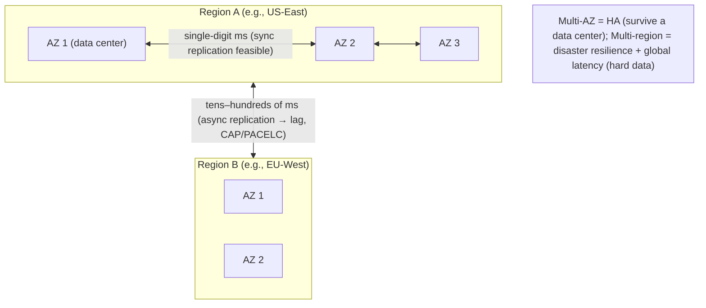
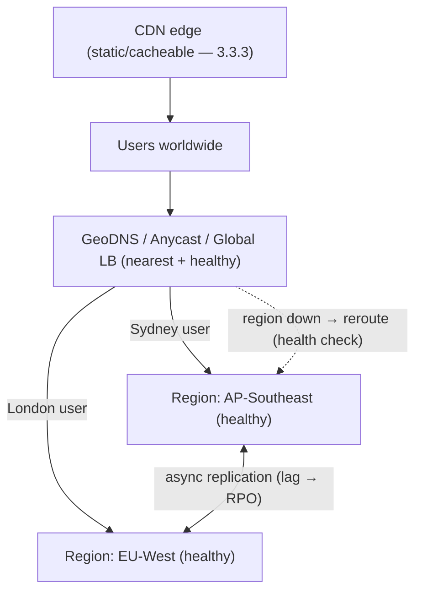

# Lesson 13.8 — Multi-Region, Multi-AZ, and Global Traffic Management

> Part 13: Cloud Native · Difficulty: 🔴⚫
>
> **Prerequisites:** [3.2.4 DNS/GeoDNS], [3.3.3 CDNs/Anycast], [10.2 Sync vs Async Replication], [10.7 CAP], [11.2 Redundancy/Failover], [11.8 Disaster Recovery], [13.3 Kubernetes].
> **Unlocks:** [Part 14 SRE], [Part 18 Case Studies], [Part 20 Capstone (multi-region)].

---

## 1. Learning Objectives

After this lesson you will be able to:

- Distinguish the **failure domains** — **availability zones (AZs)** vs **regions** — and how spreading across them provides **HA** vs **disaster resilience**.
- Explain **multi-AZ** as the default HA baseline and **multi-region** for disaster resilience + global low latency (and its steep costs).
- Describe **global traffic management** — **GeoDNS**, **anycast**, and **global load balancers** — for routing users to the nearest/healthy region.
- Reason about the **hard problem of multi-region data** — replication lag, consistency (CAP/PACELC — 10.7/10.8), and active-passive vs active-active.
- Map multi-region topologies to **RPO/RTO** and **DR strategies** (11.8) and choose deliberately given the cost.

---

## 2. Motivation — Surviving failures bigger than a server

Redundancy within one location (11.2) survives a single server or rack failing — but not a whole **data center** losing power, a **network partition** isolating a facility, or a **regional disaster** (flood, fiber cut, cloud-region outage). And a single location can't serve a **global user base** with low latency — a user in Sydney hitting a data center in Virginia pays ~200ms+ round-trip just in physics (3.1.3/8.1.1). Real systems address both by spreading across **failure domains** at increasing scope, and by **routing users intelligently** across them.

Cloud providers structure this as **availability zones** (isolated data centers within a region, close enough for low-latency links) and **regions** (geographically distant, independent). **Multi-AZ** deployment — spreading replicas across zones — is the **HA baseline** (survive a data-center failure with negligible latency cost) and should be the default for any serious system. **Multi-region** — spanning distant regions — adds **disaster resilience** (survive a whole region failing) and **global low latency** (serve users from a nearby region) — but at **steep cost**: cross-region latency makes **data consistency** genuinely hard (the CAP/PACELC tradeoffs — 10.7/10.8 become unavoidable and expensive), and operational complexity multiplies. Routing users across regions needs **global traffic management** (GeoDNS, anycast, global load balancers — 3.2.4/3.3.3). This lesson develops the failure-domain hierarchy, multi-AZ vs multi-region, global traffic management, and the hard multi-region data problem — always framed by **RPO/RTO** and cost (11.8).

---

## 3. Theory — From first principles

### 3.1 Failure domains: zones and regions

`[CS]` Cloud infrastructure is structured into nested **failure domains** `[CS]`:
- **Availability Zone (AZ):** an **isolated data center** (independent power, cooling, networking) within a region. AZs in a region are **physically separate** (a fault in one doesn't hit another) but **close** (linked by low-latency, high-bandwidth private networks — typically single-digit ms). **Spanning AZs survives a data-center-level failure.**
- **Region:** a **geographically distinct** location (a different city/continent) containing multiple AZs. Regions are **far apart** and **independent** (a regional disaster doesn't affect others), but **cross-region latency is high** (tens–hundreds of ms — physics — 3.1.3). **Spanning regions survives a whole-region failure.**
- `[BP]` The hierarchy: **rack → data center (AZ) → region**. Spread across the level of failure you must survive. **Correlated failures** (11.1) — a shared dependency, a bad global config push — can still cross domains, so domains are necessary but not sufficient.

### 3.2 Multi-AZ — the HA baseline

`[BP]` **Multi-AZ** = deploy across **≥2 (usually 3) AZs** within a region `[BP]`:
- **Why the default:** survives a **data-center/AZ failure** (power, cooling, network) with **negligible latency penalty** (AZs are ms apart) and **modest cost** (same region). This is the **HA baseline** for any production system (11.2).
- **How:** spread stateless instances across AZs (Kubernetes **topology spread constraints** / anti-affinity — 13.3), put a **load balancer** in front (3.3.1), and run data replicas across AZs (often **synchronous** replication is affordable at single-digit-ms — 10.2, giving strong consistency + low RPO).
- **Quorum systems** (etcd/Raft — 8.3.3, databases — 8.3.4) place members across **3 AZs** so a **majority survives** one AZ loss (survive 1 of 3).
- `[BP]` **Rule:** every serious system should be **multi-AZ**; it's cheap insurance against the common case (a single data-center failure). Multi-region is the next, much bigger step.

### 3.3 Multi-region — disaster resilience + global latency

`[CS]` **Multi-region** = deploy across **geographically distant regions** `[CS]`:
- **Two motivations:**
  1. **Disaster resilience:** survive a **whole-region outage** (region-wide cloud failure, natural disaster) — the top tier of DR (11.8).
  2. **Global low latency:** serve users from a **nearby region** (Sydney users → Sydney region) — avoid cross-globe round-trips (3.1.3), plus data-residency/compliance (Part 15).
- **The steep costs** `[BP]`:
  - **Data consistency becomes genuinely hard** (§3.5) — cross-region latency (tens–hundreds of ms) makes synchronous cross-region replication painfully slow, so you usually go **asynchronous** → **replication lag** → the **CAP/PACELC** tradeoffs (10.7/10.8) are now unavoidable and expensive.
  - **Cost** — duplicated infrastructure across regions + cross-region data transfer fees.
  - **Operational complexity** — deploying, monitoring, and coordinating across regions; global config changes are risky (correlated failure — 11.1).
- `[BP]` **So:** multi-region is powerful but expensive — adopt it for genuine **disaster-resilience or global-latency requirements**, not by default (many systems are fine multi-AZ in one region). The data problem (§3.5) is the crux.

### 3.4 Global traffic management — routing users to a region

`[CS]` Getting each user to the **right region** (nearest + healthy) uses `[CS]`:
- **GeoDNS** (3.2.4): DNS returns a **region-specific IP based on the user's location** → routes users to their nearest region. Simple, but limited by **DNS caching/TTL** (failover is only as fast as TTL expiry — 3.2.4) and coarse geolocation.
- **Anycast** (3.3.3): the **same IP announced from multiple regions**; **BGP routing** sends the user to the **topologically nearest** one automatically, and reroutes if a region withdraws the announcement (fast failover). Used by CDNs (3.3.3) and global load balancers.
- **Global load balancer (GSLB):** a provider's global LB with a single anycast entry that **health-checks regions** and routes to the nearest healthy one, failing over automatically (combines anycast + health-aware routing).
- **CDN at the edge** (3.3.3): serve static/cacheable content from edge PoPs near users regardless of region — offloads and accelerates.
- `[BP]` **Combination:** CDN/edge for static (3.3.3) + anycast/GSLB or GeoDNS to route dynamic requests to the nearest healthy region + health-checked failover. **Latency-based + health-based routing** is the goal.

### 3.5 The hard part: multi-region data

`[CS]` **Distributing stateless compute across regions is easy; distributing data is the hard problem** `[CS]`:
- **The physics:** cross-region latency (tens–hundreds of ms) makes **synchronous** replication (10.2) between regions **too slow** for most write paths (every write would wait a cross-globe round-trip). So cross-region replication is usually **asynchronous** → **replication lag** → **CAP/PACELC** bites (10.7/10.8): in normal operation you trade **latency vs consistency** (PACELC's "else" — 10.8), and during a partition **consistency vs availability** (CAP — 10.7).
- **Topologies:**
  - **Active-passive (single-region-active + standby):** all writes go to **one region**; other regions are **read replicas / standby** (async). Simpler + consistent writes (one writer), but **cross-region write latency** for distant users and a **failover** needed if the active region dies (RTO + potential RPO loss from async lag — 11.8). The common, safer choice.
  - **Active-active (multi-master):** **multiple regions accept writes** → lowest write latency everywhere + no failover for writes, **but** you must handle **cross-region write conflicts** (multi-leader — 10.1/10.4: LWW/CRDTs/version vectors) and give up strong consistency (or use expensive globally-consistent systems). Hard to get right.
  - **Globally-distributed strong-consistency databases** (Spanner/CockroachDB-style — 5.4.1/8.2.4): provide strong consistency across regions using synchronized clocks (TrueTime — 8.2.4) + consensus — at the cost of **higher write latency** (cross-region consensus) and complexity. The "have your cake" option, expensive.
- `[BP]` **Design principle:** keep **most reads local** (regional replicas), **route writes** per your topology, **partition data by region/geography** where possible (a user's data lives in their region — also helps compliance), and **accept eventual consistency** across regions where you can (10.5). The data architecture *is* the multi-region design.

### 3.6 Mapping to RPO/RTO and DR (11.8)

`[BP]` Multi-region topologies map onto the **DR spectrum** (11.8) `[BP]`:
- **Backup/restore → pilot light → warm standby → active-active** (11.8) — increasing cost, decreasing RPO/RTO.
- **Active-passive multi-region** ≈ warm standby (or hot standby): a ready standby region; **failover** (traffic reroute via GSLB/DNS + promote the standby's data) gives low-ish RTO, and **RPO depends on async replication lag** (10.2) — you may lose the last few seconds of writes.
- **Active-active multi-region** ≈ the top tier: **no failover for writes** (all regions live) → near-zero RTO, but you paid with conflict-handling/consistency complexity (§3.5).
- `[BP]` **Choose by requirement + cost** (11.8, 1.1.5): define **RPO/RTO** and pick the cheapest topology that meets them; **and test failover** (11.8 — untested DR ≈ no DR). Don't over-buy active-active if warm-standby multi-AZ+one-standby-region meets your RPO/RTO.

### 3.7 Putting it together — a sane default progression

`[BP]` A pragmatic escalation:
1. **Single region, multi-AZ** (≥3 AZs) — the **HA baseline** everyone should have (§3.2); survives a data-center failure cheaply, with strong consistency (sync intra-region replication).
2. **+ CDN/edge** (3.3.3) for global static content + latency — cheap global acceleration without multi-region backends.
3. **Multi-region active-passive** — when you need **regional disaster resilience** or a compliance/latency reason; standby region + async replication + GSLB failover; accept RPO from lag.
4. **Multi-region active-active / global DB** — when you need **global write low-latency** or near-zero RTO and can pay the **consistency + cost + complexity** price (§3.5).
- `[BP]` Escalate only as requirements (and budget) demand — each step multiplies cost and (for data) difficulty. **Most systems live happily at step 1–2.**

---

## 4. Visual Intuition

### Failure-domain hierarchy

### Global traffic management

---

## 5. Real-World Analogy

Think of a global retailer deciding how many **warehouses** to run and how to route **customer orders**.

- **Multi-AZ = several warehouses in one metro area (§3.2):** the retailer runs **three warehouses across one city** — if one **floods or loses power**, the other two seamlessly cover, and because they're **close**, they can keep **near-perfectly-synchronized inventory** (synchronous replication, low cost). This is the sensible **baseline** — cheap insurance against losing a single building.
- **Multi-region = warehouses on different continents (§3.3):** to survive a **regional catastrophe** (an earthquake taking out the whole city) and to **serve overseas customers fast**, the retailer opens warehouses in **other continents**. Now a disaster in one city doesn't stop the business, and Sydney customers are served from Sydney (low latency). But keeping **inventory counts consistent across continents** is suddenly **very hard**: a shipment logged in Sydney takes noticeable time to reflect in London (**replication lag**) — so either London's count is **slightly stale** (eventual consistency) or you make every update wait for a **slow round-the-world confirmation** (synchronous, painfully slow). This is the CAP/PACELC reality, and it's the expensive crux of going global.
- **Global traffic management = the order-routing system (§3.4):** when a customer orders, a smart system **sends the order to the nearest warehouse that's actually operational** — by their **address** (GeoDNS) or by **whichever is network-closest and healthy** (anycast/global LB) — and if a warehouse is **closed/flooded**, it **reroutes** to the next-nearest. A **network of small neighborhood pickup lockers** (CDN edge) handles the common, standard items instantly near everyone.
- **Active-passive vs active-active (§3.5):** the cautious retailer keeps **one master inventory ledger** in the home city; overseas warehouses **read from copies and forward changes home** (active-passive — one writer, simpler, but overseas updates are slower and you must **promote a new master** if the home city falls — with possibly a few unlogged recent changes lost). The ambitious retailer lets **every warehouse update inventory directly** (active-active — fast everywhere, no single point) but must constantly **reconcile conflicting counts** when two warehouses touch the same item — a genuinely hard, error-prone job.
- **The lesson:** run **multiple buildings in one metro (multi-AZ) always**; go **intercontinental (multi-region) only when disaster-resilience or global reach truly demands it** — and know that **keeping the books consistent across continents is the real price.**

---

## 6. Industry Example

- **Multi-AZ as the HA default** `[CONV]`: cloud best practice — spread instances + quorum members across ≥3 AZs; managed databases offer multi-AZ synchronous standbys (§3.2, 11.2). *(Representative.)*
- **GeoDNS + anycast + global load balancers** `[CONV]`: routing users to nearest/healthy regions; CDNs use anycast (§3.4, 3.2.4/3.3.3). *(Representative.)*
- **Globally-distributed strong-consistency DBs (Spanner/CockroachDB lineage)** `[CONV]`: cross-region strong consistency via synchronized clocks + consensus, at write-latency cost (§3.5, 8.2.4, Part 18.3). *(Representative.)*
- **Active-passive with async cross-region replication** `[CONV]`: the common multi-region pattern — single write region + standby, DNS/GSLB failover (§3.5/3.6, 11.8). *(Representative.)*
- **Region-wide cloud outages** `[OPINION]`: real incidents showing why multi-region (or at least tested DR) matters — and how correlated/global failures (bad config pushes) can still cross regions (§3.1/3.3, 11.1). *(Representative.)*

---

## 7. Implementation Details

- **Make multi-AZ the baseline** (§3.2): topology-spread stateless pods across ≥3 AZs (13.3), LB in front (3.3.1), sync-replicate data across AZs, place quorum members across 3 AZs (8.3.4).
- **Add CDN/edge** (3.3.3) for global static/cacheable content before considering multi-region backends (§3.7).
- **Go multi-region deliberately** (§3.3): for disaster resilience / global latency / compliance — not by default.
- **Route globally** (§3.4): GeoDNS or anycast/GSLB with **health checks** + latency-based routing + automatic failover; mind DNS TTL for failover speed (3.2.4).
- **Design the data layer first** (§3.5): choose active-passive (one write region + async standby, simpler) vs active-active (multi-master + conflict resolution — 10.4) vs a global strong-consistency DB (Spanner-style); keep reads local, partition by geography, accept eventual consistency across regions where possible.
- **Map to RPO/RTO** (§3.6, 11.8): pick the cheapest topology meeting your targets; account for async **replication lag → RPO** (10.2).
- **Guard against correlated failures** (11.1): stagger global config/deploy changes across regions (canary per region — 13.7); don't push a bad change everywhere at once.
- **Test regional failover** (11.8) — untested DR ≈ no DR.

---

## 8. Advantages

- **Multi-AZ:** survive a data-center failure cheaply with strong consistency (HA baseline) (§3.2, 11.2).
- **Multi-region:** disaster resilience (survive a region), global low latency, data residency/compliance (§3.3).
- **Global traffic management:** users served from nearest healthy region; automatic failover (§3.4).
- **Local reads:** regional replicas serve reads fast (§3.5).
- **DR tiers:** map topology to RPO/RTO deliberately (§3.6, 11.8).

---

## 9. Disadvantages / costs

- **Multi-region data consistency is hard** — async lag + CAP/PACELC + conflict resolution (§3.5, 10.7/10.8) — the crux.
- **Cost** — duplicated infra + cross-region data transfer (§3.3).
- **Operational complexity** — deploy/monitor/coordinate across regions; risky global changes (§3.3, 11.1).
- **Failover complexity/RPO loss** — active-passive failover has RTO + async-lag RPO (§3.6, 11.8).
- **Active-active is very hard** — conflict handling, weaker consistency (§3.5, 10.4).
- **DNS-failover latency** — TTL caching slows GeoDNS failover (§3.4, 3.2.4).

---

## 10. When NOT to go multi-region

- **When multi-AZ meets your HA/DR needs** — most systems don't need multi-region (§3.7).
- **When you can't handle the data consistency/cost/complexity** — don't adopt active-active without the expertise (§3.5).
- **When latency/DR requirements don't justify it** — CDN + multi-AZ may suffice for global users needing mostly static/cacheable content (§3.7).
- **For write-heavy strongly-consistent workloads** without a global-consistency DB — cross-region writes will be slow/inconsistent (§3.5).
- **Before you've even done multi-AZ + tested DR** — walk before you run (§3.7, 11.8).

---

## 11. Common Mistakes

1. **Single-AZ production** — no HA against a data-center failure (§3.2).
2. **Multi-region without solving data** — distributing compute but assuming data "just replicates" consistently (§3.5).
3. **Active-active without conflict handling** — silent data divergence/corruption (§3.5, 10.4).
4. **Ignoring replication lag → RPO** — assuming zero data loss on regional failover (§3.6, 10.2/11.8).
5. **Slow DNS failover** — long TTLs delay regional failover (§3.4, 3.2.4).
6. **Global config/deploy blast radius** — pushing a bad change to all regions at once (correlated failure — §3.1, 11.1).
7. **Untested failover** — DR that's never exercised fails when needed (§3.6, 11.8).
8. **Over-engineering** — expensive active-active when warm-standby multi-region (or multi-AZ) suffices (§3.7).

---

## 12. Interview Questions

**🟢 Easy**
- What's the difference between an availability zone and a region?
- Why is multi-AZ the HA baseline, and why is multi-region a bigger step?

**🟡 Medium**
- How do GeoDNS, anycast, and global load balancers route users to regions, and how do they fail over?
- Why is distributing data across regions harder than distributing stateless compute?

**🔴 Hard**
- Compare active-passive and active-active multi-region topologies: write latency, failover, consistency, and conflict handling (relate to CAP/PACELC — 10.7/10.8 and multi-leader — 10.1/10.4).
- How does async cross-region replication lag translate into RPO on regional failover, and how do you bound it (11.8/10.2)?

**⚫ Staff+**
- Design a globally-available system for users on three continents with a regional-disaster-survival requirement. Choose the data topology (active-passive vs active-active vs global DB), traffic management, RPO/RTO targets, and how you'd avoid a global-config correlated failure — justifying the cost tradeoffs.
- A team wants active-active multi-region for a strongly-consistent financial ledger. Explain the consistency/latency/conflict challenges, the options (partition by region, Spanner-style global DB, or single-write-region), and what you'd recommend and why (ties to Part 20 capstone).

---

## 13. Production Pitfalls

- **Data-center outage takes you down:** single-AZ deployment had no zonal redundancy (§3.2, 11.2).
- **Split-brain / divergence in active-active:** concurrent cross-region writes conflicted and silently diverged without proper resolution (§3.5, 10.4/8.3.6).
- **Data loss on regional failover:** async replication lag meant the promoted standby was missing the last seconds of writes (RPO) (§3.6, 10.2/11.8).
- **Slow failover:** long DNS TTLs kept sending users to the dead region until caches expired (§3.4, 3.2.4).
- **Global bad-config outage:** a config/deploy pushed to all regions at once took the whole system down — correlated failure defeating multi-region (§3.1, 11.1).
- **Cross-region latency surprise:** a chatty request path made synchronous cross-region calls, blowing up latency (§3.3, 8.1.1/12.3).
- **Untested DR:** the failover runbook didn't work when a real region outage hit (§3.6, 11.8).

---

## 14. Optimization Techniques

- **Multi-AZ + topology spread + 3-AZ quorums** for cheap strong-consistency HA (§3.2, 8.3.4/11.2).
- **CDN/edge for static + latency** before multi-region backends (§3.7, 3.3.3).
- **Anycast/GSLB with health checks + latency routing** for fast, nearest-healthy routing/failover (§3.4).
- **Keep reads local (regional replicas) + partition data by geography** to minimize cross-region traffic + aid compliance (§3.5).
- **Active-passive (single write region) as the safer default**; active-active/global DB only when justified (§3.5/3.7).
- **Bound RPO via replication tuning** (semi-sync where affordable — 10.2) and map topology to RPO/RTO (§3.6, 11.8).
- **Per-region canary for global changes** to avoid correlated blast radius (§3.1, 11.1/13.7).
- **Regularly test failover** (game days — 11.8/Part 14).

---

## 15. Summary

Surviving failures **bigger than a server** and serving a **global audience** requires spreading across **failure domains** at increasing scope. Cloud infrastructure nests them: an **Availability Zone (AZ)** is an **isolated data center** within a region — physically independent but **close** (single-digit ms), so **spanning AZs survives a data-center failure**; a **region** is a **geographically distant, independent** location of multiple AZs — far apart (tens–hundreds of ms), so **spanning regions survives a whole-region disaster**. **Multi-AZ** (≥3 AZs, topology-spread pods + LB + cross-AZ replication + 3-AZ quorums) is the **HA baseline every serious system should have** — cheap, negligible latency, and **synchronous replication is affordable** (strong consistency, low RPO). **Multi-region** adds **disaster resilience** (survive a region) and **global low latency** (serve from a nearby region) + data residency — but at **steep cost**: cross-region latency makes synchronous replication too slow, so replication goes **asynchronous** → **lag** → the **CAP/PACELC** tradeoffs (10.7/10.8) become unavoidable, plus duplicated-infra cost and operational complexity. **Global traffic management** routes users to the nearest healthy region via **GeoDNS** (location-based DNS, limited by TTL caching), **anycast** (same IP from many regions, BGP picks nearest + fast reroute), and **global load balancers** (anycast + health-aware routing + failover), with **CDN/edge** (3.3.3) serving static content near everyone. The **hard part is data**: distributing stateless compute is easy, but distributing data forces a choice — **active-passive** (one write region + async standby: simpler, consistent writes, but distant-write latency and a **failover** with **RPO from async lag**), **active-active** (multi-master: lowest write latency everywhere, no write failover, but **cross-region conflict resolution** — 10.4 — and weaker consistency), or a **globally-distributed strong-consistency DB** (Spanner/CockroachDB-style — synchronized clocks + consensus — strong but higher write latency + complexity) — with the design principles of **keep reads local, partition by geography, and accept eventual consistency where you can** (10.5). Topologies map onto the **DR spectrum** (11.8): active-passive ≈ warm/hot standby (RTO + async-lag RPO); active-active ≈ top tier (near-zero RTO, high complexity) — so **choose by RPO/RTO + cost** and **test failover**. The pragmatic progression: **single-region multi-AZ (baseline) → + CDN/edge → multi-region active-passive → active-active/global DB** — escalating only as disaster-resilience/global-latency requirements and budget demand, because each step multiplies cost and (for data) difficulty, and **most systems live happily at multi-AZ + CDN**. And beware **correlated failures** (11.1) — a bad **global config/deploy push** can take down all regions at once, defeating the whole point (mitigate with per-region canaries — 13.7).

---

## 16. Revision Notes (flashcard-ready)

- **Q:** AZ vs region? **A:** AZ = isolated data center within a region (close, ms apart); region = geographically distant, independent (tens–hundreds of ms).
- **Q:** Multi-AZ purpose? **A:** HA baseline — survive a data-center failure cheaply, with sync replication (strong consistency, low RPO).
- **Q:** Multi-region purpose? **A:** Disaster resilience (survive a region) + global low latency + data residency; costly, hard data consistency.
- **Q:** Why is multi-region data hard? **A:** Cross-region latency → async replication → lag → CAP/PACELC tradeoffs unavoidable.
- **Q:** Global traffic management? **A:** GeoDNS (location-based, TTL-limited), anycast (same IP, BGP nearest + reroute), global LB (health-aware); CDN for static.
- **Q:** Active-passive? **A:** One write region + async standby; simpler/consistent writes; failover needed; RPO from async lag.
- **Q:** Active-active? **A:** Multi-master (writes everywhere); low latency + no write failover; but cross-region conflict resolution + weaker consistency.
- **Q:** Global strong-consistency DB? **A:** Spanner/CockroachDB-style — synced clocks + consensus; strong across regions at higher write latency.
- **Q:** Map to DR? **A:** Active-passive ≈ warm/hot standby (RTO + RPO from lag); active-active ≈ top tier (near-zero RTO, complex). Choose by RPO/RTO + cost; test it.
- **Q:** Multi-region correlated-failure risk? **A:** A bad global config/deploy push hits all regions at once — mitigate with per-region canary.

---

## 17. Further Reading + Knowledge-Graph Links

**Foundations (in-platform):**
- **[11.2 Redundancy/Failover]** & **[11.8 Disaster Recovery]** — failure domains, RPO/RTO, DR spectrum.
- **[10.2 Sync vs Async Replication]** / **[10.7 CAP]** / **[10.8 PACELC]** — the consistency tradeoffs.
- **[3.2.4 DNS/GeoDNS]** & **[3.3.3 CDNs/Anycast]** — global routing mechanisms.
- **[8.2.4 HLC/TrueTime]** — globally-consistent database foundations.

**Unlocks / next:**
- **[Part 14 SRE]** — DR game days, capacity, error budgets across regions.
- **[Part 18 Case Studies]** — global architectures (Spanner, CDNs).
- **[Part 20 Capstone]** — multi-region design for the wealth platform.

**External (canonical):**
- Cloud provider well-architected / DR whitepapers (multi-AZ/multi-region). *(Representative.)*
- Corbett et al., *Spanner* (globally-distributed database). *(Representative.)*
- Kleppmann, *Designing Data-Intensive Applications* — multi-datacenter replication.

> **Knowledge-graph:** `11.2/11.8 redundancy+DR` + `10.7/10.8 CAP/PACELC` + `3.2.4/3.3.3 GeoDNS/anycast` → **`13.8 multi-AZ/multi-region + global traffic`** → `Part 14 SRE` / `Part 18/20 global architectures`.
