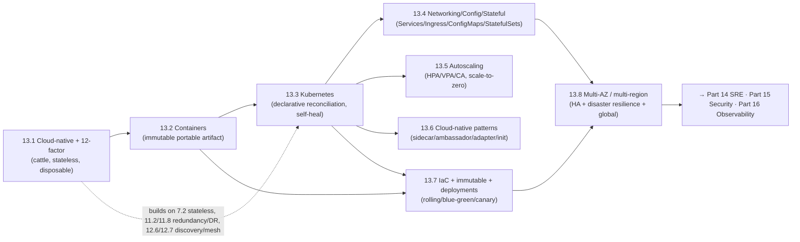

# Part 13 — Cloud Native ✅ COMPLETE

Running on modern infrastructure correctly — unified by one idea: **design apps as stateless, disposable, 12-factor "cattle" (not pets), package them as immutable containers, let a declarative orchestrator (Kubernetes) schedule/heal/scale them, compose cross-cutting concerns with sidecars, automate everything with IaC + immutable infrastructure, deploy safely (rolling/blue-green/canary), and spread across failure domains (multi-AZ baseline, multi-region when justified) — always mindful that elasticity and orchestration are powerful but not free.**

---

## Lessons

| # | Lesson | Core idea |
|---|--------|-----------|
| 13.1 | [Cloud-Native Model & 12/15-Factor](13.1-cloud-native-model-12-factor.md) | Cloud-native = designed to exploit the cloud (elastic, disposable, self-healing), not merely hosted there; cattle not pets; 12-factor (config in env, stateless processes, disposability, logs as streams) + 15-factor (API-first, telemetry, security) |
| 13.2 | [Containers](13.2-containers.md) | An isolated process on a shared kernel — namespaces (what it sees) + cgroups (what it uses) + immutable layered image; OCI portability; vs VMs (lighter/faster/denser, weaker isolation); the cloud-native artifact |
| 13.3 | [Kubernetes Orchestration](13.3-kubernetes-orchestration.md) | Declarative reconciliation (desired state + controllers converge → self-healing); Pods/ReplicaSets/Deployments/Services; scheduler (filter+score); control plane (API server/etcd-Raft/scheduler/controllers) + nodes (kubelet/runtime/kube-proxy); liveness/readiness probes |
| 13.4 | [K8s Networking, Config, Stateful](13.4-k8s-networking-config-stateful.md) | Flat pod network + Services/DNS/kube-proxy; Ingress (L7 edge); NetworkPolicy (segment); ConfigMaps/Secrets (12-factor config; Secrets ≠ encrypted); StatefulSets + PV/PVC/StorageClass; prefer managed services for state |
| 13.5 | [Autoscaling](13.5-autoscaling.md) | Elasticity needs stateless cattle; HPA (replicas) + VPA (pod size) + Cluster Autoscaler (nodes) compose; scale-to-zero + cold start; metrics (concurrency/queue-lag > CPU); doesn't scale non-elastic DB → pair with load shedding |
| 13.6 | [Cloud-Native Patterns](13.6-cloud-native-patterns.md) | Multi-container pods compose behavior without touching the app; sidecar (add capability) / ambassador (proxy outbound) / adapter (normalize output) / init (setup-before); = decorator/proxy/adapter at container level; mesh = these productized |
| 13.7 | [IaC, Immutable, Deployment Strategies](13.7-iac-immutable-deployment-strategies.md) | IaC (declarative, version-controlled infra — no ClickOps drift); immutable infra (rebuild+replace, never patch); rolling (efficient, coexist) vs blue-green (instant rollback, 2x cost) vs canary (smallest blast radius, metric-gated); feature flags |
| 13.8 | [Multi-Region, Multi-AZ, Global Traffic](13.8-multi-region-multi-az-global-traffic.md) | Failure domains: AZ (HA baseline, sync/cheap) vs region (disaster resilience + global latency, hard async data — CAP/PACELC); GeoDNS/anycast/GSLB; active-passive vs active-active vs global DB; map to RPO/RTO |

---

## The through-line of Part 13

**One sentence:** Design apps as stateless, disposable, 12/15-factor cattle (13.1); package them as immutable, portable containers isolated by namespaces + cgroups (13.2); let Kubernetes' declarative reconciliation schedule, self-heal, and scale them (13.3) with flat networking, Ingress, externalized config, and StatefulSets for the rare stateful case (13.4); scale elastically with HPA/VPA/Cluster-Autoscaler while protecting non-elastic dependencies (13.5); compose cross-cutting concerns via sidecar/ambassador/adapter/init patterns (13.6); automate everything with IaC + immutable infrastructure and deploy safely via rolling/blue-green/canary + feature flags (13.7); and spread across failure domains — multi-AZ as the HA baseline, multi-region (with its hard async-data tradeoffs) only when disaster resilience or global latency demands it (13.8).

---

## The key decisions Part 13 equips you to make

- **Is my app actually cloud-native?** 12/15-factor: stateless, disposable, config-externalized, observable — cattle not pets. (13.1)
- **How do I package it?** Immutable, minimal, layered containers (OCI); containers-in-VMs / sandboxes for isolation. (13.2)
- **How do I run it at scale?** Kubernetes: declare Deployments/Services, set requests + probes, let reconciliation heal/scale. (13.3)
- **How do networking/config/state work?** Flat net + Services/Ingress + NetworkPolicy; ConfigMaps/Secrets; StatefulSets/PV — or managed services for state. (13.4)
- **How do I scale automatically?** HPA (replicas) + VPA (size) + CA (nodes) on good metrics; scale-to-zero where cold starts are OK; protect the DB + shed load. (13.5)
- **How do I add cross-cutting concerns?** Sidecar/ambassador/adapter/init (or a mesh — 12.7); library for single-language/simple cases. (13.6)
- **How do I manage + deploy?** IaC (declarative, no ClickOps) + immutable infra; rolling/blue-green/canary + feature flags; readiness + compatible changes + auto-rollback. (13.7)
- **How do I survive failures + go global?** Multi-AZ baseline; multi-region (active-passive vs active-active vs global DB) mapped to RPO/RTO; GeoDNS/anycast/GSLB. (13.8)

---

## Self-check before Part 14

Without notes, can you:
1. Define cloud-native (vs "in the cloud"), explain cattle-not-pets, and list the key 12/15 factors?
2. Explain what a container is (namespaces + cgroups + image), how it differs from a VM, and what OCI standardizes?
3. Explain Kubernetes' declarative reconciliation and the roles of Pod/Deployment/Service, the scheduler, control plane (etcd/Raft), and probes?
4. Explain the flat network + Services/Ingress/NetworkPolicy, ConfigMaps/Secrets (and Secrets' limits), and StatefulSets/PV — and when to use managed services for state?
5. Compare HPA/VPA/Cluster-Autoscaler, explain scale-to-zero/cold start, choose autoscaling metrics, and explain why autoscaling can't scale a non-elastic DB?
6. Apply sidecar/ambassador/adapter/init and map them to decorator/proxy/adapter — and relate them to the service mesh?
7. Explain IaC + immutable infrastructure and compare rolling/blue-green/canary deployments (downtime, cost, blast radius, rollback)?
8. Distinguish AZ vs region, justify multi-AZ as the HA baseline, explain why multi-region data is hard (CAP/PACELC), and map topologies to RPO/RTO?

If any are shaky, revisit that lesson's Revision Notes. Part 14 (SRE) builds directly on this operating model — SLIs/SLOs/error budgets, monitoring vs observability, incident response, capacity, progressive delivery, and chaos engineering — turning "we can run it" into "we run it to a defined reliability target"; Parts 15 (Security) and 16 (Observability) build on NetworkPolicy/secrets/mTLS and telemetry introduced here.

---

*Reference asset for this part: `../../reference/cloud-native-kubernetes-cheatsheet.md`.*
