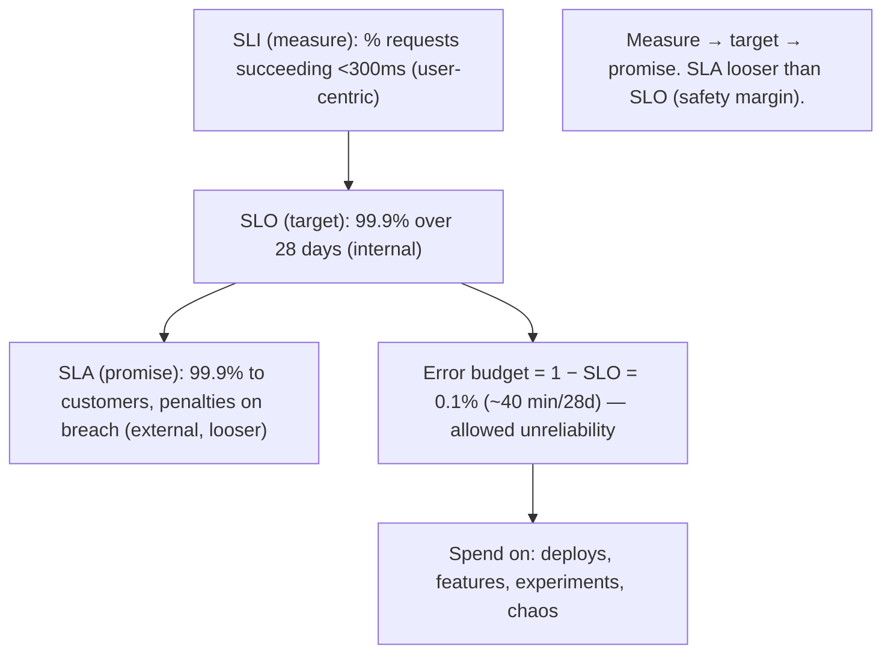
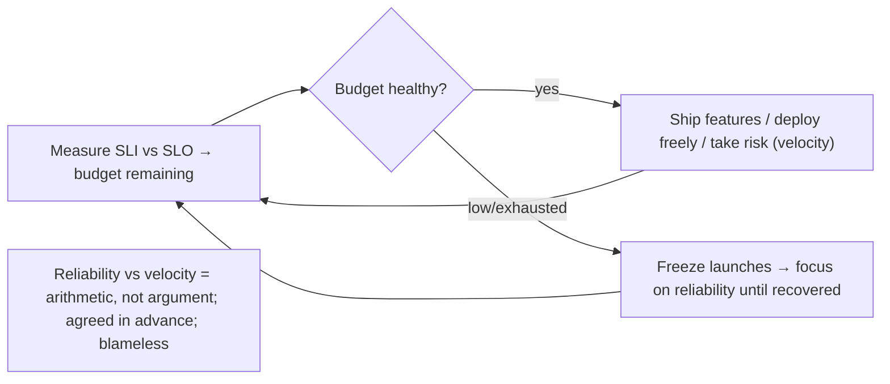

# Lesson 14.1 — SLI / SLO / SLA and the Error Budget

> Part 14: Reliability Engineering (SRE) · Difficulty: 🟡🔴
>
> **Prerequisites:** [1.2.1 Scalability/Performance/Availability/Reliability], [1.1.5 Tradeoffs], [11.1 Failure Models (MTBF/MTTR)], [13.1 Cloud-Native].
> **Unlocks:** [14.2 Toil/SRE Model], [14.3 Golden Signals], [14.4 Alerting], [14.7 Release Engineering].

---

## 1. Learning Objectives

After this lesson you will be able to:

- Define **SLI**, **SLO**, and **SLA** precisely and distinguish them (indicator = measurement, objective = internal target, agreement = external contract with consequences).
- Explain why **100% reliability is the wrong target** — it's impossible, prohibitively expensive, and unnecessary — and how to choose the **right** target.
- Compute and use an **error budget** — the allowed unreliability (1 − SLO) — as the central tool that turns reliability into a **quantitative, negotiable** engineering decision.
- Use the error budget to **balance reliability against feature velocity** (the core SRE tension) via an **error-budget policy**.
- Choose good SLIs (user-centric, measured correctly) and set SLOs from user needs, avoiding common measurement mistakes.

---

## 2. Motivation — "How reliable should it be?" needs a number

Every reliability conversation eventually hits a vague, dangerous question: *"Is the system reliable enough?"* Without a **precise, agreed definition of "enough,"** this question has no answer — so teams either **over-invest** (chasing an unattainable 100%, spending enormous effort for diminishing returns while feature work starves) or **under-invest** (shipping fast until users flee), and every incident becomes a subjective argument about whether it "mattered." The discipline of **Site Reliability Engineering (SRE)** — Google's approach to running production systems — resolves this by making reliability **quantitative and negotiable**.

The tools are a small, precise vocabulary: an **SLI** (Service Level Indicator) is a **measured** quantity of service behavior (e.g., the fraction of requests served successfully under 300ms); an **SLO** (Service Level Objective) is the **target** for that indicator (e.g., 99.9% over 28 days); and an **SLA** (Service Level Agreement) is an **external contract** with a customer that carries **consequences** (refunds/penalties) if breached. The keystone insight is the **error budget**: if your SLO is 99.9%, you are explicitly **permitting 0.1% unreliability** — that 0.1% is a **budget** you can *spend* on risk (deploys, experiments, chaos). This reframes the eternal fight between **reliability and feature velocity** (1.1.5) from an argument into arithmetic: while there's budget left, ship features; when it's exhausted, stop and fix reliability. This lesson develops SLIs/SLOs/SLAs and the error budget as the foundation of the entire SRE discipline.

---

## 3. Theory — From first principles

### 3.1 SLI — the measurement

`[CS]` A **Service Level Indicator (SLI)** is a **carefully-defined quantitative measure of some aspect of the service's behavior** `[CS]`:
- Usually expressed as a **ratio of good events to total events** (0–100%): e.g., **availability** = successful requests / total requests; **latency** = requests faster than a threshold / total requests; **quality/correctness** = correct responses / total.
- `[BP]` **Good SLIs are user-centric** — they measure what **users actually experience** (did *their* request succeed, fast enough?), not internal proxies (CPU, which users don't feel). Common SLI categories: **availability, latency, throughput, correctness, freshness, durability**.
- **Measured at the right place** (§3.6): ideally from the **user's perspective** (e.g., at the load balancer / from client-side / synthetic probes — Part 16), not just deep inside a service.

### 3.2 SLO — the internal target

`[CS]` A **Service Level Objective (SLO)** is the **target value or range for an SLI**, over a **time window** `[CS]`:
- E.g., "**99.9%** of requests succeed **over a rolling 28 days**," or "**99%** of requests complete **under 200ms**."
- **Internal** — set by the team, for the team — the reliability goal you **engineer toward**.
- `[BP]` **Must include a time window** (rolling window like 28 days is common — recent + smooths) — "99.9%" is meaningless without "over what period."
- SLOs are chosen from **user needs** (§3.5), not plucked arbitrarily — the target that keeps users happy without over-investing.

### 3.3 SLA — the external contract

`[CS]` A **Service Level Agreement (SLA)** is an **explicit contract with customers** promising a certain service level, with **consequences** (financial penalties, refunds, credits) for breach `[CS]`:
- **External + legal/business** — a promise to users with **teeth**.
- `[BP]` **Rule:** the **SLA should be looser than the internal SLO** — you promise customers *less* than you target internally, so you have a **safety margin** (breach your SLO — an internal alarm — well before you breach the SLA — a costly external event). E.g., SLA = 99.9% to customers, internal SLO = 99.95%.
- Not every service has an SLA (internal services often have SLOs but no external contract); every serious service should have SLOs.
- **Hierarchy:** SLI (what you measure) → SLO (what you target) → SLA (what you promise, with penalties). Measure → target → promise.

### 3.4 Why 100% is the wrong target

`[CS]`/`[OPINION]` A central SRE insight: **the right reliability target is almost never 100%** `[OPINION]`:
- **Impossible:** everything fails (11.1) — hardware, networks (8.1.1), dependencies, deploys; 100% uptime is unachievable in practice.
- **Prohibitively expensive:** each "nine" of availability costs dramatically more (redundancy, complexity, slower change) — **diminishing returns** (1.1.5); the cost curve is roughly exponential.
- **Unnecessary + invisible:** users can't tell the difference between 99.99% and 100% because **their own path is less reliable** — their WiFi, ISP, phone, and the internet itself fail more often than a well-run 99.99% service. Chasing reliability the user can't perceive is **wasted effort**.
- `[BP]` **So:** the goal is the **right** target — **just reliable enough** to keep users happy — and **no more**, freeing effort for features. This is the philosophical basis of the error budget (§3.5).

### 3.5 The error budget — the keystone

`[CS]` The **error budget** = **1 − SLO** — the **amount of unreliability you're explicitly allowed** over the window `[CS]`:
- If SLO = 99.9%, the error budget = **0.1%** of requests (or time) may fail. Over 28 days, 99.9% availability ≈ **~40 minutes** of allowed downtime; 99.99% ≈ **~4 minutes**. (Illustrative — depends on window/definition.)
- **The reframe:** the error budget is a **resource to spend**, not a failure to avoid. As long as you're **within budget**, the service is "reliable enough" — and you can **spend the remaining budget on risk**: shipping features, deploying frequently, running experiments/chaos (14.8), taking maintenance. **Unreliability is a budget, not a sin.**
- **This resolves the core tension** (§3.7): reliability vs velocity stops being a subjective fight and becomes **arithmetic** — spend budget on velocity until it runs low, then shift to reliability.
- `[BP]` **Error-budget burn rate** (14.4): how *fast* you're consuming budget — a fast burn (a spike of errors) triggers urgent alerts; a slow burn is a warning. Alerting on **burn rate** (rather than raw thresholds) is a key SRE alerting technique (14.4).

### 3.6 Choosing and measuring SLIs well

`[BP]` The quality of your SLIs determines whether SLOs mean anything `[BP]`:
- **User-centric:** measure what users experience (request success/latency from their side), not internal proxies (§3.1). A 200 response that returns wrong data isn't "good" — consider correctness.
- **Measured at the right point:** at the edge / load balancer / client / synthetic monitor (Part 16) to capture the real user experience, including failures the server never sees.
- **Define "good" carefully:** what counts as a success? Which status codes? What latency threshold (usually a **percentile** — p99, not average — because averages hide tail pain — Part 17)? Which requests count (exclude health checks; handle different endpoints)?
- **Few, meaningful SLIs:** a handful of SLIs that capture the critical user journeys — not dozens no one watches. **The SLO should reflect the user's actual happiness.**
- `[BP]` **Percentiles over averages** (Part 17): SLOs are usually stated as "X% of requests under Y ms" (a percentile), because averages mask the tail that hurts real users.

### 3.7 The error-budget policy — turning it into decisions

`[BP]` An **error-budget policy** is the **agreed rule** for what happens as the budget is consumed — the mechanism that makes the budget *actionable* `[BP]`:
- **Budget healthy (plenty left):** ship features, deploy freely, take reasonable risks — velocity is fine.
- **Budget low / exhausted:** the policy **triggers action** — e.g., **freeze feature launches** and **redirect engineering to reliability** (fix the causes of the burn) until the budget recovers; slow/halt risky deploys.
- `[BP]` **Why it's powerful:** it **aligns dev and ops incentives** (14.2) — devs want to ship, but overspending the budget *stops* their shipping, so they're motivated to build reliably; ops isn't the perpetual "no." It's a **self-regulating, data-driven** control loop agreed **in advance** (so it's not litigated during every incident).
- **Blameless:** exhausting the budget isn't a witch-hunt — it's a **signal** to rebalance (14.5 blameless culture). The budget is set by **product + SRE together** (reliability is a product feature — 1.2.1).

---

## 4. Visual Intuition

### SLI → SLO → SLA and the error budget

### Error-budget policy control loop

---

## 5. Real-World Analogy

Think of reliability as a **monthly spending budget** for a household, where "spending" means "taking risks that might cause outages."

- **SLI = reading the meter:** you **measure** something concrete — like the fraction of days this month the household ran smoothly (no missed bills, no lights out). That measurement is the **indicator**; it must reflect what the **family actually feels** (did *they* have hot water?), not some proxy like "the boiler's internal temperature."
- **SLO = the target you set yourselves:** "we aim for smooth running **99.9% of the time**." An **internal goal** you organize your habits around.
- **SLA = the promise to the landlord/insurer:** a **contract** — "the property will be habitable 99.9% of the time or we pay a penalty." You deliberately **promise slightly less than you privately aim for** (SLA looser than SLO), so your **internal alarm** goes off well before you actually breach the **contract** and owe money.
- **100% is the wrong goal:** aiming for **absolutely-never-any-problem** would mean never cooking (fire risk), never having guests (mess risk), never trying anything new — an exhausting, joyless, impossibly expensive life for a perfection **nobody would even notice** (the family's own lives have plenty of small hiccups anyway).
- **Error budget = your allowance for risk:** if you aim for 99.9% smooth, you've **explicitly allowed 0.1% rough** — that's your **budget to spend on living**: throw the party, try the new recipe, renovate the kitchen (deploys/features/experiments). As long as you're **within budget**, life is "good enough" and you should **enjoy the allowance**, not hoard it.
- **Error-budget policy = the house rule:** you agree **in advance**: "if we've used up this month's rough-days allowance, we **pause the parties and fix what's breaking** until next month." No arguing during a crisis about whether to cancel the party — the **rule decides**, calmly and by the numbers. And a blown budget isn't a family blame-fest — it's just a **signal to spend the next month tidying up**.

---

## 6. Industry Example

- **Google SRE (the origin)** `[CONV]`: SLIs/SLOs/error budgets as the core of running production; error-budget policies gate launches (§3.5/3.7). *(Representative.)*
- **Availability "nines" and downtime budgets** `[CONV]`: 99.9% ≈ ~43 min/month, 99.99% ≈ ~4 min/month — the exponential cost of each nine (§3.4/3.5). *(Illustrative.)*
- **SLA credits** `[CONV]`: cloud providers issue service credits when contractual SLAs are breached (§3.3). *(Representative.)*
- **Burn-rate alerting** `[CONV]`: alerting on error-budget burn rate (multi-window) rather than static thresholds (§3.5, 14.4). *(Representative.)*
- **Percentile-based latency SLOs** `[CONV]`: "99% of requests < 200ms" rather than average latency (§3.6, Part 17). *(Representative.)*

---

## 7. Implementation Details — setting up SLOs + error budgets

- **Identify critical user journeys** and define **few, user-centric SLIs** (availability, latency-percentile, correctness) measured **at the user's vantage point** (edge/client/synthetic — Part 16) (§3.1/3.6).
- **Set SLOs from user needs** (§3.2/3.5): the target that keeps users happy without over-investing; include a **time window** (e.g., rolling 28 days); use **percentiles** for latency (§3.6).
- **Set the SLA looser than the SLO** (§3.3) for a safety margin; define breach consequences with product/legal.
- **Compute the error budget** (1 − SLO) and track **budget remaining + burn rate** (§3.5) in dashboards (Part 16).
- **Agree an error-budget policy** (§3.7) with product + SRE **in advance**: what happens at healthy vs low vs exhausted budget (e.g., feature freeze → reliability focus); make it blameless (14.5).
- **Alert on burn rate** (14.4), not raw thresholds — fast burn = page, slow burn = ticket.
- **Review SLOs periodically** — adjust as user expectations / the system change; don't set-and-forget.
- **Don't over-SLO** — a few meaningful SLOs beat dozens of ignored ones (§3.6).

---

## 8. Advantages

- **Makes reliability quantitative + negotiable** — "enough" becomes a number, not an argument (§3.5).
- **Balances reliability vs velocity** — the error-budget policy turns the tension into arithmetic (§3.7, 1.1.5).
- **Aligns incentives** — devs motivated to build reliably (overspend stops launches); ops isn't the perpetual "no" (§3.7, 14.2).
- **Prevents over- and under-investment** — targets the right reliability, not 100% (§3.4).
- **Data-driven decisions** — launch/freeze based on budget, agreed in advance (§3.7).
- **User-centric** — SLIs measure real user happiness (§3.1/3.6).

---

## 9. Disadvantages / costs

- **Requires good measurement** — bad SLIs → meaningless SLOs (garbage in, garbage out) (§3.6).
- **Choosing SLOs is hard** — too tight (over-invest) vs too loose (unhappy users); needs judgment + iteration (§3.5).
- **Cultural buy-in needed** — the error-budget policy only works if product + eng actually honor it (§3.7).
- **Measurement placement matters** — measuring in the wrong place misses real user pain (§3.6).
- **Can be gamed / misused** — vanity SLIs, or ignoring the policy under launch pressure (§3.7).
- **Overhead** — instrumenting, dashboards, review cadence (Part 16).

---

## 10. When NOT to / cautions

- **Don't target 100%** — impossible, costly, invisible to users (§3.4).
- **Don't set the SLA tighter than (or equal to) the SLO** — no safety margin (§3.3).
- **Don't SLO on internal proxies** (CPU) users don't feel — measure user experience (§3.1/3.6).
- **Don't use averages for latency SLOs** — use percentiles (tail hurts users) (§3.6, Part 17).
- **Don't set-and-forget** — revisit SLOs as expectations/systems evolve (§3.7).
- **Don't create an error-budget policy no one will honor** — buy-in first (§3.7).

---

## 11. Common Mistakes

1. **Chasing 100%** — over-investment for imperceptible gains (§3.4).
2. **No time window on the SLO** — "99.9%" over *what*? (§3.2).
3. **SLA ≤ SLO** — no margin; internal alarm fires only when you're already in breach (§3.3).
4. **Internal-proxy SLIs** (CPU/memory) that don't reflect user experience (§3.1/3.6).
5. **Average latency SLOs** hiding the painful tail (§3.6, Part 17).
6. **Error budget as a sin** — treating any unreliability as failure instead of a resource to spend (§3.5).
7. **No error-budget policy** — the budget exists but nothing acts on it (§3.7).
8. **Too many SLOs** — dozens no one watches; dilutes focus (§3.6).

---

## 12. Interview Questions

**🟢 Easy**
- Define SLI, SLO, and SLA. How do they relate?
- Why should the SLA be looser than the SLO?

**🟡 Medium**
- Why is 100% reliability the wrong target? What's the right way to choose a target?
- What is an error budget, and how do you compute it? How does it reframe unreliability?

**🔴 Hard**
- How does an error-budget policy resolve the reliability-vs-velocity tension and align dev/ops incentives?
- What makes a good SLI? Discuss user-centric measurement, measurement placement, and why latency SLOs use percentiles (Part 17).

**⚫ Staff+**
- Design the SLO framework for a critical user-facing API: which SLIs, how measured and where, target values + windows, the SLA relationship, error budget, and the error-budget policy (what happens at each budget level) — and how you'd get product buy-in.
- A team is torn between shipping features fast and endless reliability firefighting, arguing every incident. Show how SLOs + error budgets + a policy convert this into a data-driven, incentive-aligned process — and the failure modes (gaming, bad SLIs, ignored policy).

---

## 13. Production Pitfalls

- **Blind spot from wrong measurement point:** SLI measured server-side missed load-balancer/edge failures users actually hit → SLO looked green during an outage (§3.6).
- **Average latency hid the tail:** an average-based SLO stayed "good" while p99 users suffered badly (§3.6, Part 17).
- **SLA breach without warning:** SLA = SLO (no margin) → the first sign of trouble was a contractual penalty (§3.3).
- **Ignored error-budget policy:** under launch pressure the team shipped despite an exhausted budget → reliability spiraled (§3.7).
- **Vanity SLOs:** SLOs that looked great but didn't reflect real user journeys → happy dashboards, unhappy users (§3.6).
- **Over-tight SLO:** chasing an unnecessary extra nine consumed the team, starving features (§3.4).

---

## 14. Optimization Techniques

- **User-centric SLIs measured at the edge/client/synthetic** for a true picture (§3.1/3.6, Part 16).
- **Percentile latency SLOs** (p99/p99.9) over averages (§3.6, Part 17).
- **Burn-rate (multi-window) alerting** on the error budget — page on fast burn, ticket on slow (§3.5, 14.4).
- **Error-budget policy agreed in advance** with product + eng → self-regulating velocity/reliability balance (§3.7).
- **Right target, not 100%** — spend saved effort on features/other reliability (§3.4).
- **Few meaningful SLOs** on critical journeys (§3.6).
- **Periodic SLO review** as expectations/systems evolve (§3.7).

---

## 15. Summary

SRE makes reliability **quantitative and negotiable** through a precise vocabulary. An **SLI (Service Level Indicator)** is a **measured** quantity of service behavior — usually a **ratio of good to total events** (availability, latency-under-threshold, correctness), and **good SLIs are user-centric** (measure what users actually experience, measured at the **edge/client/synthetic** — Part 16, using **percentiles** not averages for latency — Part 17). An **SLO (Service Level Objective)** is the **internal target** for an SLI **over a time window** (e.g., "99.9% over rolling 28 days"), chosen from **user needs**. An **SLA (Service Level Agreement)** is an **external contract with consequences** (penalties/credits) for breach — and it should be **looser than the SLO** so an internal alarm fires **before** a costly external breach. The hierarchy is **measure (SLI) → target (SLO) → promise (SLA)**. A central insight: **100% reliability is the wrong target** — it's **impossible** (everything fails — 11.1), **prohibitively expensive** (each nine costs exponentially more — diminishing returns — 1.1.5), and **invisible** (users' own WiFi/ISP/devices are less reliable, so they can't perceive the difference) — so the goal is to be **just reliable enough** and no more, freeing effort for features. The keystone is the **error budget = 1 − SLO** — the **explicitly-allowed unreliability** (99.9% ⇒ 0.1%, ≈ ~40 min/28 days) reframed as a **resource to spend on risk** (deploys, features, experiments, chaos): **unreliability is a budget, not a sin**. This turns the eternal **reliability-vs-velocity** fight (1.1.5) into **arithmetic** via an **error-budget policy** agreed in advance: while budget is healthy, **ship freely**; when it's low/exhausted, the policy **triggers a feature freeze and reliability focus** until it recovers — a **self-regulating, incentive-aligning** (14.2), **blameless** (14.5) control loop set by product + SRE together (reliability is a product feature — 1.2.1). Alert on **error-budget burn rate** (14.4), not static thresholds. Get the SLIs right (user-centric, correctly placed, percentile-based, few and meaningful) and the whole framework turns "is it reliable enough?" from an argument into a number.

---

## 16. Revision Notes (flashcard-ready)

- **Q:** SLI vs SLO vs SLA? **A:** SLI = measured indicator; SLO = internal target for it (over a window); SLA = external contract with penalties.
- **Q:** SLI form? **A:** Usually good events / total events (availability, latency-under-threshold, correctness); user-centric.
- **Q:** Why SLA looser than SLO? **A:** Safety margin — internal SLO alarm fires before the costly external SLA breach.
- **Q:** Why is 100% the wrong target? **A:** Impossible, exponentially expensive (diminishing returns), and invisible (users' own path is less reliable).
- **Q:** Error budget? **A:** 1 − SLO — the allowed unreliability; a resource to spend on risk (deploys/features/experiments), not a sin.
- **Q:** 99.9% budget? **A:** 0.1% of requests/time may fail (~40 min over 28 days — illustrative).
- **Q:** Error-budget policy? **A:** Agreed-in-advance rule: healthy budget → ship; low/exhausted → freeze features + focus on reliability.
- **Q:** How does it align incentives? **A:** Overspending the budget stops launches → devs motivated to build reliably; ops isn't the perpetual 'no'.
- **Q:** Latency SLOs use? **A:** Percentiles (p99), not averages — averages hide the painful tail.
- **Q:** Where to measure SLIs? **A:** At the user's vantage point (edge/LB/client/synthetic), not just deep inside a service.

---

## 17. Further Reading + Knowledge-Graph Links

**Foundations (in-platform):**
- **[1.2.1 Scalability/Performance/Availability/Reliability]** — availability/reliability definitions.
- **[1.1.5 Tradeoffs]** — reliability vs velocity/cost; diminishing returns.
- **[11.1 Failure Models (MTBF/MTTR)]** — why 100% is impossible; availability.
- **[13.1 Cloud-Native]** — the operating model SRE runs.

**Unlocks / next:**
- **[14.2 Toil/SRE Model]** — how the error budget aligns dev/ops incentives.
- **[14.3 Golden Signals]** — the SLIs you typically measure.
- **[14.4 Alerting]** — burn-rate alerting on the error budget.
- **[14.7 Release Engineering]** — budget gating launches/progressive delivery.

**External (canonical):**
- Beyer et al., *Site Reliability Engineering* (Google) & *The SRE Workbook* — SLIs/SLOs/error budgets. *(Representative.)*

> **Knowledge-graph:** `1.2.1 availability` + `11.1 MTBF/MTTR` → **`14.1 SLI/SLO/SLA + error budget`** → `14.4 burn-rate alerting` / `14.7 budget-gated releases` / `14.2 incentive alignment`.
