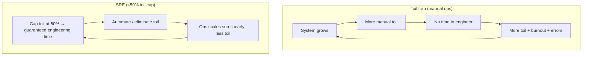
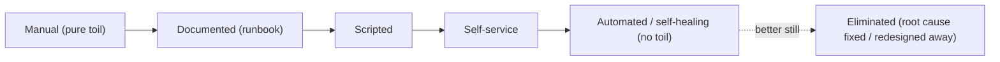

# Lesson 14.2 — Eliminating Toil; The SRE Operating Model

> Part 14: Reliability Engineering (SRE) · Difficulty: 🟡🔴
>
> **Prerequisites:** [1.2.2 Operability], [13.1 Cloud-Native/Automation], [13.7 IaC], [14.1 SLI/SLO/Error Budget].
> **Unlocks:** [14.4 Alerting/On-Call], [14.5 Incident Response], [14.6 Capacity Planning], [14.7 Release Engineering].

---

## 1. Learning Objectives

After this lesson you will be able to:

- Define **toil** precisely (manual, repetitive, automatable, tactical, no-enduring-value, scales with load) and distinguish it from useful operational work.
- Explain why **toil is corrosive** — it scales with the system, starves engineering, burns people out, and blocks reliability improvement.
- Describe the **SRE operating model** — SRE as an **engineering** discipline that runs operations with software, the **error-budget-driven** dev/ops relationship (14.1), and the **toil budget/cap**.
- Explain key SRE practices: **automate yourself out of a job**, the **50% cap on toil**, **shared ownership** with dev, and **treating operations as a software problem**.
- Recognize how SRE differs from traditional ops/DevOps and where it fits.

---

## 2. Motivation — Operations that scale sub-linearly with the system

Traditional operations has a fatal scaling property: as a system grows, the **manual operational work grows with it** — more servers to patch, more alerts to handle, more deploys to babysit, more tickets to service. If ops is **manual**, you need **more people in proportion to the system's size** — an unsustainable, linear (or worse) cost curve that eventually collapses under its own weight. Worse, this manual work — call it **toil** — **crowds out the very engineering** that could reduce it, trapping teams in a firefighting loop: too busy doing repetitive manual work to build the automation that would eliminate the repetitive manual work.

**SRE's foundational stance** is to treat this as an **engineering problem**: run operations **with software**. Where an ops team would hire more people to handle more toil, an SRE team **writes automation** so that operational load grows **sub-linearly** with the system — the system can grow 10× while operational effort grows far less. This is codified in concrete practices: a hard rule that SREs spend **at most ~50% of their time on toil** (the rest on engineering that reduces future toil), a relentless drive to **automate yourself out of manual work**, and the **error-budget-driven** relationship with developers (14.1) that aligns everyone's incentives around reliability *and* velocity. This lesson develops toil, why it's corrosive, and the SRE operating model that keeps operations sustainable as systems scale.

---

## 3. Theory — From first principles

### 3.1 What toil is (precisely)

`[CS]` **Toil** is operational work with a specific, damaging signature — work that is `[CS]`:
- **Manual** — done by hand (running a script, clicking through a console).
- **Repetitive** — done again and again, not a one-off.
- **Automatable** — a machine could do it (it's not work that genuinely needs human judgment).
- **Tactical / interrupt-driven** — reactive, not strategic (responding to a page, a ticket).
- **Of no enduring value** — when done, the service is in the same state as before; it doesn't *improve* anything.
- **Scales linearly (or worse) with the service** — grows as the system grows (more users/servers → more of this work).
- `[BP]` **Not toil:** work needing real human judgment, one-off project work, and — crucially — **engineering that eliminates future toil** (writing automation, improving systems). Overhead (email, meetings, HR) is also distinct — not toil, but not engineering either.

### 3.2 Why toil is corrosive

`[CS]` Toil isn't just annoying — it's actively harmful `[CS]`:
- **It scales with the system:** manual ops grows with the system → **linear headcount growth** → unsustainable (§2). SRE's whole point is to break this.
- **It starves engineering:** time on toil is time **not** spent building the automation/reliability improvements that would reduce toil → a **vicious cycle** (too busy firefighting to fix the fire).
- **It burns people out:** repetitive, low-value, interrupt-driven work is **demoralizing** → attrition, disengagement, more errors.
- **It causes errors:** manual repetitive work is **error-prone** (humans slip) → incidents (11.1) → more toil.
- **It has an opportunity cost:** the same effort could have gone to lasting improvements.
- `[BP]` So SRE treats toil as a **measurable enemy to be capped and reduced** (§3.4/3.5), not an inevitable cost of running systems.

### 3.3 The SRE operating model — ops as an engineering problem

`[CS]` **SRE = applying software engineering to operations** `[CS]`:
- **Core stance:** "**what happens when you ask a software engineer to design an operations team.**" Instead of manually operating systems, SREs **build software** to operate them — automation, self-healing, tooling, reliable platforms (13.x).
- **Sub-linear scaling:** the goal is operational load that grows **much slower than the system** — automate so the system can 10× without 10×-ing the ops effort (§2).
- **Shared, quantified reliability ownership:** SRE owns **reliability** and works *with* dev teams (not a wall-throwing ops silo), using **SLOs/error budgets** (14.1) as the shared, objective language of "how reliable" (§3.6).
- **Engineering-first time allocation:** the 50% cap (§3.4) enforces that SREs spend real time **engineering**, not just operating.
- `[BP]` SRE is **not** "renamed ops" — it's a deliberate reframing of operations as a **software/engineering** problem with **measurable objectives** (14.1) and **automation** as the primary tool.

### 3.4 The 50% toil cap

`[BP]` A signature SRE rule: **SREs should spend ≤ ~50% of their time on toil**; the rest on **engineering work that reduces future toil / improves reliability** `[BP]`:
- **Why a hard cap:** without it, toil **expands to fill all available time** (there's always more manual work) → the team never escapes firefighting → the vicious cycle (§3.2). The cap **guarantees** engineering time.
- **What the other 50% is:** automation, tooling, reliability improvements, better monitoring/alerting (14.3/14.4), self-healing (13.3), capacity work (14.6) — investments that **shrink** future toil.
- **Enforcement:** **measure toil** (track time/tickets/pages), and if it exceeds the cap, that's a **signal to act** — push work back to dev, hire, or (best) **automate it away**. Overflow toil can be **redirected to the dev teams** whose service generates it (an incentive to reduce it — §3.6).
- `[BP]` The cap turns "we're too busy to automate" into "we're **required** to make time to automate" — breaking the trap (§3.2).

### 3.5 Automate yourself out of a job

`[BP]` The SRE mindset toward any recurring manual task `[BP]`:
- **Progression of a task:** do it manually → **document** it (a runbook) → **script** it → make it **self-service** → make it **fully automated/self-healing** (the system fixes itself — 13.3). Each step reduces toil.
- **Prefer eliminating over automating:** sometimes the best fix is to **remove the need** for the task (fix the root cause, redesign the system) rather than automate the symptom.
- **"Automate yourself out of a job":** the aspiration is that a task you do today should be **gone** (automated) tomorrow, freeing you for higher-value work — not job loss, but **job elevation** (from operator to engineer).
- `[BP]` **Automation's compounding benefit:** automation is **consistent** (no human slips → fewer errors → less toil), **fast**, **scalable**, and **auditable** — and it **frees humans for judgment work** machines can't do. This is the cloud-native automation ethos (13.1/13.7) applied to operations.

### 3.6 The dev/ops relationship and incentive alignment

`[BP]` SRE restructures the traditional dev-vs-ops conflict `[BP]`:
- **The classic conflict:** dev wants to **ship fast** (velocity); ops wants **stability** (say "no" to change) → adversarial, misaligned.
- **SRE's resolution (via 14.1):** the **error budget** makes reliability a **shared, quantified** concern — dev can ship freely **while there's budget**, but overspending it **stops their launches** (14.1 §3.7), so dev is **incentivized to build reliably**; SRE isn't the perpetual "no" but a partner enforcing an **agreed, objective** rule.
- **Toil pushback:** if a service generates excessive toil (overflow past the 50% cap), SRE can **hand operational load back to the dev team** — a direct incentive for dev to **reduce the toil** their service creates (build it more operable — 1.2.2).
- **Shared ownership / "you build it, you run it"** `[OPINION]`: many orgs blend SRE with dev on-call (14.4) so builders feel the operational pain of what they ship → better designs. (SRE and **DevOps** overlap heavily — DevOps is the broader culture; SRE is a specific, measurable implementation.) `[OPINION]`
- `[BP]` The result: **aligned incentives** — everyone optimizes for the right balance of reliability and velocity, objectively, not by turf war.

### 3.7 SRE vs traditional ops vs DevOps

`[BP]` Positioning `[OPINION]`:
- **Traditional ops:** manual operation, siloed from dev, scales with headcount, adversarial to change — the model SRE replaces.
- **DevOps:** a **cultural movement** to break the dev/ops wall (collaboration, automation, CI/CD, shared responsibility) — broad principles.
- **SRE:** a **specific, prescriptive implementation** of those principles (arguably "SRE implements DevOps") — with **concrete practices**: SLOs/error budgets (14.1), the 50% toil cap, error-budget policies, blameless postmortems (14.5), toil measurement.
- `[BP]` **Fit:** SRE suits organizations at **sufficient scale/maturity** (like microservices/K8s — 12.1/13.3, "you must be this tall"); smaller teams adopt SRE *principles* (SLOs, automation, blameless culture) without a dedicated SRE org.

---

## 4. Visual Intuition

### The toil vicious cycle vs the SRE virtuous cycle

### The task-automation progression

---

## 5. Real-World Analogy

Think of running a **restaurant kitchen** as it grows from a tiny café to a large operation.

- **Toil = the endless manual prep that scales with covers.** Every night someone chops onions by hand, washes dishes by hand, and refills condiment jars one by one. It's **manual, repetitive, a machine could do it, reactive, adds nothing lasting** (tomorrow you chop the same onions again), and — crucially — **the busier you get, the more of it there is**. Serve twice as many customers, chop twice as many onions.
- **The trap (traditional ops):** as the café grows, the only "solution" is to **hire more choppers and dishwashers** in proportion to customers — costs balloon, and the chefs are so busy doing manual prep they **never install the dishwasher or food processor** that would end the drudgery. The kitchen firefights forever.
- **The SRE move (engineer the kitchen):** a chef-engineer says, "we will spend **at most half our time** on manual prep; the other half we **build systems** — install a **commercial dishwasher**, a **food processor**, **prep-ahead stations**, **automated inventory reordering**." Now when covers double, the manual work **barely rises** (the machines absorb it) — operations scale **sub-linearly**. The **50% cap** is what forces them to make time to build the machines instead of drowning in prep.
- **Automate yourself out of a job:** the goal is that tonight's tedious hand-chopping is **gone next month** (a machine does it), freeing the cooks for the **creative, judgment work** — plating, new dishes — that machines *can't* do. Not fewer cooks; **better-used** cooks.
- **Dev/ops alignment (error budget):** imagine the **menu designers** (dev) keep inventing dishes that are a nightmare to prep (unreliable, toil-heavy). Instead of the kitchen just suffering, there's an **agreed rule**: a dish that causes too much kitchen chaos gets its prep **handed back to the designers** to fix — so designers are **motivated to design prep-friendly dishes**. Everyone's incentives point the same way: great food that the kitchen can actually sustain.

---

## 6. Industry Example

- **Google SRE (the origin)** `[CONV]`: SRE defined as applying software engineering to operations, with the ~50% toil cap and error-budget-driven dev/ops relationship (§3.3/3.4/3.6). *(Representative.)*
- **Toil measurement + reduction programs** `[CONV]`: teams tracking toil (pages, tickets, manual hours) and running projects to automate the biggest sources (§3.4/3.5). *(Representative.)*
- **Self-healing automation** `[CONV]`: auto-remediation and Kubernetes reconciliation (13.3) reducing manual intervention (§3.5). *(Representative.)*
- **"You build it, you run it"** `[CONV]`: dev teams on-call for their services, feeling operational pain → more operable designs (§3.6, Amazon lineage). *(Representative.)*
- **SRE implements DevOps** `[OPINION]`: the framing that SRE is a concrete, prescriptive implementation of DevOps principles (§3.7). *(Representative.)*

---

## 7. Implementation Details — running the SRE model

- **Define + measure toil** (§3.1/3.4): identify manual/repetitive/automatable/no-value work; track time/tickets/pages spent on it.
- **Enforce the ~50% toil cap** (§3.4): guarantee engineering time; treat exceeding it as a signal to automate, push back, or staff up.
- **Attack toil by the progression** (§3.5): document → script → self-service → automate/self-heal → **eliminate the root cause**; prioritize the biggest toil sources.
- **Adopt error-budget-driven dev/ops** (14.1, §3.6): SLOs as shared language; error-budget policy gating launches; align incentives.
- **Push toil back to source** (§3.4/3.6): overflow toil returns to the dev team generating it → incentive to build operable services (1.2.2).
- **Prefer eliminating over automating** (§3.5): fix root causes / redesign rather than automate symptoms where possible.
- **Blameless culture** (14.5): toil/incidents are signals to improve systems, not to blame people.
- **Scale-appropriate adoption** (§3.7): full SRE org at scale; SRE *principles* (SLOs, automation, blameless) for smaller teams.

---

## 8. Advantages

- **Sub-linear operational scaling** — the system grows without proportional ops headcount (§3.3).
- **Breaks the firefighting trap** — the 50% cap guarantees time to improve (§3.4).
- **Reduces errors + burnout** — automation is consistent; humans do judgment work (§3.2/3.5).
- **Aligned dev/ops incentives** — error budget + toil pushback (§3.6, 14.1).
- **Compounding gains** — automation/reliability work reduces future toil (§3.5).
- **Higher-value engineering** — people freed for design/improvement, not drudgery (§3.5).

---

## 9. Disadvantages / costs

- **Requires investment upfront** — building automation costs time before it pays off (§3.5).
- **Cultural change is hard** — the error-budget/toil-cap model needs org buy-in and discipline (§3.6/3.7).
- **Measuring toil is fuzzy** — categorizing work + tracking time takes effort and judgment (§3.4).
- **Not free / not for everyone** — a full SRE org suits scale/maturity; overkill for small teams (§3.7).
- **Automation has its own risks** — bad automation can cause large-blast-radius incidents (automate carefully, with safeguards).
- **Discipline to hold the cap** — pressure to just "do the toil" during crunch erodes the cap (§3.4).

---

## 10. When NOT to / cautions

- **Don't treat SRE as renamed ops** — without the engineering/automation/SLO substance it's just ops (§3.3/3.7).
- **Don't skip the toil cap** — without it you stay trapped in firefighting (§3.4).
- **Don't automate a bad process** — fix/eliminate the root cause first where possible (§3.5).
- **Don't automate recklessly** — large-blast-radius automation needs safeguards/canaries (13.7).
- **Don't force a full SRE org on a small team** — adopt the *principles* instead (§3.7).
- **Don't let SRE become the blame target** for reliability — it's shared with dev (§3.6).

---

## 11. Common Mistakes

1. **No toil cap** — toil expands to fill all time; never escape firefighting (§3.4).
2. **SRE as a renamed ops silo** — no automation/SLO substance, still adversarial (§3.3/3.7).
3. **Automating symptoms not root causes** — perpetual automation of a broken process (§3.5).
4. **Not measuring toil** — can't manage what you don't measure; toil invisible (§3.4).
5. **Hoarding ops (no pushback)** — SRE absorbs all toil, dev never incentivized to reduce it (§3.6).
6. **Reckless automation** — an unsafe automated action causes a wide-blast-radius incident.
7. **Ignoring the human cost** — letting toil burn people out → attrition (§3.2).
8. **Over-adopting** — a full SRE org where principles would suffice (§3.7).

---

## 12. Interview Questions

**🟢 Easy**
- What is toil? Give the defining characteristics.
- What is the ~50% toil cap, and why does it exist?

**🟡 Medium**
- Why is toil corrosive (scaling, engineering starvation, burnout, errors)?
- How does the SRE operating model differ from traditional operations?

**🔴 Hard**
- How does the error budget align dev and ops incentives, and how does toil pushback reinforce it (14.1)?
- Walk through automating a recurring manual task (manual → runbook → script → self-service → self-healing → eliminate). When do you eliminate vs automate?

**⚫ Staff+**
- Design the operating model for an SRE team supporting many dev teams: toil measurement + 50% cap, error-budget policy, toil pushback, on-call ownership, and how you'd keep ops scaling sub-linearly as the system 10×'s. What breaks if you drop the cap?
- Compare SRE, DevOps, and traditional ops. When is a dedicated SRE org warranted vs adopting SRE principles, and how do you avoid "SRE = renamed ops"?

---

## 13. Production Pitfalls

- **Firefighting death spiral:** no toil cap → team perpetually reactive → automation never built → toil + burnout + errors compound (§3.2/3.4).
- **Burnout/attrition:** relentless interrupt-driven toil drove SREs out, losing institutional knowledge (§3.2).
- **Manual-error incidents:** repetitive manual ops caused a fat-finger production incident (§3.2, 11.1).
- **Toil hoarding:** SRE absorbed all of a badly-built service's toil; dev never fixed the operability (§3.6).
- **Reckless automation blast radius:** an unsafe auto-remediation acted globally and caused a wide outage (§3.5, needs safeguards).
- **"SRE" without substance:** rebranded ops with no SLOs/automation stayed adversarial and unscalable (§3.3/3.7).

---

## 14. Optimization Techniques

- **Measure toil + enforce the 50% cap** to guarantee engineering time (§3.4).
- **Automate/eliminate the biggest toil sources first** (progression → self-healing → root-cause removal) (§3.5).
- **Self-healing via reconciliation** (13.3) to remove manual intervention (§3.5).
- **Error-budget-driven dev/ops + toil pushback** to align incentives (§3.6, 14.1).
- **Runbooks → automation** so knowledge is captured then mechanized (§3.5).
- **Safe automation** (canary/guardrails/dry-run) to avoid wide-blast-radius mistakes (13.7).
- **Blameless culture** so toil/incidents drive systemic improvement (14.5).

---

## 15. Summary

Traditional operations **scales with the system** — more system means more manual work, so a **manual** ops team needs **headcount proportional to size**, an unsustainable curve — and that manual work **crowds out the engineering** that could reduce it, trapping teams in firefighting. That damaging work is **toil**: work that is **manual, repetitive, automatable, tactical/interrupt-driven, of no enduring value, and scales (at least) linearly with the service**. Toil is **corrosive** — it forces linear headcount growth, **starves engineering** (a vicious cycle: too busy to automate the thing that would free time), **burns people out**, and **causes errors** (manual work slips → incidents → more toil). **SRE's foundational stance** is to treat operations as an **engineering/software problem** — "what happens when a software engineer designs an operations team" — building **automation, self-healing, and tooling** so operational load grows **sub-linearly** (the system 10×'s without ops 10×-ing). Signature practices: the **~50% toil cap** (SREs spend at most half their time on toil, the rest on engineering that **reduces future toil** — a hard cap because toil otherwise **expands to fill all time**; exceeding it is a signal to automate, push back, or staff up); **automate yourself out of a job** (progress each task manual → runbook → script → self-service → **automated/self-healing** → best of all **eliminate the root cause** — automation is consistent, fast, scalable, and frees humans for judgment work); and the **error-budget-driven dev/ops relationship** (14.1) that replaces the classic velocity-vs-stability conflict with **aligned incentives** — dev ships freely while there's budget but overspending **stops their launches**, and **overflow toil is pushed back to the dev team** generating it (incentivizing operable design — 1.2.2), often reinforced by **"you build it, you run it"** on-call. SRE is a **specific, prescriptive implementation of DevOps** (SLOs/error budgets, 50% cap, error-budget policies, blameless postmortems — 14.5) — not "renamed ops" — and, like microservices/Kubernetes, it suits **sufficient scale/maturity** (smaller teams adopt the *principles*: SLOs, automation, blameless culture). The through-line: **make operational effort scale sub-linearly by engineering away toil, capped and measured, with incentives aligned by the error budget.**

---

## 16. Revision Notes (flashcard-ready)

- **Q:** Toil? **A:** Manual, repetitive, automatable, tactical, no-enduring-value work that scales (≥linearly) with the service.
- **Q:** What's NOT toil? **A:** Judgment work, one-off projects, and engineering that eliminates future toil.
- **Q:** Why corrosive? **A:** Scales with the system (linear headcount), starves engineering (vicious cycle), burns people out, causes errors.
- **Q:** SRE core stance? **A:** Apply software engineering to operations — run ops with automation so effort scales sub-linearly.
- **Q:** 50% toil cap? **A:** SREs spend ≤~50% on toil, rest on engineering that reduces future toil; without the cap toil fills all time.
- **Q:** Automate yourself out of a job? **A:** Progress manual → runbook → script → self-service → automated/self-healing → eliminate root cause.
- **Q:** How does SRE align dev/ops? **A:** Error budget (14.1) — ship while budget lasts, overspend stops launches; toil pushed back to source.
- **Q:** SRE vs DevOps vs ops? **A:** Ops = manual/siloed; DevOps = culture; SRE = specific prescriptive implementation (SLOs, toil cap, blameless).
- **Q:** Best fix for a manual task? **A:** Eliminate the root cause if possible; else automate — not just do it faster manually.
- **Q:** When adopt full SRE org? **A:** At sufficient scale/maturity; smaller teams adopt the principles.

---

## 17. Further Reading + Knowledge-Graph Links

**Foundations (in-platform):**
- **[1.2.2 Operability]** — operability as a first-class characteristic.
- **[13.1 Cloud-Native/Automation]** & **[13.7 IaC]** — the automation ethos applied to ops.
- **[14.1 SLI/SLO/Error Budget]** — the error budget that aligns dev/ops.

**Unlocks / next:**
- **[14.4 Alerting/On-Call]** — toil-reducing alerting; sustainable on-call.
- **[14.5 Incident Response]** — blameless culture; postmortems that reduce toil.
- **[14.6 Capacity Planning]** — engineering, not toil.
- **[14.7 Release Engineering]** — automated, safe delivery.

**External (canonical):**
- Beyer et al., *Site Reliability Engineering* & *The SRE Workbook* — toil, the 50% cap, the SRE model. *(Representative.)*

> **Knowledge-graph:** `14.1 error budget` + `13.1/13.7 automation` → **`14.2 toil + SRE model`** (≤50% cap, automate/eliminate, sub-linear ops) → `14.4 on-call` / `14.5 blameless` / `14.7 release engineering`.
