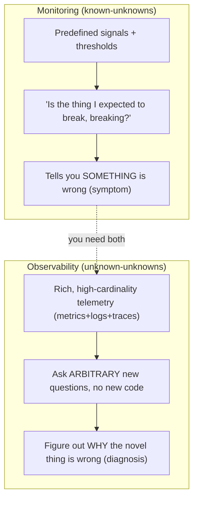
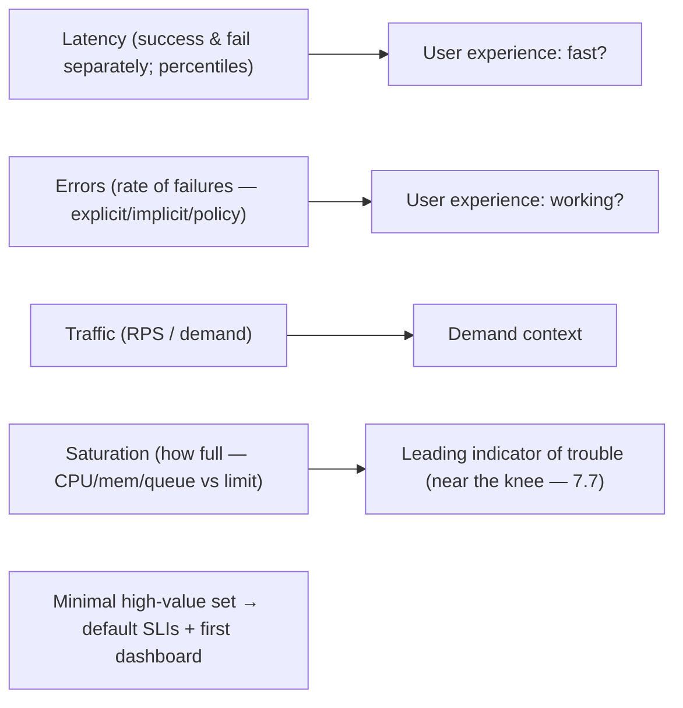

# Lesson 14.3 — Monitoring vs Observability; The Four Golden Signals

> Part 14: Reliability Engineering (SRE) · Difficulty: 🟡🔴
>
> **Prerequisites:** [1.2.2 Observability], [14.1 SLI/SLO/Error Budget], [8.1.1 Partial Failure], [12.3 Communication (fan-out)].
> **Unlocks:** [14.4 Alerting], [14.5 Incident Response], [Part 16 Observability (deep)], [Part 17 Performance].

---

## 1. Learning Objectives

After this lesson you will be able to:

- Distinguish **monitoring** (watching known signals for known problems) from **observability** (being able to ask **arbitrary new questions** about a system's internal state from its outputs).
- Explain why distributed systems (Parts 8–12) need **observability**, not just monitoring — you can't predict every failure mode in advance.
- Name and apply the **four golden signals** — **latency, traffic, errors, saturation** — and why they're the minimal high-value monitoring set.
- Relate golden signals to alternative frameworks (**USE**, **RED** — Part 17) and to **SLIs** (14.1).
- Understand the role of the **three pillars** (metrics, logs, traces — Part 16 preview) and the difference between **symptom-based** and **cause-based** monitoring.

---

## 2. Motivation — You can't fix what you can't see

Every reliability practice so far — SLOs (14.1), error budgets, self-healing (13.3), incident response (14.5) — depends on one thing: **being able to see what the system is doing**. You can't measure an SLI you don't observe, alert on a burn rate you don't track, or debug an incident you can't inspect. But *how* you achieve this visibility matters, and the field draws an important distinction between **monitoring** and **observability**.

**Monitoring** is the traditional practice: **collect predefined signals** (CPU, request rate, error count) and **watch them for known problem conditions** (alert if CPU > 90%). It answers **questions you knew to ask in advance** — "is the thing I expected to break, breaking?" That's necessary but insufficient for modern **distributed systems** (Parts 8–12), where failures are **novel, emergent, and unpredictable**: a request fans out across dozens of services (12.3), partial failures cascade in ways no one anticipated (8.1.1/11.3), and the question you need to answer at 3 a.m. is one **you never thought to pre-configure**. **Observability** is the stronger property: a system is observable if, from its **external outputs** (metrics, logs, traces — Part 16), you can **understand its internal state well enough to ask and answer *arbitrary new questions*** — including ones you didn't anticipate — **without shipping new code**. Alongside this distinction, SRE offers a pragmatic starting point for *what* to measure: the **four golden signals** — **latency, traffic, errors, saturation** — the minimal set that captures most user-facing health. This lesson develops monitoring vs observability, the golden signals, and how they connect to SLIs and debugging.

---

## 3. Theory — From first principles

### 3.1 Monitoring — watching known signals

`[CS]` **Monitoring** = collecting, aggregating, and analyzing **predefined** metrics/logs to **watch for known conditions** and alert when thresholds are crossed `[CS]`:
- You decide **in advance** what to measure (CPU, request rate, error count, disk usage) and what's "bad" (CPU > 90%, errors > 1%).
- Great for **known failure modes** and **known questions**: "is the disk filling up?", "is the error rate above SLO?"
- **The limit** `[BP]`: it only answers questions you **thought to ask beforehand**. When a **novel** problem appears (an emergent failure in a distributed system — §3.3), monitoring may show "something's wrong" but **can't answer the new question** ("*why* are requests to shard 7 from EU users slow only when feature X is on?") if you didn't pre-instrument for it.

### 3.2 Observability — asking arbitrary new questions

`[CS]` **Observability** (from control theory: inferring internal state from external outputs) = the property that you can **understand a system's internal state from its outputs well enough to answer questions you didn't predefine** `[CS]`:
- The test: can you **debug a novel problem** — one you've never seen and didn't anticipate — using **existing telemetry**, **without deploying new instrumentation**?
- Requires **rich, high-cardinality, contextual** telemetry (Part 16): wide structured events, traces that follow a request across services (12.3), dimensions you can **slice arbitrarily** (by user, region, version, endpoint, feature flag).
- `[BP]` **Monitoring vs observability** `[OPINION]`: monitoring is a **subset/consequence** — you monitor (watch known signals) *and* you want observability (explore unknowns). Monitoring tells you **something is wrong** (symptom); observability lets you **figure out why** (novel diagnosis). You need both.

### 3.3 Why distributed systems demand observability

`[CS]` The shift from monoliths to distributed systems (Parts 8–12) is *why* observability became essential `[CS]`:
- **Emergent, unpredictable failures:** with dozens of services, partial failures (8.1.1), cascades (11.3), and complex interactions, the **failure modes are combinatorial and novel** — you **cannot pre-enumerate** them for monitoring.
- **Requests span many services:** one user request fans out across services (12.3) → to debug it you must **follow it end-to-end** (distributed tracing — Part 16), not inspect one box.
- **High cardinality matters:** the problem is often a **specific slice** (one customer, one region, one version) — you need to **slice telemetry by arbitrary dimensions** you didn't predefine.
- `[BP]` So: **monitoring** (known signals/thresholds) remains necessary for known conditions and alerting, but **observability** (explore the unknown) is what lets you **debug the novel incidents** distributed systems inevitably produce. "Monitoring is for known-unknowns; observability is for unknown-unknowns."

### 3.4 The four golden signals

`[CS]` SRE's answer to "**if you can measure only four things about a user-facing system, measure these**" — the **four golden signals** `[CS]`:
- **Latency:** how **long** requests take. **Crucially, measure successful and failed requests separately** — a fast error can hide in the average; and use **percentiles** (p50/p99/p99.9), not averages (the tail is what hurts users — 14.1/Part 17).
- **Traffic:** how much **demand** — request rate (RPS), transactions/sec, bandwidth — the load on the system.
- **Errors:** the **rate of failed requests** — explicit (5xx), implicit (wrong content, 200-with-error), and policy failures (too slow to count as success). Ties directly to the availability SLI (14.1).
- **Saturation:** how **full** the system is — how close a constrained resource (CPU, memory, I/O, connections, queue depth) is to its limit. Saturation predicts **imminent** problems (approaching the utilization knee — 7.7); latency degrades as saturation rises.
- `[BP]` **Why these four:** together they capture **most** user-facing health with minimal signals — latency + errors = **user experience** (are requests fast and succeeding?), traffic = **demand context**, saturation = **leading indicator** of trouble. They're an excellent **default SLI set** (14.1) and the first dashboard to build.

### 3.5 Golden signals, USE, and RED

`[BP]` Related frameworks (complementary lenses — Part 17) `[BP]`:
- **Golden signals** (latency/traffic/errors/saturation) — Google SRE; user-facing service health.
- **RED** (Brendan Gregg / Tom Wilkie): **Rate, Errors, Duration** — a **request-centric** view (essentially traffic + errors + latency), great for **services/microservices** (12.x).
- **USE** (Brendan Gregg): **Utilization, Saturation, Errors** — a **resource-centric** view (per resource: CPU, memory, disk, network), great for **infrastructure/capacity** debugging (7.6/Part 17).
- `[BP]` **Combine:** **RED for the service** (what users see) + **USE for the resources** (why) — RED tells you the service is slow/erroring; USE tells you which resource is the bottleneck. Golden signals span both (latency/traffic/errors ≈ RED; saturation ≈ the USE angle).

### 3.6 Symptom-based vs cause-based; the three pillars

`[BP]` Two more distinctions that shape monitoring `[BP]`:
- **Symptom-based (page on symptoms):** alert on **user-visible symptoms** ("error rate exceeds SLO," "latency too high") — what actually affects users. `[BP]` **Preferred for paging** (14.4): it catches real user impact regardless of cause, and doesn't spam on causes that don't hurt users.
- **Cause-based:** track **potential causes** (CPU high, disk full, a dependency down) — useful for **diagnosis** and as **leading indicators**, but usually **not** the thing you page a human on (a high CPU that isn't hurting users shouldn't wake someone — 14.4).
- **The three pillars of telemetry** (Part 16 preview): **metrics** (cheap, aggregated numbers over time — good for dashboards/alerts/golden signals), **logs** (detailed discrete event records — good for forensics), **traces** (a request's path across services — good for distributed debugging — 12.3). `[BP]` **Observability combines all three** (plus high-cardinality events); the golden signals are typically **metrics**. Deep treatment in Part 16.
- `[BP]` **Rule (ties to 14.1/14.4):** **alert on symptoms (SLO burn), diagnose with causes + traces/logs** — page on user impact, investigate with the rest.

### 3.7 Putting it together

`[BP]` A pragmatic monitoring/observability strategy:
- **Start with the golden signals** (§3.4) as your core dashboard + **SLIs** (14.1) — latency (percentiles, success/fail split), traffic, errors, saturation.
- **Alert on symptoms** (SLO burn — 14.4), not raw causes (§3.6).
- **Invest in observability** (Part 16) — high-cardinality events + **distributed tracing** — so you can debug the **novel** incidents distributed systems produce (§3.3).
- **Use RED for services + USE for resources** to move from "what's wrong" (symptom) to "why" (cause) (§3.5).
- **All three pillars** — metrics for dashboards/alerts, traces for cross-service debugging, logs for forensics (§3.6, Part 16).
- `[BP]` The goal: **see enough to run to your SLOs (14.1), alert without burning people out (14.4), and diagnose the unforeseen fast (low MTTR — 11.1).**

---

## 4. Visual Intuition

### Monitoring vs observability

### The four golden signals

---

## 5. Real-World Analogy

Think of the difference between the **dashboard warning lights** in a car (monitoring) and having a **full diagnostic computer + expert mechanic** (observability).

- **Monitoring = the warning lights.** The car has a fixed set of pre-installed lights: **check engine, low fuel, high temperature, oil pressure**. They watch **known problems** the designers **anticipated** and light up when a threshold is crossed. Invaluable — but they only tell you about the problems someone **thought to build a light for**. When the car makes a **weird new noise the designers never imagined**, the warning lights are **silent or unhelpful** ("check engine" — but *why*?).
- **Observability = the diagnostic port + rich sensor data.** A modern car exposes **detailed data from hundreds of sensors** through a diagnostic port, so a mechanic can **ask questions no one pre-programmed a light for**: "show me the fuel trim by cylinder when the engine is warm and turning left" — slicing the data by **arbitrary dimensions** to chase down a **novel** fault, **without installing new sensors**. That's the ability to answer **questions you didn't anticipate**.
- **Why the new car needs it (distributed systems):** a simple go-kart (a monolith) is easy — a few warning lights suffice. But a **modern vehicle with dozens of interacting computers** (a distributed system) fails in **emergent, unpredictable ways** — an intermittent fault that only appears when three subsystems interact — and you **can't pre-install a warning light for every combination**. You need the **rich diagnostic data** to explore the unknown.
- **The four golden signals = the four gauges you'd never remove.** If you could keep only four gauges: **how fast you're going and how responsive it feels** (latency), **how hard you're pushing it** (traffic/demand), **whether warning lights are firing** (errors), and **how close the engine is to redlining/overheating** (saturation — the *leading* indicator that trouble is coming). Those four capture the car's health at a glance.
- **Symptom vs cause:** you want the **"car won't accelerate"** alarm (a symptom the driver feels) to wake you — not a pedantic **"cylinder 3 fuel trim is 2% high"** alarm (a cause that may not matter) blaring every drive. Alarm on what the **driver actually experiences**; use the detailed sensor data to **diagnose why**.

---

## 6. Industry Example

- **Google SRE golden signals** `[CONV]`: latency/traffic/errors/saturation as the canonical minimal monitoring set (§3.4). *(Representative.)*
- **RED (Wilkie) & USE (Gregg) methods** `[CONV]`: request-centric (Rate/Errors/Duration) and resource-centric (Utilization/Saturation/Errors) frameworks (§3.5, Part 17). *(Representative.)*
- **Observability platforms & high-cardinality events** `[CONV]`: tools built for exploring unknown-unknowns via wide events + tracing (§3.2/3.3, Part 16). *(Representative.)*
- **OpenTelemetry + distributed tracing** `[CONV]`: standardized metrics/logs/traces + cross-service context propagation (§3.6, 12.3/Part 16). *(Representative.)*
- **Symptom-based paging** `[CONV]`: SRE practice to page on user-visible symptoms (SLO burn) not raw causes (§3.6, 14.4). *(Representative.)*

---

## 7. Implementation Details

- **Instrument the four golden signals** (§3.4) per service as core metrics + **SLIs** (14.1): latency (percentiles, **success/fail separated**), traffic (RPS), errors (all failure types), saturation (constrained resources vs limits).
- **Invest in observability** (§3.2/3.3, Part 16): emit **high-cardinality structured events** + **distributed traces** (context propagation across services — 12.3) so you can slice by user/region/version/endpoint and debug novel incidents without new code.
- **Use RED for services + USE for resources** (§3.5) to go from symptom → cause.
- **Adopt all three pillars** (§3.6): metrics (dashboards/alerts), traces (cross-service debugging), logs (forensics) — standardized (OpenTelemetry).
- **Alert on symptoms** (§3.6, 14.4): page on SLO/golden-signal user impact; keep cause-based signals for diagnosis, not paging.
- **Measure at the user's vantage point** (14.1): edge/client/synthetic to capture real experience.
- **Build the golden-signals dashboard first**, then expand observability where incidents reveal gaps.

---

## 8. Advantages

- **Golden signals:** minimal, high-value coverage of user-facing health; great default SLIs + first dashboard (§3.4).
- **Observability:** debug **novel/unforeseen** incidents fast → low MTTR (§3.2/3.3, 11.1).
- **Distributed debugging:** traces follow requests across services (§3.3, 12.3).
- **Symptom-based paging:** alerts reflect real user impact, less noise (§3.6, 14.4).
- **RED+USE:** structured path from "what's wrong" to "why" (§3.5).
- **Foundation for everything:** SLOs, alerting, incident response, capacity all depend on this (§2).

---

## 9. Disadvantages / costs

- **Cost of telemetry:** high-cardinality events, traces, and retention are **expensive** (storage/compute/network) — cardinality especially (Part 16).
- **Instrumentation effort:** rich observability requires investment in code instrumentation + tooling (§3.2, Part 16).
- **Complexity:** three pillars + tracing + high-cardinality analysis is a lot to build/operate (Part 16).
- **Monitoring alone is insufficient** — teams that only monitor can't debug novel incidents (§3.3).
- **Signal overload:** too many metrics/dashboards no one watches (focus on golden signals — §3.4).
- **Wrong-place measurement** misses real user impact (§3.6, 14.1).

---

## 10. When NOT to / cautions

- **Don't rely on monitoring alone** for distributed systems — you'll be blind to novel failures (§3.3).
- **Don't page on cause-based signals** that don't hurt users (noise/burnout — §3.6, 14.4).
- **Don't use average latency** — use percentiles + split success/fail (§3.4, Part 17).
- **Don't drown in metrics** — start with golden signals; add observability where incidents show gaps (§3.4/3.7).
- **Don't ignore telemetry cost** — high cardinality can be very expensive; sample/aggregate deliberately (Part 16).
- **Don't measure only server-side** — capture the user's real experience (§3.6, 14.1).

---

## 11. Common Mistakes

1. **Monitoring-only mindset** — can't debug the novel incidents distributed systems produce (§3.3).
2. **Averaging latency** — hides the tail; splits success/fail not separated (§3.4).
3. **Paging on causes** (high CPU) that don't affect users → alert fatigue (§3.6, 14.4).
4. **No distributed tracing** — can't follow a request across services (§3.3, 12.3).
5. **Too many dashboards/metrics** — signal lost in noise; golden signals ignored (§3.4).
6. **Server-side-only SLIs** — miss edge/client failures users hit (§3.6, 14.1).
7. **Ignoring saturation** — no leading indicator; surprised by the knee (§3.4, 7.7).
8. **Unbounded cardinality** — telemetry cost explodes (Part 16).

---

## 12. Interview Questions

**🟢 Easy**
- What's the difference between monitoring and observability?
- Name the four golden signals.

**🟡 Medium**
- Why do distributed systems need observability, not just monitoring?
- Why measure latency for successful and failed requests separately, and why use percentiles?

**🔴 Hard**
- Compare golden signals, RED, and USE. How do you use RED + USE together to go from symptom to cause?
- Why alert on symptoms rather than causes, and how does this relate to SLOs (14.1) and alert fatigue (14.4)?

**⚫ Staff+**
- Design the observability strategy for a microservices system (Part 12): golden-signal SLIs per service, distributed tracing, high-cardinality events, the three pillars, symptom-based alerting, and how you'd debug a novel incident affecting only EU users on one version.
- A team monitors CPU/memory/disk thresholds but keeps getting blindsided by novel outages and can't diagnose them. Diagnose the gap (monitoring vs observability) and lay out what to add (golden signals as SLIs, tracing, high-cardinality events, symptom-based paging).

---

## 13. Production Pitfalls

- **Blind to a novel failure:** monitoring showed all green (no threshold for the new failure mode) while users suffered — no observability to explore (§3.3).
- **Average-latency blind spot:** the average looked fine while p99 users had a terrible experience (§3.4, Part 17).
- **Alert fatigue:** paging on cause-based signals (CPU spikes) that didn't affect users burned out on-call (§3.6, 14.4).
- **Undebuggable cross-service incident:** no distributed tracing → hours lost guessing which service caused a fan-out slowdown (§3.3, 12.3).
- **Cardinality cost explosion:** unbounded high-cardinality labels blew up the metrics bill (§3.6, Part 16).
- **Saturation surprise:** no saturation signal → hit the utilization knee with no warning (§3.4, 7.7).

---

## 14. Optimization Techniques

- **Golden signals as core SLIs + first dashboard** (latency percentiles success/fail split, traffic, errors, saturation) (§3.4, 14.1).
- **Distributed tracing + high-cardinality events** for fast novel-incident diagnosis → low MTTR (§3.2/3.3, 11.1/Part 16).
- **RED (service) + USE (resource)** to move symptom → cause efficiently (§3.5).
- **Symptom-based paging (SLO burn)** to cut noise (§3.6, 14.4).
- **Measure at the edge/client/synthetic** for true user experience (§3.6, 14.1).
- **Control telemetry cost** — sampling, aggregation, cardinality limits (Part 16).
- **Saturation as a leading indicator** to act before the knee (§3.4, 7.7).

---

## 15. Summary

Every reliability practice depends on **seeing what the system is doing**, and the field distinguishes two ways of achieving it. **Monitoring** collects **predefined** signals and watches them for **known** conditions/thresholds (CPU > 90%, errors > SLO) — it answers **questions you knew to ask in advance** and is great for **known failure modes and alerting**, but it can only tell you **something is wrong** (a symptom) and **cannot answer the novel question** you didn't pre-instrument for. **Observability** (from control theory — inferring internal state from external outputs) is the stronger property: from a system's **rich, high-cardinality telemetry** (metrics + logs + traces — Part 16) you can **ask and answer arbitrary new questions**, including unforeseen ones, **without shipping new code** — the ability to **debug the unknown-unknowns**. **Distributed systems demand observability** (Parts 8–12): failures are **emergent, combinatorial, and unpredictable** (you can't pre-enumerate them — 8.1.1/11.3), requests **fan out across many services** (must be traced end-to-end — 12.3/Part 16), and problems are often a **specific high-cardinality slice** (one user/region/version) you must explore arbitrarily — so **"monitoring is for known-unknowns; observability is for unknown-unknowns,"** and you need both. For **what to measure**, SRE's **four golden signals** are the minimal high-value set: **latency** (measure success and failure **separately**, use **percentiles** not averages — the tail hurts users — Part 17), **traffic** (demand — RPS), **errors** (rate of failures — explicit/implicit/policy), and **saturation** (how full a constrained resource is — a **leading indicator** of trouble as it nears the utilization knee — 7.7). Together they capture user experience (latency+errors), demand context (traffic), and impending trouble (saturation) — an excellent **default SLI set** (14.1) and first dashboard. Related lenses: **RED** (Rate/Errors/Duration — request/service-centric) and **USE** (Utilization/Saturation/Errors — resource-centric) — **RED tells you the service is bad, USE tells you which resource is why** (Part 17). Two guiding distinctions: **alert on symptoms** (user-visible SLO burn — preferred for paging, catches real impact, less noise — 14.4) and **diagnose with causes** + the **three pillars** (metrics for dashboards/alerts, traces for cross-service debugging — 12.3, logs for forensics — Part 16). The pragmatic strategy: start with golden-signal SLIs, alert on symptoms, invest in observability (tracing + high-cardinality events) to debug the novel incidents distributed systems inevitably produce — all in service of running to your SLOs (14.1), alerting without burnout (14.4), and diagnosing fast (low MTTR — 11.1).

---

## 16. Revision Notes (flashcard-ready)

- **Q:** Monitoring vs observability? **A:** Monitoring = watch predefined signals for known problems (known-unknowns); observability = ask arbitrary new questions from telemetry (unknown-unknowns).
- **Q:** Observability test? **A:** Can you debug a novel, unforeseen problem from existing telemetry without shipping new code?
- **Q:** Why do distributed systems need observability? **A:** Emergent/unpredictable failures, requests fan out across services, problems are specific high-cardinality slices.
- **Q:** Four golden signals? **A:** Latency, Traffic, Errors, Saturation.
- **Q:** Latency measurement rule? **A:** Measure success and failure separately; use percentiles (p99), not averages.
- **Q:** What is saturation? **A:** How full a constrained resource is (CPU/mem/queue vs limit) — a leading indicator of trouble (near the knee).
- **Q:** RED vs USE? **A:** RED = Rate/Errors/Duration (service/request-centric); USE = Utilization/Saturation/Errors (resource-centric); RED=what's wrong, USE=why.
- **Q:** Symptom vs cause-based? **A:** Page on symptoms (user-visible SLO burn); use cause-based signals for diagnosis, not paging.
- **Q:** Three pillars? **A:** Metrics (dashboards/alerts), logs (forensics), traces (cross-service debugging).
- **Q:** Golden signals ≈ which pillar/framework? **A:** Mostly metrics; latency/traffic/errors ≈ RED, saturation ≈ the USE angle.

---

## 17. Further Reading + Knowledge-Graph Links

**Foundations (in-platform):**
- **[1.2.2 Observability]** — observability as a first-class characteristic.
- **[14.1 SLI/SLO/Error Budget]** — golden signals as SLIs.
- **[8.1.1 Partial Failure]** & **[11.3 Cascades]** — the emergent failures observability must catch.
- **[12.3 Communication]** — fan-out that requires tracing.

**Unlocks / next:**
- **[14.4 Alerting]** — symptom-based, burn-rate alerting on these signals.
- **[14.5 Incident Response]** — using observability to diagnose fast.
- **[Part 16 Observability]** — the three pillars, tracing, cardinality in depth.
- **[Part 17 Performance]** — RED/USE, tail latency, percentiles.

**External (canonical):**
- Beyer et al., *Site Reliability Engineering* — "Monitoring Distributed Systems" (golden signals). *(Representative.)*
- Gregg, *Systems Performance* — USE method. *(Representative.)*
- Majors et al., *Observability Engineering* — observability, high cardinality. *(Representative.)*

> **Knowledge-graph:** `1.2.2 observability` + `8.1.1/11.3 emergent failures` → **`14.3 monitoring vs observability + golden signals`** → `14.4 alerting` / `14.5 incident response` / `Part 16 observability` / `Part 17 RED/USE`.
