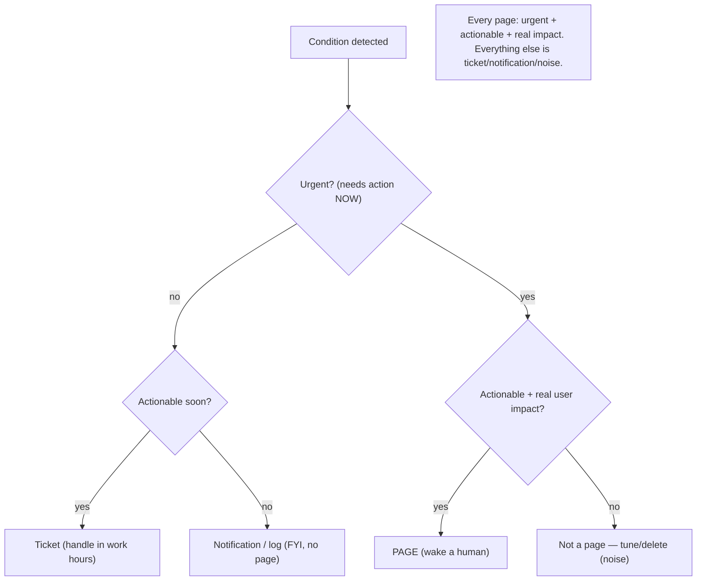
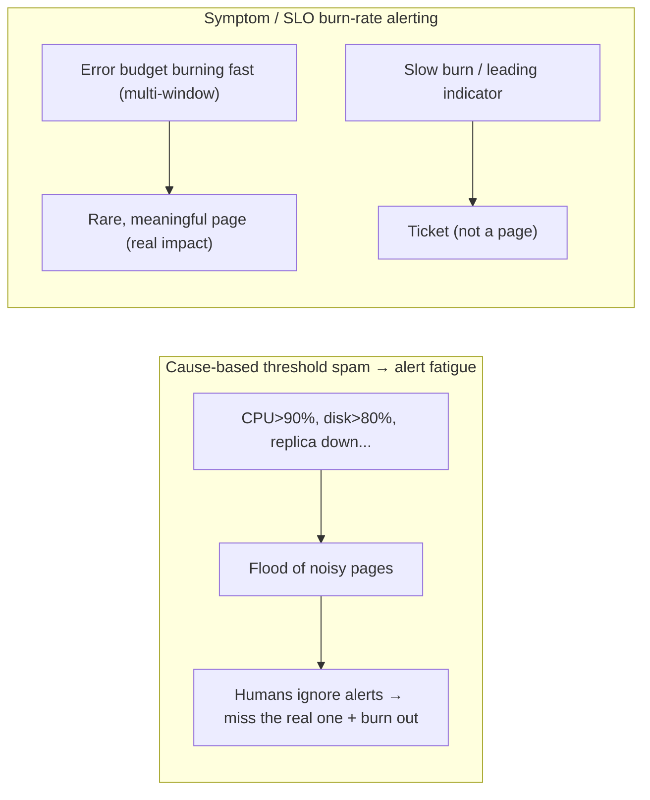

# Lesson 14.4 — Alerting That Doesn't Burn People Out; On-Call Practice

> Part 14: Reliability Engineering (SRE) · Difficulty: 🟡🔴
>
> **Prerequisites:** [14.1 SLI/SLO/Error Budget], [14.2 Toil], [14.3 Monitoring/Observability/Golden Signals], [11.1 MTBF/MTTR].
> **Unlocks:** [14.5 Incident Response], [14.6 Capacity], [14.8 Chaos Engineering].

---

## 1. Learning Objectives

After this lesson you will be able to:

- Explain the goal of alerting — **catch real problems, wake humans only when human action is needed** — and why bad alerting is actively harmful.
- Define and combat **alert fatigue** — the desensitization from too many/noisy alerts that causes missed real incidents and burnout.
- Apply **symptom-based** and **SLO burn-rate** alerting (14.1/14.3) instead of cause-based threshold spam.
- Distinguish **pages** (urgent, human-now) from **tickets/notifications** (non-urgent) and design each alert's **urgency + actionability**.
- Describe healthy **on-call practice**: sustainable rotations, escalation, runbooks, and the human factors that keep on-call humane.

---

## 2. Motivation — The alert that cried wolf

Monitoring and observability (14.3) tell you what's happening; **alerting** decides **when to interrupt a human**. Get it wrong and you cause one of two failures, both dangerous. **Under-alerting** misses real problems — the SLO burns, users suffer, and no one knows until customers complain. **Over-alerting** is subtler and more common: a flood of noisy, low-value alerts — most of them false alarms or things that don't actually need human action — trains people to **ignore alerts**, so the **one alert that matters gets lost in the noise**. This is **alert fatigue**, and it is corrosive: it directly causes **missed incidents** (the real page dismissed as "probably noise again"), **burnout** (being woken at 3 a.m. for non-problems destroys people), and **attrition** (good engineers leave teams with brutal on-call). Alerting is a **human-factors** problem as much as a technical one.

The SRE approach flips the default: **alerts are expensive** (they cost human attention and sleep), so **every page must justify itself** — it must be **urgent**, **actionable**, and reflect **real user impact**. This means alerting on **symptoms** (is the SLO burning? — 14.1/14.3), not on every **cause** (CPU spiked — which may not hurt anyone), and using **burn-rate** alerting to page fast on fast burns and ticket on slow ones. Paired with this is humane **on-call practice** — sustainable rotations, clear escalation, good runbooks, and treating on-call load as a **measurable, boundable** thing (like toil — 14.2). This lesson develops alert-fatigue-free alerting and sustainable on-call as a discipline that protects both reliability *and* the humans who deliver it.

---

## 3. Theory — From first principles

### 3.1 The purpose (and cost) of an alert

`[CS]` An **alert** exists to **trigger a response** — ideally **human action** — when something needs attention `[CS]`:
- **The key reframe:** an alert (especially a **page**) is **expensive** — it consumes a human's attention, interrupts their work or **sleep**, and (over time) their goodwill. So **every alert must earn its cost**.
- `[BP]` **The two questions for every alert** `[BP]`:
  1. **Is it urgent?** Does it need action **now** (page a human) — or can it wait (ticket/notification)?
  2. **Is it actionable?** Is there a **clear action** a human can take? An alert with no action is **noise** (there's nothing to do → don't wake anyone).
- **Every page should be:** urgent + actionable + reflect **real (or imminent) impact**. If it fails these, it shouldn't be a page.

### 3.2 Alert fatigue — the core enemy

`[CS]` **Alert fatigue** = desensitization caused by **too many** alerts, especially **noisy/false/non-actionable** ones `[CS]`:
- **The mechanism:** flooded with alerts → humans **can't distinguish signal from noise** → they **start ignoring alerts** → the **one real, critical alert gets dismissed** ("probably noise again") → **missed incident**.
- **The harms:** **missed real incidents** (the crying-wolf effect), **burnout** (interrupted work + broken sleep for non-problems), **attrition** (people quit brutal on-call), and **slower response** (learned helplessness toward alerts).
- `[BP]` **Alert fatigue makes alerting *worse than useless*** — a noisy system is **less** safe than a quieter one, because the real signal is buried. **Fewer, better alerts beat more alerts.** This is the central principle.

### 3.3 Symptom-based alerting (not cause-based)

`[BP]` **Alert on symptoms — user-visible impact — not on every potential cause** (14.3 §3.6) `[BP]`:
- **Symptom (page-worthy):** "**error rate is above SLO**," "**latency exceeds threshold**," "**users can't check out**" — things that reflect **real user pain**.
- **Cause (usually NOT page-worthy):** "**CPU at 95%**," "**disk 80% full**," "**a replica is down**" — a *potential* cause that **may or may not** be hurting users. If the CPU is high but users are fine (SLO healthy), **don't wake anyone**.
- **Why symptom-based:** it **catches real impact regardless of cause** (including novel failures — 14.3), and it **doesn't spam** on causes that don't matter. Cause-based signals belong on **dashboards for diagnosis** (14.3/14.5), not as pages.
- `[BP]` **Exception — leading indicators:** some cause-based signals are worth alerting on **because they predict imminent, unavoidable impact** (e.g., "disk will be full in 2 hours," "certificate expires tomorrow") — these are **actionable and urgent-soon**, often as **tickets** rather than pages. Saturation approaching the knee (7.7/14.3) is a classic leading indicator.

### 3.4 SLO burn-rate alerting

`[CS]` The SRE technique that operationalizes symptom-based alerting: **alert on the rate at which you're consuming your error budget** (14.1) `[CS]`:
- **Burn rate** = how fast you're spending the error budget. A **1× burn rate** exhausts the budget exactly at the window's end; **10×** exhausts it in a tenth of the time.
- **Multi-window, multi-burn-rate alerting** `[BP]`: page on a **fast burn** (e.g., burning a large fraction of the budget in an hour → urgent, wake someone), ticket on a **slow burn** (steadily eroding the budget over days → not urgent, but needs attention). Using **two windows** (a short one for speed, a long one to confirm it's sustained) reduces false pages.
- `[BP]` **Why it's better than static thresholds:** it alerts based on **actual impact to your SLO** (14.1) — it fires when you're genuinely at risk of breaching, scales the urgency to the burn speed, and avoids paging on brief blips that don't threaten the budget. It ties alerting **directly to the reliability target**.

### 3.5 Pages vs tickets vs notifications

`[BP]` **Match the alert's delivery to its urgency** — not everything is a page `[BP]`:
- **Page (interrupt a human *now*, incl. at night):** reserved for **urgent + actionable + real impact** — an SLO fast-burn, a user-facing outage. **Pages should be rare and always meaningful.**
- **Ticket (async, handle during work hours):** non-urgent but needs action — a slow burn, a leading indicator with hours of runway, a degraded-but-not-critical condition.
- **Notification/log (FYI, no action):** informational — dashboards, records; **never** a page.
- `[BP]` **The design discipline:** for each alert, ask "urgent?" and "actionable?" (§3.1) → route accordingly. **A page that could have been a ticket is alert fatigue; a ticket that should have been a page is a missed incident.** Over-paging is the more common sin.

### 3.6 Healthy on-call practice

`[BP]` On-call is a **human system** that must be **sustainable** `[BP]`:
- **Sustainable rotation:** enough people so no one is on-call too often; reasonable shift lengths; **follow-the-sun** (hand off across time zones so no one works nights) where possible.
- **Bounded on-call load** (like toil — 14.2): **cap the number of pages per shift** (e.g., an SRE norm of only a couple of incidents per shift so there's time to respond well and recover). Exceeding it is a **signal** to fix the alerting/system, not to endure it.
- **Escalation paths:** clear **who to escalate to** if the primary can't resolve it (secondary on-call, subject experts, incident command — 14.5). No one should be stuck alone.
- **Runbooks:** every actionable alert links to a **runbook** (documented response steps) → faster response, lower stress, less reliance on heroics; automatable runbook steps become **toil to eliminate** (14.2).
- **Compensation + recovery:** on-call is real work — **compensate** it; give **recovery time** after a rough night; protect off-hours.
- **Blameless + improvement loop:** every page is reviewed — was it actionable? necessary? — and **noisy alerts are tuned or deleted** (14.5); on-call feedback drives alerting quality.
- `[BP]` **Goal:** on-call that is **rare-to-page, well-supported, and humane** — protecting both the system and the people.

### 3.7 Putting it together — the alerting/on-call discipline

`[BP]` A coherent strategy:
- **Alert on symptoms / SLO burn rate** (§3.3/3.4), not cause-based threshold spam; leading indicators as tickets (§3.3).
- **Every page: urgent + actionable + real impact** (§3.1); route non-urgent to tickets, FYI to notifications (§3.5).
- **Ruthlessly cut noise** (§3.2): delete/tune non-actionable and false alerts; **fewer, better alerts**.
- **Link alerts to runbooks** (§3.6); automate repetitive responses away (toil — 14.2).
- **Make on-call sustainable** (§3.6): bounded load, rotation, escalation, compensation, recovery.
- **Close the loop** (§3.6, 14.5): review pages, tune alerting, feed on-call pain back into system/alert improvements.
- `[BP]` The dual goal: **catch every real problem fast (low MTTR — 11.1) while keeping humans healthy** — reliability and humaneness are not in tension; **noisy alerting harms both.**

---

## 4. Visual Intuition

### The alert decision tree

### Alert fatigue vs SLO burn-rate alerting

---

## 5. Real-World Analogy

Think of the **alarm system in a hospital ward** — and what happens when it's designed badly.

- **Alarm fatigue is a real, documented hazard:** in hospitals where **every monitor beeps constantly** — for trivial fluctuations, loose sensors, and non-emergencies — nurses become **desensitized** and start **tuning out the beeps**. Then a **genuinely critical alarm** blends into the noise and gets missed, with tragic results. This is **alert fatigue**, and it makes a **noisier system less safe than a quieter one** — exactly the software lesson.
- **Symptom vs cause:** a good ward alarms on **"the patient's oxygen is dangerously low"** (a symptom — the patient is actually in trouble) — not on **"a sensor wire moved"** or **"heart rate ticked up 2 bpm"** (causes/blips that may mean nothing). Wake the nurse for what **actually threatens the patient**, and let the detailed readings sit on the **monitor for diagnosis**.
- **Burn-rate = how fast the patient is deteriorating:** a **rapid crash** (fast burn) triggers an **immediate emergency call** (page); a **slow, gradual decline over hours** (slow burn) warrants **scheduled attention** (a ticket) — matching **urgency to the rate of deterioration**, and double-checking a brief blip isn't a false alarm before scrambling the whole team.
- **Pages vs tickets vs notifications:** a **code-blue klaxon** (page) is reserved for true emergencies and is therefore **always taken seriously**; a **note in the chart to check on someone later** (ticket) handles the non-urgent; a **routine log entry** (notification) is just recorded. If you sounded the klaxon for chart notes, nobody would run for the real code blue.
- **Humane on-call:** you don't make **one exhausted nurse cover the whole hospital every night forever** — you have **sustainable shifts**, **someone to escalate to** (the on-call doctor), **clear protocols** (runbooks) so response isn't improvised, and **recovery time** after a brutal night. A burned-out, sleep-deprived nurse is dangerous to patients — just as a burned-out on-call engineer is dangerous to the system.

---

## 6. Industry Example

- **Google SRE alerting philosophy** `[CONV]`: page on symptoms; every page must be urgent + actionable; keep pages rare and meaningful (§3.1/3.3). *(Representative.)*
- **Multi-window multi-burn-rate SLO alerting** `[CONV]`: the SRE Workbook technique for burn-rate alerts (fast burn → page, slow burn → ticket) (§3.4). *(Representative.)*
- **Alert fatigue as a recognized hazard** `[CONV]`: cross-domain (healthcare "alarm fatigue" + SRE) evidence that noisy alerting causes missed incidents + burnout (§3.2). *(Representative.)*
- **On-call platforms + runbooks** `[CONV]`: paging tools with escalation policies + runbook links; bounded per-shift incident norms (§3.6). *(Representative.)*
- **Alert review / tuning loops** `[CONV]`: teams regularly pruning non-actionable alerts based on on-call feedback (§3.6). *(Representative.)*

---

## 7. Implementation Details

- **Alert on symptoms / SLO burn rate** (§3.3/3.4): tie pages to SLIs/error-budget burn (14.1); use **multi-window, multi-burn-rate** to page on fast burns, ticket on slow.
- **Apply the two questions to every alert** (§3.1): urgent? actionable? — if not both (+ real impact), it's **not a page**.
- **Route by urgency** (§3.5): page (urgent+actionable+impact), ticket (non-urgent/leading indicator), notification (FYI).
- **Leading indicators as tickets** (§3.3): "disk full in 2h," "cert expires tomorrow," saturation nearing the knee (7.7).
- **Ruthlessly prune noise** (§3.2): delete/tune non-actionable + false alerts; treat noisy alerts as bugs.
- **Runbook every actionable alert** (§3.6); automate repetitive responses (toil — 14.2).
- **Sustainable on-call** (§3.6): bounded per-shift page cap, humane rotations/follow-the-sun, clear escalation, compensation + recovery.
- **Close the loop** (§3.6, 14.5): review pages in postmortems/retros; on-call feedback tunes alerting continuously.

---

## 8. Advantages

- **Fewer missed incidents** — real pages aren't buried in noise (§3.2).
- **Sustainable humans** — less burnout/attrition; healthy on-call (§3.6).
- **Faster response** — meaningful, runbook-backed pages → low MTTR (§3.6, 11.1).
- **Impact-aligned** — burn-rate/symptom alerting reflects real SLO risk (§3.3/3.4, 14.1).
- **Right urgency** — pages vs tickets match action timeframe (§3.5).
- **Self-improving** — the review loop continuously reduces noise (§3.6).

---

## 9. Disadvantages / costs

- **Requires discipline + tuning** — designing/pruning alerts is ongoing work (§3.2/3.7).
- **Symptom-only can lack early warning** — need well-chosen leading indicators too (§3.3).
- **Burn-rate alerting is more complex** to configure (multi-window math) than simple thresholds (§3.4).
- **Cultural change** — resisting the urge to alert on everything "just in case" (§3.2).
- **Runbook maintenance** — runbooks go stale if not maintained (§3.6).
- **On-call is a real cost** — must staff, compensate, and support it (§3.6).

---

## 10. When NOT to / cautions

- **Don't page on non-actionable or non-urgent conditions** — that's fatigue-inducing noise (§3.1/3.2).
- **Don't page on causes** that don't affect users (CPU/disk that isn't hurting SLOs) — dashboard them (§3.3).
- **Don't use only static thresholds** for user-facing reliability — prefer burn-rate/symptom (§3.4).
- **Don't run unsustainable on-call** (too-frequent, unbounded, unsupported) — it burns people and misses incidents (§3.6).
- **Don't let noisy alerts persist** — treat them as bugs to fix (§3.2).
- **Don't skip leading indicators entirely** — some causes (disk/cert) genuinely warrant proactive tickets (§3.3).

---

## 11. Common Mistakes

1. **Over-alerting / cause-based spam** → alert fatigue → missed real incidents (§3.2/3.3).
2. **Paging on non-actionable alerts** — nothing to do, just noise (§3.1).
3. **Static thresholds instead of burn rate** — page on blips that don't threaten the SLO (§3.4).
4. **Everything is a page** — no ticket/notification tiers → constant interruption (§3.5).
5. **No runbooks** — every page is improvised → slow, stressful response (§3.6).
6. **Unsustainable on-call** — too frequent/unbounded → burnout + attrition (§3.6).
7. **No alert review loop** — noise accumulates forever (§3.2/3.6).
8. **No leading indicators** — surprised by predictable exhaustion (disk/cert/saturation) (§3.3, 7.7).

---

## 12. Interview Questions

**🟢 Easy**
- What makes a good alert (the two questions)?
- What is alert fatigue and why is it dangerous?

**🟡 Medium**
- Why alert on symptoms rather than causes? Give examples of each.
- What's the difference between a page, a ticket, and a notification, and how do you decide?

**🔴 Hard**
- Explain SLO burn-rate alerting (multi-window, multi-burn-rate) and why it's better than static thresholds (14.1).
- Design a humane on-call rotation: sustainable load, escalation, runbooks, and how you'd measure and reduce on-call burden.

**⚫ Staff+**
- A team's on-call is drowning in hundreds of alerts/week, missing real incidents, and losing engineers. Diagnose the alert-fatigue problem and design the fix: symptom/burn-rate alerting, page/ticket/notification tiers, noise pruning, runbooks, bounded on-call, and a review loop.
- How do alerting and on-call connect to SLOs/error budgets (14.1), toil (14.2), observability (14.3), and incident response (14.5)? Design the integrated reliability-operations loop.

---

## 13. Production Pitfalls

- **The dismissed real page:** a critical alert was ignored as "probably noise again" amid a flood of false alarms → prolonged outage (§3.2).
- **Burnout/attrition:** relentless nighttime pages for non-problems drove engineers to quit (§3.6).
- **Threshold blip storms:** static CPU/latency thresholds paged repeatedly on transient blips that never threatened the SLO (§3.4).
- **No runbook, slow MTTR:** an unfamiliar on-call engineer improvised for hours on a page with no documented response (§3.6, 11.1).
- **Predictable exhaustion surprise:** disk filled / cert expired with no leading-indicator ticket → avoidable outage (§3.3).
- **Everything-a-page overload:** informational events configured as pages made on-call untenable (§3.5).

---

## 14. Optimization Techniques

- **SLO burn-rate (multi-window) alerting** to page on real budget risk, scaled to burn speed (§3.4, 14.1).
- **Symptom-based paging + cause-based dashboards** to catch impact without noise (§3.3, 14.3).
- **Aggressive noise pruning** — delete/tune non-actionable alerts; treat noise as a bug (§3.2).
- **Page/ticket/notification tiers** to match urgency (§3.5).
- **Runbooks + automation** of responses → faster, lower-stress, less toil (§3.6, 14.2).
- **Bounded on-call load + humane rotations + escalation + recovery** (§3.6).
- **Continuous alert-review loop** driven by on-call feedback (§3.6, 14.5).

---

## 15. Summary

Alerting decides **when to interrupt a human**, and getting it wrong causes two dangerous failures: **under-alerting** (miss real problems until users complain) and, more commonly, **over-alerting** (a flood of noisy, low-value alerts). Over-alerting causes **alert fatigue** — desensitization that trains people to **ignore alerts**, so the **one alert that matters is dismissed as noise** — directly causing **missed incidents**, **burnout**, and **attrition**; **a noisier system is less safe than a quieter one**, so **fewer, better alerts beat more alerts**. The SRE reframe: an alert (especially a **page**) is **expensive** (a human's attention and sleep), so **every page must earn its cost** by being **urgent** (needs action now), **actionable** (there's a clear action), and reflecting **real user impact** — else it's not a page. This means **alert on symptoms** (user-visible SLO/golden-signal impact — 14.1/14.3: "error rate above SLO," "users can't check out") **not on every cause** (CPU/disk/replica that may not be hurting anyone — those go on **diagnosis dashboards**, not pages), with the exception of **leading indicators** (disk-full-in-2h, cert-expiring, saturation nearing the knee — 7.7) that warrant proactive **tickets**. The keystone technique is **SLO burn-rate alerting** (14.1): alert on **how fast you're consuming the error budget**, using **multi-window, multi-burn-rate** logic to **page on fast burns** and **ticket on slow burns** — tying alerting directly to the reliability target and scaling urgency to real risk, far better than static thresholds that fire on harmless blips. **Match delivery to urgency**: **page** (urgent+actionable+impact — rare and always meaningful), **ticket** (non-urgent/leading-indicator), **notification** (FYI, never a page) — "a page that should've been a ticket is fatigue; a ticket that should've been a page is a missed incident." And alerting is inseparable from **humane on-call**: **sustainable rotations** (follow-the-sun, reasonable shifts), **bounded on-call load** (cap pages per shift — like toil — 14.2; exceeding it is a signal to fix, not endure), **clear escalation** (never stuck alone), **runbooks** for every actionable alert (faster, lower-stress response → low MTTR — 11.1; automate repetitive ones — 14.2), **compensation + recovery**, and a **blameless review loop** that tunes/deletes noisy alerts based on on-call feedback (14.5). The dual goal: **catch every real problem fast while keeping humans healthy** — reliability and humaneness align, because **noisy alerting harms both**.

---

## 16. Revision Notes (flashcard-ready)

- **Q:** Two questions for every alert? **A:** Is it urgent (act now)? Is it actionable (clear action)? Plus: real user impact? If not all → not a page.
- **Q:** Alert fatigue? **A:** Desensitization from noisy/too-many alerts → people ignore alerts → miss the real one + burn out; noisy < quieter for safety.
- **Q:** Symptom vs cause alerting? **A:** Page on symptoms (user-visible SLO impact); dashboard causes (CPU/disk) for diagnosis, don't page unless leading indicator.
- **Q:** SLO burn-rate alerting? **A:** Alert on how fast you burn the error budget; multi-window/multi-burn-rate → page fast burn, ticket slow burn.
- **Q:** Why burn-rate > static thresholds? **A:** Fires on real SLO risk, scales urgency to burn speed, avoids paging on harmless blips.
- **Q:** Page vs ticket vs notification? **A:** Page = urgent+actionable+impact (rare); ticket = non-urgent/leading indicator; notification = FYI (never a page).
- **Q:** Leading-indicator alerts? **A:** Cause-based signals predicting imminent impact (disk full in 2h, cert expiry, saturation near knee) — usually tickets.
- **Q:** Sustainable on-call elements? **A:** Bounded page load, humane rotation/follow-the-sun, escalation, runbooks, compensation + recovery, review loop.
- **Q:** Runbooks? **A:** Documented response steps per actionable alert → faster/lower-stress response; automate repetitive steps (toil).
- **Q:** Overall goal? **A:** Catch every real problem fast (low MTTR) while keeping humans healthy — noisy alerting harms both.

---

## 17. Further Reading + Knowledge-Graph Links

**Foundations (in-platform):**
- **[14.1 SLI/SLO/Error Budget]** — burn-rate alerting ties to the error budget.
- **[14.3 Monitoring/Observability/Golden Signals]** — symptom-based signals to alert on.
- **[14.2 Toil]** — bounded on-call load; automate runbook toil.
- **[11.1 MTBF/MTTR]** — alerting/on-call optimize MTTR.

**Unlocks / next:**
- **[14.5 Incident Response]** — what happens after the page; blameless review loop.
- **[14.6 Capacity Planning]** — leading indicators, saturation.
- **[14.8 Chaos Engineering]** — validating alerting/response.

**External (canonical):**
- Beyer et al., *Site Reliability Engineering* & *The SRE Workbook* — "Alerting on SLOs," burn-rate alerting, on-call. *(Representative.)*
- Healthcare "alarm fatigue" literature (cross-domain parallel). *(Representative.)*

> **Knowledge-graph:** `14.1 error budget` + `14.3 golden signals` → **`14.4 alerting + on-call`** (symptom/burn-rate, page/ticket tiers, humane on-call) → `14.5 incident response`.
