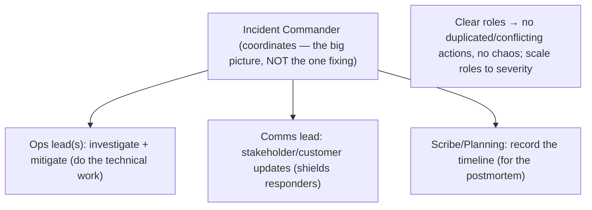
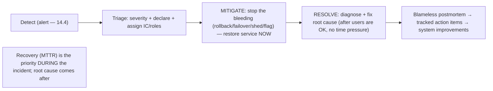

# Lesson 14.5 — Incident Response, Command, Postmortems (Blameless)

> Part 14: Reliability Engineering (SRE) · Difficulty: 🟡🔴
>
> **Prerequisites:** [11.1 Failure Models (MTTR)], [14.1 Error Budget], [14.3 Observability], [14.4 Alerting/On-Call].
> **Unlocks:** [14.6 Capacity], [14.8 Chaos Engineering], [Part 16 Observability], [Part 20 Capstone (production readiness)].

---

## 1. Learning Objectives

After this lesson you will be able to:

- Explain the goal of incident response — **minimize impact by restoring service fast (low MTTR — 11.1)** — and why a **structured process** beats ad-hoc heroics.
- Describe the **Incident Command System (ICS)** adapted for tech: **Incident Commander**, **Ops/Comms/Planning** roles, and why clear roles prevent chaos.
- Distinguish **mitigation** (stop the bleeding now) from **resolution** (fix the root cause later) and why mitigation comes first.
- Run a **blameless postmortem**: focus on **systems and causes, not people**, to drive learning and prevent recurrence.
- Explain **why blamelessness is essential** (human error is a symptom of system design; blame destroys honesty and learning).

---

## 2. Motivation — The 3 a.m. outage, handled well or badly

No matter how good your SLOs (14.1), alerting (14.4), and resilience (Part 11) are, **incidents will happen** — failure is the steady state (11.1). What separates great teams from struggling ones is **not** whether they have incidents, but **how they respond**. A badly-handled incident is chaos: several engineers independently poking at production, no one knowing who's in charge, duplicated or conflicting actions, stakeholders interrupting responders for status, no record of what changed, and — afterward — a **blame hunt** that teaches everyone to hide mistakes. The outage lasts longer (high MTTR — 11.1), often gets *worse* from uncoordinated action, and the organization **learns nothing**, so the same class of incident recurs.

A well-handled incident is calm and structured: a clear **Incident Commander** coordinates, roles are assigned (who's fixing, who's communicating, who's tracking), the team **mitigates first** (restore service — stop the user pain) and diagnoses the root cause *after*, communication flows through one channel, and everything is **recorded**. Afterward, a **blameless postmortem** treats the incident as a **learning opportunity about the system**, not a trial of the people involved — producing concrete action items that make recurrence less likely. This structure comes from **incident command** (borrowed from emergency services) and the SRE principle of **blamelessness**. This lesson develops incident response, the command structure, mitigation-before-resolution, and blameless postmortems — the discipline of turning inevitable failures into fast recoveries and lasting improvements.

---

## 3. Theory — From first principles

### 3.1 The goal: minimize impact, restore fast (MTTR)

`[CS]` The primary goal of incident response is to **minimize the impact of an incident** — chiefly by **restoring service as fast as possible** (minimizing **MTTR** — 11.1) `[CS]`:
- Since you can't prevent all incidents (11.1), **how fast you recover** (MTTR) is the dominant lever on availability (`availability ≈ MTBF/(MTBF+MTTR)` — 11.1). Incident response is **MTTR management**.
- **Restore first, understand later** (§3.4): the immediate priority is **stopping user pain**, not root-causing.
- `[BP]` A **structured process** minimizes MTTR by preventing the two failure modes of ad-hoc response: **chaos** (uncoordinated, conflicting actions that prolong/worsen the outage) and **paralysis** (no one taking charge). Structure = faster, calmer, safer recovery.

### 3.2 Incident command (ICS adapted for tech)

`[CS]` Tech incident response borrows the **Incident Command System (ICS)** from emergency services — a **role-based command structure** `[CS]`:
- **Incident Commander (IC):** the **single person in charge** of coordinating the response — **not** necessarily the one fixing it. The IC **maintains the big picture**, makes decisions, delegates, and prevents chaos. **Clear ownership** is the point: everyone knows who's coordinating.
- **Operations/Ops lead:** the people **actually doing the technical work** (investigating, mitigating) — directed by the IC.
- **Communications lead:** handles **stakeholder/customer communication** and status updates — **shields responders** from the flood of "is it fixed yet?" so they can focus.
- **Planning/Scribe:** **records** the timeline (what was observed, what actions were taken, when) — essential for the postmortem (§3.5) and for handoffs.
- `[BP]` **Why roles matter:** without them you get **duplicated/conflicting actions**, **no coordination**, **responders distracted by comms**, and **no record**. For small incidents one person may wear several hats; for big ones, **separate people per role**. The IC role can rotate and be **explicitly handed off** (with acknowledgment) — never ambiguous.

### 3.3 The incident lifecycle

`[CS]` A typical structured incident flow `[CS]`:
- **Detect** — an alert (14.4) or report signals a problem.
- **Triage/assess** — how bad? who's affected? declare an **incident** and its **severity** (sev levels scale the response); assign the **IC** and roles (§3.2).
- **Mitigate** — **stop the bleeding** (§3.4): restore service by any safe fast means (rollback — 13.7, failover — 11.2, shed load — 11.4, disable a feature — feature flag).
- **Coordinate + communicate** — IC directs; comms lead updates stakeholders on a **single channel**; scribe records.
- **Resolve** — once mitigated (users OK), diagnose and fix the **root cause** (§3.4), using **observability** (14.3).
- **Close + review** — declare resolved; schedule the **blameless postmortem** (§3.5).
- `[BP]` **Severity levels** scale the response (a sev-1 total outage mobilizes full command; a sev-3 minor degradation is lighter) — don't over- or under-respond.

### 3.4 Mitigation before resolution — stop the bleeding first

`[CS]` A crucial principle: **mitigate (restore service) before you resolve (fix the root cause)** `[CS]`:
- **Mitigation** = making the **user pain stop now**, even without understanding *why* — e.g., **roll back** the recent deploy (13.7), **fail over** to a healthy replica/region (11.2/13.8), **shed load** (11.4), **restart**, **disable the offending feature** (feature flag — 13.7), **scale up**. Often the **fastest mitigation is a rollback** (if a recent change caused it).
- **Resolution** = finding and fixing the **underlying cause** — done **after** service is restored, without time pressure.
- `[BP]` **Why this order:** users care that it **works**, not that you understand it. **Diagnosing under pressure while users suffer prolongs the outage** (higher MTTR). Restore first (stop the bleeding), then investigate calmly. **"Recovery, not root cause, is the priority during the incident."**
- **Caveat:** mitigation must be **safe** — don't take a destructive action (e.g., deleting data) as "mitigation." And **preserve evidence** (logs/state) for the postmortem before wiping things.

### 3.5 The blameless postmortem

`[CS]` After an incident, a **postmortem** (a.k.a. incident review / retrospective) documents **what happened, why, and how to prevent recurrence** — and it is **blameless** `[CS]`:
- **Contents:** a **timeline** (from the scribe — §3.2), **impact** (users/duration/SLO/error-budget — 14.1), **root cause(s)** (often via techniques like "5 Whys" — but avoiding stopping at "human error" — §3.6), **what went well / poorly**, and — most importantly — **concrete, owned, tracked action items** to prevent recurrence.
- **Blameless** means: focus on **systems, processes, and contributing factors — not on blaming individuals** (§3.6). The question is "**how did the system allow this**," not "**who screwed up**."
- `[BP]` **The output that matters:** **action items** that get **prioritized and done** (they cost error budget / justify reliability work — 14.1/14.2). A postmortem with no followed-through actions is theater — the same incident recurs.
- `[BP]` **Postmortem triggers:** define **which incidents get a postmortem** (e.g., any user-facing outage, any SLO breach, any data loss) so it's consistent, not arbitrary.

### 3.6 Why blamelessness is essential

`[CS]`/`[BP]` Blamelessness is not "being nice" — it's a **hard requirement for learning** `[BP]`:
- **Human error is a symptom, not a root cause:** when a person "made a mistake," the real question is **why the system let a single human action cause an incident** (no guardrails, confusing UI, missing checks, bad process). Blaming the person **hides the systemic cause** that will bite the next person.
- **Blame destroys honesty:** if people are punished for incidents, they **hide mistakes, omit details, and become defensive** → you **lose the truth** you need to learn, and problems fester in the dark. **Psychological safety** is prerequisite to honest postmortems.
- **Blame doesn't prevent recurrence:** firing/shaming someone doesn't fix the **system** that allowed the error — the next person hits the same trap. **Fixing the system does.**
- `[BP]` **The reframe:** assume everyone acted **reasonably given what they knew at the time** (the "second story"), and ask what about the **system/context** made the error likely — then **fix that**. Blameless culture produces **honest, deep postmortems** → real systemic fixes → fewer recurrences. It's the foundation of a **learning organization** (and ties to 14.2's blameless toil/incident stance).

### 3.7 Putting it together — the response + learning loop

`[BP]` The full loop:
- **Prepare:** on-call + runbooks + escalation (14.4), observability (14.3), practiced roles (drills / chaos — 14.8), defined severities + postmortem triggers.
- **Respond (structured):** detect → triage + declare + assign **IC/roles** (§3.2) → **mitigate first** (§3.4) → coordinate + single-channel comms + scribe → **resolve root cause** after → close.
- **Learn (blameless):** postmortem with timeline/impact/causes/**action items** (§3.5), blameless (§3.6); **track action items to completion**.
- **Improve:** action items feed back into the system (fix guardrails, automation — 14.2, better alerts — 14.4, resilience — 11.3, capacity — 14.6); recurring incident classes justify reliability investment (error budget — 14.1).
- `[BP]` This loop turns inevitable failures (11.1) into **fast recoveries** (low MTTR) and **compounding learning** — the organizational muscle that steadily improves reliability. **Practice it** (game days — 14.8) so it works under real pressure.

---

## 4. Visual Intuition

### Incident command roles

### Incident lifecycle: mitigate first

---

## 5. Real-World Analogy

Think of the **emergency response to a building fire** — where these exact structures literally come from.

- **Incident command (ICS is from firefighting):** when firefighters arrive, they don't all rush in randomly. One person becomes the **Incident Commander**, standing back to **see the whole scene and direct** — deciding strategy, not personally holding a hose. Others have clear roles: **crews fighting the fire** (ops), someone **briefing the press and the building owner** (comms — so the firefighters aren't pestered mid-rescue), and someone **logging what's happening** (scribe). This role structure exists precisely because **uncoordinated heroics get people killed** — and it's the model tech incident response borrowed.
- **Mitigate before resolve:** the fire crew's **first job is to put out the fire and get people to safety** (mitigation — stop the harm now) — **not** to investigate **why** it started. The **arson investigation** (root-cause resolution) happens **afterward**, calmly, once everyone's safe. Trying to determine the cause **while the building burns** would be absurd and deadly. Same with outages: **restore service first** (roll back, fail over), **diagnose later**.
- **Communication channel:** the commander gives **one official status** to the outside world, so panicked, conflicting messages don't spread and so the firefighters aren't distracted answering the crowd's questions. In an outage, the **comms lead shields the responders** from the "is it fixed yet?" flood.
- **Blameless postmortem = the fire investigation that improves building codes:** after the fire, investigators ask **"what about the building let this fire spread so fast?"** — not "let's fire the person who left the stove on." Because if the real lesson is **"there were no smoke detectors and the fire doors were blocked"** (a systemic failure), **blaming the individual hides the fix that would save the next building**. And if investigators **punished people for reporting fires**, people would **stop reporting them** — you'd lose the very information needed to prevent the next disaster. Blameless investigation → honest facts → **better building codes** (systemic fixes) → fewer fires. That's why blamelessness isn't softness — it's how you **actually get safer**.

---

## 6. Industry Example

- **Incident Command System (ICS)** `[CONV]`: adapted from emergency services (wildfire/FEMA) into tech incident management (IC + roles) (§3.2). *(Representative.)*
- **Google SRE incident management + blameless postmortems** `[CONV]`: structured response, mitigate-first, and the blameless postmortem culture (§3.4/3.5/3.6). *(Representative.)*
- **Etsy's "blameless PostMortems" / Just Culture** `[CONV]`: influential articulation of why blame destroys learning (the "second story") (§3.6). *(Representative.)*
- **Rollback as fastest mitigation** `[CONV]`: teams whose first mitigation step is reverting the recent deploy (§3.4, 13.7). *(Representative.)*
- **Incident-management tooling** `[CONV]`: platforms coordinating roles, timelines, comms, and postmortem action-item tracking (§3.2/3.5). *(Representative.)*

---

## 7. Implementation Details

- **Prepare** (§3.7): runbooks + escalation + on-call (14.4), observability for diagnosis (14.3), defined **severity levels** + **postmortem triggers**, and **practiced roles** (drills/chaos — 14.8).
- **Declare + assign** (§3.2/3.3): for real incidents, explicitly **declare** an incident, set severity, and name the **IC + roles** (Ops/Comms/Scribe) — scale roles to severity; hand off IC explicitly.
- **Mitigate first** (§3.4): restore service fast + safely (rollback/failover/shed/flag/scale); **preserve evidence** before destructive actions; don't diagnose under pressure while users suffer.
- **Single-channel comms** (§3.2): comms lead updates stakeholders; shield responders; scribe records the timeline.
- **Resolve after** (§3.3/3.4): fix root cause calmly once mitigated, using observability (14.3).
- **Blameless postmortem** (§3.5/3.6): timeline, impact (SLO/error-budget — 14.1), root cause(s), what went well/poorly, and **concrete, owned, tracked action items**; keep it **blameless** (systems not people).
- **Track action items to done** (§3.5): prioritize them (they justify reliability work — 14.2); a postmortem without followed-through actions is theater.
- **Feed learning back** (§3.7): action items → guardrails/automation (14.2), better alerts (14.4), resilience (11.3), capacity (14.6).

---

## 8. Advantages

- **Faster recovery (low MTTR)** — structure prevents chaos/paralysis (§3.1, 11.1).
- **No chaos** — clear roles avoid duplicated/conflicting actions (§3.2).
- **Focused responders** — comms lead shields them; scribe records (§3.2).
- **Safer mitigation** — mitigate-first restores service without risky under-pressure root-causing (§3.4).
- **Real learning** — blameless postmortems → honest analysis → systemic fixes → fewer recurrences (§3.5/3.6).
- **Psychological safety** — people report + discuss incidents honestly (§3.6).

---

## 9. Disadvantages / costs

- **Requires preparation + practice** — roles/runbooks/drills cost time; unpracticed process fails under pressure (§3.7).
- **Cultural commitment** — blamelessness must be **real** (leadership-backed); fake blamelessness is worse than none (§3.6).
- **Process overhead** — declaring/roles/postmortems have a cost; scale to severity to avoid over-ceremony (§3.3).
- **Action-item follow-through is hard** — postmortems become theater if actions aren't tracked/done (§3.5).
- **IC skill** — good incident command is a learned skill; a bad IC can worsen things (§3.2).
- **Evidence vs speed tension** — mitigating fast can destroy diagnostic evidence (§3.4).

---

## 10. When NOT to / cautions

- **Don't diagnose root cause before mitigating** while users suffer — restore first (§3.4).
- **Don't skip incident command** for significant incidents — ad-hoc heroics cause chaos (§3.2).
- **Don't over-ceremony small incidents** — scale the response to severity (§3.3).
- **Don't run blameful postmortems** — they destroy honesty and learning (§3.6).
- **Don't take destructive "mitigations"** or wipe evidence needed for the postmortem (§3.4).
- **Don't let action items rot** — untracked = the incident recurs (§3.5).

---

## 11. Common Mistakes

1. **No Incident Commander** — uncoordinated, conflicting actions prolong/worsen the outage (§3.2).
2. **Root-causing before mitigating** — users suffer longer while you investigate (§3.4).
3. **Responders swamped by comms** — no comms lead → distracted, slower (§3.2).
4. **Blameful postmortems** — people hide mistakes → no learning → recurrence (§3.6).
5. **No/untracked action items** — postmortem theater; same incident repeats (§3.5).
6. **No timeline/scribe** — can't reconstruct what happened for the postmortem (§3.2).
7. **Destructive mitigation / lost evidence** — made it worse or can't diagnose later (§3.4).
8. **Unpracticed process** — the structure collapses under real pressure (§3.7, 14.8).

---

## 12. Interview Questions

**🟢 Easy**
- What is the primary goal of incident response, and how does it relate to MTTR?
- What is an Incident Commander, and why isn't it the person fixing the problem?

**🟡 Medium**
- Why mitigate before resolving? Give examples of mitigation actions.
- What makes a postmortem "blameless," and why does blamelessness matter?

**🔴 Hard**
- Describe the incident command roles and the incident lifecycle. How do severity levels scale the response?
- Why is "human error" not a root cause? How do you find the systemic cause instead (the "second story")?

**⚫ Staff+**
- Design an incident-response process for an organization: roles, severity levels, mitigation playbook, comms, postmortem triggers + template, and how action items feed back into reliability (ties to SLOs/error budgets — 14.1, toil — 14.2, alerting — 14.4).
- A team's incidents are chaotic (everyone poking prod), slow to recover, and followed by blame — and the same failures keep recurring. Diagnose and design the fix: incident command, mitigate-first, blameless postmortems with tracked actions, and practice (14.8).

---

## 13. Production Pitfalls

- **Chaotic response prolongs outage:** multiple engineers took conflicting actions with no IC → the outage lasted far longer (high MTTR) (§3.2, 11.1).
- **Made it worse:** an uncoordinated "fix" during the incident caused a second failure (§3.2/3.4).
- **Root-cause rabbit hole:** the team debugged the cause for an hour while users were down, instead of rolling back (§3.4).
- **Blame → hidden truth:** after a blameful review, people stopped sharing details, and the systemic cause recurred (§3.6).
- **Postmortem theater:** action items were written but never done → the same incident repeated months later (§3.5).
- **Lost evidence:** responders restarted/wiped state to mitigate, destroying the data needed to root-cause (§3.4).
- **Process failed under pressure:** an unpracticed team couldn't execute the process during a real sev-1 (§3.7, 14.8).

---

## 14. Optimization Techniques

- **Structured incident command + defined severities** for fast, calm, right-sized response (§3.2/3.3).
- **Mitigate-first playbook** (rollback/failover/shed/flag) for lowest MTTR (§3.4, 13.7/11.2/11.4).
- **Single-channel comms + scribe** to keep responders focused and the record intact (§3.2).
- **Blameless postmortems with tracked action items** → systemic fixes → fewer recurrences (§3.5/3.6).
- **Feed learning into automation/guardrails/alerts/resilience** (14.2/14.4/11.3) (§3.7).
- **Practice via game days / chaos** (14.8) so the process works under real pressure (§3.7).
- **Observability-driven diagnosis** for fast resolution (14.3).

---

## 15. Summary

Incidents are inevitable (failure is the steady state — 11.1), so what distinguishes great teams is **how they respond**. The goal of incident response is to **minimize impact by restoring service as fast as possible** — **MTTR management** (11.1), the dominant availability lever — and a **structured process** achieves this by preventing ad-hoc response's two failure modes: **chaos** (uncoordinated, conflicting actions that prolong/worsen the outage) and **paralysis** (no one in charge). The structure is the **Incident Command System (ICS)** borrowed from emergency services: an **Incident Commander** who **coordinates** (maintains the big picture, decides, delegates — **not** the one fixing), an **Ops lead** doing the technical work, a **Comms lead** handling stakeholder updates (shielding responders from the "is it fixed?" flood), and a **Scribe** recording the **timeline** (for the postmortem) — with **severity levels** scaling the response and roles combined for small incidents, separated for big ones. The lifecycle: **detect → triage/declare/assign roles → mitigate → coordinate/communicate → resolve → review**. A crucial principle is **mitigation before resolution**: **stop the bleeding now** (roll back the deploy — often the fastest — 13.7, fail over — 11.2/13.8, shed load — 11.4, disable a feature via flag, scale up) to **restore service**, and diagnose/fix the **root cause afterward** without time pressure — because **users care that it works, not why**, and **diagnosing under pressure prolongs the outage** ("recovery, not root cause, is the priority during the incident") — while keeping mitigation **safe** and **preserving evidence**. Afterward, a **blameless postmortem** documents timeline, impact (SLO/error-budget — 14.1), root cause(s), what went well/poorly, and — most importantly — **concrete, owned, tracked action items** to prevent recurrence. **Blamelessness is essential, not niceness**: **human error is a symptom, not a root cause** (ask *why the system let one human action cause an incident* — the "second story"); **blame destroys honesty** (punished people hide mistakes → you lose the truth needed to learn); and **blame doesn't prevent recurrence** (only fixing the **system** does) — so assume everyone acted reasonably given what they knew, and **fix the system**. The full loop — **prepare** (runbooks/observability/practiced roles), **respond** (command + mitigate-first + single-channel comms + scribe + resolve-after), **learn** (blameless postmortem + tracked actions), **improve** (actions → guardrails/automation/alerts/resilience) — turns inevitable failures into **fast recoveries** (low MTTR) and **compounding learning**, and must be **practiced** (game days/chaos — 14.8) so it holds under real pressure.

---

## 16. Revision Notes (flashcard-ready)

- **Q:** Primary goal of incident response? **A:** Minimize impact by restoring service fast — MTTR management (11.1).
- **Q:** Why a structured process? **A:** Prevents chaos (conflicting actions) and paralysis (no one in charge) that prolong/worsen outages.
- **Q:** Incident Commander? **A:** The single coordinator maintaining the big picture and delegating — NOT the person fixing it.
- **Q:** Incident roles? **A:** IC (coordinate), Ops (fix), Comms (stakeholders — shield responders), Scribe (timeline).
- **Q:** Mitigate vs resolve? **A:** Mitigate = stop user pain now (rollback/failover/shed/flag); resolve = fix root cause after, calmly.
- **Q:** Why mitigate first? **A:** Users care that it works, not why; diagnosing under pressure prolongs the outage (raises MTTR).
- **Q:** Blameless postmortem? **A:** Document timeline/impact/root-cause/action-items focusing on systems not people; drive prevention.
- **Q:** Why is "human error" not a root cause? **A:** It's a symptom — ask why the system let one human action cause an incident (fix that).
- **Q:** Why blamelessness? **A:** Blame → people hide mistakes → lost truth → no learning; and blame doesn't fix the system that allowed it.
- **Q:** Most important postmortem output? **A:** Concrete, owned, tracked action items that actually get done (else it's theater).

---

## 17. Further Reading + Knowledge-Graph Links

**Foundations (in-platform):**
- **[11.1 Failure Models (MTTR)]** — recovery time as the availability lever.
- **[14.4 Alerting/On-Call]** — detection + the on-call that begins response.
- **[14.3 Observability]** — diagnosing during resolution.
- **[14.1 Error Budget]** — impact quantified; action items justify reliability work.

**Unlocks / next:**
- **[14.6 Capacity Planning]** & **[14.8 Chaos Engineering]** — proactive reliability + practicing response.
- **[Part 16 Observability]** — deep diagnosis tooling.
- **[Part 20 Capstone]** — production-readiness review incorporating incident response.

**External (canonical):**
- Beyer et al., *Site Reliability Engineering* — "Managing Incidents," "Postmortem Culture." *(Representative.)*
- Allspaw (Etsy), "Blameless PostMortems and a Just Culture." *(Representative.)*
- ICS / emergency-management references. *(Representative.)*

> **Knowledge-graph:** `14.4 alert/page` → **`14.5 incident response`** (command + mitigate-first + blameless postmortem) → action items → `14.2 automation` / `14.4 alert tuning` / `11.3 resilience`; practiced via `14.8 chaos`.
