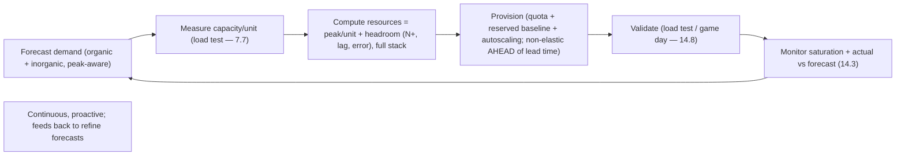
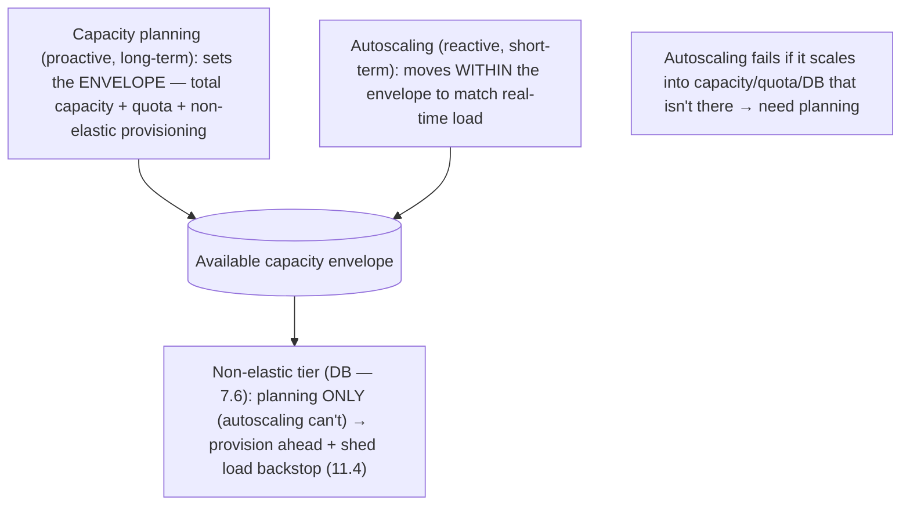

# Lesson 14.6 — Capacity Planning and Demand Forecasting

> Part 14: Reliability Engineering (SRE) · Difficulty: 🟡🔴
>
> **Prerequisites:** [7.7 Capacity Planning & Load Testing], [11.2 Redundancy (N+ headroom)], [13.5 Autoscaling], [14.1 SLO], [14.3 Golden Signals (saturation)].
> **Unlocks:** [14.7 Release Engineering], [14.8 Chaos], [Part 17 Performance], [Part 20 Capstone].

---

## 1. Learning Objectives

After this lesson you will be able to:

- Explain **capacity planning** in the SRE context — ensuring enough resources to meet **future demand at SLO** (14.1), cost-effectively.
- Combine **organic** (natural growth) and **inorganic** (launches, marketing, events) **demand forecasting**.
- Turn demand forecasts into resource plans using **load testing / benchmarking** (7.7) and **headroom** (11.2), accounting for **non-elastic** components (7.6) autoscaling can't handle (13.5).
- Distinguish **autoscaling** (reactive, short-term elasticity — 13.5) from **capacity planning** (proactive, longer-term provisioning) and why you need both.
- Avoid the classic failures: under-provisioning (outages), over-provisioning (waste), and ignoring lead times / non-elastic limits.

---

## 2. Motivation — Don't run out of capacity, don't drown in cost

A system that can't meet demand fails visibly: overloaded, latency past the SLO (14.1), errors, cascading collapse (11.3) — an outage caused not by a bug but by **not enough capacity**. A system with far too much capacity fails invisibly but expensively: **money burned** on idle resources (1.2.3). **Capacity planning** threads this needle — ensuring there's **enough capacity to meet future demand at your SLO**, **cost-effectively**, and **before** you need it.

The naive assumption in the cloud era is "**autoscaling handles it**" (13.5). Autoscaling is essential but **insufficient**: it's **reactive and short-term** (responds to *current* load with a lag), it **can't scale non-elastic components** (a primary database — 7.6/13.5), it needs **underlying capacity to scale into** (nodes, quota, physical resources with **lead times**), and it doesn't help you **budget or negotiate quota** for a launch six months out. Capacity planning is the **proactive, longer-horizon** complement: **forecast demand** (both organic growth and inorganic spikes from launches/events), **translate it into resource needs** via load testing (7.7) with **headroom** (11.2), and **provision ahead of time** — including the non-elastic pieces autoscaling can't touch. This lesson develops capacity planning and demand forecasting as the discipline of having enough capacity, at the right cost, at the right time.

---

## 3. Theory — From first principles

### 3.1 What capacity planning is (in SRE terms)

`[CS]` **Capacity planning** = ensuring the system has **enough resources to serve projected future demand while meeting its SLOs** (14.1), at acceptable **cost** (1.2.3) `[CS]`:
- Three quantities to reconcile: **demand** (how much load — forecasted), **capacity** (how much the system can serve at SLO — measured), and **cost** (what the capacity costs).
- **The objective:** capacity **≥ demand + headroom**, provisioned **before** demand arrives, without gross **over-provisioning**.
- `[BP]` It's a **continuous, proactive** process (forecast → provision → validate → adjust), not a one-time sizing. Ties directly to 7.7 (the capacity-planning fundamentals) applied in an ongoing operational discipline.

### 3.2 Demand forecasting: organic + inorganic

`[CS]` Forecasting future demand has **two components** `[CS]`:
- **Organic growth:** the **natural, gradual** growth of usage — more users, more data, more traffic over time — extrapolated from **historical trends** (often steady % growth; may be seasonal/cyclical). Statistical/trend forecasting.
- **Inorganic growth:** **step changes from events** — a product **launch**, a **marketing campaign**, a **holiday/sale** (e.g., Black Friday), a partner integration, press coverage, or seasonal peaks. These are **not** in the historical trend and must be **anticipated deliberately** (talk to product/marketing).
- `[BP]` **Both matter:** organic gives the **baseline curve**; inorganic gives the **spikes** — and inorganic events are often the ones that **cause outages** (unanticipated launch traffic) because they're not in the trend line. **Plan for peak** (7.7), especially known inorganic peaks, plus headroom.
- **Percentile/peak-aware:** forecast the **peak** demand you must serve (not the average), including the tallest known spike (7.7).

### 3.3 From demand to resources: load testing + headroom

`[CS]` Translating a demand forecast into a resource plan requires knowing **how much load a unit of capacity can serve at SLO** `[CS]`:
- **Load test / benchmark** (7.7): measure the **capacity of your system per unit** (e.g., "one instance serves ~X RPS at p99 < 200ms before degrading") — find the **utilization knee** (7.7 — where latency blows up as `1/(1−ρ)`).
- **Capacity target = forecasted peak demand / per-unit capacity**, then **add headroom** (11.2/7.7): **N+1 / N+2** so you can lose instances (failure/deploys) and still serve; and headroom for **forecast error** and **scale-up lag** (13.5). Provision below the knee.
- **Account for the full stack:** capacity isn't just app instances — it's **database capacity** (7.6 — the usual bottleneck), connection pools (5.4.2), caches (Part 6), queues, network, and **quota/limits** with the provider.
- `[BP]` **Validate empirically** (7.7): load-test to confirm the plan holds; don't trust a spreadsheet alone. Re-benchmark as the system changes (a new feature can change per-unit capacity).

### 3.4 Capacity planning vs autoscaling

`[BP]` A crucial distinction — **you need both** (13.5) `[BP]`:
- **Autoscaling (13.5):** **reactive, short-term, automatic** — responds to **current** load by adding/removing elastic instances, with a **lag** (pod/node startup). Handles **within-forecast variability** and unexpected short spikes (up to a point).
- **Capacity planning:** **proactive, longer-term, deliberate** — ensures the **underlying capacity exists** for autoscaling to scale **into** (nodes, quota, physical/reserved resources with **lead times**), provisions for **known future demand** (launches months out), and covers the **non-elastic** parts autoscaling can't scale (§3.5).
- `[BP]` **They compose:** capacity planning sets the **envelope** (enough total capacity + quota + non-elastic provisioning); autoscaling **moves within it** to match real-time load efficiently. **Autoscaling without capacity planning fails** when it tries to scale into capacity that isn't there (quota exhausted, no nodes available, DB maxed).

### 3.5 The non-elastic constraint (the recurring trap)

`[CS]` As in 13.5 §3.7 and 7.6, the **non-elastic components** dominate capacity planning `[CS]`:
- **Stateless tiers autoscale easily; stateful/non-elastic ones don't:** a primary **database** (7.6), a system with **fixed licenses/quota**, a downstream with **fixed capacity**, or **physical/reserved** resources with **procurement lead times**.
- **You must plan these ahead:** scaling a database (adding read replicas — 7.5, resharding — 7.3, upgrading) is **slow and disruptive** — it **cannot be done reactively during a spike**. So capacity planning must **forecast and provision the non-elastic tier well in advance**.
- **Quota + lead time:** cloud resources have **quotas** (request increases ahead of time) and even "elastic" resources aren't infinite; reserved capacity/hardware has **procurement lead times** (weeks/months).
- `[BP]` **Rule:** identify the **binding constraint** (7.6 — usually the database) and plan **its** capacity proactively, because **autoscaling can't save you there** (scaling the app tier into a maxed DB makes it worse — 13.5). Pair with **load shedding** (11.4) as the backstop when demand exceeds any planned capacity.

### 3.6 The capacity-planning loop

`[BP]` Capacity planning is a **continuous cycle** `[BP]`:
1. **Forecast demand** (organic + inorganic — §3.2) for the planning horizon (peak-aware).
2. **Measure capacity** per unit via load testing/benchmarking (§3.3, 7.7).
3. **Compute required resources** = peak demand / per-unit capacity + **headroom** (N+, forecast error, lag) across the **full stack** (esp. non-elastic — §3.5).
4. **Provision** — request quota, add capacity (reserved for baseline + autoscaling for variability), provision non-elastic tiers **ahead of lead times**.
5. **Validate** — load-test / game-day (14.8) to confirm the system meets SLO at forecast peak.
6. **Monitor + adjust** — watch **saturation** (14.3) and actual vs forecast demand; **re-forecast** and adjust continuously.
- `[BP]` **Feedback:** actual demand vs forecast improves the next forecast; saturation nearing the knee (14.3/7.7) is a **leading indicator** to add capacity (ticket, not page — 14.4). Cost-optimize with **reserved/committed** capacity for the stable baseline + **autoscaling** for the variable part.

### 3.7 Cost, efficiency, and the balance

`[BP]` Capacity planning is inherently a **cost/reliability tradeoff** (1.1.5/1.2.3) `[BP]`:
- **Under-provision → outages** (can't meet demand at SLO → overload/cascade — 11.3): the reliability failure.
- **Over-provision → waste** (idle resources cost money): the cost failure.
- **The balance:** provision for **forecasted peak + necessary headroom** (enough to meet SLO through failures + spikes + lag) but **no more** — mirroring the error-budget philosophy (14.1): don't buy reliability the requirements don't need.
- **Efficiency levers:** **reserved/committed** capacity (cheaper) for the predictable **baseline** + **autoscaling** for the **variable** part; **scale-to-zero** (13.5) for intermittent workloads; right-sizing (13.5 VPA); shedding load (11.4) rather than provisioning for absolute worst case.
- `[BP]` This is **efficiency engineering** (Part 17) applied to capacity — meet the SLO at minimum cost, not maximum capacity.

---

## 4. Visual Intuition

### The capacity-planning loop

### Capacity planning vs autoscaling

---

## 5. Real-World Analogy

Think of planning staff and supplies for a **restaurant** that must never turn hungry customers away — but also can't afford to pay idle staff.

- **Capacity planning = deciding how much to prepare, in advance:** the manager forecasts **how many customers** will come and ensures there are **enough cooks, tables, and ingredients** to serve them **at good quality** (SLO) — **before** they arrive — without **overstaffing** and burning money on idle cooks.
- **Organic vs inorganic demand:** **organic** is the **steady growth** of regulars month over month (extrapolate the trend). **Inorganic** is the **one-off surges** you must anticipate deliberately: **Valentine's Day**, a **festival next door**, a **glowing review that just went viral**. The trend line won't warn you about these — you have to **ask around and plan** for them, and they're exactly the events that cause the "we ran out of food and turned people away" disasters.
- **Load testing = knowing your kitchen's throughput:** you measure that **one cook can plate ~20 meals/hour before quality drops** (the knee). To serve a forecasted peak of 200 meals/hour, you need ~10 cooks — **plus headroom** (a cook might call in sick — N+1; the rush might run bigger than forecast).
- **Autoscaling vs planning:** you can **call in an on-call server** when the dinner rush unexpectedly picks up (autoscaling — reactive, short-term) — but that only works if there **are** off-duty servers to call, if there's **space** for them, and if the **kitchen and oven** can keep up. You **can't summon a second oven mid-rush** (the non-elastic database — 7.6) — that had to be **bought and installed weeks ago** (lead time). So **planning** ensures the oven, the ingredient supply, and the staffing pool exist; **autoscaling** flexes the servers within that.
- **The non-elastic trap:** hiring **20 more servers** during a surge doesn't help if there's still **one oven** — the food just backs up worse (scaling the app tier into a maxed DB). You must **plan the oven capacity ahead**; and if a surge exceeds even the planned capacity, you **put up a short wait / stop seating** (load shedding — 11.4) rather than collapse the kitchen.
- **The cost balance:** staff for the **forecasted peak plus a sensible buffer** — not for the theoretical maximum of "what if the whole city shows up," which would mean paying an army of idle cooks every quiet Tuesday.

---

## 6. Industry Example

- **Google SRE capacity planning** `[CONV]`: forecast (organic + inorganic) → provision → validate; capacity as a first-class SRE responsibility (§3.1/3.2). *(Representative.)*
- **Black Friday / holiday capacity** `[CONV]`: retailers planning + load-testing for known inorganic peaks months ahead, provisioning non-elastic tiers early (§3.2/3.5). *(Representative.)*
- **Reserved/committed + autoscaling mix** `[CONV]`: cost optimization via committed capacity for baseline + autoscaling for variability (§3.7, 13.5). *(Representative.)*
- **Cloud quota lead times** `[CONV]`: teams requesting quota increases ahead of launches because "elastic" isn't instant/infinite (§3.5). *(Representative.)*
- **Autoscale-into-DB failures** `[OPINION]`: incidents where the app tier autoscaled into a database that wasn't capacity-planned → worse overload (§3.5, 13.5/11.3). *(Representative.)*

---

## 7. Implementation Details

- **Forecast both demand types** (§3.2): extrapolate **organic** growth from history (peak-aware, seasonal); gather **inorganic** events from product/marketing (launches/campaigns/sales) and plan for their peaks.
- **Benchmark per-unit capacity at SLO** (§3.3, 7.7): load-test to find the knee; re-benchmark when the system changes.
- **Compute resources with headroom** (§3.3): peak demand / per-unit capacity + **N+ headroom** + forecast-error + scale-up-lag buffers; cover the **full stack** (app, DB, cache, queues, network, quota).
- **Provision proactively** (§3.4/3.5): reserved/committed for baseline + autoscaling for variability; **provision non-elastic tiers (DB) and quota AHEAD of lead times** (can't do reactively).
- **Validate** (§3.6): load-test / game-day (14.8) against forecast peak to confirm SLO holds.
- **Monitor saturation + actual vs forecast** (§3.6, 14.3): saturation nearing the knee = leading indicator → add capacity (ticket — 14.4); refine forecasts.
- **Pair with load shedding** (11.4) as the backstop beyond planned capacity (§3.5).
- **Cost-optimize** (§3.7): committed baseline + autoscaling + scale-to-zero for intermittent; provision for peak+headroom, not the theoretical max.

---

## 8. Advantages

- **Meets demand at SLO** — no capacity-caused outages (§3.1).
- **Cost-effective** — provision for peak+headroom, not max; committed+autoscaling mix (§3.7).
- **Handles known spikes** — inorganic events planned for, not surprised by (§3.2).
- **Covers non-elastic tiers** — DB/quota/hardware planned ahead (§3.5).
- **Complements autoscaling** — sets the envelope autoscaling moves within (§3.4).
- **Proactive** — capacity exists before demand arrives, accounting for lead times (§3.4/3.5).

---

## 9. Disadvantages / costs

- **Forecasting is uncertain** — organic trends shift; inorganic events are hard to size (→ headroom + monitoring) (§3.2).
- **Ongoing effort** — continuous forecast/benchmark/provision/validate cycle (§3.6).
- **Lead times constrain** — non-elastic provisioning must be far ahead; mistakes are costly to fix (§3.5).
- **Cost/reliability tension** — under vs over-provision; hard to optimize (§3.7).
- **Load testing effort** — realistic benchmarks are non-trivial to build/maintain (§3.3, 7.7).
- **Coordination** — needs product/marketing input for inorganic demand (§3.2).

---

## 10. When NOT to / cautions

- **Don't rely on autoscaling alone** — it can't scale non-elastic tiers or provision beyond the available envelope/quota (§3.4/3.5).
- **Don't forecast average** — plan for peak (incl. inorganic spikes) + headroom (§3.2, 7.7).
- **Don't ignore lead times** — non-elastic/quota provisioning must be well ahead (§3.5).
- **Don't over-provision to the theoretical max** — waste; provision for peak+headroom + shed the rest (§3.7, 11.4).
- **Don't skip validation** — a paper plan unverified by load testing can be wrong (§3.6, 7.7).
- **Don't forget the binding constraint** — plan the DB/bottleneck, not just the app tier (§3.5, 7.6).

---

## 11. Common Mistakes

1. **"Autoscaling handles it"** — ignoring non-elastic tiers, quota, and lead times (§3.4/3.5).
2. **Forecasting only organic** — blindsided by an unplanned launch/campaign spike (§3.2).
3. **Planning for average, not peak** — overloaded at peak (§3.2, 7.7).
4. **No headroom** — a single failure or forecast miss tips into overload (§3.3, 11.2).
5. **Ignoring the DB/bottleneck** — planning app capacity but not the binding constraint (§3.5, 7.6).
6. **No lead-time provisioning** — needing non-elastic capacity/quota that can't be gotten in time (§3.5).
7. **Unvalidated plan** — no load test → the plan is wrong under real load (§3.6, 7.7).
8. **Over-provisioning to the max** — huge waste (§3.7).

---

## 12. Interview Questions

**🟢 Easy**
- What is capacity planning, and what three quantities does it reconcile?
- What's the difference between organic and inorganic demand?

**🟡 Medium**
- How do you turn a demand forecast into a resource plan (load testing, headroom, full stack)?
- Why isn't autoscaling enough — what does capacity planning add?

**🔴 Hard**
- Why do non-elastic components (databases) dominate capacity planning, and how do lead times and quotas factor in?
- How do you balance under-provisioning (outages) vs over-provisioning (cost), and how does this mirror the error-budget philosophy (14.1)?

**⚫ Staff+**
- Plan capacity for a service ahead of a major launch (inorganic spike) on top of steady organic growth: forecasting, benchmarking, headroom, provisioning (reserved + autoscaling + non-elastic DB ahead of lead time), validation (game day), and load-shedding backstop.
- A service autoscaled fine for months, then fell over during a marketing campaign despite autoscaling. Diagnose (non-elastic DB / quota / lead time / no inorganic forecast) and design a capacity-planning process to prevent recurrence.

---

## 13. Production Pitfalls

- **Launch-day meltdown:** an unforecasted inorganic spike overwhelmed the system; autoscaling couldn't save the non-elastic DB (§3.2/3.5, 13.5).
- **Quota wall:** autoscaling hit the cloud account's instance quota mid-spike and stopped scaling (§3.5).
- **Lead-time miss:** needed reserved hardware / a DB upgrade that takes weeks, discovered days before the peak (§3.5).
- **No headroom cascade:** provisioned exactly for forecast; one instance failure + a slightly-high day tipped into overload/cascade (§3.3, 11.2/11.3).
- **Paper-plan failure:** an unvalidated capacity plan was wrong under real load patterns (§3.6, 7.7).
- **Idle-cost bloat:** over-provisioned for a theoretical max, burning money on idle capacity (§3.7).

---

## 14. Optimization Techniques

- **Forecast organic + inorganic, peak-aware** (§3.2) with product/marketing input.
- **Benchmark per-unit capacity + provision below the knee with headroom** (§3.3, 7.7/11.2).
- **Reserved/committed baseline + autoscaling for variability + scale-to-zero for intermittent** (§3.7, 13.5) — cost-efficient.
- **Provision non-elastic tiers + quota ahead of lead times** (§3.5); identify the binding constraint (7.6).
- **Load shedding backstop** beyond planned capacity (§3.5, 11.4).
- **Monitor saturation as a leading indicator** → proactive capacity tickets (§3.6, 14.3/14.4).
- **Validate with game days / load tests**; refine forecasts from actuals (§3.6, 14.8).

---

## 15. Summary

**Capacity planning** ensures the system has **enough resources to meet projected future demand at its SLOs** (14.1), **cost-effectively**, and **before** demand arrives — reconciling **demand** (forecasted), **capacity** (measured), and **cost** (1.2.3): under-provisioning causes **capacity outages** (overload/cascade — 11.3), over-provisioning **burns money**. It starts with **demand forecasting** in two parts: **organic growth** (natural, gradual usage growth, extrapolated from historical trends, often seasonal) and **inorganic growth** (step changes from **launches, campaigns, sales, events** that are **not in the trend line** and must be anticipated deliberately with product/marketing) — and you **plan for peak** (7.7), especially known inorganic spikes (the frequent cause of outages), **plus headroom**. To turn a forecast into a resource plan, you **load-test/benchmark** (7.7) to find **per-unit capacity at SLO** (the utilization knee — `1/(1−ρ)`), then compute **resources = peak demand / per-unit capacity + headroom** (**N+1/N+2** for failures/deploys — 11.2, plus forecast-error and scale-up-lag buffers), across the **full stack** (app, **database** — the usual bottleneck — 7.6, cache, queues, network, **quota**), and **validate empirically**. Crucially, **autoscaling (13.5) is necessary but insufficient**: it's **reactive and short-term** (matches current load with a lag) and **can't scale non-elastic components** (a primary DB — 7.6), needs **underlying capacity/quota to scale into**, and doesn't provision for **known future demand** or **procurement lead times** — so **capacity planning is the proactive, longer-horizon complement** that **sets the envelope** (total capacity + quota + non-elastic provisioning) autoscaling **moves within**; **autoscaling fails when it scales into capacity that isn't there**. The **non-elastic constraint** dominates: stateful tiers (databases), fixed licenses/quota, and physical/reserved resources have **slow, disruptive scaling and lead times**, so you must **forecast and provision them well ahead**, identify the **binding constraint** (7.6), and keep **load shedding** (11.4) as the backstop beyond planned capacity. Capacity planning is a **continuous loop** — **forecast → benchmark → compute (with headroom) → provision (reserved baseline + autoscaling + non-elastic-ahead) → validate (game day — 14.8) → monitor saturation (14.3) + actuals → re-forecast** — balancing **reliability vs cost** the same way the error budget does (14.1): provision for **peak + necessary headroom and no more** (committed baseline + autoscaling for variability + scale-to-zero for intermittent), meeting the SLO at **minimum cost** rather than maximum capacity — efficiency engineering (Part 17) applied to capacity.

---

## 16. Revision Notes (flashcard-ready)

- **Q:** Capacity planning goal? **A:** Enough resources to meet future demand at SLO, cost-effectively, before it arrives (reconcile demand/capacity/cost).
- **Q:** Organic vs inorganic demand? **A:** Organic = natural gradual growth (extrapolate trend); inorganic = step spikes from launches/campaigns/events (anticipate deliberately).
- **Q:** Why do inorganic events cause outages? **A:** They're not in the trend line, so they surprise you if not planned for.
- **Q:** Demand → resources? **A:** Peak demand / per-unit capacity (load-tested at SLO, below the knee) + headroom (N+, forecast error, lag), full stack.
- **Q:** Capacity planning vs autoscaling? **A:** Planning = proactive/long-term, sets the envelope + non-elastic; autoscaling = reactive/short-term, moves within it. Need both.
- **Q:** Why isn't autoscaling enough? **A:** Reactive/lagging, can't scale non-elastic DB, needs capacity/quota to scale into, ignores lead times + known future demand.
- **Q:** Non-elastic constraint? **A:** DB/quota/hardware scale slowly with lead times → must forecast + provision ahead; autoscaling can't save you there.
- **Q:** Under vs over-provision? **A:** Under → outages; over → wasted cost. Provision for peak + headroom, no more (like the error budget).
- **Q:** Cost-efficient mix? **A:** Reserved/committed baseline + autoscaling for variability + scale-to-zero for intermittent.
- **Q:** Leading indicator to add capacity? **A:** Saturation nearing the knee (14.3/7.7) → proactive ticket (14.4).

---

## 17. Further Reading + Knowledge-Graph Links

**Foundations (in-platform):**
- **[7.7 Capacity Planning & Load Testing]** — the fundamentals (knee, Little's Law, headroom).
- **[7.6 Multi-Tier / DB Bottleneck]** — the non-elastic binding constraint.
- **[11.2 Redundancy (N+ headroom)]** — headroom for failures.
- **[13.5 Autoscaling]** — reactive elasticity that planning complements.
- **[14.1 SLO]** & **[14.3 Golden Signals (saturation)]** — the target + leading indicator.

**Unlocks / next:**
- **[14.7 Release Engineering]** — capacity for launches.
- **[14.8 Chaos Engineering]** — game days validate capacity.
- **[Part 17 Performance]** — efficiency engineering, RED/USE.
- **[Part 20 Capstone]** — capacity + SLOs for the platform.

**External (canonical):**
- Beyer et al., *Site Reliability Engineering* — "Software Engineering in SRE" / capacity planning. *(Representative.)*

> **Knowledge-graph:** `7.7 capacity fundamentals` + `7.6 non-elastic DB` + `13.5 autoscaling` → **`14.6 capacity planning + forecasting`** (organic+inorganic, headroom, provision-ahead) → `14.7 launches` / `14.8 game days` / `Part 17 efficiency`.
