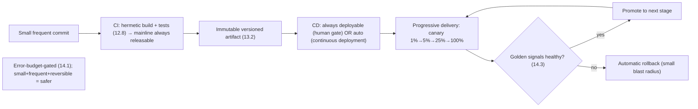
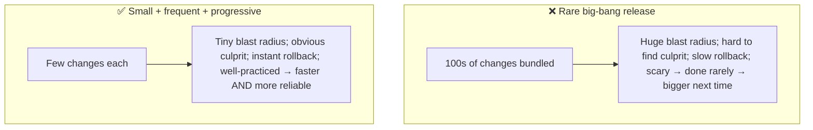

# Lesson 14.7 — Release Engineering and Progressive Delivery

> Part 14: Reliability Engineering (SRE) · Difficulty: 🟡🔴
>
> **Prerequisites:** [12.8 Testing/Consumer-Driven Contracts], [13.7 IaC/Immutable/Deployment Strategies], [14.1 Error Budget], [14.3 Golden Signals], [14.4 Alerting].
> **Unlocks:** [14.8 Chaos Engineering], [Part 15 Security (supply chain)], [Part 20 Capstone].

---

## 1. Learning Objectives

After this lesson you will be able to:

- Explain **release engineering** as a discipline — making builds/releases **reproducible, automated, consistent, and safe** — and its core principles (hermetic builds, versioning, CI/CD).
- Distinguish **CI** (continuous integration), **CD** (continuous delivery vs continuous deployment), and where human gates fit.
- Define **progressive delivery** — extending CD with **gradual, controlled, observable, reversible** rollouts (canary — 13.7) gated on metrics (14.3) and the **error budget** (14.1).
- Explain how release velocity and reliability **reinforce** rather than oppose each other (small frequent releases + fast rollback = safer).
- Connect release engineering to the supply chain / security (Part 15) and to error-budget-gated launches (14.1).

---

## 2. Motivation — Shipping is where reliability is won or lost

A large fraction of incidents are caused by **changes** — a deploy introduces a bug, a config change breaks something, a migration goes wrong. Since **change is the leading cause of outages**, *how you release* is one of the biggest levers on reliability. Yet releasing is often treated as an afterthought: manual, inconsistent, unreproducible steps ("it worked when Alice deployed it"), big infrequent "big-bang" releases that bundle hundreds of changes into one terrifying event, and no fast way to undo a bad one. This maximizes both **risk** (huge blast radius, hard to tell what broke) and **fear** (so teams release rarely, which makes each release bigger and riskier — a vicious cycle).

**Release engineering** is the discipline of making the build-and-release process **reproducible, automated, consistent, self-service, and safe** — treating "how we ship" as a first-class engineering problem. It rests on **CI/CD** (automating integration and delivery) and the immutable-artifact discipline (13.2/13.7). **Progressive delivery** goes further: it extends continuous delivery with **gradual, controlled rollouts** (canary — 13.7) that are **observable** (watched via golden signals — 14.3) and **automatically reversible** (roll back on regression), often **gated by the error budget** (14.1). The counterintuitive result — proven by high-performing teams — is that **velocity and reliability reinforce each other**: small, frequent, automated, progressively-delivered releases with fast rollback are **far safer** than rare big-bang releases. This lesson develops release engineering and progressive delivery as the discipline of shipping change safely and often.

---

## 3. Theory — From first principles

### 3.1 Release engineering as a discipline

`[CS]` **Release engineering** = the engineering discipline of building and delivering software **reproducibly, consistently, and safely** `[CS]`. Core principles `[BP]`:
- **Reproducible / hermetic builds:** a build produces the **same artifact** from the same source every time — **isolated** from the build environment (pinned dependencies, no "whatever's installed on the build box") → no "works on my machine" (13.1/13.2).
- **Versioned everything:** source, dependencies, build artifacts, config, infrastructure (IaC — 13.7) — all versioned so any release is **identifiable and reconstructable**.
- **Automated + self-service:** releases run through an **automated pipeline**, not manual steps → **consistency** (no human variance/errors — 14.2 toil) and **speed**.
- **Separation of build/release/run** (13.1 factor 5): build once → the **immutable artifact** (13.2) is promoted through environments with **externalized config** → reproducible + rollback-able.
- `[BP]` **Goal:** releases are **boring** — routine, automated, low-risk, reversible — not heroic events. "Make releases so easy and safe you do them all the time."

### 3.2 CI, CD, and continuous deployment

`[CS]` The automation pipeline, in stages `[CS]`:
- **Continuous Integration (CI):** developers **merge to mainline frequently** (small changes), and each merge **automatically builds + runs tests** (unit/component/contract — 12.8) → catch integration problems **early and small**, keep mainline **always releasable**. Avoids big painful merges.
- **Continuous Delivery (CD):** every change that passes CI is **automatically prepared for release** and could be **deployed at the push of a button** — the artifact is **always deployable**, with a **human gate** for the actual production release.
- **Continuous Deployment:** goes further — **every** change that passes the pipeline is **automatically deployed to production** with **no human gate** (requires very strong automated testing + progressive delivery + rollback — §3.3).
- `[BP]` **CD vs continuous deployment:** delivery = *ready* to deploy (human decides when); deployment = *actually* auto-deploys. Many teams do continuous **delivery** with progressive rollout; continuous **deployment** requires the highest automation/safety maturity.

### 3.3 Progressive delivery

`[CS]` **Progressive delivery** = extending CD with **gradual, controlled, observable, reversible** production rollouts `[CS]`:
- Rather than releasing to 100% at once, roll out **incrementally** (**canary** — 13.7: 1% → 5% → 25% → 100%), **watching metrics** (golden signals — 14.3: error rate, latency) at each step, and **automatically rolling back** on regression.
- **Four pillars** `[BP]`:
  1. **Gradual** — increase exposure in stages (canary/percentage-based).
  2. **Controlled** — you decide/automate the pace and who's exposed (by %, region, user cohort — often via a **service mesh** — 12.7, or feature flags — 13.7).
  3. **Observable** — each stage is **judged by metrics/SLIs** (14.1/14.3) — is the new version healthy?
  4. **Reversible** — **automatic rollback** on regression (fast — before most users are affected).
- **Feature flags** (13.7) complement it: **decouple deploy from release**, enable per-cohort, and kill a feature instantly without redeploy.
- `[BP]` Progressive delivery is **"testing in production done safely"** (12.8) — real traffic validation with a **tiny blast radius** and automatic reversal. It's the operational realization of the canary strategy (13.7), automated and metric-gated.

### 3.4 Error-budget-gated releases

`[BP]` Release engineering connects directly to the **error budget** (14.1) `[BP]`:
- **The error-budget policy** (14.1 §3.7) **gates launches**: while there's budget, release freely (velocity); when the budget is **exhausted**, the policy **freezes launches** and redirects to reliability.
- **Progressive rollouts spend budget deliberately**: a canary that regresses burns a **tiny** slice of budget (small blast radius) before auto-rollback — versus a big-bang bad release that could **blow the whole budget** at once.
- `[BP]` So the release process is **the mechanism that spends the error budget** — and doing it **progressively** makes that spending **cheap and controlled** (small, reversible increments) rather than catastrophic. Release engineering + error budgets together turn "ship vs stability" into the managed, data-driven loop (14.1/14.2).

### 3.5 Velocity and reliability reinforce each other

`[CS]`/`[OPINION]` The counterintuitive, evidence-backed insight (DORA/*Accelerate*) `[OPINION]`:
- Intuition says "**ship less to be safe.**" Reality is the opposite: teams that **release small, frequently, and automatically** are **both faster and more reliable** `[OPINION]`.
- **Why small+frequent is safer:**
  - **Smaller changes = smaller blast radius + easier diagnosis** (a bad release contains few changes → the culprit is obvious). Big-bang releases bundle hundreds of changes → hard to isolate what broke.
  - **Frequent = well-practiced + automated** — the release process is exercised constantly, so it's reliable (contrast: rare releases are scary and error-prone).
  - **Fast rollback** (13.7) — small immutable releases revert instantly.
  - **Fast feedback** — problems surface immediately after a small change, not buried in a quarterly mega-release.
- **DORA's four key metrics** (representative): **deployment frequency**, **lead time for changes**, **change failure rate**, **time to restore** — high performers score well on **all four simultaneously** (velocity *and* reliability), disproving the tradeoff (§3.7). *(Representative.)*
- `[BP]` **Rare big-bang releases are the anti-pattern**: they're riskier, harder to debug, slower to roll back, and — because they're scary — done rarely, making each **bigger and riskier** (the vicious cycle). **Release small, often, automatically, progressively.**

### 3.6 The supply chain and release safety

`[BP]` Modern release engineering must also address **software supply-chain security** (Part 15 preview) `[BP]`:
- The pipeline itself is an **attack surface** — compromised dependencies, build systems, or artifacts can inject malicious code (supply-chain attacks).
- **Practices** `[BP]`: **pin/verify dependencies** (13.2), **scan** for vulnerabilities, **sign artifacts** + verify provenance (e.g., SLSA-style attestations), **secure the CI/CD pipeline** (least privilege, protected credentials), and maintain an **SBOM** (software bill of materials). *(Representative — deep in Part 15.)*
- `[BP]` A release is only as trustworthy as its **build provenance** — reproducible + verified builds are both a **reliability** and a **security** property.

### 3.7 Putting it together — the safe-release loop

`[BP]` The integrated discipline:
- **CI:** small frequent merges → automated build (hermetic, versioned) + tests (12.8) → mainline always releasable (§3.1/3.2).
- **CD:** every passing change → immutable artifact, always deployable (§3.1/3.2, 13.2).
- **Progressive delivery:** gradual + controlled + observable + reversible rollout (canary + flags — 13.7), **gated on golden-signal metrics** (14.3) with **automatic rollback** (§3.3).
- **Error-budget-gated** (§3.4, 14.1): release freely while budget lasts; freeze when exhausted; progressive rollout keeps budget-spend small/controlled.
- **Secure supply chain** (§3.6, Part 15): reproducible, scanned, signed, provenance-verified.
- **Small + frequent + automated** (§3.5): the velocity-reliability reinforcing loop; rare big-bang is the anti-pattern.
- `[BP]` Result: **change — the leading cause of outages — becomes routine, low-risk, observable, and reversible**, so you ship **often *and* reliably**, spending the error budget cheaply.

---

## 4. Visual Intuition

### The CI → CD → progressive delivery pipeline

### Big-bang vs small+frequent (velocity ↔ reliability)

---

## 5. Real-World Analogy

Think of an **assembly line vs a once-a-year hand-built prototype** — and how a careful factory rolls out a new part.

- **Release engineering = a disciplined assembly line:** instead of each worker building a car **their own way from memory** (manual, inconsistent, "it worked when Alice built it"), the factory has a **precise, automated, repeatable process** that produces the **identical car every time** from the same blueprint (hermetic, reproducible builds), with every part **versioned and traceable** (versioned artifacts). Building a car is **routine and boring**, not a heroic one-off.
- **CI = catching defects at each station, continuously:** parts are checked **as they're added** (each merge builds + tests), so a defect is caught **immediately and in isolation** — not discovered at the end when the whole car is assembled and nobody knows which of a thousand parts is faulty.
- **Big-bang vs small+frequent:** a factory that ships **one massive redesign per year** bundles thousands of changes — if the car is defective, **which of the thousand changes caused it?** — and the recall is enormous. A factory that makes **small improvements continuously** knows **exactly** what changed if something goes wrong, can **revert one small part instantly**, and — because it does this all the time — is **very good at it**. Small and frequent is **both faster and safer**.
- **Progressive delivery = the careful rollout of a new part:** when introducing a **new brake design**, a smart manufacturer doesn't put it in **every car at once**. They install it in a **small batch first** (canary — 1%), **monitor those cars closely** for problems (golden signals), and only **expand to more cars** if the data looks good — **recalling the small batch instantly** if it doesn't (automatic rollback). The **blast radius of a bad part is tiny**, and no customer waits on a full investigation. They can even **ship the part installed-but-disabled** and **switch it on gradually** (feature flags).
- **Error-budget gating:** the factory has an agreed **quality allowance** — while defects are within budget, they keep **rolling out improvements**; if defects spike and blow the budget, they **pause new rollouts and fix quality** first. And because rollouts are **progressive**, a bad part only ever dents the budget a little before it's caught.

---

## 6. Industry Example

- **Google release engineering** `[CONV]`: hermetic, reproducible builds; versioned artifacts; automated release pipelines as a first-class discipline (§3.1). *(Representative.)*
- **DORA / *Accelerate* metrics** `[CONV]`: deployment frequency, lead time, change failure rate, time to restore — high performers excel at all four (velocity + reliability together) (§3.5). *(Representative.)*
- **Progressive-delivery tooling (Argo Rollouts / Flagger + service mesh)** `[CONV]`: automated metric-gated canaries with rollback (§3.3, 12.7/13.7). *(Representative.)*
- **Feature-flag platforms** `[CONV]`: decouple deploy from release; gradual enablement + instant kill (§3.3, 13.7). *(Representative.)*
- **Supply-chain security (SLSA, signing, SBOM)** `[CONV]`: securing the build/release pipeline against tampering (§3.6, Part 15). *(Representative.)*

---

## 7. Implementation Details

- **Build a reproducible, automated pipeline** (§3.1): hermetic builds, pinned deps (13.2), versioned artifacts/config/infra (IaC — 13.7), separation of build/release/run.
- **CI:** small frequent merges → auto build + tests (unit/component/contract — 12.8) → keep mainline always releasable (§3.2).
- **CD:** every passing change → immutable, always-deployable artifact (§3.2, 13.2); human gate for production (or continuous deployment with strong safety).
- **Progressive delivery** (§3.3): canary with staged % (via mesh — 12.7, or platform tooling), **gated on golden-signal metrics** (14.3), **automatic rollback** on regression; use **feature flags** (13.7) to decouple deploy/release.
- **Error-budget-gate launches** (§3.4, 14.1): freeze when the budget is exhausted; progressive rollout keeps spend small.
- **Ensure compatible changes** (12.3/5.4.3): backward/forward-compatible + expand/contract for coexisting versions (13.7).
- **Secure the supply chain** (§3.6, Part 15): scan, pin, sign, verify provenance, SBOM, least-privilege pipeline.
- **Release small + often** (§3.5): optimize for deployment frequency + fast rollback (DORA), not rare big-bang.

---

## 8. Advantages

- **Change becomes low-risk** — the leading cause of outages made routine, observable, reversible (§2/3.7).
- **Small blast radius + easy diagnosis** — small progressive releases isolate failures (§3.5).
- **Fast rollback** — immutable small releases revert instantly (§3.3, 13.7).
- **Velocity + reliability together** — small/frequent/automated is both faster and safer (DORA) (§3.5).
- **Controlled budget spend** — progressive rollout spends error budget cheaply (§3.4, 14.1).
- **Reproducible + secure** — hermetic builds + supply-chain integrity (§3.1/3.6).

---

## 9. Disadvantages / costs

- **Pipeline + tooling investment** — CI/CD + progressive-delivery + observability infrastructure to build/run (§3.1/3.3).
- **Requires strong testing + observability** — progressive delivery/continuous deployment need good tests (12.8) + metrics (14.3) to gate on (§3.3).
- **Compatibility discipline** — coexisting versions need compatible/expand-contract changes (§3.7, 12.3/5.4.3).
- **Cultural change** — trunk-based/frequent-merge + automated release requires discipline (§3.2/3.5).
- **Supply-chain security is real work** — scanning/signing/provenance (§3.6, Part 15).
- **Progressive rollout is slower per release** (staged) — traded for safety (§3.3).

---

## 10. When NOT to / cautions

- **Don't do big-bang releases** — riskier, harder to debug/rollback (§3.5).
- **Don't do continuous *deployment*** without strong automated testing + progressive delivery + rollback + observability — you'll auto-ship bugs (§3.2/3.3).
- **Don't progressive-deliver without good metrics** to gate on — you can't judge canary health (§3.3, 14.3).
- **Don't deploy incompatible changes** during progressive rollout (versions coexist) — expand/contract (§3.7, 5.4.3).
- **Don't ignore the error-budget policy** under launch pressure (§3.4, 14.1).
- **Don't neglect the supply chain** — the pipeline is an attack surface (§3.6, Part 15).

---

## 11. Common Mistakes

1. **Rare big-bang releases** → huge blast radius, hard diagnosis, scary/slow rollback, vicious cycle (§3.5).
2. **Manual/inconsistent releases** → "worked when Alice deployed it"; unreproducible (§3.1).
3. **Continuous deployment without safety** → auto-shipping bugs with no gate/rollback (§3.2/3.3).
4. **Progressive delivery without metric gating** → can't tell if the canary is healthy (§3.3, 14.3).
5. **Incompatible changes mid-rollout** → coexisting versions break (§3.7, 12.3/5.4.3).
6. **Ignoring error-budget freeze** → shipping into an exhausted budget (§3.4, 14.1).
7. **No fast rollback** → a bad release lingers, prolonging impact (§3.3, 13.7).
8. **Insecure pipeline** → supply-chain compromise (§3.6, Part 15).

---

## 12. Interview Questions

**🟢 Easy**
- What is release engineering, and why are reproducible/hermetic builds important?
- What's the difference between continuous delivery and continuous deployment?

**🟡 Medium**
- What is progressive delivery, and what are its four pillars (gradual/controlled/observable/reversible)?
- Why are small, frequent releases safer than rare big-bang releases?

**🔴 Hard**
- How does progressive delivery use golden signals (14.3) and the error budget (14.1) to gate rollouts and roll back automatically?
- Explain the DORA finding that velocity and reliability reinforce each other. Why is the "ship less to be safe" intuition wrong?

**⚫ Staff+**
- Design a release pipeline for a microservices system: CI (tests/contracts — 12.8), immutable artifacts, progressive delivery (canary + flags + mesh — 12.7/13.7), metric gating + auto-rollback, error-budget gating (14.1), compatible-change discipline, and supply-chain security (Part 15).
- A team does monthly big-bang releases that frequently cause outages and are hard to roll back, so they release even less often. Diagnose the vicious cycle and design the transition to CI/CD + progressive delivery + small frequent releases.

---

## 13. Production Pitfalls

- **Big-bang outage + whodunit:** a monthly release bundled 200 changes; something broke and the team spent hours finding which change (§3.5).
- **Auto-deployed bug:** continuous deployment without adequate tests/gating shipped a bug straight to 100% of users (§3.2/3.3).
- **Blind canary:** progressive rollout without good metrics promoted a subtly-broken version to everyone (§3.3, 14.3).
- **Coexistence break:** an incompatible schema/API change broke the mixed old/new fleet mid-rollout (§3.7, 5.4.3/12.3).
- **Slow rollback:** no fast revert path → a bad release stayed live far too long (§3.3, 13.7).
- **Budget blown by a bad big-bang:** a large bad release consumed the whole error budget at once (§3.4, 14.1).
- **Supply-chain compromise:** a poisoned dependency entered via an unsecured pipeline (§3.6, Part 15).

---

## 14. Optimization Techniques

- **Small, frequent, automated releases** (trunk-based CI) → faster + safer (DORA) (§3.5).
- **Immutable artifacts + fast rollback** for instant reversal (§3.1/3.3, 13.2/13.7).
- **Metric-gated progressive delivery (canary + auto-rollback)** via mesh/tooling (§3.3, 12.7/14.3).
- **Feature flags** to decouple deploy/release + instant kill (§3.3, 13.7).
- **Error-budget gating** to balance velocity/reliability automatically (§3.4, 14.1).
- **Hermetic reproducible builds + versioned everything** for consistency + rollback (§3.1).
- **Secure supply chain** (scan/sign/provenance/SBOM) (§3.6, Part 15).

---

## 15. Summary

Since **change is the leading cause of outages**, *how you release* is a top reliability lever — yet releasing is often manual, inconsistent, and big-bang, maximizing both risk and fear (rare releases → bigger releases → riskier → the vicious cycle). **Release engineering** is the discipline of making builds/releases **reproducible, automated, consistent, self-service, and safe**: **hermetic/reproducible builds** (same artifact every time, isolated from the build environment — no "works on my machine"), **versioned everything** (source, deps, artifacts, config, infra — IaC — 13.7), **automated pipelines** (consistency + speed, less toil — 14.2), and **build/release/run separation** with **immutable artifacts** (13.2) — the goal being **boring, routine, reversible** releases. The pipeline runs through **CI** (frequent small merges auto-build + test — 12.8 — keeping mainline always releasable), **CD** (every passing change is an always-deployable immutable artifact, with a human gate), and — at the highest maturity — **continuous deployment** (auto-deploy every passing change, requiring strong tests + progressive delivery + rollback). **Progressive delivery** extends CD with **gradual, controlled, observable, reversible** rollouts — **canary** (13.7: 1%→5%→25%→100%) **gated on golden-signal metrics** (14.3) with **automatic rollback** on regression, controlled by percentage/region/cohort (often via a **service mesh** — 12.7 — or **feature flags** — 13.7 that decouple deploy from release) — i.e., **"testing in production done safely"** (12.8) with a **tiny blast radius**. It connects to the **error budget** (14.1): the error-budget policy **gates launches** (freeze when exhausted), and progressive rollout **spends budget cheaply** (a bad canary burns a tiny slice before auto-rollback vs a big-bang that blows the whole budget). The pivotal, evidence-backed insight (**DORA**/*Accelerate*): **velocity and reliability reinforce each other** — teams that release **small, frequently, and automatically** are **both faster and more reliable**, because small changes have **tiny blast radius + obvious culprits + instant rollback + fast feedback**, and frequent releases keep the process **well-practiced**; high performers excel simultaneously at **deployment frequency, lead time, change failure rate, and time to restore**, disproving the "ship less to be safe" intuition — **rare big-bang releases are the anti-pattern**. Modern release engineering also secures the **software supply chain** (Part 15): the pipeline is an attack surface, so **pin/scan dependencies, sign artifacts, verify provenance (SLSA), maintain an SBOM, and least-privilege the pipeline** — a release is only as trustworthy as its build provenance. The integrated loop — **CI → CD → metric-gated progressive delivery → error-budget-gated, supply-chain-secure, small + frequent** — turns change from the leading cause of outages into something **routine, low-risk, observable, and reversible**, so you ship **often *and* reliably**.

---

## 16. Revision Notes (flashcard-ready)

- **Q:** Release engineering? **A:** Discipline of reproducible, automated, consistent, safe builds/releases; hermetic builds, versioned everything, immutable artifacts.
- **Q:** Why does release matter for reliability? **A:** Change is the leading cause of outages — how you ship is a top reliability lever.
- **Q:** CI? **A:** Frequent small merges auto-build + test → catch integration issues early, mainline always releasable.
- **Q:** Continuous delivery vs deployment? **A:** Delivery = always ready to deploy (human gate); deployment = auto-deploys every passing change (no gate).
- **Q:** Progressive delivery? **A:** Gradual + controlled + observable + reversible rollouts (canary) gated on metrics with auto-rollback.
- **Q:** Progressive delivery's four pillars? **A:** Gradual, controlled, observable, reversible.
- **Q:** How does it tie to the error budget? **A:** Error-budget policy gates launches; progressive rollout spends budget in small, controlled, reversible increments.
- **Q:** Why are small frequent releases safer? **A:** Tiny blast radius, obvious culprit, instant rollback, fast feedback, well-practiced process.
- **Q:** DORA's four metrics? **A:** Deployment frequency, lead time, change failure rate, time to restore — high performers excel at all four.
- **Q:** Supply-chain release safety? **A:** Pin/scan deps, sign artifacts, verify provenance (SLSA), SBOM, least-privilege pipeline (Part 15).

---

## 17. Further Reading + Knowledge-Graph Links

**Foundations (in-platform):**
- **[13.7 IaC/Immutable/Deployment Strategies]** — rolling/blue-green/canary, immutable artifacts.
- **[12.8 Testing/Consumer-Driven Contracts]** — the tests CI runs; contracts for coexistence.
- **[14.1 Error Budget]** — budget-gated launches.
- **[14.3 Golden Signals]** — metrics that gate canaries.

**Unlocks / next:**
- **[14.8 Chaos Engineering]** — validating the system + release safety.
- **[Part 15 Security]** — supply-chain security, secrets in the pipeline.
- **[Part 20 Capstone]** — release/delivery for the platform.

**External (canonical):**
- Forsgren, Humble & Kim, *Accelerate* (DORA metrics). *(Representative.)*
- Humble & Farley, *Continuous Delivery*. *(Representative.)*
- Beyer et al., *Site Reliability Engineering* — "Release Engineering." *(Representative.)*
- SLSA framework (supply-chain integrity). *(Representative.)*

> **Knowledge-graph:** `13.7 deployment strategies` + `12.8 tests` + `14.1 error budget` + `14.3 metrics` → **`14.7 release engineering + progressive delivery`** (CI/CD → metric-gated canary → auto-rollback) → `14.8 chaos` / `Part 15 supply chain`.
