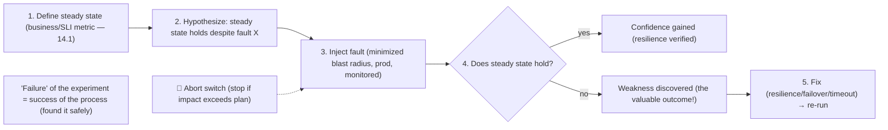
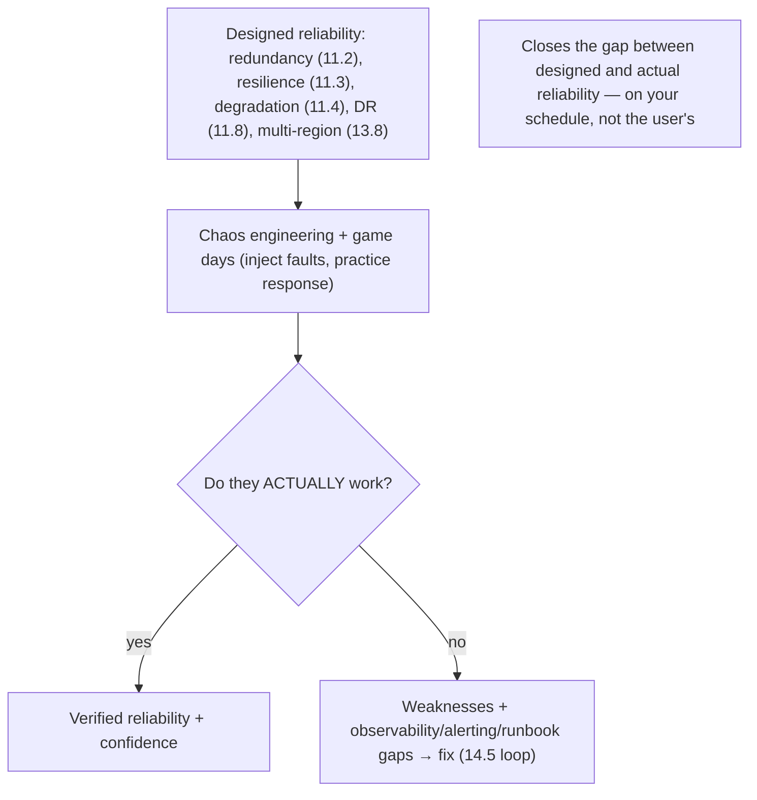

# Lesson 14.8 — Chaos Engineering and Fault Injection

> Part 14: Reliability Engineering (SRE) · Difficulty: 🔴
>
> **Prerequisites:** [11.1 Failure Models/Fallacies], [11.3 Resilience Patterns], [11.8 DR (test it)], [14.1 SLO/Error Budget], [14.5 Incident Response].
> **Unlocks:** [Part 15 Security (adversarial testing)], [Part 16 Observability], [Part 20 Capstone (production readiness)].

---

## 1. Learning Objectives

After this lesson you will be able to:

- Explain **chaos engineering** — deliberately injecting failures into (production) systems to **discover weaknesses before they cause outages** — and why it's proactive, not reckless.
- Describe the **experiment method**: form a **hypothesis** about steady-state behavior, inject a fault, and verify the system holds (or learn where it doesn't).
- Apply the safety principles: **minimize blast radius**, run in production **carefully**, have a **stop/abort**, and use the **error budget** (14.1) to bound experiments.
- Enumerate common **fault-injection** types (instance kill, latency, network partition, resource exhaustion, dependency failure) and how they validate resilience (11.3) and DR (11.8).
- Explain **game days** and how chaos engineering validates both **systems** and **incident-response processes** (14.5).

---

## 2. Motivation — Test your assumptions before reality does

You've built redundancy (11.2), resilience patterns (11.3), failover (13.8), and disaster recovery (11.8) — but **do they actually work?** The uncomfortable truth is that reliability mechanisms are full of **untested assumptions**: "the circuit breaker will trip," "failover is automatic and fast," "we degrade gracefully when the recommendation service is down," "the retry has a sensible timeout." These assumptions are usually **verified only during a real incident** — the worst possible time to discover that failover doesn't actually work, the "graceful" degradation cascades, or the runbook is wrong (11.8's core warning: **untested DR ≈ no DR**).

**Chaos engineering** flips this: instead of waiting for failures to happen **to** you at 3 a.m., you **deliberately inject them** — on your schedule, with monitoring ready, and a way to stop — to **discover weaknesses proactively**, in a controlled way, **before** they cause a real outage. It treats reliability as an **empirical, experimental** property: you don't *assume* the system is resilient, you **test the hypothesis** by breaking things and observing. Done well, it's not reckless "randomly breaking production" — it's **disciplined experimentation** with a hypothesis, a **minimized blast radius**, monitoring, and an **abort switch**, often bounded by the **error budget** (14.1). It also validates the **human** side — **game days** exercise the incident-response process (14.5) so it works under real pressure. This lesson develops chaos engineering, the experiment method, safety, fault types, and game days — the discipline of finding your weaknesses before your users do.

---

## 3. Theory — From first principles

### 3.1 What chaos engineering is (and isn't)

`[CS]` **Chaos engineering** = the discipline of **experimenting on a system by deliberately injecting failures** to **build confidence in its ability to withstand turbulent conditions in production** `[CS]`:
- **The core idea:** reliability mechanisms (11.2/11.3/11.8) contain **untested assumptions**; the only way to *know* they work is to **test them** under real (or realistic) failure — proactively, not during an incident.
- **It is NOT** "randomly breaking production for fun." It's **disciplined, hypothesis-driven experimentation** with **safety controls** (§3.3) — the scientific method applied to resilience.
- **The mindset shift** `[BP]`: from "we *hope* it's resilient" to "we *verify* it's resilient" — treating resilience as an **empirical property to be tested**, echoing 11.8's "**test your DR**" and 11.1's "**assume failure is the steady state**." **Break it on purpose, on your schedule, so it doesn't break by surprise.**

### 3.2 The experiment method

`[CS]` A chaos experiment follows a **scientific method** `[CS]`:
1. **Define steady state:** a measurable indicator of **normal, healthy behavior** — ideally a **business/SLI metric** (14.1/14.3: throughput, success rate, latency), not internal metrics. "Steady state = 99.9% success at p99 < 200ms."
2. **Hypothesize:** predict that the steady state **will hold** despite a specific fault — "**if** we kill one instance, **then** the system continues serving at steady state (redundancy + LB handle it)."
3. **Inject the fault** (§3.4): introduce the real-world event (kill an instance, add latency, drop a dependency) — ideally in **production** (§3.3), with **minimized blast radius**.
4. **Observe + compare:** does the steady state hold? **Confirm** the hypothesis (confidence gained) or **disprove** it (a **weakness discovered** — the valuable outcome).
5. **Learn + fix:** a disproven hypothesis reveals a **latent weakness** → fix it (add resilience — 11.3, fix failover — 11.2, tune timeouts) → the system is now stronger; re-run to verify.
- `[BP]` **Crucially, "failure" of the experiment is a *success* of the process** — you found a weakness in a controlled setting instead of during a real outage. The goal is **learning**, not "passing."

### 3.3 Safety — how to not cause the outage you're preventing

`[BP]` Chaos engineering is **controlled**, not reckless — safety principles `[BP]`:
- **Minimize the blast radius:** start **small** — one instance, a small % of traffic, one region — and **expand gradually** as confidence grows. Never start by breaking everything.
- **Run in production — carefully:** production is where the **real** conditions (traffic, data, dependencies, config) are, so weaknesses there are the ones that matter — but do it with **minimized blast radius + monitoring + a stop button** (many teams start in **staging/pre-prod** to build confidence first).
- **Have an abort/stop:** a **big red button** to **immediately halt** the experiment and restore normal if the system degrades beyond the acceptable — bounded, reversible.
- **Monitor closely:** watch the steady-state metrics + golden signals (14.3) in real time; if impact exceeds the plan, **abort**.
- **Bound by the error budget** (14.1): chaos experiments **spend error budget** (they cause real, if small, impact) — run them **when you have budget**, and stop if the budget gets low. The budget makes the risk **explicit and bounded**.
- **Communicate + schedule:** announce experiments (esp. early on) so responders aren't confused; run during **business hours with people watching** (not 3 a.m.).
- `[BP]` **The paradox resolved:** you accept a **small, controlled, monitored, abortable** amount of harm now to **prevent a large, uncontrolled, surprise** outage later — a good trade (like a vaccine: a controlled small exposure builds immunity).

### 3.4 Fault-injection types

`[CS]` Common failures to inject, mapping to the failure models (11.1) and the fallacies (11.1) `[CS]`:
- **Instance/process failure:** kill instances/pods (the classic — "Chaos Monkey") → tests **redundancy + self-healing** (11.2/13.3). Randomly terminating instances forces engineers to build services that tolerate it.
- **Latency injection:** add delay to responses/network → tests **timeouts, retries, circuit breakers** (11.3) and latency-sensitivity (the "latency is zero" fallacy — 11.1/Part 17).
- **Network faults:** drop/corrupt packets, **partition** the network (8.1.1), block a dependency → tests partition tolerance (CAP — 10.7), dependency isolation (bulkheads — 11.3).
- **Dependency failure:** make a downstream service/DB **fail or become unavailable** → tests **graceful degradation + fallbacks** (11.4), circuit breakers (11.3).
- **Resource exhaustion:** consume CPU/memory/disk/connections → tests behavior under **saturation** (14.3), limits (13.2 cgroups), load shedding (11.4).
- **Region/zone failure:** take down a zone/region → tests **multi-AZ/multi-region failover + DR** (13.8/11.8).
- `[BP]` **Modern chaos** injects at the **service-mesh** layer (12.7 — latency/error injection without code changes) and via dedicated **chaos platforms** — targeted, safe, observable fault injection.

### 3.5 Game days — exercising systems *and* people

`[CS]` A **game day** is a **planned, scheduled chaos exercise** where the team **injects failures and practices responding** `[CS]`:
- It validates **both**: the **system's** resilience (does it withstand the fault?) **and** the **incident-response process** (14.5) — do the runbooks work, does the on-call know what to do, is the incident command (14.5) effective, is monitoring/alerting (14.3/14.4) adequate?
- **DR drills / failover tests** (11.8) are game days focused on disaster recovery — the direct answer to 11.8's "**you must test your DR**."
- `[BP]` **Why practice the humans:** incident response (14.5) is a **skill** that decays without practice; a game day surfaces gaps (a wrong runbook, a missing alert, an unclear escalation) in a **controlled** setting rather than during a real 3 a.m. sev-1. It builds **muscle memory** and **confidence**.
- Game days also reveal **observability gaps** (14.3 — "we couldn't tell what was happening") and **alerting gaps** (14.4 — "it didn't page us") — feeding improvements back (14.5 loop).

### 3.6 Where chaos fits in the reliability program

`[BP]` Chaos engineering is the **validation layer** for everything in Part 11/13/14 `[BP]`:
- It **verifies** redundancy/failover (11.2/13.8), resilience patterns (11.3), graceful degradation (11.4), and DR (11.8) actually work — closing the gap between **designed** and **actual** reliability.
- It **feeds** the improvement loop: weaknesses found → fixes → stronger system (like postmortem action items — 14.5, but found **proactively** rather than after an outage).
- It **requires maturity** (like the rest of SRE — "you must be this tall"): you need **good observability** (14.3) to see experiment impact, **resilience** already built (11.3) to have something to test, **error budgets** (14.1) to bound risk, and **incident response** (14.5) as the safety net. **Don't run chaos on a fragile, unobservable system** — build the foundations first, then validate them with chaos.
- `[BP]` **Automate + make it continuous** `[EMERGING]`: mature programs run **continuous/automated** chaos (small experiments constantly) so resilience is **continuously verified**, not a one-off — resilience as a **regression test**. `[EMERGING]`

### 3.7 Putting it together — the chaos discipline

`[BP]` A responsible chaos program:
- **Build the foundations first** (§3.6): resilience (11.3), observability (14.3), incident response (14.5), error budgets (14.1).
- **Experiment scientifically** (§3.2): steady-state hypothesis → inject → observe → learn/fix → re-verify.
- **Safety always** (§3.3): minimize blast radius, monitor, abort switch, error-budget-bounded, communicate, business-hours.
- **Inject realistic faults** (§3.4): instance kill, latency, partition, dependency failure, resource exhaustion, zone/region loss — via mesh (12.7) / chaos tooling.
- **Run game days** (§3.5) to validate systems **and** incident-response people/process (14.5), including **DR drills** (11.8).
- **Feed learning back** (§3.6): fix discovered weaknesses; improve observability/alerting/runbooks; make it **continuous/automated**.
- `[BP]` The result: reliability becomes an **empirically-verified** property, not a hopeful assumption — weaknesses are found **on your schedule, controlled**, instead of by users during a real outage. **The best time to fail is when you're watching and ready.**

---

## 4. Visual Intuition

### The chaos experiment method

### Chaos as the validation layer

---

## 5. Real-World Analogy

Think of **fire drills and vaccination** — deliberately inducing a controlled version of the bad thing to be ready for the real one.

- **Fire drill = game day:** a building doesn't wait for a **real fire** to discover that the **exits are blocked, the alarm doesn't reach the third floor, and nobody knows the evacuation route**. It runs **scheduled fire drills** — deliberately triggering the alarm and practicing evacuation — to find those problems **while everyone is safe**. It validates **both** the **building** (do the alarms/exits/sprinklers work?) and the **people** (do they know what to do?) — exactly like chaos engineering validating both the **system's resilience** and the **incident-response team** (14.5).
- **Vaccination = fault injection:** a vaccine deliberately introduces a **small, controlled, safe** version of a pathogen so the body **builds immunity** — accepting a **tiny, monitored** exposure now to **prevent a catastrophic infection later**. Chaos engineering is the same trade: **inject a small, controlled failure** (minimized blast radius, abort ready) so the system's weaknesses are found and hardened, preventing a **large, uncontrolled** outage.
- **The scientific method:** a good drill has a **hypothesis** — "we believe everyone can evacuate in under 3 minutes" — and you **measure** whether that holds. If the drill reveals it takes **8 minutes because a stairwell was locked**, the drill was a **success** (you found the problem safely), even though the "hypothesis failed." Discovering the locked stairwell in a **drill** is infinitely better than during a **real fire**.
- **Safety = a controlled drill, not real arson:** you don't validate fire safety by **actually burning the building down**. You use a **controlled trigger**, **watch closely**, and can **call off the drill** if someone gets hurt (the abort switch). And you don't run drills so constantly that you exhaust everyone (bounded by the "budget"). The whole point is **controlled** exposure.
- **Foundations first:** you don't run a fire drill in a building **with no alarms, no exits, and no trained staff** — you'd just cause panic. First **build the fire-safety infrastructure** (resilience, observability, incident response), **then** drill to verify it works.

---

## 6. Industry Example

- **Netflix Chaos Monkey / Simian Army** `[CONV]`: the pioneering practice — randomly terminating production instances to force engineers to build failure-tolerant services (§3.1/3.4). *(Representative.)*
- **Principles of Chaos Engineering** `[CONV]`: the steady-state-hypothesis + minimize-blast-radius + run-in-production method (§3.2/3.3). *(Representative.)*
- **Game days / DR drills** `[CONV]`: scheduled failure exercises validating systems + incident response + DR (§3.5, 11.8/14.5). *(Representative.)*
- **Service-mesh fault injection** `[CONV]`: injecting latency/errors via the mesh (12.7) without code changes (§3.4). *(Representative.)*
- **Chaos platforms & continuous chaos** `[EMERGING]`: dedicated tooling (e.g., Gremlin/Chaos Mesh-style) and automated continuous experiments (§3.6). *(Representative.)*

---

## 7. Implementation Details

- **Build foundations first** (§3.6): resilience (11.3), observability (14.3), incident response (14.5), error budgets (14.1) — don't chaos-test a fragile/unobservable system.
- **Run scientific experiments** (§3.2): define **steady state** as a business/SLI metric (14.1); form a **hypothesis**; inject; observe; **fix** discovered weaknesses; re-verify.
- **Safety controls** (§3.3): **minimize blast radius** (one instance/small %/one region, expand gradually); **monitor** steady-state + golden signals; **abort switch**; **error-budget-bound** the experiments; **communicate + schedule** in business hours; start in staging, graduate to prod.
- **Inject realistic faults** (§3.4): instance kill, latency, network partition, dependency failure, resource exhaustion, zone/region loss — via **service mesh** (12.7) / chaos tooling.
- **Run game days** (§3.5): exercise systems **and** the incident-response process (14.5); include **DR drills** (11.8); surface observability/alerting/runbook gaps.
- **Feed learning back** (§3.6, 14.5): fix weaknesses; improve alerts/runbooks/resilience; move toward **continuous/automated** chaos (resilience regression testing).

---

## 8. Advantages

- **Finds weaknesses proactively** — before real outages, on your schedule (§3.1/3.2).
- **Verifies reliability mechanisms** — closes the designed-vs-actual gap (redundancy/failover/degradation/DR) (§3.6).
- **Validates incident response** — game days exercise people + process (§3.5, 14.5).
- **Surfaces observability/alerting gaps** — "we couldn't see / weren't paged" (§3.5, 14.3/14.4).
- **Builds confidence** — evidence-based trust that the system withstands failure (§3.1).
- **Controlled risk** — small, monitored, abortable, budget-bounded (§3.3).

---

## 9. Disadvantages / costs

- **Real (if small) risk** — experiments cause real impact; a mistake can cause an outage (mitigated by safety controls — §3.3).
- **Requires maturity** — needs observability, resilience, incident response, error budgets in place first (§3.6).
- **Cultural buy-in** — deliberately injecting failure needs organizational trust/support (§3.3).
- **Effort + tooling** — designing safe experiments, chaos platforms, game-day coordination (§3.3/3.5).
- **Spends error budget** — experiments consume budget; must be run when budget allows (§3.3, 14.1).
- **Can be misused** — reckless "chaos" without hypothesis/safety causes real outages (§3.1/3.3).

---

## 10. When NOT to / cautions

- **Don't run chaos on a fragile/unobservable system** — build resilience + observability + incident response first (§3.6).
- **Don't inject without a hypothesis + steady-state metric** — that's just breaking things, not experimenting (§3.2).
- **Don't skip the blast-radius minimization or abort switch** — never start by breaking everything (§3.3).
- **Don't run chaos when the error budget is exhausted** — you can't afford the impact (§3.3, 14.1).
- **Don't chaos-test without monitoring/people watching** — run in business hours, communicated (§3.3).
- **Don't treat a discovered weakness as failure** — it's the valuable outcome; fix it (§3.2).

---

## 11. Common Mistakes

1. **Reckless chaos** — breaking prod without hypothesis, blast-radius control, or abort → real outage (§3.1/3.3).
2. **No steady-state metric** — can't tell if the system held (§3.2).
3. **Chaos before foundations** — testing a fragile/unobservable system → chaos, not learning (§3.6).
4. **No blast-radius limit** — starting big → large impact (§3.3).
5. **No abort switch / monitoring** — can't stop when it goes wrong (§3.3).
6. **Ignoring the error budget** — running experiments that blow the budget (§3.3, 14.1).
7. **Only testing systems, not people** — skipping game days → untested incident response (§3.5, 14.5).
8. **Not fixing what you find** — discovering weaknesses but not acting → wasted (§3.2).

---

## 12. Interview Questions

**🟢 Easy**
- What is chaos engineering, and why is it proactive rather than reckless?
- What is a game day?

**🟡 Medium**
- Describe the chaos experiment method (steady state → hypothesis → inject → observe → learn).
- What safety controls make chaos engineering responsible (blast radius, abort, monitoring, error budget)?

**🔴 Hard**
- Why is a "failed" chaos experiment actually a success? How does chaos close the gap between designed and actual reliability?
- What fault types do you inject, and which resilience mechanisms (11.2/11.3/11.4/11.8) does each validate?

**⚫ Staff+**
- Design a chaos-engineering program from scratch: prerequisites (observability/resilience/incident-response/error-budget), experiment method, safety controls, fault types, game days (systems + people), and how you'd make it continuous — and when an org isn't ready for it.
- How does chaos engineering integrate with the rest of SRE (SLOs/error budgets — 14.1, observability — 14.3, alerting — 14.4, incident response — 14.5) and with DR (11.8)? Design the validation loop.

---

## 13. Production Pitfalls

- **Chaos caused a real outage:** an experiment with no blast-radius limit / abort switch took down production (§3.3) — the thing it was meant to prevent.
- **Assumed failover worked, it didn't:** a game day / real region loss revealed failover was misconfigured and never actually tested (§3.5, 11.8/13.8).
- **"Graceful" degradation cascaded:** a dependency-failure experiment revealed the fallback actually caused a cascade (§3.4, 11.3/11.4).
- **Observability gap exposed:** during a chaos experiment the team **couldn't tell what was happening** — no relevant telemetry (§3.5, 14.3).
- **Alerting gap exposed:** the injected failure **didn't page anyone** (§3.5, 14.4).
- **Runbook wrong:** a game day showed the documented response steps were outdated/incorrect (§3.5, 14.5).
- **Budget blown by chaos:** experiments run with no budget headroom pushed the SLO into breach (§3.3, 14.1).

---

## 14. Optimization Techniques

- **Steady-state hypothesis on business/SLI metrics** (14.1/14.3) for meaningful experiments (§3.2).
- **Minimize blast radius + gradual expansion + abort switch + monitoring** for safe experimentation (§3.3).
- **Error-budget-bounded scheduling** to make risk explicit and bounded (§3.3, 14.1).
- **Mesh-based fault injection** (12.7) for targeted, code-free latency/error injection (§3.4).
- **Game days for systems + people** (incident response — 14.5, DR — 11.8) to build muscle memory (§3.5).
- **Feed findings into the improvement loop** (fix resilience/alerts/runbooks/observability) (§3.6, 14.5).
- **Continuous/automated chaos** as a resilience regression test once mature (§3.6). `[EMERGING]`

---

## 15. Summary

You've built redundancy (11.2), resilience patterns (11.3), degradation (11.4), failover (13.8), and DR (11.8) — but **do they actually work?** These mechanisms are full of **untested assumptions** usually verified only during a **real incident** (the worst time). **Chaos engineering** flips this: **deliberately inject failures** — on your schedule, monitored, with an abort — to **discover weaknesses proactively, before they cause a real outage**, treating resilience as an **empirical property to test** rather than assume (echoing 11.8's "test your DR" and 11.1's "assume failure is the steady state"). It is **not** reckless "randomly breaking production" — it's **disciplined, hypothesis-driven experimentation**: (1) **define steady state** (a business/SLI metric — 14.1/14.3), (2) **hypothesize** the steady state **holds** despite a fault ("if we kill one instance, the system keeps serving"), (3) **inject the fault** (ideally in production, minimized blast radius), (4) **observe** whether steady state holds — **confirming** confidence or **disproving** it (a **weakness discovered — the valuable outcome**), and (5) **fix and re-verify** — where a "failed" experiment is a **success of the process** (you found it safely, not during an outage). **Safety** makes it responsible: **minimize the blast radius** (start with one instance/small %/one region, expand gradually), **run in production carefully** (real conditions matter — but with monitoring + a **big-red-button abort**; start in staging to build confidence), **bound experiments by the error budget** (14.1 — they spend real, small impact), **communicate + schedule in business hours with people watching** — the vaccine trade: accept a **small, controlled, monitored, abortable** harm now to prevent a **large, uncontrolled, surprise** outage later. Common **fault injections** map to failure models (11.1): **instance/process kill** (Chaos Monkey — tests redundancy/self-healing — 11.2/13.3), **latency** (tests timeouts/retries/breakers — 11.3), **network partition** (8.1.1 — tests CAP/isolation), **dependency failure** (tests degradation/fallbacks — 11.4), **resource exhaustion** (tests saturation/limits/shedding), and **zone/region loss** (tests multi-AZ/region failover + DR — 13.8/11.8) — increasingly via **service-mesh fault injection** (12.7) and chaos platforms. **Game days** are scheduled chaos exercises that validate **both the system** (does it withstand the fault?) **and the incident-response process** (14.5 — do runbooks/on-call/incident-command/alerting work?) — including **DR drills** (11.8) — building **muscle memory** and surfacing **observability/alerting/runbook gaps** in a controlled setting. Chaos is the **validation layer** for the whole reliability program — it **verifies** designed reliability actually works and **feeds** the improvement loop — but **requires maturity** (observability — 14.3, resilience — 11.3, incident response — 14.5, error budgets — 14.1 as prerequisites; don't chaos-test a fragile, unobservable system), and mature programs make it **continuous/automated** (resilience as a regression test). **The best time to fail is when you're watching and ready** — chaos engineering ensures you find your weaknesses on your schedule, not your users'.

---

## 16. Revision Notes (flashcard-ready)

- **Q:** Chaos engineering? **A:** Deliberately injecting failures to discover weaknesses proactively, before real outages — resilience as an empirical property to test.
- **Q:** Is it reckless? **A:** No — disciplined, hypothesis-driven experimentation with safety controls (blast radius, abort, monitoring, budget).
- **Q:** The experiment method? **A:** Define steady state → hypothesize it holds despite fault → inject → observe → learn/fix → re-verify.
- **Q:** Steady state? **A:** A measurable normal-behavior metric — ideally a business/SLI metric (success rate, latency).
- **Q:** Why is a "failed" experiment a success? **A:** You discovered a weakness safely, on your schedule — not during a real outage.
- **Q:** Safety controls? **A:** Minimize blast radius, run in prod carefully, abort switch, monitor, error-budget-bound, communicate, business hours.
- **Q:** Common fault types? **A:** Instance kill, latency, network partition, dependency failure, resource exhaustion, zone/region loss.
- **Q:** Game day? **A:** Scheduled chaos exercise validating BOTH the system's resilience AND the incident-response process (incl. DR drills).
- **Q:** Prerequisites? **A:** Observability (14.3), resilience (11.3), incident response (14.5), error budgets (14.1) — don't chaos-test a fragile system.
- **Q:** Chaos's role? **A:** The validation layer — closes the gap between designed and actual reliability; feeds the improvement loop.

---

## 17. Further Reading + Knowledge-Graph Links

**Foundations (in-platform):**
- **[11.1 Failure Models/Fallacies]** — the failures you inject; assume failure is the steady state.
- **[11.3 Resilience Patterns]** — what chaos validates (timeout/retry/breaker/bulkhead).
- **[11.8 DR (test it)]** — DR drills as game days.
- **[14.1 Error Budget]** — bounds chaos experiments.
- **[14.5 Incident Response]** — game days exercise the response process.

**Unlocks / next:**
- **[Part 15 Security]** — adversarial/red-team testing (chaos for security).
- **[Part 16 Observability]** — the telemetry chaos experiments depend on.
- **[Part 20 Capstone]** — production-readiness incl. chaos/game days.

**External (canonical):**
- Basiri et al., "Chaos Engineering" & principlesofchaos.org. *(Representative.)*
- Rosenthal & Jones, *Chaos Engineering* (O'Reilly). *(Representative.)*
- Netflix Chaos Monkey / Simian Army writeups. *(Representative.)*

> **Knowledge-graph:** `11.2/11.3/11.4/11.8 designed reliability` + `14.1 error budget` + `14.5 incident response` → **`14.8 chaos engineering + game days`** (hypothesis-driven fault injection, validate systems + people) → verified reliability + improvement loop.
