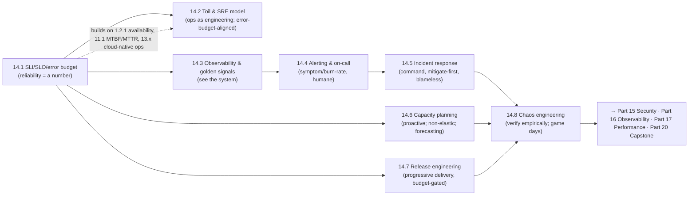

# Part 14 — Reliability Engineering (SRE) ✅ COMPLETE

Operating systems to a defined reliability target — unified by one idea: **make reliability quantitative (SLIs/SLOs/error budgets), run operations as engineering (eliminate toil, automate), see the system (observability/golden signals), alert and respond humanely (symptom/burn-rate alerts, incident command, blameless postmortems), plan capacity proactively, ship change safely and often (progressive delivery), and verify it all empirically (chaos) — turning "is it reliable enough?" from an argument into a number, and inevitable failures into fast recoveries and lasting learning.**

---

## Lessons

| # | Lesson | Core idea |
|---|--------|-----------|
| 14.1 | [SLI/SLO/SLA & Error Budget](14.1-sli-slo-sla-error-budget.md) | SLI (measure) → SLO (internal target) → SLA (external contract); 100% is the wrong target; error budget = 1−SLO is a resource to spend; error-budget policy turns reliability-vs-velocity into arithmetic |
| 14.2 | [Toil & the SRE Model](14.2-toil-sre-operating-model.md) | Toil = manual/repetitive/automatable/no-value work that scales with the system; ≤50% toil cap; automate/eliminate yourself out of a job; ops as engineering → sub-linear scaling; error-budget-aligned dev/ops |
| 14.3 | [Monitoring/Observability & Golden Signals](14.3-monitoring-observability-golden-signals.md) | Monitoring = known-unknowns (predefined signals); observability = unknown-unknowns (ask arbitrary questions); four golden signals (latency/traffic/errors/saturation); RED+USE; symptom vs cause; three pillars |
| 14.4 | [Alerting & On-Call](14.4-alerting-on-call.md) | Alert fatigue is corrosive; every page urgent+actionable+real-impact; symptom + SLO burn-rate alerting (not cause spam); page/ticket/notification tiers; humane sustainable on-call + runbooks |
| 14.5 | [Incident Response & Postmortems](14.5-incident-response-postmortems.md) | Minimize MTTR via structure; Incident Command (IC/Ops/Comms/Scribe); mitigate before resolve (stop the bleeding); blameless postmortems (systems not people) with tracked action items |
| 14.6 | [Capacity Planning & Forecasting](14.6-capacity-planning-demand-forecasting.md) | Enough capacity at SLO, cost-effectively, ahead of time; organic + inorganic forecasting; load-test + headroom; autoscaling ≠ enough (non-elastic DB, quota, lead times); under vs over-provision |
| 14.7 | [Release Engineering & Progressive Delivery](14.7-release-engineering-progressive-delivery.md) | Change is the top outage cause; reproducible/automated/safe releases; CI/CD; progressive delivery (gradual/controlled/observable/reversible canary, error-budget-gated); small+frequent = faster AND safer (DORA) |
| 14.8 | [Chaos Engineering & Fault Injection](14.8-chaos-engineering-fault-injection.md) | Deliberately inject failures to find weaknesses before outages; hypothesis → inject → observe → fix; minimize blast radius + abort + budget-bound; game days validate systems AND incident response |

---

## The through-line of Part 14

**One sentence:** Make reliability quantitative and negotiable with SLIs/SLOs/error budgets (14.1); run operations as an engineering discipline that eliminates toil and scales sub-linearly (14.2); see the system with observability and the four golden signals (14.3); alert on symptoms/burn-rate without burning people out and staff on-call humanely (14.4); respond to inevitable incidents with structured command, mitigate-first, and blameless postmortems (14.5); plan capacity proactively for organic + inorganic demand beyond what autoscaling covers (14.6); ship change — the top cause of outages — safely and often via progressive delivery gated on metrics and the error budget (14.7); and verify the whole reliability program empirically with chaos engineering and game days (14.8).

---

## The key decisions Part 14 equips you to make

- **How reliable, and how do we know?** SLIs (user-centric, percentiles) → SLOs (target + window) → SLA (looser); error budget = 1−SLO; error-budget policy gates launches. (14.1)
- **How do we operate sustainably?** Treat ops as engineering; cap toil at 50%; automate/eliminate; align dev/ops via the error budget. (14.2)
- **What do we measure?** Golden signals (latency/traffic/errors/saturation) as SLIs + observability for the unknown-unknowns; symptom-based. (14.3)
- **When do we wake someone?** Symptom + SLO burn-rate alerts only (urgent+actionable+impact); page/ticket/notification tiers; humane on-call + runbooks. (14.4)
- **How do we handle incidents?** Incident command + roles; mitigate before resolve; blameless postmortems with tracked action items → low MTTR. (14.5)
- **Will we have enough capacity?** Forecast organic + inorganic; load-test + headroom; provision non-elastic tiers + quota ahead; autoscaling isn't enough. (14.6)
- **How do we ship safely?** CI/CD + progressive delivery (metric-gated canary + rollback) + error-budget gating; small + frequent + reversible. (14.7)
- **Does any of it actually work?** Chaos engineering (hypothesis-driven, bounded fault injection) + game days validate systems AND people. (14.8)

---

## Self-check before Part 15

Without notes, can you:
1. Define SLI/SLO/SLA, explain why 100% is wrong, compute an error budget, and describe an error-budget policy?
2. Define toil, explain the 50% cap and sub-linear scaling, and how the SRE model differs from traditional ops?
3. Distinguish monitoring from observability, name the four golden signals, and explain symptom- vs cause-based monitoring?
4. Design symptom/burn-rate alerting that avoids alert fatigue, and a humane on-call rotation?
5. Run a structured incident (command roles, mitigate-first) and a blameless postmortem, and explain why blamelessness matters?
6. Forecast organic + inorganic demand, turn it into a capacity plan with headroom, and explain why autoscaling isn't enough?
7. Explain release engineering + progressive delivery + error-budget gating, and why small/frequent releases are safer (DORA)?
8. Design a safe chaos experiment (hypothesis, blast radius, abort, budget) and a game day, and explain what each validates?

If any are shaky, revisit that lesson's Revision Notes. Part 15 (Security) builds on the operational discipline here — threat modeling, zero-trust, secrets, supply chain (14.7), and rate-limiting as a security control; Part 16 (Observability) goes deep on the metrics/logs/traces (14.3) that power SRE; Part 17 (Performance) builds on RED/USE, saturation, and capacity (14.3/14.6).

---

*Reference asset for this part: `../../reference/sre-slo-error-budget-cheatsheet.md`.*
