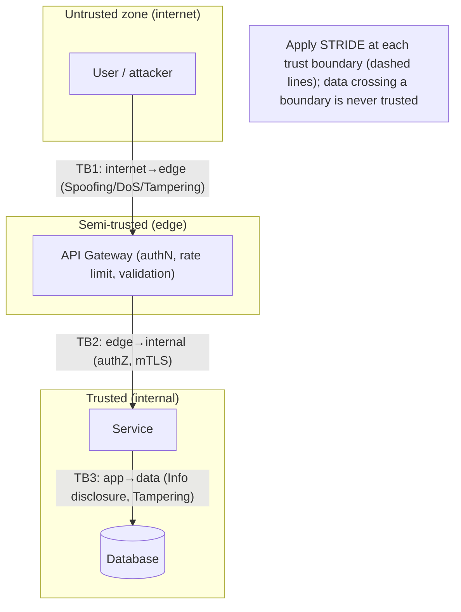
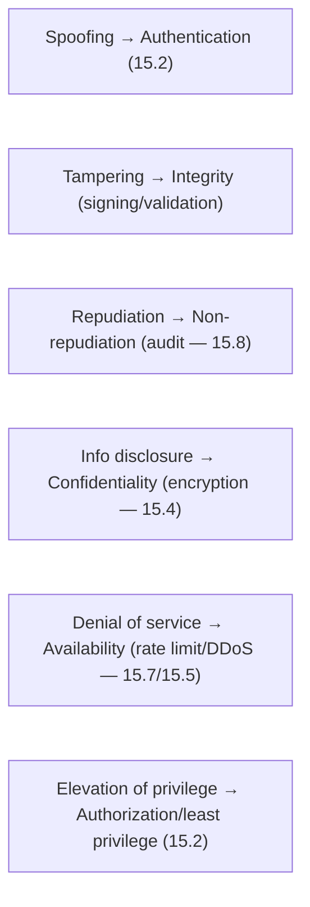

# Lesson 15.1 — Threat Modeling (STRIDE), Trust Boundaries, Attack Surface

> Part 15: Security · Difficulty: 🟡🔴
>
> **Prerequisites:** [1.2.3 Security/Compliance/Cost], [2.1.1 Coupling/Boundaries], [8.1.1 Untrusted Networks], [12.3 Communication].
> **Unlocks:** [15.2 AuthN/AuthZ], [15.5 Network Security/Zero-Trust], [15.6 OWASP/Vulnerabilities], [Part 20 Capstone].

---

## 1. Learning Objectives

After this lesson you will be able to:

- Explain **threat modeling** — a **structured process to identify, assess, and mitigate threats** during design — and why security must be **designed in, not bolted on**.
- Apply **STRIDE** (Spoofing, Tampering, Repudiation, Information disclosure, Denial of service, Elevation of privilege) to systematically enumerate threats.
- Identify **trust boundaries** (where data crosses between components of different trust levels) and why they're where threats concentrate.
- Analyze and **minimize the attack surface** (the sum of points where an attacker can interact with the system).
- Apply foundational security principles: **least privilege, defense in depth, fail secure, and assume breach**.

---

## 2. Motivation — Security is a design property, not a feature

Security cannot be sprinkled on at the end. A system whose architecture ignores security — trusting inputs, exposing internal services, granting broad permissions, storing secrets carelessly — **cannot be made secure by adding a firewall later**. Vulnerabilities are **designed in**, so security must be **designed in** too — which is why **threat modeling** belongs in the **design phase** (1.2.3, alongside the other quality attributes), not the audit phase. The discipline asks, systematically and early: *What are we building? What can go wrong? What are we going to do about it? Did we do a good job?*

The core mental shift is to **think like an attacker**. Every place where an attacker can **interact** with your system (an API, a login form, a file upload, a message queue, an admin panel) is part of the **attack surface** — and every place where data **crosses from a less-trusted zone to a more-trusted one** (the internet → your API, one service → another — 12.3, user input → your database) is a **trust boundary** where an attacker will probe. **STRIDE** gives a systematic checklist of the *kinds* of threats to consider at each of these points, so you don't rely on remembering every attack. And a handful of **foundational principles** — **least privilege, defense in depth, fail secure, assume breach** — shape resilient designs. This lesson develops threat modeling, STRIDE, trust boundaries, attack surface, and the core principles as the security foundation the rest of Part 15 builds on.

---

## 3. Theory — From first principles

### 3.1 Threat modeling — the process

`[CS]` **Threat modeling** = a **structured process, done during design, to identify potential threats, assess their risk, and decide mitigations** `[CS]`. The canonical **four questions** (Shostack) `[BP]`:
1. **What are we building?** — model the system: components, data flows, and **trust boundaries** (§3.3) — often a **data-flow diagram (DFD)**.
2. **What can go wrong?** — enumerate threats systematically (via **STRIDE** — §3.2) at each element/boundary.
3. **What are we going to do about it?** — decide **mitigations** for each significant threat (mitigate / eliminate / transfer / accept — risk-based).
4. **Did we do a good job?** — validate the model and mitigations; iterate.
- `[BP]` **Why during design:** vulnerabilities are architectural; finding them **on paper is orders of magnitude cheaper** than after they're built/exploited (shift-left). Threat modeling makes security a **first-class design activity** (1.2.3), not an afterthought.
- **Risk-based:** you can't fix everything — **prioritize** by likelihood × impact (§3.6), focusing effort on the highest-risk threats.

### 3.2 STRIDE — a threat taxonomy

`[CS]` **STRIDE** (Microsoft) is a mnemonic for **six categories of threats**, each the violation of a **security property** — a systematic checklist so you don't miss threat types `[CS]`:

| Threat | Violates | Meaning | Example mitigation |
|---|---|---|---|
| **S**poofing | Authentication | Pretending to be someone/something else | Strong **authentication** (15.2), mTLS (15.5) |
| **T**ampering | Integrity | Unauthorized modification of data/code | **Integrity** checks, signing (15.3), input validation (15.6) |
| **R**epudiation | Non-repudiation | Denying an action was performed | **Audit logging** (15.8), signed records |
| **I**nformation disclosure | Confidentiality | Exposing data to unauthorized parties | **Encryption** (15.4), access control (15.2) |
| **D**enial of service | Availability | Making the system unavailable | **Rate limiting** (15.7), DDoS mitigation (15.5) |
| **E**levation of privilege | Authorization | Gaining higher access than granted | **Authorization** / least privilege (15.2/§3.5) |

- `[BP]` **Use:** for each component/data-flow/trust-boundary in the model (§3.1), ask "**which STRIDE threats apply here?**" and design a mitigation for each significant one. STRIDE maps directly to the **CIA triad + AAA** (Confidentiality/Integrity/Availability + Authentication/Authorization/Auditing) — the properties you're protecting.
- Alternatives/complements: **PASTA, LINDDUN** (privacy), attack trees — but STRIDE is the common starting point.

### 3.3 Trust boundaries — where threats concentrate

`[CS]` A **trust boundary** is a point where **data or control flows between zones of different trust levels** `[CS]`:
- Examples: **internet → your API** (untrusted → semi-trusted), **user → application** (input crosses in), **service → service** (12.3 — even internal calls, in zero-trust — 15.5), **application → database**, **your code → a third-party dependency/API**, **user space → kernel**, **outside the process → inside**.
- `[BP]` **Why they matter:** threats **concentrate at trust boundaries** — an attacker's goal is to **cross** a boundary (get untrusted data/actions treated as trusted). So **every trust boundary is where you must validate, authenticate, authorize, and sanitize** (§3.2 mitigations). **Data crossing a trust boundary must never be trusted** — validate it (15.6), authenticate its source (15.2), and check authorization (15.2).
- **In the DFD** (§3.1), you draw trust boundaries as lines; every data flow **crossing** a line is a place to apply STRIDE and mitigations. This connects to **8.1.1** (the network is untrusted) and **12.3** (every inter-service call is a boundary) — and is the basis of **zero-trust** (15.5: *no* implicit trust, even inside).

### 3.4 Attack surface — minimize it

`[CS]` The **attack surface** = the **sum of all points where an attacker can attempt to interact with (enter data into / extract data from) the system** `[CS]`:
- Includes: **exposed endpoints/APIs**, **open ports**, **input fields/forms/uploads**, **UIs**, **third-party integrations**, **admin interfaces**, **message queues**, **dependencies**, and **人 (human)** surfaces (phishing/social engineering).
- `[BP]` **The principle: minimize the attack surface** — **fewer points of interaction = fewer opportunities to attack** `[BP]`:
  - **Don't expose what you don't need** — close unused ports, remove unused endpoints/features, don't expose internal services (put them behind a gateway — 12.6 / not internet-facing).
  - **Reduce inputs** — accept only what's needed; validate strictly (15.6).
  - **Remove unnecessary dependencies/software** (each is potential attack surface — supply chain — 14.7/§3.6).
  - **Limit privileged/admin surfaces** — restrict, isolate, and heavily protect them.
- `[BP]` Attack-surface reduction is one of the **highest-leverage** security moves — the smallest, simplest system exposing the least is the hardest to attack.

### 3.5 Foundational security principles

`[BP]` A handful of principles shape secure designs (recur throughout Part 15) `[BP]`:
- **Least privilege:** every user/service/process gets the **minimum access needed** to do its job — no more. Limits the **blast radius** of a compromise (a breached component can't do much). Applies to permissions, network access (15.5 NetworkPolicy — 13.4), credentials, data access.
- **Defense in depth:** **multiple independent layers** of security, so **one failure doesn't compromise the system** — network + application + data + monitoring layers. Don't rely on a single control (e.g., not "the firewall is enough").
- **Fail secure (fail closed):** when something fails, **default to the secure/denied state**, not the open one (11.4's fail-open/closed — for security, prefer **fail-closed**: deny access on error, don't grant it). E.g., if the authz service is down, **deny**, don't allow.
- **Assume breach:** design as if attackers **will** get in — limit what they can do (least privilege), detect them (audit logging — 15.8, observability — Part 16), and contain them (segmentation — 15.5). The basis of **zero-trust** (15.5).
- **Secure by default:** the **default configuration is the secure one** (deny by default, encryption on, minimal permissions) — security shouldn't require extra opt-in steps users might skip.
- **Economy of mechanism / KISS:** simpler designs are easier to secure and audit (complexity hides bugs).
- **Don't roll your own crypto** (15.3): use vetted, standard implementations.

### 3.6 Risk assessment and prioritization

`[BP]` You can't mitigate every threat — **prioritize by risk** `[BP]`:
- **Risk ≈ likelihood × impact.** Rank threats (STRIDE findings) by how likely they are to be exploited and how bad the consequence — focus mitigation effort on the **high-risk** ones.
- **Response options** per threat: **mitigate** (add a control), **eliminate** (remove the feature/surface), **transfer** (insurance/third-party), or **accept** (document a conscious decision for low risk) — a requirements-driven tradeoff (1.1.5/1.2.3).
- Frameworks like **DREAD** (Damage/Reproducibility/Exploitability/Affected users/Discoverability) or **CVSS** (scoring known vulnerabilities) help quantify — but judgment matters.
- `[BP]` **Security is a cost/risk tradeoff** (1.2.3): you invest in mitigations proportional to risk, not chase perfect security (impossible — like 100% reliability — 14.1). Threat modeling makes this **explicit and deliberate**.

### 3.7 Putting it together — threat modeling in practice

`[BP]` A practical flow:
- **Model** (§3.1): DFD of components + data flows + **trust boundaries** (§3.3).
- **Enumerate** (§3.2): apply **STRIDE** at each element/boundary — what can go wrong?
- **Prioritize** (§3.6): rank by risk (likelihood × impact).
- **Mitigate** (§3.2/3.5): design controls (authN/authZ, encryption, validation, rate limiting, audit) applying least privilege / defense in depth / fail secure / assume breach; **minimize attack surface** (§3.4).
- **Validate + iterate** (§3.1): review; re-threat-model as the design evolves (it's continuous, not one-time).
- `[BP]` **Integrate into the SDLC:** threat model at design, and keep it living — new features add new surfaces/boundaries. It's a **design discipline** (like ADRs — 1.3.3) that makes security **proactive** rather than reactive, feeding the specific controls in 15.2–15.8.

---

## 4. Visual Intuition

### Threat model: DFD with trust boundaries + STRIDE

### STRIDE ↔ security properties

---

## 5. Real-World Analogy

Think of **securing a building** — you'd never do it by adding one lock at the end; you design security into the whole structure from the blueprint.

- **Threat modeling = the security review of the blueprint.** Before building, a security consultant walks through the plans asking the four questions: **What are we building?** (map the rooms, doors, and who's allowed where). **What can go wrong?** (a systematic checklist — could someone **impersonate staff** to get in? **tamper** with the safe? **deny** they entered? **peek** at confidential files? **block** the entrance? **escalate** from lobby access to the vault?). **What do we do about it?** (badge readers, cameras, safes, guards). **Did we do a good job?** (test it). Doing this **on the blueprint** is vastly cheaper than discovering the vault is next to an unguarded loading dock after it's built.
- **STRIDE = the standardized checklist of *kinds* of threats.** Rather than hoping the consultant *remembers* every attack, STRIDE ensures they systematically consider **impersonation (Spoofing), sabotage (Tampering), deniability (Repudiation), eavesdropping (Information disclosure), blocking access (DoS), and privilege escalation (Elevation)** at every sensitive point.
- **Trust boundaries = the walls and doors between security zones.** The building has a **public lobby** (untrusted), **staff areas** (semi-trusted), and the **vault** (highly trusted). The **doors between zones** are exactly where you concentrate security — badge readers, guards, checks — because that's where someone tries to **cross from where they're allowed to where they're not**. **Anyone crossing from the lobby into staff areas gets checked** — you never assume a person in the lobby belongs in the vault.
- **Attack surface = every door, window, vent, and loading dock.** The more ways in, the more to defend. A smart design **minimizes** them — **no unnecessary doors, sealed unused windows, one monitored entrance** — because every opening is something an intruder could exploit. A fortress with one guarded gate is far easier to secure than a building with fifty unlocked side doors.
- **The principles:** give each employee a badge that opens **only the rooms they need** (least privilege) so a stolen badge does limited damage; use **multiple layers** — fence, then locked door, then vault (defense in depth); make failures **lock, not unlock** (fail secure — a power outage locks the vault, doesn't spring it open); and **assume a burglar will get past the fence** — so put the valuables in a safe and watch the cameras (assume breach).

---

## 6. Industry Example

- **STRIDE (Microsoft SDL)** `[CONV]`: the standard threat taxonomy, part of Microsoft's Security Development Lifecycle (§3.2). *(Representative.)*
- **Shostack's four-question framework + DFDs** `[CONV]`: the widely-used threat-modeling method (model → what can go wrong → mitigate → validate) (§3.1). *(Representative.)*
- **Attack-surface reduction** `[CONV]`: hardening guides (close ports, minimal images — 13.2, remove unused services) reduce exposure (§3.4). *(Representative.)*
- **Zero-trust ("assume breach")** `[CONV]`: the industry shift to never-trust-always-verify, treating every boundary as hostile (§3.3/3.5, 15.5). *(Representative.)*
- **CVSS / DREAD risk scoring** `[CONV]`: quantifying/prioritizing threats and vulnerabilities (§3.6). *(Representative.)*

---

## 7. Implementation Details

- **Threat model during design** (§3.1): build a DFD with components, data flows, and **trust boundaries** (§3.3); make it a required design step (like ADRs — 1.3.3).
- **Apply STRIDE at every element/boundary** (§3.2): enumerate threats by category; don't rely on memory.
- **Prioritize by risk** (§3.6): likelihood × impact; mitigate/eliminate/transfer/accept consciously.
- **Design mitigations mapped to STRIDE** (§3.2): authN (15.2) for spoofing, integrity/validation (15.3/15.6) for tampering, audit (15.8) for repudiation, encryption (15.4) for disclosure, rate limiting/DDoS (15.7/15.5) for DoS, authZ/least-privilege (15.2) for elevation.
- **Minimize attack surface** (§3.4): close unused ports/endpoints, don't expose internal services, minimal images/dependencies (13.2/14.7), restrict admin surfaces.
- **Apply the principles** (§3.5): least privilege, defense in depth, fail secure, assume breach, secure by default, simplicity, no DIY crypto.
- **Validate the data crossing every trust boundary** (§3.3, 15.6): never trust input; authenticate + authorize + sanitize at boundaries.
- **Keep it living** (§3.7): re-threat-model as features add new surfaces/boundaries; integrate into the SDLC.

---

## 8. Advantages

- **Security designed in** — catches architectural vulnerabilities early, cheaply (shift-left) (§3.1).
- **Systematic** — STRIDE ensures you don't miss threat categories (§3.2).
- **Focused effort** — risk prioritization spends security budget where it matters (§3.6, 1.2.3).
- **Resilient designs** — least privilege/defense-in-depth/assume-breach limit blast radius (§3.5).
- **Smaller attack surface** — fewer opportunities to attack (§3.4).
- **Shared understanding** — the model is a communication + design artifact (§3.1, like ADRs).

---

## 9. Disadvantages / costs

- **Effort + skill** — threat modeling takes time and security expertise (§3.1).
- **Can't find everything** — models miss threats; it's risk-reduction, not a guarantee (§3.6).
- **Must be kept current** — a stale threat model misses new surfaces/boundaries (§3.7).
- **Security-vs-usability/cost tension** — mitigations add friction/cost (1.2.3) — needs balance (§3.6).
- **Requires org buy-in** — treating it as a required design step needs cultural support (§3.1).
- **Analysis paralysis risk** — over-modeling low-risk threats wastes effort (§3.6).

---

## 10. When NOT to / cautions

- **Don't bolt security on at the end** — it must be designed in (threat model early) (§2/3.1).
- **Don't trust data crossing a trust boundary** — always validate/authenticate/authorize (§3.3, 15.6).
- **Don't expose unnecessary attack surface** — close/hide what you don't need (§3.4).
- **Don't fail open** for security-critical decisions — fail secure (§3.5).
- **Don't rely on a single control** — defense in depth (§3.5).
- **Don't chase perfect security** — prioritize by risk; it's a cost/risk tradeoff (§3.6, 1.2.3).
- **Don't roll your own crypto** (§3.5, 15.3).

---

## 11. Common Mistakes

1. **Security as an afterthought** — auditing/patching a fundamentally insecure design (§2/3.1).
2. **Trusting input / crossing boundaries** — treating untrusted data as trusted → injection etc. (§3.3, 15.6).
3. **Excessive attack surface** — exposed internal services, open ports, unused endpoints (§3.4).
4. **Over-privileged components** — no least privilege → large breach blast radius (§3.5).
5. **Single layer of defense** — one control failing = compromise (§3.5).
6. **Failing open** — granting access on error (§3.5).
7. **Ad-hoc threat enumeration** — missing categories without STRIDE (§3.2).
8. **Stale threat model** — not updated as the system evolves (§3.7).

---

## 12. Interview Questions

**🟢 Easy**
- What is threat modeling, and why do it during design?
- What does STRIDE stand for?

**🟡 Medium**
- What is a trust boundary, and why do threats concentrate there?
- What is the attack surface, and how do you minimize it?

**🔴 Hard**
- Walk through threat-modeling a web API: DFD + trust boundaries + STRIDE at each boundary + mitigations + prioritization.
- Explain least privilege, defense in depth, fail secure, and assume breach with concrete examples of each.

**⚫ Staff+**
- Threat-model a multi-service system (Part 12) end-to-end: trust boundaries (internet/edge/internal/data, service-to-service — zero-trust), STRIDE per boundary, mitigations mapped to authN/authZ/crypto/rate-limiting/audit, attack-surface reduction, and risk-based prioritization.
- How do you integrate threat modeling into the SDLC so it stays current and doesn't become a one-time paperwork exercise? How does it connect to the specific controls in the rest of Part 15?

---

## 13. Production Pitfalls

- **Exposed internal service:** an internal API left internet-reachable (attack surface not minimized) was directly exploited (§3.4).
- **Trusted input across a boundary:** untrusted user input treated as trusted → injection/SSRF (§3.3, 15.6).
- **Over-privileged breach:** a compromised component had broad permissions → attacker moved laterally to everything (no least privilege) (§3.5).
- **Single-layer failure:** the whole security posture rested on the perimeter firewall; once past it, the attacker had free rein (no defense in depth) (§3.5).
- **Fail-open authz:** the authorization service errored and the system defaulted to allow (§3.5).
- **Stale model missed a new surface:** a new endpoint/feature added an unmodeled trust boundary that was exploited (§3.7).

---

## 14. Optimization Techniques

- **Threat model early + keep it living** (§3.1/3.7) — cheapest security is designed-in.
- **STRIDE per trust boundary** for systematic coverage (§3.2/3.3).
- **Minimize attack surface** (close/hide/remove) — highest-leverage move (§3.4).
- **Least privilege everywhere** to shrink breach blast radius (§3.5).
- **Defense in depth** — layered independent controls (§3.5).
- **Fail secure + secure by default** (§3.5).
- **Risk-based prioritization** to spend security effort where it matters (§3.6, 1.2.3).
- **Validate/authenticate/authorize at every boundary** (§3.3, 15.2/15.6).

---

## 15. Summary

Security is a **design property, not a feature** — vulnerabilities are architectural, so security must be **designed in, not bolted on** (1.2.3), which is why **threat modeling** belongs in the **design phase**. Threat modeling is a **structured process** answering four questions: **What are we building?** (model components + data flows + **trust boundaries** — often a data-flow diagram), **What can go wrong?** (enumerate threats systematically), **What do we do about it?** (choose mitigations, risk-based), **Did we do a good job?** (validate + iterate) — and finding vulnerabilities on paper is **orders of magnitude cheaper** than after they're built/exploited (shift-left). **STRIDE** provides the systematic threat taxonomy — **S**poofing (violates authentication → authN — 15.2), **T**ampering (integrity → signing/validation — 15.3/15.6), **R**epudiation (non-repudiation → audit logging — 15.8), **I**nformation disclosure (confidentiality → encryption — 15.4), **D**enial of service (availability → rate limiting/DDoS — 15.7/15.5), and **E**levation of privilege (authorization → least privilege — 15.2) — applied at each element/boundary so you never rely on remembering every attack (mapping to CIA + AAA). **Trust boundaries** — where data/control crosses between **zones of different trust levels** (internet→API, user→app, service→service — 12.3, app→database, code→dependency) — are **where threats concentrate**, because an attacker's goal is to **cross** one (get untrusted data/actions treated as trusted); so **data crossing a trust boundary must never be trusted** — validate (15.6), authenticate (15.2), authorize (15.2) at every boundary (the basis of **zero-trust** — 15.5, and grounded in 8.1.1's untrusted network). The **attack surface** — the sum of all points an attacker can interact with (endpoints, ports, inputs, UIs, integrations, admin panels, dependencies, humans) — should be **minimized** (don't expose what you don't need; close unused ports/endpoints; hide internal services behind a gateway — 12.6; minimal images/dependencies — 13.2/14.7; restrict admin surfaces), one of the **highest-leverage** security moves. Foundational **principles** shape resilient designs: **least privilege** (minimum access → limits breach blast radius), **defense in depth** (multiple independent layers so one failure ≠ compromise), **fail secure** (default to denied on failure — fail-closed for security — cf. 11.4), **assume breach** (design as if attackers get in → limit/detect/contain — the basis of zero-trust), **secure by default**, **economy of mechanism** (simpler = more securable), and **don't roll your own crypto** (15.3). Because you **can't fix everything**, prioritize by **risk (likelihood × impact)** and choose to **mitigate/eliminate/transfer/accept** — security is a **cost/risk tradeoff** (1.2.3), not a chase for perfection (like 100% reliability — 14.1). Threat modeling — **model → STRIDE → prioritize → mitigate (with the principles + attack-surface reduction) → validate → iterate** — integrated as a **living design discipline** (like ADRs — 1.3.3) makes security **proactive**, feeding the specific controls developed across 15.2–15.8.

---

## 16. Revision Notes (flashcard-ready)

- **Q:** Threat modeling? **A:** Structured design-phase process: model system → enumerate threats → mitigate → validate. Security designed in, not bolted on.
- **Q:** The four questions? **A:** What are we building? What can go wrong? What do we do about it? Did we do a good job?
- **Q:** STRIDE? **A:** Spoofing, Tampering, Repudiation, Information disclosure, Denial of service, Elevation of privilege.
- **Q:** STRIDE ↔ properties? **A:** Auth, Integrity, Non-repudiation, Confidentiality, Availability, Authorization.
- **Q:** Trust boundary? **A:** Where data/control crosses between zones of different trust; threats concentrate there; never trust data crossing one.
- **Q:** Attack surface? **A:** All points an attacker can interact with (endpoints/ports/inputs/integrations/admin/deps); minimize it.
- **Q:** Least privilege? **A:** Minimum access needed → limits breach blast radius.
- **Q:** Defense in depth? **A:** Multiple independent layers so one control failing ≠ compromise.
- **Q:** Fail secure? **A:** Default to denied/secure state on failure (fail-closed for security).
- **Q:** Assume breach? **A:** Design as if attackers get in — limit (least privilege), detect (audit), contain (segmentation); basis of zero-trust.

---

## 17. Further Reading + Knowledge-Graph Links

**Foundations (in-platform):**
- **[1.2.3 Security/Compliance/Cost]** — security as a first-class characteristic + cost/risk tradeoff.
- **[8.1.1 Untrusted Networks]** — the network is untrusted (trust-boundary basis).
- **[12.3 Communication]** — every inter-service call is a trust boundary.
- **[2.1.1 Coupling/Boundaries]** — boundaries as a design concept.

**Unlocks / next:**
- **[15.2 AuthN/AuthZ]** — mitigating spoofing + elevation.
- **[15.4 Encryption/Secrets]** — mitigating information disclosure.
- **[15.5 Network Security/Zero-Trust]** — trust boundaries + assume breach at the network.
- **[15.6 OWASP/Vulnerabilities]** — tampering/injection at boundaries.

**External (canonical):**
- Shostack, *Threat Modeling: Designing for Security*. *(Representative.)*
- Microsoft SDL / STRIDE documentation. *(Representative.)*
- OWASP threat-modeling resources. *(Representative.)*

> **Knowledge-graph:** `1.2.3 security` + `8.1.1 untrusted network` → **`15.1 threat modeling (STRIDE, trust boundaries, attack surface, principles)`** → mitigations across `15.2–15.8`.
