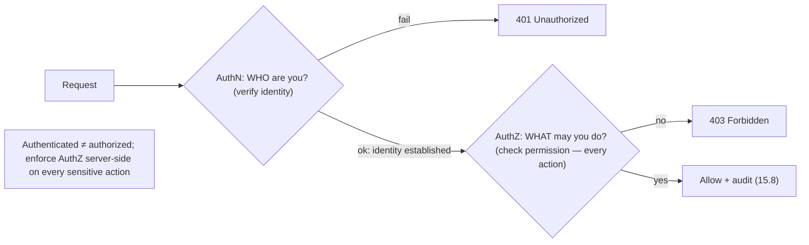
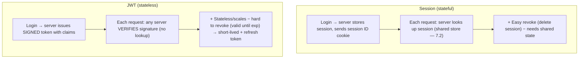

# Lesson 15.2 — AuthN vs AuthZ; Sessions, JWT, OAuth2, OIDC

> Part 15: Security · Difficulty: 🔴
>
> **Prerequisites:** [3.2.3 TLS/PKI], [7.2 Stateless/Externalized Sessions], [12.6 API Gateway], [15.1 Threat Modeling], [15.3 Cryptography (preview)].
> **Unlocks:** [15.5 Network Security/Zero-Trust], [15.8 Compliance], [Part 20 Capstone (identity)].

---

## 1. Learning Objectives

After this lesson you will be able to:

- Precisely distinguish **authentication (AuthN — who are you?)** from **authorization (AuthZ — what may you do?)** — the two most-confused security concepts.
- Compare **session-based** (stateful, server-stored) vs **token-based (JWT)** (stateless, self-contained) authentication, with their tradeoffs (revocation, scaling, statelessness — 7.2).
- Explain **OAuth2** (delegated **authorization** — access without sharing passwords) and **OIDC** (an **authentication** layer on top of OAuth2), and stop conflating them.
- Describe common **authorization models**: RBAC, ABAC, and least-privilege enforcement (15.1).
- Recognize the pitfalls: JWT revocation, storing tokens safely, and "authN vs authZ" bugs (broken access control — 15.6).

---

## 2. Motivation — Two questions, endlessly confused

Almost every system must answer two distinct questions about every request: **"who are you?"** (authentication, AuthN) and **"what are you allowed to do?"** (authorization, AuthZ). They sound similar and are constantly conflated, but they are **completely different concerns** — and confusing them causes serious vulnerabilities. Authenticating a user (proving identity) says **nothing** about what they may access; a logged-in user must still be **authorized** for each action. **Broken access control** — where authentication is done but authorization is missing or wrong (a user accesses another user's data by changing an ID) — is consistently among the **top real-world vulnerabilities** (OWASP — 15.6). Getting the AuthN/AuthZ distinction crisp is foundational.

Beyond the distinction, there's a zoo of mechanisms and protocols — **sessions vs JWTs**, **OAuth2**, **OIDC** — that engineers frequently misuse (the classic error: "we use OAuth to log users in" — OAuth2 is for **authorization/delegation**, not authentication; **OIDC** is the authentication layer). Choosing between **stateful sessions** (server remembers you) and **stateless JWTs** (a self-contained signed token) has real consequences for **scaling** (7.2 — statelessness), **revocation**, and security. **OAuth2** solves a specific, important problem: letting an app access your data on another service **without you handing over your password** (delegated authorization). **OIDC** adds **"who is this user"** on top. This lesson develops AuthN vs AuthZ, session vs token auth, and OAuth2/OIDC — so you can design identity correctly and avoid the pervasive access-control bugs.

---

## 3. Theory — From first principles

### 3.1 Authentication vs Authorization

`[CS]` The foundational distinction `[CS]`:
- **Authentication (AuthN):** **verifying *who* you are** — proving identity. "Prove you are Alice." Mechanisms: passwords, MFA, biometrics, certificates (mTLS — 15.5), tokens.
- **Authorization (AuthZ):** **determining *what* you're allowed to do** — checking permissions. "Alice may read her own orders but not admin the system." Enforced via roles/policies (§3.5).
- `[BP]` **They are sequential and distinct:** authenticate **first** (establish identity), then authorize **each action** (check permission). **Authentication ≠ authorization** — being logged in does **not** mean you can do anything; **every sensitive action needs an authorization check**.
- `[BP]` **The #1 bug:** doing AuthN but forgetting/mis-implementing AuthZ → **broken access control** (a user changes `/orders/123` to `/orders/124` and sees someone else's data — an **IDOR**, 15.6). **Never trust the client to enforce authorization** — enforce it **server-side** on every request (least privilege — 15.1).
- **Accounting/Auditing** (the third "A" — AAA): **logging who did what** (15.8) — for non-repudiation (15.1 STRIDE).

### 3.2 Session-based authentication (stateful)

`[CS]` Traditional web auth: **the server stores session state** `[CS]`:
- Flow: user logs in (credentials verified) → server **creates a session** (stores session data server-side, keyed by a **session ID**) → sends the session ID to the client as a **cookie** → client sends the cookie on each request → server **looks up the session** to identify the user.
- **Stateful:** the **server holds** the session data → the token (session ID) is just an opaque reference.
- `[BP]` **Pros:** **easy revocation** (delete the server-side session → instantly invalid), server controls session lifecycle, small opaque cookie.
- `[BP]` **Cons:** **the server must store + look up sessions** → statefulness (fights horizontal scaling — 7.2): needs **sticky sessions** or a **shared session store** (Redis — 7.2/Part 6) so any server can validate. Adds a lookup + shared state.

### 3.3 Token-based authentication (JWT, stateless)

`[CS]` **JWT (JSON Web Token):** a **self-contained, signed token** carrying the identity/claims — **stateless** `[CS]`:
- Structure: **header . payload . signature** (base64url) — the **payload** carries **claims** (user ID, roles, expiry `exp`, issuer), and the **signature** (HMAC or public-key — 15.3) lets any server **verify authenticity + integrity without a lookup**.
- Flow: user logs in → server issues a **signed JWT** → client stores it and sends it (usually in the `Authorization: Bearer` header) → any server **verifies the signature** (with the shared secret / public key) and reads the claims — **no server-side session lookup**.
- `[BP]` **Pros:** **stateless** (no shared session store — great for horizontal scaling — 7.2, microservices — 12.3, and APIs); self-contained (claims travel with the token); works across services/domains.
- `[BP]` **Cons — the big one is revocation:** a JWT is **valid until it expires** — you **can't easily revoke it** server-side (there's no server state to delete) → a stolen or should-be-logged-out token **keeps working** until `exp`. Mitigations: **short-lived access tokens** + **refresh tokens** (§3.4), a **revocation/deny-list** (reintroduces state — a tradeoff), or token versioning. Also: **JWTs are readable** (base64, not encrypted) → **don't put secrets in the payload**; and signature-algorithm pitfalls (`alg: none`, key confusion) must be avoided.

### 3.4 Sessions vs JWT — choosing + refresh tokens

`[BP]` The tradeoff `[BP]`:
- **Sessions:** stateful, **easy revocation**, server-controlled — but needs shared session state (fights statelessness — 7.2). Good for **classic server-rendered web apps** where you control the server and want instant revocation.
- **JWT:** stateless, **scales without shared state**, cross-service — but **hard to revoke** and must be stored/handled carefully. Good for **APIs, SPAs, mobile, microservices** (12.3) where statelessness matters.
- **The common pattern — short-lived access token + refresh token** `[BP]`: issue a **short-lived** (minutes) **access token** (JWT — limits the revocation window) + a **longer-lived refresh token** (stored more securely, often server-tracked so it *can* be revoked). The client uses the access token until it expires, then exchanges the refresh token for a new one. This **balances** JWT statelessness with **bounded exposure** + refresh-token revocability.
- **Token storage (security):** in browsers, **`HttpOnly`, `Secure`, `SameSite` cookies** protect against XSS/CSRF better than `localStorage` (which is XSS-readable — 15.6). Always over **TLS** (15.4).

### 3.5 Authorization models

`[CS]` How to decide **what** an authenticated principal may do `[CS]`:
- **RBAC (Role-Based Access Control):** assign users to **roles** (admin, editor, viewer); permissions attach to roles. Simple, common, coarse-grained. "Editors may edit."
- **ABAC (Attribute-Based Access Control):** decisions based on **attributes** (of the user, resource, action, environment) via policies. Fine-grained, flexible, more complex. "A user may edit a document **if** they own it **and** it's not locked **and** during business hours."
- **ReBAC (Relationship-Based)** `[EMERGING]`: permissions from **relationships** (e.g., Google Zanzibar-style: "user is an editor of this doc's parent folder") — scales fine-grained sharing. `[EMERGING]`
- **Least privilege (15.1):** whichever model, grant the **minimum** needed; deny by default (fail secure — 15.1).
- `[BP]` **Enforce server-side, at every request/trust boundary** (15.1) — often centralized (a policy engine / at the gateway — 12.6 / in a service mesh — 12.7) for consistency. **Never rely on hiding UI** or client-side checks for authorization.

### 3.6 OAuth2 — delegated authorization (NOT login)

`[CS]` **OAuth2** is an **authorization framework for delegated access** — letting an application access a user's resources on another service **without the user sharing their password** `[CS]`:
- **The problem it solves:** "Let this photo-printing app access my Google Photos" — **without** giving the app your Google password. OAuth2 lets you **grant limited, revocable access** (scopes) instead.
- **Roles:** **Resource Owner** (the user), **Client** (the app wanting access), **Authorization Server** (issues tokens — e.g., Google's), **Resource Server** (holds the data — e.g., Google Photos API).
- **Flow (Authorization Code, simplified):** the client redirects the user to the auth server → the user **authenticates + consents** (grants scopes) → the auth server issues an **authorization code** → the client exchanges it for an **access token** → the client uses the access token to call the resource server. (Use **PKCE** for public clients — SPAs/mobile.)
- **Scopes:** the access token grants **limited** permissions (`photos.read`) — least privilege (15.1).
- `[BP]` **The crucial clarification:** **OAuth2 is about AUTHORIZATION (delegated access), NOT authentication.** Using an OAuth2 access token to "log a user in" is a **misuse** — the access token says "this app may access this data," **not** "this is who the user is." That's what **OIDC** is for (§3.7).

### 3.7 OIDC — authentication on top of OAuth2

`[CS]` **OpenID Connect (OIDC)** is a thin **authentication layer built on top of OAuth2** — it adds **"who is the user"** `[CS]`:
- OIDC adds an **ID token** (a **JWT** — §3.3) containing **identity claims** about the authenticated user (subject/`sub`, name, email, etc.), issued by an **Identity Provider (IdP)**.
- So: **OAuth2** answers "**may this app access this resource?**" (authorization); **OIDC** answers "**who is this user, and are they authenticated?**" (authentication) — **OIDC = authentication; OAuth2 = authorization**.
- **"Sign in with Google/Apple/etc." = OIDC** (federated authentication / SSO) — you authenticate with an IdP, and the app gets an **ID token** proving who you are, without managing passwords itself.
- `[BP]` **The correct mental model:** if you want to **log a user in** via a third party → **OIDC**. If you want an app to **access a user's data** on another service → **OAuth2**. They compose (OIDC gives identity + OAuth2 gives access). Conflating them ("we use OAuth for login") is the pervasive mistake — technically you need the **OIDC layer** for authentication.

---

## 4. Visual Intuition

### AuthN vs AuthZ (sequential, distinct)

### Sessions (stateful) vs JWT (stateless)

---

## 5. Real-World Analogy

Think of entering an **exclusive members' club with different areas**.

- **Authentication vs authorization:** at the door, the bouncer checks your **ID to confirm you are who you say** (authentication — *who are you?*). But being **let in** doesn't mean you can go **everywhere** — the **VIP lounge, the vault, the kitchen** each require **specific permission** (authorization — *what may you do?*). A common, dangerous mistake is assuming "they got past the door, so they can go anywhere" — that's **broken access control**: every restricted room needs its **own check**, and you don't let a member wander into the vault just because their ID was valid at the front door.
- **Session = a coat-check ticket the club tracks:** when you enter, the club gives you a **numbered ticket** and **keeps a record** matching the ticket to you (server-side session). Each time you use it, staff **look up the record** to know who you are. If they need to **kick you out**, they just **tear up your record** — you're instantly invalid (easy revocation). But the club must **maintain the whole ledger** and every staff member needs access to it (shared state).
- **JWT = a tamper-proof, self-describing wristband:** instead, the club gives you a **holographic wristband** that **states your name and access level right on it**, sealed so it **can't be forged** (signature). Any staff member can **read it and verify the seal** without checking any central ledger (stateless — scales beautifully). The catch: once issued, the wristband is **valid until its printed expiry** — if you're supposed to be thrown out early, staff **can't easily invalidate a wristband already on your wrist** (hard revocation). So the club issues **short-lived wristbands** you must **renew at a desk** (short access token + refresh token), limiting how long a bad one works.
- **OAuth2 = valet access without your house keys:** you want the **valet** to park your car, but you don't hand over **your entire keyring and house keys** (your password). Instead you give a **limited valet key** that **only starts the car and opens the doors** (scoped, delegated access) and that you can **revoke**. That's OAuth2 — granting an app **limited access to specific things** on another service **without sharing your master credentials**.
- **OIDC = the valet company verifying your identity too:** OAuth2's valet key lets the valet **do a task**, but doesn't itself **prove who you are** to a third party. OIDC adds an **official ID card from a trusted authority** ("this is definitely Alice") — which is exactly what **"Sign in with Google"** provides: Google **vouches for who you are** (authentication), separate from granting **access to your data** (authorization).

---

## 6. Industry Example

- **Session cookies + shared session store** `[CONV]`: classic web apps storing sessions in Redis (7.2) for stateless app servers with easy revocation (§3.2). *(Representative.)*
- **JWT for APIs/SPAs/microservices** `[CONV]`: stateless bearer tokens verified per-request, with short-lived access + refresh tokens (§3.3/3.4, 12.3). *(Representative.)*
- **OAuth2 delegated access** `[CONV]`: "allow app X to access your calendar/photos" via scoped tokens without password sharing (§3.6). *(Representative.)*
- **OIDC / "Sign in with..."** `[CONV]`: federated authentication via IdPs (Google/Apple/Okta/Entra) issuing ID tokens (§3.7). *(Representative.)*
- **Broken access control (OWASP #1-ish)** `[CONV]`: IDOR/missing-authz bugs where authenticated users access others' data (§3.1, 15.6). *(Representative.)*

---

## 7. Implementation Details

- **Separate AuthN from AuthZ** (§3.1): authenticate first, then **authorize every sensitive action server-side**; never trust the client for authorization; deny by default (least privilege — 15.1).
- **Choose session vs JWT deliberately** (§3.4): sessions (+ shared store — 7.2) for server-rendered apps needing easy revocation; JWTs for APIs/SPAs/microservices needing statelessness — with **short-lived access + refresh tokens**.
- **Handle JWT pitfalls** (§3.3): short expiry, a revocation/deny-list for critical cases, verify the signature + `alg` (reject `none`), don't put secrets in the payload, validate `iss`/`aud`/`exp`.
- **Store tokens safely** (§3.4): `HttpOnly`+`Secure`+`SameSite` cookies over TLS (15.4); avoid `localStorage` for sensitive tokens (XSS — 15.6).
- **Pick an authorization model** (§3.5): RBAC (simple), ABAC/ReBAC (fine-grained); enforce centrally (gateway — 12.6 / policy engine / mesh — 12.7) for consistency; least privilege.
- **Use OAuth2 for delegated access + OIDC for authentication** (§3.6/3.7): don't misuse OAuth2 access tokens as proof of identity; use **Authorization Code + PKCE**; request **minimal scopes**.
- **Use vetted libraries/IdPs** — don't roll your own auth/crypto (15.3); centralize identity (an IdP) rather than per-service password handling.

---

## 8. Advantages

- **Clear AuthN/AuthZ separation** — prevents broken-access-control bugs (§3.1, 15.6).
- **Sessions:** easy revocation, server control (§3.2).
- **JWT:** stateless scaling (7.2), cross-service, no shared session store (§3.3, 12.3).
- **Short-lived + refresh:** balances statelessness with bounded exposure + revocability (§3.4).
- **OAuth2:** delegated, scoped, revocable access without password sharing (§3.6).
- **OIDC:** federated authentication/SSO without managing passwords (§3.7).

---

## 9. Disadvantages / costs

- **JWT revocation is hard** — valid until expiry; mitigations reintroduce state or complexity (§3.3/3.4).
- **Sessions need shared state** — fights statelessness/scaling (§3.2, 7.2).
- **Token storage is risky** — XSS/CSRF if mishandled (§3.4, 15.6).
- **OAuth2/OIDC complexity** — many flows/roles; easy to misconfigure (§3.6/3.7).
- **Conflation bugs** — misusing OAuth2 for authentication (§3.6/3.7).
- **Authorization is pervasive + error-prone** — must be checked everywhere, correctly (§3.1/3.5).

---

## 10. When NOT to / cautions

- **Don't rely on authentication alone** — authorize every action (§3.1).
- **Don't enforce authorization client-side** — always server-side (§3.1).
- **Don't use OAuth2 access tokens for authentication** — use OIDC ID tokens (§3.6/3.7).
- **Don't put secrets in a JWT payload** — it's readable (§3.3).
- **Don't store sensitive tokens in `localStorage`** — XSS-exposed (§3.4).
- **Don't roll your own auth** — use vetted libraries/IdPs (§3.7, 15.3).
- **Don't use long-lived JWTs** without a revocation strategy (§3.3/3.4).

---

## 11. Common Mistakes

1. **Confusing AuthN with AuthZ** → broken access control / IDOR (§3.1, 15.6).
2. **Client-side authorization** — trusting the frontend to enforce permissions (§3.1).
3. **Long-lived un-revocable JWTs** — stolen token works indefinitely (§3.3).
4. **Secrets in JWT payload** — readable by anyone (§3.3).
5. **Tokens in `localStorage`** — XSS-stealable (§3.4).
6. **OAuth2-as-login** — using access tokens to identify users (§3.6/3.7).
7. **`alg: none` / signature not verified** — token forgery (§3.3).
8. **Rolling your own auth/session** — subtle vulnerabilities (§3.7).

---

## 12. Interview Questions

**🟢 Easy**
- What's the difference between authentication and authorization?
- What is a JWT, and what are its three parts?

**🟡 Medium**
- Compare session-based and token-based (JWT) authentication (state, revocation, scaling).
- What problem does OAuth2 solve, and why isn't it authentication?

**🔴 Hard**
- How do you handle JWT revocation given that JWTs are valid until expiry (short-lived + refresh tokens, deny-lists)?
- Explain OAuth2 vs OIDC precisely: which is authentication, which is authorization, and how do they compose in "Sign in with Google"?

**⚫ Staff+**
- Design the identity/auth architecture for a microservices system (Part 12): session vs JWT, token issuance/verification/revocation, where authorization is enforced (gateway/mesh/service — 12.6/12.7), RBAC/ABAC, and OIDC for user login + OAuth2 for service/API access.
- A pentest finds users can access others' data by changing an ID in the URL. Diagnose (broken access control — AuthZ missing/wrong), and design the fix (server-side per-request authorization, least privilege, object-level checks).

---

## 13. Production Pitfalls

- **IDOR / broken access control:** authenticated users accessed others' records by changing an ID — authorization wasn't checked per-object (§3.1, 15.6).
- **Un-revocable stolen JWT:** a leaked long-lived token kept working; no revocation → prolonged compromise (§3.3).
- **XSS token theft:** tokens in `localStorage` were exfiltrated via an XSS bug (§3.4, 15.6).
- **`alg: none` bypass:** a JWT library accepted unsigned tokens → forgery (§3.3).
- **OAuth-as-login confusion:** an access token was treated as identity proof, enabling token-substitution attacks (§3.6/3.7).
- **Missing signature/`aud` validation:** tokens from another audience/issuer were accepted (§3.3).
- **Session fixation / missing `HttpOnly`:** session cookies stolen/fixed due to missing flags (§3.2/3.4).

---

## 14. Optimization Techniques

- **Enforce AuthZ centrally** (gateway — 12.6 / policy engine / mesh — 12.7) for consistency + least privilege (§3.5).
- **Short-lived access tokens + refresh tokens** to balance JWT statelessness with revocability (§3.4).
- **JWT for stateless scaling** (7.2, microservices — 12.3); sessions where easy revocation matters (§3.4).
- **`HttpOnly`+`Secure`+`SameSite` cookies over TLS** for safe token storage (§3.4, 15.4).
- **OIDC via a central IdP** for federated auth/SSO (no per-service password handling) (§3.7).
- **Minimal OAuth2 scopes + Authorization Code + PKCE** (least privilege) (§3.6).
- **Vetted libraries/IdPs**, validate signature/`iss`/`aud`/`exp`, reject `alg: none` (§3.3, 15.3).

---

## 15. Summary

Every request raises two **distinct** questions: **authentication (AuthN — *who are you?*** proving identity via passwords/MFA/certs/tokens) and **authorization (AuthZ — *what may you do?*** checking permissions) — done **sequentially** (authenticate first, then authorize **every sensitive action**). **Being authenticated ≠ being authorized**: the pervasive **broken access control** bug (consistently a top real-world vulnerability — OWASP, 15.6) happens when AuthN is done but AuthZ is missing/wrong (e.g., **IDOR** — changing an ID to read another user's data), so **enforce authorization server-side on every request, never client-side**, deny by default (least privilege — 15.1); plus **auditing** (the third "A" — 15.8) logs who did what. For authentication mechanics, **session-based** auth is **stateful** — the server stores session data keyed by a session-ID cookie and **looks it up** each request → **easy revocation** (delete the session) but needs **shared session state** (fighting horizontal scaling — 7.2, via sticky sessions or a shared store). **Token-based (JWT)** auth is **stateless** — a **self-contained, signed** token (header.payload.signature) carrying **claims** that **any server verifies via the signature without a lookup** → great for **APIs/SPAs/microservices** and scaling (7.2/12.3), but its big weakness is **revocation** (a JWT is **valid until it expires**, hard to invalidate) — mitigated by **short-lived access tokens + longer-lived (revocable) refresh tokens**, deny-lists (reintroducing state), storing tokens safely (`HttpOnly`/`Secure`/`SameSite` cookies over TLS, not `localStorage`), and avoiding pitfalls (secrets in the readable payload, `alg: none`, unverified signatures). **Authorization models** decide *what*: **RBAC** (roles — simple/coarse), **ABAC** (attribute/policy-based — fine-grained), **ReBAC** (relationship-based — scalable sharing) — enforced **centrally** (gateway — 12.6 / policy engine / mesh — 12.7) with **least privilege**. Finally, the endlessly-confused protocols: **OAuth2 is delegated *authorization*** — letting an app access your data on another service (scoped, revocable) **without sharing your password** (Resource Owner / Client / Authorization Server / Resource Server; Authorization-Code + PKCE flow) — and **using an OAuth2 access token to "log in" is a misuse** (it grants access, doesn't prove identity); **OIDC is an *authentication* layer on top of OAuth2** that adds an **ID token (a JWT)** with identity claims from an **IdP** — so **"Sign in with Google" = OIDC**. The correct model: **OIDC = authentication (who you are), OAuth2 = authorization (what an app may access)** — they compose. Use vetted libraries/IdPs (don't roll your own — 15.3), and keep AuthN and AuthZ crisply separated to avoid the access-control bugs that dominate real breaches.

---

## 16. Revision Notes (flashcard-ready)

- **Q:** AuthN vs AuthZ? **A:** AuthN = who are you (identity); AuthZ = what may you do (permissions). Authenticate first, authorize every action.
- **Q:** #1 auth bug? **A:** Broken access control — AuthN done but AuthZ missing/wrong (e.g., IDOR); enforce AuthZ server-side always.
- **Q:** Session auth? **A:** Stateful — server stores session, session-ID cookie, looks up per request; easy revoke, needs shared state (7.2).
- **Q:** JWT? **A:** Stateless self-contained signed token (header.payload.signature) with claims; any server verifies signature, no lookup.
- **Q:** JWT's main weakness? **A:** Revocation — valid until expiry; mitigate with short-lived access + refresh tokens / deny-lists.
- **Q:** JWT storage/pitfalls? **A:** HttpOnly/Secure/SameSite cookies (not localStorage); no secrets in payload; verify signature + reject alg:none.
- **Q:** Authorization models? **A:** RBAC (roles), ABAC (attributes/policy), ReBAC (relationships); enforce centrally + least privilege.
- **Q:** OAuth2? **A:** Delegated AUTHORIZATION — app accesses your data on another service (scoped, revocable) without your password. NOT login.
- **Q:** OIDC? **A:** AUTHENTICATION layer on OAuth2 — adds an ID token (JWT) with identity claims; "Sign in with Google" = OIDC.
- **Q:** OAuth2 vs OIDC one-liner? **A:** OAuth2 = what an app may access; OIDC = who the user is. Don't use OAuth2 for login.

---

## 17. Further Reading + Knowledge-Graph Links

**Foundations (in-platform):**
- **[15.1 Threat Modeling]** — spoofing (authN) + elevation (authZ) threats.
- **[7.2 Stateless/Externalized Sessions]** — session state vs stateless tokens.
- **[3.2.3 TLS/PKI]** — signatures/certs underpinning tokens.
- **[12.6 API Gateway]** — where authN/authZ is often centralized.

**Unlocks / next:**
- **[15.3 Cryptography]** — signing/verifying tokens.
- **[15.5 Network Security/Zero-Trust]** — mTLS auth, per-request verification.
- **[15.6 OWASP/Vulnerabilities]** — broken access control, XSS/CSRF.
- **[15.8 Compliance]** — audit logging (the third A).

**External (canonical):**
- OAuth 2.0 (RFC 6749) & OpenID Connect Core specs. *(Representative.)*
- JWT (RFC 7519) & JOSE. *(Representative.)*
- OWASP authentication/authorization + access-control cheat sheets. *(Representative.)*

> **Knowledge-graph:** `15.1 spoofing/elevation` → **`15.2 AuthN vs AuthZ (sessions/JWT/OAuth2/OIDC)`** → `15.3 crypto (signing)` / `15.5 mTLS/zero-trust` / `15.6 broken access control` / `15.8 audit`.
