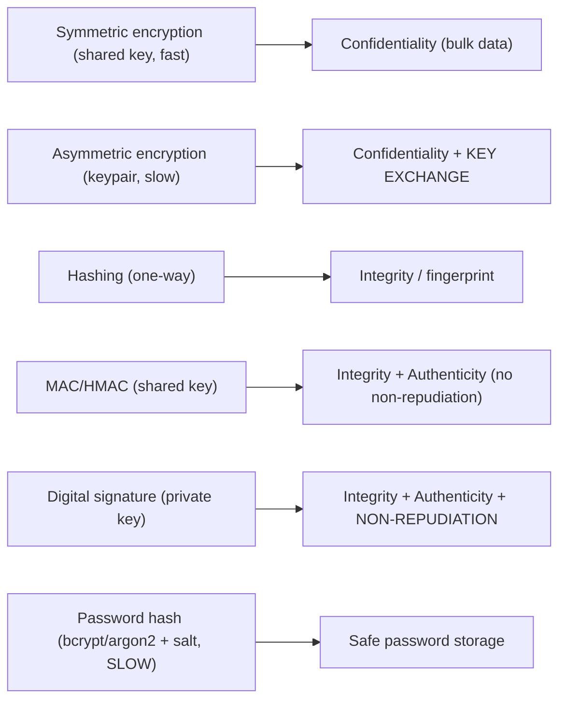
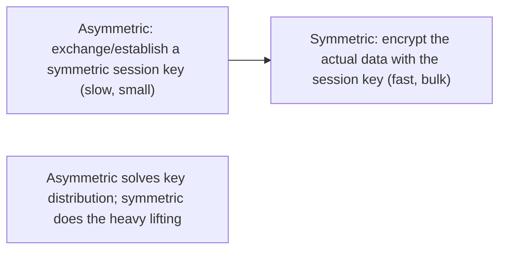

# Lesson 15.3 — Cryptography for Architects: Symmetric/Asymmetric, Hashing, Signing, Key Management

> Part 15: Security · Difficulty: 🔴
>
> **Prerequisites:** [3.2.3 TLS/SSL/mTLS/PKI], [15.1 Threat Modeling], [15.2 AuthN/AuthZ (tokens)].
> **Unlocks:** [15.4 Encryption/Secrets], [15.5 Network Security], [Part 20 Capstone].

---

## 1. Learning Objectives

After this lesson you will be able to:

- Explain the goals cryptography provides — **confidentiality, integrity, authenticity, non-repudiation** — and map them to primitives.
- Distinguish **symmetric** (shared secret, fast) from **asymmetric** (public/private key, slow) encryption and when to use each (including the **hybrid** approach TLS uses — 3.2.3).
- Explain **cryptographic hashing** (one-way, fixed-size, collision-resistant) and its uses — and specifically **password hashing** (slow, salted — bcrypt/argon2), distinct from general hashing.
- Explain **MACs/HMAC** (integrity + authenticity with a shared key) and **digital signatures** (integrity + authenticity + non-repudiation with a private key).
- Understand **key management** as the hardest part — generation, storage, rotation, KMS/HSM — and the golden rule: **don't roll your own crypto**.

---

## 2. Motivation — Use crypto correctly, don't invent it

Cryptography is the mathematical foundation of nearly every security control — TLS (3.2.3), token signing (15.2), encryption at rest (15.4), password storage, and more. But it's also where well-meaning engineers cause **catastrophic** failures, because crypto is **subtle and unforgiving**: a scheme that *looks* fine can be **completely broken** by a flaw invisible to non-experts (a reused nonce, a timing side-channel, a wrong mode, a fast hash for passwords). The single most important rule for an architect is therefore **"don't roll your own crypto"** — use **vetted, standard, well-implemented** primitives and libraries, and understand them well enough to **choose and combine them correctly**.

An architect doesn't need to implement AES or design elliptic curves — but does need to know **which primitive achieves which goal**, and the classic pitfalls. The primitives map to distinct goals: **symmetric encryption** (confidentiality, fast, shared secret) vs **asymmetric encryption** (confidentiality + key exchange, slow, public/private keypair) — combined in the **hybrid** approach that makes TLS practical (3.2.3); **hashing** (integrity, one-way fingerprints) — with **password hashing** as a deliberately-slow, salted special case; **MACs/HMAC** (integrity + authenticity with a shared key) and **digital signatures** (integrity + authenticity + **non-repudiation** with a private key, verifiable by anyone with the public key). And underpinning all of it is **key management** — generating, storing, rotating, and protecting keys — which is consistently the **hardest and most-failed** part (crypto rarely breaks; **key handling** does). This lesson gives the architect's working knowledge of these primitives, their correct use, and key management.

---

## 3. Theory — From first principles

### 3.1 What cryptography provides (the goals)

`[CS]` Crypto primitives achieve four security goals (mapping to STRIDE/CIA — 15.1) `[CS]`:
- **Confidentiality** — data is unreadable to unauthorized parties → **encryption** (symmetric/asymmetric — §3.2/3.3).
- **Integrity** — data hasn't been altered → **hashing / MACs / signatures** (§3.4/3.5/3.6).
- **Authenticity** — data genuinely comes from the claimed source → **MACs / signatures** (§3.5/3.6).
- **Non-repudiation** — the sender **cannot deny** having sent it → **digital signatures** (§3.6, not MACs — §3.5).
- `[BP]` **Match the primitive to the goal:** encryption ≠ integrity (encrypting doesn't prevent tampering — use authenticated encryption); hashing ≠ encryption (hashing is one-way, not reversible). Choosing the wrong primitive is a common error.

### 3.2 Symmetric encryption

`[CS]` **Symmetric encryption** uses a **single shared secret key** for both encryption and decryption `[CS]`:
- **Fast** (efficient for large data) — e.g., **AES** (representative). Modern usage: **authenticated encryption (AEAD)** modes like **AES-GCM** that provide **confidentiality + integrity together** (§3.1).
- **The problem: key distribution** — both parties need the **same secret**, and sharing it securely over an untrusted network (8.1.1) is hard (if you can share a secret securely, why not the data?). This is what asymmetric solves (§3.3).
- `[BP]` **Use for:** bulk data encryption (at rest — 15.4, in transit after key exchange), where a shared key can be established. Pitfalls: **never reuse nonces/IVs** (catastrophic in GCM), use a proper mode (not ECB), authenticated encryption.

### 3.3 Asymmetric (public-key) encryption

`[CS]` **Asymmetric encryption** uses a **keypair** — a **public key** (shareable) and a **private key** (secret) `[CS]`:
- **Property:** what one key encrypts, only the **other** can decrypt. **Encrypt with the public key → only the private key decrypts** (confidentiality — anyone can send you a secret only you can read). (For signing, it's reversed — §3.6.) E.g., **RSA, ECC** (representative).
- **Solves key distribution:** you can **publish** your public key freely; no shared secret needed → enables **key exchange** (e.g., Diffie-Hellman) and PKI (3.2.3).
- **But slow** — expensive, impractical for bulk data.
- `[BP]` **The hybrid approach (how TLS actually works — 3.2.3):** use **asymmetric** to **exchange/establish a symmetric session key** (slow, but only for a small key), then use **fast symmetric encryption** for the actual data. **Best of both:** asymmetric solves key distribution, symmetric does the bulk work. This is the fundamental pattern behind TLS/HTTPS.

### 3.4 Cryptographic hashing

`[CS]` A **cryptographic hash function** maps arbitrary input to a **fixed-size digest**, with key properties `[CS]`:
- **One-way (preimage resistance):** infeasible to recover the input from the hash.
- **Deterministic:** same input → same hash.
- **Collision-resistant:** infeasible to find two inputs with the same hash.
- **Avalanche:** a tiny input change → a completely different hash.
- Examples: **SHA-256** (representative); **avoid broken ones** (MD5, SHA-1) for security.
- `[BP]` **Uses:** **integrity** (verify data unchanged by comparing hashes), **fingerprinting/deduplication**, **content-addressing** (13.2 image layers, Git), **proof-of-work**, and as a building block for MACs/signatures. **Not encryption** (one-way, not reversible) and **not for passwords directly** (§3.7).

### 3.5 MACs and HMAC

`[CS]` A **MAC (Message Authentication Code)** provides **integrity + authenticity** using a **shared secret key** `[CS]`:
- A MAC is a tag computed over a message **with a secret key**; the receiver (who has the same key) recomputes it to verify the message is **unaltered** (integrity) and came from **someone with the key** (authenticity). **HMAC** is the standard hash-based construction.
- **Symmetric** (shared key) → **fast**, but **no non-repudiation**: since **both parties share the key**, either could have produced the MAC → you can't prove *which* one did (§3.6 — that needs signatures).
- `[BP]` **Use for:** verifying integrity+authenticity between parties who share a key — e.g., **JWT signed with HMAC** (15.2), API request signing, cookie integrity. Also: **encrypt-then-MAC** or use AEAD (§3.2) for combined confidentiality+integrity.

### 3.6 Digital signatures

`[CS]` A **digital signature** provides **integrity + authenticity + non-repudiation** using **asymmetric** keys `[CS]`:
- **Sign with the private key, verify with the public key** — the reverse of encryption (§3.3). The signer uses their **private key** (only they have it) to sign; **anyone** with the **public key** can **verify** it.
- **Provides non-repudiation:** because **only the private-key holder** could have produced the signature, they **cannot deny** signing it (unlike MACs where the key is shared — §3.5).
- Typically you **hash the data, then sign the hash** (efficient) — e.g., **RSA/ECDSA/EdDSA** signatures (representative).
- `[BP]` **Use for:** **JWT signed with a private key** (RS256 — 15.2, so anyone can verify without the signing secret), **code/artifact signing** (supply chain — 14.7), **certificates** (a CA signs certs — PKI — 3.2.3), **document signing**. **MAC vs signature:** MAC = shared key, fast, no non-repudiation; signature = keypair, slower, **verifiable by anyone + non-repudiation**.

### 3.7 Password hashing — a special case

`[BP]` **Passwords must NOT be stored with a general-purpose fast hash (SHA-256)** — they need a **deliberately-slow, salted password hash** `[BP]`:
- **Why not plain SHA-256:** it's **fast**, so an attacker who steals the hash database can try **billions of guesses/second** (brute force / rainbow tables) — fast hashes make cracking easy.
- **Password hashing functions** (**bcrypt, scrypt, Argon2** — representative) are **deliberately slow and resource-intensive** (configurable work factor / memory-hard) → each guess is expensive → brute force is impractical.
- **Salt:** a unique random value per password, stored with the hash → defeats **rainbow tables** and ensures identical passwords hash differently. (Some also add a secret **pepper**.)
- `[BP]` **Rules:** **never store plaintext passwords**; **never** use fast hashes (MD5/SHA) for passwords; use **bcrypt/scrypt/Argon2 + salt** with an appropriate work factor; better yet, **offload authentication to an IdP** (OIDC — 15.2) so you don't store passwords at all.

### 3.8 Key management — the hardest part

`[CS]`/`[BP]` **Cryptography rarely breaks; key management does** — protecting keys is the crux `[BP]`:
- **The lifecycle:** **generate** (with a strong CSPRNG — never a weak/predictable random), **distribute/exchange** securely (§3.3), **store** securely (§below), **rotate** periodically (limit exposure if compromised), **revoke** (compromised keys — cert revocation — 3.2.3), and **destroy** when done.
- **Storage — never hardcode/commit keys** (15.1/13.4 secrets): use a **KMS (Key Management Service)** or **HSM (Hardware Security Module)** — the private key **never leaves** the HSM/KMS; you send data *to* it to sign/encrypt. Cloud KMS + HSMs manage keys with access control + auditing.
- **Rotation:** rotate keys regularly and **on suspected compromise**; design so rotation doesn't break the system (versioned keys — e.g., a JWT `kid` header selects the key).
- **Least privilege + audit** (15.1): strict access control on keys; log all key usage (15.8).
- `[BP]` **The recurring failure:** the crypto algorithm is fine, but keys are **hardcoded, committed to Git, in plaintext config, over-shared, never rotated, or generated with weak randomness** → the whole scheme collapses. **A cryptosystem is only as secure as its key management.** (Ties to secrets management — 15.4/13.4.)

### 3.9 The golden rules

`[BP]` The architect's crypto rules `[BP]`:
- **Don't roll your own crypto** — use **vetted, standard algorithms + well-audited libraries** (not homemade schemes, not obscure algorithms). Amateur crypto is almost always broken.
- **Use high-level, misuse-resistant libraries** (that handle nonces/modes/padding correctly) over low-level primitives.
- **Prefer authenticated encryption (AEAD)** — confidentiality + integrity together (§3.2).
- **Match the primitive to the goal** (§3.1); understand what each provides.
- **Manage keys properly** (§3.8) — the hardest, most-failed part.
- **Use standard protocols** (TLS — 3.2.3) rather than assembling your own.
- **Stay current** — algorithms/parameters get deprecated (MD5/SHA-1/short keys); plan for **crypto-agility** (and, emerging, **post-quantum** migration — `[EMERGING]`).

---

## 4. Visual Intuition

### Primitives → goals

### Hybrid encryption (how TLS works — 3.2.3)

---

## 5. Real-World Analogy

Think of the tools in a **secure mailroom** — each achieves a different goal, and the hardest part is guarding the keys.

- **Symmetric encryption = a shared padlock key:** you and a friend have **copies of the same key** to a lockbox — fast and simple to lock/unlock messages. The catch: **how do you get your friend a copy of the key** in the first place without a courier stealing it? (key distribution problem).
- **Asymmetric encryption = a public mail slot with a private key:** you install a **mail slot anyone can drop letters into** (public key), but **only you have the key to open the box** (private key) — so **anyone can send you a secret without any prior shared key**. It solves distribution, but the mechanism is **slow/bulky**, so for a big package you use it just to **hand over a padlock key**, then switch to the **fast shared padlock** (hybrid — exactly how HTTPS works).
- **Hashing = a tamper-evident wax seal fingerprint:** you press a **unique wax seal** whose impression is a **fingerprint of the exact contents**; if anyone alters the letter, the fingerprint won't match (integrity). You **can't reconstruct the letter from the fingerprint** (one-way), and it's **infeasible to forge a different letter with the same fingerprint** (collision resistance).
- **MAC vs signature = a shared-secret stamp vs a personal wax seal:** a **MAC** is like a **rubber stamp both you and your friend own** — a stamped letter proves it came from *someone with the stamp* and wasn't altered, but since **you both have the stamp**, you can't prove *which* of you stamped it (**no non-repudiation**). A **digital signature** is your **personal signet ring only you possess** — anyone can **verify** it's yours against your public seal-print, and you **can't deny** you sealed it (**non-repudiation**).
- **Password hashing = a slow, salted one-way shredder:** you never keep the actual passwords — you run them through a **deliberately slow, individualized shredder** (bcrypt/argon2 + salt). Even if a thief steals the shredded output, **reversing it is impractically expensive** (slow), and because each was shredded with a **unique twist (salt)**, they can't reuse work across passwords (no rainbow tables). A **fast** shredder (SHA-256) would let the thief try billions of guesses cheaply — the opposite of what you want.
- **Key management = guarding the keys themselves:** all these tools are useless if you **leave the keys under the doormat** (hardcoded in code), **hand copies to everyone** (over-sharing), or **never change the locks** (no rotation). The mailroom's security ultimately rests on a **locked, audited key cabinet** (KMS/HSM) — because the tools rarely fail, but **careless key-keeping** does.

---

## 6. Industry Example

- **TLS hybrid encryption** `[CONV]`: asymmetric key exchange + symmetric bulk encryption — the model for HTTPS (§3.3, 3.2.3). *(Representative.)*
- **AES-GCM / authenticated encryption** `[CONV]`: AEAD for confidentiality + integrity together at rest/in transit (§3.2, 15.4). *(Representative.)*
- **bcrypt/scrypt/Argon2 password hashing** `[CONV]`: slow, salted password storage (§3.7). *(Representative.)*
- **JWT signing: HMAC (shared) vs RS256 (private key)** `[CONV]`: MAC vs signature tradeoff for tokens (§3.5/3.6, 15.2). *(Representative.)*
- **Cloud KMS / HSM + code signing** `[CONV]`: managed keys never leaving the HSM; artifact/code signing for supply chain (§3.8, 14.7). *(Representative.)*

---

## 7. Implementation Details

- **Match primitive to goal** (§3.1): AEAD symmetric for bulk confidentiality+integrity; asymmetric for key exchange/signatures; hashing for integrity; signatures for non-repudiation.
- **Use hybrid encryption** (§3.3): asymmetric to establish a symmetric key, symmetric for data — via **TLS** (3.2.3), don't hand-build.
- **Hash passwords with bcrypt/scrypt/Argon2 + salt** (§3.7); never plaintext, never fast hashes; better, offload to an IdP (OIDC — 15.2).
- **Sign tokens/artifacts appropriately** (§3.5/3.6): HMAC when parties share a key + non-repudiation isn't needed; asymmetric signatures when anyone must verify / non-repudiation matters.
- **Manage keys with a KMS/HSM** (§3.8): generate with a CSPRNG; never hardcode/commit; strict access control + audit (15.1/15.8); rotate regularly + on compromise; version keys (`kid`) for rotation.
- **Follow the golden rules** (§3.9): don't roll your own; use vetted misuse-resistant libraries; prefer AEAD; never reuse nonces; use standard protocols; keep crypto-agile (deprecate weak algos; plan post-quantum).

---

## 8. Advantages

- **Symmetric:** fast bulk encryption (§3.2).
- **Asymmetric:** solves key distribution; enables signatures + PKI (§3.3).
- **Hybrid:** practical, secure (asymmetric key-exchange + symmetric speed) (§3.3).
- **Hashing:** cheap integrity/fingerprinting/content-addressing (§3.4).
- **MAC:** fast integrity+authenticity with a shared key (§3.5).
- **Signatures:** integrity+authenticity+non-repudiation, publicly verifiable (§3.6).
- **Password hashing:** brute-force-resistant credential storage (§3.7).

---

## 9. Disadvantages / costs

- **Subtle + unforgiving** — small mistakes → catastrophic breaks (§2/3.9).
- **Symmetric:** key-distribution problem (§3.2).
- **Asymmetric:** slow; impractical for bulk (§3.3).
- **Key management is hard + most-failed** — the real risk (§3.8).
- **Performance cost** — crypto has CPU cost (mitigated by hardware/AEAD).
- **Algorithm aging** — must migrate off deprecated algos; post-quantum looming (§3.9).
- **Password hashing cost** — deliberately slow (a feature, but tune the work factor) (§3.7).

---

## 10. When NOT to / cautions

- **Don't roll your own crypto** — ever (§3.9).
- **Don't use fast hashes for passwords** — use bcrypt/scrypt/Argon2 + salt (§3.7).
- **Don't reuse nonces/IVs** or use ECB mode (§3.2).
- **Don't confuse encryption with integrity** — use AEAD or encrypt-then-MAC (§3.1/3.2).
- **Don't hardcode/commit keys** — use a KMS/HSM (§3.8).
- **Don't use MACs when you need non-repudiation** — use signatures (§3.5/3.6).
- **Don't use deprecated algorithms** (MD5/SHA-1/short keys) (§3.4/3.9).

---

## 11. Common Mistakes

1. **Rolling your own crypto** — homemade schemes are almost always broken (§3.9).
2. **Fast/unsalted password hashes** — trivially cracked if stolen (§3.7).
3. **Hardcoded/committed keys** — the classic key-management failure (§3.8).
4. **Nonce/IV reuse** — catastrophic (e.g., GCM) (§3.2).
5. **Encryption without integrity** — malleable ciphertext; use AEAD (§3.1/3.2).
6. **MAC where non-repudiation is needed** — can't prove who signed (§3.5/3.6).
7. **No key rotation** — a leaked key works forever (§3.8).
8. **Deprecated algorithms** (MD5/SHA-1) or weak randomness for key generation (§3.4/3.8).

---

## 12. Interview Questions

**🟢 Easy**
- What's the difference between symmetric and asymmetric encryption?
- Why can't you use SHA-256 alone to store passwords?

**🟡 Medium**
- Explain hybrid encryption and why TLS uses it.
- What's the difference between a MAC and a digital signature (esp. non-repudiation)?

**🔴 Hard**
- Map the crypto goals (confidentiality/integrity/authenticity/non-repudiation) to primitives. When do you use each?
- Why is key management the hardest part of cryptography, and what does a KMS/HSM provide?

**⚫ Staff+**
- Design the cryptography for a system: TLS in transit (3.2.3), AEAD at rest (15.4), password hashing, token signing (HMAC vs asymmetric — 15.2), and key management (KMS/HSM, rotation, versioning) — with the pitfalls you're avoiding.
- Explain "don't roll your own crypto" with concrete failure examples (nonce reuse, fast password hashing, ECB, alg confusion), and how crypto-agility + post-quantum planning fit in.

---

## 13. Production Pitfalls

- **Stolen password database cracked:** passwords stored with fast/unsalted hashes were mass-cracked after a breach (§3.7).
- **Hardcoded key leaked:** an API/signing key committed to a repo was found and abused (§3.8, 13.4).
- **Nonce reuse break:** reused IV/nonce in GCM leaked plaintext/keys (§3.2).
- **Malleable ciphertext:** encryption without integrity let an attacker tamper with ciphertext (§3.1/3.2).
- **JWT alg confusion:** RS256 verification tricked into HMAC with the public key → forgery (§3.6, 15.2).
- **No rotation after compromise:** a leaked key kept signing/decrypting because rotation wasn't possible (§3.8).
- **Deprecated algorithm:** SHA-1/MD5 usage broke integrity/collision assumptions (§3.4).

---

## 14. Optimization Techniques

- **Hybrid encryption (TLS)** for practical secure transport (§3.3, 3.2.3).
- **AEAD (AES-GCM)** for combined confidentiality + integrity (§3.2).
- **bcrypt/scrypt/Argon2 + salt** (tuned work factor) for passwords — or offload to an IdP (§3.7, 15.2).
- **KMS/HSM for keys** — keys never leave; access-controlled + audited; versioned for rotation (§3.8).
- **Asymmetric signatures (RS256/EdDSA)** where public verification/non-repudiation is needed (§3.6).
- **Vetted misuse-resistant libraries** (nonces/modes handled) (§3.9).
- **Crypto-agility** — abstract algorithms for future migration (deprecation + post-quantum) (§3.9).

---

## 15. Summary

Cryptography underpins nearly every security control, but it's **subtle and unforgiving** — so the architect's first rule is **"don't roll your own crypto"**: use **vetted, standard algorithms and well-audited, misuse-resistant libraries**, and understand which **primitive** achieves which **goal**. The goals (mapping to CIA/STRIDE — 15.1): **confidentiality** (encryption), **integrity** (hashing/MAC/signature), **authenticity** (MAC/signature), and **non-repudiation** (signatures only). **Symmetric encryption** (one **shared secret key**, **fast** — AES; use **AEAD/AES-GCM** for confidentiality+integrity together) is great for **bulk data** but faces the **key-distribution problem**. **Asymmetric encryption** (a **public/private keypair** — RSA/ECC) **solves key distribution** (publish the public key; encrypt-with-public → decrypt-with-private) and enables signatures/PKI, but is **slow** — so the **hybrid approach** (how **TLS** works — 3.2.3) uses **asymmetric to exchange a symmetric session key**, then **symmetric for the bulk data** — best of both. **Cryptographic hashing** (SHA-256) is **one-way, deterministic, collision-resistant** — used for **integrity, fingerprinting, content-addressing** (13.2/Git) — but is **not encryption** and **not for passwords directly**: **password hashing** must use **deliberately-slow, salted** functions (**bcrypt/scrypt/Argon2**) so a stolen database can't be brute-forced (fast hashes enable billions of guesses/sec; salt defeats rainbow tables) — or better, **offload authentication to an IdP** (OIDC — 15.2). A **MAC/HMAC** gives **integrity + authenticity** with a **shared key** (fast, used for JWT-HMAC/request signing) but **no non-repudiation** (both parties share the key, so you can't prove which produced it); a **digital signature** (asymmetric: **sign with private, verify with public**) gives **integrity + authenticity + non-repudiation** (only the private-key holder could sign; anyone can verify) — used for asymmetric-signed JWTs (RS256), code/artifact signing (14.7), and certificates (PKI — 3.2.3). Underpinning everything is **key management** — the **hardest, most-failed** part (**crypto rarely breaks; key handling does**): **generate** with a strong CSPRNG, **store** in a **KMS/HSM** (keys never leave; access-controlled + audited — never hardcode/commit — 13.4), **rotate** regularly and on compromise (versioned keys — `kid`), **revoke**, and apply **least privilege + audit** (15.1/15.8). The golden rules: don't roll your own; use misuse-resistant libraries and **AEAD**; match primitive to goal; **never reuse nonces**; use standard protocols (TLS); manage keys properly; and stay **crypto-agile** (deprecate weak algorithms — MD5/SHA-1/short keys — and plan for **post-quantum**). An architect chooses and combines these primitives correctly; the mathematics is left to the experts.

---

## 16. Revision Notes (flashcard-ready)

- **Q:** Golden rule of crypto? **A:** Don't roll your own — use vetted standard algorithms + well-audited libraries.
- **Q:** Crypto goals → primitives? **A:** Confidentiality=encryption; integrity=hash/MAC/signature; authenticity=MAC/signature; non-repudiation=signature.
- **Q:** Symmetric vs asymmetric? **A:** Symmetric = one shared key, fast (bulk), key-distribution problem; asymmetric = keypair, slow, solves distribution + signatures.
- **Q:** Hybrid encryption? **A:** Asymmetric exchanges a symmetric session key, then symmetric encrypts the bulk data (how TLS works).
- **Q:** Cryptographic hash properties? **A:** One-way, deterministic, collision-resistant, avalanche; for integrity/fingerprinting — not encryption/passwords.
- **Q:** Password hashing? **A:** Slow + salted (bcrypt/scrypt/Argon2), NOT fast hashes; defeats brute force + rainbow tables. Or offload to an IdP.
- **Q:** MAC vs signature? **A:** MAC = shared key, fast, no non-repudiation; signature = private key, verifiable by anyone + non-repudiation.
- **Q:** Digital signature mechanics? **A:** Sign with private key, verify with public key; only the holder could sign (non-repudiation).
- **Q:** Hardest part of crypto? **A:** Key management — generate/store/rotate/revoke; crypto rarely breaks, key handling does.
- **Q:** KMS/HSM? **A:** Managed key store where keys never leave; access-controlled + audited; used for storage + rotation.

---

## 17. Further Reading + Knowledge-Graph Links

**Foundations (in-platform):**
- **[3.2.3 TLS/SSL/mTLS/PKI]** — hybrid encryption, certificates, signatures in practice.
- **[15.1 Threat Modeling]** — the goals (CIA) crypto protects.
- **[15.2 AuthN/AuthZ]** — token signing (HMAC vs asymmetric).

**Unlocks / next:**
- **[15.4 Encryption/Secrets]** — encryption at rest/in transit + secrets/KMS.
- **[15.5 Network Security]** — mTLS, PKI at scale.
- **[Part 20 Capstone]** — crypto/key management for the platform.

**External (canonical):**
- Ferguson, Schneier & Kohno, *Cryptography Engineering*. *(Representative.)*
- OWASP cryptographic storage / password storage cheat sheets. *(Representative.)*
- NIST cryptographic standards + post-quantum. *(Representative.)*

> **Knowledge-graph:** `3.2.3 TLS/PKI` + `15.1 CIA goals` → **`15.3 cryptography (symmetric/asymmetric/hash/MAC/signature + key management)`** → `15.4 encryption/secrets` / `15.5 mTLS` / `15.2 token signing`.
