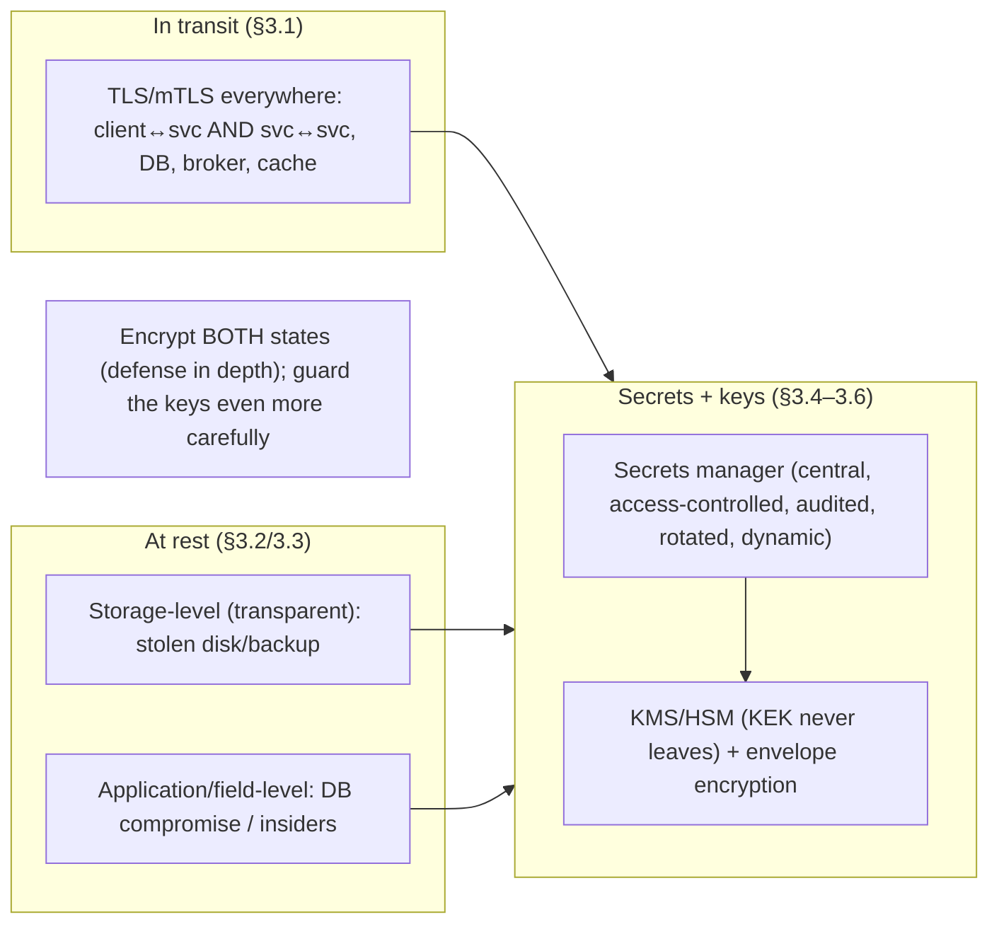

# Lesson 15.4 — Transport & Data-at-Rest Encryption; Secrets Management

> Part 15: Security · Difficulty: 🟡🔴
>
> **Prerequisites:** [3.2.3 TLS/SSL/mTLS/PKI], [13.4 K8s Secrets], [15.1 Threat Modeling], [15.3 Cryptography].
> **Unlocks:** [15.5 Network Security/Zero-Trust], [15.8 Compliance], [Part 20 Capstone].

---

## 1. Learning Objectives

After this lesson you will be able to:

- Explain **encryption in transit** (TLS everywhere — 3.2.3) and **encryption at rest** (data on disk/backups), and why you need **both** (defense in depth — 15.1).
- Distinguish **application-level** vs **storage/disk-level** encryption at rest and their tradeoffs.
- Explain **secrets management** — how to handle credentials, API keys, and encryption keys — and why hardcoding/committing secrets is the classic catastrophic failure.
- Describe secrets-manager capabilities: **central storage, access control, rotation, dynamic secrets, auditing** (Vault / cloud secret stores), and **envelope encryption** with a KMS (15.3).
- Apply best practices: encrypt everywhere by default, never commit secrets, rotate, least privilege, and audit.

---

## 2. Motivation — Protect data at rest, in transit, and the keys to both

Threat modeling (15.1) flags **information disclosure** as a core threat, and cryptography (15.3) gives the tools — but you must apply them to the two states data lives in: **in transit** (moving across networks — 8.1.1: untrusted, eavesdroppable) and **at rest** (stored on disk, in databases, in backups — stealable if the storage is compromised). Encrypting **only one** leaves a gaping hole: TLS protects data on the wire but not the stolen backup tape; disk encryption protects the stolen drive but not the sniffed network traffic. **Defense in depth** (15.1) demands **both** — and modern practice is **encrypt everything, everywhere, by default**.

But encryption is only as good as the **keys and secrets** behind it — and this is where systems fail most catastrophically. **Secrets** (database passwords, API keys, encryption keys, tokens) are constantly **mishandled**: hardcoded in source, **committed to Git** (then leaked forever in history), pasted into config files, shared over Slack, logged accidentally, and **never rotated**. A single leaked credential can compromise an entire system — and secret leakage is one of the most common real-world breach causes. **Secrets management** is the discipline (and tooling) for handling secrets safely: store them **centrally and encrypted** (not in code), enforce **access control + auditing**, **rotate** them, and ideally issue **short-lived dynamic secrets**. This lesson develops encryption in transit and at rest, and secrets management (including KMS/envelope encryption — 15.3) — closing the loop from "we have crypto primitives" to "we protect data and its keys correctly in production."

---

## 3. Theory — From first principles

### 3.1 Encryption in transit

`[CS]` **Encryption in transit** protects data **as it moves** across networks (which are untrusted — 8.1.1) `[CS]`:
- **TLS everywhere** (3.2.3): all traffic — client↔server (HTTPS), **and service↔service** (12.3, via **mTLS** — 15.5) — encrypted so eavesdroppers can't read it (confidentiality) or tamper undetected (integrity), and endpoints are authenticated.
- **Not just the edge** `[BP]`: encrypt **internal** traffic too, not only internet-facing — in **zero-trust** (15.5) the internal network is **not** trusted, so service-to-service calls use **mTLS** (often via a service mesh — 12.7). "TLS terminates at the load balancer and internal traffic is plaintext" is a common gap.
- **Also:** database connections, message brokers (Part 9), cache connections — all should be TLS.
- `[BP]` **Default: TLS on every connection.** Use modern TLS (1.2/1.3), strong ciphers, valid certs (3.2.3); redirect HTTP→HTTPS; enforce HSTS.

### 3.2 Encryption at rest

`[CS]` **Encryption at rest** protects **stored** data so a compromised/stolen storage medium (disk, backup, DB file) doesn't yield readable data `[CS]`:
- Covers: **databases**, **file/object storage** (4.1.3), **backups** (11.8 — often forgotten!), **logs**, **caches with persistence** (Redis — 6.6), and **disks/volumes** (13.4 PVs).
- **Why:** defends against **physical theft**, a **stolen backup**, an **insider with disk access**, or a **misconfigured storage bucket** — threats TLS doesn't touch (§3.1). Also often a **compliance requirement** (15.8: PCI-DSS, HIPAA, GDPR).
- **Levels** (§3.3): storage/disk-level vs application-level encryption.
- `[BP]` **Default: encrypt data at rest** (most managed stores offer it transparently — enable it) — especially backups and anything with sensitive/PII data (15.8).

### 3.3 Application-level vs storage-level encryption at rest

`[BP]` Two places to encrypt at rest, with different protection `[BP]`:
- **Storage/disk-level (transparent) encryption:** the storage system encrypts everything written to disk (full-disk / volume / transparent DB encryption). **Transparent** to the app (no code change), protects against **stolen disk/backup**. **But:** data is **decrypted once loaded** (in memory / to an authorized query) → it does **not** protect against a compromised application, an over-privileged DB user, or an attacker who queries the DB legitimately. Cheap, easy, broad.
- **Application-level (field/column) encryption:** the **application** encrypts specific sensitive fields (e.g., SSNs, card numbers) **before** storing → the data is encrypted **even in the database**, and only the app (with the key) can decrypt. **Protects against DB compromise / over-privileged DB access / insiders**, and enables fine-grained control. **But:** more complex (key management, can't easily index/search encrypted fields), app must handle keys (§3.5).
- `[BP]` **Choose by threat model** (15.1): storage-level for broad baseline protection (stolen disk/backup); **application-level** for **highly sensitive fields** where you must protect against DB-level compromise (defense in depth — encrypt at both levels for the most sensitive data). **Tokenization** (replace sensitive data with a token, store the real value in a separate vault) is a related technique (e.g., card data — PCI — 15.8).

### 3.4 The secrets problem

`[CS]` **Secrets** = credentials and keys the system needs: **database passwords, API keys, encryption keys, tokens, certificates, service credentials** `[CS]`:
- **The classic catastrophic failures** `[BP]`:
  - **Hardcoded in source code** / **committed to version control** — once in Git history, it's **leaked forever** (even if deleted later); public-repo leaks are scanned by attackers within minutes.
  - **In plaintext config files** / environment set insecurely / **baked into container images** (13.2).
  - **Shared over chat/email**, pasted in tickets, **logged accidentally** (secrets in logs — Part 16).
  - **Never rotated** — a leaked secret works indefinitely; long-lived shared credentials.
  - **Over-shared** — one secret used by everything, everyone has access (no least privilege).
- `[BP]` **A single leaked secret can compromise the whole system** — secret leakage is a leading breach cause. Secrets need **deliberate management** (§3.5), not ad-hoc handling. This is the operational reality behind 15.3's "key management is the hardest part."

### 3.5 Secrets management

`[CS]` **Secrets management** = the discipline + tooling for handling secrets securely throughout their lifecycle `[CS]`. A **secrets manager** (Vault, cloud secret stores — representative) provides `[BP]`:
- **Centralized, encrypted storage:** secrets live in a **dedicated, encrypted store** — **not** in code/config/images. Apps **fetch** them at runtime (12-factor config — 13.1) via authenticated API.
- **Access control (least privilege — 15.1):** fine-grained policies — each service/identity accesses **only** the secrets it needs.
- **Auditing (15.8):** log **every** secret access — who read what, when → detect misuse, meet compliance.
- **Rotation:** rotate secrets regularly + on compromise, ideally **automatically**; apps pick up new values without downtime.
- **Dynamic / short-lived secrets** `[BP]`: instead of a static long-lived DB password, the manager **generates a short-lived credential on demand** that **auto-expires** → drastically limits exposure (a leaked credential is useless minutes later — like short-lived tokens — 15.2). The strongest pattern.
- **KMS + envelope encryption** (§3.6): integrate with a **KMS** (15.3) to encrypt the secrets/data keys.
- `[BP]` **Kubernetes note** (13.4): raw K8s Secrets are only base64 → integrate an **external secrets manager** + **etcd encryption at rest** for real security.

### 3.6 KMS and envelope encryption

`[CS]` **Envelope encryption** is the standard pattern for managing encryption keys at scale with a **KMS** (15.3) `[CS]`:
- **The pattern:** encrypt data with a **data encryption key (DEK)**; encrypt the **DEK** with a **key encryption key (KEK)** that lives in the **KMS/HSM** (never leaves it). Store the **encrypted DEK** alongside the data.
- **To decrypt:** send the encrypted DEK to the KMS → KMS decrypts it (using the KEK it holds) → use the DEK to decrypt the data → discard the DEK from memory.
- **Why:** the **KEK never leaves the KMS/HSM** (§3.5/15.3), you can encrypt **huge amounts of data** without exposing the master key, **rotating the KEK** just re-wraps DEKs (not re-encrypting all data), and access is **centrally controlled + audited**.
- `[BP]` This is how cloud encryption-at-rest + secrets managers work under the hood — **envelope encryption + KMS-held KEK** gives scalable, rotatable, auditable key management (15.3 §3.8 in practice).

### 3.7 Putting it together — encrypt everything, guard the keys

`[BP]` The operational data-protection playbook:
- **Encrypt in transit everywhere** (§3.1): TLS on every connection — edge **and** internal service-to-service (mTLS — 15.5); DBs, brokers, caches too.
- **Encrypt at rest by default** (§3.2): storage-level for broad protection (incl. **backups** — 11.8); **application/field-level** for highly sensitive data (defense in depth — §3.3); tokenize where apt (PCI — 15.8).
- **Never put secrets in code/config/images/logs/chat** (§3.4); use a **secrets manager** (§3.5): central encrypted store, least-privilege access, auditing, rotation, **short-lived dynamic secrets**.
- **Manage keys via KMS + envelope encryption** (§3.6, 15.3): KEK in the KMS/HSM, rotate, audit.
- **Least privilege + audit everywhere** (15.1/15.8): who can access which secret/data, logged.
- `[BP]` The principle: **encrypt data in both states (defense in depth), and protect the keys/secrets even more carefully than the data** — because whoever holds the keys holds the data. Ties 15.3's crypto to real production (13.4 K8s secrets, 11.8 backups, 15.8 compliance).

---

## 4. Visual Intuition

### Both states + the keys



### Envelope encryption

```mermaid
flowchart LR
    DATA["Data"] -->|encrypt with DEK| CIPHER["Encrypted data"]
    DEK["Data Encryption Key (DEK)"] -->|encrypt with KEK (in KMS)| EDEK["Encrypted DEK (stored with data)"]
    KMS["KMS/HSM holds KEK (never leaves)"] -.decrypts EDEK on request.-> DEK
    note["Rotate KEK = re-wrap DEKs (not re-encrypt all data); KEK stays in KMS"]
```

---

## 5. Real-World Analogy

Think of protecting **sensitive documents** in a company — while they're being **couriered** and while they're **stored** — plus guarding the **keys** to everything.

- **Encryption in transit = a locked, tamper-evident courier pouch:** whenever documents **travel** between offices, they go in a **locked pouch** only the recipient can open (TLS) — so a courier or interceptor can't read or alter them. Crucially, you use the pouch for **internal inter-office mail too**, not just external shipments — because you **don't trust the hallways either** (zero-trust — 15.5). Leaving internal mail unsealed "because it's inside the building" is the classic gap.
- **Encryption at rest = a locked filing cabinet (and locked backup vault):** documents **sitting in storage** go in a **locked cabinet**, so a burglar who steals the cabinet (or the **backup copies** in the offsite vault — often forgotten!) gets only gibberish. **Storage-level** encryption is like the **whole room being locked** — broad and easy, but once someone's legitimately inside, the papers are readable. **Application/field-level** encryption is like keeping the **most sensitive pages in an additional personal safe** even inside the locked room — so even someone who gets into the room (a compromised database / nosy insider) still can't read them.
- **Secrets = the keys to all these locks — and the classic disaster is careless key-keeping:** the **worst** thing you can do is **write the master combination on a sticky note** (hardcode a secret), **tape it inside the front cover of a library book everyone can check out** (commit to Git — leaked forever in history), **shout it across the office** (share over chat), or **use one key for every lock and hand copies to everyone, forever** (over-shared, never rotated). A single leaked key opens everything.
- **Secrets manager = a guarded, audited key cabinet:** instead, all keys live in a **central, guarded cabinet** (secrets manager) — staff **check out only the specific key they need** (least privilege), every checkout is **logged** (audit), keys are **changed regularly** (rotation), and — best of all — you can issue a **temporary key that self-destructs in 15 minutes** (dynamic short-lived secrets), so even a copied key is useless soon after.
- **Envelope encryption (KMS) = a master key locked in a vault that never comes out:** you don't carry the **master key** around. Instead, each cabinet has its own **working key**, and the **working keys themselves are locked in a small box** whose only opener is the **master key that stays permanently inside the vault** (KMS/HSM). To use a cabinet, you take its locked box **to the vault window**, they unlock it **without the master key ever leaving**, and hand you the working key briefly. Rotating the master key just means **re-locking the small boxes**, not replacing every cabinet lock.

---

## 6. Industry Example

- **TLS everywhere incl. mTLS internal** `[CONV]`: edge HTTPS + service-to-service mTLS (often via a mesh — 12.7) so internal traffic isn't plaintext (§3.1, 15.5). *(Representative.)*
- **Transparent encryption at rest** `[CONV]`: managed databases/object stores/volumes offering enable-and-forget disk-level encryption; backups encrypted (§3.2/3.3, 11.8). *(Representative.)*
- **Application/field-level encryption + tokenization** `[CONV]`: encrypting/tokenizing card numbers, SSNs, PII in the app for PCI/HIPAA (§3.3, 15.8). *(Representative.)*
- **Secrets managers (Vault, cloud secret stores)** `[CONV]`: central storage, access control, rotation, dynamic secrets, auditing (§3.5). *(Representative.)*
- **KMS + envelope encryption** `[CONV]`: DEK/KEK pattern with the KEK held in cloud KMS/HSM (§3.6). *(Representative.)*
- **Secret-in-Git leaks** `[OPINION]`: the recurring breach cause — credentials committed to repos and scanned by attackers (§3.4). *(Representative.)*

---

## 7. Implementation Details

- **TLS on every connection** (§3.1): edge + internal service-to-service (mTLS — 15.5/12.7); DB/broker/cache connections; modern TLS + valid certs (3.2.3); HTTP→HTTPS + HSTS.
- **Encryption at rest by default** (§3.2): enable transparent encryption on DBs/object stores/volumes **and backups** (11.8); **application/field-level** (or tokenization) for highly sensitive data (§3.3, 15.8).
- **Never store secrets in code/config/images/logs/chat** (§3.4); fetch from a **secrets manager** at runtime (12-factor — 13.1).
- **Use a secrets manager** (§3.5): central encrypted store, **least-privilege access**, **audit** every access (15.8), **rotate** (auto + on compromise), prefer **short-lived dynamic secrets**.
- **KMS + envelope encryption** (§3.6, 15.3): KEK in KMS/HSM (never leaves); DEK-per-data; rotate KEK by re-wrapping.
- **Kubernetes** (13.4): external secrets manager + etcd encryption at rest; never plaintext Secrets in Git.
- **Scan for leaked secrets** (14.7 supply chain): pre-commit hooks + repo scanning to catch committed secrets.

---

## 8. Advantages

- **Defense in depth** — protecting both states covers more threats (theft, eavesdropping, insiders) (§3.1/3.2, 15.1).
- **Compliance** — at-rest/in-transit encryption satisfies regulatory requirements (§3.2, 15.8).
- **Field-level protection** — sensitive data safe even against DB compromise (§3.3).
- **Secrets manager** — central, access-controlled, audited, rotatable secrets → smaller leak risk (§3.5).
- **Dynamic secrets** — short-lived credentials drastically limit exposure (§3.5).
- **Envelope encryption** — scalable, rotatable, KMS-guarded key management (§3.6).

---

## 9. Disadvantages / costs

- **Performance overhead** — encryption has CPU/latency cost (mitigated by hardware/AEAD — 15.3).
- **Key/secret management complexity** — the hard part; a KMS/secrets manager to run (§3.5/3.6, 15.3).
- **App-level encryption limits queries** — can't easily index/search encrypted fields (§3.3).
- **Operational integration** — apps must fetch secrets/rotate without downtime (§3.5).
- **Cost** — KMS/secrets-manager/HSM services cost money (1.2.3).
- **Misconfiguration risk** — encryption enabled but keys mishandled = false security (§3.4/3.7).

---

## 10. When NOT to / cautions

- **Don't encrypt in transit only** (or at rest only) — need both (defense in depth) (§3.1/3.2).
- **Don't leave internal traffic plaintext** — encrypt service-to-service (zero-trust) (§3.1, 15.5).
- **Don't forget backups** — encrypt them too (§3.2, 11.8).
- **Don't hardcode/commit secrets** — ever; use a secrets manager (§3.4).
- **Don't use long-lived static shared secrets** where dynamic short-lived ones are possible (§3.5).
- **Don't rely on transparent encryption alone** for data needing protection from DB compromise — add field-level (§3.3).
- **Don't log secrets** (§3.4, Part 16).

---

## 11. Common Mistakes

1. **Secrets in code / committed to Git** — leaked forever; the classic catastrophic failure (§3.4).
2. **TLS only at the edge** — internal traffic plaintext (§3.1, 15.5).
3. **Unencrypted backups** — the protected DB is encrypted but backups aren't (§3.2, 11.8).
4. **Relying on transparent encryption vs DB compromise** — need field-level for sensitive data (§3.3).
5. **Never rotating secrets** — a leaked credential works forever (§3.4/3.5).
6. **Over-shared secrets** — one credential everywhere, no least privilege (§3.4).
7. **Secrets in logs** — accidental logging of credentials (§3.4).
8. **Mishandled keys despite encryption** — false sense of security (§3.4/3.7, 15.3).

---

## 12. Interview Questions

**🟢 Easy**
- What's the difference between encryption in transit and at rest? Why do you need both?
- Why is committing a secret to Git so dangerous?

**🟡 Medium**
- Compare storage-level (transparent) vs application/field-level encryption at rest.
- What does a secrets manager provide beyond just storing secrets?

**🔴 Hard**
- Explain envelope encryption (DEK/KEK) and why the KEK stays in the KMS. How does KEK rotation work without re-encrypting all data?
- What are dynamic/short-lived secrets, and why are they more secure than static credentials?

**⚫ Staff+**
- Design data protection for a system with PII/financial data: TLS everywhere (incl. mTLS internal), at-rest encryption (storage + field-level + tokenization), secrets management (manager + KMS + envelope + dynamic secrets + rotation + audit), and Kubernetes secrets (13.4) — mapped to threats (15.1) and compliance (15.8).
- A breach occurred via a database password committed to a public repo years ago. Diagnose and design a secrets-management remediation: secrets manager, rotation, dynamic secrets, repo scanning, and least privilege.

---

## 13. Production Pitfalls

- **Leaked committed secret:** a DB/API credential in Git history was scanned and abused (§3.4).
- **Plaintext internal traffic sniffed:** TLS terminated at the LB, internal service traffic was plaintext and captured (§3.1, 15.5).
- **Stolen unencrypted backup:** the primary DB was encrypted but backups weren't → data exposed (§3.2, 11.8).
- **DB compromise exposed everything:** transparent encryption didn't help once the attacker queried the DB legitimately; sensitive fields weren't app-encrypted (§3.3).
- **Secret in logs:** a credential was accidentally logged and exposed via log access (§3.4, Part 16).
- **Never-rotated credential:** a long-lived shared secret leaked long ago kept working (§3.4/3.5).
- **False security:** encryption was "on" but keys were hardcoded → no real protection (§3.4/3.7, 15.3).

---

## 14. Optimization Techniques

- **TLS everywhere (edge + mTLS internal via mesh — 12.7)** for full in-transit protection (§3.1).
- **Transparent at-rest encryption (incl. backups) + field-level/tokenization** for sensitive data (defense in depth) (§3.2/3.3).
- **Secrets manager: central, least-privilege, audited, rotated, dynamic short-lived secrets** (§3.5).
- **KMS + envelope encryption** for scalable, rotatable, guarded keys (§3.6, 15.3).
- **Repo/secret scanning + pre-commit hooks** to prevent committed secrets (§3.4, 14.7).
- **Hardware-accelerated crypto / AEAD** to minimize performance cost (15.3).
- **etcd encryption + external secrets on Kubernetes** (13.4).

---

## 15. Summary

Data lives in two states, and **information disclosure** (15.1) threatens both — so **encrypt in transit *and* at rest** (**defense in depth** — 15.1). **Encryption in transit** (TLS — 3.2.3) protects data **moving across untrusted networks** (8.1.1) — and must cover **not just the edge** but **internal service-to-service** traffic (12.3, via **mTLS** — 15.5/12.7), plus DB/broker/cache connections (zero-trust: don't trust the internal network; "TLS only at the LB" is a classic gap). **Encryption at rest** protects **stored** data (databases, object storage, **backups** — 11.8, often forgotten, logs, persisted caches, volumes — 13.4) against stolen disks/backups, insiders, and misconfigured buckets — and is often a **compliance** requirement (15.8). At-rest encryption comes at two levels: **storage/disk-level (transparent)** — encrypts everything on disk, easy and broad, but data is **decrypted once loaded** so it doesn't protect against a compromised app / over-privileged DB user / legitimate query; and **application/field-level** — the app encrypts specific sensitive fields **before storing** so they're **encrypted even in the DB**, protecting against **DB compromise/insiders** (at the cost of complexity + can't easily index encrypted fields) — with **tokenization** a related technique (PCI — 15.8); choose by **threat model** (15.1), often **both** for the most sensitive data. But **encryption is only as strong as the keys and secrets behind it**, and this is where systems fail most catastrophically: **secrets** (DB passwords, API keys, encryption keys, tokens) are routinely **hardcoded, committed to Git (leaked forever in history), baked into images, shared over chat, logged, over-shared, and never rotated** — and a **single leaked secret can compromise everything** (a leading breach cause). **Secrets management** fixes this with a **secrets manager** (Vault/cloud stores): **central encrypted storage** (not in code — apps fetch at runtime — 13.1), **least-privilege access control** (15.1), **auditing** every access (15.8), **rotation** (auto + on compromise), and ideally **short-lived dynamic secrets** (generated on demand, auto-expiring — like short-lived tokens — 15.2 — so a leaked credential is soon useless). Keys are managed via **envelope encryption + KMS/HSM** (15.3): encrypt data with a **DEK**, encrypt the DEK with a **KEK that never leaves the KMS/HSM**, store the wrapped DEK with the data → scalable (encrypt vast data without exposing the master), rotatable (re-wrap DEKs, don't re-encrypt everything), and centrally audited. (On Kubernetes — 13.4 — raw base64 Secrets need an external manager + etcd encryption.) The playbook: **encrypt everything in both states by default (defense in depth), never put secrets in code/config/images/logs, use a secrets manager with least-privilege + audit + rotation + dynamic secrets, and manage keys via KMS + envelope encryption** — because whoever holds the keys holds the data, so **guard the keys even more carefully than the data**.

---

## 16. Revision Notes (flashcard-ready)

- **Q:** In transit vs at rest? **A:** In transit = TLS on the wire (untrusted network); at rest = encrypt stored data (disk/DB/backups). Need both (defense in depth).
- **Q:** Internal traffic encryption? **A:** Encrypt service-to-service too (mTLS — 15.5/12.7); "TLS only at the LB" is a common gap (zero-trust).
- **Q:** Storage-level vs app/field-level at rest? **A:** Storage = transparent, broad, but decrypted once loaded; field-level = app encrypts sensitive fields → protects against DB compromise.
- **Q:** Don't forget to encrypt? **A:** Backups (11.8) — often overlooked.
- **Q:** Classic secret failure? **A:** Hardcoding / committing to Git (leaked forever), baked into images, shared/logged, never rotated.
- **Q:** Secrets manager provides? **A:** Central encrypted storage, least-privilege access, audit, rotation, short-lived dynamic secrets.
- **Q:** Dynamic secrets? **A:** Short-lived credentials generated on demand that auto-expire → a leaked one is soon useless.
- **Q:** Envelope encryption? **A:** Data encrypted with a DEK; DEK encrypted with a KEK that stays in the KMS/HSM; store the wrapped DEK with the data.
- **Q:** Why envelope encryption? **A:** KEK never leaves KMS; encrypt vast data; rotate by re-wrapping DEKs (not re-encrypting all data); central audit.
- **Q:** Kubernetes secrets? **A:** Raw Secrets are base64 (not encrypted) → use external secrets manager + etcd encryption (13.4).

---

## 17. Further Reading + Knowledge-Graph Links

**Foundations (in-platform):**
- **[3.2.3 TLS/SSL/mTLS/PKI]** — encryption in transit.
- **[15.3 Cryptography]** — the primitives + key management this applies.
- **[13.4 K8s Secrets]** — secrets in Kubernetes.
- **[11.8 DR/Backups]** — encrypt backups.
- **[15.1 Threat Modeling]** — information disclosure + defense in depth.

**Unlocks / next:**
- **[15.5 Network Security/Zero-Trust]** — mTLS everywhere.
- **[15.8 Compliance]** — encryption + audit requirements (PCI/GDPR/HIPAA).
- **[Part 20 Capstone]** — data protection for the platform.

**External (canonical):**
- OWASP cryptographic-storage + secrets-management cheat sheets. *(Representative.)*
- HashiCorp Vault / cloud KMS + secrets-manager docs. *(Representative.)*
- NIST guidance on encryption at rest / key management. *(Representative.)*

> **Knowledge-graph:** `15.3 crypto/keys` + `3.2.3 TLS` → **`15.4 encryption in transit + at rest + secrets management`** (TLS everywhere, at-rest levels, secrets manager, KMS+envelope) → `15.5 mTLS/zero-trust` / `15.8 compliance`.
