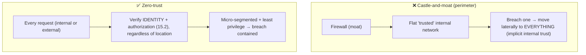
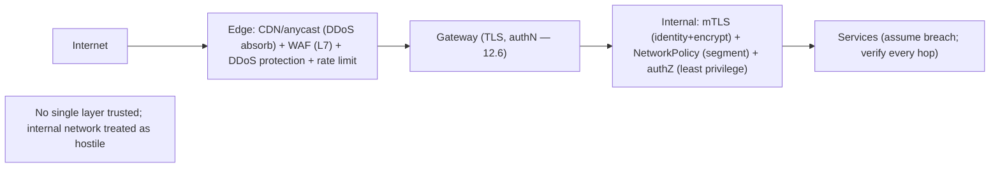

# Lesson 15.5 — Network Security: Zero-Trust, mTLS, WAF, DDoS Mitigation

> Part 15: Security · Difficulty: 🔴
>
> **Prerequisites:** [3.2.3 TLS/mTLS/PKI], [3.3.1 Load Balancing], [3.3.3 CDN/Anycast], [11.4 Load Shedding], [12.7 Service Mesh], [13.4 NetworkPolicy], [15.1 Threat Modeling].
> **Unlocks:** [15.6 OWASP/Vulnerabilities], [15.7 Rate Limiting], [Part 20 Capstone].

---

## 1. Learning Objectives

After this lesson you will be able to:

- Explain the shift from **perimeter security** ("castle-and-moat") to **zero-trust** ("never trust, always verify") and why the perimeter model failed.
- Describe zero-trust principles: **verify every request** (identity + authorization) regardless of network location, **assume breach**, **least privilege**, and **micro-segmentation**.
- Explain **mTLS** (mutual TLS — 3.2.3) as the mechanism for service-to-service identity/encryption in zero-trust (often via a mesh — 12.7).
- Describe **WAF** (Web Application Firewall — L7 filtering) and **DDoS mitigation** (absorbing/deflecting volumetric attacks).
- Combine these into a layered network-security posture (defense in depth — 15.1).

---

## 2. Motivation — The perimeter is gone

For decades, network security followed the **castle-and-moat** model: build a strong **perimeter** (firewall) around the network, treat everything **outside** as untrusted and everything **inside** as trusted. This model has **catastrophically failed** for modern systems. Once an attacker breaches the perimeter (a phished credential, a compromised service, an insider), they're **inside the trusted zone** and can move **laterally** to everything — because the internal network implicitly trusts internal traffic (there are no internal checks). And the perimeter itself has **dissolved**: cloud, microservices (Part 12), remote work, SaaS, and mobile mean there's **no single boundary** — "inside" and "outside" are blurred.

**Zero-trust** is the response: **"never trust, always verify"** — trust **no** network location (internal or external), and **verify every request** (authenticate + authorize — 15.2) based on **identity**, not network position. It embodies **assume breach** (15.1): design as if attackers are already inside, so a breach of one component doesn't grant access to others (**least privilege + micro-segmentation** — 15.1/13.4). The mechanism for service-to-service zero-trust is **mTLS** (3.2.3) — mutual authentication + encryption on every internal call (often transparently via a **service mesh** — 12.7). At the edge, two more controls defend against application-layer attacks (**WAF** — filtering malicious requests) and **volumetric attacks** (**DDoS mitigation** — absorbing floods). This lesson develops zero-trust, mTLS, WAF, and DDoS mitigation as the modern network-security posture — layered, identity-based, and breach-assuming.

---

## 3. Theory — From first principles

### 3.1 Perimeter security and why it failed

`[CS]` **Perimeter ("castle-and-moat") security:** a strong boundary (firewall) separates the **trusted internal network** from the **untrusted internet**; internal traffic is **implicitly trusted** `[CS]`:
- **Why it failed** `[BP]`:
  - **Lateral movement:** once an attacker gets **inside** (phishing, a compromised service, a vulnerability, an insider), the **flat, trusting internal network** lets them move freely to **everything** — the breach of one thing compromises all.
  - **The perimeter dissolved:** cloud, microservices (Part 12), remote work, SaaS, mobile, third-party integrations → there's **no single boundary** anymore; "inside" is ill-defined.
  - **Implicit trust is the flaw:** trusting traffic because it's "internal" means **no verification** internally — exactly what an attacker exploits.
- `[BP]` The lesson: **network location is not a proxy for trust.** A request from inside is **not** trustworthy just because it's inside.

### 3.2 Zero-trust — never trust, always verify

`[CS]` **Zero-trust** replaces location-based trust with **per-request verification based on identity** `[CS]`. Core principles `[BP]`:
- **Never trust, always verify:** **every** request is authenticated + authorized (15.2), **regardless of source** (internal or external) — no implicit trust for being "inside."
- **Verify explicitly by identity:** decisions based on **strong identity** (of user *and* workload/service — mTLS — §3.3), plus context (device, location, behavior), not network position.
- **Assume breach (15.1):** design as if attackers are already inside → **limit blast radius**.
- **Least privilege (15.1):** minimal access per identity → a compromised component can reach little.
- **Micro-segmentation:** segment the network finely (per-service — NetworkPolicy — 13.4) so lateral movement is blocked; each service can talk only to what it's explicitly allowed.
- **Continuous verification:** re-verify continuously (short-lived credentials — 15.2/15.4), not once-at-the-door.
- `[BP]` **The model:** treat **every network as hostile** (even your own — the trust-boundary/8.1.1 view taken to its conclusion). Verify identity + authorization on **every hop**, everywhere.

### 3.3 mTLS — service identity + encryption

`[CS]` **Mutual TLS (mTLS)** is the primary mechanism for **service-to-service** zero-trust (3.2.3) `[CS]`:
- Regular TLS authenticates the **server** to the client; **mTLS** authenticates **both** — each side presents a **certificate**, so both **prove their identity** (cryptographic **workload identity**) and the channel is **encrypted** (confidentiality + integrity — 15.4).
- In zero-trust, **every internal service-to-service call uses mTLS** → each service **knows and verifies** who's calling (identity for authorization), and traffic is **encrypted even internally** (§15.4 — no plaintext internal traffic).
- `[BP]` **Via a service mesh** (12.7): the mesh's sidecars provide **automatic mTLS** with **auto cert issuance/rotation** (from the mesh CA) — **without app code changes** — making zero-trust mTLS practical across a large polyglot fleet. This is a top reason to adopt a mesh (12.7 §3.4).
- Combined with **authorization policies** (which service may call which — 15.2/12.7) and **NetworkPolicy** (13.4 — network-level segmentation), mTLS delivers identity-based zero-trust for east-west traffic (12.6).

### 3.4 WAF — Web Application Firewall

`[CS]` A **WAF** filters/monitors **HTTP(S) traffic at L7** to block **application-layer attacks** (contrast a network firewall at L3/L4) `[CS]`:
- Sits in front of web apps/APIs (at the edge — often with the CDN/gateway — 3.3.3/12.6) and inspects requests for **malicious patterns**: **SQL injection, XSS, common OWASP attacks** (15.6), bad bots, known exploit signatures.
- **Models:** **negative** (block known-bad patterns/signatures) and **positive** (allow only known-good — stricter). Managed rulesets (e.g., OWASP Core Rule Set — representative).
- `[BP]` **Value + limits:** a WAF is a useful **defense-in-depth** layer (15.1) that blocks common/automated attacks and buys time to patch — **but it's not a substitute** for secure code (15.6): it can be bypassed, and false positives block legitimate traffic. **Fix the vulnerability in the app; use the WAF as an additional layer**, not the only one.

### 3.5 DDoS mitigation

`[CS]` A **DDoS (Distributed Denial of Service)** attack floods a system from **many sources** to exhaust its resources and make it **unavailable** (the "D" in STRIDE — 15.1) `[CS]`:
- **Types:** **volumetric** (overwhelm bandwidth — huge traffic floods), **protocol** (exhaust connection/state resources — e.g., SYN floods), and **application-layer (L7)** (expensive requests that look legitimate — hardest to distinguish).
- **Mitigation** `[BP]`:
  - **Absorb with scale/CDN/anycast** (3.3.3): a **CDN + anycast** spreads and absorbs volumetric traffic across a huge global edge, far from your origin — the primary volumetric defense.
  - **Scrubbing centers:** route traffic through providers that **filter out attack traffic** and forward only legitimate requests.
  - **Rate limiting + traffic shaping** (15.7/11.4): cap request rates per source; **shed** excess load (11.4).
  - **Upstream/provider defenses:** cloud DDoS-protection services + provisioned headroom.
  - **L7 defenses:** WAF (§3.4), bot detection, challenge (CAPTCHA), and application-level rate limiting (15.7) for application-layer attacks.
- `[BP]` **Key insight:** you **can't out-provision** a large volumetric DDoS at your origin — you rely on **massive distributed edge capacity (CDN/anycast/scrubbing)** to absorb it upstream, plus **rate limiting/shedding** (15.7/11.4) and **graceful degradation** (11.4) to survive what gets through. Ties directly to availability (14.1) and resilience (11.4).

### 3.6 Defense in depth — layering it all

`[BP]` Network security is **layered** (defense in depth — 15.1) `[BP]`:
- **Edge:** CDN/anycast (DDoS absorption — 3.3.3), **WAF** (L7 filtering — §3.4), **DDoS protection**, TLS termination + rate limiting (15.7) at the gateway (12.6).
- **Perimeter (still useful, just not sufficient):** network firewalls, restricted ingress — but **not** the only defense.
- **Internal (zero-trust):** **mTLS** everywhere (§3.3), **NetworkPolicy** micro-segmentation (13.4), identity-based **authorization** (15.2), least privilege (15.1).
- **Everywhere:** encryption in transit (15.4), continuous verification, monitoring/audit (15.8/Part 16), assume breach.
- `[BP]` No single layer is trusted alone — **the perimeter is one layer among many, and the internal network is treated as hostile**. Zero-trust doesn't remove the firewall; it **removes the assumption that inside = safe**.

### 3.7 Putting it together — the zero-trust network posture

`[BP]` A modern posture:
- **Adopt zero-trust** (§3.2): never trust network location; **verify every request by identity + authorization** (15.2); assume breach; least privilege; micro-segment.
- **mTLS for east-west** (§3.3): mutual auth + encryption on every internal call, via a **service mesh** (12.7) for automatic certs/rotation; + **NetworkPolicy** (13.4).
- **Edge defenses** (§3.4/3.5): **CDN/anycast + DDoS protection** (absorb volumetric), **WAF** (L7 filtering), **rate limiting** (15.7) — at the gateway (12.6).
- **Defense in depth** (§3.6): layer edge + perimeter + internal + encryption + monitoring; trust no single layer.
- **Fix root causes** (§3.4): WAF/DDoS/network controls **complement** secure code (15.6) and secure design (15.1) — they don't replace them.
- `[BP]` The result: a breach of one component (assume breach — 15.1) doesn't cascade — identity-based verification + micro-segmentation + least privilege **contain** it, while edge defenses absorb volumetric/application-layer attacks. Network location becomes **irrelevant to trust**; **identity + policy** decide everything.

---

## 4. Visual Intuition

### Perimeter (failed) vs zero-trust

### Layered network security (defense in depth)

---

## 5. Real-World Analogy

Think of securing a **large corporate campus** — the old way (guarded gate) vs the modern way (verify everyone, everywhere).

- **Perimeter security = one guarded front gate:** the old campus had a **strong gate** — show a badge to get in, and once inside, **you could walk into any building freely** because "everyone inside is trusted." The fatal flaw: a **thief who tailgates through the gate** (breaches the perimeter — phishing, a compromised service) can then **roam the entire campus unchallenged** (lateral movement) — and with staff now working from cafés and home (cloud/remote), **the gate no longer even surrounds everyone**.
- **Zero-trust = verify at every door, trust no hallway:** the modern campus **checks your badge at every single door**, not just the gate — the **research lab, the finance office, the server room** each verify **who you are and whether you're allowed *there***, regardless of the fact that you're already "inside" (never trust, always verify by **identity**). It **assumes a thief may already be inside**, so each room is **individually locked** (micro-segmentation) and staff can enter **only the rooms they need** (least privilege) — so a thief who gets into the lobby **still can't reach the vault**.
- **mTLS = mutual badge checks between departments:** when the **finance office sends a courier to the server room**, they **both show verified ID badges to each other** (mutual authentication) and use a **sealed pouch** (encryption) — so neither can be impersonated and no one can eavesdrop, **even inside the building**. A **central badge office** issues and **auto-renews** everyone's badges (the mesh CA — 12.7) so this happens seamlessly everywhere.
- **WAF = a screener inspecting incoming mail for threats:** at the mailroom, a **screener examines incoming packages** for **known dangerous patterns** (letter bombs, suspicious substances) — blocking obvious attacks (SQL injection, XSS). It's a valuable layer, but it's **not a substitute** for the buildings being soundly built (secure code) — a clever attacker can disguise a threat, so you still fix the actual vulnerabilities.
- **DDoS mitigation = handling a coordinated mob at the gates:** if **millions of people simultaneously rush the campus** to block real employees from entering (volumetric DDoS), **no single gate can process them** — so you rely on a **vast network of remote checkpoints spread across the whole city** (CDN/anycast/scrubbing) that **absorb and filter the mob far from campus**, forwarding only legitimate visitors — plus **turnstiles that cap the entry rate** (rate limiting) and a plan to **keep serving essential functions** even if partly overwhelmed (graceful degradation).

---

## 6. Industry Example

- **Google BeyondCorp (zero-trust pioneer)** `[CONV]`: removing implicit network trust, verifying every request by user + device identity regardless of location (§3.2). *(Representative.)*
- **Service-mesh mTLS** `[CONV]`: automatic mutual TLS + workload identity + cert rotation for east-west zero-trust (§3.3, 12.7). *(Representative.)*
- **WAF + CDN edge** `[CONV]`: managed WAFs (OWASP CRS) at CDN/edge blocking L7 attacks (§3.4, 3.3.3). *(Representative.)*
- **CDN/anycast DDoS absorption + scrubbing** `[CONV]`: large edge networks absorbing volumetric attacks (§3.5, 3.3.3). *(Representative.)*
- **NetworkPolicy micro-segmentation** `[CONV]`: Kubernetes default-deny + explicit-allow pod networking (§3.2/3.3, 13.4). *(Representative.)*

---

## 7. Implementation Details

- **Adopt zero-trust** (§3.2): authenticate + authorize **every** request by **identity** (15.2), regardless of location; assume breach; least privilege; micro-segment (NetworkPolicy — 13.4); continuous verification (short-lived creds — 15.2/15.4).
- **mTLS for all internal traffic** (§3.3, 3.2.3): mutual auth + encryption; use a **service mesh** (12.7) for automatic certs/rotation + authz policies; no plaintext internal traffic (15.4).
- **Edge WAF** (§3.4): L7 filtering (OWASP CRS) at CDN/gateway (3.3.3/12.6) — as defense in depth, **not** a substitute for secure code (15.6).
- **DDoS mitigation** (§3.5): CDN/anycast + provider DDoS protection (absorb volumetric); rate limiting (15.7) + load shedding (11.4) + graceful degradation (11.4); L7 bot/challenge defenses for application-layer floods.
- **Layer everything (defense in depth)** (§3.6): edge + perimeter + internal + encryption (15.4) + monitoring/audit (15.8/Part 16).
- **Fix root causes** (§3.7): network controls complement — don't replace — secure code (15.6) + secure design (15.1).

---

## 8. Advantages

- **Contains breaches** — zero-trust + micro-segmentation + least privilege stop lateral movement (§3.2).
- **Location-independent** — works for cloud/remote/microservices where the perimeter dissolved (§3.1/3.2).
- **Identity-based** — trust decisions on verified identity, not network position (§3.2/3.3).
- **mTLS** — mutual auth + internal encryption, automatic via a mesh (§3.3, 12.7).
- **Edge protection** — WAF blocks common L7 attacks; CDN/anycast absorbs DDoS (§3.4/3.5).
- **Defense in depth** — layered, resilient posture (§3.6).

---

## 9. Disadvantages / costs

- **Complexity** — zero-trust (identity everywhere, mTLS, segmentation, policies) is complex to implement (§3.2/3.3).
- **Operational overhead** — mesh/mTLS/cert management, NetworkPolicy, WAF tuning (§3.3/3.4, 12.7).
- **WAF false positives/bypasses** — blocks legitimate traffic; not a substitute for secure code (§3.4).
- **DDoS cost** — CDN/scrubbing/DDoS-protection services cost money; can't out-provision at origin (§3.5).
- **Performance** — mTLS + WAF + inspection add latency (§3.3/3.4).
- **Migration effort** — moving from perimeter to zero-trust is a significant journey (§3.7).

---

## 10. When NOT to / cautions

- **Don't trust the internal network** — that's the failed perimeter assumption (§3.1).
- **Don't rely on the perimeter alone** — defense in depth + zero-trust (§3.1/3.6).
- **Don't leave internal traffic unauthenticated/plaintext** — mTLS (§3.3, 15.4).
- **Don't treat a WAF as a fix** for vulnerabilities — fix the code (§3.4, 15.6).
- **Don't try to out-provision volumetric DDoS at origin** — absorb at the edge (§3.5).
- **Don't skip least privilege / micro-segmentation** — they contain breaches (§3.2).

---

## 11. Common Mistakes

1. **Trusting internal traffic** — flat internal network → lateral movement on breach (§3.1).
2. **Perimeter-only security** — one firewall, no internal verification (§3.1/3.6).
3. **Plaintext/unauthenticated internal calls** — no mTLS (§3.3, 15.4).
4. **WAF as the only defense** — bypassed → exploited; secure the code too (§3.4, 15.6).
5. **No DDoS plan / out-provisioning at origin** — overwhelmed by volumetric attacks (§3.5).
6. **No micro-segmentation / over-broad access** — breach spreads everywhere (§3.2, 13.4).
7. **Once-at-the-door verification** — long-lived trust instead of continuous (§3.2).
8. **Ignoring L7 DDoS** — assuming CDN handles all; app-layer floods slip through (§3.5).

---

## 12. Interview Questions

**🟢 Easy**
- What is zero-trust, and how does it differ from perimeter security?
- What is mTLS, and how does it differ from regular TLS?

**🟡 Medium**
- Why did the castle-and-moat model fail? What is lateral movement?
- What does a WAF do, and why isn't it a substitute for secure code?

**🔴 Hard**
- How do you implement zero-trust for service-to-service traffic (mTLS + identity + micro-segmentation + least privilege), and how does a service mesh help (12.7)?
- Explain DDoS types (volumetric/protocol/L7) and their mitigations. Why can't you out-provision a volumetric attack at your origin?

**⚫ Staff+**
- Design the network-security posture for a microservices system (Part 12) on Kubernetes: zero-trust (mTLS via mesh — 12.7, NetworkPolicy — 13.4, identity-based authz), edge (CDN/WAF/DDoS/rate-limiting — 15.7), defense in depth, and how a breach of one service is contained.
- Migrate an organization from perimeter security to zero-trust. What changes (verify every request by identity, mTLS internally, micro-segmentation, least privilege, continuous verification), and what are the challenges?

---

## 13. Production Pitfalls

- **Lateral movement breach:** an attacker compromised one internal service and reached the whole flat network (no zero-trust/segmentation) (§3.1/3.2).
- **Plaintext internal traffic sniffed:** no internal mTLS → captured sensitive service-to-service data (§3.3, 15.4).
- **WAF bypass:** attackers evaded WAF rules and exploited an unpatched app vulnerability (WAF wasn't a fix) (§3.4, 15.6).
- **Volumetric DDoS outage:** the origin was overwhelmed because there was no CDN/anycast/scrubbing to absorb it (§3.5).
- **L7 DDoS slipped through:** expensive "legitimate-looking" requests exhausted the app despite CDN (§3.5) — needed rate limiting (15.7) + shedding (11.4).
- **Over-broad service permissions:** a compromised service had access to everything (no least privilege/segmentation) (§3.2, 13.4).

---

## 14. Optimization Techniques

- **Zero-trust + micro-segmentation + least privilege** to contain breaches (§3.2, 13.4).
- **Automatic mTLS via a service mesh** (12.7) for scalable east-west identity + encryption (§3.3).
- **Edge WAF + CDN/anycast DDoS absorption** as defense in depth (§3.4/3.5, 3.3.3).
- **Rate limiting (15.7) + load shedding + graceful degradation (11.4)** to survive what gets through (§3.5).
- **Short-lived credentials + continuous verification** (15.2/15.4) rather than long-lived trust (§3.2).
- **Layer everything (defense in depth)** — never trust a single control (§3.6).
- **Fix root-cause vulnerabilities** (15.6) so network controls are backup, not the only line (§3.7).

---

## 15. Summary

Network security has shifted from **perimeter ("castle-and-moat")** — a strong firewall around a **trusted internal network** — to **zero-trust**, because the perimeter model **catastrophically failed**: once an attacker breaches the perimeter (phishing, a compromised service, an insider), the **flat, implicitly-trusting internal network** lets them **move laterally** to everything, and the perimeter itself **dissolved** (cloud, microservices — Part 12, remote work, SaaS) — so **network location is not a proxy for trust**. **Zero-trust** ("**never trust, always verify**") replaces location-based trust with **per-request verification by identity**: **authenticate + authorize every request** (15.2) regardless of source, **verify explicitly by strong identity** (user *and* workload), **assume breach** (15.1 — design as if attackers are inside), enforce **least privilege** (15.1) and **micro-segmentation** (13.4 NetworkPolicy — so lateral movement is blocked), and **verify continuously** (short-lived credentials — 15.2/15.4) — treating **every network as hostile**. The mechanism for **service-to-service** zero-trust is **mTLS** (mutual TLS — 3.2.3): unlike regular TLS (authenticates only the server), mTLS authenticates **both** sides via **certificates** (cryptographic **workload identity**) and **encrypts** internal traffic — practically delivered by a **service mesh** (12.7) with automatic cert issuance/rotation, no app changes, plus authorization policies and NetworkPolicy (13.4). At the **edge**, two more controls: a **WAF (Web Application Firewall)** filters **L7 HTTP(S)** traffic for malicious patterns (SQL injection, XSS, OWASP attacks — 15.6, bad bots) — a valuable **defense-in-depth** layer but **not a substitute for secure code** (it can be bypassed; **fix the vulnerability**); and **DDoS mitigation** defends against floods that exhaust resources (**volumetric**, **protocol**, **application-layer/L7**) — you **can't out-provision a large volumetric attack at your origin**, so you rely on **CDN + anycast + scrubbing** (3.3.3) to **absorb it upstream** across a massive global edge, plus **rate limiting** (15.7) + **load shedding + graceful degradation** (11.4) to survive what gets through (L7 attacks need bot detection/challenges + app-level rate limiting). These combine into a **layered, defense-in-depth** posture (15.1): **edge** (CDN/anycast/WAF/DDoS/rate-limiting at the gateway — 12.6) + **perimeter** (still useful, not sufficient) + **internal** (mTLS + micro-segmentation + identity-based authz + least privilege) + **encryption everywhere** (15.4) + **monitoring/audit** (15.8) — where **no single layer is trusted** and the **internal network is treated as hostile**. Zero-trust doesn't remove the firewall; it removes the **assumption that inside = safe** — so a breach of one component is **contained** by identity-based verification, micro-segmentation, and least privilege, while edge defenses absorb volumetric/application attacks. Network controls **complement** — never replace — secure code (15.6) and secure design (15.1).

---

## 16. Revision Notes (flashcard-ready)

- **Q:** Perimeter security's fatal flaw? **A:** Implicit internal trust → breach the perimeter → lateral movement to everything; and the perimeter dissolved (cloud/remote/microservices).
- **Q:** Zero-trust? **A:** Never trust, always verify — authenticate + authorize every request by identity regardless of location; assume breach; least privilege; micro-segment.
- **Q:** Zero-trust core principles? **A:** Verify explicitly (identity), assume breach, least privilege, micro-segmentation, continuous verification.
- **Q:** mTLS vs TLS? **A:** TLS authenticates the server; mTLS authenticates BOTH sides via certs (workload identity) + encrypts — for service-to-service zero-trust.
- **Q:** How is mTLS made practical at scale? **A:** A service mesh (12.7) — automatic mTLS + cert issuance/rotation, no app changes.
- **Q:** WAF? **A:** L7 HTTP filtering for malicious patterns (SQLi/XSS/OWASP); defense-in-depth layer, NOT a substitute for secure code.
- **Q:** DDoS types? **A:** Volumetric (bandwidth), protocol (SYN/connection), application-layer/L7 (expensive legit-looking requests).
- **Q:** Volumetric DDoS defense? **A:** Can't out-provision at origin — absorb via CDN/anycast/scrubbing upstream + rate limiting + shedding.
- **Q:** What contains a breach in zero-trust? **A:** Identity-based verification + micro-segmentation + least privilege → no lateral movement.
- **Q:** Does zero-trust remove the firewall? **A:** No — it removes the assumption that "inside = safe"; firewall is one layer of defense in depth.

---

## 17. Further Reading + Knowledge-Graph Links

**Foundations (in-platform):**
- **[3.2.3 TLS/mTLS/PKI]** — the mTLS mechanism.
- **[12.7 Service Mesh]** — automatic mTLS + zero-trust east-west.
- **[13.4 NetworkPolicy]** — micro-segmentation.
- **[3.3.3 CDN/Anycast]** — DDoS absorption at the edge.
- **[11.4 Load Shedding]** — surviving overload/DDoS.
- **[15.1 Threat Modeling]** — assume breach, defense in depth, trust boundaries.

**Unlocks / next:**
- **[15.6 OWASP/Vulnerabilities]** — the L7 attacks WAFs filter.
- **[15.7 Rate Limiting]** — abuse/DDoS control.
- **[Part 20 Capstone]** — network security for the platform.

**External (canonical):**
- Google BeyondCorp papers (zero-trust). *(Representative.)*
- NIST SP 800-207 (Zero Trust Architecture). *(Representative.)*
- OWASP WAF / DDoS resources. *(Representative.)*

> **Knowledge-graph:** `15.1 assume-breach/defense-in-depth` + `3.2.3 mTLS` + `12.7 mesh` + `3.3.3 CDN/anycast` → **`15.5 network security (zero-trust, mTLS, WAF, DDoS)`** → `15.6 OWASP` / `15.7 rate limiting`.
