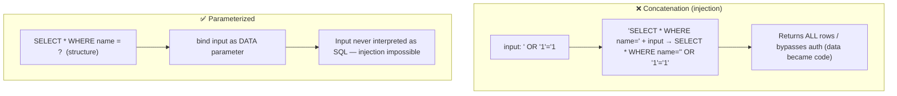
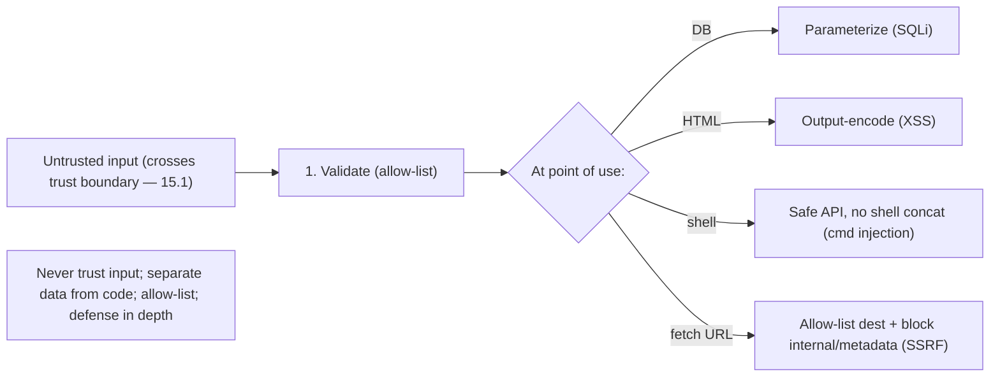

# Lesson 15.6 — Common Vulnerabilities (OWASP), Input Validation, Injection, SSRF

> Part 15: Security · Difficulty: 🔴
>
> **Prerequisites:** [15.1 Threat Modeling (trust boundaries)], [15.2 AuthN/AuthZ (broken access control)], [15.4 Encryption/Secrets], [15.5 WAF].
> **Unlocks:** [15.7 Rate Limiting], [15.8 Compliance], [Part 20 Capstone].

---

## 1. Learning Objectives

After this lesson you will be able to:

- Explain the **OWASP Top 10** as a practical catalog of the most common, high-impact web vulnerabilities, and use it as a checklist.
- Explain the **root cause of injection** (SQL injection, command injection, XSS) — **mixing untrusted data with code/commands** — and the correct fixes (parameterization, output encoding, not string concatenation).
- Apply **input validation** (allow-list) and **output encoding** as complementary defenses, and know why validation alone isn't enough.
- Explain **SSRF** (Server-Side Request Forgery) and **broken access control** (15.2) — two consistently top-ranked vulnerabilities — and their mitigations.
- Connect to earlier principles: trust boundaries (15.1), never trust input, defense in depth, secure defaults.

---

## 2. Motivation — The same bugs, over and over

Most real-world breaches don't come from exotic cryptographic breaks — they come from a **small set of common, well-understood, entirely preventable** application vulnerabilities that developers keep reintroducing. The **OWASP Top 10** catalogs these — **broken access control** (15.2), **injection**, **cryptographic failures** (15.3/15.4), **security misconfiguration**, **SSRF**, and more — precisely so teams have a **practical checklist** of what actually gets exploited. Knowing this list, and the root causes behind it, prevents the majority of breaches.

The single most important root cause to understand is **injection**: it arises whenever **untrusted input is mixed with code or commands** so that data is **interpreted as instructions**. **SQL injection** (input becomes part of a SQL query), **command injection** (input becomes part of a shell command), and **XSS** (input becomes executable script in a victim's browser) are all the **same fundamental flaw** — and all have the **same class of fix**: **keep data and code separate** (parameterized queries, output encoding), never build commands by **string concatenation** with untrusted input. This connects directly to trust boundaries (15.1) — **data crossing a trust boundary must never be trusted**, and must be **validated** (allow-list) and, at the point of use, **treated as data, not code**. This lesson develops the OWASP Top 10, injection and its fixes, input validation, XSS, SSRF, and broken access control — the practical vulnerabilities every architect must design against.

---

## 3. Theory — From first principles

### 3.1 The OWASP Top 10 — the practical checklist

`[CS]`/`[CONV]` The **OWASP Top 10** is a widely-referenced, periodically-updated list of the **most critical web application security risks** — a practical **awareness + checklist** tool `[CONV]`. Representative categories (recent lists — details evolve) `[CONV]`:
- **Broken Access Control** — missing/wrong authorization (15.2) — consistently **#1** (IDOR, privilege escalation).
- **Cryptographic Failures** — weak/missing encryption, bad key handling (15.3/15.4).
- **Injection** — SQL/command/LDAP injection, XSS (§3.2–3.4).
- **Insecure Design** — missing threat modeling / security-by-design (15.1).
- **Security Misconfiguration** — default creds, verbose errors, open cloud buckets, unnecessary features (attack surface — 15.1).
- **Vulnerable/Outdated Components** — unpatched dependencies (supply chain — 14.7).
- **Identification & Authentication Failures** — weak auth, session bugs (15.2).
- **Software/Data Integrity Failures** — untrusted deserialization, unsigned updates (supply chain — 14.7).
- **Security Logging/Monitoring Failures** — can't detect/investigate breaches (15.8/Part 16).
- **SSRF** — server tricked into making requests (§3.6).
- `[BP]` **Use it as a design + review checklist** (alongside STRIDE — 15.1): for each item, ask "are we vulnerable, and what's our mitigation?" It's the highest-ROI security reading.

### 3.2 Injection — the root cause

`[CS]` **Injection** occurs when **untrusted input is combined with code/commands such that the input is interpreted as part of the instruction** rather than as pure data `[CS]`:
- **The root cause:** **mixing data and code** — typically by **string concatenation** — so an attacker's input **breaks out of the data context** and becomes **executed instructions**.
- **Family:** **SQL injection** (input → part of a SQL query — §3.3), **command injection** (input → part of an OS shell command), **LDAP/NoSQL/XML injection**, and **XSS** (input → executable script in a browser — §3.4). All the **same fundamental flaw**.
- `[BP]` **The universal fix: separate data from code** — never build commands by concatenating untrusted input; use mechanisms that treat input **strictly as data** (parameterization/prepared statements — §3.3, safe APIs, output encoding — §3.4). Plus **validate input** (§3.5) as defense in depth.

### 3.3 SQL injection and parameterized queries

`[CS]` **SQL injection (SQLi):** untrusted input becomes part of a SQL query, letting an attacker **alter the query** — read/modify/delete data, bypass auth, sometimes execute commands `[CS]`:
- **The flaw (concatenation):** `"SELECT * FROM users WHERE name = '" + input + "'"` — input like `' OR '1'='1` turns the query into one that returns **all rows** (or worse, `'; DROP TABLE users; --`).
- **The fix — parameterized queries / prepared statements** `[BP]`: send the query **structure** and the **data separately** to the database — `SELECT * FROM users WHERE name = ?` with the value bound as a **parameter**. The database treats the parameter **strictly as data**, never as SQL → injection is **structurally impossible**. **This is the correct, definitive fix** — not escaping/blocklisting (fragile).
- Also: **ORMs** (used correctly) parameterize; **least-privilege DB accounts** (15.1) limit damage; **stored procedures** (used safely). **Never** build queries by string concatenation with untrusted input.

### 3.4 XSS — cross-site scripting

`[CS]` **XSS (Cross-Site Scripting):** untrusted input is rendered into a web page such that it **executes as script in a victim's browser** — stealing sessions/tokens (15.2), performing actions as the user, defacing pages `[CS]`:
- **Types:** **stored** (malicious script saved and served to others), **reflected** (script in a request reflected into the response), **DOM-based** (client-side).
- **The fix — output encoding / contextual escaping** `[BP]`: when rendering untrusted data into HTML/JS/attributes/URLs, **encode it for that context** so it's displayed as **text, not executed** as code (the browser's data/code separation). Use **framework auto-escaping** (React/modern templating escape by default — secure by default) rather than raw string HTML. Plus **Content Security Policy (CSP)** as defense in depth (restrict what scripts can run), and `HttpOnly` cookies (15.2) so stolen scripts can't read tokens.
- `[BP]` XSS is **injection into the browser** — same root cause (data-as-code), same class of fix (keep data as data via encoding).

### 3.5 Input validation (allow-list)

`[BP]` **Input validation** = checking that input **conforms to expectations** before processing — a defense-in-depth layer `[BP]`:
- **Allow-list (positive) validation is far stronger than block-list (negative):** define **what's *allowed*** (e.g., "a username is 3–20 alphanumeric chars," "an amount is a positive number") and **reject everything else** — rather than trying to enumerate all *bad* inputs (attackers find what you missed). Allow-list = **secure by default**.
- **Validate at the trust boundary** (15.1): all input crossing from untrusted to trusted (API params, forms, uploads, headers, inter-service data — 12.3) must be validated — **never trust the client**.
- `[BP]` **Crucial caveat: input validation is NOT a substitute for the injection fixes** (§3.3/3.4). Validation reduces attack surface and catches obvious bad input, but the **definitive** injection defenses are **parameterization + output encoding** (data/code separation at the point of use). Do **both** (defense in depth): validate input **and** parameterize/encode at use.

### 3.6 SSRF — Server-Side Request Forgery

`[CS]` **SSRF:** an attacker tricks the **server** into making **requests to unintended destinations** — typically by controlling a URL the server fetches `[CS]`:
- **The attack:** an app takes a user-supplied URL (e.g., "fetch this image/webhook/URL") and the attacker points it at **internal resources** the server can reach but the attacker can't — internal services (12.3), admin endpoints, or (classically) **cloud metadata endpoints** that hand out credentials → **crossing a trust boundary** using the server as a proxy (15.1).
- **Why dangerous:** the server is **inside the trusted network** (or was — zero-trust — 15.5), so SSRF lets the attacker reach internal/protected resources and often **exfiltrate cloud credentials** → major breaches.
- **Mitigations** `[BP]`: **allow-list** permitted destinations (not block-list — §3.5), **validate/sanitize URLs**, **block access to internal IP ranges + metadata endpoints**, use **network segmentation** (13.4/15.5) so the fetching service **can't reach** sensitive internals, disable unneeded URL schemes/redirects, and require authentication on internal services (zero-trust — 15.5).
- `[BP]` SSRF is a top-ranked OWASP risk because cloud/microservices architectures give the server lots of reachable internal targets — **zero-trust + segmentation + allow-listing** are the core defenses.

### 3.7 The unifying principles

`[BP]` These vulnerabilities share root causes and defenses (tying to 15.1) `[BP]`:
- **Never trust input** — data crossing a **trust boundary** (15.1) is hostile until validated + safely handled.
- **Separate data from code** — parameterize (SQLi), encode (XSS), safe APIs (command injection) — the definitive injection defense.
- **Allow-list, not block-list** — for validation and destinations (SSRF) — secure by default.
- **Defense in depth** (15.1) — validate input **and** parameterize/encode; WAF (15.5) as an extra layer; least privilege (DB accounts, service reachability) to limit blast radius.
- **Secure defaults + secure design** (15.1) — framework auto-escaping, secure config, threat modeling.
- **Enforce authorization server-side** (15.2) — broken access control is #1.
- **Patch dependencies** (14.7) and **log/monitor** (15.8/Part 16) to detect exploitation.
- `[BP]` The OWASP Top 10 + STRIDE (15.1) + these principles = a practical, high-ROI defense against the vulnerabilities that cause most real breaches.

---

## 4. Visual Intuition

### Injection: data breaking into the code context

### Trust boundary defenses

---

## 5. Real-World Analogy

Think of a **bank teller** processing **written instructions** from customers — where the danger is a customer's *note* being mistaken for the *teller's own instructions*.

- **Injection = a note that hijacks the teller's actions:** imagine the teller reads a customer's note **aloud into the same instruction stream** they follow. A malicious customer writes: *"Deposit $10 — **and also transfer everyone's balance to account #999**."* If the teller naively **runs the whole thing as instructions** (string concatenation), the attacker's *data* became *commands*. That's **SQL injection / command injection**: untrusted input **breaking out of the data slot** into the instruction stream.
- **Parameterized queries = a strict form with fixed fields:** the fix is a **rigid deposit form**: "Amount: `[____]`, Account: `[____]`." The teller treats **whatever's written in a box as pure data** — the number goes in the amount field and is **never read as an instruction**, no matter what the customer writes there. Even if they scrawl "transfer everyone's money" in the amount box, it's just an **invalid amount**, not a command. **The structure is fixed; the data can never become code.**
- **XSS = a note that runs code in the *next* customer's head:** a customer leaves a note on the **public bulletin board** that, when the **next customer reads it**, tricks *them* into handing over their wallet. The fix is to **post everything on the board as plain, inert text** (output encoding) so a note is **displayed, never acted upon** by other customers' "browsers."
- **Input validation = the guard checking notes look reasonable first:** a guard at the door **rejects anything that doesn't look like a valid request** — but crucially, only accepts **known-good formats** ("this looks like a real deposit slip") rather than trying to list every possible scam (**allow-list, not block-list**). This helps, but it's **not enough alone** — the teller **still** uses the strict fixed-field form (you do both).
- **SSRF = tricking the teller into fetching from the vault:** a customer can't walk into the **back vault**, but they hand the teller a note: *"Please go fetch the document at [this address]"* — and the address secretly points to the **vault's master key drawer** (an internal/metadata endpoint). The **trusted teller can reach the vault**, so they unwittingly retrieve the secret **for the attacker**. The fix: the teller only fetches from an **approved list of public addresses**, and is **physically barred from the vault** regardless (segmentation + allow-list).

---

## 6. Industry Example

- **OWASP Top 10** `[CONV]`: the industry-standard awareness list; broken access control consistently #1, injection perennial, SSRF added as cloud-era risk grew (§3.1). *(Representative.)*
- **Parameterized queries / prepared statements** `[CONV]`: the standard SQLi defense across all DB drivers/ORMs (§3.3). *(Representative.)*
- **Framework auto-escaping + CSP** `[CONV]`: modern frameworks escape by default; CSP as XSS defense in depth (§3.4). *(Representative.)*
- **SSRF → cloud-metadata credential theft** `[CONV]`: high-profile breaches where SSRF reached cloud metadata endpoints and stole credentials (§3.6). *(Representative.)*
- **Dependency scanning for known CVEs** `[CONV]`: catching vulnerable/outdated components (supply chain — 14.7, OWASP category) (§3.1). *(Representative.)*

---

## 7. Implementation Details

- **Use OWASP Top 10 + STRIDE (15.1) as a design/review checklist** (§3.1): for each risk, identify exposure + mitigation.
- **Fix injection at the root — separate data from code** (§3.2): **parameterized queries/prepared statements** for SQL (§3.3), **safe APIs (no shell concat)** for commands, **output encoding / framework auto-escaping** for XSS (§3.4). Never concatenate untrusted input into commands.
- **Validate input with allow-lists** at every trust boundary (§3.5, 15.1) — but **in addition to**, not instead of, parameterization/encoding (defense in depth).
- **Defend against SSRF** (§3.6): allow-list destinations, block internal IPs + metadata endpoints, segment the network (13.4/15.5), authenticate internal services (zero-trust — 15.5).
- **Enforce authorization server-side** (15.2) to prevent broken access control (#1).
- **Secure configuration** (§3.1): no default creds, minimal features/attack surface (15.1), no verbose errors, secure headers (CSP, HSTS).
- **Patch dependencies** (14.7) + **scan** (SAST/DAST/SCA); **log + monitor** for exploitation (15.8/Part 16); **WAF** as an extra layer (15.5).

---

## 8. Advantages (of applying these correctly)

- **Prevents the most common breaches** — the OWASP risks cause most real incidents (§3.1).
- **Structural injection immunity** — parameterization makes SQLi impossible, not just harder (§3.3).
- **Defense in depth** — validation + encoding + WAF + least privilege layer up (§3.5/3.7).
- **Secure by default** — allow-listing + framework auto-escaping reduce mistakes (§3.4/3.5).
- **Contains blast radius** — least-privilege DB accounts + segmentation limit exploit damage (§3.3/3.6).
- **High ROI** — cheap, well-understood fixes for high-impact risks (§3.1).

---

## 9. Disadvantages / costs

- **Requires discipline everywhere** — one missed concatenation/boundary = a vulnerability (§3.2).
- **Validation ≠ complete** — allow-list validation alone doesn't stop injection; need parameterization/encoding too (§3.5).
- **SSRF is subtle** — many places fetch URLs; easy to miss (§3.6).
- **Legacy code** — retrofitting parameterization/encoding into old code is effortful (§3.3/3.4).
- **False confidence in WAFs** — bypassable; not a substitute for fixes (§3.7, 15.5).
- **Dependency churn** — keeping components patched is ongoing work (§3.1, 14.7).

---

## 10. When NOT to / cautions

- **Don't build commands by concatenating untrusted input** — ever (parameterize/encode) (§3.2).
- **Don't rely on input validation alone** for injection — use parameterization/encoding too (§3.5).
- **Don't use block-lists** where allow-lists work (validation, SSRF destinations) (§3.5/3.6).
- **Don't trust a WAF as the fix** — fix the code (§3.7, 15.5).
- **Don't render untrusted data as raw HTML** — encode it (§3.4).
- **Don't let servers fetch arbitrary user-supplied URLs** unrestricted (SSRF) (§3.6).
- **Don't rely on client-side validation for security** — always server-side (§3.5, 15.2).

---

## 11. Common Mistakes

1. **String-concatenated SQL/commands** → injection (§3.2/3.3).
2. **Rendering untrusted data unescaped** → XSS (§3.4).
3. **Block-list validation** — attackers find what you missed (§3.5).
4. **Validation instead of parameterization** — thinking validation alone stops injection (§3.5).
5. **Unrestricted server-side URL fetching** → SSRF (§3.6).
6. **Client-side-only validation** — trivially bypassed (§3.5).
7. **Security misconfiguration** — default creds, open buckets, verbose errors (§3.1).
8. **Unpatched vulnerable dependencies** (§3.1, 14.7).

---

## 12. Interview Questions

**🟢 Easy**
- What is the OWASP Top 10, and how do you use it?
- What is SQL injection, and what's the correct fix?

**🟡 Medium**
- Why is injection (SQLi, command injection, XSS) all the same root cause? What's the common class of fix?
- Why is allow-list validation better than block-list, and why isn't validation alone enough for injection?

**🔴 Hard**
- Explain XSS types and the correct defenses (output encoding, CSP, HttpOnly). Why is it "injection into the browser"?
- Explain SSRF, why it's dangerous in cloud/microservices, and how to mitigate it (allow-list, block internal/metadata, segmentation, zero-trust).

**⚫ Staff+**
- Design the application-security controls for a web system against the OWASP Top 10: injection (parameterization/encoding), broken access control (server-side authz — 15.2), SSRF, misconfiguration, secrets (15.4), plus defense in depth (WAF — 15.5, least privilege, dependency scanning). 
- A pentest finds SQLi, stored XSS, and an SSRF reaching cloud metadata. Diagnose the root causes and design the fixes (parameterized queries, output encoding/CSP, SSRF allow-listing + segmentation), plus how you'd prevent recurrence (secure defaults, review, scanning).

---

## 13. Production Pitfalls

- **SQLi data breach:** a concatenated query let an attacker dump/modify the database or bypass login (§3.3).
- **Stored XSS session theft:** unescaped user content executed script that stole other users' session tokens (§3.4, 15.2).
- **SSRF credential theft:** a URL-fetching feature was pointed at the cloud metadata endpoint, exfiltrating credentials → full compromise (§3.6).
- **Broken access control (IDOR):** authenticated users read others' data via ID manipulation (missing server-side authz) (§3.1, 15.2).
- **Misconfiguration breach:** a default admin credential / open storage bucket / verbose error leaked data (§3.1).
- **Vulnerable dependency exploited:** an unpatched library CVE was exploited (§3.1, 14.7).
- **WAF false confidence:** the team relied on the WAF; an attacker bypassed it and hit the unfixed vulnerability (§3.7, 15.5).

---

## 14. Optimization Techniques

- **Parameterized queries / prepared statements** everywhere for structural SQLi immunity (§3.3).
- **Framework auto-escaping + CSP + HttpOnly** for XSS defense in depth (§3.4).
- **Allow-list input validation** at trust boundaries (§3.5, 15.1).
- **SSRF: allow-list destinations + block internal/metadata + segmentation + zero-trust** (§3.6, 13.4/15.5).
- **Server-side authorization** to kill broken access control (§3.1, 15.2).
- **Least-privilege DB accounts + service reachability** to contain exploit blast radius (§3.3/3.6).
- **SAST/DAST/SCA scanning + dependency patching + WAF** as layered automated defenses (§3.7, 14.7/15.5).
- **Secure defaults + threat modeling (15.1)** to prevent misconfiguration + insecure design.

---

## 15. Summary

Most breaches come not from exotic crypto breaks but from a **small set of common, preventable** application vulnerabilities that developers keep reintroducing — catalogued by the **OWASP Top 10** (a practical **design + review checklist**, used alongside STRIDE — 15.1): **broken access control** (missing/wrong authorization — 15.2 — consistently **#1**, e.g., IDOR), **cryptographic failures** (15.3/15.4), **injection**, **insecure design** (15.1), **security misconfiguration** (default creds, open buckets, verbose errors — attack surface — 15.1), **vulnerable/outdated components** (supply chain — 14.7), **auth failures** (15.2), **integrity failures** (untrusted deserialization), **logging/monitoring failures** (15.8), and **SSRF**. The central root cause is **injection**: **mixing untrusted input with code/commands** (typically via **string concatenation**) so the input **breaks out of the data context and executes as instructions** — and **SQL injection**, **command injection**, and **XSS** are all the **same flaw** with the **same class of fix: separate data from code**. For **SQLi**, the definitive fix is **parameterized queries / prepared statements** (send query **structure** and **data** separately so the input is treated **strictly as data** — injection becomes **structurally impossible**), not fragile escaping/blocklisting; plus least-privilege DB accounts. For **XSS** (injection into the **browser** — stored/reflected/DOM), the fix is **output encoding / contextual escaping** (render untrusted data as **text, not code**), via **framework auto-escaping** (secure by default) + **CSP** + `HttpOnly` cookies (15.2). **Input validation** (checking input conforms to expectations) is a valuable **defense-in-depth** layer — done with **allow-lists (positive), not block-lists** (attackers find what you missed — allow-list is secure by default) — at **every trust boundary** (15.1, server-side, never trust the client) — but it is **not a substitute** for parameterization/encoding; do **both**. **SSRF (Server-Side Request Forgery)** tricks the **server** into fetching **attacker-controlled URLs** pointed at **internal resources** it can reach (internal services — 12.3, admin endpoints, or **cloud metadata endpoints** that hand out credentials) — dangerous because the server sits inside the (former) trusted network, enabling credential theft and internal access; mitigated by **allow-listing destinations**, **blocking internal IPs + metadata**, **network segmentation** (13.4/15.5), and **zero-trust** authentication of internal services (15.5). The unifying principles (from 15.1): **never trust input**, **separate data from code** (parameterize/encode/safe-APIs), **allow-list not block-list**, **defense in depth** (validate + parameterize/encode + WAF — 15.5 + least privilege), **secure defaults + secure design**, **enforce authorization server-side** (15.2), **patch dependencies** (14.7), and **log/monitor** (15.8) — the highest-ROI, most practical defense against the vulnerabilities behind most real breaches.

---

## 16. Revision Notes (flashcard-ready)

- **Q:** OWASP Top 10? **A:** The most critical web vulnerabilities as a practical design/review checklist (broken access control #1, injection, SSRF, misconfig...).
- **Q:** Injection root cause? **A:** Mixing untrusted input with code/commands (concatenation) so data is interpreted as instructions.
- **Q:** SQLi, command injection, XSS relationship? **A:** Same flaw (data-as-code); same fix class (separate data from code).
- **Q:** SQLi fix? **A:** Parameterized queries / prepared statements — structure + data sent separately; input treated strictly as data (structurally immune).
- **Q:** XSS fix? **A:** Output encoding / contextual escaping (framework auto-escape) + CSP + HttpOnly; render untrusted data as text not code.
- **Q:** Input validation? **A:** Allow-list (positive, secure by default) at every trust boundary; defense in depth — NOT a substitute for parameterization/encoding.
- **Q:** SSRF? **A:** Server tricked into fetching attacker-controlled URLs pointed at internal resources / cloud metadata → credential theft/internal access.
- **Q:** SSRF mitigations? **A:** Allow-list destinations, block internal IPs + metadata, network segmentation, zero-trust internal auth.
- **Q:** Broken access control? **A:** Missing/wrong server-side authorization (IDOR) — OWASP #1; enforce authz per-request server-side (15.2).
- **Q:** Unifying principles? **A:** Never trust input; separate data from code; allow-list; defense in depth; secure defaults; server-side authz; patch + monitor.

---

## 17. Further Reading + Knowledge-Graph Links

**Foundations (in-platform):**
- **[15.1 Threat Modeling]** — trust boundaries, never trust input, defense in depth, secure defaults.
- **[15.2 AuthN/AuthZ]** — broken access control (#1).
- **[15.4 Encryption/Secrets]** — cryptographic failures.
- **[15.5 WAF/Network Security]** — WAF as a layer; SSRF + segmentation.
- **[14.7 Supply Chain]** — vulnerable/outdated components.

**Unlocks / next:**
- **[15.7 Rate Limiting]** — abuse prevention.
- **[15.8 Compliance]** — logging/monitoring, audit.
- **[Part 20 Capstone]** — app-security controls for the platform.

**External (canonical):**
- OWASP Top 10 + OWASP Cheat Sheet Series (injection, XSS, SSRF, access control). *(Representative.)*
- OWASP ASVS (Application Security Verification Standard). *(Representative.)*

> **Knowledge-graph:** `15.1 trust boundaries/never-trust-input` → **`15.6 OWASP vulns (injection/XSS/SSRF/broken access control)`** — fixed by data/code separation + allow-listing + server-side authz (15.2) + defense in depth (WAF — 15.5).
