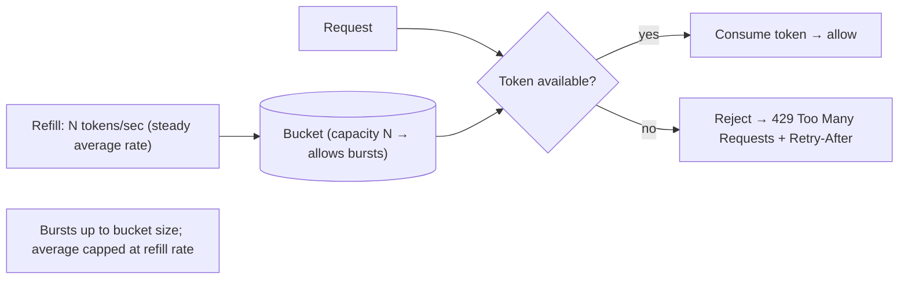
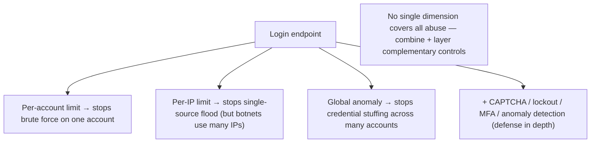

# Lesson 15.7 — Rate Limiting & Abuse Prevention as Security Controls

> Part 15: Security · Difficulty: 🟡🔴
>
> **Prerequisites:** [2.4.4 LLD Case Studies (rate limiter)], [6.7 Stampede/Thundering Herd], [11.4 Load Shedding], [12.6 API Gateway], [15.1 Threat Modeling], [15.5 DDoS].
> **Unlocks:** [15.8 Compliance], [Part 19 Interview Designs (rate limiter)], [Part 20 Capstone].

---

## 1. Learning Objectives

After this lesson you will be able to:

- Explain rate limiting as **both** a reliability control (11.4 — protect capacity) **and** a security control (throttle abuse: brute force, credential stuffing, scraping, DoS).
- Describe the core **algorithms** — token bucket, leaky bucket, fixed/sliding window — and their tradeoffs (burst handling, accuracy, cost).
- Choose the **dimension** to limit on (per-IP, per-user, per-API-key, global) and where to enforce it (gateway/edge — 12.6, distributed limiter).
- Apply rate limiting to specific abuse cases: **brute-force/credential-stuffing** (login), **scraping**, **API abuse**, and **application-layer DoS** (15.5).
- Combine rate limiting with other abuse-prevention controls (CAPTCHA, account lockout, anomaly detection) and handle distributed enforcement.

---

## 2. Motivation — The same control, two purposes

Rate limiting appeared in this course as a **reliability** tool (11.4 load shedding, 6.7 stampede protection, 15.5 DDoS mitigation) — capping request rates so a surge doesn't overwhelm capacity. But it's **equally a security control**, and this lesson views it through that lens. A huge class of attacks depends on **doing something many times, fast**: **brute-forcing passwords** (trying millions of guesses), **credential stuffing** (testing leaked username/password pairs at scale), **scraping** (harvesting data via rapid automated requests), **enumeration** (probing IDs/emails), **spam/fake-account creation**, and **application-layer DoS** (15.5 — expensive requests in volume). **Rate limiting neutralizes these by making "many times, fast" impossible** — an attacker limited to a few login attempts per minute **can't** brute-force; a scraper limited to N requests can't harvest a database.

So rate limiting is a **dual-purpose control**: it **protects reliability** (capacity, cost, fairness) **and** **prevents abuse** (throttling attackers). Getting it right requires choosing the right **algorithm** (token bucket for bursts, sliding window for accuracy), the right **dimension** (per-user vs per-IP vs per-key — each defeats different abuse), the right **enforcement point** (edge/gateway — 12.6), and combining it with complementary controls (CAPTCHA, lockout, anomaly detection). This lesson develops rate limiting as a security control, its algorithms, dimensions, and the broader abuse-prevention toolkit — connecting the reliability view (11.4/6.7) with the security view (15.1/15.5).

---

## 3. Theory — From first principles

### 3.1 Rate limiting as a dual-purpose control

`[CS]` **Rate limiting** = restricting how many requests/actions a client may perform in a time window `[CS]`:
- **Reliability purpose** (11.4/6.7/7.7): protect **capacity** (don't let load exceed what the system can serve → prevent overload/cascade — 11.3), control **cost**, and ensure **fairness** (one client can't starve others — the noisy-neighbor problem, 7.4).
- **Security purpose** (this lesson): **throttle abuse** — attacks that depend on **volume/speed** (brute force, credential stuffing, scraping, enumeration, spam, app-layer DoS — §3.5) become **infeasible** when the rate is capped.
- `[BP]` **Same mechanism, two goals** — and it's one of the **highest-leverage** controls because it simultaneously improves reliability and security. Rate limiting is a **security control** (OWASP-relevant) as much as a capacity control.

### 3.2 The algorithms

`[CS]` Common rate-limiting algorithms (also 2.4.4 LLD) `[CS]`:
- **Token bucket:** a bucket holds up to **N tokens**, refilled at a steady rate; each request **consumes a token**; empty bucket → **reject/throttle**. **Allows bursts** (up to bucket size) while capping the **average** rate → the most common, flexible choice. Smooth + burst-friendly.
- **Leaky bucket:** requests enter a queue that **drains at a fixed rate**; overflow → rejected. **Smooths** output to a constant rate (no bursts) → good for **steady downstream protection**.
- **Fixed window:** count requests per fixed time window (e.g., per minute); reset at the boundary. Simple, but suffers **boundary bursts** (2× the limit around the window edge).
- **Sliding window (log or counter):** track requests over a **rolling** window → **accurate**, no boundary problem, but more **memory/compute** (sliding-window-counter approximates cheaply). More precise fairness.
- `[BP]` **Choose by need:** **token bucket** for typical API rate limiting (burst-tolerant); **leaky bucket** to enforce a steady rate downstream; **sliding window** for accuracy/fairness; fixed window only for simplicity. (Detailed LLD in 2.4.4 / interview design in Part 19.)

### 3.3 The dimension — what to limit on

`[CS]` **What key you limit on determines what abuse you stop** — a critical design choice `[CS]`:
- **Per-IP:** limits requests from an IP → stops a single-source flood/scraper. **But:** attackers use **many IPs** (botnets, proxies — distributed attacks), and **many legitimate users share an IP** (NAT/corporate — 3.1.2) → false positives. Coarse.
- **Per-user / per-account:** limits per authenticated identity → stops per-account abuse (e.g., an account hammering an API). Requires authentication (15.2).
- **Per-API-key / per-client:** limits per API consumer → enforces plan quotas + isolates tenants (fairness — 7.4).
- **Per-endpoint / per-action:** stricter limits on **sensitive/expensive** actions (login, password reset, search) than cheap ones (§3.5).
- **Global:** an overall cap protecting total capacity (11.4).
- `[BP]` **Combine dimensions** — e.g., a **strict per-IP + per-account limit on login** (to stop brute force from one source *and* one account), plus per-key quotas + global caps. **Match the dimension to the abuse** you're preventing; no single dimension covers everything (per-IP misses distributed attacks; per-account misses credential stuffing across many accounts — §3.5).

### 3.4 Where to enforce it

`[BP]` **Enforce at the edge, but often at multiple layers** `[BP]`:
- **Edge / API gateway (12.6):** the primary place — reject excess requests **before** they consume backend resources (cheapest, protects everything behind it). Also CDN/WAF layer (15.5) for volumetric/DDoS.
- **Per-service:** finer-grained limits inside (defense in depth).
- **Distributed rate limiting** (§3.6): in a horizontally-scaled system (7.1), the limit must be **shared across instances** (a single client hitting different servers must still be counted together) → typically a **shared store** (Redis — 6.6) tracking counters, or a coordinated algorithm.
- `[BP]` **Rate limiting is a form of load shedding** (11.4): shed excess **early** (at the edge, fail-fast) so backends aren't overwhelmed. Return **`429 Too Many Requests`** with a `Retry-After` header so well-behaved clients back off (backpressure — 9.9).

### 3.5 Abuse cases and matched controls

`[CS]` Specific attacks and how rate limiting (+ complements) stops them `[CS]`:
- **Brute-force login:** trying many passwords for one account → **strict per-account + per-IP rate limit** on login + **account lockout / exponential backoff** + **CAPTCHA** after failures + **MFA** (15.2). The rate limit makes exhaustive guessing infeasible.
- **Credential stuffing:** testing leaked username/password pairs across **many accounts** (so per-account limits alone miss it) → **per-IP + global anomaly detection** (spike in login attempts across accounts), **device fingerprinting**, **CAPTCHA**, **breached-password checks**, MFA.
- **Scraping / data harvesting:** rapid automated requests to extract data → **per-IP/per-key rate limits**, **bot detection**, **CAPTCHA**, **behavioral analysis**, requiring auth.
- **Enumeration:** probing valid IDs/emails/usernames → rate limit + **generic responses** (don't reveal whether an account exists — 15.6-adjacent) + monitoring.
- **Fake accounts / spam:** limits on account creation + CAPTCHA + email/phone verification + reputation.
- **Application-layer DoS (15.5):** volume of expensive requests → rate limiting + load shedding (11.4) + WAF (15.5) + prioritization.
- `[BP]` **Rate limiting is the foundation, but combine it** (§3.6) — CAPTCHA (bot vs human), account lockout, MFA (15.2), anomaly/behavioral detection, and monitoring (15.8) — a **layered abuse-prevention** posture (defense in depth — 15.1).

### 3.6 Distributed enforcement + complementary controls

`[BP]` Two practical concerns `[BP]`:
- **Distributed rate limiting** (§3.4): in a multi-instance system (7.1), enforce a **global view** — a shared counter store (Redis — 6.6) that all instances update/check, or approximate distributed algorithms. Tradeoffs: a **strictly-shared** store adds latency + is a dependency; **local limits + coordination** or **sticky routing** are alternatives. Handle the store being a bottleneck/SPOF (make it HA — 11.2).
- **Complementary abuse controls:**
  - **CAPTCHA / challenges** — distinguish humans from bots (after suspicious activity, not always — UX cost).
  - **Account lockout + exponential backoff** — escalate friction on repeated failures.
  - **MFA** (15.2) — makes stolen passwords insufficient.
  - **Anomaly/behavioral detection** (15.8/Part 16) — spot abuse patterns (login spikes, unusual access) that rate limits alone miss.
  - **Reputation / IP intelligence** — block known-bad sources.
  - **Graceful responses** — `429 + Retry-After` (backpressure — 9.9), generic errors (no enumeration).
- `[BP]` **Balance security vs UX:** too-strict limits/CAPTCHAs frustrate legitimate users (false positives, esp. per-IP + NAT — §3.3); tune limits to real usage + peak (7.7), escalate friction progressively, and monitor for both abuse and false positives.

### 3.7 Putting it together

`[BP]` A layered rate-limiting + abuse-prevention posture:
- **Rate limit at the edge/gateway** (12.6) as load shedding (11.4) — protecting capacity **and** throttling abuse (§3.1/3.4).
- **Choose algorithm** (token bucket default; sliding window for accuracy; leaky bucket for steady rate) (§3.2).
- **Limit on matched dimensions** (per-IP + per-account + per-key + per-endpoint + global) — no single one suffices (§3.3).
- **Enforce distributed** (shared store — Redis, HA) across instances (§3.6).
- **Stricter limits on sensitive/expensive actions** (login, reset, search) (§3.5).
- **Layer complementary controls** (CAPTCHA, lockout, MFA, anomaly detection, generic responses) for specific abuse (§3.5/3.6, 15.1 defense in depth).
- **Return 429 + Retry-After**; tune to real usage; monitor abuse + false positives (§3.4/3.6).
- `[BP]` The result: attacks that depend on **volume/speed** become **infeasible**, capacity is **protected**, and legitimate users are **minimally impacted** — a dual reliability+security win (11.4/15.5).

---

## 4. Visual Intuition

### Token bucket

### Dimensions vs abuse (match the key to the attack)

---

## 5. Real-World Analogy

Think of a **nightclub bouncer** managing the door — controlling both **crowding (capacity)** and **troublemakers (abuse)**.

- **Dual purpose:** the bouncer's rate control serves **two goals at once**. It keeps the club from **dangerously overcrowding** (reliability — capacity/fairness), *and* it **stops bad actors** who rely on **rushing in repeatedly** (security — abuse). Same doorman, two jobs.
- **Token bucket = a steady trickle of entry tokens with a small stack:** the bouncer hands out entry tokens at a **steady rate** but keeps a **small stack ready** — so a **normal burst** of friends arriving together can all get in quickly (burst tolerance), but a **sustained flood** is capped to the trickle rate. When the stack's empty, you **wait** (429 + "try again in 30s").
- **Dimensions = who you're counting:** the bouncer can limit **per-person** ("you've tried the door 20 times in a minute — stop"), **per-group**, or **overall headcount**. Crucially, **the wrong dimension misses the attack**: limiting **per-face** stops one persistent troublemaker but **not a coordinated gang each trying once** (credential stuffing across many accounts — needs an **overall pattern watch**); limiting **per-address** wrongly blocks a **whole busload of legitimate guests from one company** (NAT). So the bouncer **combines** signals.
- **Matched abuse controls:** for someone **guessing the VIP password over and over** (brute force), the bouncer **slows them down after a few wrong tries, then demands ID** (rate limit → lockout → CAPTCHA/MFA). For a **crowd of scalpers grabbing all the tickets fast** (scraping), the bouncer **caps how many each can take** and **spots the bot-like behavior**. For a **mob trying to jam the entrance so real guests can't enter** (application-layer DoS), the bouncer **turns most of them away at the curb** before they clog the lobby (edge rate limiting / load shedding).
- **Distributed enforcement:** if the club has **five doors**, a troublemaker can't just be tracked at one — the doors **share a common guest list/count** (a shared Redis counter) so someone rejected at door 1 can't simply walk to door 2 (distributed rate limiting).
- **Balance:** an **overzealous bouncer** who blocks everyone and ID-checks every guest **ruins the night for legitimate patrons** (false positives / UX) — so limits are tuned to real crowds and friction is **escalated only when behavior looks suspicious**.

---

## 6. Industry Example

- **API gateway rate limiting** `[CONV]`: per-key/per-user quotas + global caps enforced at the edge (12.6), returning 429 + Retry-After (§3.4). *(Representative.)*
- **Token-bucket rate limiters** `[CONV]`: the common algorithm for burst-tolerant API limiting (§3.2, 2.4.4). *(Representative.)*
- **Login brute-force/credential-stuffing defense** `[CONV]`: strict login limits + lockout + CAPTCHA + MFA + breached-password checks (§3.5, 15.2). *(Representative.)*
- **Distributed rate limiting via Redis** `[CONV]`: shared counters across instances for a global view (§3.6, 6.6). *(Representative.)*
- **Bot/scraping + anomaly detection** `[CONV]`: behavioral analysis + challenges to stop scraping/abuse beyond simple rate limits (§3.5/3.6). *(Representative.)*

---

## 7. Implementation Details

- **Rate limit at the edge/gateway** (12.6) as load shedding (11.4) — protect capacity + throttle abuse; finer per-service limits for defense in depth (§3.4).
- **Choose the algorithm** (§3.2): token bucket (default, burst-tolerant); sliding window (accuracy/fairness); leaky bucket (steady downstream rate).
- **Limit on matched dimensions** (§3.3): per-IP + per-account + per-API-key + per-endpoint + global — combine; stricter on sensitive/expensive actions (login/reset/search) (§3.5).
- **Distributed enforcement** (§3.6): shared HA counter store (Redis — 6.6) for a global view across instances; handle its latency/SPOF.
- **Layer complementary controls** (§3.5/3.6): CAPTCHA/challenges (on suspicion), account lockout + exponential backoff, MFA (15.2), anomaly/behavioral detection (15.8/Part 16), generic responses (anti-enumeration), IP reputation.
- **Return 429 + Retry-After** (§3.4, 9.9) so good clients back off; document limits.
- **Tune to real usage + peak** (7.7) and **monitor** both abuse and false positives (§3.6); balance security vs UX.

---

## 8. Advantages

- **Dual win** — protects reliability (capacity/fairness/cost) **and** security (abuse) with one control (§3.1).
- **Neutralizes volume-based attacks** — brute force/stuffing/scraping/DoS become infeasible (§3.5).
- **Cheap + high-leverage** — simple to add at the edge, big impact (§3.1/3.4).
- **Fairness** — prevents noisy-neighbor starvation (§3.1, 7.4).
- **Backpressure-friendly** — 429 + Retry-After signals clients to slow down (§3.4, 9.9).
- **Composable** — layers with CAPTCHA/lockout/MFA/anomaly detection (§3.5/3.6).

---

## 9. Disadvantages / costs

- **False positives / UX cost** — too-strict limits (esp. per-IP + NAT) block legitimate users (§3.3/3.6).
- **No single dimension suffices** — per-IP misses distributed attacks; per-account misses stuffing (§3.3/3.5).
- **Distributed enforcement is hard** — shared counter store adds latency + is a dependency/SPOF (§3.6).
- **Attackers adapt** — botnets/proxies evade per-IP; slow-and-low evades naive limits → need anomaly detection (§3.5/3.6).
- **Tuning effort** — must match real usage + peak; ongoing (§3.6, 7.7).
- **Not sufficient alone** — needs complementary controls (§3.5/3.6).

---

## 10. When NOT to / cautions

- **Don't rely on per-IP alone** — misses distributed attacks; harms NAT users (§3.3).
- **Don't rely on rate limiting alone** for abuse — layer CAPTCHA/lockout/MFA/anomaly detection (§3.5/3.6).
- **Don't set limits too strict** — false positives frustrate legitimate users (§3.6).
- **Don't enforce only per-instance** in a scaled system — need distributed/global (§3.6).
- **Don't forget sensitive actions** — login/reset/search need stricter limits (§3.5).
- **Don't reveal enumeration info** — use generic responses (§3.5, 15.6).

---

## 11. Common Mistakes

1. **Per-IP-only limiting** — bypassed by botnets/proxies; blocks NAT users (§3.3).
2. **Rate limiting alone against brute force** — no lockout/CAPTCHA/MFA (§3.5).
3. **Per-instance limits in a scaled system** — attacker spreads across servers (§3.6).
4. **Too-strict limits** — false positives, bad UX (§3.6).
5. **No stricter limits on login/expensive endpoints** (§3.5).
6. **Ignoring credential stuffing** — per-account limits miss cross-account attacks (§3.3/3.5).
7. **No 429/Retry-After** — clients hammer instead of backing off (§3.4).
8. **Shared counter store as an unprotected SPOF/bottleneck** (§3.6).

---

## 12. Interview Questions

**🟢 Easy**
- Why is rate limiting both a reliability and a security control?
- What is the token bucket algorithm, and why does it allow bursts?

**🟡 Medium**
- Compare token bucket, leaky bucket, fixed window, and sliding window.
- Why does the dimension (per-IP vs per-account vs per-key) matter, and why combine them?

**🔴 Hard**
- How do you defend against brute force vs credential stuffing (different dimensions + complementary controls)?
- How do you implement distributed rate limiting across many instances, and what are the tradeoffs?

**⚫ Staff+**
- Design rate limiting + abuse prevention for a public API + login system: algorithms, dimensions (per-IP/user/key/endpoint/global), edge enforcement (12.6), distributed counters (Redis), and complementary controls (CAPTCHA/lockout/MFA/anomaly detection) — balancing security, reliability, and UX.
- Design a distributed rate limiter (interview-style — Part 19): algorithm choice, the shared-state problem, accuracy vs performance, handling the counter store as a dependency, and graceful client behavior.

---

## 13. Production Pitfalls

- **Brute force succeeded:** no/weak login rate limit let an attacker guess passwords (§3.5).
- **Credential stuffing missed:** per-account limits didn't catch attacks spread across many accounts (needed anomaly detection) (§3.3/3.5).
- **NAT false positives:** per-IP limits blocked a whole corporate/mobile network sharing one IP (§3.3).
- **Distributed bypass:** per-instance limits let an attacker exceed the intended global limit by spreading across servers (§3.6).
- **Counter-store meltdown:** the shared Redis limiter became a bottleneck/SPOF under load (§3.6, needs HA).
- **App-layer DoS got through:** no edge rate limiting → expensive requests overwhelmed the backend (§3.5, 11.4/15.5).
- **Clients hammering:** no 429/Retry-After → misbehaving clients retried aggressively, worsening load (§3.4, 9.9).

---

## 14. Optimization Techniques

- **Edge/gateway rate limiting (load shedding — 11.4)** to reject excess before it hits backends (§3.4).
- **Token bucket** for burst-tolerant limiting; **sliding window** where accuracy matters (§3.2).
- **Combined dimensions** (per-IP + per-account + per-key + global) to cover different abuse (§3.3).
- **Distributed HA counter store (Redis — 6.6)** for a global view; approximate algorithms to reduce latency (§3.6).
- **Stricter limits on sensitive/expensive endpoints** (login/reset/search) (§3.5).
- **Layer complementary controls** (CAPTCHA/lockout/MFA/anomaly detection) — defense in depth (§3.5/3.6, 15.1).
- **429 + Retry-After + progressive friction**; tune to real usage + peak; monitor abuse + false positives (§3.4/3.6, 7.7).

---

## 15. Summary

Rate limiting is a **dual-purpose control**: a **reliability** tool (protect **capacity** — prevent overload/cascade — 11.3/11.4, control **cost**, ensure **fairness** — 7.4) **and** a **security** control that **throttles abuse**. A large class of attacks depends on doing something **many times, fast** — **brute-forcing passwords**, **credential stuffing** (testing leaked pairs at scale), **scraping/harvesting**, **enumeration**, **fake-account/spam creation**, and **application-layer DoS** (15.5) — and **rate limiting neutralizes them by making "many times, fast" infeasible**. The core **algorithms**: **token bucket** (tokens refilled at a steady rate, bucket size allows **bursts** while capping the average — the flexible default); **leaky bucket** (drains at a fixed rate — smooths to a **steady** output); **fixed window** (simple but boundary bursts); and **sliding window** (accurate/fair, more memory) — choose token bucket for typical APIs, sliding window for accuracy, leaky bucket for steady downstream protection (LLD in 2.4.4). The **dimension** you limit on **determines which abuse you stop**: **per-IP** (stops single-source floods but botnets use many IPs and NAT causes false positives), **per-user/account** (per-account abuse, needs auth), **per-API-key** (quotas/tenant isolation), **per-endpoint** (stricter on sensitive/expensive actions like login/reset/search), and **global** (total capacity) — **no single dimension suffices** (per-IP misses distributed attacks; per-account misses credential stuffing across accounts), so **combine** them. Enforce **at the edge/gateway** (12.6) as **early load shedding** (11.4 — cheapest, protects everything behind), plus per-service defense in depth, and in a scaled system (7.1) enforce **distributed** limits via a **shared HA counter store** (Redis — 6.6) so a client can't bypass by hitting different instances — returning **`429 Too Many Requests` + `Retry-After`** so good clients back off (backpressure — 9.9). Matched to abuse: **brute force** → strict per-account+per-IP login limits + lockout + backoff + CAPTCHA + MFA (15.2); **credential stuffing** → per-IP + **anomaly detection** (cross-account login spikes) + device fingerprinting + breached-password checks; **scraping** → per-IP/key limits + bot detection + CAPTCHA; **enumeration** → limits + **generic responses** (don't reveal account existence); **app-layer DoS** → edge rate limiting + load shedding + WAF (15.5). Rate limiting is the **foundation but not sufficient alone** — layer it with **CAPTCHA, account lockout, MFA, anomaly/behavioral detection, IP reputation, and monitoring** (15.8) for **defense in depth** (15.1) — while **balancing security vs UX** (too-strict limits/CAPTCHAs frustrate legitimate users, esp. per-IP + NAT; tune to real usage + peak — 7.7, escalate friction progressively, and monitor for both abuse and false positives). Done well, volume-based attacks become infeasible, capacity is protected, and legitimate users are minimally impacted — a dual reliability+security win.

---

## 16. Revision Notes (flashcard-ready)

- **Q:** Rate limiting's dual purpose? **A:** Reliability (capacity/fairness/cost — 11.4) AND security (throttle volume-based abuse).
- **Q:** What attacks does it stop? **A:** Brute force, credential stuffing, scraping, enumeration, spam/fake accounts, app-layer DoS.
- **Q:** Token bucket? **A:** Tokens refilled at a steady rate; bucket size allows bursts, caps average; empty → reject. Common default.
- **Q:** Leaky vs sliding window? **A:** Leaky = fixed drain rate (smooth, no bursts); sliding window = accurate rolling count (more memory), no boundary burst.
- **Q:** Why does the dimension matter? **A:** It determines which abuse you stop; per-IP misses botnets + hurts NAT; per-account misses credential stuffing → combine.
- **Q:** Where to enforce? **A:** Edge/gateway (early load shedding — 11.4/12.6) + per-service; distributed via a shared HA counter store (Redis).
- **Q:** Brute force defense? **A:** Strict per-account+per-IP login limits + lockout + backoff + CAPTCHA + MFA.
- **Q:** Credential stuffing (vs brute force)? **A:** Spread across many accounts → per-account limits miss it; use per-IP + anomaly detection + breached-password checks.
- **Q:** Response to a limited client? **A:** 429 Too Many Requests + Retry-After (backpressure — 9.9).
- **Q:** Is rate limiting sufficient alone? **A:** No — layer CAPTCHA/lockout/MFA/anomaly detection (defense in depth); balance vs UX/false positives.

---

## 17. Further Reading + Knowledge-Graph Links

**Foundations (in-platform):**
- **[11.4 Load Shedding]** — rate limiting as reliability/shedding.
- **[6.7 Stampede/Thundering Herd]** — rate limiting protecting backends.
- **[2.4.4 LLD Case Studies]** — rate limiter object model/algorithms.
- **[15.5 DDoS]** — application-layer DoS defense.
- **[15.2 AuthN]** — login/brute-force/MFA context.
- **[12.6 API Gateway]** — edge enforcement point.

**Unlocks / next:**
- **[15.8 Compliance]** — audit/monitoring of abuse.
- **[Part 19 Interview Designs]** — design a distributed rate limiter.
- **[Part 20 Capstone]** — rate limiting for the platform.

**External (canonical):**
- OWASP rate-limiting / brute-force / credential-stuffing prevention cheat sheets. *(Representative.)*
- Rate-limiting algorithm references (token/leaky bucket, sliding window). *(Representative.)*

> **Knowledge-graph:** `11.4 load shedding` + `15.5 DoS` + `15.1 defense in depth` → **`15.7 rate limiting + abuse prevention`** (algorithms + dimensions + distributed + complementary controls) → reliability + security win.
