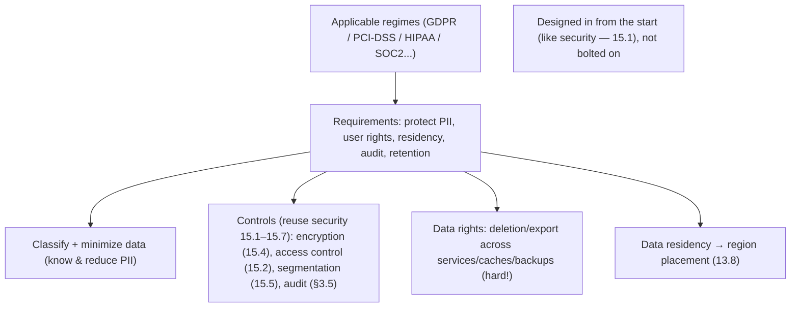
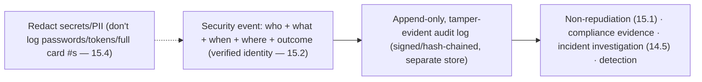

# Lesson 15.8 — Compliance: PII, GDPR, PCI-DSS, Audit Logging

> Part 15: Security · Difficulty: 🟡🔴
>
> **Prerequisites:** [1.2.3 Security/Compliance/Cost], [15.1 Threat Modeling], [15.4 Encryption/Secrets], [15.2 AuthN/AuthZ], [11.8 DR/Backups].
> **Unlocks:** [Part 16 Observability (audit/logs)], [Part 20 Capstone (compliance landscape)].

---

## 1. Learning Objectives

After this lesson you will be able to:

- Explain **compliance** as a first-class architectural driver (1.2.3) — legal/regulatory requirements that **shape the design**, not optional add-ons.
- Define **PII** (Personally Identifiable Information) and the data-protection concepts around it (data classification, minimization, residency).
- Summarize the architectural implications of major regimes: **GDPR** (privacy/data rights), **PCI-DSS** (payment card data), and others (HIPAA, SOC 2 — at a high level), without giving legal advice.
- Explain **audit logging** — immutable, tamper-evident records of who did what — for non-repudiation (15.1), compliance, and incident investigation (14.5).
- Apply architectural patterns that satisfy compliance: encryption (15.4), access control (15.2), data lifecycle, tokenization, and audit trails.

---

## 2. Motivation — Regulations shape the architecture

Security (15.1–15.7) protects the system; **compliance** is the related but distinct obligation to meet **legal and regulatory requirements** for how you handle data — and it is a **first-class architectural driver** (1.2.3), not a checkbox at the end. Regulations like **GDPR** (EU data privacy), **PCI-DSS** (payment cards), **HIPAA** (US health data), and frameworks like **SOC 2** impose concrete requirements — encrypt this data, control who accesses it, let users delete their data, keep audit logs, store data in certain regions — that **fundamentally shape the design** (data models, storage, access control, logging, even which region your servers run in — 13.8). Ignoring compliance risks **massive fines**, legal liability, and loss of trust; retrofitting it is painful, so it must be **designed in** (like security — 15.1).

An architect isn't a lawyer, but must understand the **architectural implications** of the regimes their system falls under. The recurring themes are: **know your data** (classify it — what's PII? what's payment data?), **protect it** (encryption — 15.4, access control — 15.2, minimization), **give users rights over it** (access, deletion — GDPR), **restrict where it lives** (data residency — 13.8), and **prove what happened to it** (audit logging). **Audit logging** deserves special attention — immutable, tamper-evident records of **who did what, when** — because it underpins **non-repudiation** (15.1 STRIDE), **compliance evidence**, and **incident investigation** (14.5). This lesson develops compliance as an architectural driver, PII/data-protection concepts, the major regimes' implications, and audit logging — connecting security controls to legal obligations. **(This is not legal advice — consult experts for actual compliance.)**

---

## 3. Theory — From first principles

### 3.1 Compliance as an architectural driver

`[CS]` **Compliance** = meeting **legal, regulatory, and contractual requirements** for handling data and operating the system `[CS]`:
- It's **distinct from security** (though overlapping): security is about protecting the system from attackers; **compliance is about meeting external rules** (which often *mandate* security controls, plus privacy/rights/retention/residency requirements).
- `[BP]` **A first-class architectural characteristic** (1.2.3): compliance requirements **shape the architecture** — data models, storage choices, encryption (15.4), access control (15.2), logging, retention, and **geographic placement** (13.8). It **conflicts** with other characteristics (cost, simplicity, performance — 1.2.4) and must be **prioritized as a requirement** (1.1.5), not bolted on.
- **Consequences of non-compliance:** heavy **fines** (GDPR fines can be a % of global revenue), legal liability, loss of certification (can't operate in a market), and reputational damage.
- `[BP]` **Design it in** (like security — 15.1); retrofitting compliance into a non-compliant architecture is expensive and error-prone. Identify the **applicable regimes early** (part of requirements — 1.1.2).

### 3.2 PII and data classification

`[CS]` **PII (Personally Identifiable Information)** = data that can **identify an individual** — names, emails, addresses, phone numbers, government IDs, IPs, location, biometrics, etc. (definitions vary by regime) `[CS]`:
- **Data classification** `[BP]`: **know your data** — classify it by sensitivity (public / internal / confidential / PII / regulated like payment/health) → drives **how it's protected** (encryption level — 15.4, access control — 15.2, retention). You can't protect data you haven't identified.
- **Sensitive/special categories** (GDPR): health, race, religion, etc. — extra protection.
- **Data minimization** `[BP]`: collect + retain **only the PII you actually need**, for **only as long as needed** — less data = less risk, less compliance burden, smaller breach impact (attack-surface reduction for data — 15.1). "Don't collect what you don't need."
- `[BP]` Classification + minimization are the foundation: they tell you **what** to protect and reduce **how much** you must protect.

### 3.3 GDPR — privacy and data rights

`[CONV]` **GDPR (General Data Protection Regulation)** — the EU's data-privacy law, with global reach (applies to anyone handling EU residents' data) — imposes **architectural requirements** `[CONV]`:
- **Data subject rights** (must be *technically* supportable): **right to access** (export a user's data), **right to erasure / "right to be forgotten"** (delete a user's data — **architecturally hard**: data spread across services — 12.4, caches — Part 6, backups — 11.8, logs, analytics), **right to rectification**, **data portability**.
- **Lawful basis + consent:** must have a legal basis (e.g., consent) to process PII; track consent.
- **Data minimization + purpose limitation:** collect only what's needed, use only for the stated purpose (§3.2).
- **Data residency / transfer restrictions:** restrictions on moving EU data outside the EU → affects **where you store/process data** (multi-region — 13.8).
- **Breach notification:** report breaches within a strict timeframe (needs detection — 15.8/Part 16).
- **Privacy by design + by default** (echoes security by design — 15.1).
- `[BP]` **Architectural impact:** the "right to be forgotten" alone forces you to **track where a user's data lives** and be able to **delete it everywhere** (including derived data — 12.4 CQRS/replicas, backups — a genuinely hard problem — often via crypto-shredding: delete the key — 15.4). Design data models + pipelines with deletion/export in mind.

### 3.4 PCI-DSS — payment card data

`[CONV]` **PCI-DSS (Payment Card Industry Data Security Standard)** governs handling of **payment card data** (card numbers/CVV) — a contractual standard for anyone processing cards `[CONV]`:
- Requirements include: **encrypt cardholder data** (in transit + at rest — 15.4), **restrict access** (least privilege — 15.1/15.2), **network segmentation** (isolate the cardholder-data environment — 15.5), **strong access control + MFA** (15.2), **logging/monitoring + audit trails** (§3.5), **regular testing** (pentests/scans — 15.6), and **secure development**.
- `[BP]` **The key architectural pattern — reduce PCI scope:** the fewer systems that **touch card data**, the smaller the (expensive, audited) **compliance boundary**. So **tokenization** (15.4 — replace the card number with a token; store the real value in a small, isolated, PCI-compliant **vault**) and using **third-party payment processors** (so raw card data never touches your systems) **drastically reduce scope** — most of your system never sees card data. **Minimize what's in scope.**
- `[BP]` Architectural impact: **isolate + minimize** the card-data environment; tokenize; offload to processors; segment (15.5); encrypt + audit everything in scope.

### 3.5 Audit logging

`[CS]` **Audit logging** = recording **immutable, tamper-evident records of security-relevant events — who did what, when, from where** `[CS]`:
- **Purpose (multiple):** **non-repudiation** (15.1 STRIDE — the "R"; prove an action happened and who did it), **compliance evidence** (regimes require audit trails — §3.3/3.4), **incident investigation** (14.5 — reconstruct what an attacker/user did), and **detection** (spot anomalies — 15.7/Part 16).
- **What to log:** authentication (logins/failures — 15.2), **authorization decisions** (access to sensitive data), **data access/changes** (esp. PII/regulated data), admin/privileged actions, security events (rate-limit hits — 15.7, config changes).
- **Properties** `[BP]`:
  - **Immutable + tamper-evident:** audit logs must not be alterable (append-only, write-once, signed/hash-chained, shipped to a separate secured store) — else an attacker/insider erases their tracks (defeating the purpose).
  - **Complete + attributable:** enough detail (who, what, when, where, outcome), tied to a **verified identity** (15.2).
  - **Protected + retained:** access-controlled (audit logs contain sensitive info), retained per compliance requirements (retention periods).
- `[BP]` **Critical caveat — don't log secrets/PII carelessly:** audit logs must capture *events* but **not leak sensitive data** (passwords, tokens — 15.4, full card numbers, excessive PII) — logging secrets is itself a breach (15.4). Redact/mask. Balance auditability with data minimization (§3.2).
- **Distinct from operational logs** (Part 16): audit logs are **security/compliance** records (immutable, retained, attributable); operational logs are for debugging (14.3/Part 16) — though they overlap.

### 3.6 Other regimes + patterns

`[CONV]` Briefly, other common regimes (high-level — not legal advice) `[CONV]`:
- **HIPAA** (US health data — PHI): encryption, access control, audit, breach notification for health information.
- **SOC 2** (a trust/assurance framework): controls around security, availability, confidentiality, processing integrity, privacy — often required for B2B SaaS; produces an audit report.
- **CCPA/CPRA** (California privacy — GDPR-like), **regional variants** worldwide.
- **Industry-specific:** finance (SOX, regional financial regs — relevant to the capstone — Part 20), etc.
- `[BP]` **Common architectural patterns satisfying compliance** (recap): **encryption** (in transit + at rest + field-level/tokenization — 15.4), **strong access control + least privilege** (15.1/15.2), **network segmentation** (15.5), **audit logging** (§3.5), **data classification + minimization + retention** (§3.2), **data residency** (region placement — 13.8), **consent/rights management** (§3.3), and **regular testing/monitoring** (15.6/Part 16). Compliance largely **reuses the security controls** from 15.1–15.7, plus privacy/rights/retention/residency specifics.

### 3.7 Putting it together — compliant by design

`[BP]` A compliance-aware design approach:
- **Identify applicable regimes early** (§3.1, 1.1.2): which laws/standards apply (based on data + users + industry + geography)?
- **Classify + minimize data** (§3.2): know what PII/regulated data you hold; collect/retain only what's needed.
- **Design the controls in** (§3.6): encryption (15.4), access control + least privilege (15.2/15.1), segmentation (15.5), audit logging (§3.5), residency (13.8) — the security controls, applied to satisfy regulations.
- **Support data rights** (§3.3): architect for **deletion/export** (right to be forgotten/access) across services/caches/backups (12.4/Part 6/11.8) — often crypto-shredding (15.4).
- **Reduce scope** (§3.4): tokenize + offload payment/sensitive data to isolated/third-party systems so most of your architecture is out of the (costly) compliance boundary.
- **Audit + monitor + retain** (§3.5, Part 16): immutable audit trails, breach detection, retention per regime.
- `[BP]` Compliance is a **requirements-driven** (1.1.5) architectural concern **designed in from the start** — largely satisfied by the security controls (15.1–15.7) plus privacy/rights/residency/audit specifics. **(Consult legal/compliance experts for the actual requirements — this lesson gives the architectural shape, not legal advice.)**

---

## 4. Visual Intuition

### Compliance shapes the architecture

### Audit log: immutable who-did-what

---

## 5. Real-World Analogy

Think of running a **regulated business like a pharmacy or bank** — where **law dictates how you handle sensitive things**, and you must **keep meticulous records**.

- **Compliance shapes the building, not just the security:** a pharmacy can't just "add security later." **The law dictates the architecture**: controlled substances must be in a **specific locked cabinet** (encryption/segmentation), only **licensed staff** may access them (access control), you must keep **records of every dispensation** (audit logs), and some medicines **can't be shipped across certain borders** (data residency). These rules **shape the floor plan and processes from day one** — retrofitting them into an existing shop is a nightmare.
- **PII / data classification = knowing what's sensitive:** you must **know which items are regulated** — over-the-counter vitamins (public data) vs controlled narcotics (regulated PII/payment data) — because they demand **different handling**. And you follow **minimization**: you don't stockpile controlled substances you don't need (collect/retain only necessary PII), because more of it = more risk + more scrutiny.
- **GDPR = customers' rights over their records:** customers can **demand to see their full record** (right to access), **demand you erase it** (right to be forgotten — which is *hard*: their info is in the main ledger, the archive, the backup tapes, and the loyalty-card system — you must find and destroy it *everywhere*), and you can only **use their data for the purpose they agreed to**.
- **PCI-DSS = handling cash/cards, with scope reduction:** handling **payment cards** comes with strict, audited rules — so the smart move is to **touch card data as little as possible**: use an **armored-car service and a third-party payment terminal** (payment processor + tokenization) so the **actual card numbers never sit in your shop** — shrinking the expensive "regulated zone" to almost nothing. **Minimize what's in scope.**
- **Audit logging = the tamper-proof register:** the pharmacy keeps a **bound, page-numbered register** of every controlled-substance dispensation — **who, what, when** — in **indelible ink that can't be altered or torn out** (immutable, tamper-evident). This proves **who did what** (non-repudiation), satisfies **inspectors** (compliance evidence), and lets you **investigate** if something goes missing (incident investigation). But crucially, you **don't write patients' full medical secrets in a register anyone can read** — you record the *event*, not the sensitive details (don't log secrets/PII carelessly).

---

## 6. Industry Example

- **GDPR "right to be forgotten"** `[CONV]`: forces architectures to track + delete a user's data across services/caches/backups — often via crypto-shredding (delete the key — 15.4) (§3.3). *(Representative.)*
- **PCI-DSS scope reduction via tokenization + processors** `[CONV]`: keeping raw card data out of most systems to shrink the audited boundary (§3.4, 15.4). *(Representative.)*
- **Data residency** `[CONV]`: storing/processing regional data in-region to meet residency laws (multi-region — 13.8) (§3.3). *(Representative.)*
- **Immutable audit trails** `[CONV]`: append-only/signed audit logs shipped to a separate secured, access-controlled store (§3.5). *(Representative.)*
- **SOC 2 for B2B SaaS** `[CONV]`: control frameworks + audit reports required to sell to enterprises (§3.6). *(Representative.)*

---

## 7. Implementation Details

- **Identify applicable regimes early** (§3.1/3.7, 1.1.2): based on data types, users, industry, geography — treat as first-class requirements.
- **Classify + minimize data** (§3.2): inventory PII/regulated data; collect/retain only what's needed; define retention periods.
- **Apply the controls** (§3.6, 15.1–15.7): encryption in transit + at rest + field-level/tokenization (15.4); least-privilege access control + MFA (15.1/15.2); network segmentation of sensitive environments (15.5); regular testing/scanning (15.6).
- **Support data rights** (§3.3): architect for **deletion + export** across all data stores/caches/backups/derived data (12.4/Part 6/11.8) — plan this in the data model; crypto-shredding for backups (15.4).
- **Reduce compliance scope** (§3.4): tokenize + offload payment/sensitive data to isolated/third-party systems.
- **Implement audit logging** (§3.5): immutable, tamper-evident (append-only/signed/hash-chained, separate secured store), attributable (verified identity — 15.2), retained per regime; **redact secrets/PII** — don't log passwords/tokens/full card numbers (15.4).
- **Data residency** (§3.3): place data in required regions (13.8).
- **Detect + report breaches** (§3.3): monitoring (Part 16) to meet notification timeframes.
- **Consult legal/compliance experts** — architecture supports compliance, but the requirements are legal (§3.7).

---

## 8. Advantages (of designing for compliance)

- **Avoids fines/liability** — meets legal requirements; enables operating in regulated markets (§3.1).
- **Builds trust** — users/partners trust compliant handling of their data (§3.1).
- **Reuses security controls** — compliance largely leverages 15.1–15.7 (§3.6).
- **Data minimization reduces risk** — less data = smaller breach impact + burden (§3.2).
- **Scope reduction saves cost** — tokenization/processors shrink the audited boundary (§3.4).
- **Audit trails enable investigation** — non-repudiation + incident forensics (§3.5, 14.5).

---

## 9. Disadvantages / costs

- **Constrains + complicates the design** — residency, deletion, segmentation add complexity (§3.1/3.3).
- **"Right to be forgotten" is architecturally hard** — deleting across services/caches/backups/derived data (§3.3).
- **Cost** — controls, audits, certifications, legal/compliance staff (1.2.3).
- **Conflicts with other characteristics** — e.g., residency vs global performance, retention vs minimization (1.2.4).
- **Ongoing burden** — audits, evidence, keeping current with changing regulations (§3.1).
- **Audit logging cost + risk** — storage/retention + must not leak secrets (§3.5).

---

## 10. When NOT to / cautions

- **Don't treat compliance as an afterthought** — design it in (like security — 15.1) (§3.1).
- **Don't collect/retain unnecessary PII** — minimization reduces risk + burden (§3.2).
- **Don't ignore data rights** (deletion/export) in the data model — retrofitting is painful (§3.3).
- **Don't keep card/sensitive data in scope** unnecessarily — tokenize/offload (§3.4).
- **Don't log secrets/PII** into audit/operational logs (§3.5, 15.4).
- **Don't treat audit logs as mutable/optional** — immutable + tamper-evident + retained (§3.5).
- **Don't confuse compliance with security** — related but distinct; and this isn't legal advice (§3.1/3.7).

---

## 11. Common Mistakes

1. **Compliance bolted on late** — expensive, error-prone retrofit (§3.1).
2. **Over-collecting/retaining PII** — more risk + burden (§3.2).
3. **No deletion/export capability** — can't satisfy data rights (§3.3).
4. **Card data everywhere** — huge PCI scope; should tokenize/offload (§3.4).
5. **Logging secrets/PII** — the log becomes a breach (§3.5, 15.4).
6. **Mutable/unprotected audit logs** — attacker/insider erases tracks (§3.5).
7. **Ignoring data residency** — storing regulated data in the wrong region (§3.3, 13.8).
8. **Missing breach detection/notification** — can't meet reporting timeframes (§3.3, Part 16).

---

## 12. Interview Questions

**🟢 Easy**
- What is compliance, and how does it differ from security?
- What is PII, and why do data classification + minimization matter?

**🟡 Medium**
- What are the key architectural implications of GDPR (data rights, residency, minimization)?
- What is audit logging, and what properties must it have (immutable, tamper-evident, attributable)?

**🔴 Hard**
- Why is the GDPR "right to be forgotten" architecturally hard, and how do you implement deletion across services/caches/backups (crypto-shredding)?
- How do you reduce PCI-DSS scope, and why does it matter (tokenization, processors, segmentation)?

**⚫ Staff+**
- Design a compliance-aware architecture for a system handling EU PII + payment data: data classification/minimization, encryption (15.4), access control (15.2), segmentation (15.5), GDPR data rights (deletion/export), PCI scope reduction (tokenization), residency (13.8), and audit logging — noting where you'd consult legal.
- Design an audit-logging subsystem: what to log, immutability/tamper-evidence, attribution (15.2), redaction of secrets/PII (15.4), retention, and how it serves non-repudiation (15.1) + incident investigation (14.5) + compliance.

---

## 13. Production Pitfalls

- **Can't fulfill a deletion request:** a user's data was spread across services/caches/backups with no way to delete it all → GDPR violation (§3.3).
- **Secrets/PII in logs:** passwords/tokens/card numbers logged → the log store became a breach (§3.5, 15.4).
- **Mutable audit logs tampered:** an insider/attacker altered/deleted audit records to hide actions (§3.5).
- **Massive PCI scope:** card data flowed through many systems → an expensive, fragile audit + bigger breach surface (§3.4).
- **Residency violation:** EU data was processed/stored in the wrong region → regulatory breach (§3.3, 13.8).
- **Over-retention breach:** kept PII far longer than needed → larger breach impact + violation (§3.2).
- **Missed breach-notification window:** no detection → failed to report within the legal timeframe (§3.3, Part 16).

---

## 14. Optimization Techniques

- **Design compliance in from the start** (requirements — 1.1.2) — cheapest, like security (§3.1/3.7).
- **Data classification + minimization + retention limits** to reduce risk + burden (§3.2).
- **Scope reduction (tokenization + processors + segmentation)** to shrink the audited boundary (§3.4, 15.4/15.5).
- **Crypto-shredding** for "right to be forgotten" across backups (delete the key — 15.4) (§3.3).
- **Reuse security controls** (encryption/access control/segmentation — 15.1–15.7) to satisfy compliance (§3.6).
- **Immutable, tamper-evident, redacted audit logs** in a separate secured store (§3.5).
- **Data residency via region placement** (13.8) (§3.3).
- **Monitoring for breach detection** to meet notification timeframes (§3.3, Part 16).

---

## 15. Summary

**Compliance** — meeting **legal, regulatory, and contractual requirements** for handling data — is **distinct from but overlapping with security**, and is a **first-class architectural driver** (1.2.3): regimes like **GDPR** (EU privacy), **PCI-DSS** (payment cards), **HIPAA** (health), and frameworks like **SOC 2** impose concrete requirements (encrypt this, restrict access, allow deletion, keep audit logs, store data in certain regions) that **fundamentally shape the design** (data models, storage, access control, logging, region placement — 13.8) — so it must be **designed in, not bolted on** (like security — 15.1), because non-compliance risks **massive fines**, liability, and lost markets. The foundation is **knowing your data** — **classify** it by sensitivity (public/confidential/**PII**/regulated) to drive protection, and **minimize** it (collect/retain **only what you need, for as long as needed**) to reduce risk and burden. **GDPR** imposes **data-subject rights** that are **technically demanding** — especially the **right to erasure ("right to be forgotten")**, which forces you to **track where a user's data lives** and **delete it everywhere** (across services — 12.4, caches — Part 6, **backups** — 11.8, derived data, logs — architecturally hard, often via **crypto-shredding**: delete the key — 15.4) — plus data access/export, **lawful basis/consent**, **data minimization + purpose limitation**, **residency/transfer restrictions** (affecting where you store/process — 13.8), **breach notification** (needs detection — Part 16), and **privacy by design**. **PCI-DSS** governs **payment card data** (encrypt, restrict access, segment, MFA, audit, test) — and the key architectural pattern is **reduce scope**: **tokenize** (replace card numbers with tokens in an isolated vault — 15.4) and **offload to third-party processors** so **raw card data never touches most of your systems**, shrinking the expensive audited boundary. **Audit logging** — **immutable, tamper-evident** records of **who did what, when, from where** (append-only/signed/hash-chained, in a separate secured store, tied to a **verified identity** — 15.2) — underpins **non-repudiation** (15.1 STRIDE "R"), **compliance evidence**, and **incident investigation** (14.5); log auth, authorization decisions, sensitive-data access/changes, and admin actions — but **redact secrets/PII** (don't log passwords/tokens/full card numbers — logging them is itself a breach — 15.4), and retain per regime. Other regimes (HIPAA, SOC 2, CCPA, financial regs — Part 20) follow similar shapes. Crucially, compliance **largely reuses the security controls** from 15.1–15.7 (encryption — 15.4, access control + least privilege — 15.1/15.2, segmentation — 15.5, audit, testing — 15.6) **plus** privacy/rights/retention/residency specifics — so a **compliance-aware, requirements-driven** (1.1.5) architecture **designed in from the start** (classify + minimize data, design the controls + data rights + scope reduction + audit + residency in) satisfies both. **(This lesson gives the architectural shape — not legal advice; consult legal/compliance experts for actual requirements.)**

---

## 16. Revision Notes (flashcard-ready)

- **Q:** Compliance vs security? **A:** Security protects the system; compliance meets external legal/regulatory rules (which often mandate security + privacy/rights/retention/residency).
- **Q:** Compliance in the architecture? **A:** A first-class driver (1.2.3) — shapes data models/storage/access/logging/region; design in, not bolt on.
- **Q:** PII + data classification + minimization? **A:** PII = data identifying a person; classify by sensitivity to drive protection; collect/retain only what's needed (less risk).
- **Q:** GDPR key architectural impacts? **A:** Data rights (access/erasure/portability), consent/lawful basis, minimization, residency, breach notification, privacy by design.
- **Q:** Why is "right to be forgotten" hard? **A:** Data spread across services/caches/backups/derived data must all be deleted — often crypto-shredding (delete the key).
- **Q:** PCI-DSS key pattern? **A:** Reduce scope — tokenize + use third-party processors so raw card data never touches most systems (shrink the audited boundary).
- **Q:** Audit logging? **A:** Immutable, tamper-evident records of who-did-what-when; for non-repudiation, compliance evidence, incident investigation.
- **Q:** Audit log properties? **A:** Append-only/signed/hash-chained, separate secured store, attributable (verified identity), retained; REDACT secrets/PII.
- **Q:** Audit-log caveat? **A:** Don't log secrets/PII (passwords/tokens/full card #s) — logging them is itself a breach.
- **Q:** Compliance vs security controls? **A:** Compliance largely reuses security controls (encryption/access control/segmentation/audit) + privacy/rights/retention/residency specifics.

---

## 17. Further Reading + Knowledge-Graph Links

**Foundations (in-platform):**
- **[1.2.3 Security/Compliance/Cost]** — compliance as a first-class characteristic.
- **[15.4 Encryption/Secrets]** — encryption + crypto-shredding for compliance.
- **[15.2 AuthN/AuthZ]** — access control + attributable identity for audit.
- **[15.5 Network Security]** — segmentation (PCI cardholder environment).
- **[11.8 DR/Backups]** & **[13.8 Multi-Region]** — deletion-in-backups + data residency.

**Unlocks / next:**
- **[Part 16 Observability]** — logs/audit + breach detection.
- **[Part 20 Capstone]** — the wealth platform's compliance landscape (financial regs, PII, audit).

**External (canonical):**
- GDPR / PCI-DSS / HIPAA / SOC 2 official texts + summaries. *(Representative — consult legal/compliance experts.)*
- OWASP logging + privacy cheat sheets. *(Representative.)*

> **Knowledge-graph:** `1.2.3 compliance` + security controls (`15.4 encryption`, `15.2 access control`, `15.5 segmentation`) → **`15.8 compliance (PII/GDPR/PCI/audit logging)`** → `Part 20 capstone compliance landscape`. *(Not legal advice.)*
