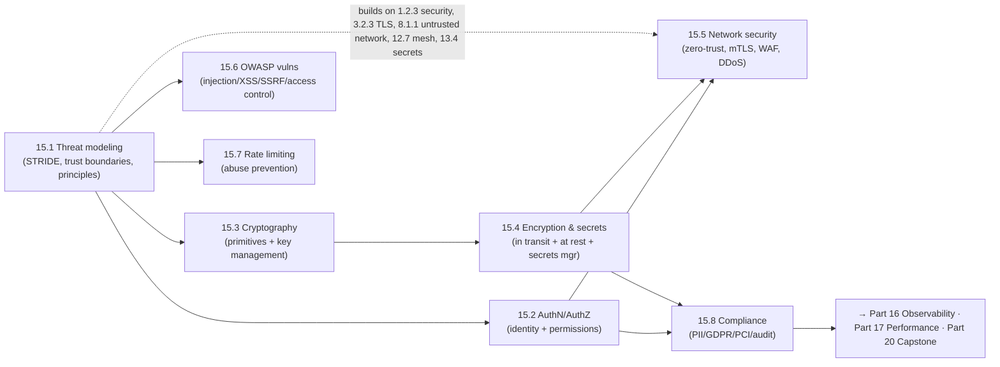

# Part 15 — Security ✅ COMPLETE

Securing systems by design — unified by one idea: **security is a design property, not a feature — threat-model early (STRIDE, trust boundaries, least privilege, defense in depth, assume breach); authenticate and authorize precisely (never confuse AuthN with AuthZ); use vetted cryptography and manage keys/secrets carefully; encrypt everywhere; adopt zero-trust (never trust the network, verify every request); prevent the common OWASP vulnerabilities (separate data from code); rate-limit abuse; and design for compliance (PII, GDPR, PCI, audit) — because the same preventable mistakes cause most breaches.**

---

## Lessons

| # | Lesson | Core idea |
|---|--------|-----------|
| 15.1 | [Threat Modeling (STRIDE)](15.1-threat-modeling-stride-trust-boundaries.md) | Security designed in, not bolted on; four questions; STRIDE taxonomy; trust boundaries (never trust data crossing one); minimize attack surface; least privilege / defense in depth / fail secure / assume breach |
| 15.2 | [AuthN/AuthZ; Sessions/JWT/OAuth2/OIDC](15.2-authn-authz-sessions-jwt-oauth-oidc.md) | AuthN (who) ≠ AuthZ (what) — broken access control is #1; sessions (stateful, easy revoke) vs JWT (stateless, hard revoke → short-lived+refresh); OAuth2 = delegated authorization; OIDC = authentication |
| 15.3 | [Cryptography for Architects](15.3-cryptography-for-architects.md) | Don't roll your own; symmetric (fast/shared) vs asymmetric (keypair/slow) → hybrid (TLS); hashing (integrity) vs password hashing (slow+salted); MAC vs signature (non-repudiation); key management is the hardest part (KMS/HSM) |
| 15.4 | [Encryption & Secrets Management](15.4-encryption-transit-rest-secrets.md) | Encrypt in transit (TLS everywhere incl. internal) AND at rest (storage + field-level/tokenization); secrets manager (central/least-priv/audited/rotated/dynamic); KMS + envelope encryption; never commit secrets |
| 15.5 | [Network Security: Zero-Trust/mTLS/WAF/DDoS](15.5-network-security-zero-trust-mtls-waf-ddos.md) | Perimeter failed (lateral movement) → zero-trust (never trust the network, verify every request by identity); mTLS via mesh; WAF (L7, not a fix); DDoS absorbed at edge (CDN/anycast); defense in depth |
| 15.6 | [OWASP Vulnerabilities/Injection/SSRF](15.6-owasp-vulnerabilities-injection-ssrf.md) | OWASP Top 10 checklist; injection root cause = mixing data with code → fix by separating them (parameterized queries, output encoding); allow-list validation (not a substitute); SSRF; broken access control |
| 15.7 | [Rate Limiting & Abuse Prevention](15.7-rate-limiting-abuse-prevention.md) | Dual-purpose (reliability + security); token/leaky bucket, sliding window; dimensions (per-IP/user/key/global — combine); edge + distributed enforcement; brute-force/stuffing/scraping/DoS + CAPTCHA/lockout/MFA/anomaly |
| 15.8 | [Compliance: PII/GDPR/PCI/Audit](15.8-compliance-pii-gdpr-pci-audit.md) | Compliance as a first-class driver; PII classification + minimization; GDPR data rights (deletion is hard) + residency; PCI scope reduction (tokenization); immutable tamper-evident audit logging (redact secrets); reuses security controls |

---

## The through-line of Part 15

**One sentence:** Design security in via threat modeling (STRIDE, trust boundaries, least privilege, defense in depth, assume breach — 15.1); authenticate and authorize precisely without confusing the two (15.2); use vetted cryptography and manage keys carefully (15.3); encrypt everywhere and manage secrets in a proper manager + KMS (15.4); adopt zero-trust with mTLS, WAF, and edge DDoS absorption (15.5); prevent the common OWASP vulnerabilities by separating data from code (15.6); rate-limit to neutralize volume-based abuse (15.7); and design for compliance with data minimization, encryption, deletion rights, scope reduction, and immutable audit logging (15.8).

---

## The key decisions Part 15 equips you to make

- **What can go wrong, and where?** Threat-model with STRIDE at every trust boundary; minimize attack surface; apply least privilege / defense in depth / assume breach. (15.1)
- **Who are you and what may you do?** Separate AuthN from AuthZ (enforce authz server-side); sessions vs JWT; OIDC to log in, OAuth2 for delegated access. (15.2)
- **How do we use crypto correctly?** Don't roll your own; match primitive to goal; hybrid encryption; slow+salted password hashing; manage keys via KMS/HSM. (15.3)
- **How do we protect data?** Encrypt in transit (incl. internal mTLS) + at rest (field-level for sensitive); secrets manager + envelope encryption; never commit secrets. (15.4)
- **How do we secure the network?** Zero-trust (verify every request by identity); mTLS via mesh; WAF + edge DDoS absorption; defense in depth. (15.5)
- **How do we prevent common vulns?** OWASP checklist; separate data from code (parameterize/encode); allow-list validation; SSRF + broken-access-control fixes. (15.6)
- **How do we stop abuse?** Rate limiting (right algorithm/dimension, edge + distributed) + CAPTCHA/lockout/MFA/anomaly detection. (15.7)
- **How do we meet legal requirements?** Data classification/minimization, GDPR rights, PCI scope reduction, residency, immutable audit logging. (15.8)

---

## Self-check before Part 16

Without notes, can you:
1. Threat-model a system with STRIDE, identify trust boundaries, minimize attack surface, and apply the core principles?
2. Distinguish AuthN from AuthZ, compare sessions vs JWT, and explain OAuth2 vs OIDC correctly?
3. Match crypto primitives to goals (symmetric/asymmetric/hash/MAC/signature), explain hybrid encryption + password hashing, and why key management is the hardest part?
4. Explain encryption in transit vs at rest (and the levels), and design secrets management (manager + KMS + envelope + dynamic secrets)?
5. Explain zero-trust vs perimeter, mTLS, WAF, and DDoS mitigation, and layer them (defense in depth)?
6. Explain the injection root cause and its fixes (parameterization/encoding), allow-list validation, SSRF, and broken access control?
7. Design rate limiting (algorithm/dimension/enforcement) as an abuse-prevention control, plus complementary controls?
8. Explain compliance as an architectural driver (PII/GDPR/PCI), the deletion challenge, scope reduction, and audit logging?

If any are shaky, revisit that lesson's Revision Notes. Part 16 (Observability) builds on audit/logging (15.8) and the security monitoring/detection needs here; Part 17 (Performance) and Part 20 (Capstone) integrate security + compliance into the full design.

---

*Reference asset for this part: `../../reference/security-cheatsheet.md`.*
