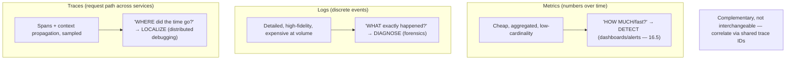
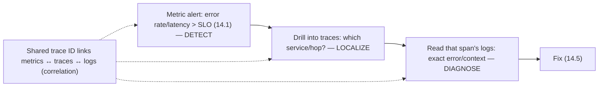

# Lesson 16.1 — The Three Pillars: Metrics, Logs, Traces (and Their Limits)

> Part 16: Observability · Difficulty: 🟡🔴
>
> **Prerequisites:** [1.2.2 Observability], [14.3 Monitoring/Observability/Golden Signals], [12.3 Communication (fan-out)], [8.1.1 Partial Failure].
> **Unlocks:** [16.2 Metrics/TSDB], [16.3 Logging], [16.4 Tracing], [16.5 Dashboards/Alerts], [16.6 Designing a Monitoring Platform].

---

## 1. Learning Objectives

After this lesson you will be able to:

- Define the **three pillars of observability** — **metrics, logs, traces** — and precisely what each is good and bad at.
- Explain **why you need all three** (they're complementary, not interchangeable) and how they work together to answer questions.
- Recognize the **limits of the three-pillars model** and the shift toward **high-cardinality wide events** (14.3 observability) for the unknown-unknowns.
- Choose the right pillar for a given question (dashboards/alerts → metrics; forensics → logs; cross-service latency → traces).
- Understand the **cost/cardinality** tradeoffs that recur throughout Part 16.

---

## 2. Motivation — Three kinds of telemetry, three kinds of question

Part 14 established **why** observability matters (14.3): monitoring answers **known-unknowns**, observability answers **unknown-unknowns** — the novel questions distributed systems (Parts 8–12) inevitably raise. This part goes **deep on how**. The starting framework is the **"three pillars" of observability**: **metrics** (aggregated numbers over time), **logs** (discrete event records), and **traces** (a request's path across services). They're called pillars because a mature observability practice traditionally rests on all three — and each answers a **fundamentally different kind of question**.

**Metrics** answer "**how much / how many / how fast**, over time" — cheap, aggregatable, perfect for **dashboards and alerts** (the golden signals — 14.3), but they **lose detail** (you can't ask "*why* did this specific request fail?" from a counter). **Logs** answer "**what exactly happened** in this event" — detailed, high-fidelity, perfect for **forensic investigation**, but **expensive at volume** and hard to aggregate. **Traces** answer "**where did the time go / what path did this request take**" across services — essential for **distributed debugging** (12.3 fan-out) where a single request touches dozens of services, but they add instrumentation overhead. The critical insight is that these are **complementary, not interchangeable**: you use **metrics to detect** a problem (a dashboard/alert), **traces to localize** it (which service/hop), and **logs to diagnose** it (the exact error). This lesson defines each pillar, its strengths and limits, how they combine, and the modern critique that pushes beyond three fixed pillars toward high-cardinality events — setting up the deep dives in 16.2–16.6.

---

## 3. Theory — From first principles

### 3.1 Metrics — aggregated numbers over time

`[CS]` **Metrics** = **numeric measurements aggregated over time**, usually as **time series** (a value + timestamp + labels/dimensions) `[CS]`:
- Examples: request rate (RPS), error count, latency percentiles (p99), CPU%, queue depth — the **golden signals** (14.3) are metrics.
- **Types:** **counters** (monotonically increasing — total requests), **gauges** (a value that goes up/down — current connections), **histograms/summaries** (distributions — for percentiles).
- `[BP]` **Strengths:** **cheap + compact** (aggregated, not per-event → constant storage regardless of traffic), **fast to query** (pre-aggregated), ideal for **dashboards, alerting, trends** (16.5), and long retention (§3.6).
- `[BP]` **Limits:** **aggregation loses detail** — a metric tells you *that* error rate rose, not *which* requests failed or *why*. **Low cardinality** (16.2): you can't add high-cardinality dimensions (user ID, request ID) without blowing up cost (§3.6) → metrics can't answer "what happened to *this specific* request." **Metrics detect; they don't diagnose.**

### 3.2 Logs — discrete event records

`[CS]` **Logs** = **discrete, timestamped records of individual events** — a detailed account of "what happened" `[CS]`:
- Examples: "request X failed with error Y at time Z for user U," an exception stack trace, an audit event (15.8).
- **Structured vs unstructured** (16.3): **structured logs** (key-value/JSON) are queryable/aggregatable; **unstructured** (free text) are human-readable but hard to query. `[BP]` **Prefer structured.**
- `[BP]` **Strengths:** **high detail/fidelity** (the full context of an event), **forensic** value (reconstruct exactly what happened — 14.5 incident investigation), can carry **high-cardinality** fields (user/request IDs).
- `[BP]` **Limits:** **expensive at volume** (a log per event → storage/ingest cost scales with traffic → 16.3), **hard to aggregate** (need indexing/search — 16.3), noisy, and **per-service** (a log line doesn't show the request's whole journey across services — that's traces — §3.3). **Logs diagnose a point; they don't show the path.**

### 3.3 Traces — a request's path across services

`[CS]` **Distributed traces** = the **end-to-end path of a single request as it flows across services**, broken into **spans** `[CS]`:
- A **trace** = the whole request; a **span** = one unit of work (a service call, a DB query) with a start/end time, parent, and metadata. Spans form a tree/DAG showing the **causal path + timing** (16.4).
- **Context propagation** (16.4): a **trace ID** is passed along the request (via headers) so all spans across all services are **linked into one trace** (12.3 fan-out).
- `[BP]` **Strengths:** the **only** pillar that shows a request's **journey across services** and **where the time went** (which hop is slow) — essential for **distributed debugging** (Parts 8–12) and **tail-latency analysis** (Part 17). Answers "why is *this* request slow, and where?"
- `[BP]` **Limits:** **instrumentation overhead** (every service must propagate context + emit spans — often via a mesh — 12.7 or auto-instrumentation — 16.4), **cost at full volume** (→ **sampling** — 16.4), and they show **paths/timing** but not always the fine detail of *why* (logs do). **Traces localize; logs diagnose.**

### 3.4 Why you need all three — they're complementary

`[BP]` The pillars answer **different questions** and are **used together** `[BP]`:
- **Metrics → detect:** a dashboard/alert (16.5) shows error rate/latency crossed the SLO (14.1) — "**something is wrong**."
- **Traces → localize:** find a slow/failing trace → see **which service/hop** is the culprit in the request's path (12.3) — "**where** is it wrong."
- **Logs → diagnose:** look at the logs for that service/request → the **exact error/context** — "**why** is it wrong."
- `[BP]` **The workflow:** **metric alert → drill into traces → read logs** — detect, localize, diagnose. None replaces another: a metric can't tell you *why*; a log can't show the *path*; a trace can't give you cheap trend alerting. **Correlate them** (§3.5) — the same trace ID in logs + traces + metric exemplars links them.
- This maps to the golden-signals + symptom/cause model (14.3): **metrics = symptoms** (alert on these), **traces + logs = diagnosis** (find the cause).

### 3.5 Correlation — linking the pillars

`[BP]` The pillars are far more powerful when **linked** `[BP]`:
- **Shared identifiers:** propagate a **trace ID** (and span ID) into **logs** (structured — 16.3) so you can jump from a trace to its logs and vice versa; attach **exemplars** (a trace ID on a metric data point) so a latency spike links to an example slow trace.
- **Consistent labels/dimensions** (service, endpoint, version, region) across all three → pivot between them.
- `[BP]` **The goal:** from a **metric anomaly**, jump to the **exemplar trace**, then to the **logs** of the slow span — a seamless **detect→localize→diagnose** flow. Correlation is what turns three separate tools into an **observability system** (16.6). Without it, you're manually cross-referencing timestamps.

### 3.6 Cost and cardinality — the recurring constraint

`[CS]` A theme across all of Part 16: **telemetry is expensive, and cardinality is the key cost driver** `[CS]`:
- **Cardinality** = the number of **unique combinations** of label values. Adding a high-cardinality dimension (user ID, request ID — millions of values) to a **metric** creates a **separate time series per value** → **cost explosion** (16.2). This is why metrics stay **low-cardinality** (§3.1).
- **Logs** scale cost with **event volume** (one record per event — 16.3); **traces** with volume too (→ **sampling** — 16.4).
- `[BP]` **The tradeoff:** more telemetry / higher cardinality = more insight but more cost (storage/ingest/query — 1.2.3). **Manage it:** low-cardinality metrics + sampled traces + structured/leveled logs, and (the modern approach — §3.7) **high-cardinality wide events** where you need to slice arbitrarily. **Observability has a real cost budget** — design telemetry deliberately.

### 3.7 Beyond three pillars — high-cardinality wide events

`[EMERGING]`/`[OPINION]` A modern critique: the **"three pillars"** framing is useful but **incomplete** for true observability (14.3 — unknown-unknowns) `[OPINION]`:
- **The limit:** metrics (low-cardinality, pre-aggregated) + logs (unstructured, per-event) + traces (sampled) as **three separate silos** make it hard to **ask arbitrary new questions** — the essence of observability (14.3).
- **The alternative:** **high-cardinality, high-dimensional structured events** ("wide events") — rich, per-request records with **many arbitrary dimensions** (user, region, version, feature flag, latency, error, ...) that you can **slice and aggregate arbitrarily** to debug **novel** problems (the specific slice — 14.3) — **without** pre-defining metrics. This unifies the pillars' value (aggregate like metrics, detail like logs, causal like traces) in one queryable event store. `[EMERGING]`
- `[BP]` **The takeaway:** the three pillars are the **traditional, still-widely-used** model (and the deep dives 16.2–16.4 cover them), but understand their **limits** — for true observability you want **high-cardinality, arbitrarily-sliceable** telemetry, and modern tools blur the pillar boundaries. Use the pillars as **tools**, not dogma; the **goal** is answering arbitrary questions (14.3).

---

## 4. Visual Intuition

### The three pillars: strengths + question each answers

### The detect → localize → diagnose workflow

---

## 5. Real-World Analogy

Think of diagnosing a problem in a **large factory** with three different kinds of instruments — each answers a different question, and you need all three.

- **Metrics = the wall of gauges and dashboards:** the factory has **live gauges** — units produced per hour, defect rate, machine temperatures, queue lengths at each station. They're **cheap to run continuously**, show **trends over time**, and are perfect for **noticing something is wrong** ("defect rate just spiked!") and **triggering alarms**. But a gauge only shows a **number** — it tells you *that* defects rose, **not which product, on which line, or why**. It **detects**, but can't diagnose.
- **Logs = the detailed station journals:** each workstation keeps a **detailed journal** — "at 14:32, unit #4471 failed inspection because bolt torque was low." Incredibly **detailed and specific** (perfect for **forensic investigation** — reconstructing exactly what happened to a unit), but there's a journal entry for **every single unit** (expensive to store/search at volume), and each journal only covers **one station** — it doesn't show a unit's **whole journey** through the factory.
- **Traces = following one product through the whole line:** to understand why unit #4471 took so long, you **follow that specific unit's path** across every station — welding (2 min), painting (5 min), **inspection (40 min — the bottleneck!)**, packing (1 min). This is the **only** view that shows **where the time went across the whole line** — essential when a product passes through **dozens of stations** (microservices — 12.3). It **localizes** the slow station.
- **Why all three (the workflow):** the **gauge alarm** tells you defects spiked (**detect**); you **follow slow/failed units through the line** to find the inspection station is the culprit (**localize**); you **read that station's journal** to see the exact cause — a miscalibrated torque wrench (**diagnose**). No single instrument does all three — and to jump between them instantly, every unit carries a **serial number** stamped on it and written in every journal and trace (**correlation via shared IDs**).
- **Beyond three pillars:** the most modern factory records a **rich, detailed profile for every single unit** — every measurement, every station, every attribute — in **one searchable database**, so investigators can **slice it any way they want** ("show me all units that were slow *only* on the night shift *and* used bolts from supplier X") to chase down **problems no one anticipated** (high-cardinality wide events / unknown-unknowns).

---

## 6. Industry Example

- **The "three pillars" model** `[CONV]`: metrics + logs + traces as the standard observability framework (§3.1–3.3). *(Representative.)*
- **OpenTelemetry** `[CONV]`: a standard for emitting + correlating all three pillars (metrics/logs/traces) with shared context (§3.5, 16.4). *(Representative.)*
- **Prometheus (metrics) + Elasticsearch/Loki (logs) + Jaeger/Tempo (traces)** `[CONV]`: representative tools per pillar (§3.1–3.3). *(Representative.)*
- **High-cardinality observability tools** `[EMERGING]`: platforms built on wide events for arbitrary slicing (§3.7). *(Representative.)*
- **Exemplars / trace-to-log correlation** `[CONV]`: linking a metric spike to an example trace to its logs (§3.5). *(Representative.)*

---

## 7. Implementation Details

- **Emit all three pillars** (§3.4): metrics for the golden signals (14.3) + dashboards/alerts (16.5); structured logs (16.3) for events; distributed traces (16.4) for cross-service paths.
- **Correlate them** (§3.5): propagate a **trace ID** into logs + metric exemplars; use **consistent labels** (service/endpoint/version/region) across all three.
- **Manage cardinality/cost** (§3.6): keep **metrics low-cardinality** (16.2); **sample traces** (16.4); **structure + level** logs (16.3); budget telemetry cost (1.2.3).
- **Use the right pillar per question** (§3.4): metrics=detect/dashboards/alerts; traces=localize/cross-service latency; logs=diagnose/forensics.
- **Standardize** (§3.5): OpenTelemetry for vendor-neutral emission + correlation (16.4).
- **Consider high-cardinality wide events** (§3.7) where you need to debug novel problems by arbitrary slicing (14.3) — beyond fixed metrics.
- **Don't over-collect** — telemetry has real cost; instrument the critical paths + golden signals first, expand where incidents reveal gaps (14.3).

---

## 8. Advantages (of the three-pillar approach)

- **Complementary coverage** — detect (metrics) + localize (traces) + diagnose (logs) (§3.4).
- **Metrics:** cheap, fast, aggregatable → dashboards/alerts/trends (§3.1).
- **Logs:** high-detail forensics for exact events (§3.2).
- **Traces:** the only cross-service path/timing view (§3.3, 12.3).
- **Correlation** → fast detect→localize→diagnose flow (§3.5).
- **Standardization (OTel)** → vendor-neutral, portable telemetry (§3.5).

---

## 9. Disadvantages / costs

- **Cost + cardinality** — telemetry is expensive; high cardinality blows up metrics (§3.6).
- **Three silos** — separate tools/stores that must be correlated (§3.7).
- **Metrics lose detail** — can't diagnose specific requests (§3.1).
- **Logs expensive + noisy at volume** (§3.2, 16.3).
- **Traces need instrumentation + sampling** (§3.3, 16.4).
- **The pillar model is incomplete** — true observability needs high-cardinality events (§3.7).
- **Instrumentation effort** — emitting + correlating all three across a fleet (§3.4).

---

## 10. When NOT to / cautions

- **Don't rely on one pillar** — metrics alone can't diagnose; logs alone can't show the path (§3.4).
- **Don't put high-cardinality dimensions in metrics** — cost explosion (§3.6, 16.2).
- **Don't log everything at full volume** — cost + noise; structure + level + sample (§3.2/3.6, 16.3).
- **Don't trace 100% at scale** without sampling (§3.3, 16.4).
- **Don't skip correlation** — uncorrelated pillars force manual timestamp cross-referencing (§3.5).
- **Don't treat "three pillars" as the whole story** — understand their limits (§3.7).

---

## 11. Common Mistakes

1. **Using metrics to try to diagnose** specific requests (they can't — aggregated) (§3.1).
2. **High-cardinality metric labels** (user/request ID) → cost explosion (§3.6, 16.2).
3. **Only logs, no traces** — can't debug cross-service latency/fan-out (§3.3, 12.3).
4. **Uncorrelated pillars** — no shared trace ID → manual cross-referencing (§3.5).
5. **Logging everything** at full volume/unstructured → cost + unqueryable (§3.2, 16.3).
6. **100% tracing at scale** — cost blowup; needs sampling (§3.3, 16.4).
7. **One pillar as the whole strategy** — missing detect/localize/diagnose coverage (§3.4).
8. **Ignoring telemetry cost** — surprise observability bills (§3.6).

---

## 12. Interview Questions

**🟢 Easy**
- What are the three pillars of observability, and what is each good for?
- Why can't metrics answer "why did this specific request fail?"

**🟡 Medium**
- How do metrics, logs, and traces work together (detect → localize → diagnose)?
- What is cardinality, and why does it matter for metrics cost?

**🔴 Hard**
- How do you correlate the three pillars, and why is correlation essential?
- What are the limits of the three-pillars model, and what do high-cardinality wide events add (14.3)?

**⚫ Staff+**
- Design the telemetry strategy for a microservices system (Part 12): which pillar for which question, correlation via trace IDs, cardinality/cost management, and standardization (OpenTelemetry). How would you debug a novel latency issue affecting one region?
- Argue the "three pillars vs high-cardinality events" debate: where each shines, cost implications, and how you'd build an observability system that supports arbitrary questions (14.3, 16.6).

---

## 13. Production Pitfalls

- **Metric cardinality explosion:** adding a user-ID label created millions of time series → the metrics system fell over / bill spiked (§3.6, 16.2).
- **Undebuggable cross-service latency:** metrics showed high latency but no traces → hours guessing which service (§3.3, 12.3).
- **Diagnosis without correlation:** metrics, logs, and traces in separate tools with no shared ID → slow manual cross-referencing during an incident (§3.5).
- **Log cost blowout:** logging every request at full volume/unstructured → huge ingest cost + unqueryable (§3.2, 16.3).
- **Sampling hid the incident:** naive trace sampling dropped the very traces needed to debug a rare error (§3.3, 16.4).
- **One-pillar blind spot:** a metrics-only setup couldn't diagnose *why* the golden signal degraded (§3.1/3.4).

---

## 14. Optimization Techniques

- **Right pillar per question** — metrics detect, traces localize, logs diagnose (§3.4).
- **Correlate via trace IDs + consistent labels + exemplars** for a seamless flow (§3.5).
- **Low-cardinality metrics + sampled traces + structured/leveled logs** to control cost (§3.6).
- **OpenTelemetry** for standardized, correlated emission (§3.5, 16.4).
- **High-cardinality wide events** where arbitrary slicing / novel debugging is needed (§3.7).
- **Instrument critical paths + golden signals first**, expand from incident gaps (§3.4, 14.3).
- **Budget telemetry cost** deliberately (§3.6, 1.2.3).

---

## 15. Summary

The **three pillars of observability** — **metrics, logs, traces** — each answer a **fundamentally different kind of question**, and a mature practice traditionally uses **all three** (they're **complementary, not interchangeable**). **Metrics** are **numeric measurements aggregated over time** (time series with labels — counters/gauges/histograms; the golden signals — 14.3) — **cheap, compact, fast to query, low-cardinality** → ideal for **dashboards, alerts, and trends** (detect), but **aggregation loses detail** (they tell you error rate *rose*, not *which* request failed or *why*) and can't hold high-cardinality dimensions (16.2). **Logs** are **discrete, timestamped records of individual events** — **high-detail, high-fidelity, forensic** (reconstruct exactly what happened — 14.5), can carry high-cardinality fields, and are best **structured** (16.3) — but **expensive at volume**, hard to aggregate, and **per-service** (a log doesn't show the request's whole journey). **Traces** capture a **single request's end-to-end path across services**, broken into **spans** (units of work with timing/parent) linked by a propagated **trace ID** (16.4) — the **only** pillar that shows **where the time went across services** (essential for distributed debugging — 12.3 — and tail latency — Part 17), but with **instrumentation overhead** and needing **sampling** at scale (16.4). Together they form the workflow **metrics → detect** ("something is wrong" — an SLO alert — 14.1), **traces → localize** ("which service/hop?"), **logs → diagnose** ("the exact error/why") — mapping to symptom/cause (14.3: metrics = symptoms to alert on; traces + logs = diagnosis). They're vastly more powerful when **correlated** — a shared **trace ID** propagated into logs + metric **exemplars**, plus consistent labels — enabling a seamless jump from a metric anomaly → exemplar trace → the slow span's logs (correlation turns three tools into an observability *system* — 16.6). Throughout Part 16, **cost and cardinality** are the recurring constraint: **cardinality** (unique label-value combinations) is the key metrics cost driver (high-cardinality dimensions explode time-series count — 16.2), logs scale cost with volume (16.3), traces need sampling (16.4) — so manage telemetry deliberately (1.2.3). Finally, the **three-pillars model is useful but incomplete** for true observability (14.3 — unknown-unknowns): three separate silos make **arbitrary new questions** hard, so the modern direction is **high-cardinality, high-dimensional wide events** you can **slice arbitrarily** to debug novel problems (unifying the pillars' value in one queryable store) — use the pillars as **tools, not dogma**; the **goal** is answering arbitrary questions.

---

## 16. Revision Notes (flashcard-ready)

- **Q:** Three pillars? **A:** Metrics (numbers over time), logs (discrete events), traces (request path across services).
- **Q:** Metrics — good/bad at? **A:** Cheap/aggregated/low-cardinality → detect/dashboards/alerts; but lose detail (can't diagnose a specific request).
- **Q:** Logs — good/bad at? **A:** High-detail forensics of what happened; but expensive at volume, per-service (no cross-service path).
- **Q:** Traces — good/bad at? **A:** Show a request's path + where time went across services; but instrumentation overhead + need sampling.
- **Q:** The workflow? **A:** Metrics detect → traces localize → logs diagnose.
- **Q:** Why all three? **A:** Complementary — metric can't say why; log can't show path; trace can't give cheap trend alerts.
- **Q:** Correlation? **A:** Shared trace ID in logs + metric exemplars + consistent labels → jump metric→trace→log seamlessly.
- **Q:** Cardinality? **A:** Number of unique label-value combos; high cardinality in metrics = time-series explosion = cost blowup.
- **Q:** Limit of the three-pillars model? **A:** Three silos make arbitrary new questions hard → high-cardinality wide events (unknown-unknowns — 14.3).
- **Q:** Metrics=symptoms, traces+logs=? **A:** Diagnosis (cause) — ties to symptom vs cause (14.3).

---

## 17. Further Reading + Knowledge-Graph Links

**Foundations (in-platform):**
- **[1.2.2 Observability]** & **[14.3 Monitoring/Observability/Golden Signals]** — the why + monitoring-vs-observability.
- **[12.3 Communication]** — fan-out that requires tracing.
- **[8.1.1 Partial Failure]** — the emergent failures telemetry must reveal.

**Unlocks / next:**
- **[16.2 Metrics/TSDB/Cardinality]** — metrics in depth.
- **[16.3 Structured Logging]** — logs in depth.
- **[16.4 Distributed Tracing]** — traces + OpenTelemetry in depth.
- **[16.5 Dashboards/Alerts]** & **[16.6 Monitoring Platform]** — putting it together.

**External (canonical):**
- Majors et al., *Observability Engineering* — pillars critique + high-cardinality events. *(Representative.)*
- OpenTelemetry documentation. *(Representative.)*
- Beyer et al., *SRE* — monitoring/telemetry. *(Representative.)*

> **Knowledge-graph:** `14.3 observability/golden signals` → **`16.1 three pillars (metrics/logs/traces + limits)`** → `16.2 metrics` / `16.3 logs` / `16.4 traces` / `16.5 dashboards-alerts` / `16.6 platform`.
