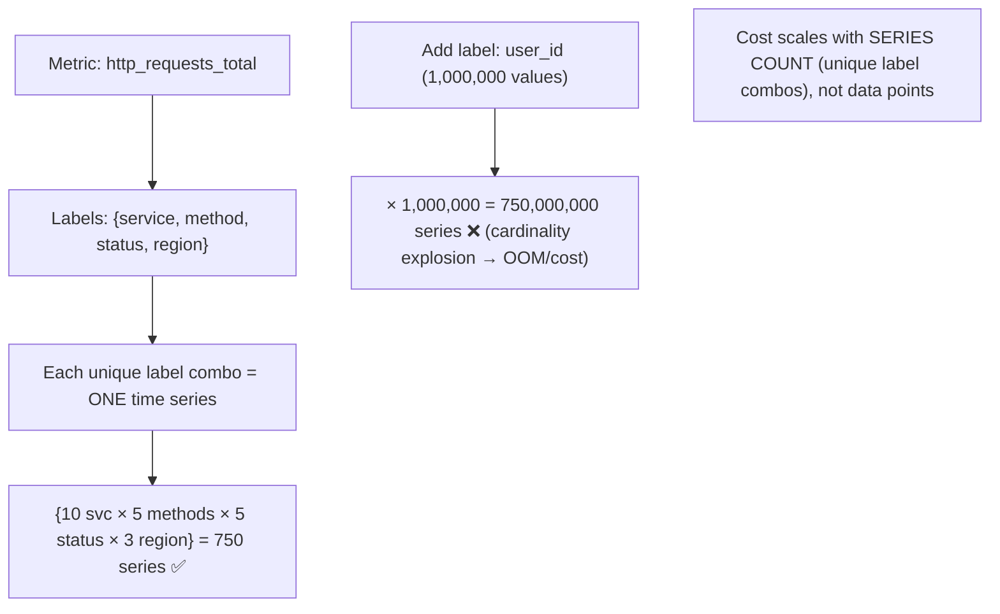
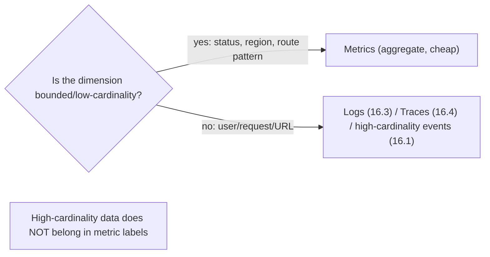

# Lesson 16.2 — Metrics Systems, Time-Series Databases, Cardinality

> Part 16: Observability · Difficulty: 🟡🔴
>
> **Prerequisites:** [4.2.3 LSM-Trees], [7.3 Sharding/Partitioning], [14.3 Golden Signals], [16.1 Three Pillars].
> **Unlocks:** [16.5 Dashboards/Alerts], [16.6 Monitoring Platform], [Part 17 Performance].

---

## 1. Learning Objectives

After this lesson you will be able to:

- Explain how a **metrics system** works: **time series** (metric name + labels → sequence of timestamped values), collection (push vs pull), and storage in a **TSDB**.
- Explain why **time-series databases** are specialized (append-heavy, time-ordered, compressible) and how they differ from general databases (4.2.3 LSM lineage).
- Deeply understand **cardinality** — why it's *the* dominant cost/scaling driver for metrics, and how high-cardinality labels cause explosions.
- Apply cardinality-control techniques and the metric-vs-event tradeoff (16.1 §3.7).
- Understand aggregation, retention/downsampling, and the pull (Prometheus-style) vs push models.

---

## 2. Motivation — Cheap, fast numbers — until cardinality bites

Metrics (16.1) are the workhorse of observability — cheap, aggregatable, and the basis of dashboards and alerts (16.5) on the golden signals (14.3). But "cheap" has a crucial caveat that trips up almost every team eventually: **cardinality**. A metrics system stores **time series**, and the number of time series it must track — and therefore its **memory, storage, and cost** — is driven by the number of **unique label combinations**. Add a label with **millions of possible values** (a user ID, a request ID, a full URL) and you create **millions of time series** — a **cardinality explosion** that can crash the metrics system or blow the budget overnight. This single concept explains most metrics-system operational pain and most "why is our monitoring bill so high?" questions.

Understanding metrics deeply means understanding the **time series** data model, the **specialized storage** (TSDBs) built for it (append-heavy, time-ordered, highly compressible writes — building on the LSM/log-structured ideas from Part 4), the **collection models** (push vs pull), and above all **cardinality** — what drives it, why it explodes, and how to control it. It also means knowing the **boundary of metrics**: when a question needs high cardinality (per-user, per-request), metrics are the wrong tool — reach for logs (16.3), traces (16.4), or high-cardinality events (16.1 §3.7). This lesson develops the metrics data model, TSDBs, the pull/push debate, and — centrally — cardinality and its control.

---

## 3. Theory — From first principles

### 3.1 The time-series data model

`[CS]` A **metric** is stored as one or more **time series**: a **metric name + a set of labels (key-value dimensions)** identifies a series, which is a **sequence of (timestamp, value) points** `[CS]`:
- Example: `http_requests_total{service="orders", method="POST", status="200", region="eu"}` → one time series; changing **any** label value → a **different** time series.
- **Labels/dimensions** let you slice/aggregate ("total requests," "requests by status," "p99 by region") — the power of metrics.
- **Metric types** (16.1): **counter** (monotonic), **gauge** (up/down), **histogram** (bucketed distribution → percentiles).
- `[BP]` **Key insight:** the metrics system tracks **one series per unique label combination** → the **number of series** (not the number of data points) is the dominant cost/scaling factor (§3.4).

### 3.2 Time-series databases (TSDBs)

`[CS]` A **TSDB** is a database **specialized for time-series data** — because the workload has distinctive properties `[CS]`:
- **Workload characteristics:** **append-heavy** (constant stream of new points, rarely updates), **time-ordered** (points arrive in time order), **recent-data-hot** (queries usually target recent time), **highly compressible** (consecutive values/timestamps are similar → delta + specialized compression), and **bulk time-range reads** for dashboards.
- **Why specialized (vs a general DB):** a general RDBMS/KV store isn't optimized for this; TSDBs use **append-optimized, time-partitioned storage** (LSM-tree lineage — 4.2.3, or custom columnar/compressed formats), **aggressive compression** (delta-of-delta timestamps, XOR float compression — representative), **time-based partitioning** (7.3 — partition/shard by time window + series), and **downsampling/retention** tiers (§3.6).
- Examples: Prometheus's TSDB, and various scalable/long-term TSDBs (representative).
- `[BP]` TSDBs achieve **huge write throughput + compact storage** for time series — but their scaling is bounded by **series count (cardinality)**, not just data volume (§3.4).

### 3.3 Collection: pull vs push

`[CS]` Two models for getting metrics from services into the system `[CS]`:
- **Pull (scrape):** the metrics system **periodically fetches** metrics from each target's exposed endpoint (e.g., Prometheus scraping `/metrics`). The system **discovers targets** (service discovery — 12.6) and pulls on a schedule.
  - `[BP]` **Pros:** the system controls scrape rate; **target liveness** is visible (a scrape failure = target down); no client-side buffering; easy to run ad-hoc. **Cons:** needs reachability + discovery; awkward for short-lived/batch jobs (→ a push gateway) and serverless (§3.5).
- **Push:** services **send** metrics to the system (or a collector/agent). 
  - `[BP]` **Pros:** works for short-lived jobs, serverless, and when the system can't reach targets; **Cons:** clients must buffer/handle backpressure (9.9); harder to detect a silent dead target; can overwhelm the system.
- `[BP]` **In practice:** pull (Prometheus-style) dominates for long-running services; push (via agents/OTLP — 16.4) suits ephemeral workloads + edge. Many setups combine both via a collector.

### 3.4 Cardinality — the dominant constraint

`[CS]` **Cardinality** = the number of **unique time series**, driven by the number of **unique label-value combinations** `[CS]`:
- **The math:** total series ≈ product of the number of distinct values across labels. A metric with labels `{service (10 values), endpoint (50), status (5)}` = 10 × 50 × 5 = **2,500 series** — fine. Add `{user_id (1,000,000)}` → **2.5 billion series** — **catastrophic**.
- **Why it explodes cost:** the TSDB holds **in-memory index + state per series** (and stores each series) → memory/storage/CPU scale with **series count**. High cardinality → **OOM, slow queries, huge cost**, or the system falls over (§3.6 pitfalls).
- **The classic offenders (high-cardinality labels):** **user IDs, request/trace IDs, email addresses, full URLs (with IDs/params), timestamps-as-labels, unbounded/user-controlled values** — anything with many/unbounded distinct values.
- `[BP]` **The golden rule: keep metric labels LOW-cardinality and BOUNDED.** Labels should be a **small, fixed set of values** (status codes, service names, regions, a bounded route pattern) — **never** unbounded/per-entity identifiers. **Cardinality is the #1 metrics operational hazard.**

### 3.5 Controlling cardinality

`[BP]` Techniques to keep cardinality in check `[BP]`:
- **Use bounded labels only:** route **patterns** (`/users/{id}`) not raw paths (`/users/12345`); status **classes** where possible; a **fixed** set of dimensions.
- **Move high-cardinality data out of metrics** → to **logs (16.3), traces (16.4), or high-cardinality events (16.1 §3.7)**, where per-request/per-user detail belongs. **This is the crux:** if you need to slice by user/request, that's **not a metrics job**.
- **Aggregate before storing:** drop or aggregate away high-cardinality dimensions at collection (e.g., don't label by instance if you can aggregate).
- **Limits + guardrails:** enforce **cardinality limits/alerts** so a bad label doesn't silently explode; drop offending series.
- **Recording rules / pre-aggregation:** pre-compute common aggregations to reduce query-time cost.
- `[BP]` **Design metrics deliberately** — every label multiplies cardinality; ask "is this bounded, and do I need to aggregate by it?" before adding a label.

### 3.6 Aggregation, retention, and downsampling

`[BP]` Managing volume over time `[BP]`:
- **Aggregation:** metrics are queried by **aggregating across series** (sum requests over all instances, p99 latency by region) — the reason for labels; aggregation functions + rollups.
- **Retention + downsampling:** you don't keep full-resolution data forever — **downsample** older data (e.g., 15s resolution for recent, 5min for older, 1h for a year) → **tiered retention** balances long-term trends vs storage cost. Recent = high-resolution + hot; old = downsampled + cheap.
- **Histograms for percentiles:** latency SLOs (14.1) need **percentiles**, computed from **histogram buckets** (aggregatable) — not averages (14.3). Choose buckets carefully (bucket boundaries affect accuracy + cardinality).
- `[BP]` These keep the TSDB **fast + affordable** while retaining useful history — tuned to the query patterns (dashboards need recent high-res; capacity trends need long-term downsampled).

### 3.7 The boundary: metrics vs the other pillars

`[BP]` Knowing **when NOT to use metrics** is as important as using them (16.1) `[BP]`:
- **Metrics are for:** **aggregate, low-cardinality** questions over time — golden signals (14.3), dashboards, alerts, trends, capacity (14.6). "How many, how fast, over time, sliced by a few bounded dimensions."
- **Metrics are NOT for:** **high-cardinality / per-entity** questions ("what happened to user X's request Y?") — that's **logs (16.3)**, **traces (16.4)**, or **high-cardinality events (16.1 §3.7)**. Forcing these into metrics causes the cardinality explosion (§3.4).
- `[BP]` **The rule:** if a dimension is **unbounded/high-cardinality**, it belongs in **events/logs/traces**, not metric labels. Use each pillar (16.1) for its strength; metrics stay cheap by staying **low-cardinality**.

---

## 4. Visual Intuition

### Time series + cardinality

### Right pillar by cardinality

---

## 5. Real-World Analogy

Think of tracking a **retail chain's sales** with a **whiteboard of running tallies** — where the danger is adding too many breakdown categories.

- **Time series = a running tally per category:** you keep a **live tally** for each meaningful breakdown — "sales by **store region**," "sales by **product category**," "sales by **payment method**." Each combination (e.g., "West region / Electronics / Credit card") is **its own tally line** that you update over time. Cheap to keep, and great for **trends and dashboards** ("total sales this hour," "which region is up").
- **Cardinality explosion = too many tally lines:** now imagine someone insists on a tally **per individual customer** — with **a million customers**, you'd need **a million tally lines** (times every other breakdown), and your whiteboard (and your accountant's sanity) **collapses**. The number of tallies is driven by the **combinations of categories** — adding one high-variety category (customer ID, receipt number) **multiplies the lines into oblivion**. That's cardinality: the cost is in the **number of tally lines**, not how often you update them.
- **The rule — tallies for bounded categories only:** running tallies work beautifully for **a few, fixed categories** (5 regions, 20 product types, 3 payment methods). For **per-customer** questions ("what did customer #99213 buy last Tuesday?"), you **don't use tallies** — you keep the **detailed receipts** (logs) or **follow that customer's shopping trip** (traces). Forcing per-customer detail onto the tally whiteboard is the mistake.
- **TSDB = a filing system built for tallies:** the tallies are stored in a system **optimized for exactly this** — constantly appending new numbers, mostly reading recent ones, and **compressing** the long streams of similar values efficiently (a TSDB). Old tallies get **summarized to coarser resolution** ("keep hourly detail for a week, daily for a year") to save space (downsampling/retention).
- **Push vs pull = who initiates the count:** either the **head office periodically calls each store** to read its tallies (pull — and if a store doesn't answer, you know it's closed), or each **store phones in its numbers** (push — necessary for a pop-up stall that opens briefly).

---

## 6. Industry Example

- **Prometheus (pull-based TSDB)** `[CONV]`: scrapes `/metrics` endpoints, stores time series in an LSM-lineage TSDB, PromQL for aggregation; target-liveness via scrape success (§3.2/3.3). *(Representative.)*
- **Cardinality explosions** `[CONV]`: the classic metrics incident — a high-cardinality label (user ID / raw URL) OOMs the metrics system (§3.4). *(Representative.)*
- **Compression (delta-of-delta, XOR)** `[CONV]`: TSDB techniques (Gorilla-style) for compact time-series storage (§3.2). *(Representative.)*
- **Downsampling / tiered retention** `[CONV]`: keep high-res recent + downsampled long-term (Thanos/Cortex/Mimir-style scalable setups) (§3.6). *(Representative.)*
- **Histograms for SLO percentiles** `[CONV]`: bucketed histograms to compute p99 for latency SLOs (§3.6, 14.1). *(Representative.)*

---

## 7. Implementation Details

- **Model metrics as name + bounded labels** (§3.1): counters/gauges/histograms; a **small, fixed** label set.
- **Use a TSDB** (§3.2): append-optimized, compressed, time-partitioned; scaled/long-term via a scalable TSDB layer.
- **Choose collection** (§3.3): pull (Prometheus) for long-running services (liveness visible); push/OTLP for ephemeral/serverless; a collector to bridge.
- **Control cardinality (the #1 concern)** (§3.4/3.5): bounded labels only (route **patterns** not raw paths, status classes); **move high-cardinality data to logs/traces/events**; set cardinality **limits + alerts**; aggregate away unneeded dimensions.
- **Aggregation + retention** (§3.6): histograms for percentiles (14.1); tiered retention + **downsampling** for long-term trends; recording rules for common aggregations.
- **Emit the golden signals** (14.3) as metrics for dashboards/alerts (16.5); standardize via OpenTelemetry (16.4).
- **Know the boundary** (§3.7): don't put per-user/per-request in metrics — use the other pillars (16.1).

---

## 8. Advantages

- **Cheap + compact** — aggregated, compressed; constant cost regardless of traffic (if low-cardinality) (§3.1/3.2).
- **Fast queries** — pre-aggregated → great for dashboards/alerts (§3.2, 16.5).
- **Trends + long retention** — downsampled history for capacity/trends (§3.6, 14.6).
- **Aggregatable slicing** — by bounded dimensions (region/status/service) (§3.1/3.6).
- **Liveness (pull)** — scrape failures reveal down targets (§3.3).
- **Percentiles via histograms** — for latency SLOs (§3.6, 14.1).

---

## 9. Disadvantages / costs

- **Cardinality is a hard limit** — high cardinality = explosion/OOM/cost (§3.4) — the dominant hazard.
- **Loses per-entity detail** — can't diagnose specific requests (§3.7, 16.1).
- **Label discipline required** — one bad label breaks the system (§3.4/3.5).
- **Histogram bucket choices** — affect accuracy + cardinality (§3.6).
- **Pull needs reachability/discovery; push needs buffering** (§3.3).
- **Downsampling loses resolution** for old data (a deliberate tradeoff) (§3.6).

---

## 10. When NOT to / cautions

- **Don't put high-cardinality labels in metrics** (user/request/URL IDs) → explosion (§3.4).
- **Don't use metrics for per-entity questions** — use logs/traces/events (§3.7).
- **Don't use raw paths/unbounded values as labels** — use bounded patterns (§3.5).
- **Don't skip cardinality guardrails** — one bad deploy can OOM the system (§3.4/3.5).
- **Don't keep everything at full resolution forever** — downsample (§3.6).
- **Don't use averages for latency** — histograms/percentiles (§3.6, 14.3).

---

## 11. Common Mistakes

1. **High-cardinality labels** (user/request/URL) → cardinality explosion / OOM (§3.4).
2. **Raw URLs as labels** instead of route patterns (§3.5).
3. **Using metrics to answer per-request questions** (§3.7).
4. **No cardinality limits/alerts** — silent explosion (§3.5).
5. **Averages not percentiles** for latency SLOs (§3.6, 14.3).
6. **Unbounded/user-controlled label values** (§3.4).
7. **No downsampling/retention** → runaway storage (§3.6).
8. **Ignoring pull-vs-push fit** — pull for serverless / push with no backpressure (§3.3).

---

## 12. Interview Questions

**🟢 Easy**
- What is a time series, and what defines a unique one?
- Why are time-series databases specialized?

**🟡 Medium**
- What is cardinality, and why is it the dominant cost driver for metrics?
- Compare pull vs push metric collection.

**🔴 Hard**
- How do you control cardinality, and when should high-cardinality data go to logs/traces/events instead of metrics?
- How do TSDBs achieve compact storage + high write throughput (compression, time-partitioning, LSM lineage — 4.2.3)?

**⚫ Staff+**
- Design a metrics pipeline for a large microservices system: data model + bounded labels, TSDB + scaling, collection (pull/push), cardinality guardrails, retention/downsampling, and how it feeds SLO alerts (14.1/16.5). How do you prevent a cardinality explosion?
- A team's metrics system keeps OOMing after deploys. Diagnose (high-cardinality labels), and design the fix (bounded labels, move per-request data to traces/logs, cardinality limits).

---

## 13. Production Pitfalls

- **Cardinality-explosion outage:** a deploy added a `user_id` (or raw-URL) label → millions of series → the metrics system OOM'd / bill spiked (§3.4).
- **Silent explosion:** an unbounded label crept in with no cardinality alert until the system fell over (§3.5).
- **Slow dashboards:** too many series / no recording rules made queries crawl (§3.2/3.6).
- **Average-latency SLO blind spot:** averages hid the p99 tail (should use histograms) (§3.6, 14.3).
- **Serverless metrics gap:** pull-based scraping couldn't reach short-lived functions → missing data (§3.3).
- **Storage runaway:** no downsampling/retention → unbounded TSDB growth (§3.6).

---

## 14. Optimization Techniques

- **Bounded, low-cardinality labels** (route patterns, status classes) — the #1 rule (§3.4/3.5).
- **Move high-cardinality data to logs/traces/events** (§3.7, 16.1).
- **Cardinality limits + alerts** to catch explosions early (§3.5).
- **Recording rules / pre-aggregation** for fast common queries (§3.5/3.6).
- **Tiered retention + downsampling** for cheap long-term trends (§3.6).
- **Histograms for percentiles**; tune buckets (§3.6, 14.1).
- **Compression + time-partitioning (TSDB)** for compact, fast storage (§3.2, 4.2.3/7.3).
- **Right collection model** (pull for long-running; push for ephemeral) (§3.3).

---

## 15. Summary

Metrics are stored as **time series**: a **metric name + a set of labels (dimensions)** identifies a series, which is a **sequence of (timestamp, value) points** — and **changing any label value creates a different series**. Labels enable the aggregation/slicing that makes metrics powerful (requests by status, p99 by region), and metric **types** (counter/gauge/histogram) cover the golden signals (14.3). **Time-series databases (TSDBs)** are **specialized** for this workload — **append-heavy, time-ordered, recent-data-hot, highly compressible** — using **append-optimized, time-partitioned storage** (LSM-tree lineage — 4.2.3, or columnar), **aggressive compression** (delta-of-delta timestamps, XOR floats), **time-based partitioning** (7.3), and **downsampling/retention tiers** — achieving huge write throughput + compact storage, but bounded by **series count**, not data volume. Collection is **pull** (the system scrapes targets on a schedule — Prometheus-style; the system controls rate and sees target liveness, but needs reachability + discovery and struggles with ephemeral jobs) or **push** (services send metrics — good for short-lived/serverless/edge, but needs client buffering + can't easily detect silent dead targets) — often combined via collectors. The dominant constraint is **cardinality** — the number of **unique time series** = the product of distinct label-value counts: a metric with a few bounded labels is a few thousand series (fine), but adding a **high-cardinality label** (user ID, request/trace ID, full URL, unbounded value) multiplies it into **millions/billions** — a **cardinality explosion** that OOMs the system or blows the budget, because the TSDB holds per-series index/state. So the **golden rule** is **keep metric labels low-cardinality and bounded** (status codes, service names, regions, route **patterns** not raw paths) and **never** per-entity/unbounded identifiers — controlled via bounded labels, **cardinality limits + alerts**, aggregating away unneeded dimensions, and (the crux) **moving high-cardinality data out of metrics into logs (16.3), traces (16.4), or high-cardinality events (16.1)**. Volume over time is managed with **aggregation** (across series), **histograms** (for latency percentiles — 14.1, not averages — 14.3), and **tiered retention + downsampling** (high-res recent, coarse long-term). The essential boundary (16.1): **metrics are for aggregate, low-cardinality questions over time** (golden signals, dashboards, alerts — 16.5, trends, capacity — 14.6); **per-entity/high-cardinality questions belong in the other pillars** — use each for its strength, and metrics stay cheap by staying **low-cardinality**.

---

## 16. Revision Notes (flashcard-ready)

- **Q:** Time series? **A:** Metric name + label set → sequence of (timestamp, value); any label change = a new series.
- **Q:** Why specialized TSDBs? **A:** Append-heavy, time-ordered, recent-hot, compressible → append-optimized + compressed + time-partitioned (LSM lineage).
- **Q:** Cardinality? **A:** Number of unique time series = product of distinct label-value counts; the dominant metrics cost/scaling driver.
- **Q:** Cardinality explosion cause? **A:** A high-cardinality label (user/request/URL/unbounded value) multiplies series into millions → OOM/cost.
- **Q:** The golden rule? **A:** Keep metric labels LOW-cardinality + bounded (status/service/region/route-pattern); never per-entity/unbounded IDs.
- **Q:** Where does high-cardinality data go? **A:** Logs (16.3) / traces (16.4) / high-cardinality events (16.1) — NOT metric labels.
- **Q:** Pull vs push? **A:** Pull = system scrapes (liveness visible, needs reachability); push = services send (ephemeral/serverless, needs buffering).
- **Q:** Percentiles from? **A:** Histograms (bucketed, aggregatable) — not averages (14.3).
- **Q:** Retention technique? **A:** Downsampling + tiered retention (high-res recent, coarse long-term) to bound storage.
- **Q:** When NOT metrics? **A:** High-cardinality / per-entity questions → use logs/traces/events instead.

---

## 17. Further Reading + Knowledge-Graph Links

**Foundations (in-platform):**
- **[16.1 Three Pillars]** — metrics vs logs vs traces; the cardinality theme.
- **[4.2.3 LSM-Trees]** — the storage-engine lineage of TSDBs.
- **[7.3 Sharding/Partitioning]** — time/series partitioning for scale.
- **[14.3 Golden Signals]** — the metrics you emit.

**Unlocks / next:**
- **[16.5 Dashboards/Alerts]** — querying metrics for dashboards + SLO burn-rate alerts.
- **[16.6 Monitoring Platform]** — designing the full system.
- **[14.1 SLO]** — percentiles/histograms for SLOs.

**External (canonical):**
- Prometheus documentation (data model, TSDB, PromQL). *(Representative.)*
- Facebook Gorilla paper (time-series compression). *(Representative.)*
- Scalable TSDB systems (Thanos/Cortex/Mimir-style). *(Representative.)*

> **Knowledge-graph:** `16.1 metrics` + `4.2.3 LSM` + `7.3 partitioning` → **`16.2 metrics systems / TSDB / cardinality`** (bounded labels, control cardinality, downsampling) → `16.5 dashboards/alerts` / `16.6 platform`.
