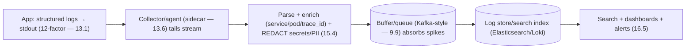
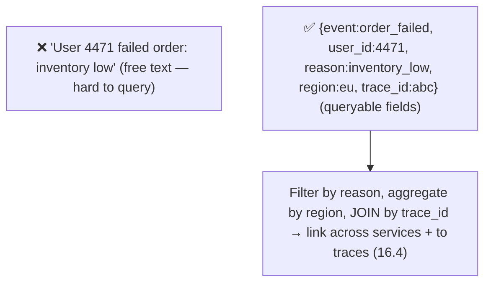

# Lesson 16.3 — Structured Logging and Log Pipelines

> Part 16: Observability · Difficulty: 🟡
>
> **Prerequisites:** [13.1 Logs as Streams (12-factor)], [15.8 Audit Logging], [16.1 Three Pillars], [16.2 Cardinality].
> **Unlocks:** [16.4 Tracing], [16.5 Dashboards/Alerts], [16.6 Monitoring Platform].

---

## 1. Learning Objectives

After this lesson you will be able to:

- Explain **structured logging** (machine-parseable key-value/JSON) vs unstructured free text, and why structure is essential for querying/aggregating at scale.
- Describe the **log pipeline**: emit (stdout — 12-factor 13.1) → collect/ship → parse/enrich → store/index → query/visualize.
- Apply logging best practices: **log levels**, **correlation IDs** (link to traces — 16.4), **sampling**, and **not logging secrets/PII** (15.8/15.4).
- Explain the **cost + volume** problem of logs (16.1/16.2) and controls (sampling, levels, retention, aggregation).
- Distinguish operational logs from **audit logs** (15.8) and choose what/how to log.

---

## 2. Motivation — Detailed records you can actually query

Logs (16.1) are the **detailed, forensic** pillar — the record of "what exactly happened" that you reach for to diagnose an incident (14.5). But logs are only as useful as your ability to **search and aggregate** them, and this is where **structure** becomes decisive. A free-text log line — `"User 4471 failed to place order because inventory was low at 14:32"` — is human-readable but a nightmare to query at scale: you can't easily ask "how many order failures per region in the last hour?" or "all failures for user 4471" without brittle text parsing. A **structured** log — `{"event":"order_failed","user_id":4471,"reason":"inventory_low","region":"eu","ts":"..."}` — is **machine-parseable**, so you can **filter, aggregate, and correlate** it precisely.

But logs also have a **cost problem** (16.1/16.2): one record per event means **ingest, storage, and indexing costs scale with traffic** — a high-traffic service can generate terabytes of logs, most of them never read. So logging is a balance: **structure** for queryability, **levels** to control verbosity, **sampling** to control volume, **correlation IDs** to link logs to traces (16.4), and strict discipline to **never log secrets/PII** (15.4/15.8 — logging them is a breach). And logs don't just sit on a server — they flow through a **pipeline** (emit → ship → parse/enrich → store/index → query), following the 12-factor principle of treating logs as **streams to stdout** (13.1), not files the app manages. This lesson develops structured logging, the log pipeline, best practices, and cost control.

---

## 3. Theory — From first principles

### 3.1 Structured vs unstructured logging

`[CS]` **Structured logging** emits logs as **machine-parseable key-value pairs / JSON** rather than free-text strings `[CS]`:
- **Unstructured:** `"2024-... ERROR User 4471 failed to place order: inventory low"` — human-readable, but querying requires **fragile regex/text parsing**; can't reliably aggregate.
- **Structured:** `{"level":"error","event":"order_failed","user_id":4471,"reason":"inventory_low","region":"eu","trace_id":"abc","ts":"..."}` — **queryable fields**: filter by `reason`, aggregate by `region`, join by `trace_id`.
- `[BP]` **Structured is essential at scale:** it enables **precise filtering, aggregation, and correlation** (§3.4) — turning logs from "grep a file" into a **queryable dataset**. Include **consistent fields** (timestamp, level, service, trace_id — 16.4, relevant context). Modern practice: structured logs approach **high-cardinality wide events** (16.1 §3.7) — rich, per-event, arbitrarily sliceable.

### 3.2 The log pipeline

`[CS]` Logs flow through a **pipeline** from emission to query `[CS]`:
1. **Emit:** the app writes structured logs to **stdout/stderr** (12-factor — 13.1) — **not** to files it manages (the platform captures streams).
2. **Collect/ship:** an **agent/collector** (sidecar — 13.6, or node agent — e.g., Fluentd/Vector/OTel Collector — representative) tails the stream and **ships** logs onward.
3. **Parse/enrich:** parse (if needed), **enrich** with metadata (service, pod, region, trace_id), redact secrets/PII (§3.6).
4. **Buffer/transport:** often through a **buffer/queue** (Part 9 — Kafka-style) to absorb spikes + decouple (backpressure — 9.9) so a log surge doesn't drop data or overwhelm storage.
5. **Store/index:** a **log store/search engine** (Elasticsearch/OpenSearch/Loki-style — representative) indexes logs for search + aggregation.
6. **Query/visualize:** search, dashboards, and alerting on log data (16.5).
- `[BP]` This decouples the **app** (just emit to stdout) from the **pipeline** (collection/enrichment/storage) — the app stays simple + portable (13.1), the pipeline handles the heavy lifting.

### 3.3 Log levels

`[BP]` **Log levels** classify severity/verbosity to **control what's emitted + retained** `[BP]`:
- Common levels: **ERROR** (something failed, needs attention), **WARN** (unexpected but handled), **INFO** (notable normal events), **DEBUG** (detailed diagnostic), **TRACE** (very verbose).
- **Runtime-configurable:** run at **INFO** in production (manageable volume), but **raise to DEBUG** temporarily when investigating (more detail on demand) — without redeploying.
- `[BP]` **Levels control cost + noise** (§3.5): don't log DEBUG in prod by default (volume/cost); reserve ERROR for actual, actionable problems (so error-log volume is a signal — ties to alerting — 16.5/14.4). **Log at the right level** — over-logging INFO/DEBUG is a top cost driver.

### 3.4 Correlation IDs — linking logs across services + to traces

`[CS]`/`[BP]` A single request spans many services (12.3), producing logs in each — to reconstruct the whole request you need a **correlation ID** `[BP]`:
- Generate a **request/correlation ID** (or use the **trace ID** — 16.4) at the entry point and **propagate it** through all services (headers) and **into every log line** (a structured field).
- Now you can **filter all logs for one request across all services** (`trace_id = abc`) → reconstruct the whole journey — essential for distributed debugging (14.5, 16.1 §3.4).
- `[BP]` **Use the trace ID as the correlation ID** (16.4) so logs **link directly to traces** (16.1 §3.5) — jump from a trace's slow span to that span's logs. This correlation is what makes logs powerful in a distributed system; without it, per-service logs are isolated fragments.

### 3.5 The cost/volume problem and controls

`[CS]` Logs are **expensive at volume** — one record per event → ingest/storage/index cost scales with traffic (16.1/16.2) `[CS]`. Controls `[BP]`:
- **Levels** (§3.3): don't log DEBUG in prod; log the right level.
- **Sampling:** for **high-volume, low-value** logs (e.g., successful requests), **sample** (log 1 in N) — keep errors/rare events at 100%, sample the common case. (Balances detail vs cost.)
- **Retention tiers:** keep recent logs hot/searchable, **archive** older to cheap cold storage (or drop) — tiered retention (like 16.2).
- **Aggregation/summarization:** where a metric suffices (counts), **use a metric** (16.2 — cheaper) instead of logging every event; logs for the detail.
- **Structured + indexed selectively:** index the fields you query; don't index everything (indexing cost).
- `[BP]` **The balance:** enough logs to diagnose (14.5), not so many you drown in cost/noise. **Most logs are never read** — so log **deliberately** (right level, sample the common case, metrics for counts, logs for detail).

### 3.6 What (not) to log — secrets, PII, and audit

`[BP]` Critical discipline about **content** `[BP]`:
- **Never log secrets** (passwords, tokens, keys — 15.4) or **excessive PII** (15.8) — logs are widely accessible + retained → logging them is a **breach** (15.4/15.8). **Redact/mask** sensitive fields (in the app or pipeline — §3.2).
- **Log enough context to diagnose:** the event, IDs (user/request/trace — but consider PII), outcome, relevant state — without dumping sensitive data.
- **Operational vs audit logs** (15.8): **operational logs** are for **debugging** (this lesson — verbose, sampled, shorter retention); **audit logs** are for **security/compliance** (15.8 — immutable, tamper-evident, attributable, retained per regulation) — often a **separate, more-protected pipeline**. Don't conflate them.
- `[BP]` **Balance auditability/diagnosis with data minimization** (15.8) — log events, not sensitive payloads.

### 3.7 Putting it together — logging done well

`[BP]` A good logging practice:
- **Structured logs to stdout** (§3.1/3.2, 13.1) with consistent fields (timestamp, level, service, **trace_id** — §3.4).
- **A pipeline** (§3.2): collect (agent/sidecar) → enrich + redact (§3.6) → buffer (9.9) → store/index → query/alert (16.5).
- **Right levels** (§3.3, INFO in prod, DEBUG on demand); **sample** high-volume/low-value logs (§3.5); **tiered retention** (§3.5).
- **Correlation IDs = trace IDs** (§3.4) to link logs across services + to traces (16.4/16.1).
- **Never log secrets/PII** (§3.6, 15.4/15.8); separate + protect **audit logs** (15.8).
- **Use metrics for counts, logs for detail** (§3.5, 16.2) — right pillar per job (16.1).
- `[BP]` Result: logs are **queryable** (structured), **affordable** (levels/sampling/retention), **correlated** (trace IDs → traces + across services), and **safe** (no secrets/PII) — the forensic pillar that diagnoses incidents (14.5, 16.1 workflow).

---

## 4. Visual Intuition

### The log pipeline

### Structured + correlated

---

## 5. Real-World Analogy

Think of the difference between a **messy handwritten diary** and a **structured incident logbook** in a hospital — and how those entries flow to a central records office.

- **Unstructured = a messy free-text diary:** a nurse scribbles *"Patient in room 4 seemed unwell around 2:30, gave meds, better later."* Fine for one reader, but if the hospital administrator asks *"how many patients had this reaction, by ward, this month?"* — you'd have to **read every diary by hand** (fragile text parsing). Useless at scale.
- **Structured = a standardized form:** instead, every event is recorded on a **form with fixed fields** — `{event: adverse_reaction, room: 4, ward: cardiology, med: X, outcome: recovered, patient_id: ..., time: 14:30}`. Now the administrator can **instantly filter and count** by ward, med, or outcome — the records are a **queryable dataset**, not prose.
- **Correlation ID = the patient's case number:** a patient moving through **admissions → radiology → surgery → recovery** generates records in **each department**. Stamping every record with the **same case number** lets you **pull the patient's entire journey** across all departments (correlation ID = trace ID — 16.4) — otherwise you have isolated fragments in four departments' files.
- **Levels = triage severity on entries:** not every note is an emergency — entries are tagged **CRITICAL / WARNING / ROUTINE / DEBUG-DETAIL**. Day to day you review the important ones; when investigating a specific case you **turn up the detail** (raise the log level) to see everything.
- **The pipeline = records flowing to a central office:** departments don't hoard their own filing cabinets (12-factor: don't manage log files) — they **hand every form to a courier** (collector) who **stamps metadata, redacts private details**, batches them through a **sorting room** (buffer), and files them in the **central searchable archive** (log store) where anyone authorized can query.
- **Don't log secrets, and separate audit records:** the forms record **what happened**, but the nurse **never writes the patient's full SSN or a password on the general diary** (never log secrets/PII — it'd be a privacy breach). And the **legally-required, tamper-proof register** of controlled-substance administration (audit log — 15.8) is kept **separately, in indelible ink, under stricter lock** than the everyday operational diary.

---

## 6. Industry Example

- **Structured (JSON) logging** `[CONV]`: the standard for queryable logs; enriched with service/trace context (§3.1). *(Representative.)*
- **Log pipelines (Fluentd/Vector/OTel Collector → Kafka → Elasticsearch/Loki)** `[CONV]`: collect → buffer → store/index → query (§3.2). *(Representative.)*
- **Trace-ID correlation** `[CONV]`: propagating the trace ID into logs to link logs↔traces + across services (§3.4, 16.4). *(Representative.)*
- **Log sampling + levels + tiered retention** `[CONV]`: controlling log cost at high volume (§3.3/3.5). *(Representative.)*
- **Secrets-in-logs breaches** `[OPINION]`: incidents where credentials/PII were logged and exposed (§3.6, 15.4/15.8). *(Representative.)*

---

## 7. Implementation Details

- **Emit structured logs (JSON/key-value) to stdout** (§3.1/3.2, 13.1) with consistent fields (timestamp, level, service, **trace_id** — §3.4, relevant context).
- **Build the pipeline** (§3.2): collector/agent (sidecar — 13.6) → parse + **enrich** + **redact secrets/PII** (§3.6) → **buffer/queue** (9.9) → store/index → query/alert (16.5).
- **Use log levels** (§3.3): INFO in prod, runtime-raise to DEBUG for investigation; ERROR for actionable failures.
- **Control cost/volume** (§3.5): **sample** high-volume/low-value logs (keep errors at 100%), **tiered retention** (hot recent + cheap archive), **use metrics for counts** (16.2), index selectively.
- **Correlate** (§3.4): propagate trace ID as the correlation ID → link logs across services + to traces (16.4/16.1).
- **Never log secrets/PII** (§3.6, 15.4/15.8); **separate + protect audit logs** (15.8 — immutable/tamper-evident/retained).
- **Right pillar** (§3.5, 16.1): logs for detail/forensics; metrics for aggregates; traces for paths.

---

## 8. Advantages

- **Queryable** — structured logs → precise filter/aggregate/correlate (§3.1).
- **Forensic detail** — the record to diagnose exactly what happened (§3.1, 14.5, 16.1).
- **Cross-service reconstruction** — correlation/trace IDs link a request's logs everywhere (§3.4).
- **Simple app + robust pipeline** — stdout emission + pipeline decoupling (§3.2, 13.1).
- **Cost-controllable** — levels/sampling/retention manage volume (§3.5).
- **Correlated with traces** — jump log↔trace (§3.4, 16.1).

---

## 9. Disadvantages / costs

- **Expensive at volume** — ingest/storage/index scale with traffic (§3.5, 16.1) — most logs never read.
- **Requires discipline** — structure, levels, redaction, correlation must be consistent (§3.1/3.3/3.6).
- **Secrets/PII risk** — logging them is a breach (§3.6, 15.4/15.8).
- **Per-service without correlation** — isolated fragments (§3.4).
- **Pipeline complexity** — collectors/buffers/stores to run (§3.2).
- **Noise** — over-logging drowns the signal (§3.3/3.5).

---

## 10. When NOT to / cautions

- **Don't log unstructured free text** at scale — can't query (§3.1).
- **Don't log secrets/PII** — ever; redact (§3.6, 15.4).
- **Don't log DEBUG in prod by default** — cost/noise (§3.3).
- **Don't log every event** where a metric suffices — use metrics for counts (§3.5, 16.2).
- **Don't manage log files in the app** — stream to stdout (§3.2, 13.1).
- **Don't skip correlation IDs** — isolated per-service logs (§3.4).
- **Don't conflate operational and audit logs** (§3.6, 15.8).

---

## 11. Common Mistakes

1. **Unstructured logging** → unqueryable at scale (§3.1).
2. **Logging secrets/PII** → breach (§3.6, 15.4/15.8).
3. **DEBUG in prod / over-logging** → cost + noise (§3.3/3.5).
4. **No correlation/trace ID** → can't reconstruct cross-service requests (§3.4).
5. **Logging counts instead of using metrics** → expensive (§3.5, 16.2).
6. **Managing log files in the app** (not stdout) → breaks 12-factor/portability (§3.2, 13.1).
7. **No sampling/retention** → runaway log cost (§3.5).
8. **Conflating audit + operational logs** → weak audit trail (§3.6, 15.8).

---

## 12. Interview Questions

**🟢 Easy**
- What is structured logging, and why is it better than free text?
- Why shouldn't you log secrets or PII?

**🟡 Medium**
- Describe a log pipeline (emit → collect → enrich → buffer → store → query). Why emit to stdout?
- How do correlation/trace IDs make logs useful in a distributed system?

**🔴 Hard**
- How do you control log cost/volume (levels, sampling, retention, metrics-for-counts) without losing diagnostic value?
- How do operational logs differ from audit logs (15.8), and why keep them separate?

**⚫ Staff+**
- Design a logging subsystem for a microservices platform: structured logging, pipeline (collect/buffer/store — 9.9), correlation with traces (16.4), cost controls (sampling/levels/retention), redaction (15.4), and separate audit logging (15.8).
- A team's logs are unqueryable free text, cost a fortune, and leaked a credential. Diagnose and design the fix (structured logging, redaction, levels/sampling/retention, correlation, metrics for counts).

---

## 13. Production Pitfalls

- **Credential/PII in logs:** a secret/token/PII was logged and exposed via log access → breach (§3.6, 15.4/15.8).
- **Log cost blowout:** DEBUG-in-prod / logging every request / no sampling → terabytes + huge bill (§3.5).
- **Unqueryable incident:** free-text logs made it impossible to aggregate failures during an outage (§3.1).
- **Fragmented request:** no correlation ID → couldn't follow a request across services (§3.4).
- **Buffer overflow / dropped logs:** a log surge with no buffer/backpressure dropped the logs needed to debug (§3.2, 9.9).
- **Weak audit trail:** operational and audit logs conflated → the audit log wasn't immutable/complete (§3.6, 15.8).

---

## 14. Optimization Techniques

- **Structured logs + consistent fields + trace_id** for queryable, correlated logs (§3.1/3.4).
- **Right levels (INFO prod, DEBUG on demand)** + **sampling** (errors 100%, common case sampled) (§3.3/3.5).
- **Metrics for counts, logs for detail** — cheaper aggregates (§3.5, 16.2).
- **Buffer/queue (9.9)** to absorb spikes without dropping/overwhelming (§3.2).
- **Tiered retention** (hot recent + cheap archive); selective indexing (§3.5).
- **Redact secrets/PII** in app + pipeline (§3.6, 15.4).
- **Separate protected audit pipeline** (§3.6, 15.8).

---

## 15. Summary

Logs are the **detailed, forensic** pillar (16.1) — the record of "what exactly happened" you reach for to diagnose incidents (14.5) — but they're only useful if you can **query and aggregate** them, which makes **structure** decisive: **structured logging** emits **machine-parseable key-value/JSON** (with consistent fields — timestamp, level, service, **trace_id**, context) so you can **filter, aggregate, and correlate** precisely, versus **unstructured** free text that requires fragile parsing and can't aggregate at scale (modern structured logs approach **high-cardinality wide events** — 16.1). Logs flow through a **pipeline**: the app **emits structured logs to stdout** (12-factor — 13.1, not app-managed files) → a **collector/agent** (sidecar — 13.6) ships them → **parse/enrich** (add service/pod/trace metadata) + **redact secrets/PII** → **buffer/queue** (Part 9 — absorb spikes, backpressure — 9.9) → **store/index** (search engine) → **query/dashboards/alerts** (16.5) — decoupling the simple app from the heavy-lifting pipeline. **Log levels** (ERROR/WARN/INFO/DEBUG/TRACE, runtime-configurable) control verbosity + cost — run INFO in prod, raise to DEBUG on demand — and **over-logging is a top cost driver**. **Correlation IDs** (ideally the **trace ID** — 16.4) propagated into every log line let you **reconstruct a request across all services** (12.3) and **link logs to traces** (16.1) — essential in distributed systems, where uncorrelated per-service logs are isolated fragments. Logs are **expensive at volume** (one record per event → ingest/storage/index scale with traffic — 16.1/16.2, and most logs are never read), controlled by **levels**, **sampling** (log 1-in-N of high-volume/low-value logs, keep errors at 100%), **tiered retention** (hot recent + cheap archive), **using metrics for counts** (16.2 — cheaper) and logs for detail, and **selective indexing** — balancing enough-to-diagnose against cost/noise. Critically, **never log secrets** (passwords/tokens/keys — 15.4) or **excessive PII** (15.8) — logs are widely accessible + retained, so logging them is a **breach**; **redact/mask** and log **events, not sensitive payloads** (data minimization — 15.8). And distinguish **operational logs** (debugging — verbose, sampled, shorter retention — this lesson) from **audit logs** (security/compliance — 15.8 — immutable, tamper-evident, attributable, retained, often a separate protected pipeline). Done well, logs are **queryable** (structured), **affordable** (levels/sampling/retention/metrics-for-counts), **correlated** (trace IDs → traces + cross-service), and **safe** (no secrets/PII) — the forensic pillar in the detect→localize→**diagnose** workflow (16.1).

---

## 16. Revision Notes (flashcard-ready)

- **Q:** Structured logging? **A:** Machine-parseable key-value/JSON (queryable fields) vs unstructured free text (fragile to parse) — essential at scale.
- **Q:** Log pipeline? **A:** Emit to stdout (13.1) → collect/ship → parse/enrich/redact → buffer/queue (9.9) → store/index → query/alert (16.5).
- **Q:** Why emit to stdout? **A:** 12-factor — the platform captures streams; app stays simple/portable, doesn't manage files.
- **Q:** Log levels? **A:** ERROR/WARN/INFO/DEBUG/TRACE; INFO in prod, DEBUG on demand; control cost + noise.
- **Q:** Correlation ID? **A:** A request/trace ID propagated into every log line → reconstruct a request across services + link logs to traces (16.4).
- **Q:** Why are logs expensive? **A:** One record per event → ingest/storage/index scale with traffic; most logs never read.
- **Q:** Cost controls? **A:** Levels, sampling (errors 100% + sample common case), tiered retention, metrics-for-counts, selective indexing.
- **Q:** What must you never log? **A:** Secrets (passwords/tokens/keys) and excessive PII — logging them is a breach; redact.
- **Q:** Operational vs audit logs? **A:** Operational = debugging (verbose/sampled); audit = security/compliance (immutable/tamper-evident/retained — 15.8), separate pipeline.
- **Q:** Metrics vs logs for counts? **A:** Use metrics for counts (cheap — 16.2); logs for the detail behind them.

---

## 17. Further Reading + Knowledge-Graph Links

**Foundations (in-platform):**
- **[13.1 Logs as Streams (12-factor)]** — emit to stdout, don't manage files.
- **[15.8 Audit Logging]** — audit vs operational logs.
- **[16.1 Three Pillars]** — logs' role (diagnose); correlation.
- **[16.2 Cardinality]** — metrics-for-counts vs logs-for-detail.
- **[9.9 Backpressure]** — buffering the log pipeline.

**Unlocks / next:**
- **[16.4 Distributed Tracing]** — trace IDs as correlation IDs.
- **[16.5 Dashboards/Alerts]** — querying/alerting on logs.
- **[16.6 Monitoring Platform]** — the full system.

**External (canonical):**
- OpenTelemetry logs + collector documentation. *(Representative.)*
- Elasticsearch/Loki/Fluentd/Vector documentation. *(Representative.)*
- OWASP logging cheat sheet (what not to log). *(Representative.)*

> **Knowledge-graph:** `16.1 logs pillar` + `13.1 logs-as-streams` + `15.8 audit` → **`16.3 structured logging + pipelines`** (structured, correlated via trace ID, cost-controlled, no secrets) → `16.4 tracing` / `16.5 dashboards/alerts`.
