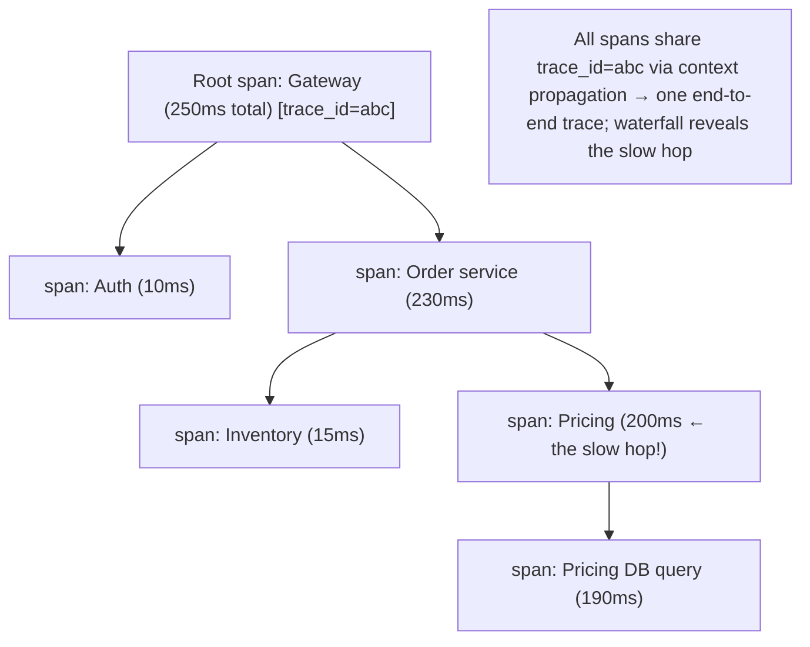

# Lesson 16.4 — Distributed Tracing: Context Propagation, Spans, Sampling (OpenTelemetry)

> Part 16: Observability · Difficulty: 🔴
>
> **Prerequisites:** [8.2.1 Lamport/Causality], [12.3 Communication (fan-out)], [12.7 Service Mesh], [16.1 Three Pillars], [16.3 Logging (correlation)].
> **Unlocks:** [16.5 Dashboards/Alerts], [16.6 Monitoring Platform], [Part 17 Performance (tail latency)].

---

## 1. Learning Objectives

After this lesson you will be able to:

- Explain **distributed tracing** — reconstructing a single request's **end-to-end path across services** — and why it's essential for microservices (Part 12).
- Define **traces and spans**, the **trace context** (trace ID, span ID, parent), and how **context propagation** links spans across services.
- Explain **sampling** (head vs tail) and why you can't trace 100% of requests at scale (cost — 16.1/16.2).
- Describe **OpenTelemetry** as the vendor-neutral standard for instrumenting + propagating + exporting telemetry (traces/metrics/logs).
- Use traces to **localize** latency/errors (16.1 workflow), analyze **tail latency + fan-out** (Part 17), and correlate with logs (16.3).

---

## 2. Motivation — Where did the time go, across dozens of services?

In a monolith, a slow or failing request has a **stack trace** — you see exactly which function was slow, in one process. In microservices (Part 12), a single user request **fans out across dozens of services** (12.3) — a call to the API gateway triggers calls to auth, orders, inventory, pricing, and each of those calls others. When that request is **slow** or **fails**, the metric dashboard (16.2) tells you *that* latency rose, and the logs (16.3) show fragments in each service — but **which hop, in which service, caused the slowness?** Without a way to see the request's **whole journey**, you're reduced to guessing and manually cross-referencing timestamps across services — the classic microservices debugging nightmare.

**Distributed tracing** solves this: it reconstructs the **complete path of a single request across all services**, showing **where the time went** at each hop (a waterfall of timed **spans**). This is the **localize** step of the observability workflow (16.1 §3.4) — and the **only** pillar that shows cross-service causality and timing (essential for **tail-latency analysis** — Part 17, and diagnosing fan-out — 12.3). The mechanism is **context propagation**: a **trace ID** injected at the entry point and **passed along** every service call (via headers) so all the work becomes **linked spans in one trace**. Because tracing every request is **expensive at scale** (16.1/16.2), you **sample** (head or tail). And to avoid every service reinventing instrumentation, **OpenTelemetry** provides a **vendor-neutral standard** for emitting and propagating telemetry. This lesson develops traces/spans, context propagation, sampling, OpenTelemetry, and how tracing correlates with logs and metrics.

---

## 3. Theory — From first principles

### 3.1 Traces and spans

`[CS]` A **distributed trace** represents **one request's end-to-end execution across services**, decomposed into **spans** `[CS]`:
- **Span:** a **single unit of work** — a service handling a request, an outgoing call, a DB query — with a **start time, duration, name, status, and metadata (attributes)**. Spans have a **parent** (the operation that caused them), forming a **tree/DAG**.
- **Trace:** the **collection of all spans** for one request, sharing a **trace ID**, arranged by parent-child + timing into a **waterfall** showing the request's structure + where time was spent.
- **The root span** is the entry point (e.g., the gateway receiving the request); child spans are the downstream calls it triggers (fan-out — 12.3).
- `[BP]` A trace answers: **what path did this request take, and how long did each step take?** — revealing the **critical path** and the **slow hop** (Part 17). It captures **causality + timing** across services (related to happens-before — 8.2.x).

### 3.2 Trace context and propagation

`[CS]` The magic that links spans across services is **context propagation** `[CS]`:
- **Trace context** = the **trace ID** (identifies the whole request) + the current **span ID** (the parent for the next span) + flags (e.g., sampled?). 
- **Propagation:** when a service makes a downstream call, it **injects** the trace context into the request (e.g., HTTP headers — the **W3C Trace Context** standard: `traceparent` header). The downstream service **extracts** it, creates a **child span** under the propagated parent, and propagates further → all spans across all services share the **trace ID** and form one trace.
- `[BP]` **This is the crux:** without propagation, each service's spans are **disconnected**; with it, they **assemble into one end-to-end trace**. Propagation must work across **every hop** — HTTP, gRPC (3.2.6), and **async/messaging** (Part 9 — propagate context through message headers so async work is traced too).
- **Automatic propagation:** a **service mesh** (12.7) propagates trace headers, and **auto-instrumentation** (libraries/agents) inject/extract context without manual code — making tracing practical across a fleet.

### 3.3 Sampling — you can't trace everything

`[CS]` Tracing **every** request is **too expensive at scale** (storage/ingest — 16.1/16.2; overhead) → **sampling** decides which traces to keep `[CS]`:
- **Head-based sampling:** decide **at the start** of the request (at the root) whether to sample it (e.g., keep 1%), and propagate that decision so the **whole trace** is consistently kept or dropped. **Simple + low overhead**, but you **decide before you know if the request is interesting** → you might **drop the rare error/slow trace** you most wanted.
- **Tail-based sampling:** **buffer** spans and decide **after** the request completes, based on the **outcome** (keep all **errors** + **slow** traces + a sample of normal) → keeps the **interesting** traces. **But** requires buffering all spans (more infrastructure/cost/complexity — often at a collector).
- `[BP]` **The tradeoff:** head-based is cheap but blind to outcome; tail-based captures the interesting traces but costs more. Common approach: **head-sample a baseline** + **tail-sample errors/slow requests** (keep 100% of errors, sample the happy path — like logging — 16.3). **Always keep errors + high-latency traces.**

### 3.4 OpenTelemetry — the standard

`[CS]`/`[CONV]` **OpenTelemetry (OTel)** is the **vendor-neutral, open standard** for generating, propagating, and exporting telemetry (traces, metrics, logs) `[CONV]`:
- Provides: **APIs + SDKs** (instrument your code in any language), **auto-instrumentation** (for common frameworks/libraries — no manual code), **context propagation** (W3C Trace Context — §3.2), and the **OTel Collector** (receive → process/sample/enrich → export to any backend).
- `[BP]` **Why it matters:** before OTel, tracing was **fragmented** (vendor-specific instrumentation → lock-in, inconsistent). OTel **standardizes instrumentation once** → export to **any** backend (Jaeger, Tempo, commercial — representative), unifying all three pillars (16.1) with **shared context** (correlate traces↔logs↔metrics — §3.5). It's the modern default for instrumentation.
- The **Collector** is key: a pipeline component that **receives** telemetry, **processes** (batch, sample — §3.3, enrich, redact — 16.3), and **exports** — decoupling apps from backends (like the log pipeline — 16.3).

### 3.5 Correlation: traces + logs + metrics

`[BP]` Tracing is most powerful **correlated** with the other pillars (16.1 §3.5) `[BP]`:
- **Traces ↔ logs (16.3):** propagate the **trace ID + span ID into log lines** (structured — 16.3) → from a slow span, jump to **its logs** (the exact error/context); from a log, jump to the **whole trace**. This is why the trace ID is the **correlation ID** (16.3 §3.4).
- **Traces ↔ metrics (16.2):** **exemplars** attach a trace ID to a metric data point → from a latency-percentile spike (a metric), jump to an **example slow trace**. Also, **span metrics** (RED — 14.3 — derived from spans: rate/errors/duration per service).
- `[BP]` **The unified flow (16.1):** metric alert (detect) → exemplar/trace search (localize the slow hop) → span logs (diagnose). OpenTelemetry's shared context (§3.4) is what makes this seamless. **Correlation turns three pillars into one observability system** (16.6).

### 3.6 What tracing reveals — latency, errors, dependencies

`[BP]` Traces enable analyses no other pillar can `[BP]`:
- **Where the time went / the critical path** (Part 17): the span waterfall shows **which hop is slow** — the bottleneck in a fan-out (12.3). Essential for **tail-latency** debugging (Part 17 — why is p99 bad? often one slow dependency or fan-out amplification).
- **Error localization:** which span **failed**, and its error → the failing service/call (16.1 diagnose).
- **Service dependency mapping:** aggregating traces reveals the **actual** call graph / dependencies between services (often surprising vs the assumed architecture) — useful for understanding + capacity (14.6).
- **Fan-out + amplification** (12.3): traces expose chatty synchronous chains and fan-out that amplify latency (Part 17) — informing where to reduce coupling (12.3/12.4).
- `[BP]` Tracing is the **microservices debugging + performance tool** — it makes the invisible cross-service behavior **visible** (12.1's "distributed debugging is hard" — this is the answer).

### 3.7 Putting it together

`[BP]` A tracing practice:
- **Instrument with OpenTelemetry** (§3.4): auto-instrumentation + SDKs; standardize once, export anywhere.
- **Propagate context everywhere** (§3.2): W3C Trace Context across HTTP/gRPC **and async/messaging** (Part 9); leverage the **mesh** (12.7) + auto-instrumentation.
- **Sample smartly** (§3.3): head-sample a baseline + **tail-sample errors + slow traces** (keep the interesting ones); via the OTel Collector.
- **Correlate** (§3.5): trace ID in logs (16.3) + metric exemplars (16.2) → seamless detect→localize→diagnose (16.1).
- **Use traces to** localize slow hops / errors / map dependencies / analyze tail latency + fan-out (§3.6, Part 17/12.3).
- `[BP]` Result: the request's **cross-service journey becomes visible** — you can find the slow hop in a fan-out, the failing span, and jump straight to its logs — solving the microservices debugging problem (12.1) and enabling tail-latency work (Part 17).

---

## 4. Visual Intuition

### A trace = spans across services (waterfall)



### Context propagation + correlation

```mermaid
flowchart LR
    ENTRY["Entry: generate trace_id + root span"] -->|inject traceparent header| SVC2["Service B: extract → child span → propagate"]
    SVC2 -->|propagate (HTTP/gRPC/async — Part 9)| SVC3["Service C: child span"]
    ALL["All spans → one trace (backend)"] 
    LOGS["Logs carry trace_id (16.3)"] -.correlate.-> ALL
    METRICS["Metric exemplars carry trace_id (16.2)"] -.correlate.-> ALL
    note["W3C Trace Context; OpenTelemetry standardizes it; sample (head + tail) to control cost"]
```

---

## 5. Real-World Analogy

Think of tracking a **package through a global shipping network** — versus only knowing "it's late."

- **The problem (no tracing):** you ship a package that passes through **a dozen facilities** — origin depot, airport, customs, transit hub, local depot, courier. It arrives **late**. The overall dashboard says "average delivery time is up" (metrics), and each facility has its **own logbook** (per-service logs), but **which facility held it up?** Without an end-to-end view, you're calling twelve facilities and cross-referencing timestamps by hand.
- **Tracing = a tracking number stamped at every handoff:** the package gets a **tracking number** (trace ID) at origin, and **every facility scans it on arrival and departure** (spans, with timestamps) and **passes the number along** (context propagation). Now you pull up the **complete timeline**: origin (10 min), flight (6 hrs), **customs (2 days ← the holdup!)**, transit (1 hr), delivery (30 min). The **waterfall instantly reveals** that customs was the bottleneck — no guessing.
- **Spans = each scan-in/scan-out:** each facility's handling is a **span** with a duration; nested spans show sub-steps (customs → inspection → paperwork). The **whole set of scans, linked by the tracking number**, is the trace.
- **Context propagation = passing the number along:** the magic is that **every facility uses the same tracking number and passes it to the next** — including when the package is **handed to a partner airline** (async/cross-system — propagate through message headers). If any facility **forgot to scan or used its own number**, that leg would be **invisible** (a broken trace).
- **Sampling = you can't deeply track every parcel:** with **billions of parcels**, you can't keep a detailed timeline for **all** of them (cost). So you **sample** — keep detailed timelines for a small % (head sampling), **but always keep the full timeline for any parcel that was late or lost** (tail sampling — keep the interesting ones). Tracking every normal parcel in full would be ruinously expensive.
- **OpenTelemetry = a universal scanning standard:** instead of each carrier using **incompatible scanners and formats**, everyone adopts a **single global scanning standard** so a package can be tracked seamlessly **across carriers** and the data flows to **any tracking system** — no lock-in.
- **Correlation:** the tracking number is **also written in each facility's logbook** (logs) and on the **performance dashboards** (metric exemplars), so from "customs was slow" you can **jump straight to customs' detailed logbook entry** for that package to see *why*.

---

## 6. Industry Example

- **Dapper (Google) → OpenTracing/OpenCensus → OpenTelemetry** `[CONV]`: the lineage of distributed tracing; OTel is the converged vendor-neutral standard (§3.4). *(Representative.)*
- **W3C Trace Context** `[CONV]`: the standard `traceparent` header for interoperable context propagation (§3.2). *(Representative.)*
- **Jaeger / Tempo / Zipkin (trace backends)** `[CONV]`: store + visualize traces (waterfalls, dependency maps) (§3.1/3.6). *(Representative.)*
- **Head vs tail sampling (OTel Collector)** `[CONV]`: baseline head sampling + tail sampling to keep errors/slow traces (§3.3). *(Representative.)*
- **Service-mesh trace propagation** `[CONV]`: meshes (12.7) propagate context + emit span metrics without app changes (§3.2/3.5). *(Representative.)*

---

## 7. Implementation Details

- **Instrument with OpenTelemetry** (§3.4): auto-instrumentation for frameworks + SDKs for custom spans; standardize once, export to any backend via the **OTel Collector**.
- **Propagate context on every hop** (§3.2): W3C Trace Context across HTTP/gRPC (3.2.6) **and async/messaging** (Part 9 — via message headers); leverage the **service mesh** (12.7) + auto-instrumentation so no leg is missed.
- **Sample smartly** (§3.3): head-sample a baseline (e.g., 1–10%) + **tail-sample to keep all errors + slow traces**; do it at the Collector to control cost (16.1/16.2).
- **Correlate** (§3.5): inject **trace ID + span ID into structured logs** (16.3); attach **exemplars** to metrics (16.2) → seamless detect→localize→diagnose (16.1).
- **Use traces for** (§3.6): localizing slow hops/errors, **tail-latency analysis** (Part 17), **dependency mapping**, and spotting fan-out amplification (12.3).
- **Add meaningful span attributes** (endpoint, status, key IDs — mind PII/cardinality — 16.2/15.8) without dumping sensitive data.
- **Watch overhead** — instrumentation + propagation have some cost; sampling + efficient exporters keep it low.

---

## 8. Advantages

- **Cross-service visibility** — the only pillar showing a request's end-to-end path (§3.1, 12.3).
- **Localizes the slow hop / failing span** — the "where" of debugging (§3.6, 16.1).
- **Tail-latency + fan-out analysis** — critical path, amplification (§3.6, Part 17).
- **Dependency mapping** — the actual call graph (§3.6).
- **Correlated** — jump trace↔logs↔metrics via shared context (§3.5, 16.1).
- **Standardized (OTel)** — instrument once, export anywhere, no lock-in (§3.4).

---

## 9. Disadvantages / costs

- **Instrumentation effort** — every service must propagate context + emit spans (mitigated by auto-instrumentation + mesh — §3.2/12.7).
- **Cost at full volume** — must **sample** (§3.3); tail sampling adds buffering infrastructure.
- **Broken traces** — a hop that doesn't propagate context breaks the trace (§3.2).
- **Overhead** — instrumentation/propagation cost (small but real).
- **Cardinality/PII in span attributes** — must be careful (§3.6/16.2/15.8).
- **Complexity** — tracing backend + Collector + sampling to operate (§3.4).

---

## 10. When NOT to / cautions

- **Don't trace 100% at scale** — sample (head + tail) (§3.3).
- **Don't drop errors/slow traces** in sampling — always keep the interesting ones (§3.3).
- **Don't skip context propagation on any hop** (incl. async) — broken traces (§3.2).
- **Don't put high-cardinality/PII in span attributes** carelessly (§3.6, 16.2/15.8).
- **Don't hand-roll per-vendor instrumentation** — use OpenTelemetry (§3.4).
- **Don't rely on traces alone** — correlate with logs (diagnose) + metrics (detect) (§3.5, 16.1).

---

## 11. Common Mistakes

1. **No distributed tracing** → can't localize cross-service latency/errors (§2, 12.3).
2. **Broken propagation** (a hop drops context, esp. async) → incomplete traces (§3.2).
3. **100% tracing at scale** → cost blowup (§3.3).
4. **Sampling that drops errors/slow traces** → miss the interesting ones (§3.3).
5. **No trace-ID correlation with logs** → can't jump trace↔log (§3.5, 16.3).
6. **PII/high-cardinality in span attributes** (§3.6, 15.8/16.2).
7. **Vendor-specific instrumentation** → lock-in; use OTel (§3.4).
8. **Traces without logs/metrics** — no full detect→localize→diagnose (§3.5, 16.1).

---

## 12. Interview Questions

**🟢 Easy**
- What is distributed tracing, and why is it needed for microservices?
- What are a trace and a span?

**🟡 Medium**
- How does context propagation link spans across services (trace ID, headers, W3C Trace Context)?
- Why must you sample traces, and what's the difference between head and tail sampling?

**🔴 Hard**
- How do traces correlate with logs and metrics (trace IDs, exemplars), and why does correlation matter (16.1)?
- How do you use traces for tail-latency and fan-out analysis (Part 17, 12.3)?

**⚫ Staff+**
- Design distributed tracing for a microservices platform: OpenTelemetry instrumentation + propagation (incl. async — Part 9 + mesh — 12.7), sampling strategy (head + tail via Collector), correlation with logs/metrics, and how you'd debug a p99 latency regression affecting one endpoint.
- Traces are broken (incomplete) and 100% sampling is bankrupting the team, yet they still can't find slow hops. Diagnose (missing propagation on async hops; naive head sampling dropping slow traces) and design the fix.

---

## 13. Production Pitfalls

- **Broken async traces:** context wasn't propagated through message queues → the async portion of requests was invisible (§3.2, Part 9).
- **Dropped slow traces:** head sampling at 1% dropped the rare slow/error traces needed to debug a p99 regression (§3.3).
- **Cost blowup:** 100% tracing at high volume overwhelmed storage/cost (§3.3).
- **Uncorrelated pillars:** trace IDs weren't in logs → couldn't jump from a slow span to its logs during an incident (§3.5, 16.3).
- **PII in spans:** sensitive data in span attributes leaked into the tracing backend (§3.6, 15.8).
- **Undebuggable fan-out:** without tracing, a fan-out latency amplification (12.3) was invisible on metrics alone (§3.6, Part 17).

---

## 14. Optimization Techniques

- **OpenTelemetry auto-instrumentation + mesh propagation** (12.7) → tracing across a fleet with minimal effort (§3.2/3.4).
- **Head + tail sampling (keep errors + slow)** via the Collector to control cost while keeping interesting traces (§3.3).
- **Trace ID in logs + metric exemplars** for seamless correlation (§3.5, 16.2/16.3).
- **Span metrics (RED)** derived from traces for per-service golden signals (§3.5, 14.3).
- **Propagate context on every hop incl. async** (Part 9) to avoid broken traces (§3.2).
- **Use traces for critical-path/tail-latency + dependency mapping** (§3.6, Part 17).
- **Careful span attributes** (bounded, no PII) (§3.6, 16.2/15.8).

---

## 15. Summary

In a monolith, a slow request has a **stack trace**; in microservices (Part 12), a request **fans out across dozens of services** (12.3), so when it's slow or fails, metrics (16.2) tell you *that* latency rose and per-service logs (16.3) show fragments — but **which hop caused it?** **Distributed tracing** answers this by reconstructing a **single request's end-to-end path across all services** — the **localize** step of the observability workflow (16.1) and the **only** pillar showing cross-service **causality + timing** (essential for **tail-latency** — Part 17 — and fan-out debugging — 12.3). A **trace** is one request's execution, decomposed into **spans** (units of work — a service call, a DB query — each with start/duration/status/attributes and a **parent**), arranged into a **waterfall** that reveals the **critical path** and the **slow hop**. The mechanism is **context propagation**: a **trace context** (trace ID + span ID + flags) is **injected at the entry point** and **passed along every downstream call** (via headers — the **W3C Trace Context** `traceparent` standard) so all spans across all services **share the trace ID and assemble into one trace** — and it must work on **every hop** including **async/messaging** (Part 9 — propagate through message headers) or that leg becomes an invisible **broken trace**; a **service mesh** (12.7) + **auto-instrumentation** propagate context without manual code. Because tracing **every** request is **too expensive at scale** (16.1/16.2), you **sample**: **head-based** (decide at the start, cheap, but blind to outcome → may drop the rare error/slow trace you wanted) or **tail-based** (buffer spans, decide after completion based on outcome → keep all **errors + slow** traces + a sample of normal, but needs buffering infrastructure) — the common approach is **head-sample a baseline + tail-sample to always keep errors + slow traces**. **OpenTelemetry (OTel)** is the **vendor-neutral standard** for generating/propagating/exporting all telemetry (traces/metrics/logs) — APIs+SDKs, auto-instrumentation, W3C context propagation, and the **OTel Collector** (receive → process/sample/enrich → export to any backend) — so you **instrument once and export anywhere** (no lock-in), unifying the three pillars with **shared context**. That shared context enables **correlation** (16.1): the **trace ID in structured logs** (16.3 — jump from a slow span to its logs) and **exemplars** on metrics (16.2 — jump from a latency spike to an example trace) create the seamless **detect (metric) → localize (trace) → diagnose (log)** flow — correlation is what turns three pillars into one **observability system** (16.6). Traces enable analyses no other pillar can: **where the time went / the critical path** (the slow hop in a fan-out — Part 17), **error localization** (which span failed), **service dependency mapping** (the actual call graph — often surprising), and **fan-out/amplification** analysis (12.3) — making the invisible cross-service behavior **visible** and solving the microservices debugging problem (12.1). Operate it with OTel instrumentation + full-hop (incl. async) propagation, smart head+tail sampling, log/metric correlation, and careful (bounded, no-PII — 16.2/15.8) span attributes.

---

## 16. Revision Notes (flashcard-ready)

- **Q:** Distributed tracing? **A:** Reconstructs a single request's end-to-end path across services — the only pillar showing cross-service causality + timing.
- **Q:** Trace vs span? **A:** Trace = the whole request (all spans, one trace ID); span = one unit of work (start/duration/status/parent).
- **Q:** Context propagation? **A:** Trace context (trace ID + span ID + flags) injected at entry + passed on every hop (W3C Trace Context header) → spans link into one trace.
- **Q:** Propagation gotcha? **A:** Must work on EVERY hop incl. async/messaging (Part 9), or that leg is an invisible broken trace.
- **Q:** Why sample? **A:** 100% tracing is too expensive at scale (16.1/16.2).
- **Q:** Head vs tail sampling? **A:** Head = decide at start (cheap, blind to outcome); tail = decide after completion (keep errors/slow, needs buffering).
- **Q:** Sampling best practice? **A:** Head-sample a baseline + tail-sample to always keep errors + slow traces.
- **Q:** OpenTelemetry? **A:** Vendor-neutral standard for traces/metrics/logs — instrument once (SDKs + auto-instrumentation + W3C propagation + Collector), export anywhere.
- **Q:** Correlation? **A:** Trace ID in logs (16.3) + metric exemplars (16.2) → metric→trace→log seamless flow (16.1).
- **Q:** What do traces reveal? **A:** Where time went (slow hop/critical path — Part 17), failing span, service dependency map, fan-out amplification (12.3).

---

## 17. Further Reading + Knowledge-Graph Links

**Foundations (in-platform):**
- **[16.1 Three Pillars]** — traces' role (localize); correlation.
- **[16.3 Structured Logging]** — trace ID as correlation ID.
- **[12.3 Communication]** — fan-out that requires tracing.
- **[12.7 Service Mesh]** — automatic context propagation + span metrics.
- **[8.2.1 Lamport/Causality]** — causal ordering context.

**Unlocks / next:**
- **[16.5 Dashboards/Alerts]** — span metrics + trace-based views.
- **[16.6 Monitoring Platform]** — the full system.
- **[Part 17 Performance]** — tail latency, critical path, fan-out amplification.

**External (canonical):**
- Google Dapper paper (distributed tracing origin). *(Representative.)*
- OpenTelemetry + W3C Trace Context specs. *(Representative.)*
- Jaeger/Tempo/Zipkin documentation. *(Representative.)*

> **Knowledge-graph:** `16.1 traces pillar` + `12.3 fan-out` + `12.7 mesh` → **`16.4 distributed tracing (spans, context propagation, sampling, OpenTelemetry)`** → correlate with `16.3 logs` + `16.2 metrics` → `16.5 dashboards/alerts` / `Part 17 tail latency`.
