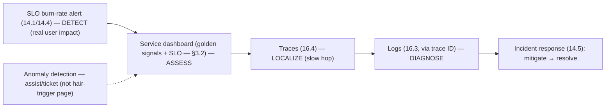
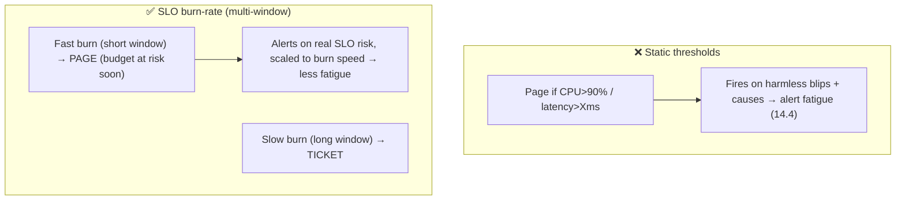

# Lesson 16.5 — Dashboards, SLO Burn-Rate Alerts, Anomaly Detection

> Part 16: Observability · Difficulty: 🟡🔴
>
> **Prerequisites:** [14.1 SLO/Error Budget], [14.3 Golden Signals], [14.4 Alerting/Burn-Rate], [16.2 Metrics], [16.4 Tracing].
> **Unlocks:** [16.6 Monitoring Platform], [Part 17 Performance], [Part 20 Capstone].

---

## 1. Learning Objectives

After this lesson you will be able to:

- Design **dashboards** that answer specific questions (golden signals — 14.3, SLOs — 14.1) rather than cluttered walls of graphs.
- Implement **SLO burn-rate alerting** (14.1/14.4) — the SRE-grade alerting that pages on real error-budget risk, not static thresholds.
- Explain **anomaly detection** — statistical/ML detection of "unusual" behavior — its promise and its pitfalls (false positives, alert fatigue — 14.4).
- Combine dashboards + alerts + traces (16.4) into the **detect → localize → diagnose** workflow (16.1).
- Avoid dashboard/alert anti-patterns: vanity dashboards, static-threshold spam, and over-relying on anomaly detection.

---

## 2. Motivation — Turning telemetry into action

The pillars (16.1–16.4) produce vast telemetry — but telemetry only has value when it **drives action**: a human **noticing** a problem (dashboards), a system **paging** someone when it matters (alerts), and detecting the **unusual** (anomaly detection). This lesson is about the **consumption layer** — how metrics/logs/traces become **decisions and interruptions**. Done well, it's the difference between "we have all the data" and "we caught the problem fast and fixed it" (low MTTR — 11.1). Done badly, it produces **cluttered vanity dashboards** no one reads and **noisy alerts** that cause alert fatigue (14.4) — burying the signal.

Two principles anchor this. First, **dashboards should answer questions**, not just display everything — a good dashboard shows the **golden signals** (14.3) and **SLO status** (14.1) for a service at a glance, structured to support the debugging workflow (detect → drill in). Second, **alerts should page on symptoms and error-budget burn rate** (14.1/14.4), not on every static threshold — the SRE technique that ties alerting directly to user impact and avoids fatigue. **Anomaly detection** (statistical/ML) promises to catch problems you didn't define thresholds for — appealing, but it's **prone to false positives** and must be used carefully (it complements, rarely replaces, SLO-based alerting). This lesson develops dashboard design, SLO burn-rate alerting, and anomaly detection — the layer that turns observability data into fast, actionable response, integrating everything from Part 14.

---

## 3. Theory — From first principles

### 3.1 Dashboards — answer questions, don't just display

`[BP]` A **dashboard** visualizes telemetry (mostly metrics — 16.2) to help humans **understand system state + trends** `[BP]`:
- **The anti-pattern: vanity dashboards** — walls of dozens of graphs that look impressive but **answer no specific question**; no one knows which matters, so no one reads them.
- `[BP]` **Good dashboards answer a question / support a task:**
  - **Service health at a glance:** the **four golden signals** (14.3 — latency percentiles, traffic, errors, saturation) + **SLO status** (14.1) — "is this service healthy?"
  - **SLO/error-budget dashboard:** current SLI vs SLO, **error budget remaining + burn rate** (14.1) — "are we at risk?"
  - **Debugging dashboards:** structured to support **drill-down** (detect → localize — 16.1), often linking to **traces** (16.4) + logs (16.3).
  - **Capacity dashboards:** saturation/utilization trends (14.6/7.7).
- **Design principles** `[BP]`: **few, purposeful** panels; **most-important on top**; consistent layout; use **percentiles not averages** (14.3/16.2); annotate with deploys/incidents; **link to drill-down** (traces/logs). A dashboard is a **tool for a task**, not decoration.

### 3.2 The RED / USE / golden-signals dashboard

`[BP]` A practical default dashboard structure (14.3) `[BP]`:
- **Per service (RED — 14.3):** **R**ate (traffic), **E**rrors (rate/ratio), **D**uration (latency percentiles p50/p99/p99.9) — the request-centric view (from span metrics — 16.4, or instrumented metrics — 16.2).
- **Per resource (USE — 14.3):** **U**tilization, **S**aturation, **E**rrors — CPU/memory/disk/connections — the resource-centric view (for capacity/bottleneck — 7.6/14.6).
- **+ SLO panel** (14.1): SLI vs target, error budget, burn rate.
- `[BP]` This gives **detect (is it healthy? RED + SLO) → localize (which resource? USE, then traces — 16.4)** in a standard, reusable layout — the first dashboard to build for any service.

### 3.3 SLO burn-rate alerting (the core alerting technique)

`[CS]` **Alert on symptoms + error-budget burn rate** (14.1/14.4), not on static cause-based thresholds `[CS]`:
- **Burn rate** = how fast you're consuming the error budget (14.1). A **1× burn** exhausts the budget exactly at the window's end; **10×** burns it 10× faster.
- **Multi-window, multi-burn-rate** (14.4): **page** on a **fast burn** over a **short window** (urgent — you'll exhaust the budget soon), **ticket** on a **slow burn** over a **long window** (needs attention, not urgent). Two windows (short for speed + long to confirm sustained) **reduce false pages**.
- `[BP]` **Why it beats static thresholds:** it alerts on **actual SLO risk** (real user impact — 14.1), **scales urgency to burn speed**, and **avoids paging on brief blips** that don't threaten the budget → far less alert fatigue (14.4). It **ties alerting directly to the reliability target**. This is the SRE-grade approach — implemented as queries over your metrics (16.2).
- **Symptom-based** (14.3/14.4): page on user-visible SLO burn, not on causes (CPU high) that may not matter → cause-based signals go on **diagnosis dashboards** (§3.1), not pages.

### 3.4 Anomaly detection — promise and pitfalls

`[CS]` **Anomaly detection** = automatically flagging **unusual behavior** (deviation from normal/expected patterns) using **statistics or ML** `[CS]`:
- **The promise:** catch problems you **didn't define a threshold for** — novel issues, subtle shifts, seasonal deviations — appealing for the unknown-unknowns (14.3) and for metrics where a fixed threshold is hard (traffic varies by time of day).
- **Approaches:** statistical (baselines, standard deviations, seasonality-aware — e.g., "traffic is 3σ below the usual for this hour"), forecasting (predict expected + flag deviation), ML-based.
- `[BP]` **The pitfalls (significant):**
  - **False positives → alert fatigue** (14.4): "unusual" ≠ "bad"; anomaly detectors are **prone to noise** (a legitimate spike, a holiday, a deploy) → false alerts that erode trust (14.4). This is the #1 problem.
  - **Hard to tune + explain:** what's "normal"? seasonality, trends, and legitimate changes make it hard; ML models are opaque ("why did it alert?").
  - **Not a substitute for SLO alerting:** `[OPINION]` anomaly detection **complements** but rarely **replaces** symptom/burn-rate alerting (§3.3) — SLO alerts are precise, explainable, and tied to impact; anomaly detection is fuzzy.
- `[BP]` **Use judiciously:** best for **detecting** the truly-unforeseen (as a **ticket/investigation** signal, not a hair-trigger page), for metrics without good fixed thresholds, and for **assisting** diagnosis — **not** as your primary paging mechanism (that's SLO burn-rate — §3.3). Beware over-selling ML anomaly detection.

### 3.5 The consumption workflow — dashboards + alerts + traces

`[BP]` These tie into the **detect → localize → diagnose** flow (16.1) `[BP]`:
- **Alert (detect):** an **SLO burn-rate alert** (§3.3) pages when the error budget is at risk (real user impact — 14.1) — the trigger.
- **Dashboard (assess):** the on-call opens the **service health dashboard** (§3.2, golden signals + SLO) to assess scope + which signal degraded.
- **Traces (localize):** drill into **traces** (16.4) to find the slow/failing hop (which service — 12.3).
- **Logs (diagnose):** jump (via trace ID — 16.3) to the **logs** of that span for the exact cause.
- **→ Incident response** (14.5): mitigate first, then resolve.
- `[BP]` Dashboards + alerts are the **entry points** to observability; correlation (16.1) makes the drill-down seamless. **The consumption layer is where telemetry becomes action** — designed around the workflow, not around "showing all the data."

### 3.6 Avoiding the anti-patterns

`[BP]` The pitfalls to avoid (recurring from 14.4) `[BP]`:
- **Vanity dashboards:** dozens of graphs answering no question → build **purposeful, task-oriented** dashboards (§3.1).
- **Static-threshold alert spam:** paging on fixed CPU/latency thresholds that fire on harmless blips → **SLO burn-rate + symptom-based** alerting (§3.3, 14.4).
- **Cause-based paging:** paging on causes (disk 80%) that don't affect users → **dashboard causes, page symptoms** (14.3/14.4).
- **Anomaly-detection over-reliance:** hair-trigger ML alerts → false positives + fatigue (§3.4).
- **No drill-down/correlation:** dashboards that don't link to traces/logs → slow diagnosis (§3.5, 16.1).
- `[BP]` **The goal (14.4):** **catch every real problem fast (low MTTR — 11.1) while keeping humans healthy** — precise, symptom/burn-rate alerts + purposeful dashboards + correlated drill-down. Fewer, better alerts + fewer, purposeful dashboards.

---

## 4. Visual Intuition

### The consumption workflow

### SLO burn-rate vs static threshold alerting

---

## 5. Real-World Analogy

Think of a **hospital's monitoring room + alarm system** — turning a flood of patient data into the right response at the right time.

- **Dashboards = purposeful monitoring screens, not a wall of noise:** a **bad** monitoring room has **fifty screens showing every possible readout** — nurses can't tell what matters, so they tune it all out (vanity dashboards). A **good** room has a **clear "patient health at a glance" screen** — the vital signs that matter (the golden signals: heart rate, oxygen, BP, temperature) plus **"are we within safe ranges?"** (SLO status) — organized so a glance answers "is this patient OK?", with the ability to **drill into detail** if something's off.
- **SLO burn-rate alerts = alarming on how fast the patient is deteriorating, not on every twitch:** a **crude** alarm blares at **every minor fluctuation** (static thresholds — "heart rate ticked to 91!") → **alarm fatigue** (14.4), and the real emergency gets ignored. A **smart** alarm watches the **rate of deterioration relative to the danger budget**: a **rapid crash** triggers an **immediate code call** (fast burn → page), a **slow decline over hours** flags for **scheduled attention** (slow burn → ticket) — alarming on **real risk to the patient**, scaled to urgency.
- **Anomaly detection = an experienced nurse noticing "something's off" — but prone to false alarms:** a seasoned nurse can spot **subtle, unusual patterns** no fixed threshold would catch ("this patient just seems different than usual for this time of night"). Valuable for catching the **unforeseen** — but also prone to **crying wolf** ("they always look pale after lunch"). So you **use that intuition to investigate** (a ticket), **not** to scramble the whole code team every time (not a hair-trigger page) — it **complements** the precise vital-sign alarms, it doesn't replace them.
- **The workflow:** the **deterioration alarm** fires (detect); the nurse checks the **at-a-glance screen** to see which vital is off (assess); orders **specific tests** to find which organ system is failing (localize — traces); reads the **detailed chart** for the exact cause (diagnose — logs); then **treats** (mitigate — 14.5). The monitoring room exists to **turn data into the right action fast**, not to display everything.

---

## 6. Industry Example

- **Golden-signals / RED / USE dashboards** `[CONV]`: standard per-service + per-resource dashboards (Grafana-style) (§3.2, 14.3). *(Representative.)*
- **SLO burn-rate (multi-window multi-burn-rate) alerting** `[CONV]`: the SRE Workbook technique implemented over metrics (§3.3, 14.1/14.4). *(Representative.)*
- **Anomaly detection** `[CONV]`: statistical/ML anomaly detection offered by monitoring platforms — used cautiously due to false positives (§3.4). *(Representative.)*
- **Dashboard-to-trace drill-down** `[CONV]`: linking dashboard panels to exemplar traces (16.4) + logs (16.3) for the detect→localize→diagnose flow (§3.5). *(Representative.)*
- **Vanity-dashboard / alert-fatigue anti-patterns** `[OPINION]`: widely-recognized failures of cluttered dashboards + static-threshold spam (§3.1/3.6, 14.4). *(Representative.)*

---

## 7. Implementation Details

- **Build purposeful dashboards** (§3.1/3.2): per-service **golden signals + SLO** (14.3/14.1), per-resource **USE** (14.6/7.6), debugging dashboards with **drill-down to traces/logs** (16.4/16.3); percentiles not averages; annotate deploys/incidents.
- **Implement SLO burn-rate alerting** (§3.3, 14.1/14.4): multi-window, multi-burn-rate over your metrics (16.2) — page on fast burn, ticket on slow; **symptom-based** (14.3), not static-threshold/cause-based.
- **Use anomaly detection judiciously** (§3.4): for the unforeseen + hard-to-threshold metrics, as an **investigation/ticket** signal (not a hair-trigger page); tune for seasonality; treat false positives seriously; **complement**, don't replace, SLO alerts.
- **Wire the workflow** (§3.5, 16.1): alert → dashboard → traces → logs (correlated via trace IDs — 16.3/16.4) → incident response (14.5).
- **Avoid anti-patterns** (§3.6): no vanity dashboards, no static-threshold/cause-based paging, no anomaly-detection over-reliance; fewer + better (14.4).

---

## 8. Advantages

- **Turns telemetry into action** — detect fast, respond fast (low MTTR — 11.1) (§3.5).
- **Purposeful dashboards** — answer questions at a glance; support drill-down (§3.1/3.2).
- **SLO burn-rate alerts** — page on real user impact, scaled to urgency, less fatigue (§3.3, 14.4).
- **Anomaly detection** — catches some unforeseen issues thresholds miss (§3.4).
- **Integrated workflow** — dashboards + alerts + traces + logs, correlated (§3.5, 16.1).
- **Ties to SLOs/error budgets** — reliability-target-driven (§3.3, 14.1).

---

## 9. Disadvantages / costs

- **Dashboard sprawl** — vanity dashboards no one reads (§3.1).
- **Alert fatigue** — static-threshold/cause-based/anomaly spam (§3.3/3.4/3.6, 14.4).
- **Anomaly detection false positives** — the #1 pitfall; hard to tune/explain (§3.4).
- **Design effort** — good dashboards + burn-rate alerts take thought (§3.1/3.3).
- **Requires the pillars + correlation** — depends on 16.1–16.4 being in place (§3.5).
- **Over-reliance risk** — trusting anomaly ML over precise SLO alerting (§3.4).

---

## 10. When NOT to / cautions

- **Don't build vanity dashboards** — purposeful, task-oriented only (§3.1).
- **Don't page on static thresholds / causes** — use SLO burn-rate + symptoms (§3.3, 14.4).
- **Don't hair-trigger page on anomaly detection** — investigate/ticket; beware false positives (§3.4).
- **Don't rely on anomaly detection instead of SLO alerts** — it complements (§3.4).
- **Don't use averages** on latency dashboards — percentiles (§3.1, 14.3/16.2).
- **Don't build dashboards without drill-down** to traces/logs (§3.5, 16.1).

---

## 11. Common Mistakes

1. **Vanity dashboards** — impressive but answer nothing (§3.1).
2. **Static-threshold alert spam** → alert fatigue (§3.3, 14.4).
3. **Cause-based paging** (CPU/disk) not affecting users (§3.3, 14.3).
4. **Anomaly-detection over-reliance / hair-trigger** → false-positive fatigue (§3.4).
5. **Averages not percentiles** on latency panels (§3.1, 14.3).
6. **No drill-down/correlation** — dashboards don't link to traces/logs (§3.5).
7. **Too many alerts** — not fewer + better (§3.6, 14.4).
8. **SLOs not on the dashboard** — no error-budget visibility (§3.2, 14.1).

---

## 12. Interview Questions

**🟢 Easy**
- What makes a good dashboard vs a vanity dashboard?
- Why alert on SLO burn rate instead of static thresholds?

**🟡 Medium**
- Describe a good service dashboard (golden signals / RED / USE + SLO).
- What is anomaly detection, and what are its main pitfalls?

**🔴 Hard**
- How does multi-window multi-burn-rate SLO alerting work, and why does it reduce alert fatigue (14.1/14.4)?
- How do dashboards, alerts, traces, and logs combine into the detect→localize→diagnose workflow (16.1)?

**⚫ Staff+**
- Design the dashboards + alerting for a microservices platform: golden-signal/RED/USE dashboards, SLO burn-rate alerts (14.1), drill-down to traces (16.4)/logs (16.3), and where (if anywhere) anomaly detection fits — avoiding vanity dashboards + alert fatigue.
- A team has 200 noisy dashboards and hundreds of static-threshold alerts, and just bought an ML anomaly-detection tool. Diagnose the anti-patterns and design the fix (purposeful dashboards, SLO burn-rate alerting, judicious anomaly detection).

---

## 13. Production Pitfalls

- **Ignored vanity dashboards:** dozens of graphs no one read → the real signal was missed during an incident (§3.1).
- **Alert fatigue from static thresholds:** hundreds of blip-triggered alerts trained on-call to ignore alerts → a real page dismissed (§3.3, 14.4).
- **Anomaly false-positive storm:** an ML anomaly detector paged on every legitimate traffic spike/deploy → fatigue + distrust (§3.4).
- **Average-latency blind spot:** dashboards showed averages; p99 users suffered unseen (§3.1, 14.3).
- **No drill-down:** dashboards didn't link to traces/logs → slow diagnosis during an outage (§3.5, 16.1).
- **No SLO visibility:** the team couldn't see error-budget burn → didn't know they were about to breach (§3.2, 14.1).

---

## 14. Optimization Techniques

- **Purposeful, task-oriented dashboards** (golden signals + SLO + drill-down) — few + meaningful (§3.1/3.2).
- **SLO burn-rate (multi-window) alerting** — page on real risk, scaled to urgency (§3.3, 14.1/14.4).
- **Symptom-based paging + cause-based dashboards** (§3.3, 14.3/14.4).
- **Drill-down + correlation** (dashboard → exemplar trace → span logs) for fast diagnosis (§3.5, 16.1).
- **Anomaly detection as an investigation/ticket signal** (not primary paging), tuned for seasonality (§3.4).
- **Percentiles + histograms** on latency views (§3.1, 16.2).
- **Annotate deploys/incidents** on dashboards for context (§3.1).

---

## 15. Summary

Telemetry (16.1–16.4) only has value when it **drives action** — this **consumption layer** turns metrics/logs/traces into **decisions and interruptions**: **dashboards** (humans notice), **alerts** (systems page), and **anomaly detection** (spot the unusual). Two principles anchor it. **Dashboards should answer questions, not display everything** — the anti-pattern is **vanity dashboards** (walls of graphs no one reads); good dashboards are **task-oriented**: **per-service health** (the four **golden signals** — 14.3 — latency percentiles, traffic, errors, saturation — plus **SLO status** — 14.1), an **SLO/error-budget** view (SLI vs target, budget remaining + burn rate), **debugging dashboards** with **drill-down to traces** (16.4) + logs (16.3), and **capacity** views (14.6/7.6) — a common default being **RED per service** (Rate/Errors/Duration) + **USE per resource** (Utilization/Saturation/Errors) + an SLO panel, using **percentiles not averages** (14.3), annotated with deploys/incidents, and **linked to drill-down**. **Alerts should page on symptoms + error-budget burn rate** (14.1/14.4), not static thresholds: **multi-window, multi-burn-rate** alerting **pages on a fast burn** (short window — budget at risk soon), **tickets on a slow burn** (long window), using two windows to cut false pages — this beats static thresholds by alerting on **actual SLO risk** (real user impact), **scaling urgency to burn speed**, and **avoiding blip-triggered pages** → far less alert fatigue (14.4); it's **symptom-based** (page on user-visible SLO burn; put cause-based signals on diagnosis dashboards). **Anomaly detection** (statistical/ML flagging of unusual behavior) **promises** to catch problems you didn't threshold for (novel issues, seasonal deviations — the unknown-unknowns — 14.3), but its **pitfalls are significant** — chiefly **false positives → alert fatigue** ("unusual" ≠ "bad": legitimate spikes/holidays/deploys), plus being **hard to tune + explain** — so use it **judiciously** as an **investigation/ticket** signal (not a hair-trigger page), for hard-to-threshold metrics and to **assist** diagnosis, **complementing (not replacing)** precise, explainable **SLO burn-rate alerting**. These tie into the **detect → localize → diagnose** workflow (16.1): an **SLO burn-rate alert** detects (real impact), the **service dashboard** assesses which signal degraded, **traces** (16.4) localize the slow hop, **logs** (16.3, via trace ID) diagnose the cause → **incident response** (14.5). Avoid the recurring anti-patterns — **vanity dashboards, static-threshold/cause-based alert spam, anomaly-detection over-reliance, and dashboards without drill-down** — because the goal (14.4) is to **catch every real problem fast (low MTTR — 11.1) while keeping humans healthy**: **fewer, better, symptom/burn-rate alerts + fewer, purposeful dashboards + correlated drill-down.** The consumption layer is where observability becomes **fast, actionable response**.

---

## 16. Revision Notes (flashcard-ready)

- **Q:** Good vs vanity dashboard? **A:** Good = answers a question/supports a task (golden signals + SLO + drill-down); vanity = walls of graphs answering nothing.
- **Q:** Default service dashboard? **A:** RED per service (Rate/Errors/Duration) + USE per resource (Util/Saturation/Errors) + SLO panel; percentiles not averages.
- **Q:** Alert on? **A:** Symptoms + SLO burn rate (real user impact) — NOT static thresholds or causes.
- **Q:** Multi-window burn-rate alerting? **A:** Fast burn (short window) → page; slow burn (long window) → ticket; two windows reduce false pages.
- **Q:** Why burn-rate > static thresholds? **A:** Alerts on real SLO risk, scales urgency to burn speed, avoids blip pages → less alert fatigue.
- **Q:** Anomaly detection? **A:** Statistical/ML flagging of unusual behavior; catches unforeseen issues thresholds miss.
- **Q:** Anomaly detection's #1 pitfall? **A:** False positives ("unusual" ≠ "bad") → alert fatigue; hard to tune/explain.
- **Q:** How to use anomaly detection? **A:** Judiciously — investigation/ticket signal (not hair-trigger page); complements, doesn't replace, SLO alerts.
- **Q:** The consumption workflow? **A:** SLO alert (detect) → dashboard (assess) → traces (localize) → logs (diagnose) → incident response (14.5).
- **Q:** Anti-patterns to avoid? **A:** Vanity dashboards, static-threshold/cause-based alert spam, anomaly over-reliance, no drill-down.

---

## 17. Further Reading + Knowledge-Graph Links

**Foundations (in-platform):**
- **[14.1 SLO/Error Budget]** — burn-rate alerting basis.
- **[14.3 Golden Signals]** — what dashboards show.
- **[14.4 Alerting/On-Call]** — symptom/burn-rate alerting, alert fatigue.
- **[16.2 Metrics]** — the data behind dashboards/alerts.
- **[16.4 Tracing]** — drill-down/localize.

**Unlocks / next:**
- **[16.6 Monitoring Platform]** — designing the whole system.
- **[Part 17 Performance]** — percentiles, tail latency.
- **[Part 20 Capstone]** — observability for the platform.

**External (canonical):**
- Beyer et al., *The SRE Workbook* — "Alerting on SLOs" (burn-rate). *(Representative.)*
- Grafana / dashboard design guidance. *(Representative.)*

> **Knowledge-graph:** `16.2 metrics` + `14.1 SLO` + `14.4 alerting` → **`16.5 dashboards + SLO burn-rate alerts + anomaly detection`** (consumption layer) → detect→localize (`16.4 traces`)→diagnose (`16.3 logs`) → `14.5 incident response`.
