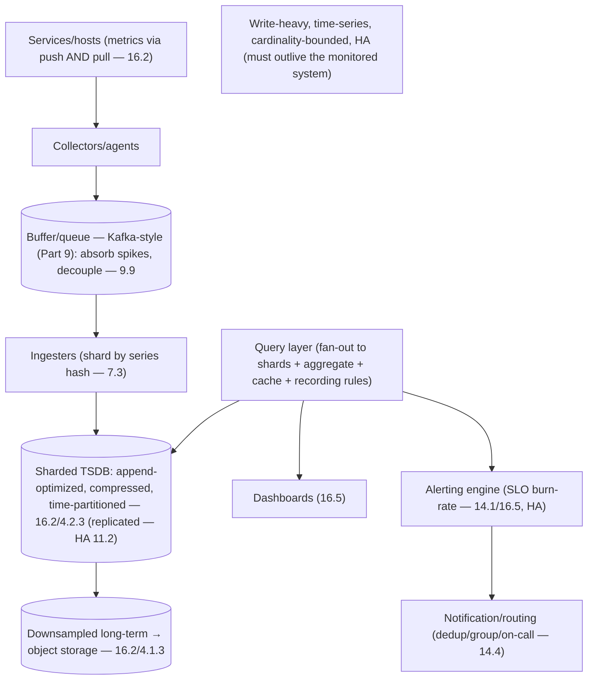
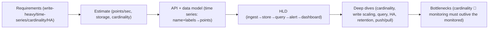

# Lesson 16.6 — Designing a Metrics/Monitoring Platform (Interview-Grade Deep Dive)

> Part 16: Observability · Difficulty: 🔴⚫
>
> **Prerequisites:** [1.3.2 Driving a Design Conversation], [9.x Messaging/Streaming], [16.1–16.5 all], [7.3 Sharding], [4.2.3 LSM/TSDB].
> **Unlocks:** [Part 17 Performance], [Part 19 Interview Designs], [Part 20 Capstone (observability)].

---

## 1. Learning Objectives

After this lesson you will be able to:

- Run an **end-to-end system design** of a **metrics/monitoring platform** — the interview-grade synthesis of Part 16 (and much of the whole course).
- Drive it with the **design framework** (1.3.1/1.3.2): requirements → estimation → API → data model → HLD → deep dives → bottlenecks.
- Design the **ingestion → storage (TSDB) → query → alerting → dashboards** pipeline at scale, applying sharding (7.3), streaming (Part 9), and cardinality control (16.2).
- Reason about the hard parts: **high write throughput**, **cardinality**, **query performance**, **retention/downsampling**, **high availability** (a monitoring system must be more reliable than what it monitors), and **push vs pull**.
- Recognize this as a **recurring interview problem** and a template that reuses the whole platform.

---

## 2. Motivation — Design the thing that watches everything

"Design a metrics/monitoring platform" (or "design a metrics system," "design Prometheus/Datadog") is a **classic system-design interview question** — and a fitting **capstone for Part 16** because it forces you to synthesize everything: the three pillars (16.1), TSDBs and cardinality (16.2), pipelines (16.3), and dashboards/alerting (16.5), on top of the whole course's fundamentals — **massive write throughput**, **time-series storage** (4.2.3), **sharding** (7.3), **streaming ingestion** (Part 9), **query performance**, **retention**, and **high availability** (11.2). It's also genuinely instructive: a monitoring platform is an **extreme, write-heavy, time-series** system with unusual constraints (it must be **more reliable than the systems it watches** — if monitoring dies during an incident, you're blind).

This lesson is a **worked design** using the framework (1.3.1/1.3.2): clarify requirements + scale, do capacity estimation (1.1.4), define the API + data model, sketch the HLD (ingestion → storage → query → alert → dashboard), then deep-dive the hard parts (cardinality, write scaling, query, HA, push vs pull, retention). It doubles as a **template for interview designs** (Part 19) — reusing sharding, replication, streaming, caching, and the observability specifics. This lesson shows how to compose the platform's ideas into a defended, end-to-end design.

---

## 3. Theory — The design, step by step (the framework — 1.3.1/1.3.2)

### 3.1 Step 1 — Requirements + scope

`[BP]` **Clarify functional + non-functional requirements first** (1.1.2/1.3.2) `[BP]`:
- **Functional:** ingest metrics from many services/hosts; store time series; support **queries + aggregation** (dashboards — 16.5); **alerting** (SLO burn-rate — 14.1/16.5); **retention** (recent high-res + long-term downsampled — 16.2). (Scope: focus on **metrics**; note logs/traces are related pipelines — 16.3/16.4.)
- **Non-functional (the hard constraints):**
  - **Massive write throughput** — millions of data points/sec (many series × frequent samples).
  - **Low-cardinality-optimized but cardinality-aware** (16.2 — the dominant constraint).
  - **Fast queries** for dashboards (recent data, aggregations) + alert evaluation.
  - **High availability** — **must be more reliable than what it monitors** (blind during incidents = catastrophic — 11.2).
  - **Scalable + cost-efficient** (retention/downsampling — 16.2).
  - **Bounded query latency** for dashboards/alerts.
- `[BP]` **The interview signal:** identify **write-heavy + time-series + cardinality + HA** as the defining constraints (1.3.2 — drive the conversation to what matters).

### 3.2 Step 2 — Capacity estimation

`[BP]` **Back-of-the-envelope** (1.1.4) to size it `[BP]`:
- **Write rate:** (# active time series) × (samples per series per interval / interval). E.g., 10M series × 1 sample / 15s ≈ **~670K points/sec** (illustrative). This is **write-dominated**.
- **Storage:** points/sec × bytes/point (with compression — 16.2, ~1–2 bytes/point) × retention → size the hot store; downsampled long-term is much smaller.
- **Cardinality:** estimate active series (the real driver — 16.2); plan limits.
- **Query load:** dashboards (bursty, aggregations over recent data) + continuous alert evaluations.
- `[BP]` **Conclusion:** an **extreme write-heavy, time-series** workload → dictates **append-optimized TSDB storage** (§3.4), **horizontal sharding** (§3.5), and **streaming ingestion** (§3.3). (Label numbers illustrative.)

### 3.3 Step 3 — Ingestion (push vs pull + the pipeline)

`[CS]` **Getting data in at scale** (16.2 §3.3, 16.3 pipeline) `[BP]`:
- **Push vs pull** (16.2): **pull** (scrape targets — liveness visible, system controls rate) works well for long-running services with service discovery (12.6); **push** (agents/OTLP — 16.4) for ephemeral/serverless/edge. A large platform often supports **both** (a collector/agent layer).
- **Ingestion pipeline** (16.3): **collectors/agents** → optionally a **buffer/queue** (Part 9 — Kafka-style) to **absorb spikes + decouple ingestion from storage** (backpressure — 9.9; a write spike or a slow store mustn't drop data) → **ingesters** that batch-write to storage.
- **Sharding ingestion** (7.3): shard by **series (metric+labels hash)** so each ingester/storage node owns a subset of series → horizontal write scaling. Consistent hashing (7.3) for rebalancing.
- `[BP]` **Key decisions:** support push+pull, buffer with a queue for spike absorption + decoupling, and **shard by series** for write scale.

### 3.4 Step 4 — Storage (the TSDB) + retention

`[CS]` **Time-series storage** (16.2/4.2.3) `[BP]`:
- **Append-optimized, time-partitioned, compressed** (16.2): LSM-lineage (4.2.3) or custom columnar; **delta/XOR compression** (16.2); partition by **time window + series shard** (7.3) → recent data hot, old cold.
- **Tiered retention + downsampling** (16.2): high-resolution recent (hot store) → **downsampled** older data (5min, 1h) → long-term cheap **object storage** (4.1.3). Bounds cost while keeping trends (14.6).
- **Cardinality control** (16.2 — the crux): enforce **series limits**, reject/drop high-cardinality labels, alert on cardinality growth — protect the store from explosions (16.2 §3.4).
- `[BP]` **The storage tier is the heart** — an append-optimized, sharded, compressed, tiered TSDB, cardinality-guarded. Scalable TSDB layers (Thanos/Cortex/Mimir-style — representative) add horizontal scale + long-term object storage on top of a Prometheus-style TSDB.

### 3.5 Step 5 — HLD + sharding/HA

`[BP]` **Assemble the components** (1.3.2 HLD) with scaling + HA `[BP]`:
- **Components:** ingestion (collectors + queue + ingesters) → **sharded TSDB storage** → **query layer** (§3.6) → **alerting engine** (§3.7) + **dashboards** (16.5).
- **Sharding** (7.3): shard series across storage nodes (by metric+labels hash / consistent hashing); a **query layer fans out** to relevant shards + merges (scatter-gather — API composition — 12.4).
- **High availability (critical)** (11.2): the monitoring system **must survive** what it monitors — **replicate** ingestion + storage (e.g., dual-write to 2 replicas, or replicated ingesters), spread across **failure domains** (13.8), and ensure **alerting keeps working** during an outage. Avoid a **SPOF** in the monitoring path. **Don't co-locate monitoring with the monitored system** (if the cluster dies, monitoring must survive — often a separate, independent deployment/region).
- `[BP]` **The HA point is a key interview signal:** a monitoring system that dies with the incident is worse than useless.

### 3.6 Step 6 — Query + dashboards

`[BP]` **Serving reads** (16.5) `[BP]`:
- **Query layer:** a query engine (PromQL-style) that **fans out to shards** (§3.5), **aggregates** (across series — 16.2), and returns results for **dashboards** (16.5) + **alert evaluation** (§3.7).
- **Optimizations:** **recording rules / pre-aggregation** (16.2) for common/expensive queries; **caching** query results (Part 6); **downsampled data** for long-range queries (16.2); limit query cardinality/range to protect the system.
- **Dashboards** (16.5): golden-signal / RED / USE + SLO panels; drill-down (though metrics-only here — cross-reference traces/logs — 16.4/16.3).
- `[BP]` Queries are **read-amplified aggregations over recent time** → optimize with pre-aggregation + caching + downsampling; **protect against expensive/high-cardinality queries** (a bad query can overload the system).

### 3.7 Step 7 — Alerting engine

`[BP]` **Turning metrics into pages** (16.5/14.4) `[BP]`:
- An **alerting engine** continuously **evaluates alert rules** (queries) against recent metrics — implementing **SLO burn-rate, multi-window** alerting (16.5/14.1/14.4) — and fires alerts to a **notification/routing** component (dedup, group, route to on-call, escalate — 14.4).
- **Must be HA** (§3.5): alerting **cannot** go down during an incident; replicate + de-duplicate alerts across replicas.
- `[BP]` This closes the loop: ingest → store → query → **alert** → (dashboards + incident response — 14.5). The alerting engine + notification/routing is a distinct, availability-critical component.

### 3.8 Step 8 — Deep dives + bottlenecks

`[BP]` **The hard parts to discuss** (1.3.2 — where senior candidates shine) `[BP]`:
- **Cardinality (the #1 challenge — 16.2):** how to bound it (series limits, label discipline, drop/reject high-cardinality), why it dominates cost/scaling.
- **Write scaling:** sharding by series (7.3), buffering (Part 9), batching, compression (16.2).
- **Query performance:** pre-aggregation, caching, downsampling, protecting against expensive queries (§3.6).
- **HA:** replication, failure-domain isolation, monitoring-must-outlive-the-monitored (§3.5, 11.2).
- **Retention/cost:** tiered storage + downsampling (16.2).
- **Push vs pull tradeoffs** (§3.3, 16.2).
- **Multi-tenancy** (if a shared platform): isolation, per-tenant limits (cardinality/quota — 15.7), fairness (7.4).
- **The three-pillars extension:** logs (16.3) + traces (16.4) as related pipelines; correlation (16.1) — a full observability platform, not just metrics.
- `[BP]` These deep-dives demonstrate mastery — **cardinality + HA + write scaling** are the signature ones for a monitoring platform.

---

## 4. Visual Intuition

### The monitoring platform HLD

### The framework applied (1.3.2)

---

## 5. Real-World Analogy

Think of designing the **central nervous system + monitoring center for an entire city** — the system that watches everything and must never go dark.

- **Requirements first:** before building, you clarify **what it must do** (collect readings from millions of sensors — traffic, power, water; store history; answer questions; sound alarms) and the **hard constraints** — it must handle a **firehose of readings** (write-heavy), it must **never fail during a city emergency** (if the monitoring center goes dark during a blackout, the city is blind — HA), and it must be **affordable to keep decades of history** (retention).
- **Estimation:** you calculate the **firehose rate** — millions of sensors × readings per minute = an enormous, **write-dominated** stream — which immediately tells you this needs **specialized storage** (a TSDB) and must be **spread across many buildings** (sharding), not one server.
- **Ingestion (push + pull + a buffer):** some sensors **phone in** their readings (push — a temporary event sensor), others you **poll on a schedule** (pull — and if a polled sensor doesn't answer, you know it's broken — liveness). To handle a **sudden surge** (a citywide event flooding readings), you put a **big intake buffer** (a queue) in front so nothing is dropped and the storage isn't overwhelmed.
- **Storage (specialized + tiered):** readings go into a **filing system built for time-stamped streams** — appending constantly, compressing the long runs of similar values, keeping **recent data at fine resolution** and **summarizing old data to hourly/daily** to save space (downsampling), archiving ancient records to **cheap deep storage**. And you **cap how many distinct sensor-categories** you track (cardinality) so the filing system doesn't explode.
- **HA — the defining constraint:** critically, the **monitoring center is duplicated in independent locations on separate power grids** — because a monitoring center that **dies in the same blackout it's supposed to detect** is worthless. **The watcher must be more robust than the watched.**
- **Query + alerts:** operators pull up **purposeful dashboards** (16.5) answering "is the city healthy?", and an **alarm system** continuously watches for **dangerous rates of change** (SLO burn-rate) and **rings the right responders** — and that alarm system, too, is **duplicated so it never goes silent** during a crisis.

---

## 6. Industry Example

- **Prometheus + Thanos/Cortex/Mimir** `[CONV]`: a Prometheus-style TSDB + a scalable layer adding horizontal scale, long-term object storage, and multi-tenancy (§3.4/3.5). *(Representative.)*
- **Push+pull + collectors + queue** `[CONV]`: ingestion via scraping and OTLP push, buffered through a streaming layer (§3.3, Part 9). *(Representative.)*
- **Commercial observability platforms (Datadog-style)** `[CONV]`: unified metrics/logs/traces at scale — the full observability platform (§3.8, 16.1). *(Representative.)*
- **Cardinality as the dominant challenge** `[CONV]`: every metrics platform's central scaling/cost battle (§3.4/3.8, 16.2). *(Representative.)*
- **Monitoring HA / independence** `[CONV]`: running monitoring separately from the monitored system so it survives outages (§3.5, 11.2). *(Representative.)*

---

## 7. Implementation Details (the design decisions)

- **Drive with the framework** (1.3.1/1.3.2): requirements → estimation → API/data model → HLD → deep dives → bottlenecks (§3.1–3.8).
- **Data model:** time series (metric name + labels → points — 16.2); support counters/gauges/histograms.
- **Ingestion** (§3.3): push+pull; **buffer/queue** (Part 9) for spike absorption + decoupling (9.9); **shard by series hash** (7.3).
- **Storage** (§3.4): append-optimized, compressed, time-partitioned TSDB (4.2.3); **tiered retention + downsampling** → object storage (4.1.3); **cardinality limits** (16.2).
- **HA (critical)** (§3.5, 11.2): replicate ingestion + storage; spread across failure domains (13.8); **run monitoring independently of the monitored system**; no SPOF; HA alerting.
- **Query** (§3.6): fan-out + aggregate; **recording rules + caching + downsampling**; protect against expensive/high-cardinality queries.
- **Alerting** (§3.7, 16.5/14.4): SLO burn-rate multi-window engine + notification/routing (dedup/group/escalate); HA.
- **Deep dives** (§3.8): cardinality (#1), write scaling, query perf, HA, retention, push/pull, multi-tenancy, extension to logs/traces (16.1).

---

## 8. Advantages (of this design approach)

- **Synthesizes the whole course** — a template applying sharding/streaming/TSDB/HA/observability (§2).
- **Handles extreme write throughput** — sharding + buffering + append-optimized storage (§3.3/3.4).
- **Cardinality-aware** — bounds the dominant cost driver (§3.4, 16.2).
- **Cost-efficient** — tiered retention + downsampling (§3.4, 16.2).
- **Highly available** — survives the incidents it monitors (§3.5, 11.2).
- **Actionable** — dashboards + SLO alerting (§3.6/3.7, 16.5).
- **Interview-ready** — a defended, framework-driven design (§3.1–3.8, 1.3.2).

---

## 9. Disadvantages / costs

- **Complex + expensive** — a large distributed system to build/operate (§3.5/3.8).
- **Cardinality is a perpetual battle** — the dominant challenge (§3.4/3.8, 16.2).
- **HA of monitoring is hard** — independence + no-SPOF + not-co-located (§3.5).
- **Query performance vs cost tradeoffs** — pre-aggregation/caching/downsampling complexity (§3.6).
- **Multi-tenancy adds complexity** — isolation/quotas/fairness (§3.8).
- **Full observability (logs+traces) multiplies scope** (§3.8, 16.1).

---

## 10. When NOT to / cautions (interview + real)

- **Don't build your own** if a managed/existing platform (Prometheus/commercial) fits — build-vs-buy (1.2.3); most teams shouldn't build one.
- **Don't co-locate monitoring with the monitored system** — it must survive independently (§3.5).
- **Don't ignore cardinality** — it will dominate (§3.4, 16.2).
- **Don't skip HA of the monitoring/alerting path** — blind during incidents is catastrophic (§3.5).
- **Don't over-scope in an interview** — clarify + focus on the hard parts (cardinality/write-scaling/HA) (§3.1/3.8, 1.3.2).
- **Don't forget it's write-heavy time-series** — that dictates the architecture (§3.2).

---

## 11. Common Mistakes (design + interview)

1. **Skipping requirements/estimation** — jumping to components without framing scale (§3.1/3.2, 1.3.2).
2. **Ignoring cardinality** — the #1 real + interview miss (§3.4/3.8, 16.2).
3. **Using a general DB** instead of a TSDB for time series (§3.4).
4. **No buffering/queue** — dropping data on write spikes (§3.3, 9.9).
5. **Monitoring co-located / no HA** — dies with the incident (§3.5).
6. **No downsampling/retention** — unbounded cost (§3.4, 16.2).
7. **Unprotected expensive queries** — a bad query overloads the system (§3.6).
8. **Static-threshold alerting** instead of SLO burn-rate (§3.7, 16.5).

---

## 12. Interview Questions

**🟢 Easy**
- What are the defining constraints of a metrics/monitoring platform?
- Why must a monitoring system be more available than what it monitors?

**🟡 Medium**
- Walk through the ingestion → storage → query → alerting pipeline. Why buffer with a queue?
- Why is cardinality the dominant challenge, and how do you control it (16.2)?

**🔴 Hard**
- How do you shard + replicate the storage tier for write scaling + HA (7.3/11.2)? How does the query layer fan out?
- How do you handle retention/cost (downsampling/tiered storage) and protect query performance (pre-aggregation/caching)?

**⚫ Staff+**
- Design a metrics/monitoring platform end-to-end (the full framework — 1.3.2): requirements, estimation, data model, ingestion (push/pull + queue + sharding), TSDB storage + retention, query + dashboards, SLO alerting, HA, and the deep dives (cardinality, write scaling, query perf, multi-tenancy). Defend each decision.
- Extend it to a **full observability platform** (metrics + logs + traces — 16.1): how do the pipelines differ, how do you correlate the pillars (trace IDs — 16.3/16.4), and what are the cost/scale implications?

---

## 13. Production Pitfalls

- **Cardinality explosion** overwhelmed the TSDB (the recurring real incident — §3.4, 16.2).
- **Monitoring died with the cluster** it monitored (co-located, no independence) → blind during the outage (§3.5).
- **Data dropped on a write spike** — no buffer/queue to absorb it (§3.3, 9.9).
- **A single expensive/high-cardinality query** overloaded the query layer (§3.6).
- **Unbounded storage cost** — no downsampling/retention tiers (§3.4).
- **Alerting engine down during an incident** — no HA on the alerting path (§3.5/3.7).
- **Hot shard** — poor series-sharding distribution caused a hotspot (§3.5, 7.3/7.4).

---

## 14. Optimization Techniques

- **Shard by series + buffer with a queue** for write scale + spike absorption (§3.3, 7.3/Part 9).
- **Append-optimized, compressed TSDB + tiered retention + downsampling** for storage efficiency (§3.4, 16.2/4.2.3).
- **Cardinality limits + label discipline** — bound the #1 cost driver (§3.4, 16.2).
- **Recording rules + query caching + downsampled long-range queries + query protection** for query perf (§3.6).
- **Replicate + isolate failure domains + run independently** for HA (§3.5, 11.2/13.8).
- **SLO burn-rate multi-window alerting + HA alerting** (§3.7, 16.5/14.4).
- **Multi-tenancy: per-tenant cardinality/quota limits + fairness** (§3.8, 15.7/7.4).

---

## 15. Summary

"Design a metrics/monitoring platform" is a **classic interview question** and a fitting **Part 16 capstone** — it synthesizes the three pillars (16.1), TSDBs + cardinality (16.2), pipelines (16.3), tracing (16.4), and dashboards/alerting (16.5) on top of the course's fundamentals (write scaling, sharding — 7.3, streaming — Part 9, TSDB storage — 4.2.3, HA — 11.2). Drive it with the **framework** (1.3.1/1.3.2). **Requirements:** ingest metrics from many services, store time series, support queries/aggregation (dashboards), alerting (SLO burn-rate — 14.1), and retention — with the **defining non-functional constraints**: **massive write throughput**, **cardinality-awareness** (the dominant one — 16.2), **fast queries**, **cost efficiency** (retention/downsampling), and — critically — **high availability**: the monitoring system **must be more reliable than what it monitors** (blind during an incident is catastrophic — 11.2). **Estimation** (1.1.4): (# series) × (samples/interval) → hundreds of thousands to millions of points/sec — an **extreme write-heavy, time-series** workload dictating append-optimized storage, sharding, and streaming ingestion. **Ingestion:** support **push+pull** (16.2 — pull for long-running with liveness, push for ephemeral/edge) via collectors, buffered through a **queue** (Part 9 — absorb spikes + decouple ingestion from storage, backpressure — 9.9), and **sharded by series hash** (7.3, consistent hashing) for write scale. **Storage:** an **append-optimized, compressed, time-partitioned TSDB** (4.2.3/16.2) with **tiered retention + downsampling** (high-res recent → coarse → object storage — 4.1.3) and **cardinality limits** (the crux — 16.2). **HLD:** ingestion (collectors + queue + sharded ingesters) → **sharded, replicated TSDB** → **query layer** (fan-out + aggregate) → **alerting engine** + **dashboards** — with **HA** the key signal: replicate + spread across failure domains (13.8) + **run monitoring independently of the monitored system** (not co-located) + no SPOF + HA alerting. **Query:** fan-out to shards + aggregate, optimized with **recording rules + caching (Part 6) + downsampled long-range queries** and **protection against expensive/high-cardinality queries**. **Alerting:** an HA engine evaluating **SLO burn-rate multi-window** rules (16.5/14.1/14.4) → notification/routing (dedup/group/escalate → incident response — 14.5). **Deep dives** (where seniority shows — 1.3.2): **cardinality (#1)**, **write scaling** (sharding/buffering/compression), **query performance**, **HA** (monitoring outliving the monitored), **retention/cost**, **push vs pull**, **multi-tenancy** (isolation/quotas/fairness — 15.7/7.4), and **extension to a full observability platform** (logs — 16.3 + traces — 16.4 as related pipelines, correlated via trace IDs — 16.1). This worked design is both an **interview template** (Part 19) reusing the whole platform and a real system with the unusual defining constraint that **the watcher must outlive the watched**.

---

## 16. Revision Notes (flashcard-ready)

- **Q:** Defining constraints of a monitoring platform? **A:** Massive write throughput, cardinality-awareness, fast queries, cost efficiency, and HIGH AVAILABILITY (must outlive the monitored).
- **Q:** Framework steps? **A:** Requirements → estimation → API/data model → HLD → deep dives → bottlenecks (1.3.2).
- **Q:** Workload character? **A:** Extreme write-heavy, time-series → append-optimized storage + sharding + streaming ingestion.
- **Q:** Ingestion design? **A:** Push+pull → collectors → buffer/queue (Part 9, spike absorption + decoupling) → shard by series hash (7.3).
- **Q:** Storage? **A:** Append-optimized compressed time-partitioned TSDB (4.2.3) + tiered retention/downsampling → object storage; cardinality limits.
- **Q:** The #1 challenge? **A:** Cardinality (16.2) — bound with series limits + label discipline.
- **Q:** HA point? **A:** Monitoring must be more available than what it monitors — replicate, isolate failure domains, run independently, HA alerting.
- **Q:** Query optimization? **A:** Fan-out + aggregate; recording rules + caching + downsampled long-range; protect against expensive queries.
- **Q:** Alerting? **A:** HA engine evaluating SLO burn-rate multi-window rules → notification/routing → incident response.
- **Q:** Extension to full observability? **A:** Add logs (16.3) + traces (16.4) pipelines, correlated via trace IDs (16.1).

---

## 17. Further Reading + Knowledge-Graph Links

**Foundations (in-platform):**
- **[1.3.1/1.3.2 Design Framework / Driving a Design Conversation]** — the method.
- **[16.1–16.5]** — all the observability building blocks synthesized here.
- **[4.2.3 LSM-Trees]** / **[7.3 Sharding]** / **[Part 9 Streaming]** / **[11.2 HA]** — the fundamentals reused.
- **[14.1 SLO]** / **[14.4 Alerting]** — SLO burn-rate alerting.

**Unlocks / next:**
- **[Part 17 Performance]** — percentiles, tail latency in the platform.
- **[Part 19 Interview Designs]** — this as a template; other designs.
- **[Part 20 Capstone]** — observability for the wealth platform.

**External (canonical):**
- Prometheus / Thanos / Cortex / Mimir documentation. *(Representative.)*
- Beyer et al., *SRE* / *SRE Workbook* — monitoring at scale. *(Representative.)*

> **Knowledge-graph:** `16.1–16.5 observability` + `7.3 sharding` + `Part 9 streaming` + `4.2.3 TSDB` + `11.2 HA` → **`16.6 designing a monitoring platform`** (framework-driven, write-heavy/cardinality/HA) → `Part 19 interview designs` / `Part 20 capstone`.
