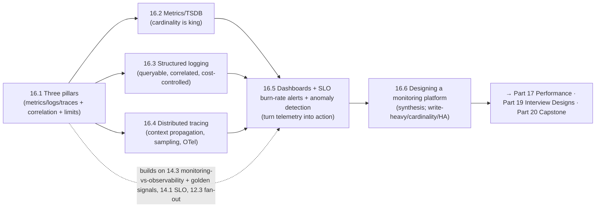

# Part 16 — Observability ✅ COMPLETE

Understanding running systems — unified by one idea: **you can't operate what you can't see, so emit the three pillars (metrics for detect, traces for localize, logs for diagnose), correlate them, keep metrics low-cardinality, sample traces, structure and control logs, turn telemetry into purposeful dashboards and SLO burn-rate alerts (not vanity dashboards or threshold spam), and know how to design the whole monitoring platform — always mindful that cardinality dominates cost and the watcher must outlive the watched.**

---

## Lessons

| # | Lesson | Core idea |
|---|--------|-----------|
| 16.1 | [The Three Pillars](16.1-three-pillars-metrics-logs-traces.md) | Metrics (detect), logs (diagnose), traces (localize) — complementary not interchangeable; correlate via trace IDs; cardinality/cost theme; limits → high-cardinality wide events (unknown-unknowns) |
| 16.2 | [Metrics/TSDB/Cardinality](16.2-metrics-tsdb-cardinality.md) | Time series (name+labels→points); specialized append/compressed TSDBs (LSM lineage); **cardinality** = dominant cost driver (bounded labels only); pull vs push; downsampling/retention |
| 16.3 | [Structured Logging & Pipelines](16.3-structured-logging-pipelines.md) | Structured (queryable) > free text; pipeline (stdout → collect → enrich/redact → buffer → store → query); levels + sampling + retention for cost; correlation IDs = trace IDs; never log secrets/PII |
| 16.4 | [Distributed Tracing](16.4-distributed-tracing-opentelemetry.md) | Traces + spans show a request's path across services; context propagation (W3C, every hop incl. async); head vs tail sampling; OpenTelemetry standard; correlate with logs/metrics; localize slow hops/tail latency |
| 16.5 | [Dashboards/SLO Alerts/Anomaly Detection](16.5-dashboards-slo-alerts-anomaly-detection.md) | Purposeful dashboards (golden signals + SLO, not vanity); SLO burn-rate multi-window alerting (not static thresholds); anomaly detection (promise + false-positive pitfalls); detect→localize→diagnose workflow |
| 16.6 | [Designing a Monitoring Platform](16.6-designing-a-monitoring-platform.md) | Interview-grade synthesis: requirements → estimation → ingestion (push/pull + queue + shard) → TSDB + retention → query → SLO alerting → HA; cardinality #1; monitoring must outlive the monitored |

---

## The through-line of Part 16

**One sentence:** Emit the three pillars — metrics to detect (16.1/16.2, kept low-cardinality), traces to localize across services (16.4, propagated + sampled + OpenTelemetry), logs to diagnose (16.3, structured + correlated + cost-controlled + no secrets) — correlate them via trace IDs, turn them into purposeful dashboards and SLO burn-rate alerts rather than vanity dashboards and threshold spam (16.5), and be able to design the whole write-heavy, cardinality-bounded, highly-available monitoring platform (16.6) — because you can't operate what you can't see.

---

## The key decisions Part 16 equips you to make

- **Which telemetry for which question?** Metrics detect, traces localize, logs diagnose — use all three, correlated. (16.1)
- **How do I do metrics without blowing up?** Time series + TSDB; keep labels low-cardinality/bounded; downsample/retain; pull vs push. (16.2)
- **How do I make logs useful + affordable?** Structured + correlated (trace IDs) + leveled + sampled + retained; never log secrets/PII; pipeline via stdout. (16.3)
- **How do I debug across services?** Distributed tracing with context propagation (every hop incl. async), head+tail sampling, OpenTelemetry, correlated with logs/metrics. (16.4)
- **How do I turn data into action?** Purposeful dashboards (golden signals + SLO) + SLO burn-rate alerts (not static thresholds); anomaly detection judiciously. (16.5)
- **How do I design a monitoring platform?** Framework-driven: ingestion (push/pull+queue+shard) → TSDB+retention → query → SLO alerting → HA; cardinality is #1; monitoring must outlive the monitored. (16.6)

---

## Self-check before Part 17

Without notes, can you:
1. Explain the three pillars, what each is good/bad at, why you need all three, and how correlation works?
2. Explain time series, why TSDBs are specialized, and why cardinality is the dominant metrics cost driver (+ how to control it)?
3. Explain structured logging, the log pipeline, cost controls, correlation IDs, and the never-log-secrets rule?
4. Explain distributed tracing (traces/spans/context propagation), head vs tail sampling, OpenTelemetry, and correlation with logs/metrics?
5. Design purposeful dashboards + SLO burn-rate alerting, and explain anomaly detection's promise and pitfalls?
6. Design a metrics/monitoring platform end-to-end (ingestion/storage/query/alerting/HA), naming cardinality + HA as the hard parts?

If any are shaky, revisit that lesson's Revision Notes. Part 17 (Performance) builds on tail latency, percentiles, RED/USE, and traces (16.4) for critical-path analysis; Part 19 (Interview Designs) reuses the monitoring-platform template (16.6); Part 20 (Capstone) integrates full observability.

---

*Reference asset for this part: `../../reference/observability-cheatsheet.md`.*
