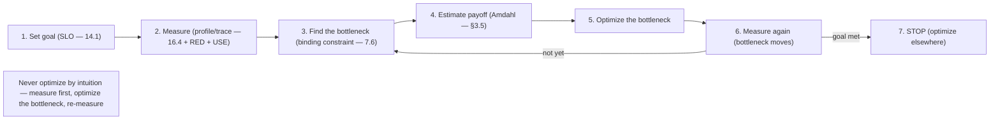
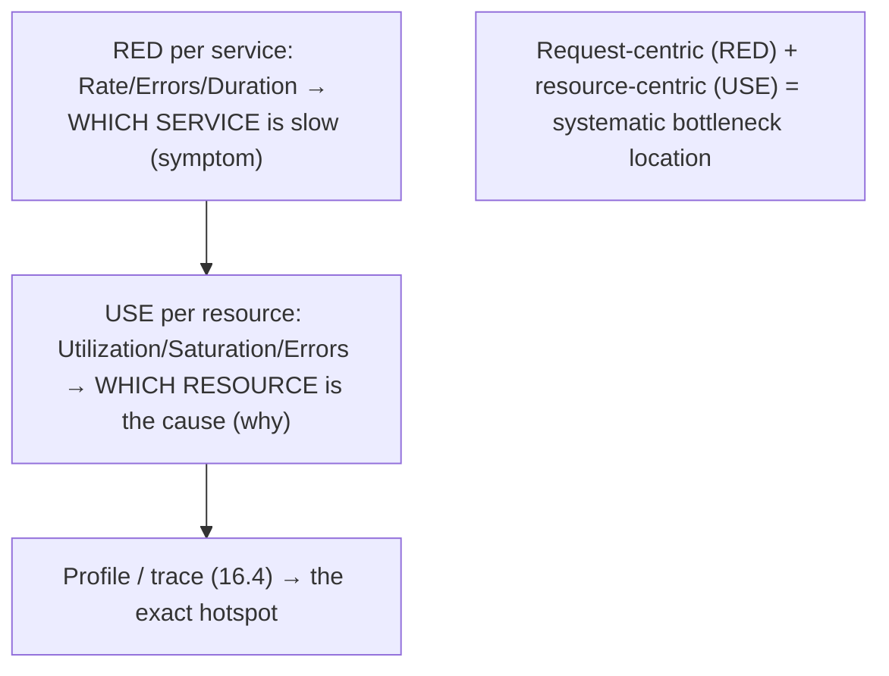

# Lesson 17.1 — Performance Methodology: USE and RED Methods, Measuring Before Optimizing

> Part 17: Performance Engineering · Difficulty: 🟡🔴
>
> **Prerequisites:** [1.1.3 Vocabulary of Scale], [7.7 Capacity/Little's Law], [14.3 Golden Signals], [16.5 Dashboards].
> **Unlocks:** [17.2 Tail Latency], [17.3 Concurrency], [17.5 Data-Layer Performance], [17.6 Cost/Efficiency].

---

## 1. Learning Objectives

After this lesson you will be able to:

- State the cardinal rule of performance work: **measure before you optimize** — never guess where the bottleneck is.
- Apply the **USE method** (Utilization, Saturation, Errors — resource-centric) and the **RED method** (Rate, Errors, Duration — request/service-centric) as systematic frameworks (14.3).
- Explain why **premature optimization** and **intuition-driven tuning** waste effort and often make things worse.
- Identify the **bottleneck** (the one binding constraint — 7.6) and optimize *it*, using **Amdahl's Law** to bound expected gains.
- Set **performance goals** tied to requirements (SLOs — 14.1) and avoid optimizing what doesn't matter.

---

## 2. Motivation — Don't guess, measure

Performance engineering is where **intuition fails most spectacularly**. Engineers routinely "know" where the slowness is, spend days optimizing that spot, and find **no improvement** — because the real bottleneck was elsewhere. The system's actual behavior under load is **counterintuitive** (queueing effects — 7.7, tail latency — 17.2, contention — 17.3), and the human instinct to optimize the code you're looking at, or the thing that's *conceptually* expensive, is usually **wrong**. The cardinal rule, stated by generations of performance experts, is therefore blunt: **measure before you optimize.** Profile, find the *actual* bottleneck, optimize *that*, and **measure again** to confirm. Everything else is guessing.

This demands **methodology** — systematic frameworks so you don't rely on hunches. Two complementary ones (introduced in 14.3): the **USE method** (Utilization, Saturation, Errors — check each **resource** to find a saturated/erroring one) is **resource-centric** and great for **infrastructure bottlenecks**; the **RED method** (Rate, Errors, Duration — check each **service**) is **request-centric** and great for **service-level performance** — RED tells you *which service is slow*, USE tells you *which resource is why*. Together with **profiling** and **tracing** (16.4), they systematically locate the bottleneck. And two theoretical guardrails shape expectations: **Amdahl's Law** (optimizing part X can only speed the whole system so much — bounded by X's share) and the discipline of tying performance goals to **requirements/SLOs** (14.1) so you optimize what **matters**, not what's merely interesting. This lesson establishes performance methodology — the disciplined, measurement-first approach that the rest of Part 17 builds on.

---

## 3. Theory — From first principles

### 3.1 The cardinal rule: measure before you optimize

`[CS]`/`[BP]` **Never optimize based on intuition — profile/measure to find the *actual* bottleneck first** `[BP]`:
- **Why intuition fails:** system performance is dominated by **non-obvious effects** — queueing (7.7), contention (17.3), tail latency (17.2), I/O waits, cache misses — that don't match "what looks expensive in the code." The bottleneck is frequently **not where you think**.
- **The loop:** **measure** (profile / trace — 16.4 / metrics — 16.2) → **find the bottleneck** (the biggest contributor — §3.4) → **optimize it** → **measure again** (confirm the gain, check for a new bottleneck) → repeat. **Data-driven, iterative.**
- `[BP]` **"Premature optimization is the root of all evil"** (Knuth) — optimizing before measuring (or optimizing the non-bottleneck) **wastes effort**, **adds complexity** (harder to maintain), and **often makes things worse**. **Measure first, always.**

### 3.2 The USE method (resource-centric)

`[CS]` **USE (Brendan Gregg)** — for **every resource**, check three things `[CS]`:
- **Utilization:** how **busy** the resource is (% of time in use) — CPU%, disk busy%, network%.
- **Saturation:** how much **extra work is queued/waiting** because the resource is full (run-queue length, I/O wait, connection-pool queue) — the **degree of overload** beyond utilization.
- **Errors:** error events for the resource (dropped packets, disk errors, failed allocations).
- **How to use:** enumerate all resources (CPU, memory, disk I/O, network, and software resources like connection pools, thread pools, locks), and for each check U/S/E → **a saturated or erroring resource is a bottleneck**.
- `[BP]` **Great for infrastructure bottlenecks** — systematically finds *which resource* is the constraint (§3.4). Key insight: **saturation** (queued work) is often the real signal — a resource can be at moderate utilization but **saturated** at the tail (bursts queue). Ties to 14.3 (saturation is a golden signal) and 7.7 (the utilization knee).

### 3.3 The RED method (request/service-centric)

`[CS]` **RED (Tom Wilkie)** — for **every service**, monitor three things `[CS]`:
- **Rate:** requests per second (traffic — 14.3).
- **Errors:** rate/ratio of failed requests.
- **Duration:** distribution of request latency (**percentiles** — p50/p99 — not averages — 17.2/14.3).
- **How to use:** RED per service (from metrics — 16.2, or span metrics — 16.4) → find **which service** has high latency/errors → the service-level bottleneck.
- `[BP]` **Great for service-level performance** (microservices — Part 12): shows the **user-facing** symptom (which service is slow/erroring — the "what"), then **USE** (§3.2) diagnoses the **resource cause** (the "why") within that service. **RED = what's wrong (symptom); USE = why (cause)** — the two are complementary (14.3), mapping to symptom vs cause.

### 3.4 Finding the bottleneck (the binding constraint)

`[CS]` Performance is limited by **one binding constraint at a time** (7.6) `[CS]`:
- A system has a **bottleneck** — the resource/stage that's **saturated first** and limits throughput/latency. Optimizing **anything else** yields **no improvement** (the bottleneck still limits you).
- **Locate it** via USE (which resource is saturated), RED (which service is slow), **profiling** (where CPU/time goes — flame graphs), and **tracing** (which span dominates — 16.4/17.2).
- `[BP]` **Optimize the bottleneck, then re-measure** — after fixing it, the bottleneck **moves** to the next constraint (§3.1 loop). Chasing non-bottlenecks is the classic waste (§3.1). "**The system is only as fast as its slowest necessary stage.**"

### 3.5 Amdahl's Law — bounding the payoff

`[CS]` **Amdahl's Law** bounds how much optimizing a part can speed the **whole** `[CS]`:
- If a part takes fraction **p** of total time, and you speed *it* up by factor **s**, the **overall speedup** is `1 / ((1−p) + p/s)` — **capped by (1−p)**, the part you *didn't* optimize.
- **Implication:** optimizing something that's **10% of the time** can improve the whole by **at most ~11%** (even if you make it infinitely fast) → **optimize the part that dominates** (the bottleneck — §3.4). And if a portion is **serial/unparallelizable**, parallelism can't help it (relates to the USL — 7.1/7.7).
- `[BP]` **Use it to set expectations + prioritize:** before optimizing, ask "what **fraction** of the total does this represent?" — if small, the payoff is small (don't bother); focus on the **big contributors**. Measurement (§3.1) tells you the fractions.

### 3.6 Optimize what matters (goals + requirements)

`[BP]` Performance work must be **goal-directed**, tied to requirements/SLOs (14.1/1.1.2) `[BP]`:
- **Define the goal:** what latency/throughput does the **requirement** demand (the SLO — 14.1: "p99 < 200ms")? Optimize toward **that**, not "as fast as possible" (diminishing returns — like 100% reliability — 14.1).
- **Optimize the user-relevant metric:** usually **tail latency (p99/p99.9)** for user experience (17.2), not the average; and the **critical path** (17.2), not incidental work.
- **Don't optimize what doesn't matter:** a faster non-bottleneck, a rarely-hit path, or micro-optimizing below the noise floor — **wasted effort** (Amdahl — §3.5). Optimization **adds complexity** (§3.1) — only pay it where it helps a real goal.
- `[BP]` **Know when to stop:** once you meet the SLO/goal, **stop** (spend effort elsewhere) — over-optimizing past requirements is as wasteful as not optimizing (1.1.5 tradeoffs).

### 3.7 The methodology loop

`[BP]` The disciplined performance-engineering process:
1. **Set a goal** (§3.6): the SLO/requirement (latency/throughput target — 14.1).
2. **Measure** (§3.1): profile, trace (16.4), RED (services — §3.3) + USE (resources — §3.2), find where time/resources go.
3. **Find the bottleneck** (§3.4): the binding constraint — the biggest contributor.
4. **Estimate the payoff** (§3.5): Amdahl — is this worth optimizing (does it dominate)?
5. **Optimize the bottleneck** (17.2–17.6: reduce work, cache — Part 6, parallelize — 17.3, batch — 17.4, tune queries — 17.5).
6. **Measure again** (§3.1): confirm the gain; the bottleneck moves → repeat until the goal is met.
7. **Stop at the goal** (§3.6).
- `[BP]` This turns performance from **guesswork into engineering** — measurement-driven, bottleneck-focused, goal-bounded. It's the meta-skill underlying all of 17.2–17.6.

---

## 4. Visual Intuition

### The measure-first loop

### RED (what's wrong) + USE (why)

---

## 5. Real-World Analogy

Think of a **doctor diagnosing why a patient is tired** — versus a quack who guesses and prescribes.

- **Measure before you optimize:** the quack **guesses** ("probably needs more vitamins!") and prescribes without testing — usually wrong, sometimes harmful. The good doctor **runs tests first** (bloodwork, scans) to find the **actual cause** before treating. In performance, **profiling before optimizing** is the bloodwork — optimizing on a hunch is quackery that wastes effort and can make things worse.
- **RED = the patient's symptoms (which "service" is off):** the doctor first checks the **presenting symptoms per system** — "how's your heart *rate*, are there *errors/complaints*, how long does activity take (*duration*)?" — to find **which body system** is underperforming (which service is slow/erroring). That tells you **what's wrong** at a high level.
- **USE = testing each organ (which resource is the cause):** then, for the suspect system, the doctor examines **each organ/resource**: is it **overworked** (utilization), is there a **backup/congestion** (saturation), are there **failures** (errors)? A **saturated or failing organ** is the bottleneck. RED found the sick system; USE finds the failing resource.
- **The bottleneck (one binding constraint):** if the patient's tiredness is caused by **one thing** (say, an underactive thyroid), treating **everything else** — diet, exercise, sleep aids — won't fix the tiredness. You must find and treat **the actual limiting cause**; fixing anything else is wasted (and then a *new* limiting factor may emerge — the bottleneck moves).
- **Amdahl's Law = don't fix what barely matters:** if a symptom accounts for only **5% of the fatigue**, curing it perfectly improves the patient by **at most 5%** — so the doctor focuses on the **dominant cause**, not a minor one. Spending a fortune on a 5% factor is poor prioritization.
- **Optimize what matters, then stop:** the goal is to get the patient **healthy enough to live their life** (meet the requirement/SLO), not to make them a superhuman athlete (as-fast-as-possible). Once they're well, the doctor **stops treating** and moves on — over-treating a healthy patient is as pointless as ignoring a sick one.

---

## 6. Industry Example

- **USE method (Brendan Gregg)** `[CONV]`: systematic resource checklist (Utilization/Saturation/Errors) for infrastructure bottlenecks (§3.2). *(Representative.)*
- **RED method (Tom Wilkie)** `[CONV]`: Rate/Errors/Duration per service for microservices performance (§3.3, 14.3). *(Representative.)*
- **Flame graphs + profilers** `[CONV]`: measurement-first profiling to find CPU/time hotspots (§3.1/3.4). *(Representative.)*
- **Distributed tracing for the critical path** `[CONV]`: traces (16.4) locate the slow span/service (§3.4, 17.2). *(Representative.)*
- **"Premature optimization" / measure-first** `[CONV]`: the enduring performance-engineering principle (Knuth) (§3.1). *(Representative.)*

---

## 7. Implementation Details

- **Always measure first** (§3.1): profile, trace (16.4), and use RED (services — §3.3) + USE (resources — §3.2) to find the **actual** bottleneck — never optimize on intuition.
- **Set a goal from the SLO/requirement** (§3.6, 14.1): a specific latency/throughput target (percentiles — 17.2); optimize toward it, not "infinitely fast."
- **Locate the binding constraint** (§3.4, 7.6): the saturated resource / slow service / dominant span; confirm with data.
- **Estimate the payoff with Amdahl** (§3.5): only optimize parts that **dominate** the total; skip small contributors.
- **Optimize the bottleneck** (17.2–17.6): the specific technique depends on what the bottleneck is (concurrency — 17.3, latency reduction — 17.4, data layer — 17.5, caching — Part 6).
- **Re-measure + iterate** (§3.1): confirm gains; the bottleneck moves; repeat until the goal is met, then **stop** (§3.6).
- **Watch percentiles + saturation** (14.3/16.5): tail latency (17.2) and saturation (the leading overload signal — 7.7) are the key metrics.

---

## 8. Advantages

- **Effective** — fixes the real bottleneck, not a guess (§3.1/3.4).
- **Efficient** — Amdahl-guided prioritization avoids wasted effort (§3.5).
- **Systematic** — USE + RED find bottlenecks methodically, not by hunch (§3.2/3.3).
- **Goal-directed** — tied to SLOs; optimize what matters, stop when met (§3.6).
- **Data-driven + verifiable** — measure → optimize → measure confirms the gain (§3.1).
- **Avoids harm** — no premature optimization complexity/regressions (§3.1).

---

## 9. Disadvantages / costs

- **Requires good measurement** — profiling, tracing (16.4), metrics (16.2) must be in place (§3.1).
- **Discipline over instinct** — resisting the urge to optimize the obvious-looking thing (§3.1).
- **Iterative** — the bottleneck moves; multiple cycles needed (§3.7).
- **Amdahl caps gains** — some systems have limited optimization headroom (serial fractions) (§3.5).
- **Measurement can perturb** — profiling has overhead; observer effect (§3.1).
- **Hard to measure production accurately** — need representative load (7.7).

---

## 10. When NOT to / cautions

- **Don't optimize before measuring** — the #1 rule (§3.1).
- **Don't optimize non-bottlenecks** — no improvement (§3.4).
- **Don't optimize a small-fraction part** — Amdahl caps the gain (§3.5).
- **Don't optimize past the goal/SLO** — diminishing returns; stop (§3.6).
- **Don't use averages** for latency goals — percentiles (§3.6, 17.2).
- **Don't add complexity for a marginal gain** — the maintenance cost may exceed the benefit (§3.1).

---

## 11. Common Mistakes

1. **Optimizing by intuition** without measuring → wasted effort, wrong target (§3.1).
2. **Premature optimization** → complexity, regressions, before it's needed (§3.1).
3. **Optimizing the non-bottleneck** → no gain (§3.4).
4. **Ignoring Amdahl** → over-investing in a small-fraction part (§3.5).
5. **No re-measurement** → not confirming the gain / missing the moved bottleneck (§3.1/3.7).
6. **Averages not percentiles** → optimizing the wrong latency metric (§3.6, 17.2).
7. **No goal** → optimizing "as fast as possible" endlessly (§3.6).
8. **RED without USE (or vice versa)** → symptom without cause, or cause without user impact (§3.2/3.3).

---

## 12. Interview Questions

**🟢 Easy**
- Why must you measure before optimizing?
- What do the USE and RED methods stand for?

**🟡 Medium**
- How do RED and USE complement each other (symptom vs cause)?
- What is Amdahl's Law, and how does it guide optimization priorities?

**🔴 Hard**
- Walk through the measure-first methodology loop. Why does the bottleneck "move," and how do you know when to stop?
- How do you find a bottleneck systematically (USE/RED/profiling/tracing — 16.4), and why is optimizing a non-bottleneck useless?

**⚫ Staff+**
- A service's p99 latency is too high. Walk through your methodology: goal (SLO), measurement (RED → which service, USE → which resource, traces → which span), bottleneck identification, Amdahl-guided prioritization, optimization, and re-measurement.
- A team spent a sprint optimizing a function that turned out to be 3% of request time, with no user-visible improvement. Diagnose the methodology failures (no measurement, ignored Amdahl, wrong target) and design the correct approach.

---

## 13. Production Pitfalls

- **Optimized the wrong thing:** days spent speeding up a non-bottleneck → zero improvement (§3.1/3.4).
- **Premature optimization complexity:** early micro-optimizations made the code complex + buggy for no real gain (§3.1).
- **Amdahl surprise:** optimized a 5%-of-time component and got a ~5% improvement, missing the dominant 60% part (§3.5).
- **Average-latency blind spot:** optimized the average while p99 (the user experience) stayed bad (§3.6, 17.2).
- **No goal, endless tuning:** over-optimized far past the SLO, wasting effort needed elsewhere (§3.6).
- **Saturation missed:** a resource at moderate utilization was saturated at the tail, causing latency spikes not seen without the USE saturation lens (§3.2, 7.7).

---

## 14. Optimization Techniques (of the methodology itself)

- **Measure-first loop** (profile/trace/RED/USE → bottleneck → optimize → re-measure) (§3.1/3.7).
- **RED (services) + USE (resources)** for systematic symptom→cause bottleneck location (§3.2/3.3).
- **Amdahl-guided prioritization** — optimize the dominant fraction only (§3.5).
- **Goal-bounded (SLO-driven)** — optimize the user-relevant metric (percentiles), stop when met (§3.6, 17.2).
- **Profiling (flame graphs) + tracing (16.4)** to pinpoint hotspots/critical path (§3.4, 17.2).
- **Watch saturation** as the leading overload signal (§3.2, 7.7/14.3).
- **Iterate** — the bottleneck moves; keep re-measuring (§3.7).

---

## 15. Summary

Performance engineering is where **intuition fails most**, so the cardinal rule is **measure before you optimize**: system behavior is dominated by **non-obvious effects** (queueing — 7.7, contention — 17.3, tail latency — 17.2, I/O waits, cache misses) that rarely match "what looks expensive," so the bottleneck is **usually not where you think** — **profile/trace/measure** to find the **actual** bottleneck, optimize **that**, and **measure again** (data-driven, iterative), because **premature optimization** (Knuth) wastes effort, adds complexity, and often makes things worse. Two complementary **methodologies** (14.3): the **USE method** (for **every resource** — CPU, memory, disk, network, pools, locks — check **Utilization** [how busy], **Saturation** [how much extra work is queued — the real overload signal, tied to the utilization knee — 7.7], **Errors**) is **resource-centric** and finds **infrastructure bottlenecks**; the **RED method** (for **every service** — **Rate**, **Errors**, **Duration** [percentiles, not averages — 17.2]) is **request/service-centric** and finds **service-level performance** — **RED tells you which service is slow (symptom), USE tells you which resource is why (cause)** — used together with **profiling** (flame graphs) and **tracing** (16.4) to systematically **locate the bottleneck**: performance is limited by **one binding constraint at a time** (7.6), so optimizing **anything else yields no improvement**, and after you fix it the **bottleneck moves** to the next constraint (re-measure and repeat). **Amdahl's Law** bounds the payoff — optimizing a part that's fraction **p** of the time yields at most **1/(1−p)** overall speedup (a 10%-of-time part → at most ~11% improvement) — so **estimate the fraction first** and **only optimize the dominant contributors**. And performance work must be **goal-directed** (tied to the **SLO/requirement** — 14.1): optimize the **user-relevant metric** (usually **tail latency — p99/p99.9** — 17.2, on the **critical path**) toward the **specific target**, **not "as fast as possible,"** and **stop when the goal is met** (over-optimizing past requirements wastes effort — 1.1.5). The disciplined loop — **set goal → measure (RED+USE+profile+trace) → find the bottleneck → estimate payoff (Amdahl) → optimize it → re-measure → stop at the goal** — turns performance from **guesswork into engineering**, and is the meta-skill underlying every technique in 17.2–17.6.

---

## 16. Revision Notes (flashcard-ready)

- **Q:** Cardinal rule of performance? **A:** Measure before you optimize — profile to find the actual bottleneck; never guess.
- **Q:** Why does intuition fail? **A:** Non-obvious effects (queueing, contention, tail latency, I/O) → the bottleneck is usually not where you think.
- **Q:** USE method? **A:** For every resource: Utilization, Saturation, Errors — resource-centric, finds infrastructure bottlenecks.
- **Q:** RED method? **A:** For every service: Rate, Errors, Duration (percentiles) — request-centric, finds service-level performance.
- **Q:** RED vs USE? **A:** RED = which service is slow (symptom); USE = which resource is why (cause). Complementary.
- **Q:** Bottleneck? **A:** The one binding constraint (7.6) that limits the system; optimizing anything else yields no gain; it moves after you fix it.
- **Q:** Amdahl's Law? **A:** Speeding a part that's fraction p of time → overall speedup ≤ 1/(1−p); optimize the dominant fraction.
- **Q:** What to optimize? **A:** The user-relevant metric (tail latency on the critical path) toward the SLO — not "as fast as possible."
- **Q:** When to stop? **A:** When the goal/SLO is met — over-optimizing past requirements is wasteful.
- **Q:** The methodology loop? **A:** Goal → measure (RED+USE+profile+trace) → find bottleneck → estimate payoff (Amdahl) → optimize → re-measure → stop.

---

## 17. Further Reading + Knowledge-Graph Links

**Foundations (in-platform):**
- **[1.1.3 Vocabulary of Scale]** — latency/throughput/concurrency/utilization.
- **[7.7 Capacity/Little's Law]** — utilization knee, saturation.
- **[14.3 Golden Signals]** — RED/USE origins; saturation.
- **[16.5 Dashboards]** / **[16.4 Tracing]** — measurement tools.
- **[7.6 DB Bottleneck]** — the binding constraint.

**Unlocks / next:**
- **[17.2 Tail Latency]** — percentiles, the critical path.
- **[17.3 Concurrency]** — contention/queueing bottlenecks.
- **[17.5 Data-Layer Performance]** — query/DB bottlenecks.
- **[17.6 Cost/Efficiency]** — optimize what matters, cost tradeoffs.

**External (canonical):**
- Gregg, *Systems Performance* — USE method, methodology. *(Representative.)*
- Wilkie, RED method. *(Representative.)*
- Knuth on premature optimization. *(Representative.)*

> **Knowledge-graph:** `1.1.3 vocab` + `7.7 knee` + `14.3 golden signals` → **`17.1 performance methodology (USE/RED, measure-first, Amdahl, goal-directed)`** → `17.2 tail latency` / `17.3 concurrency` / `17.5 data layer` / `17.6 efficiency`.
