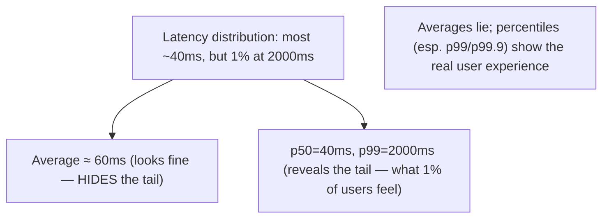
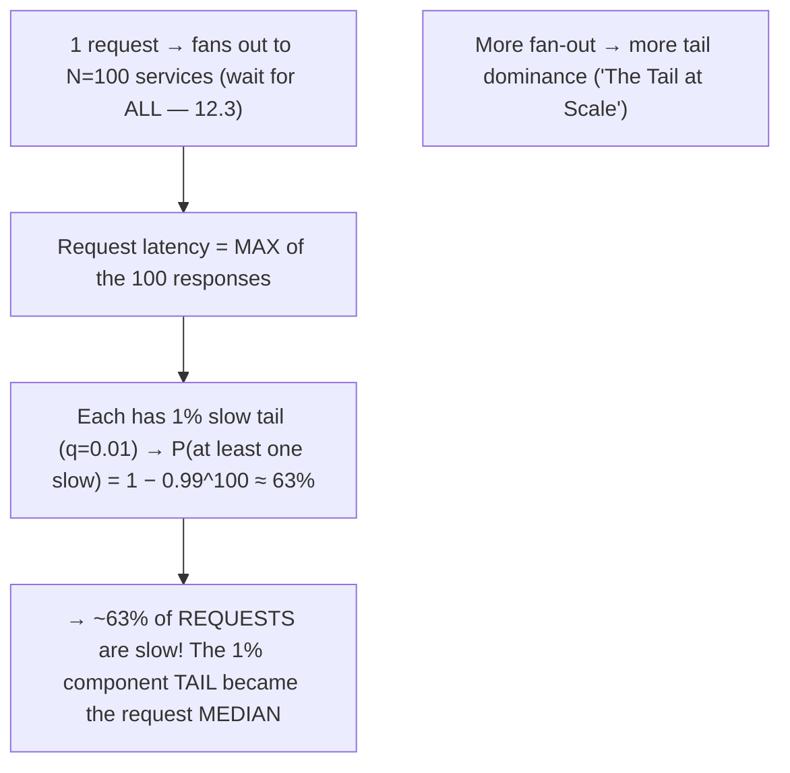
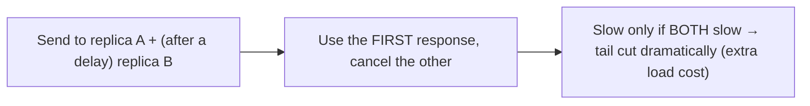

# Lesson 17.2 — Latency Analysis: Tail Latency, Percentiles, Fan-Out Amplification

> Part 17: Performance Engineering · Difficulty: 🔴
>
> **Prerequisites:** [1.1.3 Latency/Throughput], [12.3 Communication (fan-out)], [14.1 SLO (percentiles)], [16.4 Tracing], [17.1 Methodology].
> **Unlocks:** [17.3 Concurrency], [17.4 Latency Reduction], [17.6 Efficiency], [Part 19 Interview Designs].

---

## 1. Learning Objectives

After this lesson you will be able to:

- Explain why **averages hide the truth** and why **percentiles (p50/p99/p99.9)** are the right way to measure latency — and why the **tail** (p99+) is what users experience.
- Explain **tail latency** and why it dominates user experience, especially with **fan-out** (12.3).
- Explain **fan-out amplification**: why a request that calls many services is **as slow as the slowest** of them, so the **tail of components becomes the median of requests**.
- Identify **sources of tail latency** (queueing, GC pauses, contention, slow nodes, retries) and mitigations (**hedged/tied requests**, timeouts, reducing fan-out).
- Analyze the **critical path** (using traces — 16.4) to find where request latency actually comes from.

---

## 2. Motivation — The average lies; the tail is the truth

If you measure a service's latency by its **average** (mean), you are almost certainly **deceiving yourself**. Averages **hide the tail**: a service can have a great 50ms average while **1% of requests take 2 seconds** — and that 1% is not a rounding error, it's the experience of **your most active users** (who make many requests, so they hit the slow tail often) and it's what shows up in complaints and abandonment. This is why every serious latency SLO (14.1) and dashboard (16.5) uses **percentiles** — p50 (median), p99, p99.9 — not averages: **you must measure the tail to see what users actually feel.**

The tail becomes even more dominant — and more counterintuitive — in **distributed systems with fan-out** (12.3). When one user request **fans out to many backend services** (or shards) and must **wait for all of them**, the request is **as slow as the slowest response** — so even a **small tail in each component becomes the common case for requests**. If each of 100 backend calls has a 1% chance of being slow, the probability that **at least one** is slow (and thus the whole request is slow) is enormous — the **tail latency of components amplifies into the median latency of requests**. This "**tail at scale**" effect is why big fan-out systems obsess over the tail. This lesson develops percentiles, tail latency, fan-out amplification, the sources of tail latency, and mitigations (hedged requests, reducing fan-out, critical-path analysis via traces — 16.4) — the latency-analysis core of performance engineering.

---

## 3. Theory — From first principles

### 3.1 Why averages hide the truth — use percentiles

`[CS]` **Latency is a distribution, not a single number** — and the **average (mean) is a poor summary** `[CS]`:
- **Averages hide the tail:** a mean of 50ms is consistent with "most requests are 40ms but 1% are 2s" — the average is **dragged around but conceals** the slow requests that matter. A few huge outliers barely move the mean but **devastate** the affected users.
- **Percentiles** describe the distribution: **p50** (median — the typical request), **p90/p95/p99/p99.9** (the tail — the slowest 10%/5%/1%/0.1%). `[BP]` **The tail (p99, p99.9) is what you measure + optimize + SLO on** (14.1) — it's the **worst experience a meaningful fraction of users get**.
- `[BP]` **Never use averages for latency.** Report + alert + SLO on **percentiles** (14.1/16.5). "The average is a lie; the tail is the truth."

### 3.2 Why the tail matters so much

`[CS]` The tail dominates **user experience** for several compounding reasons `[CS]`:
- **Active users hit the tail repeatedly:** a user making **many** requests (a heavy user, a page loading many resources) is **likely to hit the slow tail at least once** → their overall experience is set by the **tail, not the median**. The most valuable users feel the tail most.
- **Requests aggregate many operations:** a single page/API call may involve **many** backend operations; the **slowest** determines the perceived latency (§3.3).
- **Tail latency correlates with abandonment/revenue:** slow tail → users leave; documented (representative) links between latency and conversion/engagement.
- `[BP]` So p99/p99.9 aren't "edge cases to ignore" — they're the **experience of your best users** and the metric that drives business outcomes. **Optimize the tail.**

### 3.3 Fan-out amplification — the tail at scale

`[CS]` The most important distributed-latency insight: **fan-out amplifies the tail** `[CS]`:
- **The setup:** a request **fans out** to many services/shards (12.3) and must **wait for all** to respond (scatter-gather — API composition — 12.4). The request's latency = the **maximum** of the component latencies (as slow as the slowest).
- **The math (the killer):** if each component has probability **q** of being "slow" (in its tail), the probability that **at least one of N** is slow is **1 − (1−q)^N** — which grows fast with N. Example: with a **1% tail per component (q=0.01)** and **N=100** components, the chance the request hits **at least one** slow component is **1 − 0.99^100 ≈ 63%** → **the 1% component tail becomes ~63% of requests being slow!** The **tail of components becomes the median of requests.**
- `[BP]` This is **"The Tail at Scale"** (Dean & Barroso): **the more you fan out, the more the tail dominates** — a system where each service is "usually fast" can have **most requests slow** because each request touches many services and waits for the slowest. **Reducing fan-out and taming per-component tails is essential at scale.**

### 3.4 Sources of tail latency

`[CS]` What causes the slow tail (so you can attack it — 17.1 measure-first) `[CS]`:
- **Queueing** (7.7): under load, requests **queue**; the tail explodes near the utilization knee (`1/(1−ρ)`) → high-percentile latency is often **queueing**, not per-request work.
- **Contention** (17.3): locks, shared resources, thread-pool exhaustion → some requests wait.
- **GC pauses / stop-the-world** (managed runtimes): periodic pauses hit whichever requests are in flight → tail spikes.
- **Slow nodes / stragglers:** a degraded node (gray failure — 8.1.3/11.1), a hot shard (7.4), a slow disk → requests routed there are slow.
- **Retries + timeouts** (11.3): a retry adds the timeout duration → tail latency; misconfigured timeouts amplify the tail.
- **Head-of-line blocking** (3.1.3): one slow item blocks others behind it.
- **Cache misses / cold caches** (Part 6): a miss is far slower than a hit → the tail is often the miss path.
- `[BP]` **Measure to find the actual source** (17.1) — via traces (16.4 — which span is slow), percentile breakdowns, and the USE saturation lens (17.1/7.7). The tail is usually **queueing/contention/stragglers**, not the happy-path work.

### 3.5 Taming the tail — mitigations

`[BP]` Techniques to reduce tail latency `[BP]`:
- **Reduce fan-out** (§3.3): fewer synchronous dependencies per request (good boundaries — 12.2, local data / CQRS — 12.4, aggregation) → the amplification math (§3.3) improves dramatically. **The best fix is fewer components to wait on.**
- **Hedged requests (request hedging):** send the request to **two replicas**, use the **first** response, cancel the other → the request is slow only if **both** are slow (turning a max into a min) → **dramatically cuts the tail** at the cost of some extra load. (Send the hedge only after a delay — e.g., if no response by p95 — to limit overhead.)
- **Tied requests:** send to two, they coordinate to cancel the duplicate once one starts → less wasted work than pure hedging.
- **Timeouts + limited retries** (11.3): bound the wait (a slow request fails fast + retries elsewhere) — but carefully (retries add load — 11.3).
- **Reduce queueing** (7.7): keep utilization below the knee (headroom — 11.2/7.7), prioritize/shed load (11.4) → the tail collapses.
- **Address stragglers:** detect + avoid slow nodes (load-aware balancing — 3.3.1), fix hot shards (7.4), micro-partition.
- **Tune GC / use tail-friendly runtimes**; **warm caches** (Part 6) to avoid cold-miss tails.
- `[BP]` **The two highest-leverage moves: reduce fan-out (§3.3) and hedge requests** — the first shrinks the amplification, the second turns "wait for the slowest" into "take the fastest."

### 3.6 Critical-path analysis

`[BP]` To know **where** a request's latency comes from, analyze the **critical path** (17.1 measure-first) `[BP]`:
- The **critical path** = the sequence of operations that **determines** the total latency (the longest dependency chain). Optimizing work **off** the critical path (parallel/async) doesn't help; only **critical-path** work matters (Amdahl — 17.1).
- **Traces (16.4)** are the tool: the span waterfall shows **which hop dominates** the request (the slow span on the critical path) — the bottleneck to optimize (17.1/12.3).
- **Parallelize + move work off the critical path:** run independent operations **concurrently** (17.3) so the critical path is the **longest single chain**, not the **sum**; make non-essential work **async** (Part 9) so it's off the response path.
- `[BP]` **Analyze the critical path (via traces), optimize the dominant span, parallelize independent work** — the concrete application of 17.1's methodology to latency.

### 3.7 Putting it together — latency analysis

`[BP]` The latency-analysis workflow:
- **Measure with percentiles** (§3.1, 14.1/16.5): p50/p99/p99.9 — never averages; the **tail is the target**.
- **Understand fan-out amplification** (§3.3): the tail of components becomes the median of requests → **reduce fan-out** where possible.
- **Find the tail's source** (§3.4, 17.1): traces (16.4), percentile breakdowns, saturation (7.7) — usually queueing/contention/stragglers.
- **Analyze the critical path** (§3.6): the dominant span; parallelize independent work; async off-path work.
- **Tame the tail** (§3.5): reduce fan-out + hedge requests (the big two), plus timeouts, headroom, straggler avoidance, cache warming.
- `[BP]` Result: you **optimize what users actually feel** (the tail on the critical path), understand why big fan-out systems are tail-dominated, and apply the right mitigations — the core of user-facing performance work (feeding SLOs — 14.1).

---

## 4. Visual Intuition

### Average vs percentiles

### Fan-out amplification (the tail at scale)

### Hedged requests (max → min)

---

## 5. Real-World Analogy

Think of **timing how long it takes a group to finish a task** — and why the **slowest member** dominates.

- **Averages lie:** if you report that "on average, orders take 5 minutes at this restaurant," that's cold comfort to the **1 in 100 diners who waited 40 minutes** — and there are always some. The average is **dragged only slightly** by those long waits but **hides them completely**. The diner who waited 40 minutes doesn't care about the average; they care about **their** wait. That's why you report the **p99** ("99% of diners are served within X") — the **tail is the real experience** of your unluckiest (often most frequent) customers.
- **Active users hit the tail:** a regular who eats there **every day** will, over a month, **almost certainly** hit a 40-minute wait at least once — so their impression is set by the **worst** experience, not the typical one. Your best customers feel the tail most.
- **Fan-out amplification (the group dinner):** now imagine a **table of 100 people** where **everyone must be served before anyone eats** (fan-out — wait for all). Even if each dish has only a **1% chance** of being slow, with **100 dishes** the chance that **at least one** is slow — and thus **the whole table waits** — is about **63%**. So even though each dish is "usually fast," **most dinners are slow** because the table is only as fast as its slowest dish. **The rare slow dish (the tail) becomes the common dinner experience (the median)** — the more people at the table (fan-out), the worse it gets.
- **Hedged requests (order the risky dish twice):** to protect against a slow dish, you **order it from two kitchens** and eat **whichever arrives first**, canceling the other. Now the dish is slow only if **both** kitchens are slow — turning "wait for the slowest" into "take the fastest." You pay for some extra cooking, but the **tail shrinks dramatically**. (You only double-order **after** the first one is late, to limit waste.)
- **Reduce fan-out (smaller table):** the best fix is often to **not need 100 dishes served simultaneously** — split into smaller tables that eat independently, or pre-plate common items (local data/caching) — shrinking the amplification at the source.

---

## 6. Industry Example

- **"The Tail at Scale" (Dean & Barroso)** `[CONV]`: the foundational paper on fan-out amplifying tail latency + hedged/tied requests (§3.3/3.5). *(Representative.)*
- **Percentile SLOs (p99/p99.9)** `[CONV]`: latency SLOs stated as percentiles, never averages (§3.1, 14.1). *(Representative.)*
- **Hedged/tied requests** `[CONV]`: sending duplicate requests to cut tail latency in large fan-out systems (§3.5). *(Representative.)*
- **Latency ↔ revenue/engagement** `[CONV]`: documented links between tail latency and conversion/abandonment (§3.2). *(Representative — figures vary.)*
- **Critical-path analysis via tracing** `[CONV]`: using traces (16.4) to find the dominant span (§3.6). *(Representative.)*

---

## 7. Implementation Details

- **Measure + SLO on percentiles** (§3.1, 14.1/16.5): p50/p99/p99.9 via histograms (16.2); **never averages**; the **tail is the target**.
- **Understand + reduce fan-out** (§3.3): fewer synchronous dependencies per request (good boundaries — 12.2, local data/CQRS — 12.4, aggregation) → improve the amplification math.
- **Find the tail's source** (§3.4, 17.1): traces (16.4 — the slow span), percentile breakdowns, saturation (7.7); usually queueing/contention/stragglers/GC/cold-cache.
- **Analyze the critical path** (§3.6, 16.4): optimize the dominant span; **parallelize independent operations** (17.3); make non-essential work **async** (Part 9) off the response path.
- **Tame the tail** (§3.5): **hedged/tied requests** (send-after-delay to limit overhead), timeouts + limited retries (11.3), **keep utilization below the knee** (headroom — 7.7/11.2), straggler/hot-shard avoidance (7.4/3.3.1), GC tuning, cache warming (Part 6).
- **Verify with re-measurement** (17.1): confirm the tail improved, not just the average.

---

## 8. Advantages (of tail-focused analysis)

- **Optimizes the real experience** — percentiles/tail = what users feel (§3.1/3.2).
- **Explains distributed slowness** — fan-out amplification (§3.3).
- **Targeted mitigations** — reduce fan-out + hedge (the big two) cut the tail sharply (§3.5).
- **Critical-path focus** — optimize what determines latency, parallelize the rest (§3.6, 17.1).
- **Business impact** — tail latency drives conversion/engagement (§3.2).
- **Feeds SLOs** — percentile targets (§3.1, 14.1).

---

## 9. Disadvantages / costs

- **Tail is hard to fix** — dominated by queueing/contention/stragglers, not simple code (§3.4).
- **Hedging costs extra load** — duplicate requests (mitigated by send-after-delay) (§3.5).
- **Fan-out reduction requires design changes** — boundaries/data locality (§3.3, 12.2/12.4).
- **Measurement needs percentiles + tracing** — histograms (16.2) + traces (16.4) (§3.1/3.6).
- **Amplification is inherent at scale** — can't fully eliminate, only mitigate (§3.3).
- **Averages are tempting + misleading** — discipline needed to use percentiles (§3.1).

---

## 10. When NOT to / cautions

- **Don't use averages** for latency — percentiles (§3.1).
- **Don't ignore the tail** as "edge cases" — it's your best users' experience (§3.2).
- **Don't over-fan-out** — it amplifies the tail (§3.3).
- **Don't hedge everything** — it costs load; hedge selectively (after a delay) on tail-sensitive paths (§3.5).
- **Don't optimize off-critical-path work** — no latency gain (§3.6, 17.1).
- **Don't run near the utilization knee** — the tail explodes (§3.4, 7.7).

---

## 11. Common Mistakes

1. **Reporting/SLOing on averages** → hiding the tail users feel (§3.1).
2. **Dismissing p99 as edge cases** → ignoring your best users (§3.2).
3. **Excessive synchronous fan-out** → tail amplification (§3.3).
4. **Not analyzing the critical path** → optimizing off-path work uselessly (§3.6, 17.1).
5. **Running near the knee** → queueing tail explosion (§3.4, 7.7).
6. **Naive retries** → adding to the tail / retry storms (§3.4/3.5, 11.3).
7. **Hedging everything** → excessive extra load (§3.5).
8. **Ignoring cold-cache/GC/straggler tails** (§3.4).

---

## 12. Interview Questions

**🟢 Easy**
- Why are averages misleading for latency? What should you use instead?
- Why does the tail (p99) matter more than the average for user experience?

**🟡 Medium**
- Explain fan-out amplification: why does a 1% per-component tail become a large fraction of slow requests?
- What are the main sources of tail latency, and how do you find them (17.1/16.4)?

**🔴 Hard**
- Explain hedged/tied requests and why they cut the tail. What's the cost, and how do you limit it?
- How do you analyze and optimize the critical path of a request (traces, parallelization, async)?

**⚫ Staff+**
- A user-facing API has good average latency but a bad p99 that worsens as it fans out to more services. Diagnose (fan-out amplification + tail sources), and design the fix (reduce fan-out, hedge, headroom, straggler handling) — measured on percentiles.
- Explain "The Tail at Scale" and design a large fan-out system (e.g., search — Part 18.7) to keep p99 acceptable despite calling hundreds of shards.

---

## 13. Production Pitfalls

- **Average masked a bad tail:** the dashboard showed a fine average while p99 users suffered badly (§3.1).
- **Fan-out tail explosion:** adding more backend calls per request made most requests slow (amplification) (§3.3).
- **Queueing tail near the knee:** running at high utilization made p99 explode under load (§3.4, 7.7).
- **GC-pause tail spikes:** periodic stop-the-world pauses caused p99.9 spikes (§3.4).
- **Straggler/hot-shard tail:** one slow node/shard dominated the tail of requests routed there (§3.4, 7.4).
- **Retry-amplified tail:** naive retries added the timeout to the tail + increased load (§3.4/3.5, 11.3).
- **Optimized off-critical-path:** sped up parallel/async work → no latency improvement (§3.6, 17.1).

---

## 14. Optimization Techniques

- **Percentile measurement + SLOs (p99/p99.9)** — target the tail (§3.1, 14.1/16.2).
- **Reduce fan-out** (fewer sync deps, local data/CQRS, aggregation) — shrink amplification (§3.3, 12.2/12.4).
- **Hedged/tied requests (send-after-delay)** — turn "wait for slowest" into "take fastest" (§3.5).
- **Keep utilization below the knee + headroom** — collapse the queueing tail (§3.4, 7.7/11.2).
- **Critical-path analysis (traces) + parallelize + async off-path** (§3.6, 16.4/17.3/Part 9).
- **Straggler avoidance** (load-aware LB, fix hot shards), GC tuning, cache warming (§3.4/3.5, 3.3.1/7.4/Part 6).
- **Timeouts + limited retries** to bound the tail (carefully) (§3.5, 11.3).

---

## 15. Summary

Measuring latency by the **average** deceives you: latency is a **distribution**, and the average **hides the tail** (a 50ms mean is consistent with 1% of requests at 2s), so serious latency measurement, SLOs (14.1), and dashboards (16.5) use **percentiles** — **p50** (median/typical), **p99/p99.9** (the tail) — because **the tail is what users actually feel**: **active users hit the slow tail repeatedly** (over many requests), a single page aggregates **many** operations (the slowest dominates), and **tail latency correlates with abandonment/revenue** — so **p99/p99.9 are not edge cases but the experience of your best users** (never use averages). The tail becomes overwhelmingly dominant with **fan-out** (12.3): when a request **fans out to N services/shards and must wait for all**, its latency is the **maximum** of the components, and the probability that **at least one of N is slow** is **1 − (1−q)^N** — with a **1% per-component tail and N=100**, that's **~63% of requests slow** — so the **tail of components becomes the median of requests** ("**The Tail at Scale**" — Dean & Barroso), and **more fan-out means more tail dominance**. The **sources of tail latency** (find them by measuring — 17.1: traces — 16.4, percentile breakdowns, saturation — 7.7) are usually **queueing** (explodes near the utilization knee — `1/(1−ρ)`), **contention** (locks/pools — 17.3), **GC pauses**, **slow nodes/hot shards/stragglers** (7.4/8.1.3), **retries** (11.3), **head-of-line blocking** (3.1.3), and **cache misses** (Part 6) — **not** the happy-path work. The **two highest-leverage mitigations**: **reduce fan-out** (fewer synchronous dependencies via good boundaries — 12.2, local data/CQRS — 12.4, aggregation → improve the amplification math) and **hedged requests** (send to two replicas, use the first, cancel the other → turn "wait for the slowest" into "take the fastest," cutting the tail dramatically, sending the hedge only **after a delay** to limit extra load — plus **tied requests** to reduce waste); complemented by **timeouts + limited retries** (11.3), **keeping utilization below the knee** (headroom — 7.7/11.2 → the queueing tail collapses), **straggler/hot-shard avoidance** (3.3.1/7.4), **GC tuning**, and **cache warming** (Part 6). Finally, analyze the **critical path** (the longest dependency chain that determines total latency — via **traces** — 16.4): optimize the **dominant span**, **parallelize independent operations** (17.3), and push non-essential work **async off the response path** (Part 9) — since optimizing off-critical-path work yields no latency gain (Amdahl — 17.1). Latency analysis, done right, **optimizes what users actually feel** (the tail on the critical path), explains why big fan-out systems are tail-dominated, and applies the right mitigations.

---

## 16. Revision Notes (flashcard-ready)

- **Q:** Why not averages for latency? **A:** They hide the tail — a good mean can conceal 1% of requests being terribly slow; use percentiles.
- **Q:** Which percentiles? **A:** p50 (median/typical), p99/p99.9 (the tail) — the tail is what users feel; SLO on it (14.1).
- **Q:** Why does the tail matter? **A:** Active users hit it repeatedly, requests aggregate many ops (slowest dominates), tail correlates with abandonment.
- **Q:** Fan-out amplification? **A:** Request waits for all N components → P(≥1 slow) = 1−(1−q)^N; 1% tail × 100 ≈ 63% slow requests. Tail becomes the median.
- **Q:** The Tail at Scale? **A:** More fan-out → more tail dominance; each service "usually fast" yet most requests slow.
- **Q:** Sources of tail latency? **A:** Queueing (near the knee), contention, GC pauses, stragglers/hot shards, retries, HoL blocking, cache misses.
- **Q:** Two best tail mitigations? **A:** Reduce fan-out (shrink amplification) + hedged requests (take the fastest of two).
- **Q:** Hedged requests? **A:** Send to two replicas, use the first, cancel the other (send hedge after a delay to limit load) → max becomes min.
- **Q:** Critical path? **A:** The longest dependency chain that determines total latency; optimize the dominant span, parallelize the rest (traces — 16.4).
- **Q:** Queueing + the knee? **A:** Tail latency explodes as utilization approaches the knee (1/(1−ρ)); keep headroom (7.7/11.2).

---

## 17. Further Reading + Knowledge-Graph Links

**Foundations (in-platform):**
- **[1.1.3 Latency/Throughput]** — the vocabulary.
- **[12.3 Communication]** / **[12.4 API Composition]** — fan-out that amplifies the tail.
- **[7.7 Capacity/Knee]** — queueing tail.
- **[14.1 SLO]** — percentile SLOs.
- **[16.4 Tracing]** — critical-path analysis.

**Unlocks / next:**
- **[17.3 Concurrency]** — contention/parallelism (tail sources + critical-path parallelization).
- **[17.4 Latency Reduction]** — batching/caching/connection reuse.
- **[Part 19 Interview Designs]** — tail-aware designs (search, feed).

**External (canonical):**
- Dean & Barroso, "The Tail at Scale." *(Representative.)*
- Gregg, *Systems Performance* — latency analysis. *(Representative.)*

> **Knowledge-graph:** `1.1.3 latency` + `12.3 fan-out` + `7.7 knee` → **`17.2 tail latency (percentiles, fan-out amplification, hedging, critical path)`** → `17.3 concurrency` / `17.4 latency reduction`; measured via `16.4 traces`, SLO'd via `14.1`.
