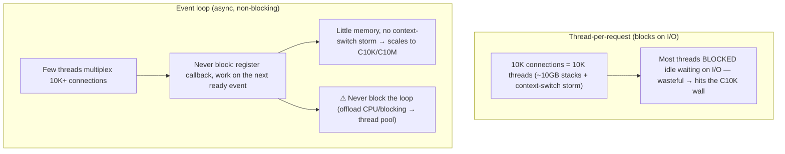

# Lesson 17.3 — Concurrency & Parallelism: Thread Pools, Async I/O, Event Loops, the C10K→C10M Story

> Part 17: Performance Engineering · Difficulty: 🔴
>
> **Prerequisites:** [2.4.3 Concurrency Patterns], [3.3.4 Connection Management], [7.7 Little's Law], [17.1 Methodology], [17.2 Tail Latency].
> **Unlocks:** [17.4 Latency Reduction], [17.6 Efficiency], [Part 19 Interview Designs].

---

## 1. Learning Objectives

After this lesson you will be able to:

- Distinguish **concurrency** (dealing with many things at once) from **parallelism** (doing many things at once) and why the distinction matters.
- Explain the **thread-per-request** model and its limits (memory/context-switch cost) vs the **event-loop / async I/O** model, and when each fits.
- Explain the **C10K → C10M** story: why handling 10K then 10M concurrent connections forced the shift from threads to async/event-driven I/O.
- Apply concurrency mechanisms: **thread pools**, **async/non-blocking I/O**, **event loops**, and understand **CPU-bound vs I/O-bound** workloads.
- Reason about **Little's Law** (7.7), contention/coordination costs (the USL — 7.1), and choosing the right concurrency model.

---

## 2. Motivation — Doing more at once, without falling over

A server that handles **one request at a time** is useless at scale — it must handle **many concurrently**. But *how* it does so profoundly affects performance, and the wrong model **doesn't scale**. The traditional approach — **one thread per request** — is simple and intuitive, but each thread costs **memory** (a stack, often ~MB) and **context-switch overhead**, so a server hits a wall at a few thousand concurrent connections (the famous **C10K problem** — "how do we handle 10,000 concurrent connections?"). The answer that emerged — **asynchronous, non-blocking I/O with event loops** — lets a **handful of threads** juggle **tens of thousands** (then millions — **C10M**) of connections by **never blocking**: instead of a thread waiting idle for I/O, it registers a callback and moves on.

Understanding this requires the crucial distinction between **concurrency** (structuring a program to *deal with* many things at once — an I/O-bound web server juggling many waiting connections) and **parallelism** (actually *doing* many things simultaneously on multiple cores — a CPU-bound computation). They're different problems with different solutions: I/O-bound work benefits from **async/event loops** (few threads, many connections), while CPU-bound work benefits from **parallelism** (threads/processes across cores). Get this wrong — thread-per-request for a high-connection I/O server, or async for CPU-bound number-crunching — and performance suffers. And **Little's Law** (7.7) ties it together: concurrency = throughput × latency, so the concurrency you need is determined by your load and latency. This lesson develops concurrency vs parallelism, the thread/event-loop models, the C10K→C10M story, and choosing the right model — the concurrency core of performance.

---

## 3. Theory — From first principles

### 3.1 Concurrency vs parallelism

`[CS]` A crucial, often-confused distinction (Rob Pike) `[CS]`:
- **Concurrency** = **structuring** a program to **deal with many things at once** — managing multiple in-progress tasks that may be **interleaved** (not necessarily simultaneous). About **composition/structure**. Example: a web server juggling 10,000 connections, most **waiting on I/O**.
- **Parallelism** = **actually executing** many things **simultaneously** — requires **multiple cores/processors**. About **execution**. Example: splitting a big computation across 16 cores.
- `[BP]` **They're orthogonal:** you can have concurrency **without** parallelism (one core interleaving many tasks — great for I/O-bound), and they combine (concurrent structure + parallel execution). **The key implication:** **I/O-bound** work needs **concurrency** (juggle many waiting tasks — §3.4); **CPU-bound** work needs **parallelism** (split across cores — §3.4). Matching the model to the workload is the central decision.

### 3.2 The thread-per-request model + its limits

`[CS]` The traditional server model: **one thread (or process) per request/connection** `[CS]`:
- **How:** each incoming connection gets a **dedicated thread** that handles it start-to-finish, **blocking** on I/O (DB call, network) — simple, intuitive, easy to reason about (sequential code).
- **The limits** `[BP]`:
  - **Memory:** each thread has a **stack** (often ~1MB) → 10,000 threads ≈ **~10GB** just for stacks → doesn't scale to high connection counts.
  - **Context-switch overhead:** the OS scheduler switching among thousands of threads costs CPU + cache thrashing → diminishing returns.
  - **Blocking wastes threads:** a thread **blocked on I/O** (most of the time for I/O-bound work) is **idle but consuming resources** — you have thousands of threads doing nothing but waiting.
- `[BP]` This is why thread-per-request hits a wall (~thousands of connections — the **C10K** problem — §3.3). It's fine for **modest concurrency** or **CPU-bound** work, but not for **high-connection I/O-bound** servers.

### 3.3 The C10K → C10M story

`[CS]` The historical arc that drove the shift `[CS]`:
- **C10K (~2000s):** the problem of handling **10,000 concurrent connections** on one server. Thread-per-request (§3.2) couldn't — 10K threads = too much memory + context-switching. The answer: **event-driven, non-blocking I/O** (§3.4) — a few threads handling all 10K connections by never blocking.
- **C10M (~2010s):** pushing to **10 million** connections — required going further: **kernel-bypass**, **efficient event notification** (epoll/kqueue), **minimal per-connection state**, sometimes **user-space networking** — squeezing the OS/hardware.
- `[BP]` **The lesson:** high connection counts forced the industry from **thread-per-request → async/event-driven I/O**. Modern high-concurrency servers (web servers, proxies — 3.3.2, gateways — 12.6) are **event-driven** precisely because I/O-bound work at high connection counts demands it. (Newer languages add **lightweight threads/coroutines** — §3.6 — to get async performance with simpler code.)

### 3.4 Async/non-blocking I/O + event loops

`[CS]` The model that solved C10K: **asynchronous, non-blocking I/O driven by an event loop** `[CS]`:
- **Non-blocking I/O:** instead of a thread **blocking** while waiting for I/O, the operation **returns immediately** and the thread is **notified later** (via a callback/event/future) when the I/O completes → the thread **never sits idle waiting**.
- **Event loop:** a **single (or few) thread(s)** run a loop that: waits for **I/O events** (efficiently — epoll/kqueue), and for each ready event, runs its **handler/callback** → one thread multiplexes **thousands** of connections because it's only ever doing **actual work** (handling ready events), never waiting.
- **Why it scales for I/O-bound work:** I/O-bound work is **mostly waiting**; the event loop **fills the waiting time** by working on other connections → a few threads handle enormous concurrency with **little memory** (no per-connection thread/stack) and **no context-switch storm**.
- `[BP]` **The catch — never block the event loop:** any **blocking** operation (a slow CPU computation, a synchronous call) on the event-loop thread **stalls ALL connections** it serves → CPU-bound/blocking work must be **offloaded** (to a thread pool — §3.5). "**Don't block the event loop**" is the cardinal rule of async programming.
- **Async programming models:** callbacks → promises/futures → async/await (syntactic sugar making async code look sequential — modern, most ergonomic).

### 3.5 CPU-bound vs I/O-bound + thread pools

`[BP]` **Match the concurrency model to the workload** `[BP]`:
- **I/O-bound** (mostly waiting on network/disk — most web/API servers): use **async/event-loop** (§3.4) — few threads, massive connection concurrency, high efficiency. **Concurrency, not parallelism.**
- **CPU-bound** (heavy computation — image processing, ML, crypto): use **parallelism** — spread across **cores** via **threads/processes/thread pools**; async doesn't help (there's no waiting to overlap; you need more cores doing work). Limited by core count + Amdahl (17.1) / the serial fraction (USL — 7.1).
- **Thread pool:** a **fixed pool of worker threads** processing a queue of tasks (2.4.3) — bounds concurrency (avoids unbounded thread creation), and is how event-loop systems **offload blocking/CPU work** (§3.4) without stalling the loop. Sized to the workload (roughly #cores for CPU-bound; higher for I/O-bound work in a threaded model).
- `[BP]` **The common hybrid:** an **event loop** for I/O (accepting/multiplexing connections) + a **thread pool** for CPU-bound/blocking work — the best of both. **Diagnose the workload (I/O vs CPU bound — 17.1) and pick accordingly.**

### 3.6 Little's Law, contention, and the coordination cost

`[BP]` Quantifying + limiting concurrency (7.7/7.1) `[BP]`:
- **Little's Law** (7.7): **concurrency (L) = throughput (λ) × latency (W)**. The number of **concurrent** requests in flight = arrival rate × how long each takes → tells you **how much concurrency you need** (and thread-pool/connection-pool sizing — 3.3.4). If latency rises (a slow dependency), **concurrency rises** → resources exhaust (why slow dependencies cause thread/pool exhaustion — 11.3/17.2).
- **Contention + coordination costs (USL — 7.1):** more threads/parallelism isn't free — **shared-resource contention** (locks, shared state) and **coordination** (synchronization) **reduce** the gains and can make things **worse** past a point (the Universal Scalability Law's retrograde region — 7.1). **Lock contention** is a classic tail-latency source (17.2).
- `[BP]` **Implications:** size pools via Little's Law; **minimize shared mutable state + locks** (prefer immutability, message-passing/actors — 2.4.3, sharding state — 7.3); beware that **adding threads past the contention point degrades** performance. Concurrency has a **coordination tax**.

### 3.7 Putting it together — choosing the model

`[BP]` The concurrency decision:
- **Diagnose the workload** (17.1): **I/O-bound** (waiting) or **CPU-bound** (computing)?
- **I/O-bound + high connections** → **async/event-loop** (§3.4): few threads, huge concurrency, little memory — but **never block the loop** (offload blocking/CPU work to a thread pool — §3.5).
- **CPU-bound** → **parallelism** across cores (thread/process pools — §3.5); limited by cores + serial fraction (17.1/7.1).
- **Hybrid** (most real servers): **event loop for I/O + thread pool for CPU/blocking** work (§3.5).
- **Size + tune** (§3.6): Little's Law for pool sizing (7.7); minimize contention/locks (7.1/2.4.3); use lightweight threads/coroutines (Go goroutines, virtual threads — representative) for async performance with sequential-style code.
- `[BP]` Result: **high concurrency without falling over** — matching the model to the workload, never blocking the loop, sizing via Little's Law, and minimizing coordination costs — the concurrency foundation for throughput + tail latency (17.2).

---

## 4. Visual Intuition

### Thread-per-request vs event loop



### Match the model to the workload

```mermaid
flowchart LR
    Q{"Workload?"}
    Q -->|I/O-bound (waiting) — web/API server| ASYNC["Concurrency: async/event loop (few threads, many connections)"]
    Q -->|CPU-bound (computing) — image/ML/crypto| PAR["Parallelism: thread/process pool across cores"]
    HYBRID["Most servers: event loop (I/O) + thread pool (CPU/blocking) = hybrid"]
    note["Little's Law: concurrency = throughput × latency → sizes pools; minimize contention (USL — 7.1)"]
```

---

## 5. Real-World Analogy

Think of a **restaurant** and how the **waiters** handle many tables — the difference between one-waiter-per-table and one waiter juggling many.

- **Concurrency vs parallelism:** **parallelism** is having **more cooks in the kitchen** actually cooking dishes **simultaneously** (more cores doing CPU work). **Concurrency** is **one skilled waiter juggling many tables** — taking an order here, refilling a drink there, checking on another — **dealing with many things at once** even though they're **one person** (interleaving, not simultaneous). Different problems: the kitchen needs **more cooks** (parallelism, CPU-bound); the dining room needs **waiters who juggle well** (concurrency, I/O-bound).
- **Thread-per-request = one waiter glued to each table:** the naive approach assigns **one waiter per table** who **stands and waits** at that table the entire time — including while the customers **read the menu, eat, or wait for the kitchen** (blocked on I/O). With **100 tables** you need **100 waiters**, most **standing idle waiting** — hugely wasteful (memory), and the floor is chaos with everyone bumping around (context-switching). At 10,000 tables (C10K), it's impossible.
- **Event loop = one brilliant waiter who never stands idle:** instead, **one waiter** works the whole floor by **never waiting**: they take table 1's order, and while the kitchen cooks, they **don't stand there** — they go take table 2's order, refill table 3, deliver to table 4. They only ever do **actual work**, filling the "waiting" time by serving other tables (non-blocking I/O + event loop). One waiter handles **hundreds of tables** because tables spend most of their time **waiting** (I/O-bound), and the waiter fills that time.
- **Never block the event loop:** the catch — if this one waiter gets stuck doing something **long and blocking** (say, personally washing a mountain of dishes — a CPU-heavy task), **every table they serve is stalled** waiting for them. So heavy blocking work must be **handed off to a back-room crew** (a thread pool) so the waiter stays free to keep juggling tables. "**Don't let the juggling waiter get stuck on one long task.**"
- **Little's Law:** how many tables can one waiter juggle? = **arrival rate × how long each table takes**. If the kitchen slows down (higher latency), each table **occupies the waiter's attention longer**, so **fewer tables can be juggled** — and if you don't add waiters, tables back up (concurrency = throughput × latency; slow dependencies exhaust your capacity).

---

## 6. Industry Example

- **Nginx / event-driven servers** `[CONV]`: solved C10K with an event-loop, non-blocking-I/O architecture handling massive connection counts with few threads (§3.3/3.4). *(Representative.)*
- **Node.js event loop** `[CONV]`: single-threaded event loop for I/O-bound work; offloads CPU/blocking to a thread pool ("don't block the event loop") (§3.4/3.5). *(Representative.)*
- **Thread-per-request (traditional app servers)** `[CONV]`: simple, fine for modest concurrency / CPU-bound; hits limits at high connection counts (§3.2). *(Representative.)*
- **Lightweight threads/coroutines (Go goroutines, JVM virtual threads)** `[CONV]`: async-like scalability with sequential-style code (§3.6). *(Representative.)*
- **epoll/kqueue** `[CONV]`: efficient event notification enabling C10K/C10M (§3.3/3.4). *(Representative.)*

---

## 7. Implementation Details

- **Diagnose the workload** (17.1): **I/O-bound** (waiting) → concurrency/async; **CPU-bound** (computing) → parallelism (§3.5).
- **I/O-bound high-connection servers** → **async/event-loop** (§3.4): non-blocking I/O + event loop (epoll/kqueue); **never block the loop** — offload CPU/blocking work to a **thread pool** (§3.5).
- **CPU-bound** → **parallelism** across cores (thread/process pools — §3.5); limited by cores + serial fraction (17.1/7.1).
- **Use thread pools** (2.4.3) to bound concurrency + offload blocking work (§3.4/3.5); size via **Little's Law** (7.7) + workload (roughly #cores CPU-bound; higher I/O-bound).
- **Consider lightweight threads/coroutines** (goroutines/virtual threads — §3.6) for async scalability with simpler sequential-style code.
- **Minimize contention** (§3.6, 7.1): reduce shared mutable state + locks (immutability, message-passing/actors — 2.4.3, shard state — 7.3); beware adding threads past the contention point.
- **Size connection/thread pools via Little's Law** (7.7, 3.3.4); watch for slow-dependency-driven concurrency growth (11.3/17.2).

---

## 8. Advantages

- **Async/event-loop:** massive I/O concurrency with few threads + little memory (C10K/C10M) (§3.3/3.4).
- **Parallelism:** real speedup for CPU-bound work across cores (§3.5).
- **Thread pools:** bounded concurrency + offload blocking without stalling the loop (§3.5).
- **Right model = efficiency:** matching workload to model maximizes throughput/tail (§3.5, 17.2).
- **Lightweight threads:** async performance + sequential-style code (§3.6).
- **Little's Law:** principled pool sizing (§3.6, 7.7).

---

## 9. Disadvantages / costs

- **Async complexity:** callback/async code is harder to write/debug ("callback hell" — mitigated by async/await + coroutines) (§3.4/3.6).
- **Blocking the event loop = disaster:** one blocking call stalls everything (§3.4).
- **Parallelism limited by cores + serial fraction** (Amdahl/USL — 17.1/7.1) (§3.5).
- **Contention/coordination tax:** more threads can degrade past a point (USL — 7.1) (§3.6).
- **Wrong model hurts:** thread-per-request for high I/O, or async for CPU-bound → poor performance (§3.5).
- **Pool sizing is tricky:** too few → underutilized; too many → contention/context-switching (§3.6).

---

## 10. When NOT to / cautions

- **Don't use thread-per-request** for high-connection I/O-bound servers — hits C10K (§3.2/3.3).
- **Don't use async/event-loop for CPU-bound work** — no waiting to overlap; needs parallelism (§3.5).
- **Don't block the event loop** — offload CPU/blocking to a thread pool (§3.4).
- **Don't create unbounded threads** — use bounded pools (§3.5).
- **Don't over-parallelize** past the contention/core limit (USL — 7.1) (§3.6).
- **Don't ignore Little's Law** when sizing pools / a slow dependency inflates concurrency (§3.6, 11.3).

---

## 11. Common Mistakes

1. **Thread-per-request at high connection counts** → memory/context-switch wall (C10K) (§3.2/3.3).
2. **Blocking the event loop** → all connections stall (§3.4).
3. **Async for CPU-bound work** → no benefit (no I/O to overlap) (§3.5).
4. **Unbounded thread creation** → resource exhaustion (§3.5).
5. **Over-parallelizing** past the contention point → degradation (USL — 7.1) (§3.6).
6. **Ignoring Little's Law** → mis-sized pools / surprise exhaustion when latency rises (§3.6, 11.3).
7. **Excessive shared mutable state + locks** → contention + tail latency (§3.6, 17.2).
8. **Confusing concurrency with parallelism** → wrong model choice (§3.1).

---

## 12. Interview Questions

**🟢 Easy**
- What's the difference between concurrency and parallelism?
- Why doesn't thread-per-request scale to high connection counts?

**🟡 Medium**
- How does an event loop with non-blocking I/O handle thousands of connections with few threads?
- When do you use async/event-loop vs parallelism (I/O-bound vs CPU-bound)?

**🔴 Hard**
- What's the C10K→C10M story, and why did it drive the shift to async I/O?
- How does Little's Law size your concurrency, and how do contention/coordination (USL — 7.1) limit adding threads?

**⚫ Staff+**
- Design the concurrency model for a high-throughput API gateway (I/O-bound, many connections) that also does some CPU-heavy work: event loop + thread pool, never-block-the-loop, pool sizing (Little's Law), and contention minimization.
- A CPU-bound service was built on a single-threaded event loop and is slow; a high-connection I/O service uses thread-per-request and OOMs. Diagnose both (wrong model) and design the fixes.

---

## 13. Production Pitfalls

- **Event-loop stall:** a synchronous/CPU-heavy call on the event-loop thread froze all connections (§3.4).
- **C10K wall:** a thread-per-request server OOM'd / thrashed at high connection counts (§3.2/3.3).
- **Async for CPU-bound:** number-crunching on an event loop was slow (no parallelism) (§3.5).
- **Thread-pool exhaustion from a slow dependency:** rising latency inflated concurrency (Little's Law) → the pool filled → cascading failure (§3.6, 11.3/17.2).
- **Lock-contention tail:** heavy lock contention caused p99 spikes (§3.6, 17.2).
- **Over-parallelization degradation:** adding threads past the contention point made it slower (USL — 7.1) (§3.6).

---

## 14. Optimization Techniques

- **Async/event-loop for I/O-bound high concurrency** (few threads, little memory) (§3.4).
- **Parallelism (thread/process pools) for CPU-bound** work across cores (§3.5).
- **Hybrid: event loop (I/O) + thread pool (CPU/blocking)** — never block the loop (§3.4/3.5).
- **Lightweight threads/coroutines** for async scalability with simpler code (§3.6).
- **Size pools via Little's Law** (concurrency = throughput × latency) (§3.6, 7.7).
- **Minimize shared mutable state + locks** (immutability, message-passing/actors, sharded state) to cut contention (§3.6, 2.4.3/7.3).
- **Efficient event notification** (epoll/kqueue) for high connection counts (§3.3/3.4).

---

## 15. Summary

A server must handle **many requests concurrently**, and *how* it does so determines whether it scales. The crucial distinction: **concurrency** is **structuring** a program to **deal with many things at once** (interleaved, not necessarily simultaneous — a web server juggling many I/O-waiting connections — about composition), while **parallelism** is **actually executing** many things **simultaneously** on **multiple cores** (a CPU-heavy computation — about execution) — they're **orthogonal** (concurrency without parallelism is great for I/O-bound work), and the central decision is **matching the model to the workload**: **I/O-bound** (mostly waiting) needs **concurrency (async)**, **CPU-bound** (computing) needs **parallelism (cores)**. The traditional **thread-per-request** model (a dedicated thread per connection, **blocking** on I/O) is simple but **doesn't scale to high connection counts**: each thread costs **~MB of stack** (10K threads ≈ ~10GB) plus **context-switch overhead**, and **blocked threads sit idle wasting resources** — hitting the **C10K** wall (~thousands of connections). The solution — **asynchronous, non-blocking I/O with an event loop** — has a **few threads multiplex tens of thousands (C10M: millions) of connections** by **never blocking**: non-blocking I/O returns immediately and notifies later (callback/future), and the event loop (using efficient notification — epoll/kqueue) only ever does **actual work** (handling ready events), **filling the waiting time** of I/O-bound work → huge concurrency with **little memory** and **no context-switch storm** — but with the **cardinal rule "never block the event loop"** (a blocking/CPU-heavy call stalls **all** connections → offload it to a **thread pool**). The **C10K→C10M** arc drove the industry from thread-per-request to event-driven I/O for high-concurrency servers (proxies — 3.3.2, gateways — 12.6). **Match the model:** **I/O-bound + high connections → async/event-loop**; **CPU-bound → parallelism** across cores (thread/process pools — bounded, sized ~#cores, limited by Amdahl/serial fraction — 17.1/USL — 7.1); **most real servers are hybrid** (event loop for I/O + thread pool for CPU/blocking). **Little's Law** (7.7) sizes concurrency — **concurrency = throughput × latency** — telling you pool sizes and warning that a **slow dependency inflates concurrency** → thread/pool exhaustion (11.3/17.2); and **contention/coordination** (locks, shared state — the **USL** retrograde region — 7.1) means **more threads isn't free** and can **degrade** past a point (lock contention is a classic tail source — 17.2) → **minimize shared mutable state + locks** (immutability, message-passing/actors — 2.4.3, sharded state — 7.3). **Lightweight threads/coroutines** (goroutines, virtual threads) now offer async scalability with **sequential-style code**. Get concurrency right — model matched to workload, never block the loop, sized via Little's Law, contention minimized — and you achieve **high concurrency without falling over**, the foundation for throughput and tail latency (17.2).

---

## 16. Revision Notes (flashcard-ready)

- **Q:** Concurrency vs parallelism? **A:** Concurrency = dealing with many things at once (structure, interleaved); parallelism = doing many at once (execution, multi-core). Orthogonal.
- **Q:** Which for I/O-bound vs CPU-bound? **A:** I/O-bound → concurrency/async; CPU-bound → parallelism (cores).
- **Q:** Thread-per-request limits? **A:** ~MB stack per thread (memory), context-switch overhead, blocked threads idle → C10K wall.
- **Q:** Event loop? **A:** Few threads multiplex many connections via non-blocking I/O — never wait, only handle ready events → huge concurrency, little memory.
- **Q:** Cardinal async rule? **A:** Never block the event loop — a blocking/CPU call stalls all connections; offload to a thread pool.
- **Q:** C10K→C10M? **A:** Handling 10K then 10M connections forced the shift from thread-per-request to async/event-driven I/O (epoll/kqueue, kernel-bypass).
- **Q:** Thread pool? **A:** Bounded worker pool processing a task queue; bounds concurrency + offloads blocking/CPU work; size ~#cores (CPU) / higher (I/O).
- **Q:** Little's Law? **A:** Concurrency = throughput × latency → sizes pools; a slow dependency inflates concurrency → exhaustion.
- **Q:** Contention cost? **A:** Locks/shared state + coordination (USL — 7.1) reduce gains and can degrade past a point → minimize shared mutable state/locks.
- **Q:** Lightweight threads/coroutines? **A:** Async scalability with sequential-style code (goroutines, virtual threads).

---

## 17. Further Reading + Knowledge-Graph Links

**Foundations (in-platform):**
- **[2.4.3 Concurrency Patterns]** — thread pools, producer-consumer, actors, futures.
- **[3.3.4 Connection Management]** — connection pooling, backpressure.
- **[7.7 Little's Law]** — concurrency = throughput × latency; the knee.
- **[7.1 USL]** — contention/coordination limits.
- **[17.2 Tail Latency]** — contention/queueing as tail sources.

**Unlocks / next:**
- **[17.4 Latency Reduction]** — batching/pipelining/connection reuse.
- **[17.6 Efficiency]** — using cores/resources efficiently.
- **[Part 19 Interview Designs]** — concurrency in real designs.

**External (canonical):**
- The C10K problem (Kegel). *(Representative.)*
- Rob Pike, "Concurrency is not Parallelism." *(Representative.)*
- Gregg, *Systems Performance* — CPU vs I/O bound. *(Representative.)*

> **Knowledge-graph:** `2.4.3 concurrency patterns` + `7.7 Little's Law` + `7.1 USL` → **`17.3 concurrency & parallelism (thread pools, async/event loop, C10K→C10M)`** → `17.4 latency reduction` / `17.2 tail (contention)`.
