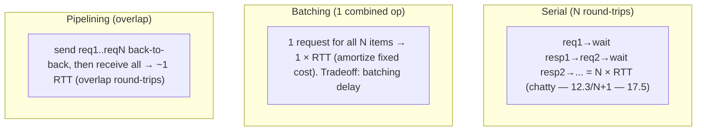
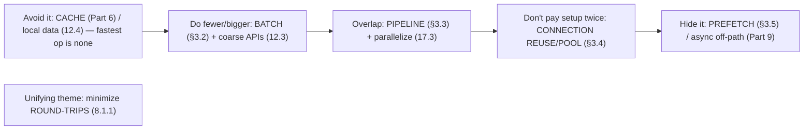

# Lesson 17.4 — Reducing Latency: Batching, Pipelining, Prefetching, Connection Reuse

> Part 17: Performance Engineering · Difficulty: 🟡🔴
>
> **Prerequisites:** [3.1.3 TCP], [3.3.4 Connection Management], [4.1.1 Memory Hierarchy], [Part 6 Caching], [17.2 Tail Latency].
> **Unlocks:** [17.5 Data-Layer Performance], [17.6 Efficiency], [Part 19 Interview Designs].

---

## 1. Learning Objectives

After this lesson you will be able to:

- Apply the core latency-reduction techniques: **batching**, **pipelining**, **prefetching**, **caching** (Part 6), and **connection reuse/pooling** (3.3.4).
- Explain the **fixed per-operation overhead** problem (network round-trips, connection setup, syscalls) and how batching/pipelining/reuse **amortize** it.
- Understand the **latency vs throughput** and **latency vs freshness** tradeoffs these techniques introduce.
- Reduce **round-trips** (the dominant latency cost in distributed systems — 8.1.1) via batching, pipelining, and avoiding chatty patterns (12.3).
- Combine these with caching (Part 6) and the tail-latency mitigations (17.2) into a latency-reduction toolkit.

---

## 2. Motivation — Amortize the fixed costs, avoid the round-trips

Once you've found the bottleneck (17.1) and understood the tail (17.2), you need **techniques to actually reduce latency**. Many of the biggest wins come from attacking a single culprit: **fixed per-operation overhead**. Every network call pays a **round-trip time** (RTT — often the dominant cost — 8.1.1/1.1.3), every new connection pays **setup cost** (TCP handshake + TLS — 3.1.3/3.2.3), every syscall/DB query has fixed overhead. When you do these **one at a time, many times** (the chatty anti-pattern — 12.3), you pay that fixed cost **repeatedly**, and it dominates. The core insight: **amortize the fixed cost over many operations** (batching, pipelining) and **avoid paying it at all** (connection reuse, caching, prefetching).

The techniques are a small, high-leverage toolkit: **batching** (combine many operations into one — pay the fixed cost once), **pipelining** (send many requests without waiting for each response — overlap the round-trips), **prefetching** (fetch data *before* it's needed — hide latency behind other work), **caching** (Part 6 — avoid the expensive operation entirely for repeat access), and **connection reuse/pooling** (3.3.4 — avoid repeated connection-setup cost). Each also introduces **tradeoffs** — batching trades latency-per-item for throughput (and adds a batching delay); prefetching wastes work if the prediction is wrong; caching trades freshness for speed. This lesson develops the latency-reduction toolkit and its tradeoffs — the "how to make it faster" complement to 17.1/17.2's "how to find what's slow."

---

## 3. Theory — From first principles

### 3.1 The fixed-per-operation-overhead problem

`[CS]` Many operations have a **large fixed cost** paid **regardless of payload size** `[CS]`:
- **Network round-trip (RTT):** every request-response pays the network latency (often ms — 1.1.3/8.1.1) — the **dominant cost** for small operations across a network (the data transfer is trivial vs the round-trip).
- **Connection setup:** a new TCP connection = handshake (3.1.3); +TLS = more round-trips (3.2.3) → **expensive** per connection.
- **Syscall / DB query / disk I/O:** fixed per-operation overhead (context switch, query parsing/planning — 5.3.2, disk seek — 4.1.1).
- `[BP]` **The killer pattern:** doing these **one-at-a-time, N times** (chatty — 12.3, the **N+1 problem** — 17.5) pays the fixed cost **N times** → latency ≈ N × fixed cost, dominating. **The fix: pay the fixed cost fewer times** — amortize (batch/pipeline — §3.2/3.3) or avoid (reuse/cache/prefetch — §3.4/3.5/Part 6).

### 3.2 Batching — pay the fixed cost once

`[CS]` **Batching** = combining **many operations into a single request/operation** → pay the fixed overhead **once** for the whole batch `[CS]`:
- Examples: a **bulk API** (fetch 100 items in one call instead of 100 calls), **batch DB insert/query** (one query for many rows — fixes N+1 — 17.5), **batched writes** (buffer + flush together — 4.1.1), **batched messages** (Part 9).
- `[BP]` **Wins:** amortizes fixed cost (RTT, query overhead) over many items → **dramatically fewer round-trips** → much lower total latency + higher throughput.
- **The tradeoff** `[BP]`: **latency-per-item vs efficiency** — to batch, you may **wait to accumulate** items (a batching window/delay) → the first item waits longer. **Micro-batching** (small time/size window) balances this. Also, **bigger batches = more throughput but more per-batch latency + memory**. Tune batch size/window to the latency budget (SLO — 14.1).

### 3.3 Pipelining — overlap the round-trips

`[CS]` **Pipelining** = sending **multiple requests without waiting for each response**, then collecting responses → **overlap** the round-trips instead of serializing them `[CS]`:
- Contrast **serial** (send req1 → wait for resp1 → send req2 → ...): latency = N × RTT. **Pipelined:** send req1, req2, ..., reqN back-to-back, then receive responses → latency ≈ **1 RTT** (+ processing) for all N (the round-trips overlap).
- Examples: **HTTP/2 multiplexing** (3.2.2 — many requests on one connection concurrently), **Redis pipelining** (6.6 — send many commands, read many replies), **DB statement pipelining**.
- `[BP]` **Wins:** collapses N sequential round-trips into ~1 → huge latency reduction for chatty sequences. **vs batching:** batching = **one combined operation** (needs server-side bulk support); pipelining = **many separate operations, overlapped** (works when responses are independent + order-preserved). Both cut the round-trip cost.
- **Caveat:** pipelining needs **independent** requests (or careful ordering); head-of-line blocking (3.1.3/3.2.2) can still bite if one response stalls the pipeline (HTTP/2 over TCP; HTTP/3/QUIC fixes it — 3.1.5).

### 3.4 Connection reuse / pooling — avoid setup cost

`[CS]` **Connection reuse (keep-alive) + pooling** (3.3.4) = **reuse** existing connections instead of creating a new one per request → avoid repeated **connection-setup cost** (§3.1) `[CS]`:
- **Keep-alive:** hold a connection open across multiple requests (HTTP keep-alive, persistent connections — 3.2.1/3.3.4) → amortize the handshake/TLS setup over many requests.
- **Connection pooling:** maintain a **pool of ready connections** (to a DB — 5.4.2, a service, a cache) → borrow-and-return instead of connect-per-request → avoid setup latency + limit connection count (Little's Law sizing — 7.7/17.3).
- `[BP]` **Wins:** eliminates repeated handshake/TLS round-trips (a major latency + CPU saver — connection setup is expensive — 3.1.3/3.2.3). **Essential** — connect-per-request is a common, costly mistake (3.3.4). Also enables pipelining/multiplexing (§3.3) on the reused connection.
- **Sizing** (7.7/3.3.4): pool size via Little's Law (concurrency = throughput × latency); too small → queueing; too large → resource exhaustion + downstream overload (5.4.2/13.5).

### 3.5 Prefetching + caching — avoid/hide the cost

`[CS]` Two more techniques `[CS]`:
- **Prefetching:** fetch data **before it's needed** (predict + load ahead) → **hide** the latency behind other work, so it's ready when needed. Examples: CPU/OS **prefetch** (4.1.1 — read-ahead), **prefetch next page** of results, warm a cache before a spike (Part 6). `[BP]` **Tradeoff:** wasted work + resources if the prediction is **wrong** (fetched data never used) → prefetch only when the prediction is reliable + the cost is acceptable.
- **Caching** (Part 6 — the highest-leverage latency tool): **store the result** of an expensive operation so **repeat access is fast** (memory vs recompute/re-fetch) → avoid the expensive operation entirely for cache hits (`T_avg` improves with hit ratio — 6.1). `[BP]` **Tradeoff:** **freshness/staleness** (6.5) + invalidation complexity (6.5) + memory. The single biggest latency win when there's locality/reuse (6.1). (See Part 6 for depth.)
- `[BP]` **Prefetch** hides latency by doing work early; **cache** avoids the work by remembering results — both attack the same goal (don't pay the full cost at request time), with the tradeoffs of wasted prefetch and stale cache.

### 3.6 Reduce round-trips + chattiness (the unifying theme)

`[BP]` The unifying principle across these techniques: **minimize round-trips** (8.1.1 — the dominant distributed latency cost) `[BP]`:
- **Chatty patterns** (many small round-trips — 12.3, N+1 — 17.5) are the enemy → **batch** (§3.2), **pipeline** (§3.3), or **redesign** the API to be **coarse-grained** (fewer, richer calls — 12.3) / aggregate (BFF — 12.6, API composition — 12.4).
- **Move data closer** (avoid the round-trip): caching (Part 6), **local replicas / CQRS read models** (12.4 — answer locally instead of a remote call), CDN/edge (3.3.3).
- **Reuse connections** (§3.4) to avoid setup round-trips.
- **Overlap** what you can't eliminate: pipelining (§3.3), parallelizing independent calls (17.3/17.2 critical path), async off-path work (Part 9).
- `[BP]` **The mental model:** every round-trip costs (RTT); **the fastest operation is one you don't do** (cache), the next-fastest is **many-in-one** (batch) or **overlapped** (pipeline), and you should **never pay setup twice** (reuse). Attack round-trips first.

### 3.7 Putting it together — the latency-reduction toolkit

`[BP]` Applied after finding the bottleneck (17.1):
- **Avoid the operation:** **cache** (Part 6 — highest leverage where there's reuse) + **local data** (12.4).
- **Do fewer, bigger operations:** **batch** (§3.2 — amortize fixed cost; fixes N+1 — 17.5) + coarse-grained APIs (12.3).
- **Overlap operations:** **pipeline** (§3.3) + **parallelize** independent work (17.3, off the critical path — 17.2).
- **Don't pay setup repeatedly:** **connection reuse/pooling** (§3.4, 3.3.4).
- **Hide latency:** **prefetch** (§3.5) where prediction is reliable; async off-path (Part 9).
- **Mind the tradeoffs** (§3.2/3.5): batching delay (latency-per-item), prefetch waste, cache staleness — tune to the SLO (14.1).
- `[BP]` **Always measure** (17.1) — apply to the **bottleneck** on the **critical path** (17.2), and re-measure. The unifying win is **fewer round-trips** (§3.6).

---

## 4. Visual Intuition

### Batching + pipelining vs serial (amortize/overlap round-trips)

### The latency-reduction hierarchy

---

## 5. Real-World Analogy

Think of **running errands across town** — where each **trip** is expensive (the drive/round-trip), regardless of how much you carry.

- **The fixed-cost problem:** driving to the store takes **30 minutes round-trip** whether you buy **one item or twenty**. If you make **twenty separate trips for twenty items**, you waste **10 hours** — the **fixed trip cost** dominates, not the shopping. This is **chatty round-trips** (N × RTT).
- **Batching = one big shopping trip:** instead, make a **list and buy all twenty items in one trip** — pay the 30-minute drive **once**. Massive saving. The **tradeoff:** you have to **wait until you've accumulated** the whole list before going (batching delay) — if you need one item **right now**, batching makes *that* item wait.
- **Pipelining = send multiple orders without waiting for each:** if you're **phoning in orders** to several shops, you don't **call shop 1, wait for it to finish, then call shop 2**. You **fire off all the calls back-to-back** and **collect the results as they come** — overlapping the "wait" times. Twenty sequential calls that would take twenty round-trips now take about **one round-trip's worth** of waiting.
- **Connection reuse = keep the car running / stay on the line:** the worst waste is **re-parking, locking, and re-starting the car for every single item** (connection setup — handshake + TLS). Instead, **keep the engine running** (keep-alive) or **keep a fleet of cars warmed up in the driveway** (connection pool) so you never pay the start-up cost repeatedly.
- **Prefetching = buy it before you run out:** noticing you're **about to run low on milk**, you buy it on **this** trip **before** you actually need it — so when you need it, it's **already in the fridge** (latency hidden). The **risk:** if you guessed wrong (you don't end up needing it), the milk **spoils** (wasted work) — so prefetch only when you're **confident** you'll need it.
- **Caching = keep it in the pantry:** the ultimate win is **not making the trip at all** — keep frequently-used items **in your pantry** (cache) so repeat needs are **instant**. The **tradeoff:** pantry items can **go stale** (freshness), and you must **restock/replace** them (invalidation). But for anything you use often, the pantry beats a trip to the store every time.
- **The theme:** every **trip to town** (round-trip) is expensive — so **don't go if it's in the pantry** (cache), **buy everything in one trip** (batch), **overlap your calls** (pipeline), and **never re-start the car each time** (reuse).

---

## 6. Industry Example

- **Batch APIs / bulk operations** `[CONV]`: fetching/writing many items in one call to amortize round-trips + fix N+1 (§3.2, 17.5). *(Representative.)*
- **HTTP/2 multiplexing + Redis pipelining** `[CONV]`: overlapping many requests on one connection (§3.3, 3.2.2/6.6). *(Representative.)*
- **Connection pooling (DB/HTTP) + keep-alive** `[CONV]`: reusing connections to avoid handshake/TLS setup (§3.4, 3.3.4/5.4.2). *(Representative.)*
- **Prefetching / read-ahead** `[CONV]`: CPU/OS prefetch (4.1.1), prefetching next results, cache warming (§3.5, Part 6). *(Representative.)*
- **Caching + CDN/edge + local replicas** `[CONV]`: avoiding the expensive operation/round-trip entirely (§3.5/3.6, Part 6/3.3.3/12.4). *(Representative.)*

---

## 7. Implementation Details

- **Find the bottleneck first** (17.1), then apply to the **critical path** (17.2); re-measure.
- **Cache** (Part 6) where there's reuse/locality — the highest-leverage latency win; use **local data/CQRS read models** (12.4) to avoid remote calls.
- **Batch** (§3.2): bulk APIs, batch DB queries (fix N+1 — 17.5), batched writes/messages; tune batch size/window to the latency budget (SLO — 14.1) — micro-batching for low-latency needs.
- **Pipeline** (§3.3): HTTP/2 multiplexing (3.2.2), Redis/DB pipelining — for independent overlappable requests; watch head-of-line blocking (HTTP/3/QUIC — 3.1.5).
- **Reuse connections** (§3.4, 3.3.4): keep-alive + connection pools (DB — 5.4.2, services, cache); size pools via Little's Law (7.7); never connect-per-request.
- **Prefetch** (§3.5) where prediction is reliable + cost acceptable (read-ahead, next-page, cache warming); avoid wasteful speculative fetches.
- **Reduce round-trips/chattiness** (§3.6, 12.3): coarse-grained APIs, aggregation (BFF/API composition — 12.6/12.4), move data closer (CDN — 3.3.3).
- **Parallelize + async off-path** (17.2/17.3, Part 9) what you can't eliminate.

---

## 8. Advantages

- **Batching:** amortizes fixed cost → far fewer round-trips, higher throughput (§3.2).
- **Pipelining:** collapses N sequential round-trips into ~1 (§3.3).
- **Connection reuse:** eliminates repeated handshake/TLS setup (latency + CPU) (§3.4).
- **Prefetching:** hides latency behind other work (§3.5).
- **Caching:** avoids the expensive operation entirely (highest leverage) (§3.5, Part 6).
- **Round-trip reduction:** attacks the dominant distributed latency cost (§3.6, 8.1.1).

---

## 9. Disadvantages / costs

- **Batching delay:** latency-per-item increases (accumulation window); memory for buffers (§3.2).
- **Pipelining:** needs independent requests; head-of-line blocking risk (§3.3, 3.2.2).
- **Connection pools:** sizing tricky; a pool is a shared resource/bottleneck (§3.4, 5.4.2).
- **Prefetch waste:** wrong predictions waste work/resources (§3.5).
- **Cache staleness + invalidation complexity** (§3.5, 6.5).
- **Complexity:** all add code/operational complexity — apply where they pay off (17.1).

---

## 10. When NOT to / cautions

- **Don't batch latency-critical single operations** — the batching delay hurts (§3.2); use micro-batching or skip.
- **Don't pipeline dependent/ordered requests** naively — correctness/HoL issues (§3.3).
- **Don't connect-per-request** — reuse/pool (§3.4).
- **Don't prefetch on unreliable predictions** — wasted work (§3.5).
- **Don't cache without an invalidation/freshness strategy** (§3.5, 6.5).
- **Don't optimize a non-bottleneck / off-critical-path** operation (§3.7, 17.1/17.2).

---

## 11. Common Mistakes

1. **Chatty round-trips / N+1** — many small calls instead of batching (§3.1/3.2, 17.5).
2. **Connect-per-request** — paying handshake/TLS setup every time (§3.4, 3.3.4).
3. **Serial dependent calls** where pipelining/parallelizing would overlap (§3.3, 17.2).
4. **Over-batching** — huge batches → high per-item latency + memory (§3.2).
5. **Speculative prefetch waste** — wrong predictions burn resources (§3.5).
6. **Caching without invalidation** — stale data bugs (§3.5, 6.5).
7. **Undersized/oversized connection pools** — queueing or exhaustion (§3.4, 7.7).
8. **Optimizing off the critical path** — no latency gain (§3.7, 17.1/17.2).

---

## 12. Interview Questions

**🟢 Easy**
- Why is a network round-trip often the dominant latency cost, and how does batching help?
- Why reuse connections instead of creating one per request?

**🟡 Medium**
- What's the difference between batching and pipelining, and when do you use each?
- What are the tradeoffs of batching (latency-per-item) and prefetching (wasted work)?

**🔴 Hard**
- How do these techniques (batch/pipeline/reuse/cache/prefetch) all reduce round-trips, and why are round-trips the key target (8.1.1)?
- How do you size a connection pool (Little's Law — 7.7), and what happens if it's too small or too large?

**⚫ Staff+**
- A user-facing endpoint is slow due to chatty backend calls (N+1) and per-request connections. Diagnose (17.1) and design the fix: batching, connection pooling, caching/local data, and parallelization — measured on the tail (17.2).
- Design the latency-reduction strategy for a high-fan-out request (17.2): reduce round-trips (batch/coarse APIs), overlap (pipeline/parallelize), avoid (cache/local replicas), and the tradeoffs each introduces.

---

## 13. Production Pitfalls

- **N+1 latency:** a page made one query per item (N+1) instead of one batch query → slow + DB overload (§3.1/3.2, 17.5).
- **Connect-per-request cost:** creating a new TLS connection per request added huge latency + CPU (§3.4, 3.2.3).
- **Over-batching delay:** a large batching window added unacceptable latency to individual requests (§3.2).
- **Pipeline HoL blocking:** one slow response stalled the whole HTTP/2 pipeline over TCP (§3.3, 3.1.5).
- **Prefetch waste:** aggressive speculative prefetching burned bandwidth/resources on unused data (§3.5).
- **Cache staleness bug:** cached data went stale with no invalidation → users saw wrong data (§3.5, 6.5).
- **Pool exhaustion:** an undersized connection pool queued requests under load (§3.4, 7.7/5.4.2).

---

## 14. Optimization Techniques

- **Cache + local data/CQRS** — avoid the operation entirely (highest leverage) (§3.5, Part 6/12.4).
- **Batch (amortize fixed cost) + coarse-grained APIs** — fewer round-trips, fix N+1 (§3.2/3.6, 17.5).
- **Pipeline (HTTP/2, Redis) + parallelize independent calls** — overlap round-trips (§3.3, 17.2/17.3).
- **Connection reuse/pooling (keep-alive)** — never pay setup twice; size via Little's Law (§3.4, 3.3.4/7.7).
- **Prefetch where predictable** — hide latency (§3.5).
- **Move data closer (CDN/edge/local replica)** — cut the round-trip (§3.6, 3.3.3/12.4).
- **Tune tradeoffs to the SLO** (batch window, prefetch aggressiveness, cache TTL — 14.1/6.5) (§3.7).

---

## 15. Summary

After finding the bottleneck (17.1) and understanding the tail (17.2), you reduce latency with a small, high-leverage toolkit — much of which attacks one culprit: **fixed per-operation overhead**. Every network call pays a **round-trip time (RTT — often the dominant cost — 8.1.1/1.1.3)**, every new connection pays **setup** (TCP handshake + TLS — 3.1.3/3.2.3), and every syscall/DB query has fixed overhead — so doing operations **one-at-a-time, N times** (the **chatty** anti-pattern — 12.3, the **N+1** problem — 17.5) pays that fixed cost **N times** and dominates. The fixes: **amortize** the fixed cost (batch/pipeline) or **avoid** it (reuse/cache/prefetch). **Batching** combines **many operations into one** (bulk API, batch query — fixing N+1, batched writes/messages) → pays the fixed cost **once** → far fewer round-trips + higher throughput, at the tradeoff of **latency-per-item** (a batching-window delay — tune with micro-batching to the SLO — 14.1). **Pipelining** sends **many requests without waiting for each response** and collects them → **overlaps** the round-trips (N sequential RTTs collapse to ~1 — HTTP/2 multiplexing — 3.2.2, Redis pipelining — 6.6), for **independent** requests (watch head-of-line blocking — HTTP/3/QUIC fixes it — 3.1.5). **Connection reuse (keep-alive) + pooling** (3.3.4) **avoid repeated connection-setup cost** by reusing open connections (essential — connect-per-request is a common costly mistake; pool-sized via Little's Law — 7.7/17.3, too small → queueing, too large → exhaustion — 5.4.2). **Prefetching** fetches data **before it's needed** to **hide** latency behind other work (read-ahead — 4.1.1, next-page, cache warming), at the tradeoff of **wasted work if the prediction is wrong**. **Caching** (Part 6 — the highest-leverage tool where there's reuse) **avoids the expensive operation entirely** for hits, at the tradeoff of **staleness + invalidation complexity** (6.5). The **unifying theme** is **minimizing round-trips** (8.1.1): the **fastest operation is one you don't do** (cache/local data — 12.4), the next is **many-in-one** (batch) or **overlapped** (pipeline/parallelize — 17.2/17.3), and you should **never pay setup twice** (reuse) — attack chattiness with **coarse-grained APIs** (12.3), **aggregation** (BFF/API composition — 12.6/12.4), and **moving data closer** (CDN/edge — 3.3.3, local replicas — 12.4). Applied to the **bottleneck on the critical path** (17.1/17.2), with tradeoffs tuned to the SLO and gains confirmed by re-measurement, this toolkit — **avoid (cache) → do fewer/bigger (batch) → overlap (pipeline/parallelize) → don't pay setup twice (reuse) → hide (prefetch)** — is how you actually make systems faster.

---

## 16. Revision Notes (flashcard-ready)

- **Q:** The core latency culprit? **A:** Fixed per-operation overhead — RTT, connection setup, query/syscall overhead — paid N times in chatty patterns (N × cost).
- **Q:** Batching? **A:** Combine many operations into one → pay the fixed cost once (bulk API/query, fixes N+1); tradeoff = latency-per-item (batching delay).
- **Q:** Pipelining? **A:** Send many requests without waiting for each → overlap round-trips (N RTTs → ~1); needs independent requests (HTTP/2, Redis).
- **Q:** Batching vs pipelining? **A:** Batching = one combined op (needs bulk support); pipelining = many separate ops overlapped.
- **Q:** Connection reuse/pooling? **A:** Keep-alive + connection pools avoid repeated handshake/TLS setup; never connect-per-request; size via Little's Law.
- **Q:** Prefetching? **A:** Fetch before needed to hide latency; tradeoff = wasted work if prediction wrong.
- **Q:** Caching? **A:** Avoid the expensive operation entirely for repeat access (highest leverage); tradeoff = staleness/invalidation (Part 6).
- **Q:** Unifying theme? **A:** Minimize round-trips (8.1.1) — avoid (cache), do fewer/bigger (batch), overlap (pipeline), never pay setup twice (reuse).
- **Q:** Chatty/N+1 fix? **A:** Batch + coarse-grained APIs + aggregation + move data closer.
- **Q:** Where to apply? **A:** The bottleneck on the critical path (17.1/17.2); tune tradeoffs to the SLO; re-measure.

---

## 17. Further Reading + Knowledge-Graph Links

**Foundations (in-platform):**
- **[3.3.4 Connection Management]** — keep-alive, pooling, backpressure.
- **[3.1.3 TCP]** / **[3.2.3 TLS]** — connection-setup cost.
- **[4.1.1 Memory Hierarchy]** — prefetch/read-ahead.
- **[Part 6 Caching]** — the highest-leverage latency tool.
- **[17.2 Tail Latency]** — critical path, parallelization.

**Unlocks / next:**
- **[17.5 Data-Layer Performance]** — N+1, query tuning.
- **[17.6 Efficiency]** — cost/performance.
- **[12.3 Communication]** / **[12.4 Data]** — coarse APIs, local replicas.

**External (canonical):**
- Gregg, *Systems Performance* — I/O + latency reduction. *(Representative.)*
- HTTP/2 & HTTP/3 (multiplexing/HoL) references. *(Representative.)*

> **Knowledge-graph:** `8.1.1 round-trips` + `3.3.4 connection mgmt` + `Part 6 caching` → **`17.4 latency reduction (batch/pipeline/prefetch/reuse/cache)`** → minimize round-trips → `17.5 data layer` / `17.6 efficiency`.
