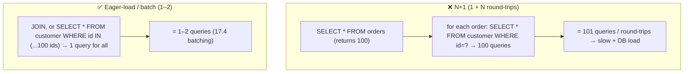
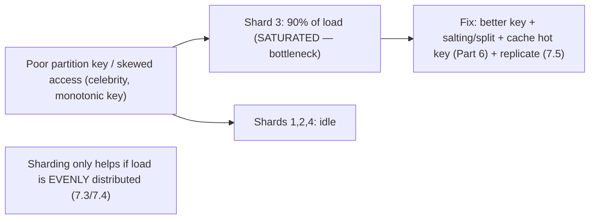

# Lesson 17.5 — Data-Layer Performance: Query Tuning, Hot Partitions, N+1

> Part 17: Performance Engineering · Difficulty: 🔴
>
> **Prerequisites:** [4.2.5 Indexing], [5.3.2 Query Execution & Optimization], [7.4 Hotspots/Skew], [7.6 DB Bottleneck], [17.1 Methodology], [17.4 Batching].
> **Unlocks:** [17.6 Efficiency], [Part 18 Case Studies], [Part 19 Interview Designs], [Part 20 Capstone].

---

## 1. Learning Objectives

After this lesson you will be able to:

- Explain why **the database is usually the bottleneck** (7.6) and why data-layer performance is the highest-leverage optimization target.
- Diagnose and fix **slow queries**: missing/wrong **indexes** (4.2.5), full scans, bad query plans (5.3.2), reading query plans (EXPLAIN).
- Identify and eliminate the **N+1 query problem** — the pervasive chatty-query anti-pattern (17.4).
- Diagnose and mitigate **hot partitions/keys** (7.4) — skew that overloads one shard/node.
- Apply data-layer techniques: indexing, denormalization (5.1.2), caching (Part 6), read replicas (7.5), connection pooling (5.4.2), and query/schema design.

---

## 2. Motivation — The database is where performance goes to die

Across almost every system, when you apply the measure-first methodology (17.1), the bottleneck lands in the **same place: the data layer** (7.6). The database is the **usual binding constraint** because it's the **hardest tier to scale** (7.6 — stateful, often non-elastic — 13.5), and it's where **small mistakes have huge consequences**: a missing index turns a millisecond lookup into a full-table scan; a chatty ORM turns one page load into hundreds of queries (**N+1**); a poor partition key funnels all traffic to **one shard** (**hot partition** — 7.4). Because the data layer is the bottleneck, **data-layer performance is the highest-leverage optimization** — fixing a slow query or a hot partition often yields more than any amount of application tuning.

Three problems dominate. First, **slow queries** — usually from **missing/wrong indexes** (4.2.5) causing full scans, or bad **query plans** (5.3.2); the fix is understanding what the query optimizer does and giving it the right indexes (read the plan with EXPLAIN). Second, the **N+1 query problem** — the pervasive anti-pattern where fetching N items triggers **1 query + N more** (one per item) instead of a single batch query (17.4) — a classic chatty-round-trip disaster (17.4/8.1.1). Third, **hot partitions/keys** — skew (7.4) that overloads **one** shard while others idle, defeating horizontal scaling (7.3). This lesson develops data-layer performance — query tuning, N+1, hot partitions, and the toolkit (indexing, caching, replicas, denormalization) — the most impactful area of performance work, since the database is where most bottlenecks live.

---

## 3. Theory — From first principles

### 3.1 Why the database is the bottleneck

`[CS]` The data layer is the **usual binding constraint** (7.6) `[CS]`:
- **Hardest to scale** (7.6): stateful, often a **single primary** for writes, non-elastic (13.5 — can't autoscale like stateless app tiers); scaling it (replicas/sharding — 7.5/7.3) is complex + slow.
- **Everything funnels through it:** most requests touch the DB → it's on the critical path (17.2) for almost everything.
- **Small mistakes = huge cost:** a missing index (§3.2), N+1 (§3.4), or hot partition (§3.5) can degrade the whole system.
- `[BP]` So (17.1) the bottleneck is **usually here** → data-layer performance is the **highest-leverage** target. **Optimize the data layer first** (after measuring — 17.1).

### 3.2 Slow queries: indexes and query plans

`[CS]` The most common data-layer problem: **slow queries**, usually from **missing/wrong indexes** or **bad plans** `[CS]`:
- **Missing index → full table scan:** without an index (4.2.5) on a filtered/joined column, the DB **scans every row** (O(n)) instead of an index lookup (O(log n)) → catastrophically slow at scale. **The #1 query fix: add the right index.**
- **The query optimizer + plans** (5.3.2): the DB's optimizer chooses an **execution plan** (which indexes, join order/algorithm, scan vs seek) based on statistics. A **bad plan** (stale stats, non-sargable predicates, wrong join) → slow.
- **Read the plan** (`EXPLAIN` / `EXPLAIN ANALYZE`): shows what the DB **actually does** (scans vs index seeks, row estimates, join methods, actual times) → **measure, don't guess** (17.1). Look for full scans, bad estimates, expensive joins.
- **Index design** (4.2.5): index the columns you **filter/join/sort** on; **composite indexes** for multi-column queries (order matters); **covering indexes** (include selected columns → index-only scan). But **indexes cost writes + storage** (RUM tradeoff — 4.2.4) → don't over-index.
- `[BP]` **Fix slow queries:** EXPLAIN → find the full scan / bad plan → add/fix the index (or rewrite the query, update stats) → re-measure. Understand the optimizer (5.3.2), don't fight it.

### 3.3 More query issues

`[BP]` Beyond indexes `[BP]`:
- **Non-sargable predicates:** functions/operations on the indexed column (`WHERE UPPER(name)=...`) prevent index use → rewrite to be **index-friendly**.
- **`SELECT *` / over-fetching:** reading more columns/rows than needed → wasted I/O; select only what's needed; **paginate** large results.
- **Inefficient joins / cartesian products:** wrong join conditions/order → huge intermediate results.
- **Lock contention** (5.2.5): queries blocking each other → latency/throughput loss (17.3 contention); use appropriate isolation (5.2.2) + short transactions.
- **Large scans/aggregations** on the primary: offload to **read replicas** (7.5), **materialized views** (12.4), or a **cache** (Part 6) / analytics store.
- `[BP]` **Measure with EXPLAIN + slow-query logs** (17.1), fix the biggest offenders (Amdahl — 17.1).

### 3.4 The N+1 query problem

`[CS]` A **pervasive, high-impact anti-pattern**: **N+1 queries** `[CS]`:
- **The pattern:** to display a list of N items with related data, the code runs **1 query** to fetch the N items, then **N more queries** (one per item) to fetch each item's related data → **1 + N** queries instead of 1 or 2. Common with **ORMs** (lazy loading fires a query per accessed relation).
- **Why it's terrible:** each query is a **round-trip** (17.4/8.1.1) with fixed overhead → N+1 round-trips → latency ≈ N × RTT + DB load ≈ N queries. A list of 100 items = **101 queries** for what should be **1–2**.
- **The fix** `[BP]`: **batch/eager-load** the related data — **one query with a JOIN**, or a **second batched query** (`WHERE id IN (...)` for all N — 17.4 batching), or ORM **eager-loading / prefetch** (`include`/`join fetch`). Turn **1+N round-trips into 1–2**.
- `[BP]` **N+1 is the #1 ORM/data-access performance bug** — it hides in "clean-looking" code (accessing a relation in a loop). **Detect it** (slow-query logs, query counts per request, tracing — 16.4), **fix by batching/eager-loading** (17.4). Watch for it constantly.

### 3.5 Hot partitions / hot keys

`[CS]` In a **sharded/partitioned** system (7.3), **skew** creates **hot partitions/keys** — one shard/node gets disproportionate load `[CS]`:
- **The problem** (7.4): a poor **partition key** or **skewed access** funnels traffic to **one partition** (a celebrity user, a popular product, a monotonically-increasing key → all writes to the last shard) → that shard is **saturated** while others **idle** → the hot shard becomes the bottleneck, defeating horizontal scaling (7.3).
- **Detect:** per-shard metrics (16.2) showing imbalanced load/latency; the USE saturation lens (17.1) on individual shards; hot-key detection.
- **Mitigations** (7.4): 
  - **Better partition key** — choose a high-cardinality, evenly-distributed key (7.3); avoid monotonic keys for writes.
  - **Salting / key splitting** — split a hot key across sub-keys (7.4).
  - **Caching the hot key** (Part 6) — absorb reads of a celebrity item in cache (6.7 hot-key handling).
  - **Replicating the hot data** — serve reads from replicas (7.5).
  - **Isolating** the hot tenant/key (dedicated resources — 7.4).
- `[BP]` **Hot partitions defeat sharding** — the key insight (7.3/7.4): sharding only helps if load is **evenly distributed**; a hot partition means you scaled out but one shard still bottlenecks. **Design the partition key for even distribution + handle inevitable hot keys** (caching/replication/salting).

### 3.6 The data-layer optimization toolkit

`[BP]` The techniques to relieve the data-layer bottleneck (in cost-order — 7.6) `[BP]`:
- **Indexing** (§3.2, 4.2.5): the #1 query fix — right indexes for filters/joins/sorts; covering indexes; don't over-index (write cost).
- **Fix N+1 + batch** (§3.4, 17.4): eager-load/JOIN/batch queries.
- **Caching** (Part 6): the highest-leverage relief — cache hot reads (cache-aside — 6.3) → offload the DB (6.1); handle stampede/hot keys (6.7).
- **Read replicas** (7.5/5.4.2): offload **reads** from the primary (replication lag tradeoff — 10.2).
- **Denormalization / query-driven schema** (5.1.2): pre-join/duplicate to avoid expensive joins at read time; materialized views / CQRS read models (12.4).
- **Connection pooling** (5.4.2): reuse connections (17.4/3.3.4); size via Little's Law (7.7).
- **Partitioning/sharding** (7.3) for write scale + data size — with a good key (§3.5).
- **Query/schema tuning** (§3.2/3.3, 5.3.2): rewrite queries, update stats, paginate, avoid `SELECT *`.
- `[BP]` **Order (7.6):** measure (17.1) → index/query fixes + fix N+1 (cheap, huge) → cache + replicas (offload) → denormalize/materialize → shard (last, complex). Relieve the bottleneck at the **cheapest effective level first**.

### 3.7 Putting it together — data-layer performance

`[BP]` The workflow:
- **Measure** (17.1): the bottleneck is usually the DB (§3.1) — use slow-query logs, EXPLAIN, per-shard metrics, tracing (16.4), query-count-per-request (for N+1).
- **Fix slow queries** (§3.2/3.3): EXPLAIN → add/fix indexes, rewrite non-sargable/over-fetching queries, update stats.
- **Eliminate N+1** (§3.4): eager-load/JOIN/batch (17.4).
- **Handle hot partitions** (§3.5, 7.4): good partition key + caching/replication/salting for hot keys.
- **Offload + scale** (§3.6, cost-order — 7.6): cache (Part 6) → read replicas (7.5) → denormalize/materialize (5.1.2/12.4) → shard (7.3).
- **Re-measure** (17.1): confirm; the bottleneck moves.
- `[BP]` Because the DB is where most bottlenecks live (7.6), this is the **highest-ROI performance work** — a single index or N+1 fix or hot-key cache often beats weeks of app tuning.

---

## 4. Visual Intuition

### N+1 query problem + fix

### Hot partition (skew defeats sharding)

---

## 5. Real-World Analogy

Think of a **library** as the data layer — where most delays and bottlenecks actually happen.

- **The library is the bottleneck:** in a research building, the **researchers** (app servers) are easy to add more of, but there's **one central library** (the database) everyone depends on — and it's **hard to duplicate** (stateful). So when everything slows down, it's **usually the library** — the highest-leverage place to fix.
- **Missing index = no catalog, so you search every shelf:** asking for "books by author X" **without a card catalog** means the librarian **walks every shelf** (full table scan) — agonizingly slow. **Adding a catalog organized by author** (an index) turns it into an instant lookup. The **#1 fix** for a slow request is usually "**does the library have the right catalog for this question?**" — and you check by asking the librarian to **explain how they'd find it** (EXPLAIN).
- **N+1 = a separate trip for each book's details:** imagine you want **100 books plus each book's author bio**. The clumsy way: fetch the **list of 100 books** (1 trip), then make **100 separate trips to the desk**, one per book, to ask "what's this author's bio?" (**1 + 100 = 101 trips**). The smart way: hand the librarian **all 100 author names at once** and get all the bios in **one trip** (batch/eager-load — 1–2 trips). N+1 is making a **separate desk trip per item** when you could ask for everything at once — the pervasive, sneaky slowdown hiding in "loop over items and fetch details."
- **Hot partition = everyone crowding one branch:** the library system has **five branches** (shards) to spread the load — but if a **wildly popular book** (celebrity key) is only at **branch 3**, or everyone's requests keep going to the **newest branch** (monotonic key), then **branch 3 is mobbed** while the other four sit **empty** (hot partition). You "scaled out" to five branches but **one branch still bottlenecks**. Fixes: **distribute popular items across branches** (better key/salting), keep a **photocopy of the popular book at every branch** (cache/replicate the hot key). **Multiple branches only help if the crowd is spread evenly.**
- **The toolkit:** relieve the library **cheaply first** — add the **catalog** (index) and **stop making per-item trips** (fix N+1); keep **popular books at the front desk** (cache); open **reading-copy branches** (read replicas); **pre-compile popular reading lists** (denormalize/materialized views); and only as a last resort, **build more full branches** (shard) — because that's the most complex.

---

## 6. Industry Example

- **Missing-index full scans** `[CONV]`: the classic slow-query cause; EXPLAIN reveals it, an index fixes it (§3.2, 4.2.5/5.3.2). *(Representative.)*
- **N+1 in ORMs** `[CONV]`: lazy-loading relations in a loop → 1+N queries; fixed by eager-loading/batch (§3.4). *(Representative.)*
- **Hot partitions / hot keys** `[CONV]`: celebrity users / monotonic keys overloading one shard; salting + caching + replication (§3.5, 7.4). *(Representative.)*
- **Read replicas + caching to offload the primary** `[CONV]`: relieving the DB bottleneck (§3.6, 7.5/Part 6). *(Representative.)*
- **Materialized views / CQRS read models + denormalization** `[CONV]`: pre-joining to avoid expensive read-time joins (§3.6, 5.1.2/12.4). *(Representative.)*

---

## 7. Implementation Details

- **Measure the data layer** (17.1): slow-query logs, `EXPLAIN ANALYZE`, per-shard metrics (16.2), tracing (16.4), **query-count-per-request** (to catch N+1 — §3.4).
- **Fix slow queries** (§3.2/3.3): EXPLAIN → add/fix **indexes** (4.2.5 — filters/joins/sorts, composite, covering; don't over-index), rewrite **non-sargable/over-fetching** queries, paginate, update statistics.
- **Eliminate N+1** (§3.4): eager-load / JOIN / batch (`IN (...)`) / ORM prefetch — turn 1+N into 1–2 (17.4).
- **Handle hot partitions** (§3.5, 7.4): choose an even-distribution **partition key** (7.3, avoid monotonic for writes); **salt/split** hot keys; **cache** (Part 6/6.7) + **replicate** (7.5) hot data; isolate hot tenants.
- **Offload + scale in cost-order** (§3.6, 7.6): **cache** (Part 6, cache-aside — 6.3) → **read replicas** (7.5) → **denormalize/materialized views/CQRS** (5.1.2/12.4) → **shard** (7.3, last).
- **Connection pooling** (5.4.2/3.3.4/17.4) sized via Little's Law (7.7).
- **Re-measure** (17.1): confirm gains; the bottleneck moves.

---

## 8. Advantages (of data-layer optimization)

- **Highest ROI** — the DB is usually the bottleneck (7.6); fixes here beat app tuning (§3.1).
- **Indexes:** turn full scans into fast lookups — often the single biggest win (§3.2).
- **N+1 fix:** collapse 1+N queries into 1–2 → huge latency + DB-load reduction (§3.4).
- **Hot-key handling:** restores even distribution → sharding actually helps (§3.5).
- **Caching/replicas:** offload the primary bottleneck (§3.6, Part 6/7.5).
- **Denormalization/materialized views:** avoid expensive read-time joins (§3.6).

---

## 9. Disadvantages / costs

- **Indexes cost writes + storage** (RUM — 4.2.4); over-indexing hurts writes (§3.2).
- **Denormalization trades consistency/write-complexity for read speed** (5.1.2/12.4).
- **Read replicas add replication lag** (stale reads — 10.2) (§3.6, 7.5).
- **Caching adds staleness + invalidation complexity** (6.5) (§3.6).
- **Sharding is complex** (rebalancing, cross-shard queries, hot keys) (§3.5/3.6, 7.3).
- **N+1 hides in clean code** — hard to spot without measurement (§3.4).

---

## 10. When NOT to / cautions

- **Don't over-index** — write/storage cost; index what queries need (§3.2, 4.2.4).
- **Don't ignore N+1** — measure query-count-per-request; it hides in ORMs (§3.4).
- **Don't shard prematurely** — cache/replicas first (cheaper); shard only when needed (§3.6, 7.6).
- **Don't pick a poor partition key** — causes hot partitions (§3.5, 7.3).
- **Don't `SELECT *` / over-fetch** — read only what's needed (§3.3).
- **Don't fight the optimizer** — understand it (EXPLAIN), give it good indexes/stats (§3.2, 5.3.2).

---

## 11. Common Mistakes

1. **Missing indexes → full scans** (the #1 slow-query cause) (§3.2).
2. **N+1 queries** — 1+N instead of batch/eager-load (§3.4).
3. **Poor partition key → hot partitions** defeating sharding (§3.5, 7.3/7.4).
4. **Over-indexing** — slow writes + storage bloat (§3.2, 4.2.4).
5. **`SELECT *` / over-fetching / no pagination** (§3.3).
6. **Non-sargable predicates** preventing index use (§3.3).
7. **Sharding before caching/replicas** — premature complexity (§3.6, 7.6).
8. **Not measuring (no EXPLAIN / query counts)** — optimizing blind (§3.7, 17.1).

---

## 12. Interview Questions

**🟢 Easy**
- Why is the database usually the bottleneck?
- What is the N+1 query problem, and how do you fix it?

**🟡 Medium**
- How do you diagnose and fix a slow query (EXPLAIN, indexes, plans)?
- What is a hot partition, and why does it defeat horizontal scaling?

**🔴 Hard**
- How do indexes speed queries and what do they cost (RUM — 4.2.4)? When would a covering index / composite index help?
- How do you mitigate hot keys/partitions (partition-key choice, salting, caching, replication) — 7.4?

**⚫ Staff+**
- A page is slow due to data-layer issues (N+1, missing indexes, a hot partition). Diagnose (17.1 — slow-query logs, EXPLAIN, per-shard metrics, query counts) and design the fixes in cost-order (indexes/N+1 → cache/replicas → denormalize → shard).
- Design the data-layer performance strategy for a read-heavy system with a celebrity-user hot-key problem: indexing, caching (6.7), read replicas, partition-key design, and when to shard vs denormalize.

---

## 13. Production Pitfalls

- **Missing-index meltdown:** a query did full scans at scale → slow + DB overload (§3.2).
- **N+1 explosion:** a "clean" ORM loop fired hundreds of queries per page → latency + DB saturation (§3.4).
- **Hot-partition bottleneck:** a celebrity key / monotonic write key overloaded one shard while others idled (§3.5, 7.4).
- **Over-indexing write slowdown:** too many indexes crippled write throughput (§3.2, 4.2.4).
- **Replica-lag stale reads:** offloading to read replicas surfaced stale data (§3.6, 10.2/7.5).
- **Autoscale-into-DB:** app tier autoscaled into a maxed DB, worsening it (§3.1, 13.5/14.6).
- **`SELECT *` over-fetch:** pulling huge unused columns/rows wasted I/O (§3.3).

---

## 14. Optimization Techniques (cost-ordered — 7.6)

1. **Fix indexes + queries + N+1** (cheap, huge) — EXPLAIN-driven (§3.2/3.3/3.4).
2. **Cache hot reads** (Part 6, cache-aside — 6.3; hot-key handling — 6.7) — offload the DB (§3.6).
3. **Read replicas** (7.5/5.4.2) — offload reads (lag tradeoff — 10.2).
4. **Denormalize / materialized views / CQRS** (5.1.2/12.4) — avoid expensive read-time joins (§3.6).
5. **Connection pooling** (5.4.2/17.4) sized via Little's Law (7.7).
6. **Good partition key + hot-key mitigation** (salt/split/cache/replicate — 7.3/7.4) (§3.5).
7. **Shard** (7.3) — last, for write scale/data size, with an even key.

---

## 15. Summary

When you measure (17.1), the bottleneck **usually lands in the data layer** (7.6) — because the database is the **hardest tier to scale** (stateful, often a single write primary, non-elastic — 13.5), **everything funnels through it** (on the critical path — 17.2), and **small mistakes have huge consequences** — making data-layer performance the **highest-leverage** optimization. Three problems dominate. **Slow queries** are usually from **missing/wrong indexes** (4.2.5) causing **full table scans** (O(n) instead of O(log n) — the **#1 fix is the right index**) or **bad query plans** (5.3.2 — stale stats, non-sargable predicates, poor joins); diagnose by **reading the plan** (`EXPLAIN ANALYZE` — measure, don't guess — 17.1) to find scans/bad estimates, then **add/fix indexes** (filters/joins/sorts, composite, covering — but not over-indexing, which costs writes — RUM — 4.2.4), **rewrite** non-sargable/over-fetching (`SELECT *`) queries, and **paginate**. The **N+1 query problem** is the pervasive, sneaky anti-pattern where displaying N items runs **1 query + N more** (one per item — common with ORM lazy-loading in a loop) → **1+N round-trips** (17.4/8.1.1), so a 100-item list = 101 queries; **fix by eager-loading / JOIN / batch (`IN (...)`)** — turning 1+N into 1–2 (17.4 batching) — and **detect** it via query-count-per-request / slow-query logs / tracing (16.4) because it **hides in clean-looking code**. **Hot partitions/keys** are **skew** (7.4) in a sharded system (7.3) where a poor partition key or skewed access (a celebrity user, a **monotonic key** funneling all writes to one shard) **overloads one shard while others idle** — **defeating horizontal scaling** (sharding only helps if load is **evenly distributed**) — mitigated by choosing an **even-distribution partition key** (7.3), **salting/splitting** hot keys, **caching** the hot key (Part 6/6.7), **replicating** hot data (7.5), and **isolating** hot tenants. The **toolkit**, applied in **cost-order** (7.6) after measuring: **fix indexes/queries/N+1** (cheap, huge) → **cache** hot reads (Part 6 — the highest-leverage offload — 6.1) → **read replicas** (7.5 — offload reads, lag tradeoff — 10.2) → **denormalize / materialized views / CQRS** (5.1.2/12.4 — avoid expensive read-time joins) → **connection pooling** (5.4.2/17.4) → **shard** (7.3 — last, complex, with an even key). Because the database is where most bottlenecks live (7.6), this is the **highest-ROI performance work** — a single index, N+1 fix, or hot-key cache often beats weeks of application tuning — always measured (EXPLAIN, query counts, per-shard metrics), fixed at the cheapest effective level first, and re-measured (17.1).

---

## 16. Revision Notes (flashcard-ready)

- **Q:** Why is the DB usually the bottleneck? **A:** Hardest to scale (stateful, single write primary, non-elastic), everything funnels through it, small mistakes = huge cost → highest-leverage target.
- **Q:** #1 slow-query cause + fix? **A:** Missing index → full scan; fix by adding the right index (read the plan with EXPLAIN).
- **Q:** How to diagnose a slow query? **A:** EXPLAIN/EXPLAIN ANALYZE → find full scans, bad estimates, expensive joins; measure, don't guess.
- **Q:** Index cost? **A:** Writes + storage (RUM — 4.2.4) → don't over-index; index what queries filter/join/sort on.
- **Q:** N+1 query problem? **A:** Fetch N items → 1 query + N more (one per item) = 1+N round-trips; fix with eager-load/JOIN/batch (IN ...) → 1–2.
- **Q:** How to detect N+1? **A:** Query-count-per-request, slow-query logs, tracing — it hides in ORM loops.
- **Q:** Hot partition? **A:** Skew (celebrity/monotonic key) overloads one shard while others idle → defeats sharding (needs even distribution).
- **Q:** Hot-key mitigations? **A:** Better partition key, salting/splitting, cache the hot key (6.7), replicate (7.5), isolate.
- **Q:** Toolkit cost-order? **A:** Index/query/N+1 fix → cache → read replicas → denormalize/materialize → connection pool → shard (last).
- **Q:** Highest-ROI performance work? **A:** The data layer — an index/N+1/hot-key fix often beats weeks of app tuning.

---

## 17. Further Reading + Knowledge-Graph Links

**Foundations (in-platform):**
- **[4.2.5 Indexing]** — the #1 query fix.
- **[5.3.2 Query Execution & Optimization]** — the optimizer + plans (EXPLAIN).
- **[7.4 Hotspots/Skew]** & **[7.3 Sharding]** — hot partitions.
- **[7.6 DB Bottleneck]** — why the DB is the constraint + cost-order relief.
- **[7.5 Read Scaling]** / **[Part 6 Caching]** — offload techniques.
- **[17.4 Batching]** — the N+1 fix.

**Unlocks / next:**
- **[17.6 Efficiency]** — cost/performance of the data layer.
- **[Part 18 Case Studies]** / **[Part 19 Interview Designs]** / **[Part 20 Capstone]** — data-layer design at scale.

**External (canonical):**
- Use The Index, Luke (SQL indexing/performance). *(Representative.)*
- Database-specific query-optimization + EXPLAIN docs. *(Representative.)*

> **Knowledge-graph:** `7.6 DB bottleneck` + `4.2.5 indexing` + `7.4 hotspots` → **`17.5 data-layer performance (query tuning, N+1, hot partitions)`** → relief via `Part 6 caching` / `7.5 replicas` / `7.3 sharding` (cost-order) → `17.6 efficiency`.
