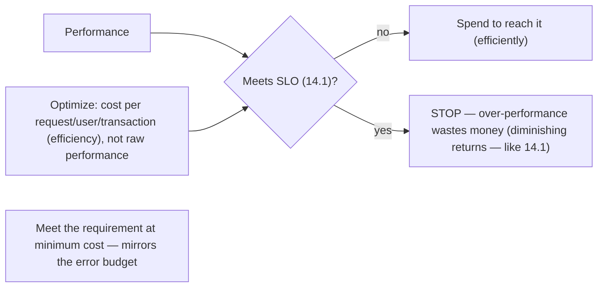
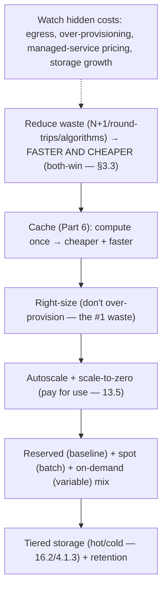

# Lesson 17.6 — Cost/Performance Tradeoffs and Efficiency Engineering

> Part 17: Performance Engineering · Difficulty: 🟡🔴
>
> **Prerequisites:** [1.2.3 Cost as First-Class], [1.1.5 Tradeoffs], [13.5 Autoscaling], [14.6 Capacity], [17.1 Methodology].
> **Unlocks:** [Part 18 Case Studies], [Part 19 Interview Designs], [Part 20 Capstone].

---

## 1. Learning Objectives

After this lesson you will be able to:

- Treat **cost as a first-class engineering metric** (1.2.3) — "cost per request/user/transaction" — and optimize **efficiency** (performance *per dollar*), not just raw performance.
- Explain the **performance ↔ cost** tradeoff and why "as fast as possible" and "as reliable as possible" are usually the **wrong** goals (diminishing returns — 14.1/1.1.5).
- Apply efficiency levers: **right-sizing**, **autoscaling/scale-to-zero** (13.5), **reserved/spot capacity**, **caching** (Part 6), **tiered storage** (16.2/4.1.3), and **egress/managed-service** cost awareness.
- Reason about **build vs buy** and **managed-service cost/lock-in** tradeoffs (1.2.3).
- Know **FinOps** basics: attributing, monitoring, and optimizing cloud spend as an engineering discipline.

---

## 2. Motivation — Fast enough, reliable enough, at the right cost

Performance work (17.1–17.5) implicitly assumes "faster is better" — but in the real world, **faster costs money**, and the goal is rarely "as fast as possible." It's **"fast enough to meet the requirement (SLO — 14.1) at the lowest reasonable cost."** **Cost** is a **first-class architectural characteristic** (1.2.3) that trades off against performance, reliability, and everything else (1.1.5), and in the cloud — where you **pay per resource per second** — inefficiency is **directly, continuously expensive**. A system that's twice as fast as it needs to be, or provisioned for 10× its peak, or re-fetching what it could cache, is **burning money** for no user benefit.

**Efficiency engineering** reframes performance as **performance per dollar**: the right metric isn't "requests per second" but **"cost per request"** (or per user, per transaction). This shifts the goal from maximizing performance to **maximizing efficiency** — meeting the SLO (14.1) while minimizing cost — which mirrors the **error-budget philosophy** (14.1: don't buy reliability you don't need) applied to performance and cost (don't buy performance/capacity you don't need). The levers are concrete: **right-sizing** (don't over-provision), **autoscaling + scale-to-zero** (13.5 — pay for what you use), **reserved/spot capacity**, **caching** (Part 6 — compute once), **tiered storage** (16.2/4.1.3 — hot/cold), and **awareness of hidden costs** (data egress, managed-service pricing, over-provisioning). And **FinOps** makes cost an **engineering discipline** — attributing spend, monitoring it, and optimizing it like any other metric. This lesson develops cost/performance tradeoffs and efficiency engineering — the capstone of Part 17 that ties performance back to the business (1.2.3), and the mindset for Parts 18–20.

---

## 3. Theory — From first principles

### 3.1 Cost as a first-class metric

`[CS]` **Cost is a first-class architectural characteristic** (1.2.3) that **trades off** against performance, reliability, scalability, etc. (1.1.5/1.2.4) `[CS]`:
- In the **cloud**, you **pay per resource per unit time** → inefficiency (idle capacity, wasted compute, redundant work) is **directly + continuously expensive** (unlike fixed-cost owned hardware).
- **The right metric: efficiency = performance per dollar** — "**cost per request / per user / per transaction**," not raw throughput. A system serving 2× the needed performance at 2× cost is **inefficient**, not "good."
- `[BP]` **Reframe the goal** (§3.2): not "maximize performance," but "**meet the SLO (14.1) at minimum cost**." Cost is an engineering **metric to optimize**, measured + attributed (FinOps — §3.6), and traded off deliberately (1.1.5).

### 3.2 "As fast/reliable as possible" is the wrong goal

`[CS]`/`[OPINION]` A recurring theme (14.1/1.1.5) applied to cost `[OPINION]`:
- **Diminishing returns:** each increment of performance/reliability costs **disproportionately more** (like each "nine" — 14.1) → optimizing **past the requirement** wastes money for **no user benefit** (users can't tell / don't need it — 14.1).
- **The right target is "enough":** meet the **SLO** (14.1: p99 < 200ms) at **minimum cost** — then **stop** (17.1 §3.6) and spend the savings/effort elsewhere. **Over-performance is as wasteful as under-performance is harmful.**
- `[BP]` This **mirrors the error budget** (14.1): just as you don't chase 100% reliability, you don't chase maximum performance — you hit the **requirement efficiently**. **Efficiency = meeting the goal at the lowest cost**, not exceeding the goal.

### 3.3 The performance ↔ cost tradeoff (and its shape)

`[BP]` Performance and cost trade off, but **not always linearly** `[BP]`:
- **Often you can buy performance with money** (more/bigger instances, more replicas, more cache) — up to a point (Amdahl/USL limits — 17.1/7.1, non-elastic bottlenecks — 7.6/13.5).
- **But sometimes efficiency + performance align:** a more efficient algorithm/query (17.5), better caching (Part 6), or reduced round-trips (17.4) makes the system **both faster AND cheaper** (less work = less latency + less resource) — the **best optimizations improve both**. (Like DORA's velocity+reliability — 14.7 — the tradeoff is sometimes a false dichotomy.)
- `[BP]` **The nuance:** first pursue optimizations that **improve both** (efficiency wins — caching, query tuning, reducing waste — 17.4/17.5); then, where you must **trade**, spend money on performance **only up to the SLO** (§3.2), and choose the **cost-efficient** capacity mix (§3.4). **Don't assume performance must cost more — often waste reduction gives both.**

### 3.4 Efficiency levers

`[BP]` Concrete techniques to reduce cost while meeting the SLO `[BP]`:
- **Right-sizing:** match resource allocation to actual need (13.5 VPA) — most systems are **over-provisioned** (idle CPU/memory) → downsize to real usage + headroom (11.2). The single most common savings.
- **Autoscaling + scale-to-zero** (13.5): pay for what you **use**, not peak; scale-to-zero for intermittent workloads (nothing paid when idle). **Elasticity = cost efficiency** (13.5/14.6).
- **Reserved / committed / spot capacity:** **reserved/committed** (cheaper) for the **predictable baseline**; **spot/preemptible** (much cheaper, interruptible) for **fault-tolerant/batch** work; on-demand/autoscaling for the variable part (14.6 mix).
- **Caching** (Part 6): **compute/fetch once, serve many** → less compute + fewer expensive DB/API calls → **cheaper AND faster** (§3.3, 6.1) — a top efficiency win.
- **Tiered storage** (16.2/4.1.3): hot data on fast/expensive storage, cold/archival data on cheap storage (downsampling — 16.2, object storage — 4.1.3, lifecycle policies) → big storage-cost savings.
- **Reduce waste**: eliminate redundant work (N+1 — 17.5, chatty round-trips — 17.4), efficient algorithms/data structures, efficient serialization (3.2.6), efficient languages/runtimes where it matters.
- `[BP]` **Order (like 7.6/14.6):** reduce waste (free performance + savings) → cache → right-size → autoscale/scale-to-zero → reserved/spot mix → tiered storage.

### 3.5 Hidden + often-large costs

`[BP]` Costs that surprise teams (cloud-specific) `[BP]`:
- **Data egress / transfer:** **network egress** (data leaving the cloud/region) is often **surprisingly expensive** → minimize cross-region/cross-cloud transfer (13.8 — a reason to keep data local), use CDNs (3.3.3), compress.
- **Over-provisioning:** paying for idle capacity (the #1 waste — §3.4).
- **Managed-service pricing:** managed DBs/queues/functions are convenient but can be **costly at scale** (and create **lock-in** — §3.6); per-request/per-GB pricing adds up.
- **Storage growth:** unbounded logs (16.3)/metrics-cardinality (16.2)/data retention → runaway storage cost (needs retention/downsampling — 16.2, tiering — §3.4).
- **Idle/orphaned resources:** forgotten instances, unattached volumes, over-provisioned dev environments.
- **Chatty/inefficient calls:** each API/DB call has a cost (compute + egress) → reducing round-trips (17.4) saves money too.
- `[BP]` **Awareness is the first step** (FinOps — §3.6): you can't optimize costs you can't **see** (monitor + attribute — like observability for spend).

### 3.6 FinOps: cost as an engineering discipline

`[CONV]` **FinOps** = bringing **financial accountability** to cloud spend, making cost an **engineering + collaborative discipline** `[CONV]`:
- **Attribute cost:** tag/allocate spend to **teams/services/features** → know **what costs what** (per-service, per-feature cost — like observability for money).
- **Monitor + alert on cost** (like SLOs — 14.1/16.5): dashboards + anomaly detection (16.5) for spend; catch cost regressions (a bad deploy spiking cost) fast.
- **Optimize continuously:** right-sizing, reserved/spot, eliminating waste (§3.4), reviewed regularly — cost as a **first-class metric** teams own.
- **Build vs buy** (§3.7): a recurring cost decision.
- `[BP]` FinOps treats cost like **any other engineering metric** — measured, attributed, monitored, optimized — turning "the cloud bill is a mystery" into "each team owns + optimizes its cost." Ties cost to the error-budget-style discipline (14.1) — deliberate, data-driven, owned.

### 3.7 Build vs buy + the efficiency mindset

`[BP]` A recurring cost/efficiency decision + the overall mindset `[BP]`:
- **Build vs buy** (1.2.3): **managed services** (buy) reduce operational toil (14.2) + time-to-market but cost more per unit at scale + risk **lock-in**; **self-hosting** (build) is cheaper per unit at scale but costs **engineering + operational effort**. Decision by scale, expertise, and strategic importance (12.1/13.4 — prefer managed for undifferentiated heavy lifting, build for core differentiators).
- **The efficiency mindset** (the Part 17 capstone):
  - **Measure cost** (per request/user/feature — §3.1/3.6) as you measure performance (17.1).
  - **Meet the SLO efficiently** (§3.2) — not "as fast/reliable as possible"; stop at the requirement.
  - **Pursue both-win optimizations first** (§3.3 — waste reduction, caching, query tuning = faster AND cheaper).
  - **Apply the efficiency levers** (§3.4) + **watch hidden costs** (§3.5) + **FinOps discipline** (§3.6).
  - **Trade off deliberately** (1.1.5) — cost vs performance vs reliability, driven by requirements + business value (1.2.3).
- `[BP]` Efficiency engineering ties performance back to the **business**: the goal is **the right performance + reliability at the right cost**, measured and optimized as one system — the mindset carried into real designs (Parts 18–20).

---

## 4. Visual Intuition

### Efficiency = performance per dollar (meet the SLO, then stop)

### Efficiency levers (cost-order)

---

## 5. Real-World Analogy

Think of running a **fleet of delivery trucks** for a business — where the goal isn't "the fastest possible fleet" but "**deliver on time at the lowest cost**."

- **Cost as a first-class metric:** a naive manager brags about "**the fastest trucks money can buy**" — but the business cares about **cost per delivery**, not top speed. Buying Ferraris to deliver packages is **fast and ruinously wasteful**. The right metric is **efficiency: deliveries per dollar** — meet the **delivery deadline (SLO)** at the **lowest cost**.
- **"As fast as possible" is the wrong goal:** if deliveries must arrive **within a day** (the SLO), spending a fortune to make them arrive in **an hour** is **wasted money** — customers don't need it and won't pay for it (diminishing returns). Meet the deadline **efficiently**, then **stop** and spend the savings elsewhere. **Over-delivering is as wasteful as under-delivering is harmful.**
- **Both-win optimizations first:** the best improvements make deliveries **faster AND cheaper** — like **planning better routes** (efficient algorithms — no wasted miles), **not driving back empty** (reduce redundant round-trips — 17.4), or **keeping popular items in local depots** (caching — 17.4/Part 6). These reduce **waste**, which cuts **both** time and cost — a false dichotomy resolved.
- **Efficiency levers:** **right-size the fleet** (don't own 100 trucks for a 20-truck job — the #1 waste); **rent extra trucks only at the holiday peak** (autoscaling — 13.5) and **return them when idle** (scale-to-zero); **lease your baseline fleet cheaply on long contracts** (reserved capacity) but grab **cheap interruptible trucks for non-urgent bulk hauls** (spot); **store rarely-shipped inventory in a cheap far-away warehouse** and hot items nearby (tiered storage).
- **Hidden costs:** watch the **surprise fees** — **shipping across borders/regions is expensive** (data egress — 13.8), **idle trucks sitting in the lot still cost money** (over-provisioning), and the **convenient full-service logistics contractor** (managed service) charges a premium at scale and **locks you in**.
- **FinOps:** the smart manager **tracks the cost of every route and every truck** (attribution), **watches for cost spikes** (a driver taking wasteful detours — cost monitoring/anomaly detection), and **reviews the fleet's efficiency regularly** — treating cost as a **number to manage**, not a mysterious end-of-month bill.
- **Build vs buy:** run **your own trucks** (cheaper per mile at scale, but you manage drivers/maintenance) vs **hire a courier company** (convenient, faster to start, but pricier at scale + you depend on them) — decide by **scale, expertise, and how core delivery is to your business**.

---

## 6. Industry Example

- **Efficiency = cost per request/user** `[CONV]`: mature orgs track unit economics of infrastructure, not just raw performance (§3.1). *(Representative.)*
- **Reserved + spot + autoscaling mix** `[CONV]`: committed capacity for baseline, spot for batch, autoscaling for variable — cost optimization (§3.4, 13.5/14.6). *(Representative.)*
- **Caching + CDN for cost** `[CONV]`: offloading origin compute + reducing egress via edge caching (§3.4/3.5, Part 6/3.3.3). *(Representative.)*
- **Data-egress surprises** `[CONV]`: cross-region/cross-cloud transfer as a large hidden cost (§3.5, 13.8). *(Representative.)*
- **FinOps practice** `[CONV]`: cost attribution/tagging, cost dashboards + anomaly detection, regular optimization reviews (§3.6). *(Representative.)*
- **Microservices-back-to-monolith for cost** `[OPINION]`: documented cases of consolidating for cost/latency (§3.7, 12.1). *(Representative.)*

---

## 7. Implementation Details

- **Measure cost as a metric** (§3.1/3.6): **cost per request/user/transaction**; attribute spend to teams/services/features (FinOps); monitor + alert on cost (like SLOs — 16.5).
- **Target the SLO, not maximum performance** (§3.2, 14.1): meet the requirement efficiently, then stop.
- **Pursue both-win optimizations first** (§3.3): reduce waste (N+1 — 17.5, round-trips — 17.4), efficient algorithms, **caching** (Part 6) → faster AND cheaper.
- **Apply the efficiency levers** (§3.4): **right-size** (13.5 VPA), **autoscale + scale-to-zero** (13.5), **reserved/spot/on-demand mix** (14.6), **tiered storage + retention** (16.2/4.1.3), eliminate idle/orphaned resources.
- **Watch hidden costs** (§3.5): **data egress** (minimize cross-region — 13.8, use CDN — 3.3.3), over-provisioning, managed-service pricing at scale, storage/log/metric growth (retention — 16.2/16.3).
- **Decide build vs buy** (§3.7, 1.2.3): managed for undifferentiated heavy lifting (less toil — 14.2, but cost/lock-in at scale); build for core differentiators.
- **Trade off deliberately** (1.1.5): cost vs performance vs reliability, driven by requirements + business value (1.2.3).

---

## 8. Advantages (of efficiency engineering)

- **Lower cost** — meet requirements at minimum spend (§3.1/3.2).
- **Both-win optimizations** — waste reduction/caching = faster AND cheaper (§3.3).
- **Right-sizing/autoscaling** — pay for use, not peak (§3.4, 13.5).
- **Cost visibility (FinOps)** — attribute + monitor + optimize spend (§3.6).
- **Business alignment** — ties performance to cost/value (§3.1/3.7, 1.2.3).
- **Avoids over-engineering** — don't buy performance/reliability you don't need (§3.2, 14.1).

---

## 9. Disadvantages / costs

- **Cost/performance/reliability tension** — cutting cost too far hurts performance/reliability (1.1.5/1.2.4) (§3.3).
- **Efficiency work has its own cost** — engineering effort to optimize/right-size/FinOps (§3.6).
- **Spot/interruptible risk** — cheaper but can be reclaimed → only for fault-tolerant work (§3.4).
- **Managed-service lock-in** — the convenient buy option couples you to a vendor (§3.7, 1.2.3).
- **Hidden costs are hard to see** — need FinOps/monitoring to surface (§3.5/3.6).
- **Premature cost optimization** — like premature performance optimization, can be wasted effort (17.1) — measure first.

---

## 10. When NOT to / cautions

- **Don't optimize past the SLO** — over-performance wastes money (§3.2, 14.1).
- **Don't cut cost at the expense of the SLO/reliability** — meet the requirement first (§3.3, 1.1.5).
- **Don't over-provision** — the #1 waste; right-size + autoscale (§3.4).
- **Don't ignore hidden costs** (egress, over-provisioning, managed pricing, storage growth) (§3.5).
- **Don't use spot for non-fault-tolerant/latency-critical work** (§3.4).
- **Don't prematurely cost-optimize** — measure + attribute first (§3.6, 17.1).
- **Don't build what you should buy** (or vice versa) without weighing scale/lock-in/toil (§3.7).

---

## 11. Common Mistakes

1. **Optimizing for max performance** instead of efficiency (cost per request) (§3.1/3.2).
2. **Over-provisioning** — paying for idle capacity (§3.4).
3. **Ignoring both-win optimizations** — assuming performance must cost more (§3.3).
4. **Hidden-cost blindness** — surprised by egress/storage/managed-service bills (§3.5).
5. **No cost attribution/monitoring** — the bill is a mystery (§3.6).
6. **Spot for the wrong workload** — latency-critical/non-fault-tolerant (§3.4).
7. **Cutting cost below the SLO** — degraded performance/reliability (§3.3, 1.1.5).
8. **Build-vs-buy without weighing lock-in/scale/toil** (§3.7).

---

## 12. Interview Questions

**🟢 Easy**
- Why is "cost per request" a better metric than raw throughput?
- Why is "as fast as possible" usually the wrong goal?

**🟡 Medium**
- What efficiency levers reduce cost while meeting the SLO (right-sizing, autoscaling, reserved/spot, caching, tiered storage)?
- What are common hidden cloud costs, and how do you address them?

**🔴 Hard**
- When do performance and cost align (both-win) vs trade off? Give examples of each.
- How does FinOps make cost an engineering discipline (attribution, monitoring, optimization)? How does it mirror SLOs/error budgets (14.1)?

**⚫ Staff+**
- Design a cost-efficiency strategy for a large system: measure cost per request, target the SLO (not max performance), both-win optimizations (caching/waste reduction), capacity mix (reserved/spot/autoscale), tiered storage, egress minimization, and FinOps — balancing cost vs performance vs reliability (1.1.5).
- A system's cloud bill is spiraling with no visibility. Diagnose (over-provisioning, egress, no attribution, inefficient queries — 17.5) and design the FinOps + efficiency remediation.

---

## 13. Production Pitfalls

- **Over-provisioning waste:** paying for 10× the needed capacity "to be safe" (§3.4).
- **Egress bill shock:** large cross-region/cross-cloud transfer costs discovered late (§3.5, 13.8).
- **Managed-service cost at scale:** a convenient managed service became very expensive as usage grew (§3.7).
- **Storage/log/cardinality runaway:** unbounded logs (16.3)/metrics (16.2)/retention blew up storage cost (§3.5).
- **Spot reclamation outage:** using spot for latency-critical work → interruptions caused failures (§3.4).
- **Cost regression from a deploy:** an inefficient change (N+1 — 17.5, extra calls) spiked cost with no cost-monitoring to catch it (§3.6).
- **Cost-cut SLO breach:** aggressive downsizing dropped performance below the SLO (§3.3).

---

## 14. Optimization Techniques

- **Measure + attribute cost (FinOps)** — cost per request/service/feature; monitor + alert (§3.6, like 16.5).
- **Target the SLO, then stop** — no over-performance (§3.2, 14.1).
- **Both-win first** — reduce waste (N+1/round-trips — 17.5/17.4) + cache (Part 6) → faster AND cheaper (§3.3).
- **Right-size + autoscale + scale-to-zero** — pay for use (§3.4, 13.5).
- **Reserved (baseline) + spot (batch) + on-demand (variable) mix** (§3.4, 14.6).
- **Tiered storage + retention/downsampling** (16.2/4.1.3) (§3.4).
- **Minimize egress (keep data local, CDN, compress)** (§3.5, 13.8/3.3.3).
- **Build vs buy** weighed by scale/lock-in/toil (§3.7, 1.2.3).

---

## 15. Summary

Performance work implicitly assumes "faster is better," but in reality **faster costs money**, and the goal is **"fast enough to meet the SLO (14.1) at the lowest reasonable cost"** — because **cost is a first-class architectural characteristic** (1.2.3) that trades off against performance/reliability/everything (1.1.5), and in the cloud (where you **pay per resource per second**) inefficiency is **directly, continuously expensive**. So the right metric is **efficiency = performance per dollar** — **cost per request / user / transaction** — not raw throughput, reframing the goal from "maximize performance" to "**meet the requirement at minimum cost**," which **mirrors the error-budget philosophy** (14.1): just as you don't chase 100% reliability (diminishing returns — each increment costs disproportionately more for benefit users can't perceive), you **don't chase maximum performance** — you hit the **SLO efficiently and stop** (over-performance is as wasteful as under-performance is harmful). The performance↔cost relationship isn't always a linear tradeoff: while you can often **buy performance with money** (up to Amdahl/USL/non-elastic limits — 17.1/7.1/7.6), the **best optimizations improve both** — reducing **waste** (N+1 — 17.5, chatty round-trips — 17.4, inefficient algorithms), **caching** (Part 6), and query tuning (17.5) make systems **faster AND cheaper** (less work = less latency + less resource) — so **pursue both-win optimizations first**, then trade money for performance **only up to the SLO**. The **efficiency levers**: **right-sizing** (match resources to actual need — most systems are over-provisioned — the #1 waste), **autoscaling + scale-to-zero** (13.5 — pay for use, not peak — elasticity = cost efficiency), a **reserved/committed (baseline) + spot/preemptible (fault-tolerant batch) + on-demand (variable) capacity mix** (14.6), **caching** (Part 6 — compute once, cheaper + faster), **tiered storage** (16.2/4.1.3 — hot/cold + retention), and **waste reduction**. Beware **hidden + often-large costs**: **data egress** (cross-region/cross-cloud transfer — often surprisingly expensive — minimize via local data — 13.8, CDN — 3.3.3, compression), **over-provisioning**, **managed-service pricing at scale** (+ lock-in — §3.7), **storage/log/metric-cardinality growth** (needs retention/downsampling — 16.2/16.3), and **idle/orphaned resources**. **FinOps** makes cost an **engineering discipline** — **attribute** spend to teams/services/features, **monitor + alert** on cost (like SLOs — 16.5, catching cost regressions from bad deploys), and **optimize continuously** — turning "the cloud bill is a mystery" into "each team owns + optimizes its cost." And **build vs buy** (1.2.3) is a recurring decision — **managed services** reduce toil (14.2) + time-to-market but cost more per unit at scale + risk lock-in; **self-hosting** is cheaper at scale but costs engineering/ops effort (prefer managed for undifferentiated heavy lifting, build for core differentiators). The **efficiency mindset** (the Part 17 capstone): **measure cost like performance (17.1), meet the SLO efficiently (not maximally), pursue both-win optimizations first, apply the levers, watch hidden costs, practice FinOps, and trade off deliberately** (1.1.5) — tying performance back to the **business**: the goal is **the right performance and reliability at the right cost**, carried into real designs (Parts 18–20).

---

## 16. Revision Notes (flashcard-ready)

- **Q:** Right performance metric? **A:** Efficiency = performance per dollar (cost per request/user/transaction), not raw throughput.
- **Q:** Why is "as fast as possible" wrong? **A:** Diminishing returns — over-performing past the SLO wastes money for no user benefit (mirrors 100% reliability — 14.1).
- **Q:** The goal? **A:** Meet the SLO at minimum cost, then stop (efficiency, not maximum performance).
- **Q:** Do performance and cost always trade off? **A:** No — waste reduction/caching/query tuning make systems faster AND cheaper (both-win); pursue those first.
- **Q:** Top efficiency levers? **A:** Right-size, autoscale + scale-to-zero, reserved/spot/on-demand mix, caching, tiered storage, reduce waste.
- **Q:** #1 waste? **A:** Over-provisioning (paying for idle capacity) → right-size.
- **Q:** Reserved vs spot? **A:** Reserved/committed = cheaper for predictable baseline; spot = much cheaper but interruptible (fault-tolerant/batch only).
- **Q:** Hidden costs? **A:** Data egress (cross-region), over-provisioning, managed-service pricing at scale, storage/log/cardinality growth, idle resources.
- **Q:** FinOps? **A:** Cost as an engineering discipline — attribute + monitor/alert + continuously optimize spend (like SLOs for money).
- **Q:** Build vs buy? **A:** Buy (managed) = less toil + faster start, more cost/lock-in at scale; build = cheaper at scale + more effort. Managed for undifferentiated, build for core.

---

## 17. Further Reading + Knowledge-Graph Links

**Foundations (in-platform):**
- **[1.2.3 Cost as First-Class]** — cost as an architectural characteristic + build vs buy.
- **[1.1.5 Tradeoffs]** — cost vs performance vs reliability.
- **[13.5 Autoscaling]** & **[14.6 Capacity]** — elasticity + capacity mix.
- **[Part 6 Caching]** — the both-win efficiency tool.
- **[16.2 Cardinality]** / **[4.1.3 Object Storage]** — tiered storage/retention.
- **[14.1 SLO/Error Budget]** — the "meet the goal, don't exceed it" philosophy.

**Unlocks / next:**
- **[Part 18 Case Studies]** — cost/efficiency in real architectures.
- **[Part 19 Interview Designs]** — cost-aware designs.
- **[Part 20 Capstone]** — cost + performance + reliability integrated.

**External (canonical):**
- FinOps Foundation resources. *(Representative.)*
- Cloud well-architected cost-optimization pillars. *(Representative.)*

> **Knowledge-graph:** `1.2.3 cost` + `1.1.5 tradeoffs` + `13.5 autoscaling` + `Part 6 caching` → **`17.6 cost/performance + efficiency engineering`** (efficiency = perf/$, meet-SLO-not-max, both-win first, levers, FinOps) → carried into `Parts 18–20`.
