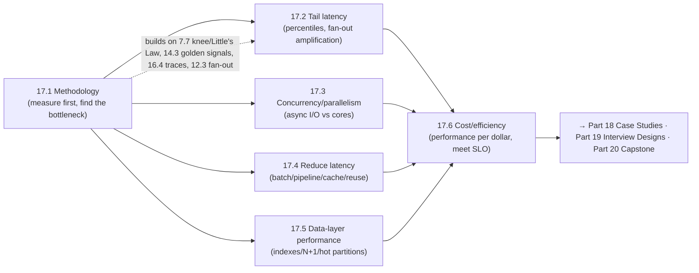

# Part 17 — Performance Engineering ✅ COMPLETE

Making systems fast and efficient on purpose — unified by one idea: **measure before you optimize (USE/RED, find the bottleneck), target the tail (percentiles, tame fan-out amplification), match the concurrency model to the workload (async for I/O, parallelism for CPU), reduce round-trips (batch/pipeline/cache/reuse), fix the data layer (indexes, N+1, hot partitions — where most bottlenecks live), and optimize for efficiency (performance per dollar), not raw speed — meeting the SLO at the lowest cost, never chasing "as fast as possible."**

---

## Lessons

| # | Lesson | Core idea |
|---|--------|-----------|
| 17.1 | [Performance Methodology (USE/RED)](17.1-performance-methodology-use-red.md) | Measure before you optimize; USE (resource) + RED (service) find the bottleneck; Amdahl bounds payoff; optimize the binding constraint toward the SLO, then stop |
| 17.2 | [Tail Latency & Fan-Out](17.2-tail-latency-percentiles-fanout.md) | Averages lie — use percentiles (p99/p99.9); the tail is what users feel; fan-out amplification (1% component tail → majority of requests slow); hedged requests + reduce fan-out; critical-path analysis |
| 17.3 | [Concurrency & Parallelism](17.3-concurrency-parallelism-async-io.md) | Concurrency (deal with many, async/event-loop for I/O-bound) vs parallelism (do many, cores for CPU-bound); thread-per-request → C10K wall → event loops (C10M); never block the loop; Little's Law + contention (USL) |
| 17.4 | [Reducing Latency](17.4-reducing-latency-batching-pipelining-prefetching.md) | Amortize/avoid fixed per-op overhead (round-trips): batch (one op), pipeline (overlap), connection reuse (no re-setup), prefetch (hide), cache (avoid); minimize round-trips; tradeoffs |
| 17.5 | [Data-Layer Performance](17.5-data-layer-performance-query-tuning-hot-partitions-n-plus-1.md) | The DB is usually the bottleneck (highest ROI); slow queries → indexes/EXPLAIN; N+1 → batch/eager-load; hot partitions → key design/salting/cache/replicate; cost-order relief |
| 17.6 | [Cost/Performance & Efficiency](17.6-cost-performance-efficiency-engineering.md) | Efficiency = performance per dollar (cost per request); meet the SLO at min cost, not "as fast as possible"; both-win optimizations (waste/caching); levers (right-size/autoscale/spot/tiered); hidden costs; FinOps |

---

## The through-line of Part 17

**One sentence:** Measure before optimizing and find the binding-constraint bottleneck (17.1); target the tail with percentiles and tame fan-out amplification via hedging and reduced fan-out (17.2); match the concurrency model to the workload — async/event-loops for I/O-bound, parallelism for CPU-bound (17.3); reduce latency by minimizing round-trips through batching, pipelining, caching, and connection reuse (17.4); fix the data layer where most bottlenecks live — indexes, N+1, hot partitions (17.5); and optimize for efficiency (performance per dollar), meeting the SLO at the lowest cost rather than chasing maximum speed (17.6).

---

## The key decisions Part 17 equips you to make

- **Where's the bottleneck?** Measure first (USE/RED/profile/trace); optimize the binding constraint toward the SLO; Amdahl-prioritize; stop at the goal. (17.1)
- **How do I measure/optimize latency?** Percentiles (not averages); the tail is the target; reduce fan-out + hedge; analyze the critical path. (17.2)
- **Which concurrency model?** Async/event-loop for I/O-bound (never block the loop); parallelism for CPU-bound; size via Little's Law; minimize contention. (17.3)
- **How do I make it faster?** Minimize round-trips: cache (avoid) → batch (fewer) → pipeline/parallelize (overlap) → reuse connections (no re-setup) → prefetch (hide). (17.4)
- **How do I fix the DB (usual bottleneck)?** Indexes (EXPLAIN), eliminate N+1, handle hot partitions; relieve in cost-order (index/N+1 → cache → replicas → denormalize → shard). (17.5)
- **How do I optimize cost?** Efficiency = perf/dollar; meet the SLO at min cost; both-win optimizations first; right-size/autoscale/spot/tiered; FinOps; watch hidden costs. (17.6)

---

## Self-check before Part 18

Without notes, can you:
1. Explain measure-first methodology, USE vs RED, finding the bottleneck, and Amdahl's Law?
2. Explain why averages hide the tail, what fan-out amplification is, and how hedged requests + reducing fan-out help?
3. Distinguish concurrency from parallelism, explain the C10K→C10M shift to event loops, and when to use async vs parallelism?
4. Explain how batching/pipelining/caching/connection-reuse/prefetching reduce latency by minimizing round-trips, and their tradeoffs?
5. Diagnose and fix slow queries (indexes/EXPLAIN), N+1, and hot partitions — and the cost-order relief toolkit?
6. Explain efficiency (performance per dollar), why "as fast as possible" is wrong, the efficiency levers, hidden costs, and FinOps?

If any are shaky, revisit that lesson's Revision Notes. Part 18 (Real-World Architectures) shows these performance principles (+ everything before) composed in documented systems; Part 19 (Interview Designs) applies them in end-to-end designs; Part 20 (Capstone) integrates performance + cost + all quality attributes.

---

*Reference asset for this part: `../../reference/performance-cheatsheet.md`.*
