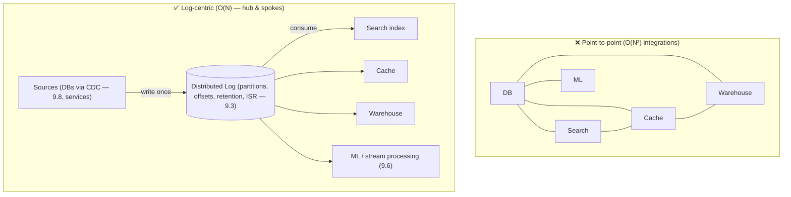
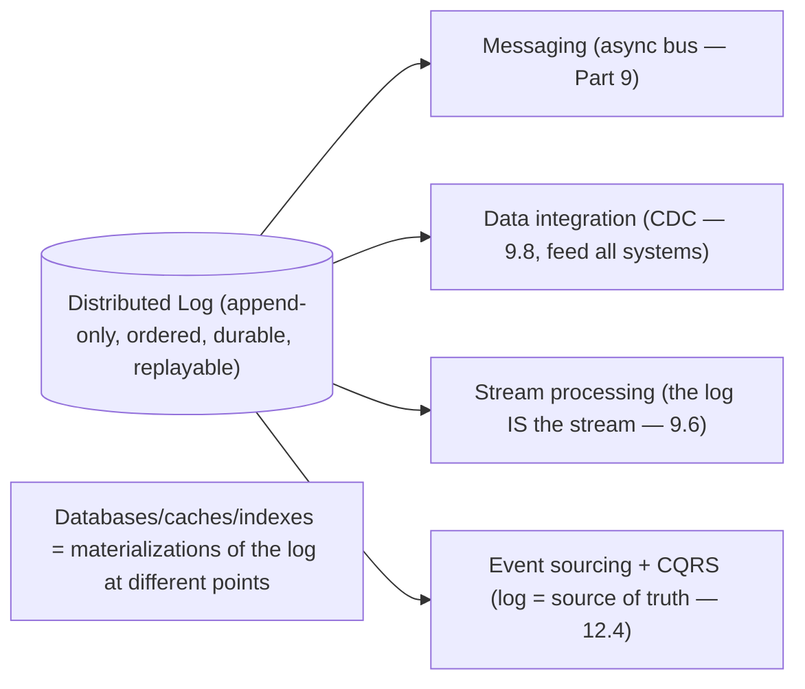

# Lesson 18.1 — The Distributed Log at the Center: LinkedIn/Kafka Lineage

> Part 18: Real-World Architectures · Difficulty: 🔴⚫ · *Representative case study*
>
> **Prerequisites:** [9.2 Brokers vs Logs], [9.3 The Distributed Log], [9.8 CDC/Outbox], [10.1 Replication], [12.4 Data Management].
> **Unlocks:** [18.5 Streaming], [Part 19 Interview Designs], [Part 20 Capstone].

> **Integrity note:** This lesson synthesizes the **publicly-documented design lineage** of the distributed log (LinkedIn/Kafka and "the log" as a unifying abstraction). It is **representative** — architectural principles, not internal specs; no invented benchmarks.

---

## 1. Learning Objectives

After this lesson you will be able to:

- Explain the **"log as the central abstraction"** idea (Kreps' "The Log") — an append-only, ordered, replayable sequence as the **backbone** of a data architecture.
- Describe the **distributed log's** design (9.3): partitions, offsets, ordered append, retention, consumer groups, replication (ISR).
- Explain how the log **unifies** messaging, data integration, stream processing, and CDC — the "**log-centric architecture**."
- Trace **why** each design decision follows from the fundamentals (append-only storage — 4.2.1, partitioning — 7.3, replication — 10.1, delivery/ordering — 9.4/9.5).
- Recognize the log-centric pattern in real systems and know its tradeoffs.

---

## 2. Motivation — One abstraction to connect everything

A recurring problem at scale: an organization has **many data systems** (databases, caches, search indexes, warehouses, analytics, ML — 5.1.3 polyglot) that all need the **same data**, kept in sync. The naive approach — **point-to-point pipelines** between every pair of systems — explodes into an **O(N²) tangle** of brittle, custom integrations (the "data integration" nightmare). The insight that reshaped modern data architecture (Jay Kreps, "The Log," from LinkedIn's experience building Kafka) is that a **single, central abstraction — the distributed, append-only log** — can be the **backbone** that connects them all: every change flows into the log **once**, and every system **consumes** from the log to stay in sync. The tangle collapses into a **hub-and-spoke** around the log.

The **log** is deceptively simple — an **append-only, totally-ordered (per partition), durable, replayable** sequence of records (9.3). But that simplicity is exactly its power: it's the **lowest common denominator** for data movement. It serves as a **message broker** (async communication — Part 9), a **data-integration backbone** (feed every system — 9.8 CDC), the **substrate for stream processing** (9.6 — the log *is* the stream), and the foundation of **event sourcing** and **CQRS** (12.4). This lesson synthesizes the **log-centric architecture** — the distributed log's design (9.3) and *why* it became the center of so many systems — connecting the messaging/streaming fundamentals (Part 9) into a coherent real-world architecture pattern. **(Representative — Kafka/LinkedIn lineage.)**

---

## 3. Theory — The architecture, from first principles

### 3.1 The log as the fundamental abstraction

`[CS]` A **log** is an **append-only, totally-ordered sequence of records**, each with a monotonically-increasing **offset** (9.3) `[CS]`:
- **Append-only** (4.2.1): writes only add to the end → **sequential I/O** (fast — 4.1.1), simple, immutable history.
- **Totally ordered** (per log/partition — 8.2.3): records have a definite order (the offset) → a **consistent sequence of events** everyone agrees on.
- **Durable + replayable:** records are retained (9.3) → consumers can **re-read from any offset** (replay — 9.7) — the log is the **source of truth of what happened**, not a transient queue.
- `[BP]` **Why it's foundational** (Kreps): the log is the **simplest possible shared data structure** for **ordered, durable, replayable** data movement — and that generality lets it serve messaging, integration, stream processing, and sourcing (§3.4). "**The log is the natural data structure for a stream of changes.**"

### 3.2 The distributed log's design (recap — 9.3)

`[CS]` To scale the log across machines (9.3) `[CS]`:
- **Partitions** (7.3): the log is split into **partitions**, each an independent ordered log → **horizontal scale** (parallelism across partitions) + **ordering guaranteed per partition** (not globally — 9.5). Producers pick a partition (by key — 9.5) so related events stay ordered.
- **Offsets:** each record has a per-partition offset; **consumers track their offset** → they control their position (replay, catch-up).
- **Consumer groups** (9.3): partitions are distributed across consumers in a group → **parallel consumption** + each partition consumed by one member (ordered) → scalable, ordered processing.
- **Retention** (9.3): records retained by time/size (not deleted on consume — unlike a broker — 9.2) → replayability; **log compaction** retains the latest per key (9.3) for changelogs.
- **Replication (ISR)** (9.3/10.1): each partition **replicated** across brokers (leader + followers, in-sync replicas) → durability + availability; writes ack'd per the durability config (10.2).
- `[BP]` This makes the log **scalable, durable, ordered (per partition), and replayable** — the properties the architecture depends on.

### 3.3 Broker vs log — why "retain and replay" matters

`[CS]` The log's defining difference from a traditional broker (9.2) `[CS]`:
- **Traditional broker** (queue): messages are **deleted on consume** → transient, one-shot delivery, no history.
- **Log:** messages are **appended and retained** → **many independent consumers** read at their own pace, and can **replay** from any offset.
- `[BP]` **Why this enables the architecture:** because the log **retains + allows replay**, it can feed **many different systems** (each a consumer group at its own offset — §3.4), support **reprocessing** (fix a bug → replay — 9.7), and act as the **source of truth** (not just transport). This "retain and replay" property is what makes the log a **backbone**, not just a pipe (9.2). It's the crucial design choice.

### 3.4 The log-centric architecture — one hub, many spokes

`[CS]` The log **unifies** what were separate concerns (Kreps' key insight) `[CS]`:
- **Messaging** (Part 9): the log is an async message bus — services publish/consume events (2.2.4 event-driven, 12.3).
- **Data integration** (9.8): instead of O(N²) point-to-point pipelines, every source writes changes to the log **once** (via **CDC** — 9.8 — tail the DB's changes into the log), and every sink (search index, cache, warehouse, another DB — 5.1.3) consumes from the log → **O(N)** integrations, all kept in sync. **The log is the central data pipeline.**
- **Stream processing** (9.6): the log **is the stream** — stream processors consume, transform, and produce back to the log (windowing, joins, aggregations — 9.6); Lambda/Kappa (9.7 — Kappa treats everything as a stream over the log).
- **Event sourcing + CQRS** (12.4): the log of **events is the source of truth**; materialized views/read models are **derived** by consuming the log → rebuildable by replay (12.4).
- `[BP]` **The unifying idea:** **all data movement is a log of changes**; databases, caches, indexes, and derived views are just **materializations** of the log at different points. The log is the **commit log of the whole organization** — a single ordered stream of everything that happened, from which all systems derive their state. This collapses the integration tangle into a **hub (the log) with spokes (systems consuming/producing)**.

### 3.5 Why each decision follows from the fundamentals

`[BP]` The design isn't arbitrary — each choice derives from earlier lessons `[BP]`:
- **Append-only** → sequential I/O (4.2.1/4.1.1) → **high throughput** (the log is fast because appends are cheap).
- **Partitioned** (7.3) → horizontal scale + per-partition ordering (9.5) — trading global order for scale (8.2.3).
- **Replicated (ISR)** (10.1/10.2) → durability + availability, tunable (sync/async acks — RPO — 10.2).
- **Consumer-tracked offsets** → decoupled, replayable consumption (9.3) + at-least-once/exactly-once semantics (9.4).
- **Retention + compaction** (9.3) → source-of-truth + changelog use-cases.
- **Delivery/ordering** (9.4/9.5) → the guarantees consumers build on (idempotent consumers — 11.5, exactly-once effects — 9.4).
- `[BP]` **The lesson:** the log-centric architecture is a **composition of the fundamentals** — append-only storage + partitioning + replication + retention + ordered delivery — assembled into a backbone. Understanding *why* each property exists explains *why* the log became central.

### 3.6 Tradeoffs and when it fits

`[BP]` The log-centric architecture is powerful but not universal `[BP]`:
- **Strengths:** decouples producers/consumers (Part 9), scales (partitions), durable + replayable (reprocessing/source-of-truth), unifies integration (O(N) not O(N²)), enables stream processing + event sourcing (9.6/12.4).
- **Costs:** **operational complexity** (running a distributed log — brokers, partitions, replication, ISR, consumer groups — is serious infrastructure), **eventual consistency** (consumers/derived views lag the log — 10.5/12.4), **ordering only per-partition** (9.5 — global order needs a single partition = no parallelism, or careful keying), **reprocessing/replay complexity**, and **it's a critical shared dependency** (must be HA — 11.2/13.8).
- **When it fits:** **high-throughput event/data-movement** at scale, **many systems needing the same data** (integration), **stream processing**, **event-driven architectures** (2.2.4), **CDC/outbox** (9.8) — i.e., when the O(N²) integration tangle or high-throughput async is the problem. **When it's overkill:** small systems with few data flows (a simple queue or direct calls suffice — don't run Kafka for a to-do app).
- `[BP]` Like microservices/K8s (12.1/13.3), it's a **"you must be this tall"** decision — the log-centric backbone pays off at **data/organizational scale**.

---

## 4. Visual Intuition

### O(N²) point-to-point tangle → O(N) log-centric hub

### The log unifies four concerns

---

## 5. Real-World Analogy

Think of a large organization replacing a chaotic web of **direct memos between departments** with a single **central, permanent company journal**.

- **The O(N²) tangle:** in a chaotic company, every department sends **direct memos** to every other department that needs to know something — Sales tells Finance, Sales tells Shipping, Sales tells Support, and each of *those* tells others. With many departments, this becomes an **unmanageable web** of point-to-point memos, each in its own format, constantly out of sync — the integration nightmare.
- **The log = the central company journal:** instead, the company keeps **one central, chronological journal** where **every event is written down once, in order** ("Order #4471 placed at 10:03," "Payment received at 10:04"). Any department that cares simply **reads the journal at its own pace** — Finance reads it for accounting, Shipping reads it to dispatch, Support reads it for context, Analytics reads it for reports. **Everyone stays in sync from one source**, and adding a new department just means **it starts reading the journal** — no new point-to-point memos (O(N), not O(N²)).
- **Append-only + ordered + permanent:** the journal is **only ever added to** (never edited — an immutable, ordered record of what happened), so it's a **reliable source of truth**. And because entries are **kept** (not erased once read), a **new department can catch up by reading from the beginning**, and any department can **re-read to recompute** if it made a mistake (replay/reprocessing) — unlike a memo you throw away after reading (a traditional queue).
- **Partitions = separate journals per topic for scale:** one giant journal everyone writes to would bottleneck, so the company keeps **several journals split by topic** (partitions), each strictly ordered internally — many scribes can write in parallel while **related events (same customer) always go in the same journal** to keep their order (partition by key).
- **Everything is a view of the journal:** the crucial reframe — **every department's records (Finance's ledger, Shipping's manifest, the search catalog) are just different *summaries* of the same central journal**. The journal is the **truth**; everything else is a **derived view** you can rebuild by re-reading it. That's the log-centric architecture.

---

## 6. Industry Example

- **Kafka / LinkedIn "The Log"** `[CONV]`: the distributed log as the central data-integration + streaming backbone; Kreps' "The Log" articulated the log-centric architecture (§3.1/3.4). *(Representative.)*
- **CDC into the log** `[CONV]`: Debezium-style change capture feeding DB changes into the log to sync all downstream systems (§3.4, 9.8). *(Representative.)*
- **Kappa architecture** `[CONV]`: treating all processing as streams over the log (reprocess by replay) (§3.4, 9.7). *(Representative.)*
- **Event sourcing + CQRS on the log** `[CONV]`: the event log as source of truth, derived read models (§3.4, 12.4). *(Representative.)*
- **Log-based stream processing** `[CONV]`: stream processors (Kafka Streams/Flink-style) consuming + producing back to the log (§3.4, 9.6). *(Representative.)*

---

## 7. Implementation Details (architectural)

- **Put a distributed log at the center** (§3.4): sources (services + **CDC** from DBs — 9.8) write once; sinks (search/cache/warehouse/ML) consume — O(N) integration.
- **Design partitions + keys** (§3.2, 7.3/9.5): partition for throughput; **key by entity** so related events stay ordered (per-partition ordering — 9.5).
- **Configure replication + retention** (§3.2, 10.1/10.2): ISR + acks for durability (tune RPO — 10.2); retention/compaction for replay/changelog (9.3).
- **Consumer groups + offset management** (9.3): parallel, ordered, replayable consumption; **idempotent consumers** (11.5/9.5) for at-least-once → exactly-once effects (9.4).
- **Use it for the right things** (§3.6): messaging, integration/CDC, stream processing (9.6), event sourcing/CQRS (12.4) — at scale.
- **Operate it as critical HA infrastructure** (11.2/13.8): it's a shared dependency; replicate across failure domains; monitor lag (9.9/16.2).
- **Reprocessing/replay** (9.7): design consumers to be replay-safe (idempotent — 11.5) for bug fixes/reshaping.

---

## 8. Advantages

- **Decoupling** — producers/consumers independent (Part 9, 12.3).
- **O(N) integration** — hub-and-spoke replaces the O(N²) tangle (§3.4).
- **Durable + replayable** — source of truth, reprocessing, catch-up (§3.3).
- **Scalable throughput** — append-only + partitioned (§3.2/3.5).
- **Unifies concerns** — messaging + integration + streaming + sourcing (§3.4).
- **Ordered (per partition)** — consistent event sequence for consumers (§3.2).

---

## 9. Disadvantages / costs

- **Operational complexity** — running a distributed log at scale is serious infra (§3.6).
- **Eventual consistency** — derived views lag the log (§3.6, 10.5/12.4).
- **Only per-partition ordering** — global order requires one partition (no parallelism) or careful keying (§3.2, 9.5).
- **Critical shared dependency** — must be HA (§3.6, 11.2).
- **Reprocessing/replay complexity** — consumers must be replay/idempotency-safe (§3.6, 9.7/11.5).
- **Overkill for small systems** — a simple queue/direct calls may suffice (§3.6).

---

## 10. When NOT to use it

- **Small systems / few data flows** — a simple queue or direct calls suffice; don't run a distributed log (§3.6).
- **Strong global ordering needs** across all events — per-partition ordering only (§3.2, 9.5).
- **Strict synchronous request/response** — the log is async; use RPC for sync (12.3).
- **Low operational maturity** — running it well is demanding (§3.6, "you must be this tall").
- **Simple point-to-point** where O(N²) isn't a problem yet (§3.4).

---

## 11. Common Mistakes

1. **Point-to-point pipelines everywhere** → O(N²) integration tangle (§3.4).
2. **Assuming global ordering** — only per-partition (§3.2, 9.5).
3. **Non-idempotent consumers** → duplicates under at-least-once/replay (§3.6, 11.5/9.5).
4. **Treating the log as a transient queue** — missing the retain/replay/source-of-truth value (§3.3).
5. **Ignoring consumer lag** → falling behind, backpressure (§3.6, 9.9).
6. **Under-partitioning** → limited parallelism; or bad keying → hot partitions (7.4).
7. **Running it without HA** — a shared critical dependency down (§3.6, 11.2).
8. **Over-adopting for a small system** (§3.6).

---

## 12. Interview Questions

**🟢 Easy**
- What is a distributed log, and how does it differ from a traditional message queue?
- Why does "retain and replay" make the log a backbone, not just a pipe?

**🟡 Medium**
- How does a log-centric architecture solve the O(N²) data-integration problem?
- How do partitions, offsets, and consumer groups provide scale + ordering + replay (9.3)?

**🔴 Hard**
- How does the log unify messaging, data integration, stream processing, and event sourcing (§3.4)? Why is "everything a materialization of the log"?
- Trace how each design decision (append-only, partitioned, replicated, retained) follows from the fundamentals (§3.5).

**⚫ Staff+**
- Design a log-centric data architecture for an organization with many polyglot systems needing the same data: CDC into the log, consumers per system, stream processing, ordering/keying, replication/retention, HA, and the tradeoffs vs point-to-point.
- When is a distributed log the wrong choice, and what would you use instead? Discuss the operational + consistency + ordering costs (§3.6).

---

## 13. Production Pitfalls

- **Integration tangle unsolved:** kept building point-to-point pipelines → O(N²) brittleness (§3.4).
- **Ordering assumption bug:** code assumed global ordering; cross-partition events arrived out of order (§3.2, 9.5).
- **Duplicate processing:** non-idempotent consumers double-processed on redelivery/replay (§3.6, 11.5).
- **Consumer lag / backpressure:** a slow consumer fell far behind the log (§3.6, 9.9).
- **Hot partition:** poor keying funneled events to one partition (§3.2, 7.4).
- **Log outage = org outage:** the shared log went down without HA, halting all data movement (§3.6, 11.2).
- **Replay disaster:** an un-idempotent reprocessing corrupted downstream state (§3.6, 9.7/11.5).

---

## 14. Optimization Techniques

- **Log-centric hub-and-spoke + CDC** (9.8) to replace O(N²) integration (§3.4).
- **Partition + key for parallelism + per-key ordering** (7.3/9.5); avoid hot partitions (7.4).
- **Tune replication/acks (RPO) + retention/compaction** (10.2/9.3) to the durability/replay needs (§3.2).
- **Idempotent, replay-safe consumers** (11.5/9.5) → exactly-once effects (9.4).
- **Monitor consumer lag + scale consumers** (9.9/16.2) to keep up.
- **Stream processing on the log** (9.6) for real-time derived views; **event sourcing/CQRS** (12.4) rebuildable by replay.
- **HA across failure domains** (11.2/13.8) — it's a critical dependency.

---

## 15. Summary

A recurring scale problem — **many data systems** (DBs, caches, search, warehouse, ML — polyglot — 5.1.3) all needing the **same data in sync** — degenerates into an **O(N²) tangle of brittle point-to-point pipelines**. The insight that reshaped modern data architecture (Kreps' "The Log," from LinkedIn/Kafka) is that a single central abstraction — the **distributed, append-only log** — can be the **backbone** connecting them: every change flows into the log **once**, every system **consumes** from it, and the tangle collapses into **hub-and-spoke** (O(N)). The **log** is an **append-only, totally-ordered (per partition), durable, replayable** sequence of records with monotonic **offsets** (9.3) — deceptively simple, but that simplicity is its power (the lowest common denominator for ordered, durable, replayable data movement). Its **distributed design** (9.3): **partitions** (7.3 — horizontal scale + per-partition ordering — 9.5, keyed so related events stay ordered), **offsets** (consumer-tracked → replay/catch-up), **consumer groups** (parallel + ordered consumption), **retention + compaction** (replay + changelog — not delete-on-consume), and **replication (ISR)** (10.1/10.2 — durability + availability, tunable RPO). Its **defining difference from a traditional broker** (9.2) is **"retain and replay"**: because the log keeps records and lets consumers re-read from any offset, it can **feed many systems** (each a consumer group at its own offset), support **reprocessing** (fix a bug → replay — 9.7), and be the **source of truth** — making it a **backbone, not just a pipe**. This lets the log **unify** four concerns (Kreps' key insight): **messaging** (async bus — Part 9), **data integration** (CDC — 9.8 — feed all systems, O(N) not O(N²)), **stream processing** (the log *is* the stream — 9.6/Kappa — 9.7), and **event sourcing + CQRS** (the event log is the source of truth; databases/caches/indexes/read-models are just **materializations of the log** — 12.4). Every design decision **follows from the fundamentals**: append-only → sequential I/O → high throughput (4.2.1/4.1.1); partitioned → scale + per-partition order (7.3/9.5); replicated → durability/availability (10.1/10.2); consumer-tracked offsets → decoupled, replayable consumption + exactly-once effects (9.4/11.5); retention/compaction → source-of-truth/changelog — a **composition of the fundamentals** into a backbone. Its **tradeoffs**: operational complexity (serious infrastructure), eventual consistency (derived views lag — 10.5/12.4), only per-partition ordering (9.5 — global order costs parallelism), reprocessing/idempotency complexity (9.7/11.5), and being a **critical shared dependency** (must be HA — 11.2/13.8) — so, like microservices/K8s, it's a **"you must be this tall"** decision that pays off at **data/organizational scale** (overkill for small systems with few flows). The log-centric architecture is a canonical example of composing the course's fundamentals into a real-world backbone. **(Representative — Kafka/LinkedIn lineage.)**

---

## 16. Revision Notes (flashcard-ready)

- **Q:** The log-centric insight? **A:** One central append-only log as the backbone; every change written once, every system consumes → O(N) not O(N²) integration.
- **Q:** What is a log? **A:** Append-only, totally-ordered (per partition), durable, replayable sequence of records with offsets.
- **Q:** Log vs traditional broker? **A:** Broker deletes on consume (transient); log retains + allows replay → feeds many consumers, source of truth.
- **Q:** Distributed log design? **A:** Partitions (scale + per-partition order), offsets (consumer-tracked), consumer groups, retention/compaction, replication (ISR).
- **Q:** What does the log unify? **A:** Messaging, data integration (CDC), stream processing (log = stream), event sourcing/CQRS (log = source of truth).
- **Q:** "Everything is a...?" **A:** Materialization of the log — DBs/caches/indexes/read-models are derived views of the log.
- **Q:** Ordering guarantee? **A:** Per-partition only; global ordering needs one partition (no parallelism) or careful keying (9.5).
- **Q:** Why append-only? **A:** Sequential I/O → high throughput (4.2.1/4.1.1).
- **Q:** Key tradeoffs? **A:** Operational complexity, eventual consistency, per-partition-only ordering, critical HA dependency, reprocessing complexity.
- **Q:** When to use? **A:** High-throughput events + many systems needing the same data + streaming/event-driven at scale; overkill for small systems.

---

## 17. Further Reading + Knowledge-Graph Links

**Foundations (in-platform):**
- **[9.2 Brokers vs Logs]** / **[9.3 The Distributed Log]** — the core design.
- **[9.8 CDC/Outbox]** — feeding the log from databases.
- **[9.6 Stream Processing]** / **[9.7 Lambda/Kappa]** — the log as the stream.
- **[12.4 Data Management]** — CQRS/event sourcing (materializations).
- **[10.1/10.2 Replication]** — ISR, durability.
- **[7.3 Sharding]** — partitioning.

**Unlocks / next:**
- **[18.5 Streaming & Recommendations]** — Netflix-style, log-based.
- **[Part 19 Interview Designs]** — log-centric designs.
- **[Part 20 Capstone]** — market-data ingestion on a log.

**External (canonical):**
- Kreps, "The Log: What every software engineer should know about real-time data's unifying abstraction." *(Representative.)*
- Kafka documentation + design papers. *(Representative.)*
- Kleppmann, *Designing Data-Intensive Applications* — logs, derived data, stream processing.

> **Knowledge-graph:** `9.2/9.3 log` + `9.8 CDC` + `12.4 CQRS/ES` + `10.1 replication` + `7.3 partitioning` → **`18.1 log-centric architecture (Kafka/LinkedIn lineage)`** → `18.5 streaming` / `Part 19–20`.
