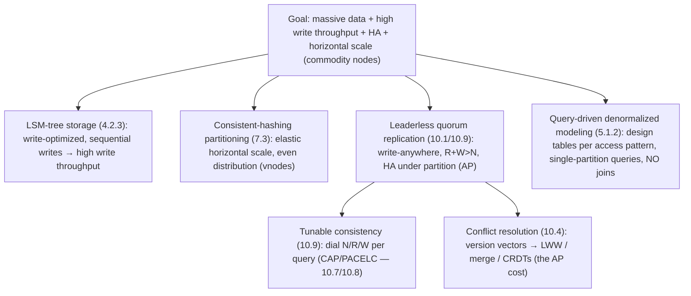
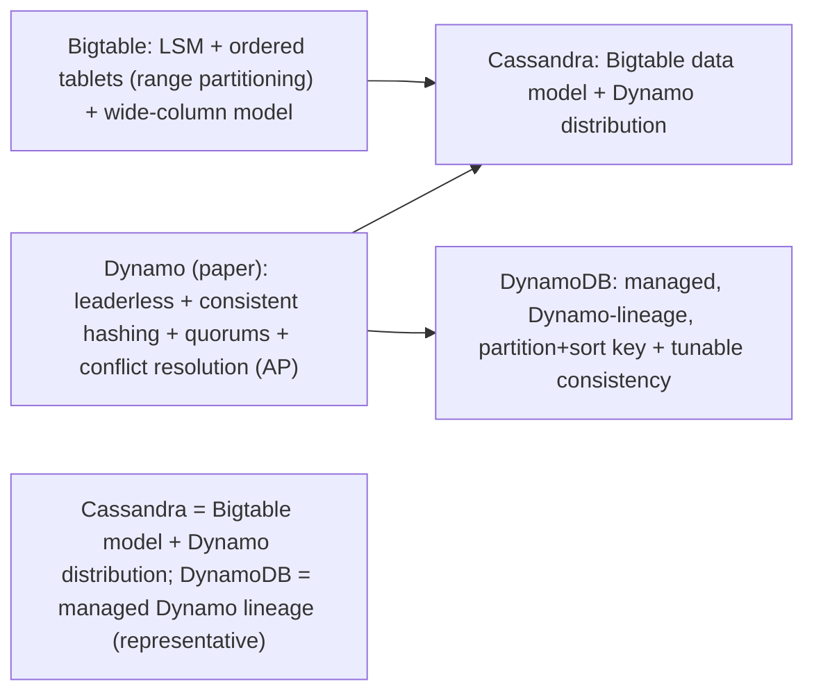

# Lesson 18.2 — Wide-Column at Scale: Bigtable/Cassandra/DynamoDB Design Lineage

> Part 18: Real-World Architectures · Difficulty: 🔴⚫ · *Representative case study*
>
> **Prerequisites:** [4.2.3 LSM-Trees], [5.1.1 Data Models], [7.3 Sharding/Consistent Hashing], [10.1 Leaderless Replication], [10.4 Conflict Resolution], [10.9 Quorum Tuning].
> **Unlocks:** [18.3 Globally-Distributed SQL], [Part 19 Interview Designs], [Part 20 Capstone].

> **Integrity note:** Synthesizes the **publicly-documented design lineage** of wide-column / partitioned-hash NoSQL (Google Bigtable, the Dynamo paper, Cassandra). **Representative** — design principles, not internal specs; no invented benchmarks.

---

## 1. Learning Objectives

After this lesson you will be able to:

- Explain the **wide-column / partitioned-key-value** data model (5.1.1) and why it fits **massive-scale, high-write** workloads.
- Trace the two influential lineages: **Bigtable** (LSM-based, ordered, single-master-ish tablets) and **Dynamo** (leaderless, consistent-hashing, AP) — and how **Cassandra** and **DynamoDB** blend them.
- Explain the design pillars: **LSM storage** (4.2.3), **consistent-hashing partitioning** (7.3), **leaderless quorum replication** (10.1/10.9), **tunable consistency** (10.9), and **conflict resolution** (10.4).
- Explain **query-driven data modeling** (5.1.2): design tables around access patterns, denormalize, no joins — the opposite of relational modeling.
- Recognize when this family fits (and doesn't) versus relational/NewSQL (18.3).

---

## 2. Motivation — Storage that scales writes horizontally and never goes down

The relational database (5.x) is powerful but hits walls at extreme scale: a single primary bottlenecks writes (7.5/7.6), vertical scaling runs out, and strong consistency across a cluster is expensive (10.6/10.7). Two landmark systems reshaped how we store data at **web scale**: **Google's Bigtable** (a distributed, ordered, sparse map built on **LSM-trees** — 4.2.3) and **Amazon's Dynamo** (a leaderless, **always-writable**, consistent-hashing key-value store — the Dynamo paper). Their descendants — **Cassandra** (Dynamo's distribution + Bigtable's data model) and **DynamoDB** (managed, Dynamo-lineage) — power some of the largest systems on earth, and their design choices are a masterclass in **composing the fundamentals** for **horizontal write scale + high availability**.

The shared goal: store **enormous volumes** of data with **very high write throughput** and **no single point of failure**, across many commodity nodes, tolerating failures gracefully. Achieving this required **giving up** things relational databases provide — **joins, rich queries, strong ACID transactions, single-primary strong consistency** — in exchange for **linear horizontal scalability** and **availability under partition** (AP — 10.7). The design pillars all come from earlier lessons: **LSM-tree storage** (4.2.3 — write-optimized), **consistent-hashing partitioning** (7.3 — spread + rebalance), **leaderless quorum replication** (10.1/10.9 — write anywhere, R+W>N), **tunable consistency** (10.9 — dial the tradeoff), **conflict resolution** (10.4 — LWW/version-vectors), and **query-driven denormalized modeling** (5.1.2). This lesson synthesizes the wide-column/Dynamo lineage — *why* it's shaped this way — as a canonical real-world architecture. **(Representative.)**

---

## 3. Theory — The architecture, from first principles

### 3.1 The data model — wide-column / partitioned key-value

`[CS]` The model (5.1.1), varying across the family `[CS]`:
- **Wide-column (Bigtable/Cassandra):** a **sparse, distributed, multi-dimensional sorted map** — rows keyed by a **partition key** (+ optional **clustering/sort key**), each row having **columns** (which can vary per row — "wide"/sparse). Think: `(partition_key) → (clustering_key) → columns`. Data is **sorted within a partition** (enabling range scans on the clustering key).
- **Key-value (Dynamo/DynamoDB):** a partition key → item (with attributes); DynamoDB adds a **sort key** (wide-column-like) + secondary indexes.
- `[BP]` **The key design point:** you access data **by the partition key** (and optionally range-scan the sort key within a partition) — **no arbitrary queries, no joins** (§3.5). The model is **optimized for known access patterns at massive scale**, not ad-hoc querying (contrast relational — 5.1.1). It's the **query-driven, denormalized** model (5.1.2).

### 3.2 Storage engine — LSM-trees (write-optimized)

`[CS]` This family is built on **LSM-trees** (4.2.3), not B-trees (4.2.2) `[CS]`:
- **Why LSM** (4.2.4): **write-optimized** — writes go to an in-memory **memtable** + a **commit log** (sequential — fast), later flushed to immutable **SSTables**, merged by **compaction** (4.2.3). Sequential writes (4.1.1) → **very high write throughput** — exactly the goal (§2).
- **Reads** check memtable + SSTables (+ **bloom filters** — 4.2.3 to skip SSTables) → read amplification, mitigated by compaction + caching (RUM tradeoff — 4.2.4).
- **Bigtable's lineage:** ordered SSTables on a distributed file system; Cassandra: LSM per node.
- `[BP]` The LSM choice **directly serves the write-heavy goal** — this family exists because LSM makes **massive write throughput** cheap (the read cost is the accepted tradeoff — 4.2.4). Storage-engine choice (Part 4) shapes the whole system.

### 3.3 Partitioning — consistent hashing

`[CS]` Data is spread across nodes by **partitioning the key space** (7.3) `[CS]`:
- **Dynamo/Cassandra: consistent hashing** (7.3) — hash the partition key onto a ring; each node owns a range; **virtual nodes** (7.3) for even distribution + smooth rebalancing (adding/removing a node moves only a fraction of data — 7.4).
- **Bigtable: range partitioning** into **tablets** (ordered ranges), split/merged + reassigned as they grow (directory-based — 7.3).
- `[BP]` **Why consistent hashing (Dynamo family)** (7.3): **decentralized** (no central coordinator to place data), **elastic** (add/remove nodes with minimal data movement — 7.4), **balanced** (with vnodes). This enables **linear horizontal scale**. The **partition key choice is critical** (7.3/17.5) — a bad key → **hot partitions** (7.4/17.5 — the classic failure mode).

### 3.4 Replication & consistency — leaderless quorums, tunable

`[CS]` The Dynamo-lineage replication model (10.1/10.9) `[CS]`:
- **Leaderless replication** (10.1): data is replicated to **N** nodes (the next N on the ring); **any replica can accept reads/writes** (write-anywhere) → **no single primary bottleneck**, **high availability** (writes succeed even if some replicas are down — AP — 10.7).
- **Quorums (R+W>N)** (10.9/8.3.4): a write waits for **W** acks, a read queries **R** replicas; **R+W>N** guarantees read/write overlap (a read sees the latest write) → **tunable consistency**.
- **Tunable consistency** (10.9): the **dial** — set N/R/W per operation. `W=N,R=1` (read-optimized, durable writes), `W=1,R=N` (write-optimized), `W=R=quorum` (balanced strong-ish), or low R/W (fast, eventually consistent — AP). **You choose the CAP/PACELC tradeoff per query** (10.7/10.8).
- **Sloppy quorums + hinted handoff** (10.9): under partition, write to **any** available nodes (not just the "right" N) + hand off later → **maximize availability** (AP).
- `[BP]` This is **AP by default** (10.7 — available under partition, eventually consistent), **tunable** toward stronger consistency — the opposite of a single-primary strong-consistency DB. **Availability + write scale over strong consistency** — the Dynamo philosophy.

### 3.5 Conflict resolution — the cost of write-anywhere

`[CS]` Because **any replica accepts writes** (leaderless — §3.4), **concurrent writes conflict** (multi-writer — 10.1/10.4) `[CS]`:
- **Conflict detection:** **version vectors** (10.4/8.2.2) detect concurrent (conflicting) vs causally-ordered writes → **siblings** when concurrent.
- **Resolution** (10.4): **Last-Write-Wins (LWW)** (simple, but **loses data** on concurrent writes — timestamp-based — 8.1.2) or **application-level merge / CRDTs** (10.4 — conflict-free merge) or **return siblings to the client** (Dynamo) to resolve.
- `[BP]` **The tradeoff:** write-anywhere availability (§3.4) **costs conflict handling** (10.4) — you must **detect + resolve** concurrent writes, or accept LWW data loss. This is the **price of AP leaderless replication** (10.1) — and why the model suits data where conflicts are rare/mergeable, not strict invariants (which need consensus — 10.4/11.7).

### 3.6 Query-driven data modeling — design for access patterns

`[CS]`/`[BP]` The modeling philosophy is the **opposite** of relational (5.1.2) `[BP]`:
- **No joins, no ad-hoc queries** (§3.1): you can only efficiently query **by partition key** (+ sort-key range). So you **design tables around your queries** — "**query-first**" (5.1.2).
- **Denormalize + duplicate** (5.1.2): store data **the way you'll read it** — duplicate/denormalize so each query hits **one partition** (no joins). A single logical entity may be stored in **multiple tables**, one per access pattern.
- **Partition key = the access pattern + distribution** (7.3): choose it to (a) match how you query and (b) distribute evenly (avoid hot partitions — 7.4/17.5).
- **Secondary indexes** (limited — 7.3 local vs global): supported but with tradeoffs; often you **model a second table** instead.
- `[BP]` **The mindset shift:** relational = model the data, then query flexibly; wide-column = **model the queries**, then store data to serve them. **Denormalization is the norm** (write extra copies — cheap with LSM — §3.2 — to make reads a single-partition lookup). This is why it scales: every query is a **partition-key lookup**, no cross-node joins.

### 3.7 Why it all fits together (and when it doesn't)

`[BP]` The composition (§2 goal → design) `[BP]`:
- **Goal:** massive data + very high write throughput + high availability + horizontal scale, on commodity nodes.
- **→ LSM storage** (write-optimized — §3.2), **consistent-hashing partitioning** (elastic horizontal scale — §3.3), **leaderless quorum replication** (write-anywhere HA — §3.4), **tunable consistency** (dial the tradeoff — §3.4), **conflict resolution** (the AP cost — §3.5), **query-driven denormalized modeling** (single-partition queries — §3.6).
- **What you give up:** joins, rich/ad-hoc queries, strong ACID transactions (limited/none across partitions — 11.6), strong consistency by default (10.7), and you take on **conflict handling** (§3.5) + **hot-partition risk** (7.4).
- **When it fits:** **huge scale, high write volume, known access patterns, availability > strong consistency** — e.g., time-series, activity feeds, messaging, IoT, user data at web scale, session stores.
- **When it doesn't:** strong consistency/transactions needed (→ relational/NewSQL — 18.3), complex ad-hoc queries/joins (→ relational/warehouse), invariants requiring coordination (10.4/11.7), or **modest scale** (a relational DB is simpler — 5.4.1).
- `[BP]` This family is a **deliberate trade** (1.1.5): **give up relational richness + strong consistency to gain horizontal write scale + availability** — a textbook composition of Parts 4/7/10 for a specific requirement profile.

---

## 4. Visual Intuition

### The design pillars (composing the fundamentals)

### Two lineages blended

---

## 5. Real-World Analogy

Think of running a **vast, always-open chain of self-service lockers** across a whole country — versus one grand central library (a relational DB).

- **The goal:** store an **enormous** number of items, let people **deposit constantly** (high write throughput), and **never close** even if some locations lose power (high availability) — across **thousands of cheap locker sites** (commodity nodes), not one expensive mega-building.
- **Consistent hashing = assigning lockers by a hashing rule:** each item's ID is run through a **rule that maps it to a locker location** (consistent hashing on the ring), spread evenly so no site is overwhelmed, and **adding a new site only reshuffles a small fraction** of items (elastic — 7.4). No central clerk decides placement — the **rule** does (decentralized).
- **Leaderless, write-anywhere = deposit at any of several nearby sites:** for redundancy, each item is stored at **N nearby sites**, and you can **deposit or retrieve at any of them** — so even if some sites are **down or unreachable** (a partition), you can **still deposit** (always writable — AP). You confirm a deposit once **W sites** have it, and a retrieval checks **R sites**; if **R+W > N**, a retrieval is guaranteed to find the latest deposit (quorum). You can **dial** these numbers: confirm fast with few sites (eventually consistent) or wait for more (stronger consistency) — **tunable**.
- **Conflict resolution = two people updating the same locker at once:** because you can write **anywhere**, **two people might update the same item at nearly the same time at different sites** (a conflict). The system **detects** this (version tags — version vectors) and either **keeps the latest by timestamp** (last-write-wins — simple but **one update is lost**), **merges** them, or **hands both versions back** for you to reconcile. This reconciliation work is the **price of being able to deposit anywhere, anytime**.
- **Query-driven modeling = organize lockers by how you'll fetch, not by neat categories:** unlike a **library with a flexible catalog** where you can search any which way (relational, joins), these lockers **only let you fetch by the item's ID** (partition key) — no browsing, no cross-referencing. So you **plan your storage around exactly how you'll retrieve**: if you'll often want "all of Alice's photos from March," you **store them together under one key** (denormalize/duplicate), even keeping **multiple copies organized different ways** for different retrieval needs. **You model the retrievals, then store to serve them** — the opposite of the flexible library.
- **The trade:** you gave up the library's **flexible searching, cross-referencing (joins), and single-source-of-truth guarantees** — in exchange for a system that stores **staggering volumes, accepts constant deposits, and never closes**. Right for a national locker network; wrong if you actually needed a searchable, transactional library.

---

## 6. Industry Example

- **Google Bigtable** `[CONV]`: LSM-based, ordered wide-column store on a distributed filesystem; the ancestor of the wide-column model (§3.1/3.2). *(Representative.)*
- **Amazon Dynamo (paper)** `[CONV]`: leaderless, consistent-hashing, quorum, conflict-resolving, AP key-value store — the distribution blueprint (§3.3/3.4/3.5). *(Representative.)*
- **Apache Cassandra** `[CONV]`: Bigtable's wide-column model + Dynamo's leaderless distribution + tunable consistency (§3.1/3.4). *(Representative.)*
- **Amazon DynamoDB** `[CONV]`: managed Dynamo-lineage KV/wide-column with partition+sort keys, tunable consistency, secondary indexes (§3.1/3.4). *(Representative.)*
- **Query-driven modeling + hot-partition avoidance** `[CONV]`: designing tables per access pattern + partition keys for even distribution (§3.6, 7.4/17.5). *(Representative.)*

---

## 7. Implementation Details (architectural)

- **Choose this family for the right profile** (§3.7): massive scale + high writes + HA + known access patterns + availability > strong consistency.
- **Model query-first** (§3.6, 5.1.2): design tables around access patterns; **denormalize/duplicate**; each query = single-partition lookup; no joins; multiple tables per entity if needed.
- **Design the partition key carefully** (§3.3, 7.3/7.4/17.5): match access pattern + distribute evenly; **avoid hot partitions** (celebrity/monotonic keys — 17.5); use composite/sort keys for range scans.
- **Tune consistency per operation** (§3.4, 10.9): set N/R/W (R+W>N for read-your-latest); choose AP-fast vs stronger per query (10.7/10.8).
- **Handle conflicts** (§3.5, 10.4): version vectors + LWW (accept loss) / merge / CRDTs / siblings — pick per data's conflict tolerance.
- **Exploit LSM write throughput** (§3.2, 4.2.3): denormalization is cheap because writes are cheap; mind read/compaction amplification (4.2.4).
- **Mitigate hot keys** (7.4/17.5): salting, caching (Part 6/6.7), better keys.
- **Don't use it where relational/NewSQL fits** (§3.7): strong consistency/transactions/joins → 18.3/relational.

---

## 8. Advantages

- **Linear horizontal write scale** — LSM + consistent hashing + leaderless (§3.2/3.3/3.4).
- **High availability** — write-anywhere, no single primary, AP under partition (§3.4, 10.7).
- **Elastic** — consistent hashing adds/removes nodes with minimal data movement (§3.3, 7.4).
- **Tunable consistency** — dial the CAP/PACELC tradeoff per query (§3.4, 10.9).
- **Massive data volumes** — designed for it (§2).
- **Predictable performance** — single-partition queries (§3.6).

---

## 9. Disadvantages / costs

- **No joins / ad-hoc queries** — query-driven, denormalized only (§3.1/3.6).
- **Conflict handling** — write-anywhere costs conflict resolution / LWW data loss (§3.5, 10.4).
- **Weak/tunable consistency** — eventual by default; strong consistency is expensive/limited (§3.4, 10.7).
- **Limited transactions** — no cross-partition ACID (§3.7, 11.6).
- **Hot-partition risk** — bad partition key = one node overloaded (§3.3, 7.4/17.5).
- **Read/compaction amplification** — LSM tradeoff (§3.2, 4.2.4).
- **Denormalization burden** — data duplication + update-everywhere complexity (§3.6).

---

## 10. When NOT to use it

- **Strong consistency / ACID transactions needed** → relational or NewSQL (18.3) (§3.7).
- **Complex ad-hoc queries / joins** → relational or a warehouse (§3.1/3.7).
- **Cross-partition invariants** needing coordination (→ consensus — 10.4/11.7) (§3.7).
- **Modest scale** — a relational DB is simpler (5.4.1) (§3.7).
- **Unknown/changing access patterns** — query-driven modeling assumes known queries (§3.6).
- **Conflict-sensitive data** where LWW loss / merge complexity is unacceptable (§3.5).

---

## 11. Common Mistakes

1. **Using it like a relational DB** — expecting joins/ad-hoc queries/transactions (§3.1/3.7).
2. **Bad partition key → hot partitions** (celebrity/monotonic) (§3.3, 7.4/17.5).
3. **Ignoring conflict resolution** — LWW silently losing concurrent writes (§3.5, 10.4).
4. **Assuming strong consistency by default** — it's AP/eventual unless tuned (§3.4, 10.7).
5. **Not modeling query-first** — designing normalized, then can't query it (§3.6).
6. **Over-using secondary indexes** instead of modeling a second table (§3.6, 7.3).
7. **Choosing it at modest scale** — needless complexity vs relational (§3.7).
8. **Ignoring LSM read/compaction amplification** (§3.2, 4.2.4).

---

## 12. Interview Questions

**🟢 Easy**
- What is the wide-column / partitioned-key-value model, and how does it differ from relational?
- Why is this family built on LSM-trees rather than B-trees?

**🟡 Medium**
- How do consistent hashing + leaderless quorum replication provide horizontal scale + availability?
- What is tunable consistency (N/R/W), and how does R+W>N work (10.9)?

**🔴 Hard**
- Why does write-anywhere require conflict resolution, and what are the options (LWW/version-vectors/CRDTs/siblings — 10.4)?
- Explain query-driven data modeling: why denormalize, why model per access pattern, and how the partition key choice affects both querying and hot partitions?

**⚫ Staff+**
- Design a wide-column data model + cluster config for a high-write workload (e.g., activity feed / time-series): partition/sort keys, denormalization per access pattern, N/R/W tuning, conflict handling, and hot-partition mitigation — and justify choosing this family over relational/NewSQL (18.3).
- Trace how each design pillar (LSM, consistent hashing, leaderless quorums, tunable consistency, conflict resolution, query-driven modeling) follows from the goal of horizontal write scale + HA, and what's given up (joins/transactions/strong consistency).

---

## 13. Production Pitfalls

- **Hot partition:** a celebrity/monotonic partition key overloaded one node while others idled (§3.3, 7.4/17.5).
- **LWW data loss:** concurrent writes silently lost the "losing" update under last-write-wins (§3.5, 10.4/8.1.2).
- **Relational-thinking failure:** the team modeled normalized data and then couldn't query it (no joins) (§3.1/3.6).
- **Consistency surprise:** assumed strong consistency, got stale reads (AP/eventual by default) (§3.4, 10.7).
- **Compaction/read amplification:** heavy reads suffered from LSM read amplification / compaction load (§3.2, 4.2.4).
- **Denormalization drift:** duplicated data got out of sync because updates missed a copy (§3.6).
- **Over-adoption:** used at modest scale where relational would've been far simpler (§3.7).

---

## 14. Optimization Techniques

- **Query-first denormalized modeling** — single-partition lookups, no joins (§3.6, 5.1.2).
- **Partition key for even distribution + access pattern** (7.3); mitigate hot keys (salt/cache/replicate — 7.4/17.5/Part 6).
- **Tune N/R/W per operation** for the right consistency/latency/availability tradeoff (§3.4, 10.9/10.8).
- **Choose conflict resolution** to fit the data (LWW/merge/CRDT/siblings — 10.4).
- **Exploit cheap LSM writes** for denormalization; manage compaction/read amplification + bloom filters + caching (§3.2, 4.2.3/4.2.4/Part 6).
- **Composite/sort keys** for efficient range scans within a partition (§3.1).
- **Use the right store** — don't force relational workloads onto it (§3.7).

---

## 15. Summary

The relational database hits walls at extreme scale (single-primary write bottleneck — 7.5/7.6, expensive cluster-wide strong consistency — 10.6/10.7), so two landmark systems reshaped **web-scale storage**: **Bigtable** (a distributed, ordered, sparse wide-column map on **LSM-trees** — 4.2.3) and **Dynamo** (a leaderless, always-writable, consistent-hashing key-value store), whose descendants — **Cassandra** (Bigtable's model + Dynamo's distribution) and **DynamoDB** (managed Dynamo lineage) — power the largest systems. Their shared goal — **massive data + very high write throughput + high availability + horizontal scale on commodity nodes** — required **giving up** joins, rich/ad-hoc queries, strong ACID transactions, and single-primary strong consistency, in exchange for **linear horizontal write scale + availability under partition (AP — 10.7)**, achieved by **composing the fundamentals**. The **data model** (5.1.1) is **wide-column / partitioned key-value**: rows keyed by a **partition key** (+ optional **clustering/sort key**), accessed **by key** (+ sort-key range) — **no joins, no ad-hoc queries**. Storage is **LSM-trees** (4.2.3), chosen because they're **write-optimized** (memtable + commit log + SSTables + compaction → sequential writes → high write throughput — 4.1.1), accepting read/compaction amplification (RUM — 4.2.4) — the storage engine **directly serves the write-heavy goal**. Partitioning uses **consistent hashing** (7.3 — decentralized, elastic with **virtual nodes**, balanced; Bigtable uses range-partitioned **tablets**) for **linear horizontal scale** — with the **partition key choice critical** (a bad key → **hot partitions** — 7.4/17.5). Replication is **leaderless** (10.1 — any replica accepts reads/writes → no single-primary bottleneck, HA/AP) with **quorums** (**R+W>N** — 10.9/8.3.4 guarantees read/write overlap) and **tunable consistency** (dial N/R/W per operation — 10.9 — choosing the **CAP/PACELC** tradeoff per query — 10.7/10.8, plus sloppy quorums + hinted handoff for max availability). Because writes go **anywhere**, **concurrent writes conflict** (10.1/10.4), requiring **conflict resolution** — **version vectors** (10.4/8.2.2) to detect, then **LWW** (simple but **loses data** — 8.1.2), **merge/CRDTs** (10.4), or **siblings** — the **price of AP write-anywhere**. And **modeling is query-driven** (5.1.2 — the **opposite** of relational): design tables **around access patterns**, **denormalize/duplicate** (store data the way you read it — cheap because LSM writes are cheap), so **every query is a single-partition lookup** (no cross-node joins) — you **model the queries, then store to serve them**. It all composes toward the goal (LSM → write throughput, consistent hashing → elastic scale, leaderless quorums → write-anywhere HA, tunable consistency → dial the tradeoff, conflict resolution → the AP cost, query-driven modeling → single-partition queries), a **deliberate trade** (1.1.5): **give up relational richness + strong consistency to gain horizontal write scale + availability**. It **fits** huge-scale, high-write, known-access-pattern, availability-over-consistency workloads (time-series, feeds, messaging, IoT, session/user data), and is **wrong** for strong consistency/transactions/joins (→ relational/NewSQL — 18.3), ad-hoc queries, cross-partition invariants (10.4/11.7), conflict-sensitive data, or modest scale. **(Representative — Bigtable/Dynamo/Cassandra/DynamoDB lineage.)**

---

## 16. Revision Notes (flashcard-ready)

- **Q:** Wide-column model? **A:** Partition key (+ clustering/sort key) → columns; accessed by key (+ sort-key range); no joins/ad-hoc queries; query-driven, denormalized.
- **Q:** Why LSM-trees? **A:** Write-optimized (sequential writes → high write throughput) — serves the write-heavy goal; accepts read/compaction amplification (RUM).
- **Q:** Partitioning? **A:** Consistent hashing (Dynamo/Cassandra — elastic, vnodes) or range tablets (Bigtable); partition key choice critical (hot partitions — 7.4).
- **Q:** Replication? **A:** Leaderless (write-anywhere → no single-primary bottleneck, HA/AP) + quorums (R+W>N).
- **Q:** Tunable consistency? **A:** Dial N/R/W per operation → choose CAP/PACELC tradeoff (fast/eventual vs stronger) per query (10.9).
- **Q:** Why conflict resolution? **A:** Write-anywhere → concurrent writes conflict → version vectors detect, LWW/merge/CRDTs/siblings resolve (the AP cost — 10.4).
- **Q:** LWW downside? **A:** Silently loses the "losing" concurrent write (timestamp-based — 8.1.2).
- **Q:** Query-driven modeling? **A:** Design tables per access pattern, denormalize/duplicate → every query is a single-partition lookup (opposite of relational).
- **Q:** The core trade? **A:** Give up joins/ad-hoc/strong-consistency/transactions to gain horizontal write scale + availability (1.1.5).
- **Q:** When NOT to use it? **A:** Strong consistency/transactions/joins (→ relational/NewSQL — 18.3), ad-hoc queries, cross-partition invariants, or modest scale.

---

## 17. Further Reading + Knowledge-Graph Links

**Foundations (in-platform):**
- **[4.2.3 LSM-Trees]** / **[4.2.4 B-Tree vs LSM]** — the write-optimized storage engine.
- **[5.1.1 Data Models]** / **[5.1.2 Query-Driven Design]** — wide-column + denormalization.
- **[7.3 Sharding/Consistent Hashing]** / **[7.4 Hotspots]** — partitioning + hot partitions.
- **[10.1 Leaderless]** / **[10.9 Quorum Tuning]** / **[10.4 Conflict Resolution]** / **[10.7 CAP]** — replication/consistency.

**Unlocks / next:**
- **[18.3 Globally-Distributed SQL]** — the strong-consistency counterpoint (Spanner/Cockroach).
- **[Part 19 Interview Designs]** — data-model choices in designs.
- **[Part 20 Capstone]** — time-series/market-data + wide-column choices.

**External (canonical):**
- Chang et al., *Bigtable*. *(Representative.)*
- DeCandia et al., *Dynamo: Amazon's Highly Available Key-value Store*. *(Representative.)*
- Cassandra / DynamoDB documentation. *(Representative.)*
- Kleppmann, *Designing Data-Intensive Applications* — replication, partitioning, conflicts.

> **Knowledge-graph:** `4.2.3 LSM` + `7.3 consistent hashing` + `10.1/10.9 leaderless quorums` + `10.4 conflicts` + `5.1.2 query-driven` → **`18.2 wide-column (Bigtable/Dynamo/Cassandra/DynamoDB)`** ↔ contrast `18.3 globally-distributed SQL`.
