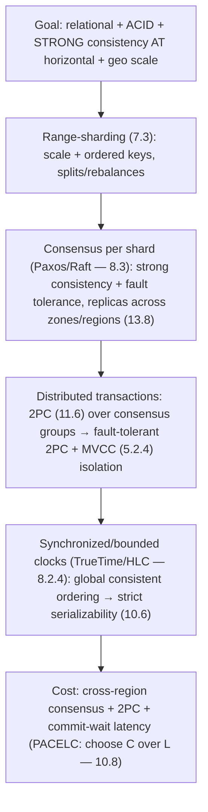
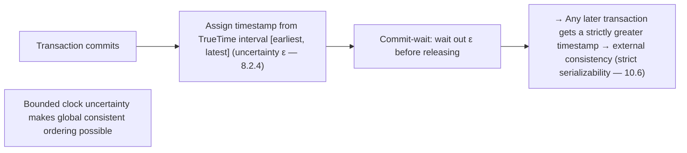

# Lesson 18.3 — Globally-Distributed SQL: Spanner/CockroachDB Lineage

> Part 18: Real-World Architectures · Difficulty: ⚫ · *Representative case study*
>
> **Prerequisites:** [5.2.1 ACID], [5.4.1 SQL/NoSQL/NewSQL], [8.2.4 HLC/TrueTime], [8.3.3 Raft], [10.6 Linearizability vs Serializability], [11.6 2PC].
> **Unlocks:** [Part 19 Interview Designs], [Part 20 Capstone (ledger)].

> **Integrity note:** Synthesizes the **publicly-documented design lineage** of globally-distributed "NewSQL" databases (Google Spanner, CockroachDB, YugabyteDB). **Representative** — design principles, not internal specs; no invented benchmarks.

---

## 1. Learning Objectives

After this lesson you will be able to:

- Explain **NewSQL / globally-distributed SQL** (5.4.1): the goal of **relational + ACID transactions + strong consistency** *at* **horizontal scale + geo-distribution** — "have your cake and eat it."
- Explain how **Spanner** achieves **externally-consistent (strict serializable — 10.6) distributed transactions** using **synchronized clocks (TrueTime — 8.2.4)** + **Paxos/Raft** (8.3) + **2PC** (11.6).
- Explain **CockroachDB/Yugabyte's** approach (Raft-replicated ranges + HLC — 8.2.4 — without atomic clocks).
- Trace the design: **sharded (range) + consensus-replicated + distributed transactions (2PC over consensus groups) + clock-based ordering**.
- Understand the **cost** (write latency from cross-region consensus/2PC + clock uncertainty waits) and when this family fits vs wide-column (18.2).

---

## 2. Motivation — Strong consistency AND horizontal scale AND global reach

The wide-column/Dynamo family (18.2) scales horizontally and stays available — but **gives up** joins, ACID transactions, and strong consistency (settling for AP/eventual — 10.7). For many workloads (finance, inventory, anything with **invariants** — 10.4/11.7), that's unacceptable: you **need** ACID transactions and strong consistency. Historically, that meant a **single-node (or single-primary) relational database** — which **doesn't scale horizontally** for writes and can't span the globe with strong consistency. This was seen as a **fundamental tradeoff** (CAP — 10.7): scale/availability **or** strong consistency, pick one.

**Globally-distributed SQL** (a.k.a. **NewSQL** — 5.4.1) — pioneered by **Google Spanner** and continued by **CockroachDB** and **YugabyteDB** — challenged that: **relational model + SQL + ACID transactions + strong (external/serializable) consistency**, *at* **horizontal scale across regions**. The breakthrough was solving **globally-consistent transaction ordering** without a single coordinator or unbounded latency. Spanner's famous trick: **TrueTime** (8.2.4) — GPS/atomic-clock-synchronized time with a **bounded uncertainty**, which lets nodes assign **globally-meaningful timestamps** and achieve **external consistency (strict serializability — 10.6)** by **waiting out the uncertainty**. CockroachDB/Yugabyte achieve similar guarantees using **Hybrid Logical Clocks (HLC — 8.2.4)** without special hardware. The design **composes**: **range-sharding** (7.3) + **consensus replication** (Paxos/Raft — 8.3) per shard + **distributed transactions (2PC — 11.6 — over consensus groups)** + **clock-based ordering** (8.2.4). This lesson synthesizes the globally-distributed-SQL lineage — *how* it delivers strong consistency at scale, and its cost — the strong-consistency counterpoint to 18.2. **(Representative.)**

---

## 3. Theory — The architecture, from first principles

### 3.1 The goal — NewSQL (5.4.1)

`[CS]` **NewSQL / globally-distributed SQL** aims to combine `[CS]`:
- **Relational model + SQL** — rich queries, **joins**, schemas (5.1.1) — the developer-friendly relational experience.
- **ACID transactions** (5.2.1) — including **distributed, multi-row, multi-shard** transactions with **serializable isolation** (5.2.2).
- **Strong consistency** — often **external consistency / strict serializability** (10.6 — linearizable + serializable).
- **Horizontal scale** — shard across many nodes (7.3), scale writes + data (unlike single-primary relational — 7.5/7.6).
- **Geo-distribution + HA** — span regions (13.8), survive node/zone/region failures (11.2).
- `[BP]` **The pitch:** "**don't choose between relational/ACID/strong-consistency and horizontal scale**" — get both. The historical belief was you **couldn't** (CAP — 10.7); NewSQL shows you can get **CP with good availability + scale** (choosing consistency under partition, but engineered for high availability otherwise — PACELC — 10.8). **(It's still CP — 10.7 — not magic; the cost is latency — §3.6.)**

### 3.2 Sharding — range-partitioned + consensus-replicated

`[CS]` Data is **sharded and replicated with consensus** `[CS]`:
- **Range sharding** (7.3): the keyspace is split into **ranges** (Spanner: directories/splits; Cockroach: ranges) → horizontal scale + **ordered** keys (range scans, unlike hash — 7.3). Ranges split/rebalance as they grow (7.4).
- **Consensus replication per shard** (8.3): **each shard/range is replicated across nodes via Paxos (Spanner) or Raft (Cockroach/Yugabyte)** (8.3.2/8.3.3) → within a shard, a **consensus group** (with a leader) provides **strongly-consistent, fault-tolerant** replication (a majority survives node/zone failures — 8.3.4/11.2). Spread replicas across **zones/regions** (13.8) for HA + geo.
- `[BP]` **Key difference from 18.2:** wide-column uses **leaderless quorums (AP, eventual — 10.1/10.9)**; NewSQL uses **consensus per shard (CP, strongly consistent — 8.3)**. Each shard is its own **Raft/Paxos group** → strong consistency **within** a shard by construction. The hard part is **transactions across shards** (§3.3).

### 3.3 Distributed transactions — 2PC over consensus groups

`[CS]` A transaction spanning **multiple shards** needs **atomicity across them** (5.2.1) `[CS]`:
- Within one shard, the consensus group gives atomic, consistent writes. Across shards, you need a **distributed transaction** → **Two-Phase Commit (2PC — 11.6)** coordinating the involved shards' consensus groups.
- **Why 2PC is viable here (unlike 11.6's warning to avoid it):** 2PC's fatal flaw is the **blocking problem** (coordinator crash → participants stuck — 11.6). NewSQL mitigates this by running **2PC over consensus groups**: the coordinator's state and each participant are **themselves consensus-replicated (Raft/Paxos)** → a crashed coordinator/participant is **recovered by its group** (no permanent block) → 2PC becomes **fault-tolerant**. (2PC handles **atomicity across shards**; consensus handles **fault tolerance within each shard**.)
- **Concurrency control** (5.2.4): typically **MVCC** (multi-version — snapshot reads) + locking / SSI for serializable isolation (5.2.2/5.2.4).
- `[BP]` **The composition:** **2PC (atomicity across shards) + consensus (fault tolerance per shard) + MVCC (isolation)** → **serializable distributed transactions** — using 2PC *safely* by removing its blocking weakness via consensus (11.6 said "avoid 2PC"; NewSQL says "make 2PC fault-tolerant with consensus").

### 3.4 The hard part — globally-consistent ordering (TrueTime)

`[CS]` The breakthrough: **ordering transactions consistently across the globe** without a single coordinator or unbounded latency (8.2.4) `[CS]`:
- **The problem:** to be **externally consistent / strictly serializable** (10.6), if transaction T1 commits before T2 **starts** (in real time), T1 must get an **earlier timestamp**. But clocks across data centers **disagree** (clock skew — 8.1.2) → you can't just use wall-clock time (LWW's flaw — 8.1.2).
- **Spanner's TrueTime** (8.2.4): GPS + atomic clocks give time as an **interval `[earliest, latest]`** with a **bounded uncertainty ε** ("the true time is somewhere in this window"). To commit, Spanner **assigns a timestamp and *waits out* the uncertainty (`commit wait` — wait ε)** before releasing the commit → guarantees that any transaction that starts later gets a **strictly greater** timestamp → **external consistency (strict serializability — 10.6)**. **Bounding + waiting out clock uncertainty** is the key idea.
- **CockroachDB/Yugabyte (no atomic clocks)** (8.2.4): use **Hybrid Logical Clocks (HLC)** — physical time + logical counter — to get causally-consistent, mostly-ordered timestamps, with mechanisms (uncertainty intervals, restarts) to handle skew → **serializable** (though the external-consistency guarantee is engineered differently without TrueTime's tight bound).
- `[BP]` **The insight:** **synchronized/bounded time (8.2.4)** turns the impossible-seeming "**global consistent ordering**" into "**assign a timestamp + wait out the (bounded) uncertainty**." This is why **TrueTime/HLC** (8.2.4) is the enabling technology — clocks, done right, provide global order.

### 3.5 Reads — snapshot/follower reads via MVCC + timestamps

`[BP]` NewSQL exploits **MVCC + globally-meaningful timestamps** for efficient reads `[BP]`:
- **Snapshot reads:** read at a **consistent timestamp** (MVCC — 5.2.4) → a read sees a consistent snapshot **without locking** (no read-write conflicts) → high read concurrency.
- **Follower/stale reads:** read from a **local replica** at a slightly-past timestamp (bounded staleness) → serve reads **locally** (low latency, avoid cross-region) when you can tolerate slight staleness (§3.6) — a key geo-latency optimization (13.8).
- `[BP]` The globally-meaningful timestamps (§3.4) make **consistent snapshot reads across shards** possible — a major advantage (consistent multi-shard reads without heavy locking).

### 3.6 The cost — latency (and when it fits)

`[BP]` NewSQL isn't free — the **cost is latency**, especially for cross-region writes `[BP]`:
- **Consensus latency** (8.3): a write must reach a **majority** of the consensus group → if replicas span **regions**, that's a **cross-region round-trip** per write (tens–hundreds of ms — 13.8) → **higher write latency** than a local single-primary or an AP leaderless write.
- **2PC latency** (§3.3): cross-shard transactions add coordination round-trips.
- **Commit-wait (Spanner)** (§3.4): waiting out clock uncertainty ε adds latency to commits (bounded, but real).
- `[BP]` **The fundamental trade** (PACELC — 10.8): NewSQL chooses **consistency**, paying **latency** (especially cross-region writes) — "**else, choose C over L**" (10.8). Mitigations: **keep data local** (partition by geography — 13.8 — so most transactions are single-region), **follower/stale reads** (§3.5) for local reads, and colocating related data in one shard (avoid cross-shard 2PC).
- **When it fits:** you **need relational + ACID + strong consistency AND horizontal/geo scale** — finance/ledgers (Part 20), inventory, anything with **invariants** (10.4) that can't tolerate the eventual consistency + conflicts of 18.2, but has outgrown a single-primary relational DB.
- **When it doesn't:** you **don't need** strong consistency/transactions (→ cheaper AP wide-column — 18.2, or a simpler relational DB — 5.4.1) — the latency + complexity cost isn't worth it; or extreme write-latency sensitivity where cross-region consensus is unacceptable.

### 3.7 Why it composes (and vs 18.2)

`[BP]` The synthesis (§2 goal → design) `[BP]`:
- **Goal:** relational + ACID + strong consistency **at** horizontal + geo scale.
- **→ Range-sharding** (7.3 — scale + ordered) + **consensus replication per shard** (Raft/Paxos — 8.3 — strong consistency + fault tolerance within a shard, spread across zones/regions — 13.8/11.2) + **distributed transactions (2PC — 11.6 — over consensus groups, made fault-tolerant)** + **MVCC** (5.2.4 — isolation, snapshot reads) + **synchronized/bounded clocks (TrueTime/HLC — 8.2.4 — global consistent ordering → strict serializability — 10.6)**.
- **vs 18.2 (wide-column/Dynamo):** the **opposite consistency choice** — 18.2 is **AP, leaderless, eventual, no cross-partition transactions, denormalized**; NewSQL is **CP, consensus, strongly consistent, distributed ACID transactions, relational/joins** — at the cost of **write latency** (§3.6). Both **shard for scale**, but 18.2 optimizes **availability + write throughput**, NewSQL optimizes **consistency + relational richness**. **Choose by requirement** (1.1.5): need strong consistency/transactions/joins → NewSQL; need max availability/write throughput + tolerate eventual → wide-column.
- `[BP]` NewSQL is the ultimate **composition of the distributed-systems fundamentals** (Parts 5/7/8/10/11): sharding + consensus + 2PC + MVCC + synchronized clocks → the "impossible" combination of ACID + strong consistency + horizontal/geo scale, paid for in latency.

---

## 4. Visual Intuition

### The design stack

### TrueTime commit-wait (bounding + waiting out uncertainty)

---

## 5. Real-World Analogy

Think of running a **single global bank's ledger** that must be **perfectly consistent everywhere** (no double-spends, strict order of transactions) **and** operate across **branches on every continent** — the thing a national bank does easily but a global one struggles with.

- **The goal — the "impossible" combination:** a corner bank keeps **one ledger book** — perfectly consistent, ordered, with atomic transactions (relational + ACID + strong consistency), but it can't serve the **whole planet** from one book (no horizontal/geo scale). A locker network (18.2) scales globally but **can't guarantee no double-spend** (AP/eventual). The global bank wants **both**: strict, ordered, atomic accounting **and** planet-scale.
- **Sharding + consensus = each account-range managed by a committee of branches:** the ledger is **split by account ranges** (range sharding), and each range is managed not by one branch but by a **committee of branches across regions that must vote to agree** on every change (consensus/Raft) — so it's **strongly consistent and survives any branch failing** (a majority still agrees). This is the opposite of "any locker can accept a deposit" (18.2's leaderless AP).
- **Distributed transactions = a transfer spanning two account-ranges:** moving money from an account in one range to another requires **both committees to commit atomically** — a **coordinated handshake** (2PC). Normally such a handshake is risky (if the coordinator vanishes mid-handshake, everyone's stuck holding — the 2PC blocking problem), but here **even the coordinator is a committee** (consensus-backed), so a vanished coordinator is **replaced by its committee** and the transfer completes — a **fault-tolerant** handshake.
- **TrueTime = globally-synchronized atomic clocks + "wait out the uncertainty":** the hardest problem is **agreeing on the order of transactions worldwide** when every branch's clock **disagrees slightly**. The bank installs **atomic clocks + GPS** so every branch knows the time to within a **tiny, known margin of error** (TrueTime's bounded uncertainty). To finalize a transaction, a branch **waits out that margin** before declaring it done — guaranteeing that **any transaction started later is definitely stamped later** → a **globally consistent order** (strict serializability). Banks without atomic clocks (Cockroach/Yugabyte) use a **clever logical-clock scheme** (HLC) to get nearly the same guarantee.
- **The cost — waiting on distant branches:** the price of all this agreement is **time**: a transaction touching branches on **other continents** must **wait for cross-ocean votes** (cross-region consensus latency) — much slower than a local corner bank. So the global bank **keeps each customer's accounts near them** (data locality — most transactions stay regional) and lets you **read slightly-old balances from your local branch** (follower reads) when you don't need the absolute latest.
- **The trade:** you get the **corner bank's strict correctness at planet scale** — but you **pay in latency** for anything that must be agreed across the globe. Worth it for a bank ledger (correctness is non-negotiable); overkill for a photo-sharing app (which would happily use the fast, always-available locker network — 18.2).

---

## 6. Industry Example

- **Google Spanner** `[CONV]`: globally-distributed SQL with **TrueTime** (8.2.4) → externally-consistent (strict serializable) distributed transactions; Paxos-replicated shards + 2PC (§3.2/3.3/3.4). *(Representative.)*
- **CockroachDB / YugabyteDB** `[CONV]`: Spanner-inspired, **Raft-replicated ranges + HLC** (8.2.4 — no atomic clocks), serializable distributed SQL (§3.2/3.4). *(Representative.)*
- **NewSQL category** `[CONV]`: relational + ACID + strong consistency **at** horizontal/geo scale (5.4.1) (§3.1). *(Representative.)*
- **2PC-over-consensus** `[CONV]`: making 2PC fault-tolerant by consensus-replicating coordinator + participants (§3.3, 11.6). *(Representative.)*
- **Data locality + follower reads** `[CONV]`: partitioning by geography + local stale reads to mitigate cross-region latency (§3.5/3.6, 13.8). *(Representative.)*

---

## 7. Implementation Details (architectural)

- **Choose NewSQL for the right profile** (§3.1/3.6): need **relational + ACID + strong consistency AND horizontal/geo scale** (finance, inventory, invariant-heavy — 10.4) beyond a single-primary DB.
- **Range-shard + consensus-replicate** (§3.2, 7.3/8.3): shards as Raft/Paxos groups, replicas spread across zones/regions (13.8/11.2).
- **Distributed transactions via 2PC-over-consensus + MVCC** (§3.3, 11.6/5.2.4): fault-tolerant 2PC across shards; MVCC for snapshot reads + serializable isolation.
- **Global ordering via synchronized/bounded clocks** (§3.4, 8.2.4): TrueTime (commit-wait) or HLC (uncertainty handling) → strict serializability / serializable (10.6).
- **Minimize the latency cost** (§3.6): **partition by geography** so most transactions are **single-region** (13.8); **colocate related data** in one shard (avoid cross-shard 2PC); **follower/stale reads** (§3.5) for local reads where slight staleness is OK.
- **Use follower reads + MVCC snapshots** (§3.5) for high read concurrency + geo-local reads.
- **Don't use it where it's overkill** (§3.6/3.7): no strong-consistency need → AP wide-column (18.2) or simple relational (5.4.1).

---

## 8. Advantages

- **Relational + ACID + strong consistency AT scale** — the "have your cake" combination (§3.1).
- **Distributed serializable transactions** — 2PC-over-consensus + MVCC (§3.3).
- **Strong (external) consistency** — strict serializability via TrueTime/HLC (§3.4, 10.6).
- **Horizontal + geo scale + HA** — range-sharding + consensus, survive zone/region failures (§3.2, 11.2/13.8).
- **Consistent snapshot + follower reads** — MVCC + global timestamps (§3.5).
- **Developer-friendly** — SQL, joins, schemas (§3.1).

---

## 9. Disadvantages / costs

- **Write latency** — cross-region consensus + 2PC + commit-wait (§3.6, 10.8) — the fundamental cost.
- **Complexity** — a very sophisticated system (consensus + 2PC + clocks) to build/operate (§3.7).
- **Still CP** — chooses consistency under partition; not infinitely available (§3.1, 10.7).
- **Cross-shard transactions are expensive** — colocate data to avoid (§3.3/3.6).
- **Cost** — the machinery (and, for Spanner, specialized clock hardware) (§3.4).
- **Overkill without strong-consistency needs** — cheaper options exist (§3.6, 18.2).

---

## 10. When NOT to use it

- **No strong-consistency/transaction need** → AP wide-column (18.2 — cheaper, more available) or simple relational (5.4.1) (§3.6).
- **Extreme write-latency sensitivity** across regions — cross-region consensus is unavoidable latency (§3.6).
- **Modest scale** — a single-node/single-primary relational DB is far simpler (5.4.1) (§3.6).
- **Availability-over-consistency workloads** — NewSQL is CP; use AP (18.2/10.7) (§3.1).
- **Mostly-cross-shard transactions** you can't colocate — the 2PC cost dominates (§3.3/3.6).

---

## 11. Common Mistakes

1. **Using it without a strong-consistency need** — paying latency/complexity for nothing (§3.6).
2. **Not partitioning by geography** — every transaction pays cross-region consensus (§3.6, 13.8).
3. **Excessive cross-shard transactions** — not colocating related data → 2PC everywhere (§3.3/3.6).
4. **Expecting AP availability** — it's CP (chooses consistency under partition) (§3.1, 10.7).
5. **Ignoring write latency** — surprised by cross-region write cost (§3.6).
6. **Treating it like a single-node DB** — ignoring the distributed-transaction/latency realities (§3.6).
7. **Choosing it at modest scale** — needless complexity (§3.6).

---

## 12. Interview Questions

**🟢 Easy**
- What is NewSQL / globally-distributed SQL, and what does it try to combine?
- How does it differ from the wide-column/Dynamo family (18.2)?

**🟡 Medium**
- How does Spanner achieve strong (external) consistency using TrueTime (8.2.4)? What is commit-wait?
- Why is 2PC viable in NewSQL despite 11.6's warning to avoid it?

**🔴 Hard**
- Trace the full design: range-sharding + consensus-per-shard + 2PC-over-consensus + MVCC + synchronized clocks. How does each part contribute?
- What is the fundamental cost (latency), why (cross-region consensus/2PC/commit-wait — PACELC — 10.8), and how do you mitigate it (data locality, follower reads)?

**⚫ Staff+**
- Design a globally-distributed SQL deployment for a financial ledger (ties to Part 20): sharding + geo-partitioning, consensus replication across regions, distributed transactions, clock-based ordering, follower reads, and the latency tradeoffs — and justify NewSQL over wide-column (18.2).
- Compare wide-column (18.2) and globally-distributed SQL (18.3) as the two ways to shard at scale: the opposite consistency choices (AP/leaderless/eventual vs CP/consensus/strong), what each gives up, and how to choose (1.1.5, requirements-driven).

---

## 13. Production Pitfalls

- **Cross-region write latency surprise:** replicas spanning regions made writes slow (cross-region consensus) — not localized (§3.6, 13.8).
- **Cross-shard 2PC hotspots:** transactions constantly spanning shards (not colocated) → high latency from 2PC (§3.3/3.6).
- **Expected availability, got CP:** under partition, the system chose consistency (unavailable for some writes) as designed — surprised the team (§3.1, 10.7).
- **Overkill adoption:** used NewSQL where an AP store (18.2) or simple relational DB would've been simpler/cheaper (§3.6).
- **Clock/uncertainty issues (non-TrueTime):** HLC-based systems hit transaction restarts under clock skew (§3.4, 8.2.4).
- **No geo-partitioning:** global data not partitioned by locality → every transaction paid global-consensus latency (§3.6).

---

## 14. Optimization Techniques

- **Geo-partition data by locality** (13.8) so most transactions are **single-region** (avoid cross-region consensus) (§3.6).
- **Colocate related data in one shard** to avoid cross-shard 2PC (§3.3/3.6).
- **Follower/stale reads + MVCC snapshots** for local, low-latency reads where slight staleness is OK (§3.5).
- **Consensus over sharded groups** for strong consistency + fault tolerance (§3.2, 8.3).
- **Synchronized/bounded clocks (TrueTime/HLC)** for global ordering → strict serializability (§3.4, 8.2.4).
- **Tune replica placement** (regions/zones) to balance HA vs write latency (13.8/11.2).
- **Use only where strong consistency + scale are both required** (§3.6) — otherwise cheaper options.

---

## 15. Summary

The wide-column/Dynamo family (18.2) scales and stays available but **gives up ACID transactions and strong consistency** (AP/eventual — 10.7) — unacceptable for **invariant-heavy** workloads (finance, inventory — 10.4/11.7) that **need** ACID + strong consistency, which historically meant a **single-primary relational DB** that **doesn't scale horizontally** or span the globe. **Globally-distributed SQL (NewSQL** — 5.4.1), pioneered by **Google Spanner** and continued by **CockroachDB/YugabyteDB**, challenges that supposed fundamental tradeoff: **relational model + SQL + ACID distributed transactions + strong (external/strict-serializable — 10.6) consistency**, *at* **horizontal scale across regions (13.8) with HA (11.2)** — "have your cake and eat it" (it's still **CP** — 10.7 — engineered for high availability + scale, paying in **latency** — PACELC's "choose C over L" — 10.8). The design **composes the fundamentals**: **range-sharding** (7.3 — scale + ordered keys) where **each shard is a consensus group (Paxos in Spanner, Raft in Cockroach/Yugabyte — 8.3)** replicated across zones/regions → **strong consistency + fault tolerance within a shard** (the opposite of 18.2's leaderless AP quorums); **distributed transactions across shards via 2PC (11.6) run over those consensus groups** — which makes 2PC **fault-tolerant** (its fatal blocking problem — 11.6 — is removed because the coordinator + participants are themselves consensus-replicated and recover from crashes), combined with **MVCC** (5.2.4) for snapshot reads + serializable isolation. The **breakthrough** is **globally-consistent transaction ordering** without a single coordinator or unbounded latency, solved by **synchronized/bounded clocks** (8.2.4): **Spanner's TrueTime** gives time as a bounded-uncertainty interval `[earliest, latest]` and achieves **external consistency (strict serializability — 10.6)** via **commit-wait** (assign a timestamp, then **wait out the uncertainty ε** so any later transaction gets a strictly greater timestamp), while **Cockroach/Yugabyte use Hybrid Logical Clocks (HLC)** to get serializable ordering **without atomic-clock hardware** — the enabling insight being that **bounded/synchronized time turns "global consistent ordering" into "assign a timestamp + wait out the (bounded) uncertainty."** Reads exploit **MVCC + globally-meaningful timestamps** for **consistent snapshot reads** (no locking) and **follower/stale reads** (read a local replica at slight staleness → geo-local low-latency reads — 13.8). The **cost is latency** — cross-region **consensus** + **2PC** + **commit-wait** make cross-region writes slow (tens–hundreds of ms — 13.8) — the fundamental PACELC trade (choose consistency, pay latency — 10.8), mitigated by **geo-partitioning data by locality** (most transactions single-region), **colocating related data** (avoid cross-shard 2PC), and **follower reads**. It **fits** workloads needing **relational + ACID + strong consistency AND horizontal/geo scale** (ledgers — Part 20, inventory, invariants) that have outgrown single-primary relational, and is **wrong** (overkill) where strong consistency isn't needed (→ cheaper AP wide-column — 18.2, or simple relational — 5.4.1) or where cross-region write latency is intolerable. NewSQL is the ultimate **composition of the distributed-systems fundamentals** (sharding + consensus + 2PC + MVCC + synchronized clocks — Parts 5/7/8/10/11) into the "impossible" combination — the **strong-consistency counterpoint** to 18.2's AP wide-column, chosen by requirement (1.1.5). **(Representative — Spanner/CockroachDB/Yugabyte lineage.)**

---

## 16. Revision Notes (flashcard-ready)

- **Q:** NewSQL goal? **A:** Relational + SQL + ACID distributed transactions + strong consistency AT horizontal + geo scale (have both).
- **Q:** vs wide-column (18.2)? **A:** NewSQL = CP/consensus/strongly-consistent/transactions/joins; 18.2 = AP/leaderless/eventual/no-cross-partition-txns. Opposite consistency choice.
- **Q:** Sharding/replication model? **A:** Range-sharded; each shard is a consensus group (Paxos/Raft) → strong consistency + fault tolerance within a shard.
- **Q:** Cross-shard transactions? **A:** 2PC over consensus groups → fault-tolerant 2PC (coordinator/participants consensus-replicated → recover, no permanent block).
- **Q:** Why is 2PC OK here (vs 11.6)? **A:** Its blocking problem is removed by running it over consensus groups that recover from crashes.
- **Q:** TrueTime? **A:** GPS/atomic-clock time as a bounded-uncertainty interval; commit-wait (wait out ε) → external consistency / strict serializability.
- **Q:** Cockroach/Yugabyte without atomic clocks? **A:** Hybrid Logical Clocks (HLC) + uncertainty handling → serializable ordering.
- **Q:** Key enabling insight? **A:** Bounded/synchronized time makes global consistent ordering possible ("assign timestamp + wait out uncertainty").
- **Q:** The fundamental cost? **A:** Latency — cross-region consensus + 2PC + commit-wait (PACELC: choose C over L).
- **Q:** Latency mitigations? **A:** Geo-partition by locality (single-region txns), colocate related data (avoid cross-shard 2PC), follower/stale reads.

---

## 17. Further Reading + Knowledge-Graph Links

**Foundations (in-platform):**
- **[5.4.1 SQL/NoSQL/NewSQL]** — the NewSQL category.
- **[8.2.4 HLC/TrueTime]** — the enabling clock technology.
- **[8.3.2/8.3.3 Paxos/Raft]** — consensus per shard.
- **[10.6 Linearizability vs Serializability]** — strict serializability.
- **[11.6 2PC]** — distributed transactions (made fault-tolerant here).
- **[5.2.4 MVCC]** — snapshot reads/isolation.

**Unlocks / next:**
- **[Part 19 Interview Designs]** — NewSQL vs NoSQL choices.
- **[Part 20 Capstone]** — the ledger's data-store choice.
- **[18.2 Wide-Column]** — the AP counterpoint.

**External (canonical):**
- Corbett et al., *Spanner: Google's Globally-Distributed Database* + TrueTime. *(Representative.)*
- CockroachDB / YugabyteDB architecture docs. *(Representative.)*
- Kleppmann, *Designing Data-Intensive Applications* — distributed transactions, consistency.

> **Knowledge-graph:** `7.3 range-sharding` + `8.3 consensus` + `11.6 2PC` + `5.2.4 MVCC` + `8.2.4 TrueTime/HLC` → **`18.3 globally-distributed SQL (Spanner/Cockroach)`** — strong-consistency counterpoint to `18.2 wide-column (AP)`.
