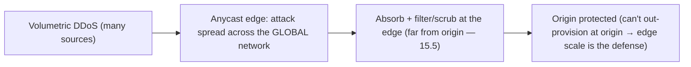

# Lesson 18.4 — CDN & Edge: Cloudflare-Style Architecture

> Part 18: Real-World Architectures · Difficulty: 🔴 · *Representative case study*
>
> **Prerequisites:** [3.2.4 DNS/Anycast], [3.3.3 CDNs], [6.5 Invalidation], [13.8 Multi-Region/Anycast], [15.5 DDoS/WAF].
> **Unlocks:** [Part 19 Interview Designs], [Part 20 Capstone (CDN)].

> **Integrity note:** Synthesizes the **publicly-documented design lineage** of CDN + edge platforms (Cloudflare-style, and CDNs generally). **Representative** — principles, not internal specs; no invented benchmarks.

---

## 1. Learning Objectives

After this lesson you will be able to:

- Explain the **CDN architecture**: a global network of **edge PoPs** caching content near users (3.3.3), reached via **anycast** (3.2.4/13.8).
- Explain how **anycast + a massive edge footprint** deliver **low latency** (serve from nearby), **DDoS absorption** (15.5), and **origin offload**.
- Explain the evolution from **static-content CDN → edge compute** (run code at the edge) and its use cases + constraints.
- Describe edge concerns: **cache invalidation** (6.5) at global scale, **origin shielding**, **TLS termination** (3.2.3), **security (WAF/DDoS — 15.5)**, and **consistency** of a globally-distributed cache.
- Recognize the edge as the **first tier** of many architectures and its tradeoffs.

---

## 2. Motivation — Bring the content (and the compute) to the user

Two physical realities shape web performance: the **speed of light** (a user far from your servers pays high round-trip latency — 3.1.3/1.1.3) and the **origin's finite capacity** (every request hitting your servers costs resources + risks overload — 7.6). A **CDN (Content Delivery Network)** attacks both by placing a **global network of edge servers (PoPs — Points of Presence)** physically **close to users** and **caching content there** (3.3.3) — so most requests are served from a **nearby edge** (low latency) **without touching the origin** (offload + resilience). CDNs are the **first tier** of nearly every large web system, and understanding their architecture ties together caching (Part 6), networking (Part 3), geo-distribution (13.8), and security (15.5).

Modern edge platforms (Cloudflare-style) go further in two ways. First, **reach**: a **massive footprint** of PoPs reached via **anycast** (3.2.4 — the same IP announced from everywhere, BGP routes users to the nearest — 13.8) gives **ubiquitous low latency** and, crucially, the capacity to **absorb DDoS attacks** (15.5 — a huge distributed network dilutes an attack far from the origin). Second, **compute**: the edge evolved from **caching static content** to **running code at the edge** (edge functions/workers) — executing logic **near the user** for dynamic personalization, routing, auth, and API responses without a round-trip to a distant origin. This lesson synthesizes the CDN/edge architecture — *why* it's shaped this way and how it composes caching + anycast + security + edge compute — a canonical real-world architecture. **(Representative — Cloudflare/CDN lineage.)**

---

## 3. Theory — The architecture, from first principles

### 3.1 The CDN core — edge PoPs caching near users

`[CS]` A **CDN** is a **globally-distributed network of edge servers (PoPs)** that **cache content close to users** (3.3.3) `[CS]`:
- **PoPs (Points of Presence):** edge data centers spread across cities/regions worldwide → **physically near** most users.
- **Edge caching** (Part 6/3.3.3): the PoP **caches** content (static assets, images, video, and increasingly dynamic/API responses) → a request is served from the **nearby PoP** (a cache hit) instead of the distant **origin** → **low latency** (short round-trip — 3.1.3/1.1.3) + **origin offload** (the origin sees far fewer requests — 7.6 relief).
- **Cache miss → fetch from origin** (3.3.3): on a miss, the PoP fetches from the origin (or a mid-tier — §3.4), caches it, and serves subsequent requests locally.
- `[BP]` **The two wins** (3.3.3): **latency** (serve near the user) + **offload/resilience** (protect the origin — most traffic never reaches it). This is caching (Part 6) applied **geographically** at planetary scale.

### 3.2 Anycast — routing users to the nearest PoP

`[CS]` How users reach the **nearest** PoP: **anycast** (3.2.4/13.8) `[CS]`:
- **Anycast:** the **same IP address is announced from all PoPs**; **BGP routing** naturally sends each user to the **topologically nearest** PoP → automatic **nearest-PoP routing** without per-user logic, and if a PoP fails/withdraws its announcement, traffic **reroutes** to the next-nearest (fast failover — 13.8).
- Contrast **GeoDNS** (3.2.4 — resolve to a region by geo-IP, limited by DNS caching/TTL); anycast is at the **routing layer**, more responsive.
- `[BP]` **Why it matters:** anycast + a **large PoP footprint** = **ubiquitous low latency** (everyone is near *some* PoP) + **automatic failover** + the foundation of **DDoS absorption** (§3.5 — attack traffic is spread across the whole anycast network, far from the origin). Anycast is the **routing backbone** of the edge.

### 3.3 The evolution to edge compute

`[CS]` CDNs evolved from **caching static content** to **running code at the edge** `[CS]`:
- **Static CDN (original):** cache static assets (images, JS/CSS, video) — great, but **dynamic/personalized** content couldn't be cached (every user's response differs) → still hit the origin.
- **Edge compute (edge functions/workers):** run **application code at the PoP** (near the user) — a lightweight, sandboxed runtime executing per-request logic → do **dynamic work at the edge** without a round-trip to a distant origin: **personalization**, **A/B testing**, **auth/token validation** (15.2), **request routing/rewriting**, **API aggregation** (12.4/12.6), **rate limiting** (15.7), even **rendering** and **serving dynamic responses**.
- **Edge data:** edge key-value/state stores (eventually-consistent, globally-replicated — 10.5) + caching let edge code access data locally.
- `[BP]` **Why:** it pushes **more of the request path to the edge** (near the user) → lower latency for **dynamic** content too, offloads more from the origin, and enables new patterns (edge auth, edge routing). **Constraints:** edge runtimes are **limited** (short execution, sandboxed, limited memory/state — designed for lightweight per-request logic, not heavy computation) and edge **data is eventually consistent** (§3.6) → not for everything. It's the **frontier** of the architecture.

### 3.4 Origin shielding + hierarchical caching

`[BP]` Protecting the origin at scale (Part 6/3.3.3) `[BP]`:
- **The thundering-herd risk** (6.7): if a popular object **expires** or isn't cached, **many PoPs** might simultaneously fetch from the origin → **origin overload** (6.7 stampede, geographically multiplied).
- **Origin shielding / hierarchical caching:** insert a **mid-tier** cache layer — edge PoPs fetch misses from a **regional/shield cache**, not directly from the origin → the origin sees requests from a **few shields**, not thousands of PoPs → **massive origin offload** + stampede protection (6.7). A **cache hierarchy** (browser → edge PoP → shield → origin — 6.2).
- **Request coalescing** (6.7): a PoP experiencing many simultaneous misses for the same object makes **one** origin request (single-flight — 6.7), not many.
- `[BP]` These protect the origin — the whole point of a CDN is that the origin sees **minimal** traffic; hierarchical caching + coalescing + shielding ensure a cache miss doesn't become an **origin stampede**.

### 3.5 Security at the edge — DDoS + WAF

`[CS]` The edge is the natural place for **security** (15.5) `[CS]`:
- **DDoS absorption** (15.5): a **volumetric DDoS** can't be out-provisioned at the origin — but a **massive anycast edge network** **absorbs + disperses** attack traffic across its global capacity, **far from the origin**, filtering it at the edge (scrubbing) → the origin is protected. **The edge's scale IS the DDoS defense** (§3.2, 15.5).
- **WAF** (15.5): the edge inspects/filters L7 traffic (SQLi/XSS/OWASP — 15.6) **before** it reaches the origin.
- **TLS termination** (3.2.3): terminate TLS at the edge (near the user → faster handshake) + re-encrypt to the origin.
- **Bot management, rate limiting** (15.7): applied at the edge.
- `[BP]` The edge is a **security perimeter + first line of defense** (though not the only one — defense in depth — 15.1): it absorbs volumetric attacks, filters malicious requests, and terminates TLS — all **before** traffic reaches the origin. This is a major reason to front everything with a CDN/edge.

### 3.6 Cache invalidation + consistency at global scale

`[CS]` The hard part of a global cache: **invalidation** (6.5 — "one of the two hard things") `[CS]`:
- **The challenge:** content changes at the origin, but **stale copies** are cached across **thousands of PoPs worldwide** → how do you update/invalidate them **quickly + globally**?
- **Strategies** (6.5): **TTLs** (expire after a time — simple, but stale until expiry), **purge/invalidation** (push an invalidation to all PoPs — near-instant but must propagate globally), **versioned URLs / cache-busting** (change the URL when content changes → new URL = guaranteed fresh — 6.5, common for static assets), **cache tags** (invalidate groups — 6.5), **stale-while-revalidate** (serve stale + refresh in background).
- **Consistency** (10.5): a global edge cache is **eventually consistent** — after an origin change, PoPs converge to fresh content over the propagation delay. Acceptable for most content (with a **staleness budget** — 6.5); **read-your-writes** (10.3) needs care for user-specific dynamic content.
- `[BP]` **Global invalidation is genuinely hard** (6.5 at planetary scale) — propagating a purge to thousands of PoPs fast, or accepting TTL-bounded staleness. **Versioned URLs** sidestep it for static assets (immutable → cache forever, change the URL to update). Design the **staleness budget** (6.5) per content type.

### 3.7 Why it composes (the edge as the first tier)

`[BP]` The CDN/edge is the **first tier** of most large systems, composing many fundamentals `[BP]`:
- **Caching (Part 6) applied geographically** — edge PoPs cache near users (§3.1); hierarchical caching + coalescing protect the origin (§3.4/6.7).
- **Anycast (3.2.4/13.8)** routes users to the nearest PoP → ubiquitous low latency + failover (§3.2).
- **Security (15.5)** — DDoS absorption + WAF + TLS termination at the edge (§3.5).
- **Edge compute** pushes dynamic logic near the user (§3.3).
- **Origin** (your actual application/data — often multi-region — 13.8) sits behind, protected + offloaded.
- `[BP]` **The pattern:** **user → (anycast) → nearest edge PoP [cache + edge compute + security] → (shield) → origin.** The edge handles the **majority of traffic** (cache hits, static content, DDoS, security), the origin handles the **irreducible dynamic core**. Nearly every large web system fronts itself with a CDN/edge — it's the **default first tier** for latency, scale, resilience, and security. **Tradeoffs:** eventual consistency / invalidation complexity (§3.6), edge-compute constraints (§3.3), and (for a third-party CDN) dependency/cost.

---

## 4. Visual Intuition

### The edge as the first tier

```mermaid
flowchart TB
    USER["Users worldwide"] -->|anycast: nearest PoP (3.2.4/13.8)| POP["Edge PoP: cache (Part 6) + edge compute + WAF/DDoS/TLS (15.5)"]
    POP -->|cache HIT (most traffic)| USER
    POP -->|cache MISS| SHIELD["Regional shield cache (origin shielding — 6.7)"]
    SHIELD -->|miss| ORIGIN["Origin (app + data, multi-region — 13.8)"]
    note["Edge serves most traffic (cache/static/dynamic-edge) + absorbs DDoS; origin sees minimal, protected traffic"]
```

### DDoS absorption via the anycast edge



---

## 5. Real-World Analogy

Think of a global retailer that, instead of shipping every order from **one central warehouse**, opens **thousands of neighborhood stores** stocked with popular goods — and eventually lets those stores **do light assembly** too.

- **One central warehouse (origin only):** if every customer worldwide ordered from **one warehouse**, faraway customers wait **days for shipping** (high latency — speed of light) and the **warehouse is overwhelmed** on a busy day (origin overload). Terrible.
- **Neighborhood stores = edge PoPs caching near users:** the retailer opens **local stores everywhere**, each **stocked with the popular items** (edge cache). Now most customers get what they want **instantly from the store around the corner** (low latency), and the **central warehouse barely gets touched** (origin offload) — it only ships the **rare item not in local stock** (cache miss).
- **Anycast = "go to your nearest store" automatically:** customers don't look up which store to visit — the **road network naturally routes them to the closest one** (anycast/BGP), and if a store closes, they're **automatically directed to the next-nearest** (failover). Everyone is near *some* store.
- **Origin shielding = regional depots, not everyone calling the warehouse:** if a **hot new item** isn't in local stock, you don't want **all thousand stores phoning the central warehouse at once** (origin stampede) — so stores restock from **regional depots** (shield caches), and the warehouse only fields requests from a **handful of depots**, not thousands of stores.
- **Edge compute = stores do light assembly/personalization:** originally stores only sold **pre-made goods** (static content). Now they can do **light on-site assembly and personalization** — gift-wrap, engrave a name, assemble a custom order **on the spot** (edge functions) — so even **customized orders** are handled locally without shipping from the warehouse. But the local store **can't do heavy manufacturing** (edge-compute constraints) — that still needs the factory.
- **Security = the stores are the front door and the bouncers:** a **mob trying to overwhelm the retailer** (DDoS) hits the **thousands of stores spread across the country**, which **absorb and disperse the crowd** far from the vulnerable central warehouse (you can't stop a mob at one warehouse door, but a thousand storefronts can soak it up). The stores also **check IDs and turn away troublemakers** (WAF/bot filtering) before anyone reaches the back office.
- **Invalidation = updating stock across thousands of stores:** the hard part — when an item **changes** (new price, recalled product), you must **update every store's shelves worldwide**, which takes time (eventual consistency). You either **let old stock sell until it expires** (TTL), **send an urgent recall notice to all stores** (purge), or **give the new version a new product code** so the old shelf-code is simply never restocked (versioned URLs). Coordinating a global shelf update is genuinely hard.

---

## 6. Industry Example

- **Cloudflare / major CDNs** `[CONV]`: massive anycast PoP networks for edge caching, DDoS absorption, WAF, TLS, and edge compute (§3.1–3.5). *(Representative.)*
- **Anycast routing** `[CONV]`: same-IP-from-everywhere + BGP nearest-PoP routing + fast failover (§3.2, 3.2.4/13.8). *(Representative.)*
- **Edge functions/workers** `[CONV]`: lightweight sandboxed code at the edge for dynamic/personalized/auth/routing logic (§3.3). *(Representative.)*
- **Origin shielding + request coalescing** `[CONV]`: hierarchical caching to protect the origin from stampedes (§3.4, 6.7). *(Representative.)*
- **Edge DDoS absorption + WAF** `[CONV]`: the anycast network's scale as the volumetric-DDoS defense + L7 filtering (§3.5, 15.5). *(Representative.)*
- **Versioned URLs / cache-busting** `[CONV]`: immutable static assets with content-hashed URLs to sidestep invalidation (§3.6, 6.5). *(Representative.)*

---

## 7. Implementation Details (architectural)

- **Front everything with a CDN/edge** (§3.7): user → anycast → nearest PoP (cache + edge compute + security) → shield → origin.
- **Cache aggressively at the edge** (§3.1, Part 6/3.3.3): static assets (long TTL / versioned URLs — 6.5), and dynamic/API responses where cacheable (with short TTL / edge logic).
- **Use anycast** (§3.2, 3.2.4/13.8) for nearest-PoP routing + fast failover.
- **Origin shielding + request coalescing** (§3.4, 6.7): hierarchical caching (edge → shield → origin) + single-flight to prevent origin stampedes.
- **Edge compute** (§3.3) for dynamic-near-user logic (personalization, auth — 15.2, routing, API aggregation — 12.4/12.6, rate limiting — 15.7) — within runtime constraints (lightweight, eventually-consistent edge data).
- **Security at the edge** (§3.5, 15.5): DDoS absorption, WAF (15.6), TLS termination (3.2.3), bot/rate-limiting (15.7).
- **Design invalidation + staleness budget** (§3.6, 6.5): TTLs, purge/invalidation, **versioned URLs** for immutable assets, cache tags, stale-while-revalidate; accept eventual consistency (10.5).
- **Multi-region origin behind it** (13.8) for origin resilience.

---

## 8. Advantages

- **Low latency** — serve from the nearest PoP (§3.1/3.2).
- **Origin offload + resilience** — most traffic never hits the origin (§3.1/3.4, 7.6).
- **DDoS absorption** — the anycast edge's scale defends the origin (§3.5, 15.5).
- **Security perimeter** — WAF + TLS + bot/rate-limiting at the edge (§3.5).
- **Dynamic at the edge** — edge compute for near-user logic (§3.3).
- **Automatic failover** — anycast reroutes on PoP failure (§3.2, 13.8).

---

## 9. Disadvantages / costs

- **Cache invalidation is hard at global scale** — stale content across thousands of PoPs (§3.6, 6.5).
- **Eventual consistency** — edge caches/data lag the origin (§3.6, 10.5).
- **Edge-compute constraints** — lightweight/sandboxed, limited state, not for heavy computation (§3.3).
- **Dynamic/personalized content is harder to cache** (though edge compute helps) (§3.3/3.6).
- **Third-party dependency + cost** — reliance on the CDN provider; egress/edge-compute cost (17.6).
- **Complexity** — cache hierarchy, invalidation, edge logic to manage (§3.4/3.6).

---

## 10. When NOT to / cautions

- **Highly dynamic, uncacheable, per-user content** — limited CDN benefit (though edge compute + micro-caching can help) (§3.3/3.6).
- **Strong-consistency read needs** — edge caches are eventually consistent (§3.6, 10.5).
- **Heavy computation** — doesn't fit edge-compute constraints; keep at the origin (§3.3).
- **Internal/small systems** — a CDN is for public, geographically-distributed, high-traffic content (§3.7).
- **Don't rely on the edge as the only security layer** — defense in depth (§3.5, 15.1).

---

## 11. Common Mistakes

1. **No origin shielding / coalescing** → cache misses become an origin stampede (§3.4, 6.7).
2. **Poor invalidation** → stale content served globally (§3.6, 6.5).
3. **Not versioning static assets** → invalidation pain (should use content-hashed URLs) (§3.6, 6.5).
4. **Over-heavy edge compute** → hitting runtime constraints (§3.3).
5. **Assuming edge consistency** → serving stale where freshness required (§3.6, 10.5).
6. **Edge as the only security layer** → no defense in depth (§3.5, 15.1).
7. **Not caching cacheable dynamic/API responses** → needless origin load (§3.1/3.3).
8. **Ignoring the third-party dependency/cost** (§3.9, 17.6).

---

## 12. Interview Questions

**🟢 Easy**
- What is a CDN, and what two problems does it solve (latency + origin offload)?
- How does anycast route users to the nearest PoP?

**🟡 Medium**
- How does a CDN protect the origin (shielding, coalescing, DDoS absorption)?
- What is edge compute, and what can/can't you do at the edge?

**🔴 Hard**
- Why is cache invalidation hard at global scale, and what strategies address it (TTL/purge/versioned URLs/tags — 6.5)?
- Why is the anycast edge the effective defense against volumetric DDoS (15.5)?

**⚫ Staff+**
- Design a CDN/edge tier for a global web application: anycast routing, edge caching (static + dynamic + edge compute), origin shielding, security (DDoS/WAF/TLS), invalidation/consistency, and the multi-region origin behind it (13.8) — with tradeoffs.
- Compare serving dynamic/personalized content via origin round-trips vs edge compute + edge data: latency, consistency, and constraints.

---

## 13. Production Pitfalls

- **Origin stampede:** a popular object expired and thousands of PoPs hit the origin simultaneously (§3.4, 6.7) — needed shielding/coalescing.
- **Stale content served globally:** an origin update didn't propagate/purge fast enough → users saw old content (§3.6, 6.5).
- **Cache-key mistakes:** caching per-user/dynamic content with a bad key → serving one user's content to others (§3.6, correctness).
- **Edge-compute limits hit:** heavy logic exceeded edge runtime constraints (timeouts/memory) (§3.3).
- **Volumetric DDoS at the origin:** content not fronted by the edge → the origin was overwhelmed (§3.5, 15.5).
- **Consistency surprise:** relied on the edge cache for data that needed to be fresh (§3.6, 10.5).

---

## 14. Optimization Techniques

- **Anycast + large PoP footprint** for ubiquitous low latency + failover (§3.2, 13.8).
- **Aggressive edge caching + versioned URLs** for static; **micro-caching / edge compute** for dynamic (§3.1/3.3/3.6).
- **Origin shielding (hierarchical caching) + request coalescing** to protect the origin (§3.4, 6.7).
- **Edge compute** for near-user dynamic logic (personalization/auth/routing/aggregation) (§3.3).
- **Security at the edge** (DDoS absorption + WAF + TLS termination) (§3.5, 15.5).
- **Stale-while-revalidate + staleness budgets** for freshness vs performance (§3.6, 6.5).
- **Multi-region origin** behind the edge for resilience (13.8).

---

## 15. Summary

Two physical realities shape web performance — the **speed of light** (distant users pay high round-trip latency — 3.1.3/1.1.3) and the **origin's finite capacity** (every request costs resources + risks overload — 7.6) — and a **CDN** attacks both by placing a **global network of edge servers (PoPs)** **physically near users** and **caching content there** (3.3.3), so most requests are served from a **nearby PoP** (low latency) **without touching the origin** (offload + resilience) — caching (Part 6) applied **geographically** at planetary scale, with cache misses fetched from the origin (or a shield — §3.4). Users reach the **nearest** PoP via **anycast** (3.2.4/13.8 — the same IP announced from all PoPs, BGP routing each user to the topologically-nearest, with automatic **failover** when a PoP withdraws) — so a **large footprint + anycast** gives **ubiquitous low latency**, **automatic failover**, and the foundation of **DDoS absorption**. Modern edge platforms (Cloudflare-style) evolved from **caching static content** to **edge compute** — running lightweight, sandboxed code **at the PoP** for **dynamic-near-user** logic (personalization, A/B testing, auth — 15.2, routing/rewriting, API aggregation — 12.4/12.6, rate limiting — 15.7, dynamic responses) — pushing more of the request path to the edge (lower latency for dynamic content, more origin offload), **constrained** by limited runtime (short execution, sandboxed, limited state) and **eventually-consistent** edge data (§3.6). The origin is protected by **origin shielding + hierarchical caching** (edge → **regional shield** → origin) + **request coalescing** (single-flight — 6.7) so a cache miss doesn't become an **origin stampede** (6.7 geographically multiplied). The edge is the natural **security perimeter** (15.5): a **volumetric DDoS can't be out-provisioned at the origin**, but the **massive anycast network absorbs + disperses + scrubs** attack traffic **far from the origin** (**the edge's scale IS the DDoS defense**), plus **WAF** (L7 filtering — 15.6), **TLS termination** (3.2.3 — near the user), and bot/rate-limiting (15.7) — all before traffic reaches the origin (though not the only layer — defense in depth — 15.1). The hard part is **global cache invalidation** (6.5 — "one of the two hard things" at planetary scale): stale copies across thousands of PoPs → addressed by **TTLs** (stale-until-expiry), **purge/invalidation** (propagate globally), **versioned/content-hashed URLs** (immutable → cache forever, change the URL to update — sidesteps invalidation for static assets), **cache tags**, and **stale-while-revalidate** — accepting **eventual consistency** (10.5) with a designed **staleness budget** (6.5). The composition — **user → (anycast) → nearest edge PoP [cache + edge compute + security] → (shield) → origin (multi-region — 13.8)** — makes the edge the **default first tier** of nearly every large web system, handling the **majority of traffic** (cache hits, static, dynamic-at-edge, DDoS, security) while the origin handles the **irreducible dynamic core** — composing caching + anycast + geo-distribution + security + edge compute, with tradeoffs of eventual consistency/invalidation complexity, edge-compute constraints, and third-party dependency/cost (17.6). **(Representative — Cloudflare/CDN lineage.)**

---

## 16. Revision Notes (flashcard-ready)

- **Q:** What does a CDN solve? **A:** Latency (serve from nearby edge PoPs) + origin offload/resilience (most traffic never hits the origin).
- **Q:** Anycast? **A:** Same IP from all PoPs; BGP routes users to the nearest; automatic failover — ubiquitous low latency (3.2.4/13.8).
- **Q:** Edge compute? **A:** Lightweight sandboxed code at the PoP for dynamic-near-user logic (personalization/auth/routing/aggregation); constrained runtime + eventually-consistent edge data.
- **Q:** Origin shielding? **A:** Hierarchical caching (edge → shield → origin) + request coalescing → prevents cache misses becoming an origin stampede (6.7).
- **Q:** How does the edge stop DDoS? **A:** The anycast network's global scale absorbs/disperses/scrubs volumetric attacks far from the origin (can't out-provision at origin).
- **Q:** Edge security functions? **A:** DDoS absorption + WAF (L7) + TLS termination + bot/rate-limiting (15.5) — before traffic reaches the origin.
- **Q:** Why is CDN invalidation hard? **A:** Stale copies across thousands of PoPs worldwide; propagating purges/updates fast is hard (6.5 at planetary scale).
- **Q:** Invalidation strategies? **A:** TTLs, purge, versioned/content-hashed URLs (static), cache tags, stale-while-revalidate.
- **Q:** Consistency model? **A:** Eventually consistent (edge lags origin); design a staleness budget (6.5); care for read-your-writes (10.3).
- **Q:** The composition/first tier? **A:** User → anycast → nearest PoP [cache + edge compute + security] → shield → multi-region origin.

---

## 17. Further Reading + Knowledge-Graph Links

**Foundations (in-platform):**
- **[3.3.3 CDNs]** / **[3.2.4 DNS/Anycast]** — edge caching + anycast routing.
- **[Part 6 Caching]** / **[6.5 Invalidation]** / **[6.7 Stampede]** — caching + invalidation + origin protection.
- **[13.8 Multi-Region/Anycast]** — geo-distribution + failover.
- **[15.5 DDoS/WAF]** — edge security.
- **[3.2.3 TLS]** — TLS termination.

**Unlocks / next:**
- **[Part 19 Interview Designs]** — CDN as a first tier in designs.
- **[Part 20 Capstone]** — CDN/edge for the platform.

**External (canonical):**
- Cloudflare / Fastly / Akamai architecture write-ups. *(Representative.)*
- CDN + anycast + edge-compute documentation. *(Representative.)*

> **Knowledge-graph:** `3.3.3 CDN` + `3.2.4 anycast` + `Part 6 caching/6.7 stampede` + `15.5 DDoS/WAF` + `13.8 geo` → **`18.4 CDN & edge (Cloudflare-style)`** → the default first tier; `Part 19–20`.
