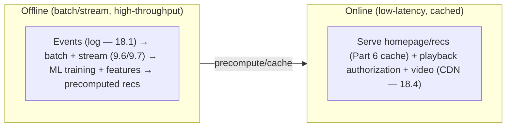

# Lesson 18.5 — Streaming & Recommendations: Netflix-Style Architecture

> Part 18: Real-World Architectures · Difficulty: 🔴⚫ · *Representative case study*
>
> **Prerequisites:** [3.3.3 CDNs], [6.x Caching], [11.3 Resilience], [12.x Microservices], [13.x Cloud Native], [18.1 Log], [18.4 CDN].
> **Unlocks:** [Part 19 Interview Designs], [Part 20 Capstone].

> **Integrity note:** Synthesizes the **publicly-documented design lineage** of large-scale video streaming + recommendations (Netflix-style, and streaming platforms generally). **Representative** — principles, not internal specs; no invented benchmarks.

---

## 1. Learning Objectives

After this lesson you will be able to:

- Design a **large-scale video-streaming platform**: **video delivery** (CDN/edge — 18.4, adaptive bitrate), the **control plane** (microservices — 12.x on cloud-native infra — 13.x), and **data/recommendations** (streaming — 18.1, ML).
- Explain **adaptive bitrate streaming (ABR)** + **pre-positioning content at the edge** — why video is served from a massive CDN, not the origin.
- Explain the **microservices + resilience** control plane (12.x/11.3) and the origin of **Chaos Engineering** (14.8) here.
- Describe the **recommendation pipeline**: event collection (18.1 log), batch + stream processing (9.6/9.7), ML models, and serving.
- Synthesize how streaming composes **CDN + microservices + cloud-native + data/ML + resilience** into one architecture.

---

## 2. Motivation — Deliver petabytes of video AND personalize for hundreds of millions

A global video-streaming service is really **three large systems fused**: (1) **video delivery** — streaming **enormous volumes of video** to hundreds of millions of users worldwide at low latency + high quality, which dominates internet bandwidth; (2) a **control plane** — the app (browse, search, play, account, billing) built as **microservices** (12.x) on **cloud-native infrastructure** (13.x) with heavy **resilience** (11.3); and (3) **data + recommendations** — collecting massive behavioral data and using **ML** to **personalize** what each user sees (the homepage, "because you watched," rankings). Each is a masterclass in the fundamentals, and together they're a canonical composition of nearly the whole course.

The design choices follow directly from the requirements. **Video is huge + latency/quality-sensitive** → serve it from a **massive CDN/edge** (18.4), **pre-positioned** near users, using **adaptive bitrate** (adjust quality to the user's bandwidth). The **control plane must be highly available + evolvable at scale** → **microservices** (12.x) on cloud-native infra (13.x) with **resilience patterns** (11.3) — indeed, the discipline of **Chaos Engineering** (14.8) famously originated in this context to prove the system survives failures. **Recommendations need massive-scale data + ML** → an **event-collection pipeline** (the distributed log — 18.1) feeding **batch + stream processing** (9.6/9.7) and **ML models** whose outputs are **served** with low latency (caching — Part 6). This lesson synthesizes the streaming-platform architecture — how video delivery + microservices + cloud-native + data/ML + resilience compose — as a capstone real-world example. **(Representative — Netflix/streaming lineage.)**

---

## 3. Theory — The architecture, from first principles

### 3.1 The three subsystems

`[CS]` A streaming platform decomposes into three large subsystems `[CS]`:
- **Video delivery (data plane):** getting the **bytes of video** to the player — dominated by **CDN/edge** (18.4) + adaptive bitrate (§3.2). This is the **bandwidth-heavy** part.
- **Control plane (the app):** everything **except** the video bytes — browse, search, play initiation, account, billing, device management — built as **microservices** (12.x) on cloud-native infra (13.x). The **request-heavy, evolvable** part (§3.3).
- **Data + recommendations:** collecting behavioral events + producing **personalized** experiences via **ML** (§3.4/3.5). The **data-heavy, analytical** part.
- `[BP]` **Key architectural insight:** **separate the video data plane (CDN) from the control plane (microservices)** — video is served by the **CDN** (cheap, scalable, near-user), while the control plane handles the **API/logic** — they scale + fail independently. Don't stream video through your microservices (§3.2).

### 3.2 Video delivery — CDN/edge + adaptive bitrate

`[CS]` Video delivery is a **CDN/edge** problem (18.4) `[CS]`:
- **Massive CDN + pre-positioning:** video files are **pre-positioned** (pushed ahead of time) onto **edge servers near users** (18.4 — often deep inside ISP networks) → users stream from a **nearby edge**, not a distant origin → **low latency, high throughput, origin offload** (18.4/7.6). Because video catalogs are **predictable** (you know popular titles), content is **proactively cached** at the edge (unlike reactive web caching).
- **Adaptive Bitrate Streaming (ABR):** video is **encoded at multiple bitrates/resolutions** and split into **small segments**; the player **dynamically picks the bitrate** matching the user's **current bandwidth** (segment by segment) → smooth playback (lower quality on a poor connection instead of buffering; higher on a good one). Protocols: HLS/DASH (representative).
- `[BP]` **Why:** video is **too big + bandwidth/latency-sensitive** to serve from an origin → **CDN edge is mandatory** (18.4); **pre-positioning** exploits predictable demand; **ABR** adapts to variable client networks. This subsystem is **18.4 (CDN) specialized for video**.

### 3.3 Control plane — microservices + resilience

`[CS]` The app (browse/search/play/account) is a **microservices control plane** (12.x) `[CS]`:
- **Microservices** (12.x): decomposed by capability (browse, search, playback-authorization, account, billing, viewing-history, ...) → **independent teams + deploys** (12.1), independent scaling (7.1) — at massive organizational scale (12.1's org driver).
- **Cloud-native infra** (13.x): containers (13.2) + orchestration (13.3) + autoscaling (13.5) + multi-region (13.8) → elastic, self-healing, globally-deployed.
- **API gateway / BFF** (12.6): a gateway (or per-device BFFs — 12.6) fronts the services, aggregating for each client (TV/mobile/web).
- **Resilience is paramount** (11.3): with hundreds of services, **partial failures are constant** → aggressive **timeouts/retries/circuit-breakers/bulkheads** (11.3) + **graceful degradation** (11.4 — if recommendations fail, show a fallback row, don't fail the whole page). **A dependency failing must not stop playback.**
- **Chaos Engineering originated here** (14.8): to *prove* resilience at this scale, deliberately **injecting failures in production** (Chaos Monkey — 14.8) — the practice was born from operating this kind of system.
- `[BP]` The control plane is a **textbook microservices-on-cloud-native architecture** (Parts 12/13) with **resilience** (11.3/11.4) and **chaos** (14.8) as first-class — because at this scale, **failure is constant** and the system must **degrade, not collapse**.

### 3.4 Data pipeline — events on a log

`[CS]` Personalization + analytics require **massive data collection + processing** (18.1) `[CS]`:
- **Event collection:** every user interaction (plays, pauses, browses, searches, ratings) is emitted as **events** into a **distributed log** (18.1/9.3) → a firehose of behavioral data.
- **Batch + stream processing** (9.6/9.7): the events feed **batch pipelines** (large-scale analytics, model training — historical) + **stream pipelines** (real-time features, near-real-time updates — 9.6) — a Lambda/Kappa-style setup (9.7).
- **Data lake / warehouse:** events land in scalable storage (object storage — 4.1.3, warehouse) for analytics + ML training.
- `[BP]` The **log-centric data architecture** (18.1) is the backbone: events collected once, consumed by many pipelines (analytics, recommendations, monitoring, A/B testing). This is **18.1 applied** to behavioral data at scale.

### 3.5 Recommendations — ML models + serving

`[CS]` Personalization via **ML** (the recommendation system) `[CS]`:
- **Offline (batch) training:** ML models (collaborative filtering, deep learning — representative) trained on the **historical event data** (§3.4) → predict what each user will like.
- **Feature pipelines:** compute **features** (user history, content metadata, context) — batch + real-time (9.6).
- **Serving:** precompute + **cache** recommendations (Part 6) so the homepage loads **fast** (a recommendation-serving service returns each user's personalized rows with low latency — often precomputed/cached, refreshed periodically + adjusted in real-time).
- **A/B testing** (14.7): recommendations (and everything) are **continuously A/B tested** — the platform runs many experiments, measuring impact → data-driven personalization + product decisions.
- `[BP]` The recommendation system is a **data + ML pipeline** (collect events on the log — 18.1 → train models on the data → serve cached predictions with low latency — Part 6) — combining streaming (9.6), storage (4.x), ML, and caching (Part 6). **Personalization is the product**, so this is a first-class subsystem.

### 3.6 How it composes — the full picture

`[BP]` The subsystems compose into one architecture (nearly the whole course) `[BP]`:
- **User's device** → **control plane** (microservices via gateway/BFF — 12.6) to browse/search (personalized by **recommendations** — §3.5) + authorize playback → then the device **streams video from the CDN edge** (§3.2, 18.4) directly (bytes bypass the control plane).
- **Every interaction** emits **events to the log** (§3.4, 18.1) → **batch + stream processing** (9.6/9.7) → **ML training + features** → **cached recommendations** served back (§3.5).
- **Everything on cloud-native infra** (13.x — containers/K8s/autoscaling/multi-region) with **resilience** (11.3/11.4) + **chaos** (14.8) + **observability** (Part 16) + **SRE** (Part 14).
- `[BP]` **The key separations:** **video (CDN data plane) vs control (microservices)** — different scaling/failure profiles; **online serving (low-latency, cached) vs offline processing (batch, ML training)** — different latency/throughput profiles. This composition — **CDN (18.4) + microservices (12.x) + cloud-native (13.x) + log-centric data (18.1) + stream/batch (9.6/9.7) + ML + caching (6.x) + resilience (11.3) + chaos (14.8)** — is why a streaming platform is a **capstone example** of the whole course.

### 3.7 Tradeoffs + lessons

`[BP]` What this architecture teaches `[OPINION]`:
- **Separate concerns by profile:** data plane (video/CDN) vs control plane (microservices); online (low-latency/cached) vs offline (batch/ML) — each optimized independently (§3.1/3.6).
- **Resilience + degradation over perfection** (11.3/11.4): at this scale, **something is always failing** → the system **degrades gracefully** (a failed rec row ≠ a failed page) and is **proven** via chaos (14.8). **Availability of the core experience (playback) is paramount.**
- **Log-centric data + ML** (18.1): behavioral data on a log feeds everything (recs, analytics, experiments) — the data architecture *is* the product engine.
- **Cost** (17.6): video bandwidth (CDN) + massive data/ML pipelines + huge fleet → **cost efficiency** matters (17.6 — CDN offload, right-sizing, tiered storage).
- **Eventual consistency** (10.5): recommendations, viewing history, etc. are eventually consistent — fine for this domain (unlike a ledger — 18.3/Part 20).
- `[BP]` **The lesson:** a streaming platform is **not one system but a composition of subsystems**, each solving a different problem with the right fundamentals — the essence of large-scale architecture (and of this whole course).

---

## 4. Visual Intuition

### The three subsystems + separation of video from control

```mermaid
flowchart TB
    USER["User device (TV/mobile/web)"] -->|browse/search/play (API)| GW["API Gateway / BFF (12.6)"]
    GW --> CP["Control plane: microservices (12.x) on cloud-native (13.x) + resilience (11.3/11.4)"]
    CP --> RECS["Recommendation serving (cached ML predictions — 6.x/§3.5)"]
    USER -->|stream VIDEO bytes (ABR)| CDN["CDN edge (18.4): pre-positioned video near user"]
    USER -->|interaction events| LOG[("Distributed log (18.1)")]
    LOG --> PROC["Batch + stream processing (9.6/9.7) → ML training + features"]
    PROC --> RECS
    note["Video (CDN data plane) SEPARATE from control (microservices); events feed ML → cached recs"]
```

### Online serving vs offline processing



---

## 5. Real-World Analogy

Think of running a **global cinema chain + a personal concierge for every guest** — three fused operations.

- **Video delivery = film reels pre-stocked at every local cinema:** you don't stream every movie from **one central vault** to viewers worldwide (unbearable delay, overloaded vault). Instead you **pre-ship copies of popular films to thousands of local cinemas** (CDN edge pre-positioning — 18.4) so each guest watches from the **cinema next door**. And the projector **adjusts the picture quality to the screen/connection** — a crisp print on a good screen, a lighter print if the connection is poor (adaptive bitrate) — rather than freezing.
- **Control plane = the box office + concierge (everything except the film itself):** browsing what's showing, searching, buying tickets, managing your account, and **authorizing you to watch** are handled by a **large staff of specialists** (microservices — 12.x) in a **modern, elastic building** (cloud-native — 13.x). Crucially, **the film bytes don't flow through the box office** — the box office just says "go to screen 4," and you watch from the **pre-stocked local cinema** (video/CDN separate from control plane).
- **Resilience = the show goes on even if a clerk is out:** with **hundreds of staff**, someone is **always** out sick (constant partial failure). So the operation is built to **degrade, not close** — if the "recommended for you" board is broken, you still see a **default listing** (graceful degradation — 11.4); if the reviews service is down, playback **still works**. And to *prove* the cinema survives chaos, management **deliberately sends random staff home unannounced** to make sure the show still goes on (Chaos Monkey — 14.8, which was born here). **The movie playing is sacred — nothing may stop it.**
- **Recommendations = a concierge who learns every guest:** every guest's behavior — what they watched, paused, rated, browsed — is **logged into a central journal** (the event log — 18.1). Overnight, analysts **study the journals to learn each guest's taste** (offline ML training), and the concierge **prepares a personalized "for you" board in advance** (precomputed + cached recommendations — Part 6) so it's **ready instantly** when the guest arrives. The chain also **constantly runs experiments** ("does board layout A or B get more views?" — A/B testing — 14.7) to keep improving.
- **The whole thing = a composition:** it's not *one* operation but **three fused ones** — film logistics (CDN), the box office (microservices), and the concierge (data/ML) — each solved with the right tools, separated by their very different demands (moving film reels vs selling tickets vs learning tastes).

---

## 6. Industry Example

- **Netflix-style streaming** `[CONV]`: separated video delivery (massive CDN, pre-positioned, ABR) from a microservices control plane on cloud-native infra (§3.1–3.3). *(Representative.)*
- **Open Connect / ISP-embedded CDN** `[CONV]`: pre-positioning video deep in ISP networks for near-user delivery (§3.2, 18.4). *(Representative.)*
- **Chaos Engineering origin** `[CONV]`: Chaos Monkey / Simian Army born from operating a large streaming microservices platform (§3.3, 14.8). *(Representative.)*
- **Log-centric event pipeline + batch/stream + ML recs** `[CONV]`: behavioral events → processing → ML → cached serving (§3.4/3.5, 18.1/9.6). *(Representative.)*
- **Continuous A/B testing** `[CONV]`: pervasive experimentation on recommendations + UX (§3.5, 14.7). *(Representative.)*

---

## 7. Implementation Details (architectural)

- **Separate video (CDN) from control (microservices)** (§3.1/3.2): serve video bytes from the CDN edge (18.4, pre-positioned + ABR); the control plane handles API/logic only (don't stream through microservices).
- **Build the control plane as microservices on cloud-native** (12.x/13.x): decompose by capability, gateway/BFF (12.6), autoscaling (13.5), multi-region (13.8).
- **Resilience + graceful degradation** (11.3/11.4): timeouts/retries/breakers/bulkheads; degrade non-critical features (a failed rec ≠ failed page); **protect playback** above all; **chaos-test** it (14.8).
- **Log-centric event pipeline** (18.1): collect all interactions into a distributed log → batch + stream processing (9.6/9.7) → data lake/warehouse (4.1.3).
- **Recommendations: offline ML training + online cached serving** (§3.5, Part 6): train on historical data, precompute + cache recs for low-latency serving, refresh + adjust in real-time; **A/B test** everything (14.7).
- **Observability + SRE** (Part 16/14) across the fleet; **cost efficiency** (17.6 — CDN offload, right-sizing, tiered storage).
- **Embrace eventual consistency** (10.5) where fine (recs, history) — this isn't a ledger (18.3).

---

## 8. Advantages (of this architecture)

- **Scalable video delivery** — CDN edge + pre-positioning + ABR (§3.2, 18.4).
- **Evolvable, independently-scalable control plane** — microservices on cloud-native (§3.3, 12.x/13.x).
- **Resilient** — degrades not collapses; chaos-proven; playback protected (§3.3, 11.3/11.4/14.8).
- **Personalized** — log-centric data + ML + cached serving (§3.4/3.5).
- **Separation by profile** — video/control, online/offline optimized independently (§3.1/3.6).
- **Global low latency** — edge video + multi-region control (§3.2, 13.8).

---

## 9. Disadvantages / costs

- **Enormous complexity** — three fused large systems + microservices + data/ML (§3.6) — needs huge scale/org to justify (12.1).
- **Cost** — video bandwidth (CDN) + data/ML pipelines + huge fleet (§3.7, 17.6).
- **Operational burden** — hundreds of services, resilience, chaos, observability, SRE (Parts 12–16).
- **Eventual consistency** — recs/history lag (fine here, but a constraint) (§3.7, 10.5).
- **Distributed-systems complexity** — all of Parts 8–11 (12.1's microservices cost).
- **Overkill for smaller services** — this is a hyperscale composition (§3.7).

---

## 10. When NOT to / cautions

- **Smaller video/streaming needs** — a CDN + a simpler backend suffices; don't build the full hyperscale composition (§3.6/3.7, 12.1).
- **Streaming video through microservices** — never; use the CDN data plane (§3.2).
- **Strong-consistency domains** — this architecture embraces eventual consistency; a ledger needs 18.3/Part 20 (§3.7).
- **Without the org/operational maturity** — microservices + chaos + SRE at this scale require it (12.1/13.3, "you must be this tall").
- **Failing the whole page on a non-critical failure** — degrade gracefully instead (§3.3, 11.4).

---

## 11. Common Mistakes

1. **Streaming video through the control plane** instead of a CDN (§3.2, 18.4).
2. **No graceful degradation** — a failed recommendation/reviews service takes down the whole page/playback (§3.3, 11.4).
3. **Reactive-only edge caching for video** — not pre-positioning predictable content (§3.2, 18.4).
4. **No resilience patterns** — partial failures cascade (§3.3, 11.3).
5. **Not chaos-testing** at this scale — unproven resilience (§3.3, 14.8).
6. **Synchronous ML serving** — not precomputing/caching recs → slow homepages (§3.5, Part 6).
7. **Over-adopting the full architecture** at small scale (§3.6/3.7, 12.1).
8. **Ignoring cost** — video/data/ML/fleet costs unmanaged (§3.7, 17.6).

---

## 12. Interview Questions

**🟢 Easy**
- Why is video served from a CDN, not the origin/microservices?
- What is adaptive bitrate streaming, and why does it matter?

**🟡 Medium**
- How do you separate the video data plane from the control plane, and why?
- How does the recommendation pipeline work (events → log → batch/stream → ML → cached serving)?

**🔴 Hard**
- Why is resilience/graceful degradation paramount at this scale, and how does chaos engineering (14.8) fit? How do you protect playback?
- How does this architecture compose CDN + microservices + cloud-native + log-centric data + ML + caching, and why separate online serving from offline processing?

**⚫ Staff+**
- Design a global video-streaming platform end-to-end: video delivery (CDN/edge/pre-positioning/ABR), microservices control plane (gateway/BFF, resilience, autoscaling, multi-region), event pipeline + recommendations (log/batch/stream/ML/cached serving/A/B), observability + chaos — with the key separations + tradeoffs.
- How would you ensure playback never fails even when many backend services are degraded? (Graceful degradation, fallbacks, resilience, chaos-proven — 11.3/11.4/14.8.)

---

## 13. Production Pitfalls

- **Non-critical failure broke the page:** a failed recommendation/metadata service took down the whole homepage (no graceful degradation) (§3.3, 11.4).
- **Playback interruption from a backend failure:** insufficient resilience let a dependency failure stop playback (§3.3, 11.3).
- **Origin overload / poor video QoE:** video not properly pre-positioned/ABR'd → buffering + origin strain (§3.2, 18.4).
- **Slow homepages:** synchronous ML serving instead of precomputed/cached recs (§3.5, Part 6).
- **Cascading microservices failure:** no circuit breakers/bulkheads → a slow service cascaded (§3.3, 11.3).
- **Unproven resilience:** a real failure caused an outage that chaos testing would have caught (§3.3, 14.8).
- **Cost blowout:** unmanaged video/data/ML/fleet costs (§3.7, 17.6).

---

## 14. Optimization Techniques

- **CDN edge + pre-positioning + ABR** for scalable, low-latency, resilient video (§3.2, 18.4).
- **Separate video/control + online/offline** for independent optimization (§3.1/3.6).
- **Graceful degradation + resilience patterns + chaos** to protect the core experience (§3.3, 11.3/11.4/14.8).
- **Log-centric event pipeline** feeding batch + stream + ML (§3.4, 18.1/9.6).
- **Precompute + cache recommendations** (Part 6) for fast serving; A/B test to improve (§3.5, 14.7).
- **Autoscaling + multi-region + observability + SRE** (13.5/13.8/Part 16/14).
- **Cost efficiency** (17.6) — CDN offload, right-sizing, tiered storage for the data lake.

---

## 15. Summary

A global video-streaming service is **three large systems fused**, each a masterclass in the fundamentals: **video delivery** (streaming enormous volumes of video worldwide at low latency + high quality), a **control plane** (browse/search/play/account/billing), and **data + recommendations** (personalizing for hundreds of millions via ML) — a canonical composition of nearly the whole course. The **key architectural insight** is to **separate the video data plane from the control plane**: **video is served by a massive CDN/edge** (18.4) — **pre-positioned** onto edge servers near users (even inside ISP networks — exploiting predictable catalog demand) and delivered via **adaptive bitrate streaming (ABR)** (encode at multiple bitrates, segment the video, and have the player pick the bitrate matching the user's current bandwidth → smooth playback instead of buffering) — while the **control plane handles API/logic only** (video bytes **bypass** the microservices). The **control plane** is a textbook **microservices** (12.x — decomposed by capability, independent teams/deploys/scaling at massive org scale — 12.1) architecture on **cloud-native infrastructure** (13.x — containers/orchestration/autoscaling/multi-region — 13.8), fronted by a **gateway/BFF** (12.6), where **resilience is paramount** (11.3): with hundreds of services, **partial failures are constant**, so the system uses aggressive **timeouts/retries/circuit-breakers/bulkheads** (11.3) and **graceful degradation** (11.4 — a failed recommendation row shows a fallback, it doesn't fail the page; **playback must never stop**) — and indeed **Chaos Engineering** (14.8 — Chaos Monkey) **originated here** to *prove* resilience by deliberately injecting production failures. The **data + recommendations** subsystem is **log-centric** (18.1): every interaction (plays/pauses/browses/ratings) is emitted as **events into a distributed log**, feeding **batch + stream processing** (9.6/9.7 — Lambda/Kappa) and a **data lake/warehouse** (4.1.3) that train **ML models** (offline) computing personalized recommendations, which are **precomputed + cached** (Part 6) for **low-latency serving** (the homepage loads fast), refreshed periodically + adjusted in real-time, and **continuously A/B tested** (14.7). It all composes: **user → control plane (microservices/gateway) to browse (personalized by recs) + authorize playback → device streams video from the CDN edge directly; every interaction → the log → batch/stream/ML → cached recs**, all on **cloud-native infra with resilience + chaos + observability (Part 16) + SRE (Part 14)**. The **key separations** — **video (CDN) vs control (microservices)** (different scaling/failure profiles) and **online serving (low-latency/cached) vs offline processing (batch/ML)** (different latency/throughput profiles) — let each be optimized independently. The **lessons**: separate concerns by profile; prioritize **resilience + graceful degradation over perfection** (something is always failing → degrade, don't collapse; protect the core experience; prove it with chaos); the **log-centric data + ML pipeline is the product engine**; manage **cost** (17.6 — video bandwidth + data/ML + fleet); and **embrace eventual consistency** (10.5) where fine (recs/history — unlike a ledger — 18.3). A streaming platform is **not one system but a composition of subsystems**, each solving a different problem with the right fundamentals — the essence of large-scale architecture and a capstone example of this entire course. **(Representative — Netflix/streaming lineage.)**

---

## 16. Revision Notes (flashcard-ready)

- **Q:** The three subsystems? **A:** Video delivery (CDN/edge), control plane (microservices), data + recommendations (log/ML).
- **Q:** Key separation? **A:** Video data plane (CDN) SEPARATE from control plane (microservices) — video bytes bypass the microservices.
- **Q:** How is video delivered? **A:** Massive CDN, pre-positioned near users (predictable catalog) + adaptive bitrate (ABR — player picks bitrate for its bandwidth).
- **Q:** Control plane? **A:** Microservices (12.x) on cloud-native (13.x) + gateway/BFF (12.6) + heavy resilience (11.3/11.4).
- **Q:** Why is resilience paramount? **A:** Hundreds of services → constant partial failures → degrade gracefully (failed rec ≠ failed page); protect playback; chaos-proven.
- **Q:** What originated here? **A:** Chaos Engineering (Chaos Monkey — 14.8) — to prove resilience at scale.
- **Q:** Data pipeline? **A:** Interaction events → distributed log (18.1) → batch + stream processing (9.6/9.7) → data lake → ML.
- **Q:** Recommendations serving? **A:** Offline ML training + precomputed/cached recs (Part 6) for low-latency serving; A/B tested (14.7).
- **Q:** Online vs offline separation? **A:** Online = low-latency cached serving + video; offline = batch/stream/ML training — optimized independently.
- **Q:** Consistency model? **A:** Eventual (recs/history) — fine for this domain (not a ledger — 18.3).

---

## 17. Further Reading + Knowledge-Graph Links

**Foundations (in-platform):**
- **[18.4 CDN & Edge]** — video delivery.
- **[18.1 Distributed Log]** — the event pipeline.
- **[12.x Microservices]** / **[13.x Cloud Native]** — the control plane.
- **[11.3 Resilience]** / **[11.4 Degradation]** / **[14.8 Chaos]** — surviving constant failure.
- **[9.6/9.7 Stream/Batch]** / **[Part 6 Caching]** — the data/ML pipeline + serving.

**Unlocks / next:**
- **[Part 19 Interview Designs]** — video/streaming + feed/recommendation designs.
- **[Part 20 Capstone]** — composing subsystems.

**External (canonical):**
- Netflix tech blog (Open Connect, microservices, chaos, recommendations). *(Representative.)*
- Adaptive bitrate (HLS/DASH) references. *(Representative.)*

> **Knowledge-graph:** `18.4 CDN` + `12.x/13.x microservices/cloud-native` + `18.1 log` + `9.6 stream` + `Part 6 caching` + `11.3/14.8 resilience/chaos` → **`18.5 streaming & recommendations (Netflix-style)`** — a composition of the whole course.
