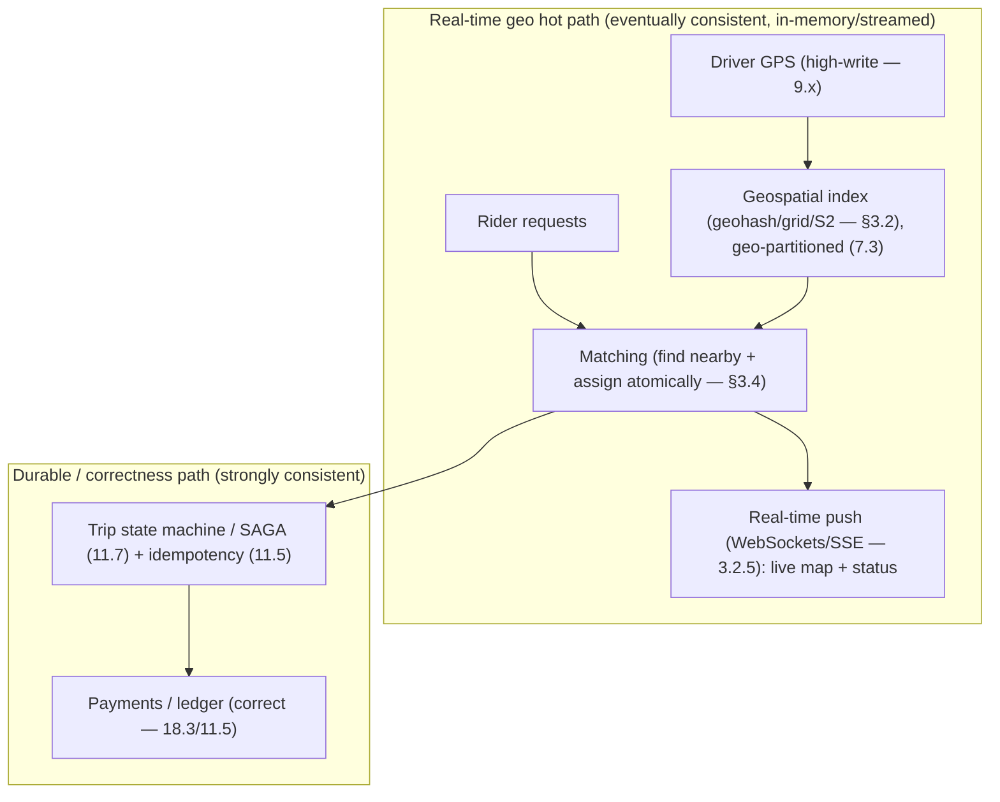
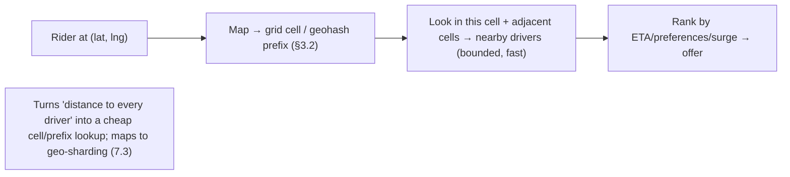

# Lesson 18.6 — Ride-Sharing & Geo: Uber-Style Architecture

> Part 18: Real-World Architectures · Difficulty: 🔴⚫ · *Representative case study*
>
> **Prerequisites:** [7.3 Sharding/Geo-partitioning], [9.x Messaging/Streaming], [11.5 Idempotency], [11.7 Sagas], [3.2.5 WebSockets/SSE], [12.x Microservices].
> **Unlocks:** [Part 19 Interview Designs (proximity/Uber)], [Part 20 Capstone].

> **Integrity note:** Synthesizes the **publicly-documented design lineage** of ride-sharing / real-time geo-matching platforms (Uber-style). **Representative** — principles, not internal specs; no invented benchmarks.

---

## 1. Learning Objectives

After this lesson you will be able to:

- Design a **real-time geo-matching platform**: **location ingestion** (high-write — driver GPS), **geospatial indexing** (find nearby drivers), **matching**, **trip management** (state machine + sagas — 11.7), and **payments**.
- Explain **geospatial indexing** — **geohashing / grid / S2 / quadtrees** — and why "find nearby" needs spatial data structures + geo-sharding (7.3).
- Explain the **high-write location-update** problem and how it's handled (streaming — 9.x, in-memory, geo-partitioning — 7.3).
- Explain **real-time bidirectional communication** (WebSockets/SSE — 3.2.5) for live location + trip updates.
- Explain trip **state management** as a **saga/state machine** (11.7) with **idempotency** (11.5) + payments (18.3/Part 20 lineage).

---

## 2. Motivation — Match riders and drivers in real time, over geography

A ride-sharing platform's core problem is deceptively simple to state and genuinely hard to build: **match a rider to a nearby available driver, in real time, over a constantly-moving geographic space.** This forces together several demanding sub-problems: **millions of drivers continuously reporting GPS locations** (an extreme high-write stream — 9.x), **efficiently finding "drivers near this rider"** (a **geospatial** query that ordinary databases handle poorly — needs spatial indexing + geo-sharding — 7.3), **matching** rider and driver under contention (two riders can't get the same driver), **tracking the trip** through a lifecycle (requested → matched → en route → in progress → completed) as a **distributed workflow** (saga — 11.7), **live location updates** to both parties (real-time bidirectional — 3.2.5), and **payments** (needing correctness — idempotency 11.5, ledger-like — 18.3/Part 20). It's a masterclass in **geo-distribution, high-write streaming, real-time communication, and workflow correctness**.

The architecture is shaped by two dominant forces. First, **geography**: everything is **local** (a rider matches with **nearby** drivers), so the system **geo-partitions** (7.3 — shard by location) and uses **geospatial indexing** (geohash/grid/S2/quadtree) to make "find nearby" fast. Second, **real time**: locations update constantly and matches must happen in **seconds**, so the hot path is **in-memory + streaming** (9.x) with **push** communication (WebSockets/SSE — 3.2.5), while the durable/analytical parts (trip records, payments, analytics) sit behind. This lesson synthesizes the ride-sharing/geo architecture — *how* geospatial indexing + high-write ingestion + matching + trip sagas + real-time comms compose — a canonical real-world example (and a common interview design). **(Representative — Uber-style.)**

---

## 3. Theory — The architecture, from first principles

### 3.1 The core sub-problems

`[CS]` A ride-sharing platform decomposes into `[CS]`:
- **Location ingestion:** millions of drivers **continuously report GPS** → an **extreme high-write** stream (§3.3).
- **Geospatial indexing + "find nearby":** given a rider's location, **efficiently find nearby available drivers** — a **spatial** query (§3.2).
- **Matching:** pair the rider with a driver under **contention** (no double-assignment) (§3.4).
- **Trip management:** track the trip through its **lifecycle** (a state machine / **saga** — 11.7) (§3.5).
- **Real-time communication:** push **live location + trip updates** to rider + driver (§3.6, 3.2.5).
- **Payments + pricing:** compute fare (incl. surge), charge — needing **correctness** (idempotency — 11.5, ledger — 18.3) (§3.5).
- `[BP]` **The dominant constraint: everything is geographic + real-time** → geo-partitioning (7.3) + spatial indexing + streaming + push comms shape the whole design.

### 3.2 Geospatial indexing — "find nearby" efficiently

`[CS]` Finding "drivers near a point" is a **spatial** query that ordinary indexes (B-tree on lat/lng — 4.2.5) handle poorly (a range on lat AND lng is inefficient + doesn't capture 2D proximity) `[CS]`:
- **The techniques** (spatial data structures/encodings):
  - **Geohashing:** encode a 2D lat/lng into a **1D string** where **shared prefixes = spatial proximity** (nearby points share a prefix) → turns "find nearby" into a **prefix/range query** (works with ordinary KV/DB indexes + sharding — 7.3). A **grid** of cells.
  - **S2 / H3 (cell systems):** hierarchical **cell** coverings of the sphere → represent a region as a set of cells; "nearby" = same/adjacent cells (representative).
  - **Quadtrees / R-trees:** tree structures recursively subdividing space → efficient spatial range queries.
- **Grid-based matching:** divide the map into **cells**; index drivers **by cell**; to find nearby, look in the **rider's cell + adjacent cells** → a bounded, fast lookup (not a scan of all drivers).
- `[BP]` **Why:** spatial indexing turns an expensive "distance to every driver" computation into a **cheap cell/prefix lookup** — and it maps naturally onto **geo-sharding** (7.3 — partition by geohash/cell → each shard owns a region → locality). **This is the key data-structure choice** that makes real-time geo-matching feasible.

### 3.3 High-write location ingestion

`[CS]` Millions of drivers reporting GPS every few seconds = an **extreme write load** `[CS]`:
- **Not a normal DB write path:** writing every GPS update to a durable relational DB would overwhelm it (7.6). Instead:
  - **In-memory + streaming:** location updates flow through a **streaming pipeline** (9.x) and/or are held in **in-memory geo-indexed stores** (fast, spatial — §3.2) that the matching service queries → the **hot path is in-memory**, not a durable DB per update.
  - **Geo-partitioning** (7.3): shard the location data **by region/cell** → each shard handles its area's writes → **horizontal write scale** + **locality** (a region's drivers + riders + matching are co-located).
  - **Latest-location semantics:** you usually only need the **current** location (a gauge, not full history) → overwrite/last-value (like a changelog — 9.3 compaction); full history goes to analytics async.
- `[BP]` **The pattern:** treat location as a **high-throughput, latest-value, geo-partitioned, in-memory/streamed** signal — **not** a durable transactional write per update. Durability + analytics happen **async** off the hot path.

### 3.4 Matching under contention

`[CS]` Pairing rider ↔ driver requires **correctness under contention** `[CS]`:
- **The query:** find nearby available drivers (§3.2) → rank (ETA, driver preferences, surge) → offer to a driver.
- **Contention:** two riders must not get the **same** driver; a driver shouldn't get two simultaneous offers → need **coordination** on driver state (available/offered/assigned). Techniques: per-driver **locking/CAS** (11.5/8.3.6), a matching service that **owns** driver state per region (geo-partitioned — single-writer per region — 7.3), or optimistic assignment + confirmation.
- **Latency-sensitive:** matching must happen in **seconds** → in-memory (§3.3), local (geo-partitioned).
- `[BP]` Matching is a **real-time, contended, geo-local** operation — solved by **geo-partitioning driver state** (each region's matcher owns its drivers → localizes contention) + **atomic assignment** (11.5/8.3.6) to prevent double-booking.

### 3.5 Trip management — a saga / state machine

`[CS]` A trip is a **long-lived workflow** spanning services (12.x) → a **saga / state machine** (11.7) `[CS]`:
- **Lifecycle states:** requested → matched → driver-en-route → in-progress → completed → paid (+ cancellation branches). A **state machine** tracks the trip.
- **Cross-service saga** (11.7): the trip touches matching, pricing, payments, notifications, driver/rider services (12.x) → coordinated as a **saga** (orchestration — 11.7 — often a trip orchestrator/state machine) with **compensations** (cancel → release driver, refund) and **idempotency** (11.5 — retries/duplicate events must be safe).
- **Payments correctness:** fare calculation + charging need **correctness** (11.5 idempotency — don't double-charge; ledger-like — 18.3/Part 20) — the **strong-consistency** part of an otherwise eventually-consistent system.
- `[BP]` The trip is the **stateful, cross-service, correctness-sensitive** core — managed as a **saga/state machine** (11.7) with **idempotency** (11.5), while location/matching is the **real-time, eventually-consistent** hot path. **Different consistency needs for different parts** (like 18.5's separations).

### 3.6 Real-time bidirectional communication

`[CS]` Riders + drivers need **live updates** (driver's moving location, trip status, ETA) → **real-time push** (3.2.5) `[CS]`:
- **WebSockets / SSE** (3.2.5): persistent connections push updates to clients (driver location → rider's map, trip-status changes) — **not** polling (inefficient at this scale).
- **Connection management** (3.3.4/17.3): millions of persistent connections → needs efficient connection handling (event-driven — 17.3) + a way to **route** a message to the right connection (a connection/session layer, often with a pub-sub — 9.x).
- `[BP]` The **live map** (watching your driver approach) is powered by **push over persistent connections** (3.2.5) fed by the location stream (§3.3) — a real-time delivery layer on top of the geo pipeline.

### 3.7 How it composes (and the consistency split)

`[BP]` The subsystems compose, split by **consistency + latency needs** `[BP]`:
- **Real-time geo hot path (eventually consistent, in-memory/streamed):** location ingestion (§3.3) → geospatial index (§3.2) → matching (§3.4) → real-time push (§3.6). **Optimized for latency + write throughput**, tolerates eventual consistency (a slightly-stale driver location is fine).
- **Durable/correctness path (strongly consistent):** trip state machine/saga (§3.5, 11.7), payments/ledger (18.3/Part 20 — idempotent — 11.5, correct). **Optimized for correctness.**
- **Geo-partitioning everywhere** (7.3/13.8): shard by region → locality (a city's traffic stays local) + horizontal scale + multi-region resilience (13.8).
- **Microservices + cloud-native + streaming + resilience** (12.x/13.x/9.x/11.3) underneath.
- `[BP]` **The key insight (recurring — 18.5):** **split the system by consistency + latency profile** — the **real-time geo matching** part is eventually-consistent + in-memory + streamed (fast, high-write), while the **trip/payments** part is strongly-consistent + durable + saga-managed (correct). This composition — **geospatial indexing + geo-sharding (7.3) + high-write streaming (9.x) + real-time push (3.2.5) + sagas (11.7) + idempotency (11.5) + payments (18.3)** — is why ride-sharing is a rich real-world (and interview — Part 19) architecture.

---

## 4. Visual Intuition

### The two paths (hot geo path vs durable trip path)

### Geospatial indexing (geohash/grid)

---

## 5. Real-World Analogy

Think of an **old-school taxi dispatch center** — but scaled to a whole country, in real time, with a live map.

- **The core problem:** a dispatcher must **match a caller to the nearest free cab, right now**, across a constantly-moving fleet. Simple to say, hard at scale.
- **Geospatial indexing = dividing the city into a grid of zones:** a dispatcher doesn't scan **every cab in the country** to find one near you — that's absurd. They divide the map into **zones** (a grid), track **which cabs are in each zone**, and when you call, they look in **your zone and the neighboring zones** (geohash/grid lookup) — a **quick, bounded search**, not a citywide scan. Nearby cabs share a **zone code** just as nearby points share a **geohash prefix**.
- **High-write location = cabs constantly radioing their position:** every cab **reports its position every few seconds** — a firehose of updates. The dispatch board doesn't **file each update in a permanent archive** (that'd bury the clerks); it just **updates a live board showing where each cab is now** (in-memory, latest-value), and **splits the board by region** so each regional desk handles its own area (geo-partitioning). The permanent trip records are written up **later, separately**.
- **Matching under contention = don't send two callers the same cab:** when two callers near the same cab call at once, the dispatcher must ensure **only one gets it** — they **mark the cab "assigned" the instant they dispatch it** (atomic assignment), and each **regional desk owns its own cabs** so there's no fighting across desks (geo-partitioned, single-owner-per-region).
- **Trip management = the ride's paperwork, tracked carefully:** once matched, the **ride itself** goes through stages (pickup → riding → dropped off → paid), tracked on a **formal trip sheet** (state machine/saga), and if the ride is **cancelled**, the paperwork is **unwound** (release the cab, refund — compensations). The **fare and payment** are handled with **bank-like care** — no double-charging (idempotency), accurate accounting (ledger) — unlike the casual "where's the cab now" board.
- **Live map = watching your cab approach:** instead of you **repeatedly phoning "where's my cab?"** (polling), the dispatch **pushes live updates to your phone** (WebSockets/SSE) so you **watch the cab move on a map** in real time — fed by the same position firehose.
- **The split:** the **"where are the cabs / match me now" board** is **fast, live, and slightly-approximate** (eventually consistent — a cab's dot might be a second stale, fine), while the **"trip paperwork + payment"** is **careful and exact** (strongly consistent). Two very different systems, fused.

---

## 6. Industry Example

- **Uber-style geo-matching** `[CONV]`: geospatial indexing (grid/cell — e.g., H3-style hexagonal cells) + geo-sharding for real-time matching (§3.2, 7.3). *(Representative.)*
- **Geohashing / S2 / H3 / quadtrees** `[CONV]`: spatial encodings/structures for "find nearby" (§3.2). *(Representative.)*
- **High-write location via streaming + in-memory** `[CONV]`: driver GPS through streaming pipelines + in-memory geo-indexes (§3.3, 9.x). *(Representative.)*
- **Trip sagas + payments** `[CONV]`: trip lifecycle as a saga/state machine (11.7) with idempotent payments (11.5) (§3.5). *(Representative.)*
- **Real-time push (WebSockets)** `[CONV]`: live driver location + trip status to clients (§3.6, 3.2.5). *(Representative.)*

---

## 7. Implementation Details (architectural)

- **Geospatial indexing** (§3.2): geohash/grid/S2/H3/quadtree; index drivers by cell; query rider's cell + adjacent; **geo-shard by cell/region** (7.3) for locality + scale.
- **High-write location ingestion** (§3.3, 9.x): stream + in-memory geo-index (latest-value); **don't** durably write every GPS update to a relational DB; geo-partition; durability/analytics async.
- **Matching** (§3.4): find nearby (§3.2) → rank → **atomic assignment** (11.5/8.3.6) to prevent double-booking; geo-partition driver state (single-owner per region — 7.3).
- **Trip management as a saga/state machine** (§3.5, 11.7): orchestrated lifecycle with compensations + **idempotency** (11.5); payments **correct** (idempotent, ledger-like — 18.3/Part 20).
- **Real-time push** (§3.6, 3.2.5): WebSockets/SSE for live location + status; efficient connection management (3.3.4/17.3) + pub-sub routing (9.x).
- **Split by consistency/latency profile** (§3.7): geo hot path = eventually-consistent/in-memory/streamed; trip/payments = strongly-consistent/durable/saga.
- **Microservices + cloud-native + resilience + multi-region** (12.x/13.x/11.3/13.8) underneath.

---

## 8. Advantages (of this architecture)

- **Fast "find nearby"** — spatial indexing + geo-sharding turns it into a cheap cell lookup (§3.2).
- **Scales high-write location** — streaming + in-memory + geo-partitioning (§3.3).
- **Real-time matching + live updates** — in-memory hot path + push (§3.4/3.6).
- **Correct trips/payments** — saga + idempotency + ledger (§3.5).
- **Locality + resilience** — geo-partitioning + multi-region (§3.7, 7.3/13.8).
- **Right consistency per part** — eventual for geo, strong for payments (§3.7).

---

## 9. Disadvantages / costs

- **Complexity** — geospatial + streaming + sagas + real-time + payments fused (§3.7).
- **Geo-partitioning challenges** — cell/region boundaries, hot cells (dense cities — 7.4 hot partitions), cross-region trips (§3.2/3.3).
- **Contention/correctness in matching** — double-booking risk without careful assignment (§3.4).
- **Saga complexity** — trip state, compensations, idempotency (§3.5, 11.7).
- **Massive connection management** — millions of persistent connections (§3.6, 3.3.4).
- **Eventual consistency of location** — stale positions (acceptable, but a constraint) (§3.7).

---

## 10. When NOT to / cautions

- **Don't durably write every GPS update** to a relational DB — use streaming + in-memory (§3.3).
- **Don't scan all drivers** for "find nearby" — use spatial indexing (§3.2).
- **Don't skip atomic assignment** in matching — double-booking (§3.4).
- **Don't make payments eventually consistent** — they need correctness (idempotency/ledger) (§3.5).
- **Don't poll for live location** at scale — use push (WebSockets/SSE) (§3.6).
- **Don't ignore hot cells** — dense areas overload a shard (§3.2, 7.4).

---

## 11. Common Mistakes

1. **Ordinary DB index for "find nearby"** — inefficient; need spatial indexing (§3.2).
2. **Durably writing every GPS update** → DB overload (§3.3).
3. **No atomic assignment** → double-booked drivers (§3.4).
4. **Eventually-consistent payments** → double-charges / accounting errors (§3.5, 11.5).
5. **Polling for live updates** → inefficient at scale (§3.6).
6. **Hot cells** (dense cities) overloading a geo-shard (§3.2, 7.4).
7. **No saga/idempotency** for trips → inconsistent state on failures (§3.5, 11.7/11.5).
8. **One consistency model for everything** — not splitting geo (eventual) from payments (strong) (§3.7).

---

## 12. Interview Questions

**🟢 Easy**
- Why does "find nearby drivers" need geospatial indexing, not an ordinary DB index?
- How do you handle the high-write load of continuous GPS updates?

**🟡 Medium**
- Explain geohashing / grid-based matching and how it maps to geo-sharding (7.3).
- How do you prevent two riders from being matched to the same driver (atomic assignment)?

**🔴 Hard**
- How is a trip managed as a saga/state machine (11.7) with idempotency (11.5), and why do payments need stronger consistency than location?
- Why split the system into a real-time geo hot path (eventually consistent) and a durable trip/payment path (strongly consistent)?

**⚫ Staff+**
- Design a ride-sharing / proximity platform end-to-end (a classic interview — Part 19): geospatial indexing + geo-sharding, high-write location ingestion, matching under contention, trip saga + payments, real-time push, and the consistency split — with hot-cell + cross-region handling.
- How do you handle hot cells (dense cities), cross-region trips, and surge pricing while keeping matching fast and payments correct?

---

## 13. Production Pitfalls

- **"Find nearby" too slow:** using an ordinary index / scanning drivers instead of spatial indexing (§3.2).
- **Location-write overload:** durably writing every GPS ping crushed the DB (§3.3).
- **Double-booked drivers:** matching without atomic assignment (§3.4).
- **Hot-cell overload:** a dense city cell overwhelmed one geo-shard (§3.2, 7.4).
- **Payment errors:** non-idempotent payment on retry → double-charge (§3.5, 11.5).
- **Inconsistent trip state:** a failure mid-trip left the state machine stuck (no saga/compensation) (§3.5, 11.7).
- **Polling overload:** clients polling for location instead of push overwhelmed the backend (§3.6).

---

## 14. Optimization Techniques

- **Geospatial indexing (geohash/grid/S2/H3) + geo-sharding** for fast, local "find nearby" (§3.2, 7.3).
- **In-memory latest-value geo-index + streaming ingestion** for high-write location (§3.3, 9.x).
- **Atomic assignment + geo-partitioned driver state** to prevent double-booking + localize contention (§3.4).
- **Saga/state-machine trips + idempotency** for correct, failure-safe workflows (§3.5, 11.7/11.5).
- **Real-time push (WebSockets/SSE) + efficient connection mgmt** for live updates (§3.6, 3.2.5/17.3).
- **Split geo (eventual/in-memory) from payments (strong/durable)** — right consistency per part (§3.7).
- **Hot-cell mitigation** (finer cells, load balancing, replication — 7.4) for dense areas (§3.2).

---

## 15. Summary

A ride-sharing platform's core problem — **match a rider to a nearby available driver, in real time, over a constantly-moving geographic space** — fuses several demanding sub-problems into a masterclass in **geo-distribution, high-write streaming, real-time communication, and workflow correctness**. **Finding "drivers near a rider"** is a **spatial** query that ordinary indexes (B-tree on lat/lng — 4.2.5) handle poorly, so the system uses **geospatial indexing**: **geohashing** (encode 2D lat/lng into a 1D string where **shared prefixes = proximity** → a prefix/range query), **S2/H3 cell systems**, or **quadtrees/R-trees**, with **grid-based matching** (index drivers by cell; query the rider's cell + adjacent cells) — turning "distance to every driver" into a **cheap, bounded cell/prefix lookup** that maps naturally onto **geo-sharding** (7.3 — partition by cell/region → locality + scale). The **high-write location problem** (millions of drivers reporting GPS every few seconds) is handled **not** as durable transactional DB writes (which would overwhelm it — 7.6) but as a **high-throughput, latest-value, geo-partitioned, in-memory/streamed** signal (9.x — overwrite the current location, push durability/analytics async off the hot path). **Matching** requires **correctness under contention** (two riders can't get the same driver) → **atomic assignment** (11.5/8.3.6) + **geo-partitioned driver state** (each region's matcher owns its drivers → localizes contention), all **in-memory + local** for **seconds-latency** matching. The **trip** is a **long-lived, cross-service workflow** (12.x) managed as a **saga / state machine** (11.7 — requested → matched → en route → in-progress → completed → paid, with cancellation compensations) requiring **idempotency** (11.5 — safe retries/duplicate events), and **payments** need **correctness** (idempotent — don't double-charge, **ledger-like** — 18.3/Part 20) — the **strongly-consistent** part of an otherwise eventually-consistent system. **Real-time communication** (live driver location on the rider's map, trip status) uses **push over persistent connections** (**WebSockets/SSE** — 3.2.5, not polling), requiring efficient connection management (3.3.4/17.3) + pub-sub routing (9.x). The **recurring key insight** (as in 18.5): **split the system by consistency + latency profile** — the **real-time geo hot path** (location ingestion → geospatial index → matching → push) is **eventually-consistent, in-memory, streamed** (optimized for latency + write throughput; a slightly-stale driver dot is fine), while the **trip/payments path** is **strongly-consistent, durable, saga-managed** (optimized for correctness). **Geo-partitioning** (7.3/13.8) runs throughout (locality + scale + multi-region resilience), atop **microservices + cloud-native + streaming + resilience** (12.x/13.x/9.x/11.3). This composition — **geospatial indexing + geo-sharding + high-write streaming + real-time push + sagas + idempotency + payments** — makes ride-sharing a rich real-world architecture and a classic interview design (Part 19), with challenges in **hot cells** (dense cities → hot partitions — 7.4), **cross-region trips**, and **surge pricing**. **(Representative — Uber-style.)**

---

## 16. Revision Notes (flashcard-ready)

- **Q:** Why not an ordinary DB index for "find nearby"? **A:** A range on lat AND lng is inefficient + doesn't capture 2D proximity; need spatial indexing.
- **Q:** Geohashing? **A:** Encode 2D lat/lng into a 1D string where shared prefixes = proximity → "find nearby" becomes a prefix/range query (+ geo-sharding).
- **Q:** Spatial structures? **A:** Geohash/grid, S2/H3 cells, quadtrees/R-trees; index by cell, query rider's cell + adjacent.
- **Q:** High-write location handling? **A:** In-memory latest-value geo-index + streaming (9.x), geo-partitioned; NOT durable DB write per GPS update; durability async.
- **Q:** Matching contention? **A:** Atomic assignment (11.5/8.3.6) + geo-partitioned driver state (single owner per region) → no double-booking.
- **Q:** Trip management? **A:** Saga / state machine (11.7) with compensations + idempotency (11.5) across services.
- **Q:** Payments consistency? **A:** Strong/correct — idempotent (no double-charge), ledger-like (18.3) — unlike eventually-consistent location.
- **Q:** Real-time updates? **A:** Push via WebSockets/SSE (3.2.5), not polling; efficient connection mgmt + pub-sub routing.
- **Q:** The key split? **A:** Real-time geo hot path (eventual/in-memory/streamed) vs trip/payments path (strong/durable/saga) — right consistency per part.
- **Q:** Hot-cell problem? **A:** Dense cities overload a geo-shard (hot partition — 7.4); mitigate with finer cells / balancing / replication.

---

## 17. Further Reading + Knowledge-Graph Links

**Foundations (in-platform):**
- **[7.3 Sharding/Geo-partitioning]** / **[7.4 Hotspots]** — geo-sharding + hot cells.
- **[9.x Messaging/Streaming]** — high-write location ingestion.
- **[3.2.5 WebSockets/SSE]** — real-time push.
- **[11.7 Sagas]** / **[11.5 Idempotency]** — trip workflow + payments.
- **[18.3 Globally-Distributed SQL]** — payments/ledger consistency.

**Unlocks / next:**
- **[Part 19 Interview Designs]** — proximity/ride-sharing/nearby designs.
- **[Part 20 Capstone]** — geo + payments + sagas.

**External (canonical):**
- Uber engineering blog (H3, matching, real-time). *(Representative.)*
- Geohash / S2 / H3 documentation. *(Representative.)*

> **Knowledge-graph:** `7.3 geo-sharding` + geospatial indexing + `9.x streaming` + `3.2.5 push` + `11.7 sagas` + `11.5 idempotency` + `18.3 payments` → **`18.6 ride-sharing & geo (Uber-style)`** — hot geo path (eventual) + trip/payments (strong) → `Part 19–20`.
