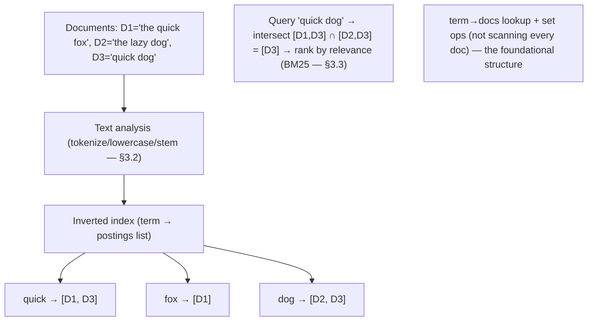
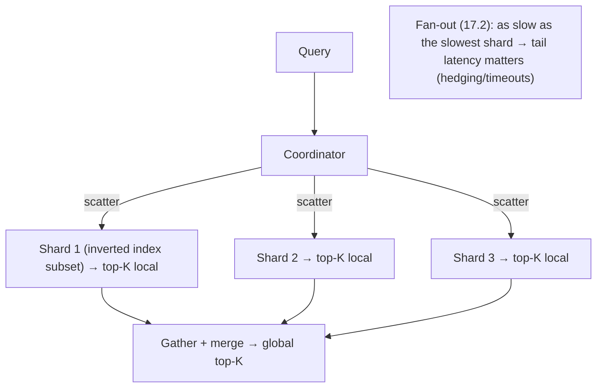

# Lesson 18.7 — Search: Inverted Indexes, Elasticsearch-Style Architecture

> Part 18: Real-World Architectures · Difficulty: 🔴 · *Representative case study*
>
> **Prerequisites:** [4.2.5 Indexing], [7.3 Sharding], [9.8 CDC], [10.1 Replication], [12.4 CQRS], [17.2 Tail Latency/Fan-out].
> **Unlocks:** [Part 19 Interview Designs (autocomplete/search)], [Part 20 Capstone (search)].

> **Integrity note:** Synthesizes the **publicly-documented design lineage** of full-text search engines (Elasticsearch/Lucene-style, and search generally). **Representative** — principles, not internal specs; no invented benchmarks.

---

## 1. Learning Objectives

After this lesson you will be able to:

- Explain the **inverted index** — the core data structure of full-text search — and why it makes "find documents containing these terms" fast.
- Describe **text analysis** (tokenization, normalization, stemming) that turns documents/queries into terms.
- Explain **relevance scoring** (TF-IDF / BM25) — ranking results by relevance, not just matching.
- Describe the **distributed search architecture**: **sharding + replication** (7.3/10.1) of the index, **scatter-gather** query (fan-out — 17.2), and **near-real-time** indexing.
- Explain search as a **derived read model** (CQRS — 12.4) fed by CDC (9.8), and its consistency/tradeoffs.

---

## 2. Motivation — Find the needle: fast, relevant, at scale

"**Search**" — find documents matching a text query, ranked by relevance — is a distinct, hard problem that ordinary databases solve **poorly**. A relational `WHERE text LIKE '%term%'` (5.x) is a **full scan** (no index helps — 17.5), can't handle **multiple terms / partial matches / typos / language**, and has **no notion of relevance** (which result is *best*). Full-text search is its own discipline, built on a specialized data structure — the **inverted index** — and its own concerns: **text analysis** (turning messy text into searchable terms), **relevance scoring** (ranking by how well a document matches), and **distributed operation** (searching billions of documents fast).

The **inverted index** is the key insight: instead of "for each document, what terms does it contain?" (a forward index — useless for search), it stores "**for each term, which documents contain it?**" (an inverted index) — so a query for a term is a **direct lookup** of its document list, and multi-term queries **intersect/union** these lists. This makes full-text search **fast**. On top of it: **text analysis** (tokenize, lowercase, stem — so "Running" and "runs" match "run"), **relevance scoring** (TF-IDF/BM25 — rank by term frequency + rarity), and — to scale to billions of documents — **sharding + replication** (7.3/10.1) of the index with **scatter-gather** queries (fan-out to all shards, merge results — 17.2). Crucially, a search index is usually a **derived read model** (CQRS — 12.4) — a **copy** of your primary data optimized for search, kept in sync via **CDC** (9.8) — not your source of truth. This lesson synthesizes the search architecture — inverted indexes, analysis, scoring, distribution — a canonical real-world (and interview — Part 19) system. **(Representative — Elasticsearch/Lucene lineage.)**

---

## 3. Theory — The architecture, from first principles

### 3.1 The inverted index — the core data structure

`[CS]` The **inverted index** maps **terms → the documents (and positions) containing them** `[CS]`:
- **Forward index (useless for search):** `document → [terms it contains]` — to find docs with "cat," you'd scan every document (full scan — 17.5). No good.
- **Inverted index:** `term → [postings list: doc IDs (+ positions/frequencies) containing the term]`. To find docs with "cat" → **direct lookup** of "cat"'s postings list. Multi-term queries (**"cat AND dog"**) → **intersect** the postings lists; (**"cat OR dog"**) → **union**; phrase queries use **positions**.
- **Structure:** a sorted **term dictionary** → postings lists (compressed — 4.2.x techniques). Analogous to a **book's index** (term → page numbers) vs reading every page.
- `[BP]` **Why it's fast:** search becomes **lookup + set operations on postings lists**, not scanning documents — O(matching docs), not O(all docs). **This is the foundational data-structure choice** that makes full-text search feasible (like LSM for writes — 18.2, or geohash for geo — 18.6).

### 3.2 Text analysis — turning text into terms

`[CS]` Before indexing/querying, text is **analyzed** into terms (an **analysis pipeline**) `[CS]`:
- **Tokenization:** split text into **tokens/words** ("The quick brown fox" → ["The","quick","brown","fox"]).
- **Normalization:** **lowercase** ("Cat"→"cat"), remove punctuation/accents → so case/punctuation don't prevent matches.
- **Stop-word handling:** optionally drop very common words ("the","a") that add little.
- **Stemming / lemmatization:** reduce words to a root ("running","runs","ran" → "run") → so query "run" matches "running".
- **Language/synonym handling:** language-specific analyzers, synonyms.
- `[BP]` **Crucial:** the **same analysis is applied to documents (at index time) AND queries (at search time)** → so query terms match indexed terms (both "Running" and "run?" reduce to "run"). Analysis is what makes search **forgiving + language-aware** (not exact-string-match). Mis-matched analysis (indexing vs querying differently) → results silently missing.

### 3.3 Relevance scoring — ranking, not just matching

`[CS]` Search must **rank** results by **relevance**, not just return all matches `[CS]`:
- **TF-IDF (classic):** score by **Term Frequency** (how often the term appears in the doc — more = more relevant) × **Inverse Document Frequency** (how **rare** the term is across all docs — rare terms are more discriminating; "the" is worthless, "quokka" is highly informative). → docs with **many occurrences of rare query terms** rank high.
- **BM25 (modern default):** a refined TF-IDF with **saturation** (diminishing returns for term frequency) + **document-length normalization** (don't unfairly favor long docs) → better ranking (representative).
- **Additional signals:** field boosts (title > body), recency, popularity, personalization, ML-based ranking (learning-to-rank).
- `[BP]` **Why it matters:** with millions of matching docs, **ranking is the product** — users want the **best** results first (like recommendations — 18.5). Relevance scoring (BM25 + signals) determines result quality. Search = **match (inverted index) + rank (scoring)**.

### 3.4 Distributed search — sharding, replication, scatter-gather

`[CS]` To search **billions of documents** fast, the index is **sharded + replicated** (7.3/10.1) `[CS]`:
- **Sharding** (7.3): the index is split into **shards**, each an independent inverted index over a **subset of documents** → horizontal scale (index size + query load spread across nodes).
- **Replication** (10.1): each shard is **replicated** → HA + read throughput (queries served by any replica).
- **Scatter-gather query (fan-out — 17.2):** a query is **sent to all shards** (each searches its subset + returns top-K local results), then a **coordinator merges** the per-shard results into the global top-K → **fan-out** across shards. (This is **17.2's fan-out** — so **tail latency matters**: the query is as slow as the slowest shard — hedging/timeouts — 17.2.)
- `[BP]` **The pattern:** **sharded inverted index + scatter-gather** — each shard searches locally in parallel, results merged. Scale via more shards; the **fan-out tail** (17.2) is the key latency concern (slowest shard dominates → 17.2 mitigations).

### 3.5 Near-real-time indexing + immutable segments

`[CS]` How new/updated documents become searchable (Lucene-style) `[CS]`:
- **Immutable segments:** an inverted index is built as **immutable segments** (like SSTables — 4.2.3) — new documents go into new segments; searches query all segments + merge (like LSM reads — 4.2.4). Updates = **delete + re-add** (mark old as deleted, add new).
- **Segment merging:** background merging of segments (like LSM compaction — 4.2.3) to keep search efficient.
- **Near-real-time (NRT):** newly-indexed documents become searchable after a **refresh** (making a new segment searchable) — **near**-real-time (seconds), not instant → search is **eventually consistent** with indexing.
- `[BP]` The immutable-segment design (borrowed from log-structured storage — 4.2.1/4.2.3) makes **indexing + searching concurrent + efficient**, at the cost of **near-real-time** (not instant) visibility + merge overhead — a familiar RUM-style tradeoff (4.2.4).

### 3.6 Search as a derived read model (CQRS + CDC)

`[CS]`/`[BP]` A crucial architectural point: **the search index is usually NOT your source of truth** `[BP]`:
- **It's a derived read model** (CQRS — 12.4): your **primary database** (relational/NoSQL — 5.x) is the **source of truth**; the search index is a **separate, read-optimized copy** built **for search** (denormalized, analyzed, inverted).
- **Kept in sync via CDC/events** (9.8/18.1): when primary data changes, **events/CDC** propagate the change to **re-index** the affected documents → the search index is a **consumer** of the data pipeline (18.1) — a **materialized view for search** (12.4).
- **Consistency** (10.5): the search index is **eventually consistent** with the primary (indexing lag + NRT refresh — §3.5) → a just-updated document may not be searchable for a moment. Usually **acceptable** for search (like recommendations — 18.5).
- `[BP]` **Why:** search engines are optimized for **search**, not as primary transactional stores (they lack strong transactions/consistency). So use the **right store for each job** (5.1.3 polyglot): primary DB for source-of-truth + writes, search index as a **derived read model** (12.4) fed by CDC (9.8) — **don't use your search engine as your primary database.**

### 3.7 How it composes (and tradeoffs)

`[BP]` The search architecture composes many fundamentals `[BP]`:
- **Inverted index** (§3.1 — the core structure) + **text analysis** (§3.2 — terms) + **relevance scoring** (§3.3 — ranking) = the search **core**.
- **Sharding + replication + scatter-gather** (§3.4, 7.3/10.1/17.2) = **distributed scale** (with fan-out tail latency — 17.2).
- **Immutable segments + NRT** (§3.5, 4.2.3) = concurrent indexing/searching, eventually consistent.
- **Derived read model via CDC** (§3.6, 12.4/9.8/18.1) = search as a materialized view, not source of truth.
- `[BP]` **Tradeoffs:** eventual consistency (NRT + CDC lag — §3.5/3.6), **not a transactional store** (§3.6), **fan-out tail latency** (§3.4, 17.2), **resource-heavy** (memory for indexes), and **relevance tuning** is an ongoing art (§3.3). **When it fits:** full-text search, filtering/faceting, log/analytics search, autocomplete (Part 19). **When it doesn't:** as a primary store, for strong-consistency/transactional needs, or when a simple DB query suffices (don't add a search engine for exact-match lookups). Search is a **specialized derived read model** — a canonical example of **using the right tool + CQRS** (12.4/5.1.3).

---

## 4. Visual Intuition

### Inverted index (term → documents)

### Distributed search: scatter-gather (fan-out — 17.2)

---

## 5. Real-World Analogy

Think of finding information in a **massive library** — and why you use the **index at the back of the books**, not read every page.

- **The inverted index = the index at the back of a book (scaled to the whole library):** to find every mention of "quokkas," you **don't read every page of every book** (a full scan — hopeless). You use the **index**: "quokka → pages 42, 87, 201" — a **direct lookup** of where the term appears. A search engine's inverted index is exactly this, for the **entire library**: **term → list of documents (and positions) containing it**. To find documents with **both** "quokka" and "Australia," you **intersect the two lists** — fast set operations, not reading everything.
- **Text analysis = a librarian who normalizes words before indexing:** the index doesn't list "Running," "runs," and "ran" separately — a smart librarian **reduces them all to "run"** (stemming), **ignores capitalization and punctuation**, and drops filler words like "the." Crucially, the librarian **applies the same rules when you ask a question** — so your search for "run" finds pages about "running." Without this, searching "Running" would miss a page that said "runs."
- **Relevance scoring = ranking the pages, not just listing them:** if "quokka" appears on **500 pages**, you don't want them in random order — you want the **most relevant first**. The librarian ranks by: **how often the term appears on a page** (term frequency) and **how rare/distinctive the term is** overall (a page mentioning "quokka" — a rare word — is more on-topic than one mentioning "the") — that's TF-IDF/BM25. Ranking is what makes the results **useful**, not just complete.
- **Distributed search = splitting the library across many buildings, then asking all of them:** the library is too big for one building, so it's **split across many branches** (shards), each with its **own back-of-book index** for its portion. When you search, the request goes to **every branch in parallel** ("scatter"), each returns its **top matches**, and a coordinator **merges them into the overall best** ("gather"). The catch: you wait for **the slowest branch** to answer (fan-out tail latency).
- **Search as a derived copy = the library index is a copy, not the books themselves:** critically, the **index is not the books** — the **actual books (source of truth) live elsewhere** (your primary database), and the **index is a separate, search-optimized copy** that's **updated whenever a book changes** (via CDC — a memo that says "book X changed, re-index it"). If the index is slightly behind (a just-added book isn't in it yet — near-real-time), that's usually fine. You'd **never throw away the actual books and keep only the index** — the search index is a **derived view**, not your master library.

---

## 6. Industry Example

- **Elasticsearch / Apache Lucene** `[CONV]`: the canonical full-text search stack — Lucene's inverted index + immutable segments, Elasticsearch's sharding/replication/scatter-gather (§3.1/3.4/3.5). *(Representative.)*
- **BM25 relevance scoring** `[CONV]`: the modern default ranking function (§3.3). *(Representative.)*
- **Text analysis pipelines** `[CONV]`: tokenizers/analyzers/stemmers/synonyms applied at index + query time (§3.2). *(Representative.)*
- **Search as a CQRS read model fed by CDC** `[CONV]`: primary DB as source of truth, search index synced via CDC/events (§3.6, 12.4/9.8). *(Representative.)*
- **Near-real-time indexing** `[CONV]`: refresh-based NRT visibility of new documents (§3.5). *(Representative.)*

---

## 7. Implementation Details (architectural)

- **Use an inverted index** (§3.1) for full-text search — not a relational `LIKE` scan (17.5).
- **Apply consistent text analysis** (§3.2) at **both** index + query time (tokenize/normalize/stem/synonyms); mismatched analysis silently drops results.
- **Rank with BM25 + signals** (§3.3): tune relevance (field boosts, recency, popularity, learning-to-rank); ranking quality is the product.
- **Shard + replicate the index** (§3.4, 7.3/10.1): scatter-gather queries; mind **fan-out tail latency** (17.2 — hedging/timeouts, slowest shard dominates).
- **Immutable segments + NRT + merging** (§3.5, 4.2.3): concurrent indexing/search; accept near-real-time (seconds) visibility.
- **Search as a derived read model (CQRS)** (§3.6, 12.4): primary DB = source of truth; search index synced via **CDC/events** (9.8/18.1); accept **eventual consistency** (10.5); **don't use search as your primary store**.
- **Right tool** (5.1.3): search engine for search/filtering/faceting/analytics; primary DB for transactions/source-of-truth.

---

## 8. Advantages

- **Fast full-text search** — inverted index (lookup + set ops, not scans) (§3.1).
- **Forgiving + language-aware** — analysis (stemming/normalization/synonyms) (§3.2).
- **Relevance ranking** — BM25 + signals return the best results first (§3.3).
- **Scales** — sharded + replicated index + scatter-gather (§3.4).
- **Rich features** — filtering, faceting, aggregations, autocomplete, analytics.
- **Clean separation** — derived read model via CQRS/CDC (§3.6, 12.4).

---

## 9. Disadvantages / costs

- **Not a source of truth / transactional store** — a derived read model only (§3.6).
- **Eventual consistency** — NRT + CDC lag; just-updated docs may not be searchable immediately (§3.5/3.6).
- **Fan-out tail latency** — scatter-gather is as slow as the slowest shard (§3.4, 17.2).
- **Resource-heavy** — memory/CPU for indexes + segment merging (§3.5).
- **Relevance tuning is an ongoing art** (§3.3).
- **Analysis mismatches** silently drop results (§3.2).
- **Operational complexity** — running a distributed search cluster (§3.4).

---

## 10. When NOT to / cautions

- **Don't use it as your primary/transactional database** — it's a derived read model (§3.6).
- **Don't use it for exact-match/simple lookups** a DB query handles — needless complexity (§3.7).
- **Don't expect strong consistency** — it's eventually consistent (§3.5/3.6, 10.5).
- **Don't mismatch index-time vs query-time analysis** — silently missing results (§3.2).
- **Don't ignore fan-out tail latency** — the slowest shard dominates (§3.4, 17.2).
- **Don't `LIKE '%...%'` scan** in a relational DB for full-text search — use an inverted index (§3.1, 17.5).

---

## 11. Common Mistakes

1. **Relational `LIKE` scans for full-text search** → full scans, no relevance (§3.1, 17.5).
2. **Mismatched analysis** (index vs query) → silently missing results (§3.2).
3. **Using search as the source of truth** → data loss / no transactions (§3.6).
4. **Ignoring relevance** — returning matches unranked (§3.3).
5. **Ignoring fan-out tail latency** — slow queries from a slow shard (§3.4, 17.2).
6. **Expecting instant visibility** — it's near-real-time (§3.5).
7. **No CDC/sync** — search index drifts from the primary (§3.6, 9.8).
8. **Over-adopting** — a search engine for simple exact-match needs (§3.7).

---

## 12. Interview Questions

**🟢 Easy**
- What is an inverted index, and why is it fast for full-text search?
- Why can't you just use `WHERE text LIKE '%term%'` in a relational DB?

**🟡 Medium**
- What is text analysis (tokenization/normalization/stemming), and why apply it at both index + query time?
- What is relevance scoring (TF-IDF/BM25), and why does it matter?

**🔴 Hard**
- How is a search index distributed (sharding + replication + scatter-gather), and why does fan-out tail latency matter (17.2)?
- Why is a search index usually a derived read model (CQRS — 12.4) fed by CDC (9.8), not a source of truth? What consistency does that imply?

**⚫ Staff+**
- Design a search system (e.g., product/document/log search — a classic interview — Part 19): inverted index, analysis, relevance, sharding/replication/scatter-gather, near-real-time indexing, and integration as a CQRS read model via CDC — with the consistency + tail-latency tradeoffs.
- Design search autocomplete/typeahead (Part 19): the data structures (prefix/trie/inverted-index), latency (tail — 17.2), ranking, and freshness.

---

## 13. Production Pitfalls

- **Slow `LIKE` scans:** full-text search via relational `LIKE` did full scans (§3.1, 17.5).
- **Missing results from analysis mismatch:** index-time and query-time analyzers differed → queries silently missed documents (§3.2).
- **Search-as-source-of-truth data loss:** used the search engine as the primary store; lacked transactions/durability guarantees (§3.6).
- **Fan-out tail latency:** one slow/large shard made queries slow (§3.4, 17.2).
- **Stale search results:** CDC lag / NRT meant just-updated data wasn't searchable (surprised users) (§3.5/3.6).
- **Index drift:** no CDC sync → the search index diverged from the primary DB (§3.6, 9.8).
- **Resource exhaustion:** large indexes + merging overwhelmed memory/CPU (§3.5).

---

## 14. Optimization Techniques

- **Inverted index + set operations** for fast matching (§3.1).
- **Tuned analysis (stemming/synonyms/normalization)** consistent at index + query time (§3.2).
- **BM25 + ranking signals (boosts/recency/popularity/learning-to-rank)** for relevance (§3.3).
- **Shard + replicate + scatter-gather** for scale; mitigate **fan-out tail** (hedging/timeouts — 17.2) (§3.4).
- **Immutable segments + NRT refresh + background merging** (4.2.3) for concurrent index/search (§3.5).
- **CQRS derived read model synced via CDC** (12.4/9.8) — right tool, primary DB stays source of truth (§3.6).
- **Caching hot queries** (Part 6) + result caching for repeated searches.

---

## 15. Summary

**Search** — find documents matching a text query, ranked by relevance — is a distinct, hard problem that ordinary databases solve **poorly** (a relational `WHERE text LIKE '%term%'` is a **full scan** — 17.5 — that can't handle multi-term/partial/typo/language queries and has **no relevance**). Full-text search is its own discipline built on the **inverted index**: instead of a forward index (`document → terms`, useless for search), it stores **`term → postings list` (the documents containing the term)**, so a query is a **direct lookup** of the term's document list, multi-term queries **intersect/union** postings lists, and phrase queries use **positions** — making search **O(matching docs), not O(all docs)** (like a book's back-of-index vs reading every page) — **the foundational data-structure choice**. On top: **text analysis** turns messy text into terms (**tokenize**, **normalize/lowercase**, **stop-words**, **stem/lemmatize** so "running/runs/ran" → "run", plus language/synonyms) — applied **identically at index time AND query time** (mismatched analysis silently drops results); and **relevance scoring** **ranks** results — **TF-IDF** (term frequency × inverse document frequency — favor many occurrences of **rare, discriminating** terms) refined by **BM25** (saturation + length normalization) plus signals (field boosts, recency, popularity, learning-to-rank) — because with millions of matches, **ranking is the product**. Search = **match (inverted index) + rank (scoring)**. To scale to **billions of documents**, the index is **sharded + replicated** (7.3/10.1) and queried via **scatter-gather (fan-out — 17.2)**: send the query to **all shards** (each searches its subset, returns local top-K), then a coordinator **merges** into the global top-K — so **fan-out tail latency** (17.2 — as slow as the slowest shard → hedging/timeouts) is a key concern. Indexing uses **immutable segments** (like SSTables — 4.2.3 — new docs → new segments, searched together + merged in the background like LSM compaction, updates = delete+re-add), making indexing + searching **concurrent + efficient** at the cost of **near-real-time** (seconds, not instant) visibility — a RUM-style tradeoff (4.2.4). Crucially, a search index is usually **NOT your source of truth** but a **derived read model** (CQRS — 12.4): your **primary database** (5.x) is authoritative, and the search index is a **separate, search-optimized copy** (denormalized, analyzed, inverted) kept in sync via **CDC/events** (9.8/18.1) — a **materialized view for search** that is **eventually consistent** (indexing lag + NRT — 10.5, usually acceptable) — because search engines optimize for search, **not** transactions/strong consistency, so use the **right tool** (5.1.3 polyglot) and **don't run your search engine as your primary database**. The composition — **inverted index + analysis + scoring** (core) + **sharding/replication/scatter-gather** (scale, with fan-out tail — 17.2) + **immutable segments/NRT** (concurrent indexing) + **CQRS derived read model via CDC** (12.4/9.8) — makes search a canonical real-world (and interview — Part 19) system: a **specialized derived read model** exemplifying **the right tool + CQRS**, with tradeoffs of eventual consistency, not-a-transactional-store, fan-out tail latency, resource cost, and ongoing relevance tuning. **(Representative — Elasticsearch/Lucene lineage.)**

---

## 16. Revision Notes (flashcard-ready)

- **Q:** Inverted index? **A:** term → postings list (documents containing the term); query = lookup + set ops (intersect/union), not scanning docs.
- **Q:** Why not relational LIKE? **A:** Full scan (no index), no multi-term/partial/typo/language handling, no relevance.
- **Q:** Text analysis? **A:** Tokenize + normalize/lowercase + stop-words + stem/lemmatize + synonyms — applied at BOTH index + query time.
- **Q:** Analysis gotcha? **A:** Index-time and query-time analysis must match, or results are silently missed.
- **Q:** Relevance scoring? **A:** TF-IDF (term frequency × inverse doc frequency → rare discriminating terms rank high); BM25 = modern refined default.
- **Q:** Distributed search? **A:** Sharded + replicated inverted index; scatter-gather (fan-out to all shards → merge top-K).
- **Q:** Scatter-gather concern? **A:** Fan-out tail latency (17.2) — as slow as the slowest shard → hedging/timeouts.
- **Q:** Indexing model? **A:** Immutable segments (like SSTables — 4.2.3) + background merging + near-real-time (seconds) refresh.
- **Q:** Search's role in the architecture? **A:** A derived read model (CQRS — 12.4), NOT source of truth; synced via CDC (9.8); eventually consistent.
- **Q:** When NOT to use it? **A:** As a primary/transactional store, for exact-match/simple lookups, or when strong consistency is needed.

---

## 17. Further Reading + Knowledge-Graph Links

**Foundations (in-platform):**
- **[4.2.5 Indexing]** / **[4.2.3 LSM/segments]** — indexing + immutable segments lineage.
- **[7.3 Sharding]** / **[10.1 Replication]** — distributed index.
- **[17.2 Tail Latency/Fan-out]** — scatter-gather fan-out.
- **[12.4 CQRS]** / **[9.8 CDC]** — search as a derived read model.

**Unlocks / next:**
- **[Part 19 Interview Designs]** — search + autocomplete/typeahead designs.
- **[Part 20 Capstone]** — search in the platform.

**External (canonical):**
- Lucene / Elasticsearch documentation. *(Representative.)*
- Manning et al., *Introduction to Information Retrieval* (inverted index, TF-IDF/BM25). *(Representative.)*

> **Knowledge-graph:** inverted index + `4.2.3 segments` + `7.3 sharding` + `17.2 fan-out` + `12.4 CQRS`/`9.8 CDC` → **`18.7 search (Elasticsearch/Lucene)`** — a derived read model; `Part 19–20`.
