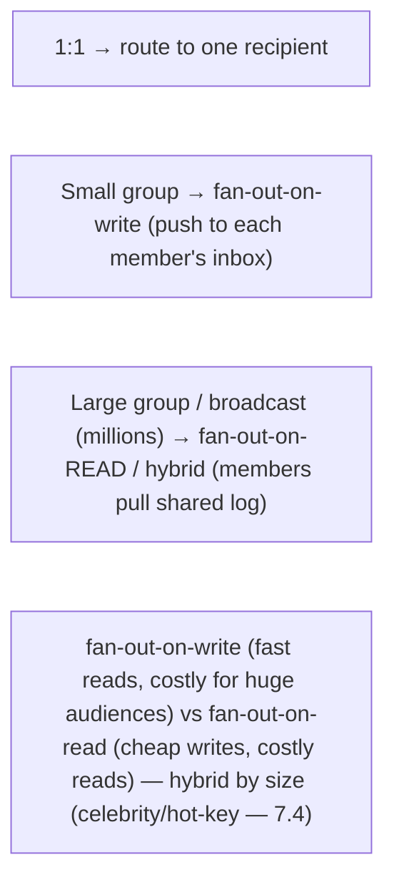

# Lesson 18.8 — Chat at Scale: Discord/WhatsApp-Style Architecture

> Part 18: Real-World Architectures · Difficulty: 🔴⚫ · *Representative case study*
>
> **Prerequisites:** [3.2.5 WebSockets/SSE], [3.3.4 Connection Management], [9.1 Messaging], [18.2 Wide-Column], [11.5 Idempotency], [17.3 Concurrency (C10K/C10M)].
> **Unlocks:** [Part 19 Interview Designs (chat/WhatsApp)], [Part 20 Capstone].

> **Integrity note:** Synthesizes the **publicly-documented design lineage** of large-scale chat/messaging (WhatsApp, Discord, and messaging systems generally). **Representative** — principles, not internal specs; no invented benchmarks.

---

## 1. Learning Objectives

After this lesson you will be able to:

- Design a **real-time chat system** at scale: **persistent connections** (WebSockets — 3.2.5) for millions of concurrent users, **message routing/fan-out**, **message storage** (18.2), **delivery guarantees + ordering**, and **presence**.
- Explain the **massive concurrent-connection** challenge (C10K→C10M — 17.3) and the connection/gateway layer that manages it.
- Explain **message fan-out** for 1:1 vs group vs large-broadcast chats, and the **fan-out-on-write vs fan-out-on-read** tradeoff.
- Explain **delivery semantics** (sent/delivered/read), **ordering** (per-conversation — 9.5), **idempotency/dedup** (11.5), and **offline delivery**.
- Address **presence** ("online" status) and its scaling challenge, and **end-to-end encryption** (15.3) considerations.

---

## 2. Motivation — Deliver billions of messages, instantly, to always-connected users

A chat platform must do something deceptively simple — **deliver a message from one user to another (or many), instantly** — at a scale and with real-time demands that stress every fundamental. The defining challenges: **hundreds of millions of users maintaining persistent connections simultaneously** (the C10K→C10M problem — 17.3 — you can't poll; you need long-lived connections — 3.2.5); **routing a message to the recipient's connection** wherever it is (across a huge connection fleet); **fanning out** to potentially **millions of recipients** in a large group/broadcast; **storing** enormous message volumes (18.2 — high-write); guaranteeing **delivery + ordering** (per conversation — 9.5) even when recipients are **offline**; and tracking **presence** (who's online) — itself a surprisingly hard scaling problem.

The architecture is shaped by **real-time, connection-heavy, high-fan-out** requirements. Users connect via **persistent WebSocket connections** (3.2.5) to a **connection/gateway layer** built for **massive concurrency** (event-driven — 17.3). Messages route through a **backend** that looks up **which gateway holds the recipient's connection** and delivers (push), while **storing** the message (18.2 — wide-column, high-write) for durability + offline delivery + history. **Fan-out** strategy depends on chat type (1:1, small group, huge broadcast — like feed fan-out). **Delivery + ordering + dedup** need care (11.5/9.5). And **presence** — seemingly trivial — is a **high-churn, high-fan-out** problem at scale. This lesson synthesizes the chat-at-scale architecture — connections + routing + fan-out + storage + delivery + presence — a canonical real-world (and interview — Part 19) system. **(Representative — WhatsApp/Discord lineage.)**

---

## 3. Theory — The architecture, from first principles

### 3.1 The core sub-problems

`[CS]` A chat system decomposes into `[CS]`:
- **Persistent connections:** millions of users hold **long-lived connections** (WebSockets — 3.2.5) for real-time push — the **C10K→C10M** connection-scale problem (17.3).
- **Message routing/delivery:** get a message to the recipient's **current connection** (wherever it is in the fleet).
- **Fan-out:** deliver to 1 (1:1), a few (small group), or **millions** (large group/broadcast).
- **Storage:** persist messages (18.2 — high-write) for durability + **offline delivery** + history.
- **Delivery semantics + ordering:** sent/delivered/read; ordered per conversation (9.5); idempotent/dedup (11.5); offline queueing.
- **Presence:** who's online (a high-churn, high-fan-out signal).
- **(Optionally) end-to-end encryption** (15.3).
- `[BP]` **The dominant forces: real-time (push), connection-heavy (millions of persistent connections), high-fan-out** → shape the connection layer, routing, and fan-out design.

### 3.2 The connection layer — persistent connections at massive scale

`[CS]` Real-time chat needs **push**, so clients hold **persistent connections** (3.2.5) — at **C10M** scale (17.3) `[CS]`:
- **WebSockets (or similar)** (3.2.5): a **long-lived bidirectional connection** per client → the server can **push** messages instantly (not polling). (Mobile may use push notifications for offline.)
- **The C10K→C10M challenge** (17.3): millions of **concurrent persistent connections** → thread-per-connection is impossible (17.3); needs **event-driven, non-blocking connection servers** (17.3) that each hold **hundreds of thousands** of connections with little memory.
- **Connection/gateway layer:** a fleet of **connection servers (gateways)** terminates client connections; each holds a subset of connections. A **registry/routing layer** tracks **which gateway holds which user's connection** (so the backend can route a message to the right gateway → the right connection).
- `[BP]` The connection layer is the **defining infrastructure** — a **massive fleet of event-driven connection servers** (17.3) + a **connection registry** (which gateway has whom). Efficient connection handling (17.3/3.3.4) is the core engineering challenge.

### 3.3 Message routing + delivery

`[CS]` Delivering a message = **route to the recipient's connection + store** `[CS]`:
- **Send flow (1:1):** sender → their gateway → backend **message service** → (a) **store** the message (18.2 — durability/history/offline) + (b) **look up the recipient's gateway** (connection registry — §3.2) → **push** to the recipient's connection (if online) via that gateway → recipient receives instantly.
- **If recipient offline:** the message is **stored + queued** (per-recipient inbox / offline queue) → delivered when they reconnect (+ a **push notification** to their device). **Storage is essential for offline delivery** — you can't rely on the connection being live.
- **Decoupling via a message bus** (9.1): often a **pub-sub / message queue** (Part 9) between the backend and gateways → the backend publishes "message for user X," the gateway holding X's connection consumes + delivers → decouples routing from connection topology.
- `[BP]` **Store + route:** every message is **persisted** (for durability + offline + history — 18.2) **and** **pushed** to online recipients via connection lookup. Offline recipients get it on reconnect + a push notification.

### 3.4 Fan-out — 1:1 vs group vs broadcast

`[CS]` Delivering to **many** recipients (groups) is a **fan-out** problem — same tradeoff as news-feed fan-out `[CS]`:
- **1:1:** trivial — route to the one recipient (§3.3).
- **Small groups (fan-out-on-write):** on send, **write the message to each member's inbox / push to each online member** → delivery is a **per-recipient write** (like feed fan-out-on-write). Fine for small groups.
- **Large groups / broadcast channels (fan-out-on-read or hybrid):** for a group with **millions** of members (a broadcast channel), fan-out-on-write is **infeasible** (millions of writes per message — the "celebrity" problem — 7.4/feed fan-out) → instead, members **read from a shared conversation log** (fan-out-on-read), or a **hybrid** (fan-out-on-write for most, pull for huge groups). Discord-style servers with huge channels use shared-channel models.
- `[BP]` **The classic fan-out tradeoff** (identical to news-feed — Part 19.1.5): **fan-out-on-write** (push to each recipient — fast reads, expensive for huge audiences) vs **fan-out-on-read** (recipients pull from a shared timeline — cheap writes, expensive reads for large fan-in) → **hybrid** by group size. Huge broadcast groups are the "celebrity" hot-key problem (7.4).

### 3.5 Message storage — high-write, per-conversation

`[CS]` Storing enormous message volumes → a **high-write** store (18.2) `[CS]`:
- **Access pattern:** messages are written constantly + read **per conversation, in time order** (recent first) → partition by **conversation ID** (7.3), sort by time (clustering key — 18.2 wide-column).
- **Wide-column / LSM store** (18.2): the **write-optimized, partitioned** model fits perfectly (high write throughput — LSM — 4.2.3; partition by conversation — 7.3; range-scan by time within a conversation — 18.2). Chat is a **textbook wide-column workload**.
- **Per-recipient inbox vs shared conversation log:** store the **conversation** (shared, per conversation ID) and/or **per-recipient inboxes** (for offline delivery/unread — depends on fan-out model — §3.4).
- `[BP]` Chat storage = **wide-column** (18.2): partition by conversation, sort by time, high write throughput via LSM — a direct application of 18.2. (Metadata/relationships may use other stores — polyglot — 5.1.3.)

### 3.6 Delivery semantics, ordering, idempotency

`[BP]` Chat needs careful **delivery + ordering** (9.4/9.5/11.5) `[BP]`:
- **Delivery states:** **sent** (server received) → **delivered** (recipient's device received) → **read** (recipient opened) — the familiar checkmarks. Each state is an **event/ack** flowing back.
- **Ordering** (9.5): messages must appear **in order within a conversation** → order per **conversation** (partition key — 9.5/18.2); use **sequence numbers / timestamps** per conversation (careful with clock skew — 8.1.2, often a server-assigned sequence).
- **Idempotency + dedup** (11.5/9.5): networks retry → a message must not be **duplicated** → **client-generated message IDs** + server-side **dedup** (11.5) → exactly-once **effects** (9.4/11.5). Handles resends on flaky mobile networks.
- **At-least-once + dedup = reliable delivery** (9.4): the message is stored + retried until acked, deduped by ID → delivered exactly once in effect.
- `[BP]` **Reliable, ordered, deduplicated** delivery per conversation — via stored messages + acks + per-conversation ordering + idempotent message IDs (9.4/9.5/11.5). The checkmarks (sent/delivered/read) are **acknowledgment events**.

### 3.7 Presence + E2E encryption + composition

`[BP]` Two more concerns + the full picture `[BP]`:
- **Presence ("online" status):** seemingly trivial, but a **hard scaling problem** — online/offline is **high-churn** (constant connects/disconnects), and showing "who's online" to a user's contacts is a **fan-out** (notify all contacts on status change) → for a user with many contacts, or many users, presence updates **explode**. Mitigations: **batch/throttle** presence updates, **approximate** (eventual — 10.5), pub-sub only to interested subscribers, expiry/heartbeat-based (like membership — 8.3.5). **Presence is deceptively expensive.**
- **End-to-end encryption (E2E)** (15.3): messages encrypted **client-to-client** so the **server can't read them** (WhatsApp-style) → the server **routes ciphertext** it can't decrypt → strong privacy, but complicates features (server-side search, etc. — done client-side) + key management (15.3 — per-device keys, key exchange).
- **The composition:** **client ↔ persistent WebSocket ↔ connection gateway (event-driven, C10M — 17.3) ↔ (message bus — 9.1) ↔ message service [store (wide-column — 18.2) + route via connection registry + fan-out] → push to recipient's gateway → recipient**; with **delivery acks + per-conversation ordering + idempotent IDs** (9.4/9.5/11.5), **offline queueing + push notifications**, **presence** (throttled/approximate), and optionally **E2E encryption** (15.3).
- `[BP]` Chat composes **persistent connections (3.2.5) + massive concurrency (17.3) + routing/pub-sub (9.1) + wide-column storage (18.2) + delivery guarantees (9.4/9.5/11.5) + fan-out (feed-style) + presence + E2E (15.3)** — a canonical real-world (and interview — Part 19) system stressing connection-scale + real-time delivery.

---

## 4. Visual Intuition

### The message send/deliver flow

```mermaid
flowchart TB
    SENDER["Sender"] -->|WebSocket (3.2.5)| GW1["Connection gateway A (event-driven, C10M — 17.3)"]
    GW1 --> MSG["Message service"]
    MSG --> STORE[("Store message (wide-column — 18.2: partition by conversation, sort by time)")]
    MSG --> BUS[("Message bus / pub-sub (9.1)")]
    BUS --> LOOKUP["Connection registry: which gateway has the recipient?"]
    LOOKUP --> GW2["Recipient's gateway B"]
    GW2 -->|push (online)| RECIP["Recipient"]
    STORE -.offline: queue + push notification, deliver on reconnect.-> RECIP
    RECIP -->|delivered/read ack| MSG
    note["Store + route; push if online, queue if offline; acks = delivery states"]
```

### Fan-out by chat type (same tradeoff as feed)



---

## 5. Real-World Analogy

Think of a **planet-scale postal + telephone-switchboard hybrid** that delivers messages **instantly** to people who are **always on the line**.

- **Persistent connections = everyone keeps a phone line open:** unlike mail (where you check your mailbox periodically — polling), chat is like **every user keeping a phone line permanently open** to the exchange (WebSocket) so a message can **ring through instantly** (push). But with **hundreds of millions of open lines**, you can't have **one operator per line** (thread-per-connection — impossible — C10M — 17.3) — you need **super-efficient switchboards** where **one operator juggles hundreds of thousands of lines** (event-driven connection servers — 17.3), plus a **directory of which switchboard holds whose line** (connection registry).
- **Routing = the exchange finds the recipient's line:** to deliver a message, the exchange **writes it down** (stores it — for durability + history + in case they're offline) **and looks up which switchboard holds the recipient's open line**, then **rings it through** (push). If the recipient's line is **down** (offline), the message **waits in their mailbox** and a **doorbell notification** is sent; it's delivered when they **pick the line back up** (reconnect).
- **Fan-out = one message to a group:** sending to **one person** is easy. Sending to a **small group** — you **drop a copy in each member's mailbox** (fan-out-on-write). But sending to a **broadcast channel with millions of subscribers** — copying to millions of mailboxes per message is absurd (the "celebrity" problem) — so instead everyone **reads from one shared channel bulletin** (fan-out-on-read). Same tradeoff as a social feed.
- **Delivery receipts + order = tracked, ordered mail:** each message gets tracked through **sent → delivered → read** (the checkmarks — acknowledgments flowing back), messages in a conversation are **kept strictly in order** (per-conversation sequence), and if the flaky phone line causes a **resend**, the exchange **recognizes the duplicate by its ticket number and doesn't deliver it twice** (idempotent message IDs — dedup).
- **Storage = a colossal, conversation-organized archive:** every message is **filed by conversation, newest on top** (wide-column: partition by conversation, sort by time) — perfect for "show me this chat's recent messages" and built to absorb a **relentless stream of new messages** (high write throughput).
- **Presence = the "who's online" board (surprisingly expensive):** showing your **hundreds of contacts** whether you're online means that **every time you connect or disconnect, you'd have to notify all of them** — and with everyone constantly toggling, this becomes an **overwhelming storm of status updates**. So the exchange **batches, throttles, and approximates** presence rather than notifying instantly. It looks trivial; it's a fan-out nightmare.
- **End-to-end encryption = sealed envelopes the exchange can't open:** in a private system, messages are **sealed so only the recipient can open them** (E2E) — the exchange **routes sealed envelopes it can't read** (strong privacy), but then **the exchange can't help you search your mail** (search must happen on your own device).

---

## 6. Industry Example

- **WhatsApp-style messaging** `[CONV]`: massive persistent-connection fleet (efficient connection servers — 17.3), store-and-forward with offline delivery, E2E encryption (15.3) (§3.2/3.3/3.7). *(Representative.)*
- **Discord-style chat** `[CONV]`: real-time gateways (WebSockets), shared-channel model for large servers (fan-out-on-read for huge channels), wide-column message storage (18.2) (§3.2/3.4/3.5). *(Representative.)*
- **Wide-column message storage** `[CONV]`: partition by conversation, sort by time — a textbook wide-column workload (§3.5, 18.2). *(Representative.)*
- **Delivery states + idempotent message IDs** `[CONV]`: sent/delivered/read + client-generated IDs for dedup (§3.6, 11.5/9.5). *(Representative.)*
- **Presence at scale** `[CONV]`: batched/throttled/approximate presence to tame the fan-out (§3.7). *(Representative.)*

---

## 7. Implementation Details (architectural)

- **Persistent connections at scale** (§3.2, 3.2.5/17.3): WebSocket connection/gateway fleet, **event-driven** (17.3) for C10M; a **connection registry** (which gateway holds whom); efficient connection mgmt (3.3.4).
- **Store + route** (§3.3): persist every message (wide-column — 18.2) + route to the recipient's gateway (via registry) + push; **offline** → queue + push notification + deliver on reconnect; decouple via **pub-sub/message bus** (9.1).
- **Fan-out by chat type** (§3.4): 1:1 route; small groups **fan-out-on-write**; huge groups/broadcasts **fan-out-on-read/hybrid** (celebrity/hot-key — 7.4).
- **Message storage** (§3.5, 18.2): partition by conversation, sort by time (LSM/wide-column — high write); per-recipient inbox and/or shared conversation log per fan-out model.
- **Delivery + ordering + dedup** (§3.6, 9.4/9.5/11.5): sent/delivered/read acks; per-conversation ordering (server sequence); **client-generated message IDs + server dedup** → exactly-once effects; at-least-once + dedup = reliable delivery.
- **Presence** (§3.7): batch/throttle/approximate; pub-sub to interested subscribers; heartbeat/expiry (8.3.5) — don't naively fan-out every status change.
- **E2E encryption** (§3.7, 15.3) where privacy requires it: route ciphertext; per-device keys/key exchange; features (search) client-side.

---

## 8. Advantages (of this architecture)

- **Real-time delivery** — persistent connections + push (§3.2/3.3).
- **Massive connection scale** — event-driven gateways (C10M — 17.3) (§3.2).
- **Reliable + ordered + deduped** — store + acks + per-conversation order + idempotent IDs (§3.6).
- **Offline delivery** — stored + queued + push notifications (§3.3).
- **Scalable storage** — wide-column (18.2) for high write + conversation reads (§3.5).
- **Flexible fan-out** — per chat type (feed-style tradeoff) (§3.4).

---

## 9. Disadvantages / costs

- **Connection-scale complexity** — millions of persistent connections + registry + routing (§3.2, 17.3).
- **Fan-out for huge groups** — the celebrity/broadcast problem (§3.4, 7.4).
- **Presence is expensive** — high-churn, high-fan-out (§3.7).
- **Delivery/ordering/dedup complexity** — careful semantics needed (§3.6).
- **E2E encryption tradeoffs** — no server-side features (search), key management (§3.7, 15.3).
- **Eventual consistency** of presence/read-receipts (10.5) (§3.7).

---

## 10. When NOT to / cautions

- **Don't poll** for messages — use persistent connections/push (§3.2, 3.2.5).
- **Don't thread-per-connection** at scale — event-driven (§3.2, 17.3).
- **Don't fan-out-on-write to huge broadcast groups** — use fan-out-on-read/hybrid (§3.4, 7.4).
- **Don't skip idempotency/dedup** — flaky mobile networks resend (§3.6, 11.5).
- **Don't naively fan-out every presence change** — batch/throttle/approximate (§3.7).
- **Don't rely on the connection being live** — store for offline delivery (§3.3).

---

## 11. Common Mistakes

1. **Polling instead of push** → inefficient, not real-time (§3.2).
2. **Thread-per-connection** → can't scale to C10M (§3.2, 17.3).
3. **Fan-out-on-write for huge groups** → millions of writes per message (§3.4, 7.4).
4. **No idempotency/dedup** → duplicate messages on resend (§3.6, 11.5).
5. **Naive presence fan-out** → status-update storm (§3.7).
6. **No offline storage/queue** → messages lost when recipient offline (§3.3).
7. **Wrong storage model** → not partitioning by conversation / not wide-column for high write (§3.5, 18.2).
8. **Ignoring per-conversation ordering** → out-of-order messages (§3.6, 9.5).

---

## 12. Interview Questions

**🟢 Easy**
- Why does chat use persistent connections (WebSockets) instead of polling?
- How do you deliver a message to an offline recipient?

**🟡 Medium**
- How do you scale to millions of concurrent connections (C10K→C10M — 17.3), and how do you route a message to the right connection?
- Explain fan-out for 1:1 vs small group vs huge broadcast (fan-out-on-write vs on-read).

**🔴 Hard**
- How do you guarantee reliable, ordered, deduplicated delivery (acks, per-conversation ordering, idempotent message IDs — 9.4/9.5/11.5)?
- Why is presence ("who's online") a hard scaling problem, and how do you tame it?

**⚫ Staff+**
- Design a chat system at scale (a classic interview — Part 19): connection layer (WebSockets/gateways/registry, C10M), routing + pub-sub, message storage (wide-column — 18.2), delivery guarantees + ordering + dedup, fan-out by chat type, offline delivery, presence, and (optionally) E2E encryption.
- How do you handle a broadcast channel with millions of subscribers (fan-out), and how does presence scale for users with many contacts?

---

## 13. Production Pitfalls

- **Connection-scale meltdown:** thread-per-connection couldn't handle the concurrent connections (§3.2, 17.3).
- **Fan-out overload:** fan-out-on-write to a huge group caused millions of writes per message (§3.4, 7.4).
- **Duplicate messages:** no idempotency/dedup → resends on flaky networks duplicated messages (§3.6, 11.5).
- **Presence storm:** naive per-change presence fan-out overwhelmed the system (§3.7).
- **Lost offline messages:** no store-and-forward → messages dropped when recipient offline (§3.3).
- **Out-of-order messages:** no per-conversation ordering → messages appeared jumbled (§3.6, 9.5).
- **Storage hot partition:** a huge active conversation/channel overloaded one shard (§3.5, 7.4).

---

## 14. Optimization Techniques

- **Event-driven connection gateways** (17.3) + connection registry for C10M scale (§3.2).
- **Store-and-forward + pub-sub routing** (9.1) for reliable + decoupled delivery, incl. offline (§3.3).
- **Fan-out by chat type** (on-write small / on-read huge — hybrid) (§3.4, 7.4).
- **Wide-column storage** (18.2): partition by conversation, sort by time (§3.5).
- **Idempotent message IDs + dedup + per-conversation ordering** (11.5/9.5) for reliable ordered delivery (§3.6).
- **Batch/throttle/approximate presence** + pub-sub to interested subscribers (§3.7).
- **E2E encryption** (15.3) where privacy requires (route ciphertext) (§3.7).

---

## 15. Summary

A chat platform must **deliver a message from one user to another (or many), instantly**, at a scale that stresses every fundamental. The defining challenges: **hundreds of millions of persistent connections simultaneously** (the **C10K→C10M** problem — 17.3 — you can't poll, you need long-lived push connections — 3.2.5), **routing a message to the recipient's connection** across a huge fleet, **fanning out** to potentially millions, **storing** enormous message volumes (18.2 high-write), guaranteeing **delivery + ordering** even when recipients are **offline**, and tracking **presence** (surprisingly hard). The **connection layer** is the defining infrastructure: clients hold **persistent WebSocket connections** (3.2.5) to a **fleet of event-driven connection gateways** (17.3 — thread-per-connection is impossible at C10M; each gateway holds hundreds of thousands of connections with little memory), with a **connection registry** tracking **which gateway holds which user** (so messages can be routed). **Message delivery = store + route**: the sender's message goes to a **message service** that **persists it** (wide-column — 18.2 — for durability/history/offline) **and** **looks up the recipient's gateway** (registry) to **push** it to their connection (if online) — often decoupled via a **pub-sub/message bus** (9.1); if the recipient is **offline**, the message is **stored + queued** and delivered on **reconnect** + a **push notification** (you can't rely on a live connection). **Fan-out** depends on chat type — the **same tradeoff as news-feed fan-out**: **1:1** is trivial; **small groups** use **fan-out-on-write** (push to each member — fast reads, costly for large audiences); **huge groups/broadcasts** (millions of members) use **fan-out-on-read/hybrid** (members pull from a shared conversation log — the "celebrity" hot-key problem — 7.4). **Storage** is a **textbook wide-column workload** (18.2): **partition by conversation, sort by time** (LSM — high write throughput — 4.2.3, range-scan recent messages), as a shared conversation log and/or per-recipient inboxes. **Delivery semantics** need care (9.4/9.5/11.5): **sent → delivered → read** are **acknowledgment events** (the checkmarks); messages are **ordered per conversation** (server-assigned sequence — 9.5, careful with clock skew — 8.1.2); and **client-generated message IDs + server-side dedup** (11.5) prevent **duplicates** on the inevitable retries of flaky mobile networks (**at-least-once + dedup = reliable, exactly-once-effect delivery** — 9.4). **Presence** ("who's online") is **deceptively expensive** — online/offline is **high-churn**, and showing status to a user's many contacts is a **fan-out** that **explodes** at scale → tamed by **batching, throttling, approximating** (eventual — 10.5), pub-sub to interested subscribers, and heartbeat/expiry (8.3.5). Optionally, **end-to-end encryption** (15.3) has the server **route ciphertext it can't read** (strong privacy) at the cost of no server-side features (search moves client-side) + per-device key management. The composition — **persistent connections (3.2.5) + massive concurrency (17.3) + routing/pub-sub (9.1) + wide-column storage (18.2) + delivery guarantees (9.4/9.5/11.5) + feed-style fan-out (7.4) + presence + E2E (15.3)** — makes chat a canonical real-world (and interview — Part 19) system that stresses **connection-scale + real-time delivery** above all. **(Representative — WhatsApp/Discord lineage.)**

---

## 16. Revision Notes (flashcard-ready)

- **Q:** Why persistent connections? **A:** Real-time push (not polling); millions of concurrent WebSocket connections → C10K→C10M (17.3) → event-driven gateways.
- **Q:** How to route a message? **A:** Connection registry (which gateway holds the recipient) → push via that gateway; often through a pub-sub bus (9.1).
- **Q:** Offline delivery? **A:** Store + queue the message + push notification → deliver on reconnect (can't rely on a live connection).
- **Q:** Fan-out by chat type? **A:** 1:1 route; small group fan-out-on-write; huge broadcast fan-out-on-read/hybrid (celebrity hot-key — 7.4).
- **Q:** Message storage model? **A:** Wide-column (18.2) — partition by conversation, sort by time (high write via LSM).
- **Q:** Delivery states? **A:** Sent → delivered → read (acknowledgment events / the checkmarks).
- **Q:** Ordering? **A:** Per conversation (partition key — 9.5) via server-assigned sequence.
- **Q:** Dedup? **A:** Client-generated message IDs + server dedup (11.5) → exactly-once effects on retries.
- **Q:** Why is presence hard? **A:** High-churn + high-fan-out (notify all contacts on status change) → batch/throttle/approximate.
- **Q:** E2E encryption? **A:** Client-to-client encryption; server routes ciphertext it can't read (privacy); features (search) client-side + key mgmt (15.3).

---

## 17. Further Reading + Knowledge-Graph Links

**Foundations (in-platform):**
- **[3.2.5 WebSockets/SSE]** / **[3.3.4 Connection Management]** — persistent connections.
- **[17.3 Concurrency (C10K/C10M)]** — massive concurrent connections.
- **[9.1 Messaging]** / **[9.4/9.5 Delivery/Ordering]** — routing + delivery + ordering.
- **[18.2 Wide-Column]** — message storage.
- **[11.5 Idempotency]** — dedup / reliable delivery.
- **[7.4 Hotspots]** — huge-group fan-out / hot conversations.

**Unlocks / next:**
- **[Part 19 Interview Designs]** — chat/WhatsApp + notification-system designs.
- **[Part 20 Capstone]** — real-time delivery components.

**External (canonical):**
- WhatsApp / Discord engineering write-ups (connections, storage, scale). *(Representative.)*
- Messaging-system design references. *(Representative.)*

> **Knowledge-graph:** `3.2.5 WebSockets` + `17.3 C10M` + `9.1 messaging/9.4-9.5 delivery` + `18.2 wide-column` + `11.5 idempotency` + `7.4 fan-out` → **`18.8 chat at scale (WhatsApp/Discord)`** — connection-scale + real-time delivery → `Part 19–20`.
