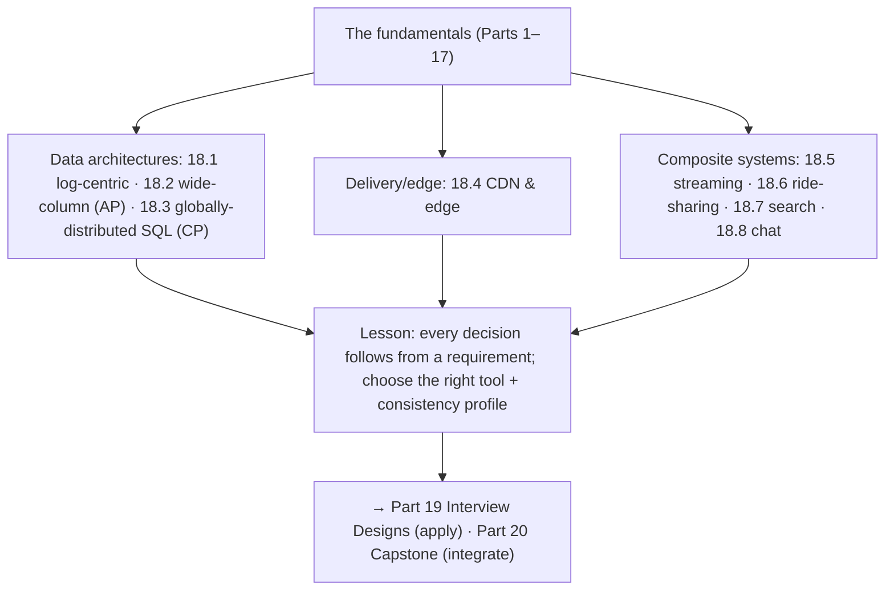

# Part 18 — Real-World Architectures (Case Studies) ✅ COMPLETE

Seeing the principles composed in documented systems — unified by one idea: **great architectures are compositions of the fundamentals, each design decision following from a specific requirement — and large systems are not one system but a set of subsystems, each solving a different problem with the right tool and the right consistency/latency profile.**

> **All case studies are REPRESENTATIVE** — synthesized from publicly-documented design lineages, not internal specs; no invented benchmarks.

---

## Lessons

| # | Lesson | Core idea |
|---|--------|-----------|
| 18.1 | [Distributed Log (Kafka lineage)](18.1-distributed-log-kafka-lineage.md) | The append-only log as the central abstraction; O(N²) point-to-point → O(N) hub-and-spoke; unifies messaging/integration/streaming/event-sourcing; everything is a materialization of the log |
| 18.2 | [Wide-Column (Bigtable/Dynamo/Cassandra/DynamoDB)](18.2-wide-column-bigtable-cassandra-dynamo.md) | LSM + consistent hashing + leaderless quorums + tunable consistency + conflict resolution + query-driven denormalized modeling; AP, horizontal write scale — gives up joins/ACID/strong consistency |
| 18.3 | [Globally-Distributed SQL (Spanner/Cockroach)](18.3-globally-distributed-sql-spanner-cockroach.md) | Relational + ACID + strong consistency AT scale; range-shard + consensus-per-shard + 2PC-over-consensus + MVCC + synchronized clocks (TrueTime/HLC); CP, pays latency — the strong-consistency counterpoint to 18.2 |
| 18.4 | [CDN & Edge (Cloudflare-style)](18.4-cdn-edge-cloudflare.md) | Anycast + global edge PoPs caching near users; origin offload/shielding; DDoS absorption + WAF + TLS at the edge; edge compute; global invalidation is hard; the default first tier |
| 18.5 | [Streaming & Recommendations (Netflix-style)](18.5-streaming-recommendations-netflix.md) | Three fused subsystems: video (CDN/ABR) + control plane (microservices/cloud-native/resilience/chaos) + data/ML (log→batch/stream→cached recs); separate video/control + online/offline |
| 18.6 | [Ride-Sharing & Geo (Uber-style)](18.6-ride-sharing-geo-uber.md) | Geospatial indexing (geohash/grid/S2) + geo-sharding + high-write streaming location + atomic matching + trip sagas + real-time push; split real-time geo (eventual) from trip/payments (strong) |
| 18.7 | [Search (Elasticsearch/Lucene)](18.7-search-inverted-index-elasticsearch.md) | Inverted index + text analysis + relevance (BM25) + sharding/scatter-gather (fan-out) + immutable segments/NRT; a derived read model (CQRS) fed by CDC, eventually consistent |
| 18.8 | [Chat at Scale (WhatsApp/Discord)](18.8-chat-at-scale-discord-whatsapp.md) | Persistent connections (C10M) + connection registry + routing/pub-sub + wide-column storage + delivery guarantees/ordering/dedup + feed-style fan-out + presence + E2E |

---

## The through-line of Part 18

**One sentence:** Real architectures compose the fundamentals — the distributed log as a data backbone (18.1); the two ways to shard at scale, AP wide-column (18.2) vs CP globally-distributed SQL (18.3); the CDN/edge as the default first tier (18.4); and composite systems (streaming — 18.5, ride-sharing — 18.6, search — 18.7, chat — 18.8) that are not one system but a set of subsystems, each solving a different problem with the right tool and the right consistency/latency profile.

---

## The recurring meta-lessons

- **Every design decision follows from a requirement.** LSM because writes dominate (18.2); TrueTime because global ordering is needed (18.3); anycast because latency + DDoS (18.4); inverted index because full-text search (18.7).
- **Large systems are compositions of subsystems**, each solving a different problem — video vs control plane (18.5), real-time geo vs trip/payments (18.6), search read model vs primary store (18.7), connection layer vs storage (18.8).
- **Split by consistency + latency profile.** Eventual/in-memory/streamed hot paths vs strongly-consistent/durable cores recur everywhere (18.5/18.6/18.7).
- **Pick the right tool (polyglot — 5.1.3).** AP wide-column vs CP NewSQL (18.2/18.3); search as a derived read model, not a primary store (18.7); the log as the integration backbone (18.1).
- **The same patterns recur.** Fan-out (feed/chat — 18.8), sharding + scatter-gather (search — 18.7), CDN/edge (streaming — 18.5), geo-partitioning (ride-sharing — 18.6), CQRS/CDC (search/streaming — 18.7/18.5).

---

## Self-check before Part 19

Without notes, can you:
1. Explain the log-centric architecture and why it collapses O(N²) integration into O(N) (18.1)?
2. Contrast wide-column (AP, LSM, leaderless, denormalized — 18.2) with globally-distributed SQL (CP, consensus, 2PC, TrueTime/HLC — 18.3) and choose between them?
3. Explain the CDN/edge as the first tier (anycast, edge caching, DDoS absorption, edge compute, invalidation — 18.4)?
4. Describe the three fused subsystems of a streaming platform and the video/control + online/offline splits (18.5)?
5. Design real-time geo-matching (geospatial indexing + geo-sharding + high-write + matching + trip sagas) with the geo/payment consistency split (18.6)?
6. Explain search (inverted index + analysis + relevance + scatter-gather + CQRS read model — 18.7)?
7. Design chat at scale (persistent connections + routing + wide-column storage + delivery/ordering/dedup + fan-out + presence — 18.8)?

If any are shaky, revisit that lesson. Part 19 (Interview Designs) applies these patterns to specific problems end-to-end; Part 20 (Capstone) integrates everything into one defended design.

---

*Reference asset for this part: `../../reference/real-world-architectures-cheatsheet.md`.*
