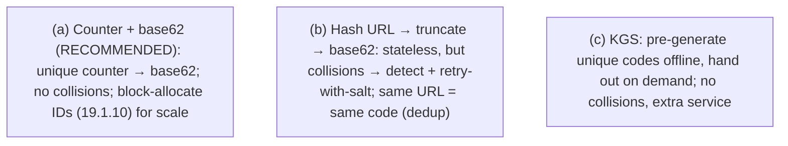

# Lesson 19.1.1 — Design a URL Shortener (TinyURL)

> Part 19 · Module 19.1 (Volume 1) · Difficulty: 🟡 · *Interview design*
>
> **Prerequisites:** [1.3.1 Design Framework], [1.1.4 Capacity Estimation], [5.1.1 Data Models], [Part 6 Caching], [7.3 Sharding], [19.1.10 ID Generation (related)].
> **Unlocks:** [19.1.x other designs], [Part 20 Capstone].

---

## 1. Learning Objectives

After this lesson you will be able to:

- Drive a **URL-shortener design** end-to-end using the **framework** (1.3.1/1.3.2): requirements → estimation → API → data model → HLD → deep dives → bottlenecks.
- Design the **short-code generation** scheme (counter+base62 vs hash vs KGS) and justify the choice.
- Recognize the workload as **read-heavy** → **cache-first** (Part 6) + a simple KV store (5.1.1) that **scales easily** (7.3).
- Handle the deep dives: **collisions**, **custom aliases**, **analytics**, **expiration**, and **read scaling**.
- Use this as the **template** for the simpler Volume-1 designs.

---

## 2. Problem statement

Design a service like **TinyURL/bit.ly**: given a long URL, produce a **short URL** (e.g., `short.ly/abc123`); when a user visits the short URL, **redirect** them to the original long URL. It's a deceptively simple, classic **warm-up** interview design — but it exercises the full framework and several core decisions (ID/code generation, read-heavy caching, simple-but-scalable storage).

---

## 3. The design (framework-driven — 1.3.1/1.3.2)

### 3.1 Step 1 — Requirements

`[BP]` **Functional:**
- **Shorten:** long URL → short URL (optionally a **custom alias** + **expiration**).
- **Redirect:** short URL → **HTTP redirect** (301/302) to the long URL.
- (Optional) **Analytics:** click counts, referrers.

**Non-functional:**
- **Read-heavy:** redirects (reads) **vastly outnumber** creations (writes) — a **~100:1+** read:write ratio (illustrative) → optimize reads.
- **Low latency** redirects (users wait on them) → cache (Part 6).
- **High availability** (a dead short link is bad UX).
- **Short codes** (small, unique, hard-to-guess-ish).
- **Scalable** (billions of URLs over time).
- `[BP]` **The key signal:** **read-heavy + simple data** → this is a **cache + KV-store** problem (Part 6/5.1.1), easy to scale (7.3). Drive the conversation to code-generation + read scaling.

### 3.2 Step 2 — Capacity estimation (1.1.4)

`[BP]` Illustrative (label as estimates):
- Say **100M** new URLs/day → ~**1,160 writes/sec** avg (×peak factor). Reads at 100:1 → ~**116K reads/sec** — **read-dominated**.
- **Storage:** 100M/day × 365 × several years × ~500 bytes/record → **~TBs over years** — modest; a KV store handles it (7.3).
- **Short-code space:** base62 (a–z, A–Z, 0–9) → **62^7 ≈ 3.5 trillion** 7-char codes — ample. Even 6 chars = ~56B. **7 chars is plenty.**
- `[BP]` **Conclusion:** read-heavy, modest storage, tiny per-record → **cache-first reads + a simple sharded KV store + a short-code scheme**.

### 3.3 Step 3 — API

`[BP]`
- `POST /shorten { longUrl, customAlias?, expiry? } → { shortUrl }`
- `GET /{shortCode} → 301/302 redirect to longUrl`
- (Analytics) `GET /{shortCode}/stats`
- `[BP]` **301 (permanent) vs 302 (temporary):** 301 is cached by browsers (fewer server hits — good for load, but you lose per-click analytics + can't easily change the target); **302** hits your server each time (enables analytics + changeable target). **Choose 302 if you need analytics/control; 301 for max offload.** A common interview discussion point.

### 3.4 Step 4 — Data model (5.1.1)

`[BP]` A simple **key-value** mapping (5.1.1):
- `shortCode (PK) → { longUrl, createdAt, expiry?, ownerId?, clickCount? }`
- `[BP]` **This is a KV/wide-column workload** (5.1.1/18.2) — lookup by short code (partition key — 7.3), no joins, simple → scales trivially by **sharding on shortCode** (7.3). A relational DB works at small scale (5.4.1); a KV/wide-column store (18.2) for large scale.

### 3.5 Step 5 — Short-code generation (the core decision)

`[CS]` How to generate the **unique short code** — three approaches `[BP]`:
- **(a) Counter + base62 encoding (recommended):** maintain a **global unique counter** (a monotonically-increasing ID — 19.1.10) → **base62-encode** it → the short code. **Guarantees uniqueness** (no collisions — the counter is unique), short codes, sequential. **Distributed counter** via a range-allocation scheme (each server grabs a **block** of IDs — e.g., 1000 at a time — from a central allocator → no per-write coordination — 19.1.10) or a distributed ID generator (Snowflake-style — 19.1.10). `[BP]` **Preferred:** simple, collision-free, scalable.
- **(b) Hash the URL (MD5/SHA → truncate → base62):** hash the long URL, take the first N chars. **Simple, stateless**, but **collisions** (truncation → two URLs map to the same code) → must **detect + resolve** (check-and-retry with a salt — §3.7). Also, the same URL → same code (dedup for free, but not for custom/expiring).
- **(c) Key Generation Service (KGS):** **pre-generate** random unique codes offline into a database; hand them out on demand. Avoids collisions + on-the-fly work, but adds a service + must handle concurrency (mark used).
- `[BP]` **Recommendation:** **counter + base62** (a) for guaranteed uniqueness + scalability (via block-allocation — 19.1.10), unless you want URL-dedup (then hash — b) — discuss the tradeoffs.

### 3.6 Step 6 — HLD

`[BP]` The architecture:
- **Write path (shorten):** client → **API/LB** (3.3.1) → **shorten service** → generate short code (§3.5) → **store** the mapping (KV/DB — §3.4) → return short URL.
- **Read path (redirect — the hot path):** client → **API/LB** → **redirect service** → **check cache** (Part 6 — cache-aside — 6.3) → on hit, **redirect** (fast); on miss, **read from the KV store**, **populate cache**, redirect. **Cache is essential** — read-heavy (§3.1), and the mapping is **immutable** (a code always maps to the same URL) → **highly cacheable** (near-100% hit ratio for popular links — 6.1).
- **CDN/edge** (18.4/3.3.3): redirects can be served/cached at the edge for global low latency.
- `[BP]` **The hot path is a cache lookup + redirect** — trivially fast + scalable (Part 6). The KV store is the source of truth; the cache absorbs the read load.

### 3.7 Deep dives + bottlenecks (1.3.2)

`[BP]` Where the interview goes deep:
- **Collisions** (§3.5): counter+base62 has **none** (unique counter); hashing needs **detect + retry-with-salt** (or use approach a).
- **Custom aliases:** user-provided code → **check uniqueness** (already taken? reject) → store; reserve a separate namespace.
- **Read scaling** (7.5): **cache** (Part 6 — the main lever) + **read replicas** (7.5) + **CDN** (18.4) → handle the 100:1 read load easily.
- **Analytics:** counting clicks per redirect → don't do a **synchronous DB write per redirect** (slows the hot path + write load) → **emit an event** (async — Part 9/18.1) to an analytics pipeline (aggregate offline — 18.1) → keeps redirects fast. (Requires 302 — §3.3.)
- **Expiration:** store an `expiry`; on read, check + treat expired as 404; **lazy deletion** or a background cleanup job (TTL — 6.4).
- **Availability:** replicate the KV store (10.1) + cache; a redirect must (almost) never fail.
- **Bottleneck:** none serious — it's read-heavy + simple → **cache + sharded KV** dissolves it. The **code-generation counter** is the only coordination point → **block-allocation** (19.1.10) removes it.
- `[BP]` **The lesson:** URL shortener is **read-heavy + simple** → **cache-first + simple sharded KV + a good code-generation scheme** → an easy, highly-scalable design. The interesting parts are **code generation** (§3.5) and **async analytics** (§3.7).

---

## 4. Visual Intuition

### The read (redirect) hot path

```mermaid
flowchart LR
    USER["User visits short.ly/abc123"] --> LB["API / LB (3.3.1)"]
    LB --> REDIR["Redirect service"]
    REDIR --> CACHE{"Cache hit? (Part 6 — immutable mapping, ~100% hit)"}
    CACHE -->|hit| REDIRECT["301/302 → longUrl (fast)"]
    CACHE -->|miss| KV[("KV store (sharded by shortCode — 7.3)")]
    KV --> POP["Populate cache → redirect"]
    REDIR -.async click event (Part 9/18.1).-> ANALYTICS["Analytics pipeline (offline aggregation)"]
    note["Read-heavy → cache-first; immutable mapping → highly cacheable; analytics async (don't slow the hot path)"]
```

### Short-code generation options



---

## 5. Real-World Analogy

Think of a **coat check** at a huge venue that must be **lightning-fast to redeem** (reads) but only occasionally issues new tickets (writes).

- **Shorten = issuing a ticket:** you hand in your coat (the long URL) and get a **small numbered ticket** (the short code). Issuing tickets is **infrequent**, so it can take a moment (generate a unique number, file the coat).
- **Redirect = redeeming a ticket:** far more often, people **redeem tickets** to get their coats back — this must be **instant**. So the attendant keeps the **most-requested coats on a rack right at the counter** (cache) rather than walking to the back every time (the KV store). Since **a ticket always maps to the same coat** (immutable), caching is trivially effective.
- **Ticket numbers = code generation:** the cleanest scheme is a **sequential counter** encoded compactly (counter + base62) — **guaranteed unique**, no two tickets clash. To avoid a bottleneck at one ticket machine, each counter **hands out blocks of numbers** to sub-stations (block allocation). Alternatively you could **derive the number from the coat itself** (hash) — but then two similar coats might get the same number (collision), needing a tiebreaker.
- **Analytics = counting redemptions without slowing the line:** to count how often each ticket is redeemed, you **don't stop to update a ledger at the counter** (that would slow the queue) — you **drop a slip in a box** (async event) that someone **tallies later**. The redemption line stays fast.
- **The lesson:** it's a **read-heavy, simple** service → **keep popular items cached at the counter, use unique sequential tickets, and count asynchronously** — fast and effortlessly scalable.

---

## 6. Industry Example

- **TinyURL / bit.ly** `[CONV]`: the canonical URL-shortener design (§2). *(Representative.)*
- **Counter + base62** `[CONV]`: sequential-ID + base62 as the collision-free code scheme (§3.5). *(Representative.)*
- **Read-heavy → cache-first + CDN** `[CONV]`: caching the immutable mapping + edge for low-latency redirects (§3.6, Part 6/18.4). *(Representative.)*
- **Async click analytics** `[CONV]`: emitting redirect events to an analytics pipeline (§3.7, Part 9/18.1). *(Representative.)*
- **301 vs 302** `[CONV]`: the caching-vs-analytics tradeoff of redirect codes (§3.3). *(Representative.)*

---

## 7. Implementation Details (design decisions)

- **Framework** (1.3.1/1.3.2): requirements (read-heavy) → estimation (§3.2) → API (§3.3) → data model (KV — §3.4) → HLD (§3.6) → deep dives (§3.7).
- **Code generation:** counter + base62 with **block-allocation** (19.1.10) for collision-free, scalable codes (or hash+retry for URL-dedup) (§3.5).
- **Storage:** simple **KV/wide-column** (5.1.1/18.2), sharded by shortCode (7.3); relational at small scale (5.4.1).
- **Read path:** **cache-first** (Part 6 — cache-aside — 6.3; immutable → high hit ratio) + read replicas (7.5) + CDN/edge (18.4).
- **Redirect code:** 302 if you need analytics/changeable targets; 301 for max offload (§3.3).
- **Analytics async** (§3.7, Part 9/18.1) — don't write per redirect; emit events.
- **Expiration** via `expiry` + lazy/background cleanup (6.4); **custom aliases** with uniqueness check + namespace.
- **Availability:** replicate KV + cache (10.1); redirects near-always succeed.

---

## 8. Advantages / 9. Disadvantages (of the design choices)

**Advantages:** trivially scalable (read-heavy + cache-first + sharded KV), low-latency redirects, collision-free codes (counter+base62), fast async analytics.
**Disadvantages / cautions:** the counter is a coordination point (mitigate with block allocation); hashing needs collision handling; 301 loses analytics; analytics pipeline is extra infrastructure.

---

## 10. When NOT to / cautions

- **Don't do a synchronous DB write per redirect** (analytics) — async (§3.7).
- **Don't use a single global counter** without block-allocation — a write bottleneck (§3.5, 19.1.10).
- **Don't skip caching** — it's the whole point (read-heavy, immutable) (§3.6).
- **Don't use 301 if you need per-click analytics** (§3.3).
- **Don't over-engineer** — it's a simple service; the depth is code-gen + read scaling + async analytics.

---

## 11. Common Mistakes

1. **Synchronous analytics write per redirect** → slow hot path + write load (§3.7).
2. **Single global counter bottleneck** → no block allocation (§3.5).
3. **No caching** → hammering the DB for a read-heavy, cacheable workload (§3.6).
4. **Hash without collision handling** → duplicate codes (§3.5).
5. **301 when analytics needed** → losing click data (§3.3).
6. **Over-engineering** — reaching for complex storage when a KV store + cache suffices (§3.4).

---

## 12. Interview Questions

**🟢 Easy** — How do you generate the short code? Why is this read-heavy, and what follows?
**🟡 Medium** — Counter+base62 vs hashing vs KGS — tradeoffs? How do you handle custom aliases + expiration?
**🔴 Hard** — How do you scale reads (cache/replicas/CDN) and do analytics without slowing redirects (async)? 301 vs 302?
**⚫ Staff+** — Walk the full design (framework), justify the code-gen scheme + block allocation (19.1.10), the caching strategy, async analytics pipeline, and why there's essentially no serious bottleneck.

---

## 13. Production Pitfalls

- **Analytics slowing redirects** (synchronous writes) — move to async (§3.7).
- **Counter contention** — single counter without block allocation (§3.5).
- **Cache misses under load** — cold cache or low hit ratio (should be near-100% — immutable) (§3.6).
- **Hash collisions** unhandled → wrong redirects (§3.5).
- **Expired links not handled** → redirecting to stale/dead targets (§3.7).

---

## 14. Optimization Techniques

- **Cache-first (Part 6) + CDN/edge (18.4)** for the read-heavy, immutable hot path (§3.6).
- **Counter + base62 + block allocation (19.1.10)** for collision-free, scalable codes (§3.5).
- **Async analytics (Part 9/18.1)** to keep redirects fast (§3.7).
- **Sharded KV (7.3) + read replicas (7.5)** for storage scale (§3.4/3.7).
- **302 for analytics/control** or **301 for max offload** per needs (§3.3).

---

## 15. Summary

A **URL shortener** (TinyURL/bit.ly) is the classic **warm-up** interview design that still exercises the full **framework** (1.3.1/1.3.2). **Functional:** shorten (long URL → short URL, optionally custom alias + expiry) + redirect (short → HTTP 301/302 to the long URL) + optional analytics. The **key non-functional signal is read-heavy** — redirects vastly outnumber creations (~100:1+) — so this is fundamentally a **cache + simple-KV-store** problem (Part 6/5.1.1/18.2) that **scales easily** (7.3). **Estimation** (1.1.4): read-dominated, modest storage (TBs over years), and a **base62 7-char code space is ~3.5 trillion** (ample). The **data model** is a simple KV mapping (`shortCode → longUrl + metadata`) sharded by shortCode (7.3, no joins → scales trivially). The **core decision is short-code generation**: **(a) counter + base62** (recommended — a unique global counter base62-encoded → **collision-free**, scaled via **block-allocation** of ID ranges — 19.1.10 — to remove the coordination bottleneck), **(b) hash the URL + truncate** (stateless but **collision-prone** → detect + retry-with-salt; gives free URL-dedup), or **(c) a Key Generation Service** (pre-generated unique codes). The **HLD**: the **write path** generates a code + stores the mapping; the **read (redirect) hot path** is **cache-first** (Part 6 — cache-aside — 6.3) because the mapping is **immutable** (a code always maps to the same URL → **near-100% cache hit ratio** — 6.1) + read replicas (7.5) + **CDN/edge** (18.4) → the redirect is just a **cache lookup + redirect**, trivially fast and scalable. **Deep dives:** collisions (none with counter+base62), custom aliases (uniqueness check), **read scaling** (cache is the main lever), **analytics** (emit an **async event** per redirect to an offline pipeline — Part 9/18.1 — never a synchronous DB write per redirect; requires 302 not 301 — the caching-vs-analytics tradeoff), and expiration (TTL + lazy/background cleanup — 6.4). There's **no serious bottleneck** — read-heavy + simple + cacheable → **cache + sharded KV + good code-gen** dissolves it — making this the **template for the simpler Volume-1 designs**, where the interesting depth is **code generation** and **async analytics**.

---

## 16. Revision Notes (flashcard-ready)

- **Q:** Key characteristic? **A:** Read-heavy (redirects ≫ creations, ~100:1) + simple + immutable mapping → cache + simple KV store.
- **Q:** Short-code generation options? **A:** (a) counter+base62 (recommended, collision-free, block-allocate), (b) hash+truncate (collisions → retry, free dedup), (c) KGS (pre-generated).
- **Q:** Why cache-first? **A:** Read-heavy + immutable mapping → near-100% cache hit ratio; the hot path is a cache lookup + redirect.
- **Q:** Data model? **A:** KV: shortCode → longUrl + metadata; sharded by shortCode (7.3), no joins.
- **Q:** 301 vs 302? **A:** 301 = browser-cached (max offload, no per-click analytics); 302 = hits server (analytics + changeable target).
- **Q:** Analytics without slowing redirects? **A:** Emit an async click event to an offline pipeline (Part 9/18.1) — never a synchronous DB write per redirect.
- **Q:** Counter bottleneck fix? **A:** Block-allocate ID ranges (each server grabs N IDs) — no per-write coordination (19.1.10).
- **Q:** Code space? **A:** base62, 7 chars ≈ 62^7 ≈ 3.5 trillion — ample.
- **Q:** Is there a serious bottleneck? **A:** No — read-heavy/simple/cacheable → cache + sharded KV + good code-gen dissolves it.
- **Q:** The interesting depth? **A:** Code generation (§3.5) + async analytics (§3.7) + read scaling (cache/replicas/CDN).

---

## 17. Further Reading + Knowledge-Graph Links

**Foundations:** [1.3.1 Framework] · [1.1.4 Estimation] · [Part 6 Caching] · [7.3 Sharding] · [7.5 Read Scaling] · [18.4 CDN] · [19.1.10 ID Generation].
**External:** Standard system-design-interview URL-shortener treatments. *(Representative.)*

> **Knowledge-graph:** `framework` + `Part 6 caching` + `7.3 sharding` + `19.1.10 ID gen` → **`19.1.1 URL shortener`** (read-heavy, cache-first, counter+base62) — the template for simpler Vol-1 designs.
