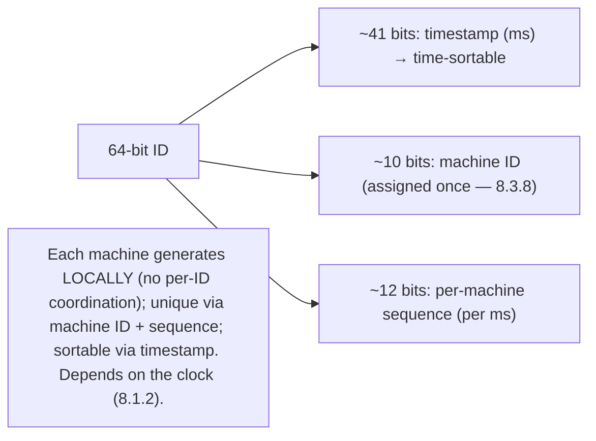
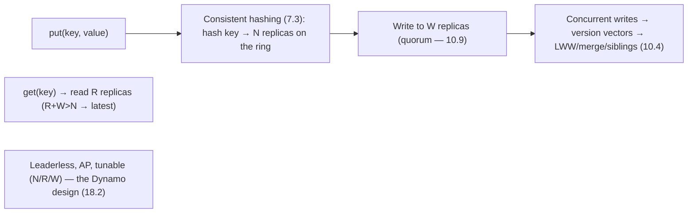

# Lesson 19.1.10 — Design a Unique-ID Generator and a Key-Value Store

> Part 19 · Module 19.1 (Volume 1) · Difficulty: 🔴 · *Interview design*
>
> **Prerequisites:** [8.1.2 Clocks], [8.3 Consensus/Coordination], [7.3 Consistent Hashing], [10.1/10.9 Replication/Quorums], [18.2 Wide-Column], [1.3.1 Framework].
> **Unlocks:** [19.1.1 URL Shortener], [Part 20 Capstone].

---

## 1. Learning Objectives

After this lesson you will be able to:

- Design a **distributed unique-ID generator**: generate **globally-unique, roughly-sortable** IDs at scale without a central bottleneck (Snowflake-style, block allocation, UUIDs).
- Explain the ID approaches: **UUID** (no coordination, not sortable), **DB auto-increment** (sortable, bottleneck), **Snowflake** (timestamp + machine + sequence — sortable, distributed), **block/range allocation**.
- Design a **distributed key-value store** (the Dynamo lineage — 18.2): consistent hashing (7.3), replication + quorums (10.1/10.9), conflict resolution (10.4).
- Recognize these as **fundamentals-composition** designs (clocks — 8.1.2, coordination — 8.3, consistent hashing — 7.3, quorums — 10.9).
- Understand the **coordination-avoidance** theme (avoid a central bottleneck).

---

## 2. Problem statement

Two related classic designs: **(A) a distributed unique-ID generator** — produce **globally-unique IDs** at high throughput without a central bottleneck (needed by URL shorteners — 19.1.1, sharded DBs, distributed systems generally); and **(B) a distributed key-value store** — the **Dynamo-lineage** (18.2) design (consistent hashing + quorums + conflict resolution). Both are **fundamentals-composition** designs testing distributed-systems knowledge (Parts 7/8/10).

---

## 3. Part A — Unique-ID Generator (framework — 1.3.1)

### 3.1 Requirements

`[BP]`
- **Functional:** generate **globally-unique** IDs; ideally **roughly time-sortable** (k-sorted — useful for ordering, DB indexing — 4.2.5) and **compact** (numeric/64-bit).
- **Non-functional:** **high throughput**, **no single-point bottleneck** (avoid central coordination on every ID), **highly available**, **low latency** (IDs are on the write path).
- `[BP]` **Key tension:** **uniqueness** usually wants coordination, but coordination is a **bottleneck** → the art is **generating unique IDs without per-ID coordination** (the coordination-avoidance theme).

### 3.2 The approaches

`[CS]` Four approaches with tradeoffs `[BP]`:
- **(a) UUID (v4, random):** 128-bit random → **globally unique with NO coordination** (each node generates independently). **But:** large (128-bit), **not sortable** (random → bad for DB indexing — random inserts hurt B-trees — 4.2.2), not compact.
- **(b) DB auto-increment:** a central DB generates sequential IDs → **sortable + compact**, but a **central bottleneck + SPOF** (every ID needs the DB) → doesn't scale.
- **(c) Snowflake (recommended):** a **64-bit ID** composed of **[timestamp | machine/worker ID | per-machine sequence]** → **each machine generates IDs locally** (no per-ID coordination — just a unique machine ID assigned once) → **high throughput + no bottleneck**, **roughly time-sortable** (timestamp prefix → k-sorted — great for indexing/ordering), compact (64-bit). **The standard distributed-ID approach.** (Depends on machine clocks — 8.1.2 — handle clock skew/backwards-time carefully.)
- **(d) Block/range allocation:** a central allocator hands out **blocks/ranges of IDs** (e.g., 1000 at a time) to each server → servers generate from their block locally → **coordination amortized** (once per block, not per ID) → sortable, low coordination. (Used by URL shorteners — 19.1.1.)
- `[BP]` **Recommendation: Snowflake** (timestamp + machine + sequence — distributed, sortable, compact, no per-ID coordination) or **block allocation** (if you want strictly sequential + central control). UUID if you don't need sortable + want zero coordination; DB auto-increment only at small scale.

### 3.3 Snowflake deep dive

`[CS]` The 64-bit layout (representative) `[CS]`:
- **~41 bits timestamp** (ms since an epoch — gives ~decades) → **time-sortable prefix**.
- **~10 bits machine/worker ID** (assigned once, e.g., by a coordination service — ZooKeeper/etcd — 8.3.8) → up to ~1024 machines.
- **~12 bits sequence** (per-machine, per-ms counter) → ~4096 IDs/ms/machine.
- **Each machine generates locally:** timestamp + its machine ID + an incrementing sequence → **unique** (machine ID makes machines disjoint; sequence makes same-ms IDs disjoint) with **no per-ID coordination**.
- **Clock issues** (8.1.2): relies on the machine clock advancing; **clock skew/backwards** (NTP adjustment) → handle (wait, or refuse to go backwards) to avoid duplicate/out-of-order IDs.
- `[BP]` Snowflake = **local generation + a unique machine ID (one-time coordination) + a time prefix** → distributed, sortable, no bottleneck. The clock dependency (8.1.2) is the subtlety.

## Part B — Distributed Key-Value Store

### 3.4 The KV store = Dynamo lineage (18.2)

`[CS]` A distributed KV store is essentially the **Dynamo design** (18.2) `[BP]`:
- **Consistent hashing** (7.3): partition keys across nodes on a ring (+ virtual nodes) → elastic, balanced, decentralized placement.
- **Replication** (10.1): replicate each key to **N** nodes (the next N on the ring) → durability + availability.
- **Quorums (R+W>N)** (10.9/8.3.4): tunable consistency (§3.5).
- **Conflict resolution** (10.4): leaderless write-anywhere → concurrent writes conflict → version vectors + LWW/CRDTs/siblings.
- **Membership/failure detection** (8.3.5): gossip (SWIM) to track live nodes; hinted handoff for temporary failures (10.9).
- `[BP]` This **is 18.2** (the Dynamo-lineage design) — see 18.2 for full detail. The interview asks you to **compose consistent hashing + quorums + conflict resolution**.

### 3.5 KV-store consistency + operations

`[BP]`
- **get/put(key, value):** hash key → find N replicas (consistent hashing — 7.3) → write to W / read from R (quorum — 10.9).
- **Tunable consistency** (10.9): R+W>N for read-your-latest; AP-fast (low R/W) or stronger (higher R/W) per operation (10.7/10.8).
- **Conflict resolution** (10.4): version vectors detect concurrent writes → resolve (LWW/merge/siblings).
- **Anti-entropy** (10.x): Merkle trees / read repair to reconcile divergent replicas.
- `[BP]` **AP by default, tunable** (like 18.2/10.9) — write-anywhere + quorums + conflict resolution.

### 3.6 Deep dives + bottlenecks

`[BP]`
- **ID gen: no per-ID coordination** (Snowflake local gen / block allocation) — the whole point; **clock skew** (8.1.2) is the subtlety; **machine-ID assignment** (8.3.8, one-time).
- **KV store: consistent hashing rebalancing** (7.3 — minimal data movement), **hot keys** (7.4), **quorum/conflict tradeoffs** (10.9/10.4), **membership/gossip** (8.3.5).
- **Bottleneck:** ID gen — avoided by design (local generation); KV store — consistent hashing + leaderless → no central bottleneck (18.2).
- `[BP]` **The lesson:** both are **coordination-avoidance** designs. **ID gen:** generate unique IDs **locally** (Snowflake: time + machine + sequence; or block allocation) to avoid a central bottleneck, handling clock skew (8.1.2). **KV store:** the Dynamo lineage (18.2) — consistent hashing (7.3) + quorums (10.9) + conflict resolution (10.4) — decentralized, AP, tunable. Fundamentals composed (Parts 7/8/10).

---

## 4. Visual Intuition

### Snowflake ID (64-bit)

### KV store = Dynamo lineage (18.2)

---

## 5. Real-World Analogy

**ID generator:** Think of issuing **unique serial numbers** across many factories without a central office stamping each one (a bottleneck). **Snowflake** = each factory stamps serials as **[date-time] + [its unique factory number] + [a running counter that resets each moment]** — so serials are **unique** (no two factories share a factory number; the counter separates same-moment items) and **roughly time-ordered** (the date-time prefix), all **without any factory phoning a central office per serial** (only the one-time assignment of each factory's number). **Block allocation** = a central office hands each factory a **book of 1000 pre-assigned numbers** at a time, so factories rarely need to call in. A **UUID** = each factory just picks a **huge random number** — guaranteed-ish unique with no coordination, but not ordered and bulky.

**KV store:** (see 18.2) = a **national self-service locker network** — lockers assigned by a **hashing rule** (consistent hashing), each item stored in **N nearby lockers** (replication), retrievable/depositable at **any of them** (leaderless/AP), confirmed by a **quorum**, with **conflict reconciliation** when two people update the same locker at once.

---

## 6. Industry Example

- **Twitter Snowflake** `[CONV]`: 64-bit timestamp + machine + sequence distributed IDs (§3.3). *(Representative.)*
- **Block/range allocation** `[CONV]`: central allocator hands out ID ranges (used by URL shorteners — 19.1.1) (§3.2). *(Representative.)*
- **UUIDs** `[CONV]`: zero-coordination random IDs (not sortable) (§3.2). *(Representative.)*
- **Dynamo-lineage KV stores (Cassandra/DynamoDB)** `[CONV]`: consistent hashing + quorums + conflict resolution (§3.4, 18.2). *(Representative.)*
- **Machine-ID assignment via coordination service** `[CONV]`: ZooKeeper/etcd for one-time worker-ID assignment (§3.3, 8.3.8). *(Representative.)*

---

## 7. Implementation Details

- **ID gen:** **Snowflake** (timestamp | machine ID | sequence — local generation, sortable, 64-bit) or **block allocation** (central allocator, ranges) or **UUID** (zero-coordination, not sortable); assign machine IDs via a coordination service (8.3.8); **handle clock skew/backwards** (8.1.2).
- **KV store** (= 18.2): consistent hashing (7.3, vnodes) + replication (N — 10.1) + quorums (R+W>N — 10.9) + conflict resolution (version vectors + LWW/merge/siblings — 10.4) + gossip membership (8.3.5) + anti-entropy (Merkle/read-repair) + hinted handoff (10.9).
- Both **avoid central coordination** on the hot path (local ID gen; decentralized KV placement).

---

## 8–14. (Advantages / disadvantages / mistakes / questions / pitfalls / optimizations)

**Advantages:** ID gen — no bottleneck (local), sortable (Snowflake), high throughput; KV store — decentralized, AP, elastic, tunable (18.2).
**Disadvantages/cautions:** Snowflake clock dependency (skew/backwards — 8.1.2); UUID not sortable + bulky; KV store — conflict handling + eventual consistency (18.2).
**Common mistakes:** central ID bottleneck (DB auto-increment at scale); random UUIDs as DB PKs (index fragmentation — 4.2.2); ignoring clock skew (Snowflake duplicates/misorder); treating the KV store like a strongly-consistent DB (it's AP — 18.2).
**Interview Qs:** 🟢 How to generate unique IDs without a bottleneck (Snowflake)? 🟡 Snowflake layout + clock issues? UUID vs Snowflake vs block? 🔴 KV store: consistent hashing + quorums + conflict resolution (18.2)? ⚫ Design both; the coordination-avoidance theme.
**Production pitfalls:** clock-backwards → duplicate/out-of-order Snowflake IDs; ID central-bottleneck (auto-increment); UUID index fragmentation; KV hot keys (7.4); conflict data loss (LWW — 10.4).
**Optimizations:** Snowflake local gen + clock-skew handling; block allocation to amortize coordination; consistent hashing + vnodes (KV); tunable quorums (10.9); anti-entropy + hinted handoff.

---

## 15. Summary

Two classic **fundamentals-composition** designs. **(A) A distributed unique-ID generator** must produce **globally-unique** (ideally **roughly time-sortable + compact**) IDs at **high throughput with no central bottleneck** — the tension being that **uniqueness wants coordination but coordination is a bottleneck**, so the art is **generating unique IDs without per-ID coordination** (the coordination-avoidance theme). Approaches: **UUID** (128-bit random → unique with zero coordination, but **not sortable** + bulky → poor DB primary keys, index fragmentation — 4.2.2); **DB auto-increment** (sortable/compact but a **central bottleneck + SPOF** → doesn't scale); **Snowflake (recommended)** — a **64-bit ID = [~41-bit timestamp | ~10-bit machine ID | ~12-bit per-machine sequence]** where **each machine generates locally** (unique via a one-time-assigned machine ID + a per-ms sequence — no per-ID coordination — high throughput, no bottleneck), **roughly time-sortable** (timestamp prefix → k-sorted, great for indexing/ordering), and **compact** — depending on machine **clocks** (8.1.2), so **clock skew/backwards-time** must be handled (wait or refuse to go backwards, else duplicate/out-of-order IDs); and **block/range allocation** (a central allocator hands out **ID blocks** to servers → coordination amortized once per block, not per ID — used by URL shorteners — 19.1.1). **(B) A distributed key-value store** is essentially the **Dynamo lineage** (18.2): **consistent hashing** (7.3 + virtual nodes → elastic, balanced, decentralized placement) + **replication** to N nodes (10.1) + **quorums** (R+W>N — 10.9/8.3.4 → tunable consistency, AP by default — 10.7) + **conflict resolution** (leaderless write-anywhere → concurrent writes conflict → version vectors + LWW/merge/siblings — 10.4) + **gossip membership** (SWIM — 8.3.5) + **anti-entropy** (Merkle trees/read repair) + **hinted handoff** (10.9) — get/put hash the key to N replicas, write W / read R, resolve conflicts (see 18.2 for full depth). Both designs share the **coordination-avoidance** theme: **ID gen generates locally** (Snowflake / block allocation) to avoid a central bottleneck (clock skew — 8.1.2 — the subtlety; machine-ID assignment via a coordination service — 8.3.8), and the **KV store decentralizes placement** (consistent hashing) + replication/quorums (no central bottleneck, AP/tunable). They're canonical exercises in **composing the distributed-systems fundamentals** (clocks — 8, consistent hashing — 7.3, quorums/replication/conflicts — 10) — and the ID generator directly enables URL shorteners (19.1.1) and sharded systems.

---

## 16. Revision Notes (flashcard-ready)

- **Q:** ID-gen tension? **A:** Uniqueness wants coordination, but coordination is a bottleneck → generate unique IDs without per-ID coordination.
- **Q:** UUID? **A:** 128-bit random → unique, zero coordination; NOT sortable + bulky → poor DB PK (index fragmentation).
- **Q:** Snowflake? **A:** 64-bit [timestamp | machine ID | sequence]; local generation, unique, roughly time-sortable, compact, no per-ID coordination.
- **Q:** Snowflake subtlety? **A:** Depends on machine clocks (8.1.2) → handle clock skew/backwards (else duplicate/out-of-order IDs).
- **Q:** Block allocation? **A:** Central allocator hands out ID ranges → coordination amortized once per block (used by URL shorteners).
- **Q:** DB auto-increment? **A:** Sortable/compact but a central bottleneck/SPOF → only at small scale.
- **Q:** Distributed KV store = ? **A:** The Dynamo lineage (18.2): consistent hashing + replication + quorums + conflict resolution + gossip + anti-entropy.
- **Q:** KV consistency? **A:** AP by default, tunable via N/R/W (R+W>N for read-your-latest — 10.9); conflicts via version vectors (10.4).
- **Q:** Shared theme? **A:** Coordination avoidance — local ID gen; decentralized KV placement (no central bottleneck).
- **Q:** Fundamentals composed? **A:** Clocks (8.1.2), coordination (8.3), consistent hashing (7.3), replication/quorums/conflicts (10).

---

## 17. Further Reading + Knowledge-Graph Links

**Foundations:** [8.1.2 Clocks] · [8.3 Consensus/Coordination] · [7.3 Consistent Hashing] · [10.1/10.9 Replication/Quorums] · [10.4 Conflicts] · [18.2 Wide-Column/Dynamo].
**Unlocks:** [19.1.1 URL Shortener] (uses ID gen).
**External:** Twitter Snowflake; Dynamo paper. *(Representative.)*

> **Knowledge-graph:** `8.1.2 clocks` + `8.3.8 coordination` → **Snowflake ID gen**; `7.3 consistent hashing` + `10.9 quorums` + `10.4 conflicts` + `18.2` → **distributed KV store**; both = **`19.1.10`** (coordination avoidance) → enables `19.1.1`.
