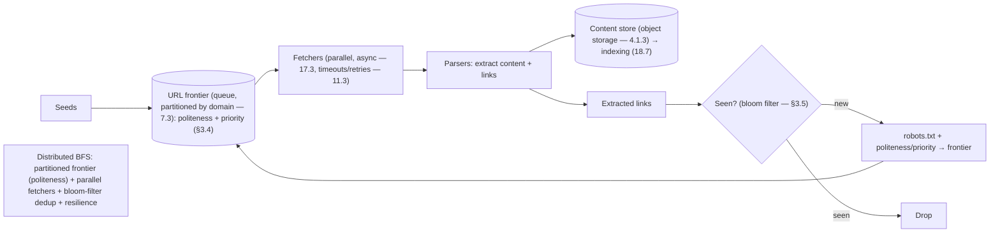

# Lesson 19.1.3 — Design a Web Crawler

> Part 19 · Module 19.1 (Volume 1) · Difficulty: 🔴 · *Interview design*
>
> **Prerequisites:** [9.1 Messaging (queues)], [7.3 Sharding], [11.3 Resilience], [15.7 Rate Limiting (politeness)], [4.1.3 Object Storage], [1.3.1 Framework].
> **Unlocks:** [19.1.9 Autocomplete], [19.2.7 Recommendations], [Part 20 Capstone].

---

## 1. Learning Objectives

After this lesson you will be able to:

- Design a **large-scale web crawler**: a **BFS over the web graph** using a **URL frontier (queue)**, fetchers, parsers, and a **seen-set** for dedup.
- Explain the **politeness** requirement (per-domain rate limiting — 15.7, robots.txt) and how the frontier enforces it.
- Handle **scale + dedup** (billions of URLs → bloom filters, sharding — 7.3), **freshness** (re-crawl), and **traps** (infinite/malicious pages).
- Apply **resilience** (11.3 — timeouts/retries) and **distributed coordination** (partition the frontier).
- Recognize the crawler as a **distributed BFS + queue + dedup** problem.

---

## 2. Problem statement

Design a **web crawler** (like a search-engine crawler): starting from **seed URLs**, systematically **download web pages, extract links, and follow them** — traversing the web graph — to build a corpus (for search — 18.7, indexing). At scale: **billions of pages**, **politeness** (don't hammer sites), **dedup** (don't re-crawl the same URL), **freshness** (re-crawl changed pages), and **robustness** (traps, failures). A classic design exercising **queues, dedup at scale, and distributed coordination**.

---

## 3. The design (framework — 1.3.1)

### 3.1 Requirements

`[BP]`
- **Functional:** start from seeds → fetch pages → extract links → follow (BFS over the web graph); **store** page content (for indexing — 18.7); **dedup** URLs; respect **politeness** (robots.txt, per-domain rate limits); **re-crawl** for freshness.
- **Non-functional:** **scale** (billions of pages), **politeness** (be a good web citizen — don't overload sites), **robust** (traps, failures, malformed pages — 11.3), **extensible** (parse different content), **efficient** (prioritize valuable/fresh pages).
- `[BP]` **Key signals:** it's a **distributed BFS** over a huge graph → a **URL frontier (queue) + dedup + politeness + parallel fetchers**. The frontier design (politeness + prioritization) is the crux.

### 3.2 High-level components

`[BP]` The crawler is a **pipeline** around a **URL frontier** (9.1 queue):
1. **URL frontier (the queue):** holds URLs to crawl (BFS — seeds first, then discovered links). **Enforces politeness + prioritization** (§3.4). The heart of the design.
2. **Fetchers (downloaders):** pull URLs from the frontier, **download** the page (many in parallel — I/O-bound → async — 17.3), with **timeouts/retries** (11.3).
3. **Parsers:** extract **content** (→ storage) + **links** (→ back to the frontier after dedup + filtering).
4. **Seen-set (dedup):** track **already-crawled/queued URLs** to avoid re-crawling (§3.5).
5. **Content store:** save page content (object storage — 4.1.3) for downstream indexing (18.7).
6. **Scheduler/re-crawler:** re-queue pages for **freshness** (§3.6).
- `[BP]` **Flow:** frontier → fetcher → parser → (content → store; links → dedup → filter → frontier). A **loop** (BFS) driven by the queue.

### 3.3 Data flow (BFS via the frontier)

`[CS]` The crawler is a **breadth-first traversal of the web graph** `[CS]`:
- Seeds → frontier; fetchers dequeue, download, parse; extracted links → dedup (new?) → politeness/priority → enqueue → repeat. It **fans out** across the web graph.
- **Distributed:** many fetchers/parsers in parallel; the **frontier is partitioned** (7.3 — e.g., by domain hash) across nodes for scale + to co-locate a domain's URLs (politeness — §3.4).

### 3.4 Politeness + prioritization (the crux)

`[CS]` **Politeness** — don't overload any single site — is a hard requirement `[CS]`:
- **Per-domain rate limiting** (15.7): limit requests **per domain** (e.g., ≤1 request/sec/domain, respect crawl-delay) → don't hammer a site. The frontier must **schedule per-domain** — often a **frontier partitioned/queued by domain**, each domain drained at its polite rate (a queue-of-queues: front queues for priority, back queues per host — the "Mercator" design — representative).
- **robots.txt:** respect each site's crawl rules (allowed paths, crawl-delay) — fetch + cache robots.txt per domain.
- **Prioritization:** crawl **valuable/fresh** pages first (PageRank-ish priority, freshness) → priority queues in the frontier.
- `[BP]` **The frontier's job:** enforce **politeness (per-domain rate)** + **prioritization** — the most interesting part. Partition by domain so each domain's polite rate is enforced locally (7.3).

### 3.5 Dedup at scale (seen-set)

`[CS]` With billions of URLs, "have I seen this URL?" must be **fast + memory-efficient** `[CS]`:
- **The problem:** a hash set of billions of URLs is huge (memory) → need efficiency.
- **Bloom filter:** a **probabilistic set** (space-efficient) → "definitely not seen" or "probably seen" (small false-positive rate: might skip a few new URLs, never re-crawl). Fast + tiny memory → the standard dedup structure.
- **Sharded/persistent seen-set** (7.3): partition by URL hash across nodes; persist for restarts.
- `[BP]` **Bloom filters** (probabilistic, space-efficient) for URL dedup at scale — accept a tiny false-positive rate (skip a few URLs) for huge memory savings. A classic "dedup at scale" answer.

### 3.6 Freshness (re-crawling)

`[BP]`
- The web **changes** → re-crawl to keep the corpus fresh. **Prioritize by change frequency** (news sites often, static pages rarely) — adaptive re-crawl scheduling; store `lastCrawled` + estimated change rate; re-queue accordingly.
- `[BP]` Balance freshness vs politeness vs coverage — a scheduling problem.

### 3.7 Deep dives + bottlenecks

`[BP]`
- **Traps + robustness** (11.3): **crawler traps** (infinite URL spaces, calendar loops, malicious pages) → limit depth/URLs per domain, detect patterns, timeouts (11.3), content-size limits; handle malformed pages gracefully (11.3 — one bad page ≠ crash).
- **Politeness enforcement** (§3.4) — the key correctness/citizenship concern.
- **Dedup memory** (§3.5) — bloom filters.
- **Distributed coordination:** partition the frontier + seen-set (7.3) by domain/URL-hash; a coordinator or consistent hashing (7.3) assigns work; handle node failures (re-queue in-flight work — 11.3, idempotent — 11.5).
- **Storage:** content in object storage (4.1.3), scalable + cheap.
- **Bottleneck:** the **frontier** (politeness scheduling + coordination) + **dedup memory** → partition + bloom filters. Fetchers are **I/O-bound** → async (17.3), scale horizontally.
- `[BP]` **The lesson:** a crawler is a **distributed BFS**: a **partitioned URL frontier (politeness + priority)** + **parallel async fetchers** (17.3) + **bloom-filter dedup** (7.3) + **resilience** (11.3) + object storage. The frontier (politeness) + dedup (bloom) are the hard parts.

---

## 4. Visual Intuition

---

## 5. Real-World Analogy

Think of a **team of mail carriers exhaustively mapping every building in a country** by following signs from building to building.

- **BFS via the frontier = a shared to-visit list:** carriers start from a few **seed addresses**, and each building they visit has **signs pointing to other addresses** (links). New addresses go on a **shared to-visit list** (the frontier queue); carriers keep pulling the next address and visiting — fanning out across the whole map (breadth-first).
- **Politeness = don't overwhelm one neighborhood:** you **can't send 100 carriers to pound on one building's door at once** (overload the site) — so the to-visit list is **organized by neighborhood (domain)**, and each neighborhood is visited at a **polite pace** (per-domain rate limit + respecting posted "visiting hours" — robots.txt). This is the trickiest part.
- **Dedup = don't re-map the same building:** with **billions of addresses**, keeping a full list of every visited address is unwieldy — so carriers use a **compact checklist that says "definitely new" or "probably already done"** (bloom filter), occasionally skipping a truly-new address (small false positive) to save enormous space.
- **Traps = ignore the endless hall of mirrors:** some buildings have **signs creating infinite loops** (calendar pages, malicious mazes) — carriers **cap how deep they go** and detect loops, so they don't wander forever.
- **Freshness = re-visit changing buildings:** buildings that **change often** (news) get **re-visited frequently**; static ones rarely — balancing freshness against politeness and coverage.

---

## 6. Industry Example

- **Search-engine crawlers (Googlebot-style)** `[CONV]`: distributed BFS with a polite, prioritized URL frontier feeding search indexing (18.7) (§3.2/3.4). *(Representative.)*
- **Mercator-style frontier** `[CONV]`: front queues (priority) + back queues (per-host politeness) (§3.4). *(Representative.)*
- **Bloom filters for URL dedup** `[CONV]`: space-efficient seen-set at billions-of-URLs scale (§3.5). *(Representative.)*
- **robots.txt + crawl-delay** `[CONV]`: respecting site crawl rules (§3.4). *(Representative.)*
- **Object storage for crawled content** `[CONV]`: scalable, cheap corpus storage (§3.7, 4.1.3). *(Representative.)*

---

## 7. Implementation Details

- **URL frontier (queue — 9.1)** partitioned by domain (7.3): enforces **per-domain politeness** (15.7 — rate + crawl-delay + robots.txt) + **prioritization** (freshness/value); queue-of-queues (front=priority, back=per-host) (§3.4).
- **Parallel async fetchers** (17.3 — I/O-bound) with **timeouts/retries** (11.3); parse content + links.
- **Bloom-filter dedup** (§3.5), sharded/persistent (7.3); filter extracted links.
- **Content → object storage** (4.1.3) for indexing (18.7).
- **Traps/robustness** (§3.7, 11.3): depth/URL-per-domain limits, loop/pattern detection, size limits, graceful handling of bad pages.
- **Freshness scheduler** (§3.6): re-crawl by change frequency (adaptive).
- **Distributed coordination** (7.3): partition frontier + seen-set; consistent hashing; re-queue on node failure (idempotent — 11.5).

---

## 8–14. (Advantages / disadvantages / mistakes / questions / pitfalls / optimizations)

**Advantages:** scales via partitioned frontier + parallel async fetchers; polite (per-domain); memory-efficient dedup (bloom); robust (resilience + trap handling).
**Disadvantages/cautions:** frontier politeness scheduling is complex; bloom-filter false positives (skip a few URLs); traps + malformed pages need handling; freshness vs politeness vs coverage tradeoff.
**Common mistakes:** no politeness (hammering sites — bad citizen/blocked); full hash set for dedup (memory blowout — use bloom); no trap handling (infinite crawl); synchronous/blocking fetchers (should be async — 17.3); no robots.txt respect.
**Interview Qs:** 🟢 What's the core structure (frontier/BFS)? 🟡 How do you enforce politeness + dedup at scale (bloom)? 🔴 Frontier design (politeness + priority) + distributed coordination + traps? ⚫ Full distributed-crawler design + partitioning + freshness + resilience.
**Production pitfalls:** overloading sites (no politeness → blocked/banned); dedup memory blowout; crawler traps (infinite loops); node failure losing in-flight URLs (re-queue idempotently); hot-domain frontier partition (7.4).
**Optimizations:** partitioned polite frontier; async I/O fetchers (17.3); bloom-filter dedup; prioritized + adaptive re-crawl; object storage; consistent-hashing coordination (7.3).

---

## 15. Summary

A **web crawler** performs a **distributed breadth-first traversal of the web graph**: from **seed URLs**, **fetch pages → extract links → follow them**, building a corpus (for search — 18.7). The design centers on a **URL frontier (a queue — 9.1)** and a pipeline: **frontier → parallel async fetchers** (I/O-bound → async — 17.3, with timeouts/retries — 11.3) **→ parsers** (extract content → object storage — 4.1.3; extract links → dedup → filter → frontier) — a **BFS loop** fanning out across the web. The **crux is the frontier's dual job: politeness + prioritization**. **Politeness** (don't overload any site — be a good citizen) means **per-domain rate limiting** (15.7 — respect crawl-delay + robots.txt), typically via a **frontier partitioned/queued by domain** (a queue-of-queues: front queues for priority, back queues per host, each domain drained at its polite rate — Mercator-style), with the frontier **partitioned by domain** (7.3) so politeness is enforced locally. **Dedup at scale** — "have I seen this URL?" over **billions** of URLs — uses **bloom filters** (a probabilistic, space-efficient set: "definitely not seen" or "probably seen," accepting a tiny false-positive rate — skip a few new URLs — for huge memory savings), sharded/persistent (7.3). **Freshness** requires **re-crawling** by estimated change frequency (adaptive scheduling). **Robustness** (11.3) handles **crawler traps** (infinite URL spaces, calendar loops, malicious mazes → depth/URL-per-domain limits + loop detection + size limits + timeouts) and malformed pages (graceful — one bad page ≠ crash). **Distributed coordination** partitions the frontier + seen-set (7.3, consistent hashing) and re-queues in-flight work on node failure (idempotently — 11.5). The **bottlenecks** are the **frontier** (politeness scheduling + coordination) and **dedup memory** (→ bloom filters); fetchers are I/O-bound → async (17.3), scaling horizontally. A crawler is a **distributed BFS = partitioned polite/prioritized frontier + parallel async fetchers + bloom-filter dedup + resilience + object storage** — with politeness and scale-dedup as the interesting hard parts.

---

## 16. Revision Notes (flashcard-ready)

- **Q:** Core structure? **A:** Distributed BFS over the web graph via a URL frontier (queue): frontier → fetchers → parsers → (content→store, links→dedup→frontier).
- **Q:** The frontier's dual job? **A:** Politeness (per-domain rate + robots.txt) + prioritization (freshness/value).
- **Q:** Politeness mechanism? **A:** Per-domain rate limiting (15.7); frontier partitioned/queued by domain (queue-of-queues), each drained at its polite rate.
- **Q:** Dedup at scale? **A:** Bloom filters — probabilistic, space-efficient ("definitely not / probably seen"); accept tiny false positives to save huge memory.
- **Q:** Fetchers? **A:** I/O-bound → async (17.3), parallel, with timeouts/retries (11.3).
- **Q:** Traps? **A:** Infinite URL spaces/loops/malicious mazes → depth/URL limits, loop detection, size limits, timeouts.
- **Q:** Freshness? **A:** Re-crawl by estimated change frequency (adaptive scheduling).
- **Q:** Content storage? **A:** Object storage (4.1.3) — scalable/cheap → feeds indexing (18.7).
- **Q:** Distributed coordination? **A:** Partition frontier + seen-set by domain/URL-hash (7.3); re-queue on node failure idempotently (11.5).
- **Q:** The bottlenecks? **A:** Frontier (politeness/coordination) + dedup memory (→ bloom filters).

---

## 17. Further Reading + Knowledge-Graph Links

**Foundations:** [9.1 Messaging/Queues] · [7.3 Sharding] · [15.7 Rate Limiting] · [11.3 Resilience] · [4.1.3 Object Storage] · [17.3 Async I/O] · [18.7 Search].
**External:** Mercator crawler; bloom filters; robots.txt. *(Representative.)*

> **Knowledge-graph:** `9.1 queue` + `7.3 partitioning` + `15.7 politeness` + bloom filters + `11.3 resilience` → **`19.1.3 web crawler`** (distributed BFS + polite frontier + bloom dedup) → feeds `18.7 search`.
