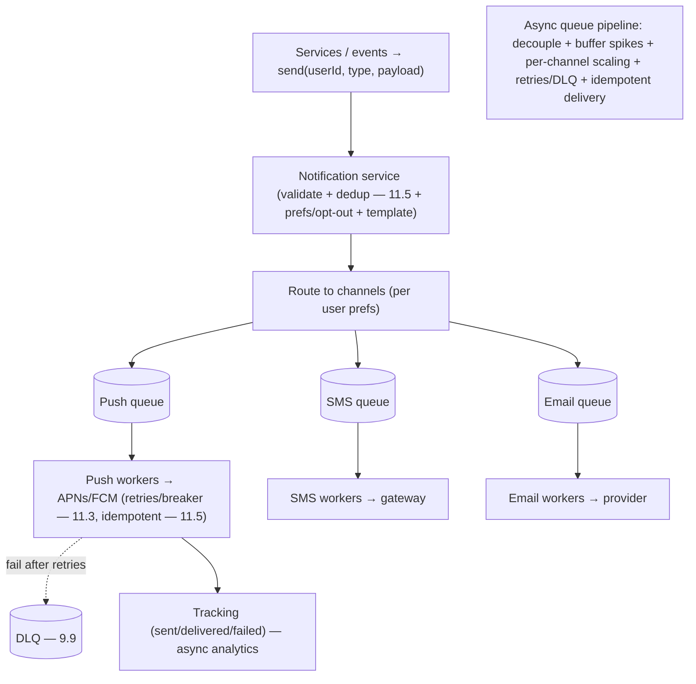

# Lesson 19.1.4 — Design a Notification System

> Part 19 · Module 19.1 (Volume 1) · Difficulty: 🟡🔴 · *Interview design*
>
> **Prerequisites:** [9.1 Messaging/Queues], [9.9 DLQ/Poison], [11.3 Resilience], [11.5 Idempotency], [12.3 Async Communication], [1.3.1 Framework].
> **Unlocks:** [19.1.5 News Feed], [19.1.6 Chat], [Part 20 Capstone].

---

## 1. Learning Objectives

After this lesson you will be able to:

- Design a **multi-channel notification system** (push, SMS, email, in-app): ingestion → routing → per-channel delivery via **third-party providers**.
- Use **queues** (9.1) to **decouple + buffer + absorb spikes** and enable **retries/DLQ** (9.9) + **per-channel workers**.
- Handle **delivery reliability** (retries + idempotency — 11.5, at-least-once + dedup — 9.4), **third-party failures** (11.3), **rate limits**, and **user preferences / opt-outs**.
- Address **fan-out** (a broadcast to millions), **priority**, **templating**, and **tracking**.
- Recognize it as an **async, queue-based, multi-channel delivery pipeline**.

---

## 2. Problem statement

Design a **notification system** that sends notifications to users across **multiple channels** — **push** (mobile/web), **SMS**, **email**, **in-app** — triggered by events (a message received, an order shipped, a marketing blast). At scale: **high volume**, **reliable delivery** (with retries), **third-party providers** per channel (APNs/FCM for push, SMS gateways, email providers — representative), **user preferences/opt-outs**, and **spikes** (a broadcast to millions). A classic **async, queue-based delivery pipeline** design.

---

## 3. The design (framework — 1.3.1)

### 3.1 Requirements

`[BP]`
- **Functional:** accept notification requests (from services/events); **route to channels** (push/SMS/email/in-app); **deliver** via per-channel providers; respect **user preferences/opt-outs**; **templating**; **tracking** (sent/delivered/failed); **dedup** (don't send the same notification twice).
- **Non-functional:** **reliable** (retries, don't lose notifications), **scalable** (high volume + spikes), **decoupled** (senders shouldn't block on delivery), **low-ish latency** (esp. transactional/push), handle **third-party failures + rate limits** (11.3), **prioritized** (transactional > marketing).
- `[BP]` **Key signals:** **async** (decouple senders from delivery), **spiky** (broadcasts), **reliability-critical** (retries + dedup), **multi-channel** (per-channel workers + providers). → a **queue-based pipeline** (9.1).

### 3.2 HLD — the async pipeline

`[BP]` The architecture (a **queue-based delivery pipeline** — 9.1):
1. **Notification API/service:** services call it to send a notification (`send(userId, type, payload)`); it **validates + enqueues** → returns immediately (async — 12.3). Doesn't block the caller on delivery.
2. **Preference/dedup check:** apply **user preferences/opt-outs** (skip if opted out) + **dedup** (11.5 — idempotency key → don't resend).
3. **Routing + templating:** determine **which channels** (per user prefs) + **render templates** (localized content).
4. **Queues per channel** (9.1): route to **per-channel queues** (push queue, SMS queue, email queue) → decouple + buffer + absorb spikes + enable independent scaling (each channel has different rate/latency/provider).
5. **Channel workers:** consume from their queue, **call the third-party provider** (APNs/FCM/SMS/email) with **retries + idempotency** (11.3/11.5); handle provider **rate limits + failures**.
6. **Tracking + DLQ:** record delivery status (sent/delivered/failed); **failed after retries → DLQ** (9.9) for inspection/reprocessing.
- `[BP]` **Queues everywhere** (9.1): decouple senders from delivery, absorb spikes (a broadcast doesn't overwhelm — buffered), enable per-channel scaling + retries + DLQ. This is a **textbook async delivery pipeline**.

### 3.3 Reliability — retries, idempotency, DLQ

`[CS]` Delivery must be **reliable** (don't lose notifications, don't duplicate) `[BP]`:
- **At-least-once + retries** (9.4/11.3): the queue + workers retry failed deliveries (provider timeout/error → retry with backoff — 11.3) → don't lose notifications.
- **Idempotency + dedup** (11.5/9.4): at-least-once → possible **duplicates** (retry after a delivery that actually succeeded) → **idempotency keys** + dedup → the user isn't spammed with duplicates (**exactly-once effect** — 11.5). Providers often support idempotency keys too.
- **DLQ** (9.9): after **bounded retries**, a persistently-failing notification (poison message — 9.9) goes to a **dead-letter queue** for inspection — so one bad notification doesn't block the queue.
- `[BP]` **At-least-once + idempotency + DLQ** (9.4/11.5/9.9) = reliable delivery without duplicates or blocking — the standard messaging reliability recipe.

### 3.4 Third-party providers + resilience

`[CS]` Each channel delivers via a **third-party provider** (external dependency) `[BP]`:
- **Per-channel providers:** push (APNs/FCM), SMS (Twilio-style gateways), email (SendGrid-style) — each with its **own API, rate limits, latency, failure modes** (representative).
- **Resilience** (11.3): providers **fail/rate-limit** → **timeouts, retries+backoff, circuit breakers** (11.3 — if a provider is down, stop hammering + maybe **failover to a backup provider**), respect provider **rate limits** (throttle to them — 15.7).
- **Abstraction:** wrap each provider behind an **adapter** so you can swap/add providers + failover.
- `[BP]` The channel workers are the **integration + resilience layer** to unreliable external providers (11.3) — timeouts/retries/breakers + rate-limit compliance + provider failover.

### 3.5 Fan-out + priority

`[BP]`
- **Fan-out (broadcast):** a marketing blast to **millions** → don't generate millions of notifications synchronously → **enqueue a fan-out job** that expands to per-user notifications **asynchronously** (batched) into the pipeline → absorbed by the queues (§3.2). (Like feed/chat fan-out — 18.8.)
- **Priority:** **transactional** notifications (2FA code, order shipped) are **high-priority + low-latency**; **marketing** is bulk/low-priority → **priority queues** (or separate pipelines) so a marketing blast doesn't delay a 2FA code.
- `[BP]` Separate/prioritize **transactional vs bulk** so critical notifications aren't stuck behind a broadcast.

### 3.6 Deep dives + bottlenecks

`[BP]`
- **User preferences/opt-outs** (§3.2): per-user, per-channel, per-type prefs; **respect opt-outs** (compliance — 15.8, e.g., unsubscribe); quiet hours.
- **Templating + localization:** render content per user (locale, personalization).
- **Rate limiting to providers** (15.7): don't exceed provider limits; also limit per-user (don't spam a user).
- **Tracking + analytics:** delivery status (sent/delivered/opened) → often async (Part 9) to an analytics store (like 19.1.1).
- **Dedup** (§3.3): idempotency keys prevent double-sends (retries, duplicate triggers).
- **Bottleneck:** third-party providers (rate limits/latency) → buffer with queues + throttle + failover; the queue absorbs spikes. **Not a hard-to-scale system** — queues + stateless workers scale horizontally (7.1).
- `[BP]` **The lesson:** a notification system is an **async, queue-based, multi-channel delivery pipeline** — **queues decouple + buffer + enable retries/DLQ** (9.1/9.9), **idempotency prevents duplicates** (11.5), **resilience handles flaky providers** (11.3), and **priority separates transactional from bulk**. The interesting parts are **reliability (retries/idempotency/DLQ)** + **provider resilience** + **fan-out/priority**.

---

## 4. Visual Intuition

---

## 5. Real-World Analogy

Think of a **corporate mailroom** that must get messages to people via **whatever channel each prefers** — courier, phone, email — reliably, even during a company-wide announcement.

- **Async intake = drop it in the outbox, don't wait:** a manager who needs to notify someone **drops the request in the mailroom's inbox and gets back to work** (async) — they don't stand there until it's delivered. The mailroom handles delivery.
- **Per-channel queues = sorting by delivery method:** the mailroom **sorts** requests into piles by method — **courier pile, phone pile, email pile** (per-channel queues) — because each method has different staff, speed, and limits, and can be **worked independently**.
- **Reliability = retry + don't double-deliver:** if a courier can't reach someone, they **try again later** (retry) — but they **check they haven't already delivered it** (idempotency/dedup) so the person isn't bothered twice. A message that **repeatedly fails** goes into a **"problem" tray** (DLQ) for someone to investigate, rather than jamming the whole pile.
- **Providers = outside delivery companies you must respect:** phone/SMS/email go through **outside services** with their **own limits and outages** — if one is down, the mailroom **stops hammering it, waits, or uses a backup service** (circuit breaker + failover), and never exceeds their rate limits.
- **Fan-out + priority = the company-wide blast vs the urgent 2FA code:** a **company-wide announcement** to thousands isn't stuffed through synchronously — it's **queued and worked through steadily** (fan-out, buffered). And an **urgent security code** goes in a **fast lane** so it isn't stuck behind the mass mailing (priority).

---

## 6. Industry Example

- **Queue-based notification pipelines** `[CONV]`: async, per-channel queues + workers + third-party providers (§3.2). *(Representative.)*
- **Push/SMS/email providers** `[CONV]`: APNs/FCM, SMS gateways, email services as per-channel integrations (§3.4). *(Representative.)*
- **Retries + idempotency + DLQ** `[CONV]`: reliable delivery without duplicates; poison messages to DLQ (§3.3, 9.4/11.5/9.9). *(Representative.)*
- **Priority (transactional vs marketing)** `[CONV]`: separate pipelines/priority queues (§3.5). *(Representative.)*
- **Preferences/opt-outs + compliance** `[CONV]`: respecting unsubscribe/opt-out (§3.6, 15.8). *(Representative.)*

---

## 7. Implementation Details

- **Async intake** (§3.2, 12.3): notification service validates + **dedups** (11.5) + checks **prefs/opt-outs** + **templates** → enqueues → returns immediately.
- **Per-channel queues + workers** (9.1): decouple + buffer spikes + per-channel scaling (7.1); workers call providers.
- **Reliability** (§3.3): at-least-once + retries+backoff (11.3) + **idempotency/dedup** (11.5/9.4) + bounded retries → **DLQ** (9.9).
- **Provider resilience** (§3.4, 11.3): timeouts/retries/circuit-breakers + provider **failover** + **rate-limit compliance** (15.7); adapter per provider.
- **Fan-out** (§3.5): async fan-out job expands broadcasts into per-user notifications (batched — like 18.8).
- **Priority** (§3.5): separate transactional (fast) from bulk/marketing (low-priority).
- **Preferences/opt-outs + quiet hours + per-user rate limit** (§3.6, 15.8/15.7); **tracking** async (Part 9).

---

## 8–14. (Advantages / disadvantages / mistakes / questions / pitfalls / optimizations)

**Advantages:** decoupled + spike-absorbing (queues); reliable (retries/idempotency/DLQ); scalable (stateless workers — 7.1); multi-channel; prioritized.
**Disadvantages/cautions:** third-party providers are unreliable/rate-limited (resilience needed); duplicates without idempotency; fan-out for huge broadcasts; preference/compliance complexity.
**Common mistakes:** synchronous delivery (blocking the caller); no idempotency → duplicate notifications; no DLQ → poison message blocks the queue; no priority → 2FA stuck behind marketing; ignoring provider rate limits/failures; ignoring opt-outs (compliance).
**Interview Qs:** 🟢 Why async/queues? 🟡 How to ensure reliable delivery without duplicates (retries + idempotency + DLQ)? How to handle flaky providers (11.3)? 🔴 Fan-out for a million-user broadcast + priority? Preferences/opt-outs? ⚫ Full multi-channel pipeline + reliability + provider resilience + fan-out/priority.
**Production pitfalls:** duplicate notifications (no dedup); poison message blocking the queue (no DLQ); provider outage cascading (no circuit breaker); marketing blast delaying transactional (no priority); spamming users (no per-user limit); compliance violation (ignored opt-out).
**Optimizations:** per-channel queues + stateless workers; idempotency/dedup; DLQ + bounded retries; circuit breakers + provider failover; priority lanes; async fan-out; provider rate-limit compliance.

---

## 15. Summary

A **notification system** sends notifications across **multiple channels** (push/SMS/email/in-app) triggered by events, at high volume with reliable delivery. Its **key signals** — **async** (decouple senders from delivery — 12.3), **spiky** (broadcasts), **reliability-critical** (retries + dedup), **multi-channel** (per-channel workers + third-party providers) — make it a **textbook queue-based delivery pipeline** (9.1). The **HLD**: a **notification service** validates + **dedups** (11.5) + checks **user preferences/opt-outs** + **renders templates** → **enqueues** (returning immediately — async), routing to **per-channel queues** (push/SMS/email) that **decouple senders from delivery, buffer + absorb spikes, and enable independent per-channel scaling + retries/DLQ**; **channel workers** consume their queue and call the **third-party provider** with **retries + idempotency + resilience**. **Reliability** uses the standard messaging recipe: **at-least-once + retries with backoff** (9.4/11.3 — don't lose notifications) + **idempotency keys + dedup** (11.5/9.4 — at-least-once → duplicates → exactly-once **effect**, so users aren't spammed) + **DLQ** (9.9 — after bounded retries, a poison message goes to a dead-letter queue for inspection, not blocking the queue). Each channel delivers via an **unreliable third-party provider** (APNs/FCM/SMS/email — own APIs, rate limits, failure modes), so the workers are a **resilience + integration layer** (11.3): **timeouts/retries/circuit-breakers** (stop hammering a down provider, **failover to a backup**) + **provider rate-limit compliance** (15.7) + a **per-provider adapter**. **Fan-out** (a broadcast to millions) is handled by an **async fan-out job** that expands into per-user notifications (batched — like 18.8), absorbed by the queues; and **priority** separates **transactional** (2FA/order-shipped — high-priority, low-latency) from **bulk/marketing** (low-priority) via **priority queues/separate pipelines**, so a marketing blast never delays a 2FA code. **Deep dives:** **preferences/opt-outs** (per-user/channel/type, compliance — 15.8, quiet hours), **templating/localization**, **per-user + per-provider rate limiting** (15.7), and **async tracking** (delivery status → analytics — like 19.1.1). The **bottleneck** is the **third-party providers** (rate limits/latency), absorbed by queues + throttling + failover; otherwise **queues + stateless workers scale horizontally** (7.1) — not a hard-to-scale system. The interesting depth is **reliability (retries/idempotency/DLQ) + provider resilience + fan-out/priority** — an **async, queue-based, multi-channel delivery pipeline**.

---

## 16. Revision Notes (flashcard-ready)

- **Q:** Core architecture? **A:** Async queue-based multi-channel delivery pipeline: service → per-channel queues → workers → third-party providers.
- **Q:** Why queues? **A:** Decouple senders from delivery, buffer/absorb spikes, per-channel scaling, enable retries + DLQ.
- **Q:** Reliability recipe? **A:** At-least-once + retries+backoff (9.4/11.3) + idempotency/dedup (11.5) + DLQ for poison messages (9.9).
- **Q:** Why idempotency? **A:** At-least-once → duplicate deliveries on retry → dedup → users aren't spammed (exactly-once effect).
- **Q:** DLQ purpose? **A:** After bounded retries, a persistently-failing (poison) notification goes to a dead-letter queue — doesn't block the queue.
- **Q:** Provider resilience? **A:** Timeouts/retries/circuit-breakers (11.3) + provider failover + rate-limit compliance (15.7); adapter per provider.
- **Q:** Fan-out (broadcast)? **A:** Async fan-out job expands to per-user notifications (batched), absorbed by queues (like 18.8).
- **Q:** Priority? **A:** Separate transactional (fast) from bulk/marketing (low-priority) — priority queues/pipelines.
- **Q:** Preferences/opt-outs? **A:** Per-user/channel/type prefs; respect opt-outs (compliance — 15.8); quiet hours.
- **Q:** The bottleneck? **A:** Third-party providers (rate/latency) → buffer with queues + throttle + failover; workers scale horizontally.

---

## 17. Further Reading + Knowledge-Graph Links

**Foundations:** [9.1 Messaging/Queues] · [9.9 DLQ] · [11.3 Resilience] · [11.5 Idempotency] · [12.3 Async] · [15.7 Rate Limiting] · [15.8 Compliance].
**External:** Notification-system design treatments; APNs/FCM/SMS/email provider docs. *(Representative.)*

> **Knowledge-graph:** `9.1 queues` + `9.9 DLQ` + `11.5 idempotency` + `11.3 resilience` → **`19.1.4 notification system`** (async multi-channel pipeline) → reused in `19.1.5 feed` / `19.1.6 chat`.
