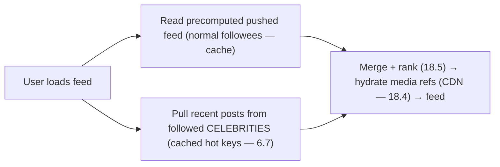

# Lesson 19.1.5 — Design a News Feed / Instagram

> Part 19 · Module 19.1 (Volume 1) · Difficulty: 🔴 · *Interview design*
>
> **Prerequisites:** [Part 6 Caching], [7.3 Sharding], [7.4 Hotspots (celebrity)], [9.1 Messaging], [18.4 CDN], [18.8 Fan-out], [1.3.1 Framework].
> **Unlocks:** [19.1.6 Chat], [19.2.2 News Feed (deep)], [Part 20 Capstone].

---

## 1. Learning Objectives

After this lesson you will be able to:

- Design a **news feed** (Instagram/Twitter-style): post creation, **feed generation**, and read.
- Master the **central decision — fan-out-on-write vs fan-out-on-read** (push vs pull) and the **hybrid** — the canonical scalability tradeoff referenced across designs (18.8/19.1.6).
- Handle the **celebrity problem** (7.4 — a user with millions of followers) with the hybrid.
- Design **feed storage + caching** (Part 6), **ranking**, media (CDN — 18.4), and read scaling.
- Recognize this as the **template for all fan-out designs**.

---

## 2. Problem statement

Design a **news feed**: users **post** content (photos/text), **follow** others, and see a **feed** of posts from people they follow (chronological or ranked). Instagram/Twitter/Facebook-style. At scale (hundreds of millions of users, celebrities with millions of followers), the **feed-generation strategy** — how a user's feed is assembled from the people they follow — is *the* problem, and it's the **canonical fan-out tradeoff** that recurs everywhere (chat — 18.8, notifications — 19.1.4).

---

## 3. The design (framework — 1.3.1)

### 3.1 Requirements

`[BP]`
- **Functional:** post content; follow/unfollow; **view feed** (posts from followed users, recent/ranked); like/comment.
- **Non-functional:** **read-heavy** (feed views ≫ posts), **low-latency feed loads** (users wait), **scalable** (huge follow graph, celebrities), **highly available**, **fresh-ish** (near-real-time, eventual is fine — 10.5).
- `[BP]` **Key signal:** read-heavy + huge fan-in (a feed aggregates from many followees) + the **celebrity problem** → the **fan-out strategy** is the crux.

### 3.2 The central decision — fan-out-on-write vs fan-out-on-read

`[CS]` How is a user's feed assembled? Two strategies (the canonical tradeoff) `[CS]`:
- **Fan-out-on-write (push):** when a user **posts**, **push** the post into **each follower's precomputed feed** (a per-user feed list, cached — Part 6). **Reading the feed is then trivial** (just read your precomputed feed — fast). **But:** a post by someone with **millions of followers** means **millions of writes** (the **celebrity problem** — 7.4). Optimizes **reads**, expensive **writes** for high-follower users.
- **Fan-out-on-read (pull):** when a user **reads** their feed, **fetch recent posts from everyone they follow** and **merge** at read time. **Writing (posting) is cheap** (just store the post). **But:** **reading is expensive** (fetch + merge from many followees — a fan-in — 17.2) — bad for users following many people, and repeated on every read. Optimizes **writes**, expensive **reads**.
- `[BP]` **The tradeoff** (identical to chat fan-out — 18.8): push = fast reads / expensive writes (celebrity problem); pull = cheap writes / expensive reads. **Reads dominate** (§3.1) → push is usually better **except** for celebrities.

### 3.3 The hybrid (the answer)

`[CS]` The standard solution: **hybrid — push for most, pull for celebrities** `[CS]`:
- **Fan-out-on-write (push)** for **normal users** (few followers → cheap fan-out; fast reads).
- **Fan-out-on-read (pull)** for **celebrities** (millions of followers → avoid the millions-of-writes explosion; their posts are **pulled** at read time and **merged** into the feed).
- **At read time:** a user's feed = their **precomputed pushed feed** (from normal followees) **merged with** freshly-**pulled** posts from the **celebrities** they follow.
- `[BP]` **Why:** the hybrid gets **fast reads for the common case** (push) while **avoiding the celebrity write explosion** (pull for the few celebrities) — resolving the fan-out tradeoff. The **celebrity threshold** (follower count) is a tunable knob. This is *the* canonical fan-out answer (7.4 celebrity hot-key + 18.8).

### 3.4 Storage + caching

`[BP]`
- **Posts:** stored in a **KV/wide-column store** (18.2 — high write, partition by userId/postId — 7.3).
- **Feeds (precomputed, push):** per-user feed lists (post IDs) in a **fast cache/store** (Redis — 6.6) → feed reads are cache hits (Part 6). **The feed cache is central** (read-heavy — §3.1).
- **Media (photos/video):** **object storage** (4.1.3) + served via **CDN** (18.4) — never through the app; the app stores/serves **references**.
- **Social graph (follows):** a graph/adjacency store (who follows whom) — needed for fan-out.
- `[BP]` **Read-heavy → the feed cache (Part 6) is the workhorse**; media via CDN (18.4); posts in wide-column (18.2); graph separate.

### 3.5 Ranking

`[BP]`
- **Chronological** (simple — reverse-time) or **ranked** (ML relevance — like recommendations — 18.5: engagement prediction, recency, affinity). Ranking adds a scoring step (offline features + online serving — 18.5), often **precomputed/cached**.
- `[BP]` Ranking = a recommendation-style ML layer (18.5) on top of the fan-out; start chronological, discuss ranking as an extension.

### 3.6 Deep dives + bottlenecks

`[BP]`
- **The celebrity problem** (§3.2/3.3, 7.4): the hybrid (pull for celebrities) — the key deep dive; a celebrity's post is a **hot key** (7.4) → **cache it aggressively** (6.7) so millions of pulls hit cache.
- **Feed generation timing:** push happens **async** (9.1 — on post, enqueue fan-out jobs) so posting is fast + spikes absorbed (like 18.8/19.1.4 fan-out).
- **Read scaling** (7.5/Part 6): feed cache + read replicas + CDN for media → handle the read load.
- **Consistency:** feeds are **eventually consistent** (10.5) — a new post appears in followers' feeds after fan-out completes (seconds) — fine (§3.1).
- **Follow/unfollow:** updates the graph; fan-out uses it; a new follow may backfill recent posts.
- **Bottleneck:** the **celebrity fan-out** (solved by hybrid + caching) + **read load** (solved by feed cache + CDN). Posts/graph/media scale via wide-column/graph-store/object-storage.
- `[BP]` **The lesson:** a news feed is the **canonical fan-out design** — **fan-out-on-write (push) for the common case + fan-out-on-read (pull) for celebrities = hybrid**, with a **feed cache** (Part 6) for read-heavy reads, **async fan-out** (9.1), **media via CDN** (18.4), and **eventual consistency** (10.5). The fan-out tradeoff + celebrity problem are the crux — and reused everywhere.

---

## 4. Visual Intuition

### Fan-out: push vs pull vs hybrid

### The read path (hybrid)

---

## 5. Real-World Analogy

Think of delivering a **daily personalized newspaper** compiled from the columnists each reader follows.

- **Fan-out-on-write (push) = pre-printing each reader's paper:** when a **columnist writes**, you **immediately add their column to every subscriber's pre-assembled paper** (push to each follower's feed). Then when a reader wants their paper, it's **already printed — instant** (fast read). But a **hugely-popular columnist with millions of subscribers** means **millions of papers to update on every column** (the celebrity write explosion).
- **Fan-out-on-read (pull) = assembling the paper on demand:** alternatively, columnists just **file their columns**, and when a reader wants their paper, you **gather the latest columns from everyone they follow and assemble it right then** (pull + merge). Filing is cheap, but **assembling on every read is slow** — especially for a reader who follows hundreds of columnists.
- **The hybrid = pre-print the normal columnists, fetch the superstars live:** you **pre-add** columns from **normal columnists** to each subscriber's paper (fast reads, cheap fan-out) but **don't** pre-copy a **superstar's** column to millions of papers — instead you **fetch the superstar's latest live and slot it in** when the reader opens their paper (pull for celebrities). And since **everyone wants the superstar's column**, you keep **one hot copy at the front desk** (cache the celebrity's hot key) so the millions of fetches all grab that copy. Best of both.
- **Media via CDN = photos printed at local print shops:** the **photos** aren't shipped from headquarters — they're **pre-positioned at local print shops** (CDN — 18.4) near readers; the paper just references them.

---

## 6. Industry Example

- **Twitter/Instagram/Facebook feeds** `[CONV]`: hybrid fan-out (push for most, pull for celebrities) is the canonical approach (§3.2/3.3). *(Representative.)*
- **Feed cache (Redis-style)** `[CONV]`: precomputed per-user feeds in a fast cache (§3.4, 6.6). *(Representative.)*
- **Celebrity problem + hot-key caching** `[CONV]`: caching a celebrity's post so millions of pulls hit cache (§3.6, 7.4/6.7). *(Representative.)*
- **ML feed ranking** `[CONV]`: recommendation-style ranking on top of fan-out (§3.5, 18.5). *(Representative.)*
- **Media via object storage + CDN** `[CONV]`: photos/video stored + served at the edge (§3.4, 4.1.3/18.4). *(Representative.)*

---

## 7. Implementation Details

- **Hybrid fan-out** (§3.2/3.3): **push** (fan-out-on-write) to precomputed feeds for **normal** users; **pull** (fan-out-on-read) for **celebrities** (above a follower threshold); **merge at read time**.
- **Async fan-out** (9.1): on post, enqueue fan-out jobs → posting is fast + spikes absorbed (like 18.8/19.1.4).
- **Feed cache** (Part 6/6.6): precomputed per-user feeds (post IDs) in Redis; feed reads = cache hits; **cache celebrity posts as hot keys** (6.7).
- **Storage:** posts in wide-column (18.2), partitioned (7.3); social graph in a graph/adjacency store; media in object storage (4.1.3) served via **CDN** (18.4).
- **Ranking** (§3.5, 18.5): chronological or ML-ranked (precomputed/cached).
- **Read scaling** (7.5/Part 6): feed cache + read replicas + CDN.
- **Eventual consistency** (10.5): feeds converge after fan-out (seconds) — fine.

---

## 8–14. (Advantages / disadvantages / mistakes / questions / pitfalls / optimizations)

**Advantages:** fast reads (push + feed cache), no celebrity write explosion (hybrid pull), scalable (async fan-out + wide-column + CDN), eventual consistency is fine.
**Disadvantages/cautions:** hybrid complexity (two paths + merge); celebrity threshold tuning; feed-cache memory; eventual consistency (slight delay); ranking adds ML complexity.
**Common mistakes:** pure push (celebrity write explosion — 7.4); pure pull (slow reads for high-following users); synchronous fan-out (slow posts — should be async); no feed cache (read-heavy DB hammering); media through the app (should be CDN — 18.4); ignoring the celebrity hot key (6.7).
**Interview Qs:** 🟢 How is a feed generated? 🟡 Fan-out-on-write vs on-read tradeoff? 🔴 The celebrity problem + the hybrid solution + hot-key caching? ⚫ Full feed design (hybrid fan-out + feed cache + async + CDN + ranking + eventual consistency).
**Production pitfalls:** celebrity write storm (pure push); slow feed loads (pure pull / no cache); fan-out lag (new post delayed); hot-key overload on a celebrity post (cache it — 6.7); media not on CDN (latency/cost).
**Optimizations:** hybrid fan-out + celebrity threshold; feed cache (Part 6) + celebrity hot-key caching (6.7); async fan-out (9.1); wide-column posts (18.2); media via CDN (18.4); ML ranking (18.5).

---

## 15. Summary

A **news feed** (Instagram/Twitter/Facebook) lets users **post**, **follow**, and **view a feed** of posts from followees. Its **key signal** is **read-heavy** (feed views ≫ posts) with **huge fan-in** (a feed aggregates from many followees) and the **celebrity problem** (users with millions of followers), making the **feed-generation strategy** *the* problem — the **canonical fan-out tradeoff** reused everywhere (chat — 18.8, notifications — 19.1.4). The **central decision**: **fan-out-on-write (push)** — on posting, push the post into **each follower's precomputed feed** (cached — Part 6) → **trivial, fast reads**, but a **celebrity's post = millions of writes** (7.4) (optimizes reads, expensive writes); vs **fan-out-on-read (pull)** — on reading, **fetch + merge recent posts from all followees** → **cheap posts**, but **expensive reads** (a fan-in — 17.2, bad for high-following users, repeated per read) (optimizes writes, expensive reads). Since **reads dominate**, push is usually better **except for celebrities** — so the **answer is the hybrid**: **push for normal users** (cheap fan-out, fast reads) + **pull for celebrities** (avoid the write explosion — their posts are pulled at read time), **merged at read time** (a user's feed = precomputed pushed feed **+** freshly-pulled celebrity posts), with a tunable **celebrity threshold** and the celebrity's post cached as a **hot key** (6.7) so millions of pulls hit cache. **Storage/caching**: posts in **wide-column** (18.2, partitioned — 7.3); **precomputed per-user feeds** in a **fast cache** (Redis — 6.6 — the read-heavy workhorse); the **social graph** in a graph/adjacency store; and **media in object storage** (4.1.3) served via **CDN** (18.4 — never through the app). **Fan-out is async** (9.1 — enqueue fan-out jobs on post → fast posting + spike absorption — like 18.8/19.1.4). **Ranking** is chronological or an ML **recommendation-style** layer (18.5, precomputed/cached). Feeds are **eventually consistent** (10.5 — a new post appears after fan-out completes, seconds — fine). The **bottleneck** is the **celebrity fan-out** (solved by the hybrid + hot-key caching) + **read load** (solved by the feed cache + CDN). A news feed is **the canonical fan-out design** — **hybrid push/pull + feed cache + async fan-out + CDN media + eventual consistency** — and the fan-out tradeoff + celebrity problem it teaches recur across many systems.

---

## 16. Revision Notes (flashcard-ready)

- **Q:** The central decision? **A:** Fan-out-on-write (push) vs fan-out-on-read (pull) for feed generation.
- **Q:** Fan-out-on-write (push)? **A:** On post, push to each follower's precomputed feed → fast reads; but celebrity = millions of writes (7.4).
- **Q:** Fan-out-on-read (pull)? **A:** On read, fetch + merge from all followees → cheap posts; but expensive reads (fan-in).
- **Q:** The answer? **A:** Hybrid — push for normal users + pull for celebrities, merged at read time.
- **Q:** Celebrity problem? **A:** Millions of followers → push write explosion → pull their posts instead + cache as a hot key (6.7).
- **Q:** Feed storage? **A:** Precomputed per-user feeds in a fast cache (Redis — 6.6); posts in wide-column (18.2); media in object storage + CDN (18.4).
- **Q:** Fan-out timing? **A:** Async (9.1 — enqueue fan-out jobs on post) → fast posting + spike absorption.
- **Q:** Consistency? **A:** Eventually consistent (10.5) — new post appears after fan-out (seconds); fine.
- **Q:** Media? **A:** Object storage (4.1.3) + CDN (18.4) — never through the app.
- **Q:** Why is this the template? **A:** The fan-out tradeoff + celebrity problem recur in chat (18.8), notifications (19.1.4), etc.

---

## 17. Further Reading + Knowledge-Graph Links

**Foundations:** [Part 6 Caching] · [7.3 Sharding] · [7.4 Hotspots (celebrity)] · [9.1 Messaging] · [18.4 CDN] · [18.8 Fan-out] · [18.5 Recommendations].
**Unlocks:** [19.2.2 News Feed (deep)] — deeper treatment.
**External:** Feed-design treatments (Twitter/Instagram/Facebook lineage). *(Representative.)*

> **Knowledge-graph:** `Part 6 caching` + `7.4 celebrity` + `9.1 async fan-out` + `18.4 CDN` → **`19.1.5 news feed`** (hybrid fan-out) — the canonical fan-out template (→ 18.8 chat, 19.1.4 notifications, 19.2.2 deep feed).
