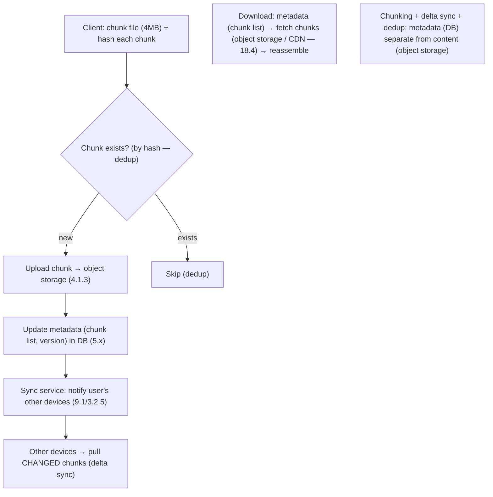

# Lesson 19.1.7 — Design a File Storage/Sync Service (Dropbox/Google Drive)

> Part 19 · Module 19.1 (Volume 1) · Difficulty: 🔴 · *Interview design*
>
> **Prerequisites:** [4.1.3 Object/Blob Storage], [4.3.2 Blob Storage Internals], [Part 6 Caching], [9.1 Messaging], [18.4 CDN], [1.3.1 Framework].
> **Unlocks:** [19.1.8 Video Platform], [Part 20 Capstone].

---

## 1. Learning Objectives

After this lesson you will be able to:

- Design a **file storage + sync** service: upload/download, **sync across devices**, sharing, versioning.
- Apply **chunking + deduplication + delta sync** — only transfer changed chunks (the core efficiency idea).
- Separate **metadata** (file/folder structure, versions — a DB) from **content** (chunks — object storage — 4.1.3).
- Handle **sync** (detect changes, notify devices — 9.1), **conflict resolution** (concurrent edits — 10.4), and **large-file uploads** (resumable, chunked).
- Recognize the metadata/content split + chunking as the key ideas.

---

## 2. Problem statement

Design a **file storage + sync** service (Dropbox/Google Drive): users **upload files**, **access them from any device**, and changes **sync automatically** across their devices. Support **large files**, **sharing**, **versioning**, and **efficient sync** (don't re-upload a whole file on a small edit). The core ideas: **chunking + dedup + delta sync** (efficiency) and the **metadata/content separation**.

---

## 3. The design (framework — 1.3.1)

### 3.1 Requirements

`[BP]`
- **Functional:** upload/download files; **sync** changes across a user's devices; **share** (with others); **versioning** (history/restore); folders.
- **Non-functional:** **efficient sync** (transfer only changes — not whole files), **large files** (resumable uploads), **durable** (never lose files — 4.1.3), **available**, **scalable** (huge storage), **reasonable latency**.
- `[BP]` **Key signal:** it's a **blob-storage + metadata + sync** problem; the efficiency comes from **chunking + delta sync** (don't re-transfer unchanged data), and the architecture splits **metadata (DB) from content (object storage — 4.1.3)**.

### 3.2 The core idea — chunking + dedup + delta sync

`[CS]` The efficiency foundation `[CS]`:
- **Chunking:** split each file into **fixed or content-defined chunks** (e.g., 4MB). Files are stored + transferred as **chunks**, not monoliths.
- **Delta sync:** when a file changes, **only the changed chunks** are transferred (compare chunk hashes → transfer only new/modified chunks) → a small edit to a large file transfers **only a chunk or two**, not the whole file. **Huge bandwidth/latency savings.**
- **Deduplication:** chunks are **content-addressed** (hash) → identical chunks (across files/users) are **stored once** (dedup — 4.3.2) → storage savings. (Cross-user dedup has privacy considerations.)
- **Resumable uploads:** chunking enables **resumable** large-file uploads (upload chunk-by-chunk; resume from the last chunk on failure).
- `[BP]` **Chunking + delta sync + dedup** is *the* key idea — transfer/store only what changed, content-addressed. This is what makes sync efficient.

### 3.3 Metadata/content separation

`[CS]` Split **metadata** from **content** (two very different workloads) `[CS]`:
- **Content (chunks):** stored in **object/blob storage** (4.1.3 — durable, scalable, cheap — S3-style), content-addressed by chunk hash (dedup — §3.2), replicated (11.8) for durability.
- **Metadata:** file/folder **structure**, **chunk lists** (which chunks make up each file version), **versions**, **permissions/sharing**, **device sync state** — stored in a **database** (relational or NoSQL — 5.x), needing consistency + queries.
- `[BP]` **The split:** content = big, immutable blobs → object storage (4.1.3); metadata = structured, queried, consistency-sensitive → a DB. A file = **metadata (a list of chunk references) + chunks (in object storage)**. This separation is central (a recurring pattern — media in 19.1.5/19.1.8).

### 3.4 HLD

`[BP]`
- **Upload:** client **chunks** the file → for each chunk, **check if it exists** (by hash — dedup) → upload **only new chunks** to object storage (4.1.3) → update **metadata** (chunk list, version) in the DB.
- **Download:** read **metadata** (chunk list) → fetch **chunks** from object storage (or **CDN** — 18.4 for cached/shared files) → reassemble.
- **Sync:** a **sync/notification service** detects metadata changes → **notifies the user's other devices** (via a persistent connection / push — 3.2.5/19.1.4) → devices **pull the changed chunks** (delta sync — §3.2). A **long-poll/WebSocket** or a notification (9.1) tells devices "something changed, sync."
- `[BP]` Upload/download work in **chunks** (dedup + delta + resumable); sync is **change-detection + notify + delta-pull**. Metadata DB coordinates; object storage holds content.

### 3.5 Sync + conflict resolution

`[CS]` Multiple devices editing → **conflicts** (10.4) `[BP]`:
- **Change detection:** each device tracks its **sync state** (version/cursor); on a change, the server **notifies** devices (9.1/3.2.5) → they **sync** (pull changed metadata + chunks).
- **Conflict resolution** (10.4): if **two devices edit the same file concurrently** (offline edits, then both sync), you get a **conflict** → resolve via **versioning** — often **keep both versions** (create a "conflicted copy" — the Dropbox approach) rather than silently losing one (avoid naive LWW data loss — 10.4/8.1.2). Metadata tracks versions.
- `[BP]` Conflicts are handled by **versioning + keep-both** (or user resolution) — not silent overwrite — because losing a user's edit is unacceptable (unlike some LWW-tolerant data — 10.4).

### 3.6 Deep dives + bottlenecks

`[BP]`
- **Large files:** chunking → **resumable, parallel** chunk uploads (§3.2); don't hold whole files in memory.
- **Sharing:** metadata permissions (15.2); shared files served via CDN (18.4) for many readers.
- **Versioning:** metadata keeps version → chunk-list mappings; old versions restorable (chunks retained; garbage-collect unreferenced chunks).
- **Durability** (11.8, 4.1.3): object storage replicates content; never lose files.
- **Caching/CDN** (Part 6/18.4): frequently-accessed/shared files cached at the edge.
- **Bottleneck:** none extreme — object storage scales (4.1.3), metadata DB scales (7.3 sharding by user/file); the interesting parts are **chunking/delta sync** + **conflict resolution** + **sync notification**.
- `[BP]` **The lesson:** file sync = **chunking + delta sync + dedup** (efficiency) + **metadata/content separation** (DB + object storage — 4.1.3) + **change-notification sync** (9.1/3.2.5) + **conflict resolution via versioning** (10.4). The core ideas are chunking/delta and the metadata/content split.

---

## 4. Visual Intuition

---

## 5. Real-World Analogy

Think of a **shared filing system with a smart courier** who never re-ships what you already have.

- **Chunking + delta sync = ship only the changed pages:** instead of mailing an **entire 500-page document** every time you fix a typo, the document is kept as **numbered pages (chunks)**, and the courier **only ships the pages that changed** (delta sync) — a one-word edit ships **one page**, not 500. Huge savings.
- **Dedup = don't store the same page twice:** if two documents (or two users) share an **identical page**, it's **stored once** and both **reference it** (content-addressed dedup) — saving storage.
- **Metadata/content split = the index card vs the pages:** each document has an **index card** listing **which numbered pages make it up, its versions, and who can see it** (metadata → a database), while the **actual pages** live in a **giant warehouse** (object storage). A document = **an index card pointing to pages**.
- **Sync = the courier tells your other offices "there's an update":** when you change a document, the system **notifies your other devices** (a bulletin: "document X changed"), and they **fetch just the changed pages** (delta pull).
- **Conflict = two offices edited the same document offline:** if two offices edited the **same document** while disconnected and both sync, rather than **throwing one edit away** (silent loss — unacceptable), the system **keeps both as "conflicted copies"** for you to reconcile — because losing someone's work is far worse than a duplicate.

---

## 6. Industry Example

- **Dropbox/Google Drive** `[CONV]`: chunked storage, delta sync, dedup, metadata/content split, conflict-copy resolution (§3.2/3.3/3.5). *(Representative.)*
- **Content-addressed chunk dedup** `[CONV]`: hash-based chunk dedup (§3.2, 4.3.2). *(Representative.)*
- **Object storage for content + DB for metadata** `[CONV]`: the classic split (§3.3, 4.1.3). *(Representative.)*
- **Change-notification sync (long-poll/WebSocket)** `[CONV]`: notify devices to delta-sync (§3.4, 3.2.5). *(Representative.)*
- **Conflicted copies** `[CONV]`: keep-both conflict resolution (§3.5, 10.4). *(Representative.)*

---

## 7. Implementation Details

- **Chunk + hash + dedup + delta sync** (§3.2): fixed/content-defined chunks, content-addressed (dedup — 4.3.2), transfer only changed chunks, resumable uploads.
- **Metadata/content split** (§3.3): content in **object storage** (4.1.3, replicated — 11.8); metadata (structure/chunk-lists/versions/permissions/sync-state) in a **DB** (5.x, sharded by user/file — 7.3).
- **Upload/download in chunks** (§3.4): check-then-upload new chunks; reassemble from chunk list; serve shared/cached files via CDN (18.4).
- **Sync** (§3.4/3.5, 9.1/3.2.5): change detection (sync cursor) → notify devices → delta-pull.
- **Conflict resolution** (§3.5, 10.4): versioning + **keep-both (conflicted copy)** — avoid silent LWW loss (8.1.2).
- **Versioning + GC** (§3.6): version → chunk-list mappings; garbage-collect unreferenced chunks.
- **Durability** (4.1.3/11.8) + **caching/CDN** (Part 6/18.4).

---

## 8–14. (Advantages / disadvantages / mistakes / questions / pitfalls / optimizations)

**Advantages:** efficient sync (delta — transfer only changes); storage savings (dedup); scalable (object storage + sharded metadata); durable; resumable large uploads; versioning.
**Disadvantages/cautions:** chunking/dedup complexity; conflict resolution (keep-both); cross-user dedup privacy; sync-notification infrastructure.
**Common mistakes:** re-uploading whole files on small edits (no delta sync); storing content in the DB (should be object storage); silent LWW conflict loss (should keep-both); no resumable uploads (large-file failures); no dedup (storage waste).
**Interview Qs:** 🟢 How do you sync efficiently (chunking + delta)? 🟡 Metadata/content split — why? Conflict resolution? 🔴 Large-file resumable uploads + dedup + versioning? ⚫ Full design (chunking/delta/dedup + metadata/content + sync + conflicts).
**Production pitfalls:** whole-file re-upload (no delta); conflict data loss (naive LWW); content-in-DB bloat; large-upload failures (no resume); orphaned chunks (no GC).
**Optimizations:** delta sync + chunk dedup; metadata/content split; resumable parallel chunk uploads; CDN for shared files; keep-both conflicts; version GC.

---

## 15. Summary

A **file storage + sync** service (Dropbox/Google Drive) lets users **upload files, access them from any device, and sync changes automatically** — supporting large files, sharing, and versioning. It's fundamentally a **blob-storage + metadata + sync** problem, and its efficiency rests on the **core idea: chunking + delta sync + deduplication**. **Chunking** splits each file into chunks (e.g., 4MB); **delta sync** transfers **only the changed chunks** (compare chunk hashes) so a small edit to a large file transfers **a chunk or two, not the whole file** (huge bandwidth/latency savings); **dedup** stores identical **content-addressed** chunks **once** (4.3.2 — storage savings); and chunking enables **resumable** large-file uploads. The architecture **separates metadata from content**: **content (chunks)** lives in **object/blob storage** (4.1.3 — durable, scalable, cheap, content-addressed, replicated — 11.8), while **metadata** (file/folder structure, **chunk lists** per version, versions, permissions, device sync state) lives in a **database** (5.x — structured, queried, consistency-sensitive) — so a **file = metadata (a list of chunk references) + chunks (in object storage)** (a recurring media-vs-metadata pattern — 19.1.5/19.1.8). **Upload** chunks the file, **checks each chunk's existence by hash** (dedup), uploads **only new chunks**, and updates metadata; **download** reads the metadata chunk list and fetches chunks (from object storage or **CDN** — 18.4 for shared/cached files) to reassemble. **Sync** is **change-detection + notify + delta-pull**: a sync service detects metadata changes and **notifies the user's other devices** (via persistent connection/push — 3.2.5/9.1), which **pull only the changed chunks**. **Conflicts** (concurrent edits from multiple devices — 10.4) are resolved by **versioning + keep-both** ("conflicted copy" — the Dropbox approach) rather than **silent LWW loss** (8.1.2) — because losing a user's edit is unacceptable. **Deep dives**: large-file **resumable/parallel chunk uploads**, **sharing** (permissions + CDN), **versioning** (version→chunk-list mappings + garbage-collect unreferenced chunks), **durability** (4.1.3/11.8), and **CDN caching** (18.4). There's **no extreme bottleneck** — object storage scales (4.1.3), metadata DB shards (7.3) — so the interesting depth is **chunking/delta sync/dedup** (efficiency) + the **metadata/content split** + **change-notification sync** + **conflict resolution via versioning**.

---

## 16. Revision Notes (flashcard-ready)

- **Q:** The core efficiency idea? **A:** Chunking + delta sync + dedup — transfer/store only changed, content-addressed chunks.
- **Q:** Delta sync? **A:** On a change, transfer only the changed chunks (compare hashes) — a small edit to a big file transfers a chunk or two.
- **Q:** Dedup? **A:** Content-addressed chunks (by hash) stored once (across files/users) — storage savings.
- **Q:** Metadata/content split? **A:** Content (chunks) in object storage (4.1.3); metadata (structure/chunk-lists/versions/permissions/sync-state) in a DB. File = metadata + chunk refs.
- **Q:** Why the split? **A:** Content = big immutable blobs (object storage); metadata = structured/queried/consistency-sensitive (DB).
- **Q:** Sync mechanism? **A:** Change detection (sync cursor) → notify devices (push — 3.2.5/9.1) → devices delta-pull changed chunks.
- **Q:** Conflict resolution? **A:** Versioning + keep-both (conflicted copy) — NOT silent LWW loss (losing edits unacceptable — 10.4/8.1.2).
- **Q:** Large-file uploads? **A:** Chunked → resumable + parallel (resume from last chunk on failure).
- **Q:** Shared files? **A:** Metadata permissions (15.2) + CDN (18.4) for many readers.
- **Q:** The bottleneck? **A:** None extreme — object storage + sharded metadata scale; depth is chunking/delta + metadata/content split + conflicts.

---

## 17. Further Reading + Knowledge-Graph Links

**Foundations:** [4.1.3 Object Storage] · [4.3.2 Blob Internals/Dedup] · [Part 6 Caching] · [18.4 CDN] · [9.1 Messaging] · [3.2.5 WebSockets] · [10.4 Conflict Resolution].
**External:** Dropbox/Drive design treatments. *(Representative.)*

> **Knowledge-graph:** `4.1.3 object storage` + chunking/dedup (`4.3.2`) + metadata DB + `9.1/3.2.5 sync notify` + `10.4 conflicts` → **`19.1.7 file storage/sync`** (chunking + delta + metadata/content split).
