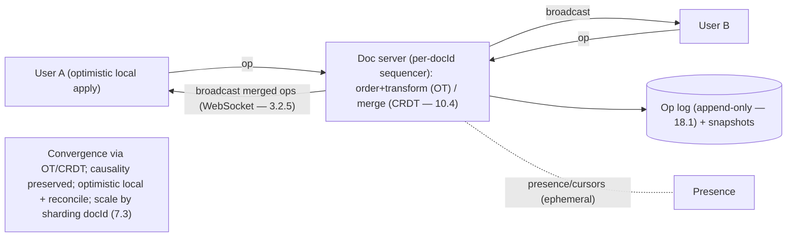

# Lesson 19.2.1 — Design Google Docs (Collaborative Editing)

> Part 19 · Module 19.2 (Volume 2) · Difficulty: 🔴⚫ · *Interview design*
>
> **Prerequisites:** [1.3.1 Framework], [3.2.5 WebSockets], [10.4 Conflict Resolution & CRDTs], [8.2.2 Vector Clocks/Causal Ordering], [10.5 Consistency Spectrum], [Part 9 Messaging].
> **Unlocks:** [19.2.2 News Feed Deep], [Part 20 Capstone].

---

## 1. Learning Objectives

After this lesson you will be able to:

- Drive a **collaborative-editor design** (Google Docs) end-to-end (framework — 1.3.1): requirements → estimation → API → data model → HLD → deep dives.
- Explain **the core problem**: many users editing the **same document concurrently**, each seeing a **consistent, convergent** result despite concurrent, out-of-order edits over a lossy network (8.1.1).
- Compare the **two families of solution — Operational Transformation (OT)** and **CRDTs (10.4)** — and justify a choice.
- Design the **real-time transport** (WebSockets — 3.2.5), the **document/operation model**, **presence/cursors**, and **persistence** (snapshots + operation log — 18.1).
- Handle deep dives: **convergence** (all replicas reach the same state), **causality** (8.2.2), **offline editing**, and **history/undo**.

---

## 2. Problem statement

Design **Google Docs / a collaborative document editor**: multiple users edit the **same document simultaneously**, seeing each other's changes **in near-real-time**, with all users **converging to the same final document** regardless of edit order or network delays. This is the canonical **hard-consistency-at-the-app-layer** design — the difficulty is not scale but **concurrent-edit correctness** (two people typing at the same position must merge deterministically, not clobber each other).

---

## 3. The design (framework — 1.3.1)

### 3.1 Requirements

`[BP]`
- **Functional:** multiple users edit one document concurrently; edits **propagate in real-time** (<~100ms feel); everyone **converges** to the same content; **presence** (who's here) + **live cursors/selections**; **history/undo**; **offline edit + later merge** (optional but common).
- **Non-functional:** **convergence** (the correctness bar — all replicas end identical — 10.4), **low latency** (typing must feel local → **optimistic local apply**), **availability**, **causal consistency** (see edits in an order that respects cause — 10.5/8.2.2), durability (never lose edits).
- `[BP]` **Key signal:** this is a **concurrency/consistency** problem, not a throughput problem. The document is **shared mutable state** edited concurrently → you need a **principled merge** (OT or CRDT — §3.4). Drive there.

### 3.2 Estimation (1.1.4)

`[BP]` Illustrative: per document, concurrent editors are **small** (a handful to dozens), but edits are **tiny + frequent** (each keystroke ≈ an operation). Total documents huge, but each document's editing session is **low-throughput, latency-sensitive**. → Optimize **per-document merge correctness + real-time push**, not aggregate QPS. Storage: keep an **operation log** + periodic **snapshots** (§3.6).

### 3.3 API / transport

`[BP]`
- **Persistent connection per editing session** — **WebSocket** (3.2.5, full-duplex) so the server can **push** others' edits instantly (polling is too slow/chatty).
- Client sends **operations** (insert/delete at position); server broadcasts transformed/merged operations to other clients.
- `POST /docs`, `GET /docs/{id}` (load snapshot + tail of ops), WS channel per doc for the live op stream.

### 3.4 The core: concurrent-edit convergence (OT vs CRDT — 10.4)

`[CS]` The heart of the design — two edits at overlapping positions must merge so **everyone converges**:

**(a) Operational Transformation (OT)** — the classic Google-Docs approach `[CONV]`:
- Represent edits as **operations** (`insert(pos, char)`, `delete(pos)`).
- When op B arrives after concurrent op A already applied, **transform** B against A so it applies to the **new** state (e.g., A inserted a char before B's position → shift B's position by 1). A **transformation function** guarantees all sites converge.
- Typically **server-coordinated**: a central server **serializes** ops (assigns an order — total order — 8.2.3), transforms, and rebroadcasts. Correct, battle-tested, but the **transformation functions are notoriously hard** to get right for all op pairs.

**(b) CRDTs (Conflict-free Replicated Data Types — 10.4)** `[EMERGING]`:
- Design the data type so **concurrent ops commute** — they can be applied in **any order** and always converge, **no transformation, no central coordination** needed.
- For text: sequence CRDTs (e.g., RGA/LSEQ/Logoot/Yjs-style) give each character a **unique, densely-ordered identifier** so insertions never collide and deletes are **tombstones**. Convergence is automatic (10.4).
- Great for **offline/P2P + no central authority**; cost is **metadata overhead** (IDs/tombstones) and complexity.

`[BP]` **Recommendation / framing:** **OT with a central server** is the proven Google-Docs lineage (simpler infra, harder algorithm); **CRDTs** are the modern trend (harder data structure, simpler coordination, better offline). Either solves the **convergence** requirement; state the tradeoff and pick one (OT if a central server is fine; CRDT if offline/decentralized matters).

### 3.5 HLD

`[BP]`
- **Client:** applies its own edits **optimistically/locally** (instant feel — 17.4), sends the op over WS, and applies incoming remote ops (transformed/merged).
- **Doc/collaboration server** (per-document owner — partition by docId — 7.3): receives ops, **orders + transforms (OT)** or merges (CRDT), broadcasts to all connected clients, and **appends to the op log**. One document = one **authoritative sequencer** (avoids split-brain ordering — like a per-key leader — 10.1).
- **Presence service:** tracks connected users + broadcasts cursors/selections (ephemeral, best-effort — like 18.8 presence).
- **Persistence:** **op log** (append-only — 18.1) + periodic **snapshots** (materialized document state — so load = latest snapshot + replay tail, not replay-from-zero).
- **Pub/sub / routing** (18.8): route a doc's ops to exactly the clients editing it (fan-out to a small group).

### 3.6 Deep dives + bottlenecks

`[BP]`
- **Convergence (correctness):** OT transformation-function correctness OR CRDT commutativity — the make-or-break (§3.4).
- **Causality/ordering** (8.2.2/10.5): edits must apply respecting **happens-before** (your delete of a char you saw must not reorder before its insert). OT's central server gives a total order; CRDTs encode causality in IDs/version vectors.
- **Optimistic local apply + reconciliation:** the client shows its edit immediately, then reconciles with the server's ordering (may need to re-transform) — this is what makes typing feel instant (17.4/10.3 read-your-writes).
- **Persistence & history:** op log = full history → **undo/redo + version history + audit** for free (event-sourcing flavor — 18.1). Snapshot to bound replay cost.
- **Offline editing:** buffer ops locally; on reconnect, merge (CRDTs shine; OT needs careful transform against the missed history).
- **Bottleneck:** a hot document's **single sequencer** (per-doc) limits that doc's throughput — fine (per-doc concurrency is small — §3.2). Scale is **across documents** (shard by docId — 7.3), trivially horizontal.
- `[BP]` **The lesson:** the design is a **real-time (WebSocket) + per-document authoritative merge (OT/CRDT — 10.4) + op-log persistence (18.1)**. The whole game is **concurrent-edit convergence**; scale is easy (partition by document).

---

## 4. Visual Intuition

---

## 5. Real-World Analogy

Think of **several editors marking up the same manuscript at once, but each with a live carbon copy that must end up identical**.

- **The merge (OT/CRDT) = a rule for reconciling simultaneous edits:** if two editors both insert a word at "position 10" at the same instant, a naive copy-paste clobbers one. Instead there's a **deterministic rule**: OT says "the second insert's position shifts because the first one already added characters"; CRDTs say "each inserted word carries a unique fractional index (10.5, 10.75...) so they simply sort deterministically — no collision ever." Either way, **all carbon copies converge to the same text**.
- **Central sequencer = an editor-in-chief stamping order (OT):** one authority decides "edit A came before edit B" so everyone transforms consistently. CRDTs skip the chief — the indexing rule alone guarantees agreement.
- **Optimistic local apply = you see your own pen stroke instantly:** you don't wait for the chief to approve before your character appears; it shows immediately, then quietly reconciles.
- **Op log = the tracked-changes history:** every keystroke is recorded, so you get undo, version history, and "who wrote what" for free; periodic clean copies (snapshots) mean you don't replay every keystroke since the dawn of the document to open it.

---

## 6. Industry Example

- **Google Docs / OT** `[CONV]`: server-coordinated operational transformation is the classic lineage (§3.4). *(Representative.)*
- **CRDT editors (Yjs/Automerge-style)** `[EMERGING]`: sequence CRDTs for offline/decentralized collaboration (§3.4, 10.4). *(Representative.)*
- **WebSocket real-time transport** `[CONV]`: full-duplex push for live edits + cursors (§3.3, 3.2.5). *(Representative.)*
- **Op log + snapshots** `[CONV]`: event-sourced document history + fast load (§3.5, 18.1). *(Representative.)*

---

## 7. Implementation Details

- **Transport:** WebSocket per editing session (3.2.5); pub/sub route a doc's ops to its editors (18.8).
- **Merge:** OT (central sequencer transforms ops) **or** sequence CRDT (commutative, IDs+tombstones — 10.4); pick per offline/decentralization needs (§3.4).
- **Client:** optimistic local apply + reconcile against server order (17.4/10.3).
- **Per-doc authoritative server** (shard by docId — 7.3); one sequencer per doc avoids ordering split-brain (10.1).
- **Persistence:** append-only op log (18.1) + periodic snapshots; enables undo/version-history/audit.
- **Presence/cursors:** ephemeral best-effort broadcast (like 18.8 presence).
- **Offline:** buffer + merge on reconnect (CRDT-friendly).

---

## 8–14. (Condensed)

**Advantages:** real-time collaboration with guaranteed convergence; instant local feel; free history/undo from the op log; scales trivially across documents.
**Disadvantages/cautions:** OT transformation functions are hard to get correct; CRDTs carry metadata/tombstone overhead; per-doc sequencer caps a single doc's throughput (acceptable); presence is best-effort.
**When NOT to use this complexity:** if edits are **not concurrent on the same object** (e.g., separate records) — you don't need OT/CRDT; last-writer-wins or simple locking suffices (10.4). Reserve this machinery for **genuinely concurrent shared-document editing**.
**Common mistakes:** using naive last-write-wins on the whole document (loses concurrent edits); no optimistic local apply (laggy typing); ignoring causality (edits apply in a cause-violating order); replaying the entire op log on load (no snapshots).
**Interview Qs:** 🟢 Why can't you just save the whole doc on each edit? 🟡 OT vs CRDT — what problem do they solve and how do they differ? 🔴 How do you keep typing instant while staying convergent (optimistic + reconcile)? How do you persist + support history? ⚫ Full design: transport, per-doc sequencer, OT/CRDT choice, causality, offline merge, scaling by docId.
**Production pitfalls:** subtle OT transform bugs → divergence; unbounded op logs without snapshots → slow loads; presence storms; WebSocket connection scaling for popular docs.
**Optimizations:** snapshots to bound replay; batch/coalesce rapid keystroke ops; compress tombstones (CRDT garbage collection); shard by docId (7.3); edge-terminate WebSockets.

---

## 15. Summary

**Google Docs / collaborative editing** is the canonical **app-layer concurrency-correctness** design: many users edit **one shared document simultaneously**, and all must **converge to the identical result** despite concurrent, out-of-order edits over a lossy network (8.1.1). The difficulty is **not scale** (per-document concurrency is small — §3.2) but **concurrent-edit merge correctness**. **Requirements:** real-time propagation (<~100ms feel → **optimistic local apply** — 17.4), **convergence** (the correctness bar — 10.4), **causal consistency** (10.5/8.2.2), presence + live cursors, history/undo, and often offline editing. **Transport** is a **WebSocket** (3.2.5) so the server can **push** merged edits instantly. The **core** is the concurrent-edit merge, with two families (10.4): **(a) Operational Transformation (OT)** — represent edits as operations and **transform** each incoming op against concurrently-applied ops (typically a **central server serializes + transforms + rebroadcasts** — the classic Google-Docs lineage; correct but the transformation functions are hard); **(b) CRDTs** — design the text type so concurrent ops **commute** (unique dense character IDs + tombstones), converging **automatically with no central coordination** (great offline/decentralized; costs metadata overhead). The **HLD**: clients apply edits optimistically then reconcile; a **per-document authoritative server** (sharded by docId — 7.3; one sequencer per doc avoids ordering split-brain — 10.1) orders/transforms/merges and broadcasts; a **presence service** handles ephemeral cursors; persistence is an **append-only op log (18.1) + periodic snapshots** (giving undo/version-history/audit for free and bounding load-time replay). **Deep dives:** convergence (OT transform correctness / CRDT commutativity), causality (happens-before — 8.2.2), optimistic-local-apply + reconciliation (the instant-typing trick), offline merge (CRDT-friendly), and history. The **bottleneck** — a hot doc's single sequencer — is fine because per-doc concurrency is small; **scale is across documents** (partition by docId — trivially horizontal). The whole game is **real-time transport + a principled convergent merge (OT/CRDT) + op-log persistence**.

---

## 16. Revision Notes (flashcard-ready)

- **Q:** The core problem? **A:** Concurrent edits to one shared document must all converge to the same result — correctness, not scale.
- **Q:** Why not just save the whole doc per edit? **A:** Concurrent saves clobber each other (last-write-wins loses edits); you need a principled merge.
- **Q:** OT? **A:** Ops (insert/delete); transform each incoming op against concurrent ops; usually a central server serializes+transforms+rebroadcasts. Classic Google Docs.
- **Q:** CRDT? **A:** Data type whose concurrent ops commute (unique dense char IDs + tombstones) → auto-converge, no central coordination; good offline.
- **Q:** Transport? **A:** WebSocket (3.2.5) — server pushes merged edits + cursors in real-time.
- **Q:** Instant typing trick? **A:** Optimistic local apply, then reconcile against the server's order.
- **Q:** Persistence? **A:** Append-only op log (18.1) + periodic snapshots → undo/history/audit + fast load.
- **Q:** How to scale? **A:** Shard by docId (7.3); one authoritative sequencer per document. Per-doc concurrency is small.
- **Q:** Causality? **A:** Edits must apply respecting happens-before (8.2.2); OT via central order, CRDT via ID/version-vector encoding.

---

## 17. Further Reading + Knowledge-Graph Links

**Foundations:** [10.4 CRDTs/Conflict Resolution] · [8.2.2 Vector Clocks/Causal Ordering] · [10.5 Consistency Spectrum] · [3.2.5 WebSockets] · [18.1 Distributed Log] · [1.3.1 Framework].
**External:** OT (Ellis & Gibbs) and CRDT (Shapiro et al.) literature; Yjs/Automerge. *(Representative.)*

> **Knowledge-graph:** `10.4 CRDTs` + `8.2.2 causality` + `3.2.5 WebSockets` + `18.1 op log` → **`19.2.1 Google Docs`** (real-time + convergent merge OT/CRDT + op-log persistence).
